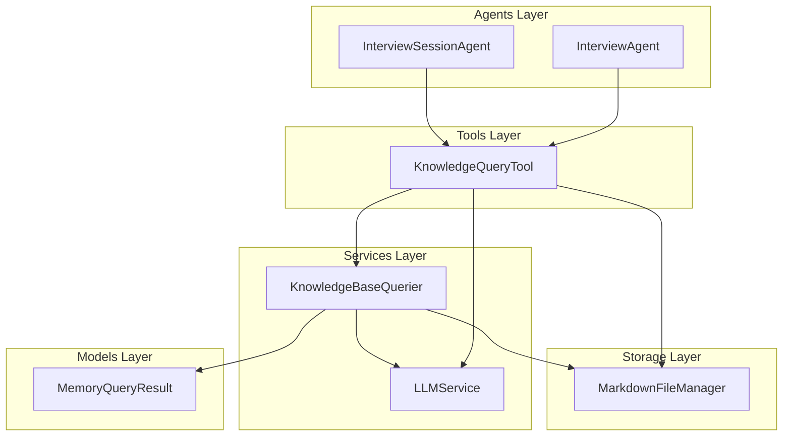
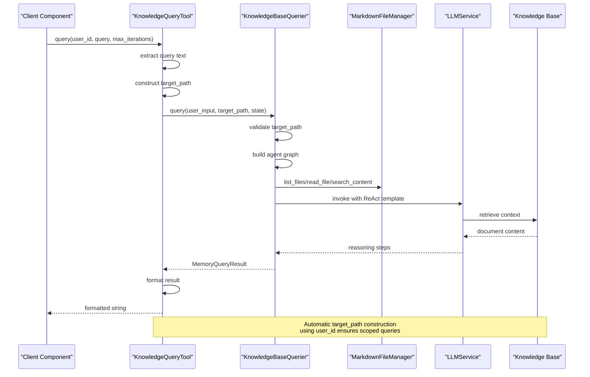
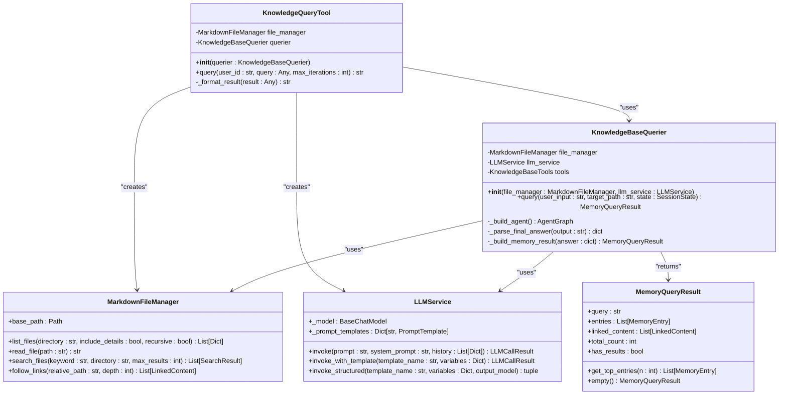
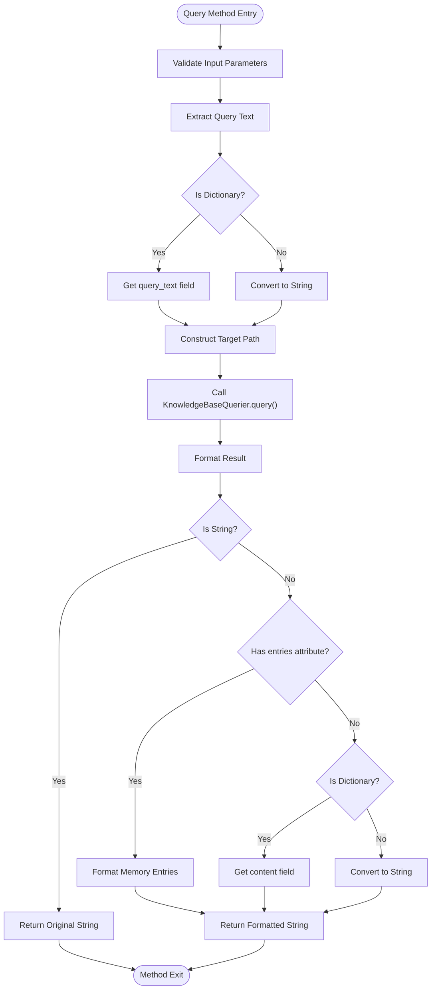
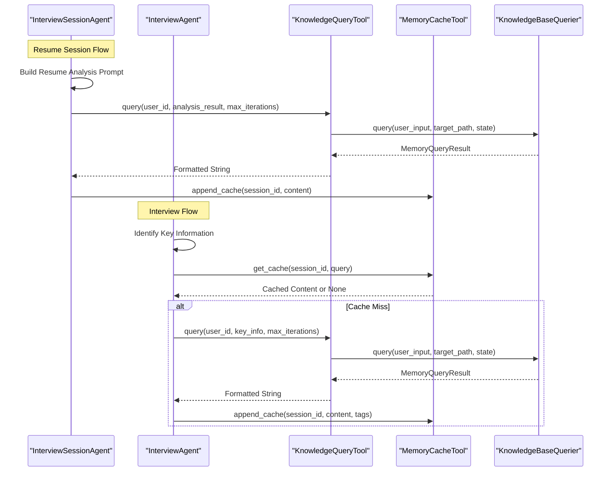
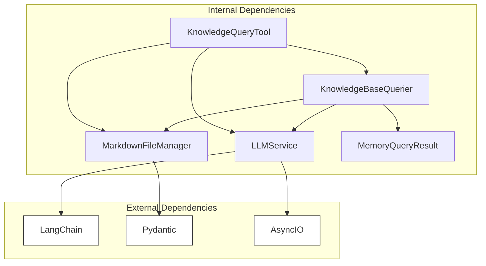

# Knowledge Query Tool

<cite>
**Referenced Files in This Document**
- [knowledge_query_tool.py](file://src/tools/knowledge_query_tool.py)
- [knowledge_base_querier.py](file://src/services/knowledge_base_querier.py)
- [markdown_file_manager.py](file://src/storage/markdown_file_manager.py)
- [llm_service.py](file://src/services/llm_service.py)
- [memory_query_result.py](file://src/models/memory_query_result.py)
- [interview_agent.py](file://src/agents/interview_agent.py)
- [interview_session_agent.py](file://src/agents/interview_session_agent.py)
- [test_kb_tools.py](file://test_kb_tools.py)
</cite>

## Table of Contents
1. [Introduction](#introduction)
2. [Project Structure](#project-structure)
3. [Core Components](#core-components)
4. [Architecture Overview](#architecture-overview)
5. [Detailed Component Analysis](#detailed-component-analysis)
6. [Dependency Analysis](#dependency-analysis)
7. [Performance Considerations](#performance-considerations)
8. [Troubleshooting Guide](#troubleshooting-guide)
9. [Conclusion](#conclusion)

## Introduction
KnowledgeQueryTool serves as a simplified interface for querying the knowledge base, wrapping KnowledgeBaseQuerier to provide a streamlined query method with automatic target path construction and result formatting. It integrates with MarkdownFileManager and LLMService to deliver formatted knowledge context for InterviewAgent and ResumeSession components, enabling intelligent conversation flow and knowledge base integration.

## Project Structure
The KnowledgeQueryTool resides in the tools layer alongside other specialized tools for memory management and caching. It depends on the knowledge base querying service and storage infrastructure.

**Diagram sources**
- [knowledge_query_tool.py:11-31](file://src/tools/knowledge_query_tool.py#L11-L31)
- [knowledge_base_querier.py:202-236](file://src/services/knowledge_base_querier.py#L202-L236)
- [interview_agent.py:58-61](file://src/agents/interview_agent.py#L58-L61)
- [interview_session_agent.py:95-104](file://src/agents/interview_session_agent.py#L95-L104)

**Section sources**
- [knowledge_query_tool.py:11-31](file://src/tools/knowledge_query_tool.py#L11-L31)
- [knowledge_base_querier.py:202-236](file://src/services/knowledge_base_querier.py#L202-L236)

## Core Components
KnowledgeQueryTool provides a focused interface for knowledge base queries with automatic path management and result formatting.

Key responsibilities:
- Encapsulates KnowledgeBaseQuerier for simplified usage
- Automatically constructs target_path using user_id
- Extracts query text from various input formats
- Formats diverse result types into unified string output
- Integrates with MarkdownFileManager and LLMService

**Section sources**
- [knowledge_query_tool.py:11-31](file://src/tools/knowledge_query_tool.py#L11-L31)
- [knowledge_query_tool.py:33-66](file://src/tools/knowledge_query_tool.py#L33-L66)

## Architecture Overview
The KnowledgeQueryTool operates as a facade over the KnowledgeBaseQuerier, providing a clean abstraction for knowledge base interactions while maintaining access to underlying storage and language model capabilities.

**Diagram sources**
- [knowledge_query_tool.py:33-66](file://src/tools/knowledge_query_tool.py#L33-L66)
- [knowledge_base_querier.py:257-373](file://src/services/knowledge_base_querier.py#L257-L373)
- [markdown_file_manager.py:475-528](file://src/storage/markdown_file_manager.py#L475-L528)

## Detailed Component Analysis

### KnowledgeQueryTool Class
The KnowledgeQueryTool class provides a simplified interface for knowledge base queries with automatic path management and result formatting.

**Diagram sources**
- [knowledge_query_tool.py:11-31](file://src/tools/knowledge_query_tool.py#L11-L31)
- [knowledge_base_querier.py:202-236](file://src/services/knowledge_base_querier.py#L202-L236)
- [markdown_file_manager.py:31-78](file://src/storage/markdown_file_manager.py#L31-L78)
- [llm_service.py:32-89](file://src/services/llm_service.py#L32-L89)
- [memory_query_result.py:23-50](file://src/models/memory_query_result.py#L23-L50)

#### Query Method Implementation
The query method handles input processing, target path construction, and result formatting:

**Diagram sources**
- [knowledge_query_tool.py:33-66](file://src/tools/knowledge_query_tool.py#L33-L66)
- [knowledge_query_tool.py:68-81](file://src/tools/knowledge_query_tool.py#L68-L81)

#### Result Formatting Logic
The `_format_result` method handles different response types:

1. **String Results**: Returned unchanged
2. **MemoryQueryResult Objects**: Extract entries and format as "From source: content" pairs
3. **Dictionary Results**: Extract "content" field or fall back to string conversion
4. **Other Types**: Converted to string representation

**Section sources**
- [knowledge_query_tool.py:33-66](file://src/tools/knowledge_query_tool.py#L33-L66)
- [knowledge_query_tool.py:68-81](file://src/tools/knowledge_query_tool.py#L68-L81)

### Integration with InterviewAgent and ResumeSession
KnowledgeQueryTool integrates seamlessly with both InterviewAgent and InterviewSessionAgent for enhanced conversation flow.

**Diagram sources**
- [interview_session_agent.py:202-239](file://src/agents/interview_session_agent.py#L202-L239)
- [interview_agent.py:134-162](file://src/agents/interview_agent.py#L134-L162)

**Section sources**
- [interview_session_agent.py:202-239](file://src/agents/interview_session_agent.py#L202-L239)
- [interview_agent.py:134-162](file://src/agents/interview_agent.py#L134-L162)

### KnowledgeBaseQuerier Integration
The KnowledgeBaseQuerier provides the underlying ReAct agent framework with specialized tools for knowledge base exploration.

Key capabilities:
- **File System Tools**: List files, read files, search content, follow links
- **Path Management**: Safe path construction and validation
- **Exploration Tracking**: Visit history and suspected file marking
- **ReAct Pattern**: Thought → Action → Observation loop with LLM guidance

**Section sources**
- [knowledge_base_querier.py:17-196](file://src/services/knowledge_base_querier.py#L17-L196)
- [knowledge_base_querier.py:202-373](file://src/services/knowledge_base_querier.py#L202-L373)

## Dependency Analysis
The KnowledgeQueryTool maintains loose coupling through dependency injection and follows the principle of composition over inheritance.

**Diagram sources**
- [knowledge_query_tool.py:4-6](file://src/tools/knowledge_query_tool.py#L4-L6)
- [knowledge_base_querier.py:2-12](file://src/services/knowledge_base_querier.py#L2-L12)
- [llm_service.py:7-13](file://src/services/llm_service.py#L7-L13)

**Section sources**
- [knowledge_query_tool.py:4-6](file://src/tools/knowledge_query_tool.py#L4-L6)
- [knowledge_base_querier.py:2-12](file://src/services/knowledge_base_querier.py#L2-L12)

## Performance Considerations
KnowledgeQueryTool implements several performance optimizations:

- **Automatic Target Path Scoping**: Ensures queries remain within user-specific directories, reducing unnecessary file system traversal
- **Result Caching**: Integrated with MemoryCacheTool to avoid redundant queries during conversation sessions
- **Asynchronous Operations**: Full async support for non-blocking I/O operations
- **Efficient Path Construction**: Uses os.path.join for safe and efficient path building
- **Result Formatting Optimization**: Minimal processing overhead with early string return for simple cases

Best practices for optimal performance:
- Use structured query dictionaries with "query_text" field for complex queries
- Leverage the built-in caching mechanism to avoid repeated identical queries
- Monitor token usage through LLMService statistics
- Consider max_iterations tuning based on query complexity

## Troubleshooting Guide
Common issues and solutions when using KnowledgeQueryTool:

### Path Construction Issues
- **Problem**: Queries not returning expected results
- **Cause**: Incorrect target_path construction
- **Solution**: Verify user_id format and ensure knowledge base directory structure exists

### Result Formatting Problems
- **Problem**: Unexpected result types or formatting issues
- **Cause**: Non-standard result objects from KnowledgeBaseQuerier
- **Solution**: Check MemoryQueryResult structure and ensure proper entry attributes

### Integration Issues
- **Problem**: KnowledgeQueryTool not recognized by agents
- **Cause**: Import path or initialization issues
- **Solution**: Verify imports and ensure proper dependency injection

**Section sources**
- [knowledge_query_tool.py:56-66](file://src/tools/knowledge_query_tool.py#L56-L66)
- [interview_agent.py:134-162](file://src/agents/interview_agent.py#L134-L162)

## Conclusion
KnowledgeQueryTool provides a crucial bridge between the knowledge base infrastructure and application components, offering simplified access to complex ReAct-based querying capabilities. Its role in the broader conversation flow is essential for maintaining contextual awareness and providing relevant historical information during interviews. The tool's design emphasizes simplicity, reliability, and performance while maintaining deep integration with the underlying knowledge base management system.

Through its integration with InterviewAgent and InterviewSessionAgent, KnowledgeQueryTool enables sophisticated conversation management that combines human-like dialogue with systematic knowledge base exploration, creating a powerful foundation for personalized interview experiences.