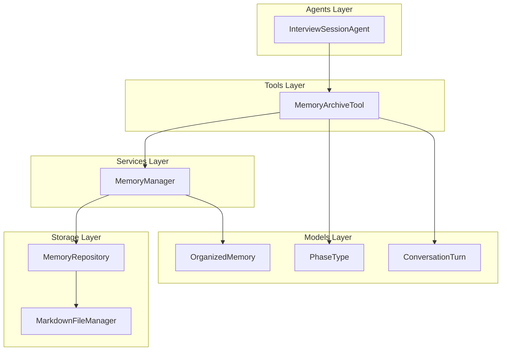
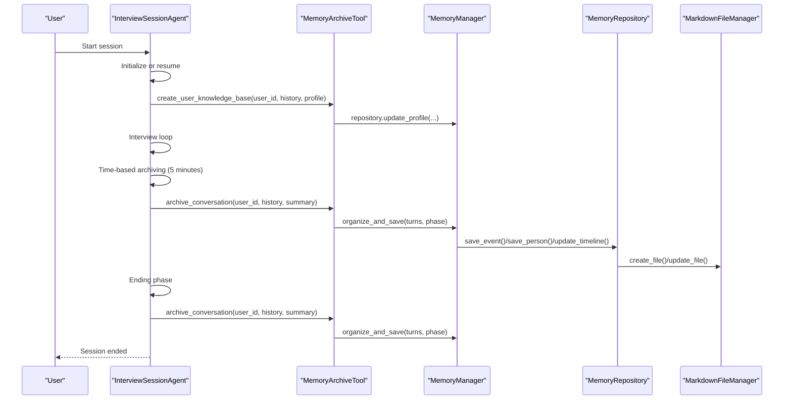
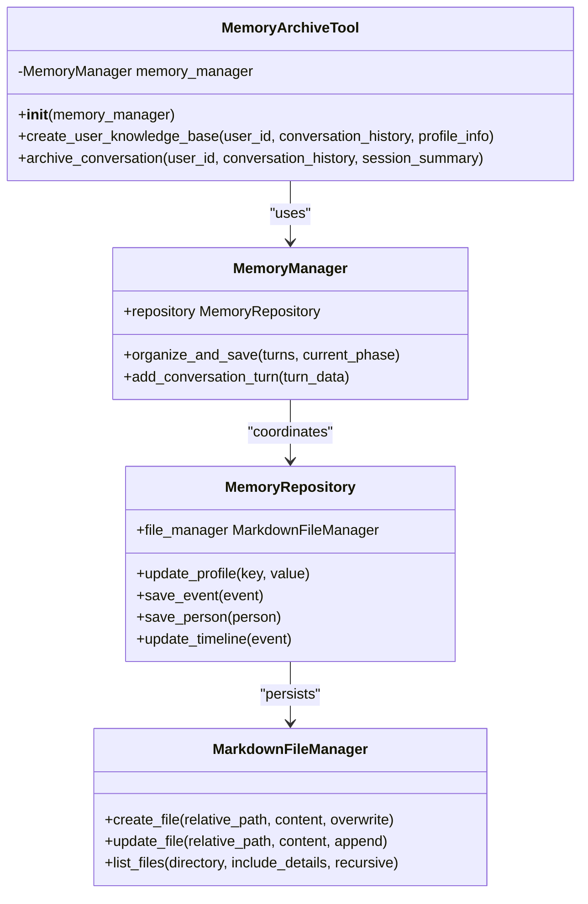
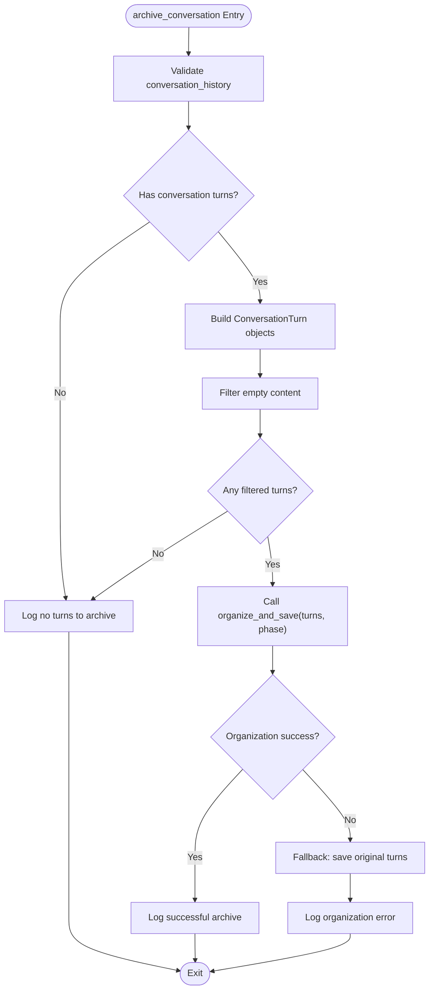
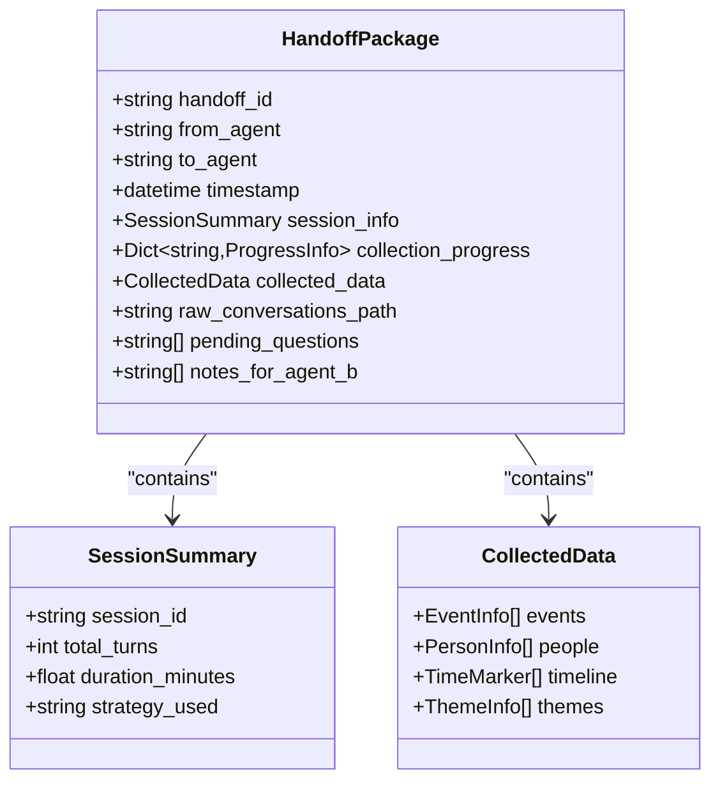
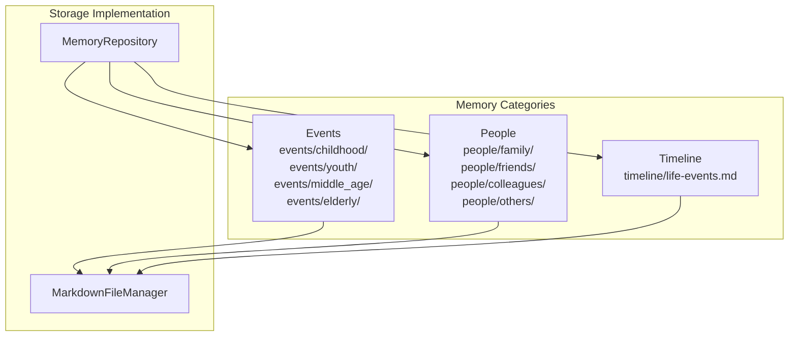
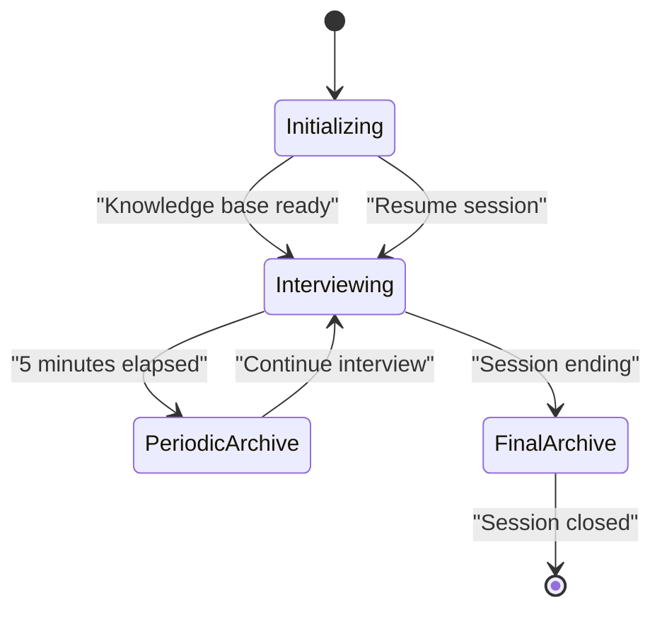
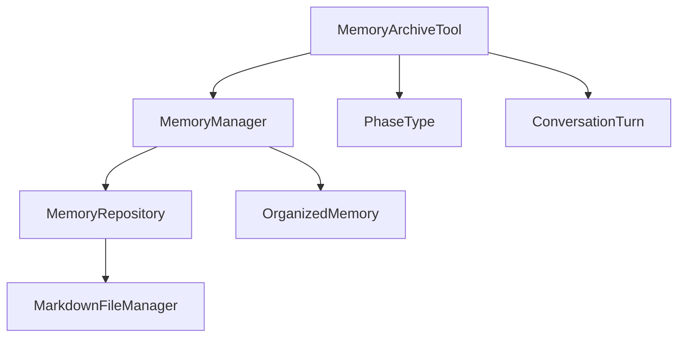

# Memory Archive Tool

<cite>
**Referenced Files in This Document**
- [memory_archive_tool.py](file://src/tools/memory_archive_tool.py)
- [memory_manager.py](file://src/services/memory_manager.py)
- [memory_repository.py](file://src/storage/memory_repository.py)
- [markdown_file_manager.py](file://src/storage/markdown_file_manager.py)
- [handoff_package.py](file://src/models/handoff_package.py)
- [organized_memory.py](file://src/models/organized_memory.py)
- [phase_type.py](file://src/enums/phase_type.py)
- [conversation_turn.py](file://src/models/conversation_turn.py)
- [interview_session_agent.py](file://src/agents/interview_session_agent.py)
- [test_memory_interaction.py](file://test_memory_interaction.py)
</cite>

## Table of Contents
1. [Introduction](#introduction)
2. [Project Structure](#project-structure)
3. [Core Components](#core-components)
4. [Architecture Overview](#architecture-overview)
5. [Detailed Component Analysis](#detailed-component-analysis)
6. [Dependency Analysis](#dependency-analysis)
7. [Performance Considerations](#performance-considerations)
8. [Troubleshooting Guide](#troubleshooting-guide)
9. [Conclusion](#conclusion)
10. [Appendices](#appendices)

## Introduction
MemoryArchiveTool is a specialized tool responsible for session lifecycle data archiving and long-term memory organization. It serves as the bridge between conversational sessions and the persistent knowledge base, ensuring that meaningful insights are preserved for future reference. The tool orchestrates the transformation of raw conversation data into structured memories, manages metadata, and maintains directory organization across events, people, and timeline categories.

## Project Structure
MemoryArchiveTool resides in the tools layer and integrates with higher-level orchestration components. Its primary responsibilities include:
- Creating user knowledge bases during initialization
- Archiving conversation sessions upon completion
- Integrating with MemoryManager for persistent storage
- Managing file organization and metadata during session completion

**Diagram sources**
- [memory_archive_tool.py:10-112](file://src/tools/memory_archive_tool.py#L10-L112)
- [memory_manager.py:27-470](file://src/services/memory_manager.py#L27-L470)
- [memory_repository.py:40-359](file://src/storage/memory_repository.py#L40-L359)
- [markdown_file_manager.py:31-546](file://src/storage/markdown_file_manager.py#L31-L546)
- [interview_session_agent.py:33-482](file://src/agents/interview_session_agent.py#L33-L482)

**Section sources**
- [memory_archive_tool.py:10-112](file://src/tools/memory_archive_tool.py#L10-L112)
- [interview_session_agent.py:112-392](file://src/agents/interview_session_agent.py#L112-L392)

## Core Components
MemoryArchiveTool encapsulates two primary operations:
- create_user_knowledge_base: Initializes a user's knowledge base using profile information and early conversation history
- archive_conversation: Archives a completed session, transforming conversation turns into structured memories and organizing them into appropriate categories

The tool delegates persistence operations to MemoryManager, which coordinates with MemoryRepository and MarkdownFileManager for file system operations. During archive operations, the tool handles error scenarios gracefully, ensuring that conversation data is preserved even when automated organization fails.

**Section sources**
- [memory_archive_tool.py:31-112](file://src/tools/memory_archive_tool.py#L31-L112)
- [memory_manager.py:111-157](file://src/services/memory_manager.py#L111-L157)

## Architecture Overview
MemoryArchiveTool participates in the session lifecycle managed by InterviewSessionAgent. The agent coordinates between initialization, interviewing, and ending phases, invoking MemoryArchiveTool at appropriate milestones to preserve conversation insights.

**Diagram sources**
- [interview_session_agent.py:341-392](file://src/agents/interview_session_agent.py#L341-L392)
- [memory_archive_tool.py:61-112](file://src/tools/memory_archive_tool.py#L61-L112)
- [memory_manager.py:111-157](file://src/services/memory_manager.py#L111-L157)
- [memory_repository.py:176-261](file://src/storage/memory_repository.py#L176-L261)

## Detailed Component Analysis

### MemoryArchiveTool Class
MemoryArchiveTool provides a clean interface for session data preservation. It supports optional injection of a MemoryManager instance, defaulting to an internally constructed manager with a MarkdownFileManager-backed repository.

Key capabilities:
- Knowledge base initialization with profile-driven metadata
- Conversation archiving with structured memory organization
- Graceful error handling with fallback mechanisms
- Integration with human-phase categorization for temporal organization

**Diagram sources**
- [memory_archive_tool.py:10-112](file://src/tools/memory_archive_tool.py#L10-L112)
- [memory_manager.py:27-61](file://src/services/memory_manager.py#L27-L61)
- [memory_repository.py:40-88](file://src/storage/memory_repository.py#L40-L88)
- [markdown_file_manager.py:31-170](file://src/storage/markdown_file_manager.py#L31-L170)

**Section sources**
- [memory_archive_tool.py:10-112](file://src/tools/memory_archive_tool.py#L10-L112)

### archive_data Method Integration
The archive_conversation method transforms conversation history into a format suitable for MemoryManager's organization pipeline. It extracts user and assistant contributions into a structured ConversationTurn format, validates content presence, and delegates to organize_and_save for LLM-driven structuring.

**Diagram sources**
- [memory_archive_tool.py:61-112](file://src/tools/memory_archive_tool.py#L61-L112)
- [memory_manager.py:111-157](file://src/services/memory_manager.py#L111-L157)

**Section sources**
- [memory_archive_tool.py:61-112](file://src/tools/memory_archive_tool.py#L61-L112)

### HandoffPackage Processing
While MemoryArchiveTool does not directly process HandoffPackage instances, the broader session architecture uses HandoffPackage to transfer structured results between agents. The package encapsulates session summaries, collection progress, and collected data for downstream consumption.

**Diagram sources**
- [handoff_package.py:32-66](file://src/models/handoff_package.py#L32-L66)

**Section sources**
- [handoff_package.py:32-66](file://src/models/handoff_package.py#L32-L66)

### Memory Data Organization
MemoryRepository organizes memory data across three primary categories with distinct directory structures and naming conventions:

Events are categorized by human life phases:
- events/childhood/, events/youth/, events/middle_age/, events/elderly/

People are categorized by relationship roles:
- people/family/, people/friends/, people/colleagues/, people/others/

Timeline updates are maintained in a centralized file for cross-referencing.

**Diagram sources**
- [memory_repository.py:176-261](file://src/storage/memory_repository.py#L176-L261)
- [markdown_file_manager.py:80-98](file://src/storage/markdown_file_manager.py#L80-L98)

**Section sources**
- [memory_repository.py:176-261](file://src/storage/memory_repository.py#L176-L261)
- [markdown_file_manager.py:80-98](file://src/storage/markdown_file_manager.py#L80-L98)

### File Naming Conventions and Directory Organization
MemoryArchiveTool relies on standardized naming and organization patterns:
- Event files: Generated from event titles with sanitized characters, limited length, and .md extension
- Person files: Named after individual names with role-based directory placement
- Timeline entries: Structured markdown with cross-references to event files
- Conversation archives: Stored as JSON files with timestamp-based filenames

Directory structure ensures logical separation of concerns and facilitates efficient querying and navigation.

**Section sources**
- [memory_repository.py:349-359](file://src/storage/memory_repository.py#L349-L359)
- [memory_repository.py:338-359](file://src/storage/memory_repository.py#L338-L359)

### Session Lifecycle Contribution
MemoryArchiveTool contributes to the session lifecycle in three key ways:
- Initialization: Creates foundational knowledge base entries from profile information
- Ongoing: Performs periodic archiving during extended interviews (e.g., 5-minute checkpoints)
- Completion: Finalizes session with comprehensive memory organization

**Diagram sources**
- [interview_session_agent.py:341-392](file://src/agents/interview_session_agent.py#L341-L392)

**Section sources**
- [interview_session_agent.py:341-392](file://src/agents/interview_session_agent.py#L341-L392)

## Dependency Analysis
MemoryArchiveTool exhibits clear layering with minimal coupling to external components. The primary dependencies are:
- MemoryManager for orchestration and LLM integration
- MemoryRepository for storage coordination
- MarkdownFileManager for file system operations
- PhaseType enumeration for temporal categorization

**Diagram sources**
- [memory_archive_tool.py:4-6](file://src/tools/memory_archive_tool.py#L4-L6)
- [memory_manager.py:5-13](file://src/services/memory_manager.py#L5-L13)
- [memory_repository.py:8-11](file://src/storage/memory_repository.py#L8-L11)
- [phase_type.py:4-10](file://src/enums/phase_type.py#L4-L10)

**Section sources**
- [memory_archive_tool.py:4-6](file://src/tools/memory_archive_tool.py#L4-L6)
- [memory_manager.py:5-13](file://src/services/memory_manager.py#L5-L13)

## Performance Considerations
MemoryArchiveTool operations are designed for asynchronous execution to minimize latency impact on user interactions. Key performance characteristics include:
- Non-blocking archive operations during session flow
- Efficient fallback mechanisms that avoid repeated processing
- Parallelizable storage operations through MemoryManager coordination
- Minimal memory footprint through streaming file operations

Recommendations for optimal performance:
- Batch conversation turns for organization to reduce LLM invocation overhead
- Monitor file system I/O during high-volume archiving periods
- Consider caching frequently accessed metadata to reduce repository queries

## Troubleshooting Guide
Common issues and resolutions during archive operations:

**Organization Failures**
- Symptom: LLM organization errors during archive_conversation
- Resolution: Automatic fallback saves original conversation turns to short-term memory
- Prevention: Validate conversation content quality before initiating archive

**File System Issues**
- Symptom: Permission errors when creating memory files
- Resolution: Verify write permissions for target knowledge base directory
- Prevention: Pre-validate directory existence and permissions

**Memory Corruption**
- Symptom: Inconsistent memory state after partial failures
- Resolution: Clear session memory and restart archive operation
- Prevention: Implement transaction-like operations for critical sections

**Section sources**
- [memory_archive_tool.py:101-111](file://src/tools/memory_archive_tool.py#L101-L111)
- [memory_manager.py:468-470](file://src/services/memory_manager.py#L468-L470)

## Conclusion
MemoryArchiveTool serves as a critical component in preserving conversational insights for future reference. Through its integration with MemoryManager and MemoryRepository, it ensures robust data organization across events, people, and timeline categories. The tool's graceful error handling and lifecycle integration make it resilient to various operational conditions while maintaining data integrity and accessibility.

## Appendices

### Example Archive Creation Workflows
Workflow 1: Initial Knowledge Base Creation
1. Collect user profile information
2. Transform profile data into repository entries
3. Store initial conversation history in short-term memory
4. Generate knowledge base index files

Workflow 2: Session Completion Archive
1. Extract conversation turns with validated content
2. Convert to structured format for organization
3. Invoke LLM-based memory organization
4. Persist organized memories to appropriate categories
5. Update timeline references and cross-links

### Data Validation Requirements
- Conversation content validation for non-empty turns
- Timestamp consistency for temporal organization
- Metadata completeness for profile updates
- File naming sanitization for system compatibility

### Cleanup Procedures
- Clear temporary conversation buffers after successful archive
- Validate file system cleanup for orphaned entries
- Monitor repository cache for expired entries
- Ensure proper resource disposal in error scenarios

**Section sources**
- [memory_archive_tool.py:31-112](file://src/tools/memory_archive_tool.py#L31-L112)
- [memory_manager.py:468-470](file://src/services/memory_manager.py#L468-L470)
- [test_memory_interaction.py:29-179](file://test_memory_interaction.py#L29-L179)