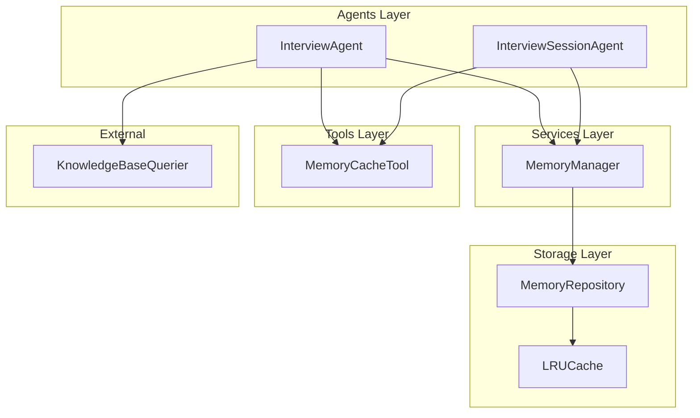
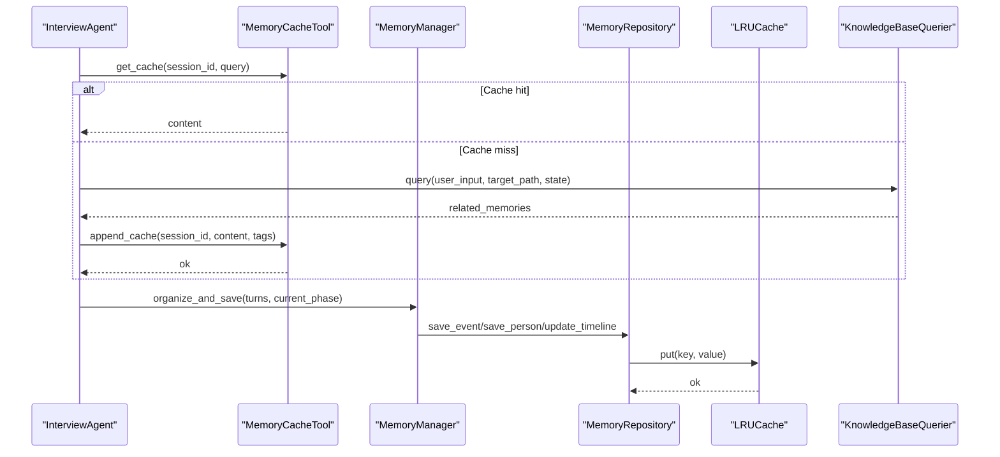
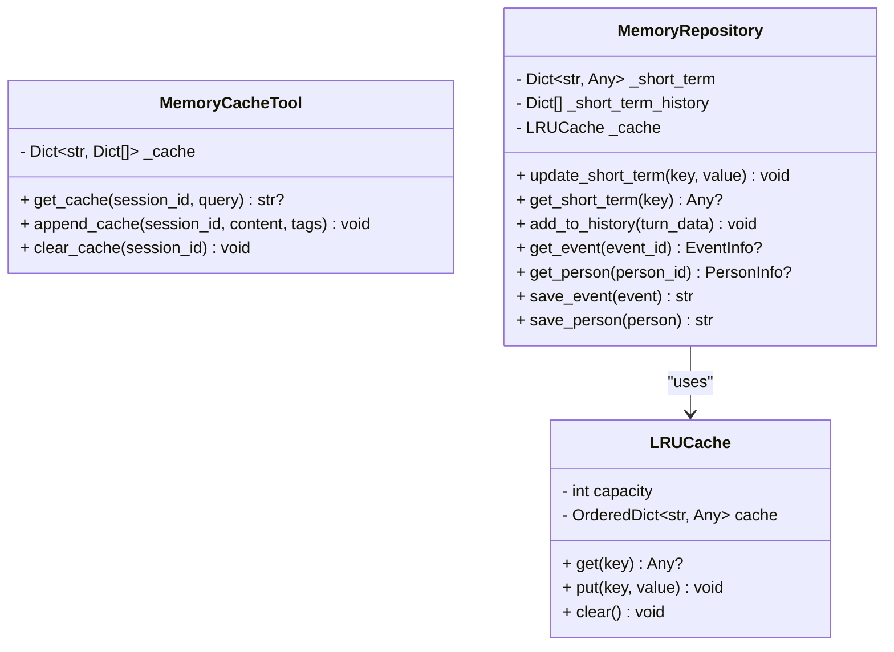
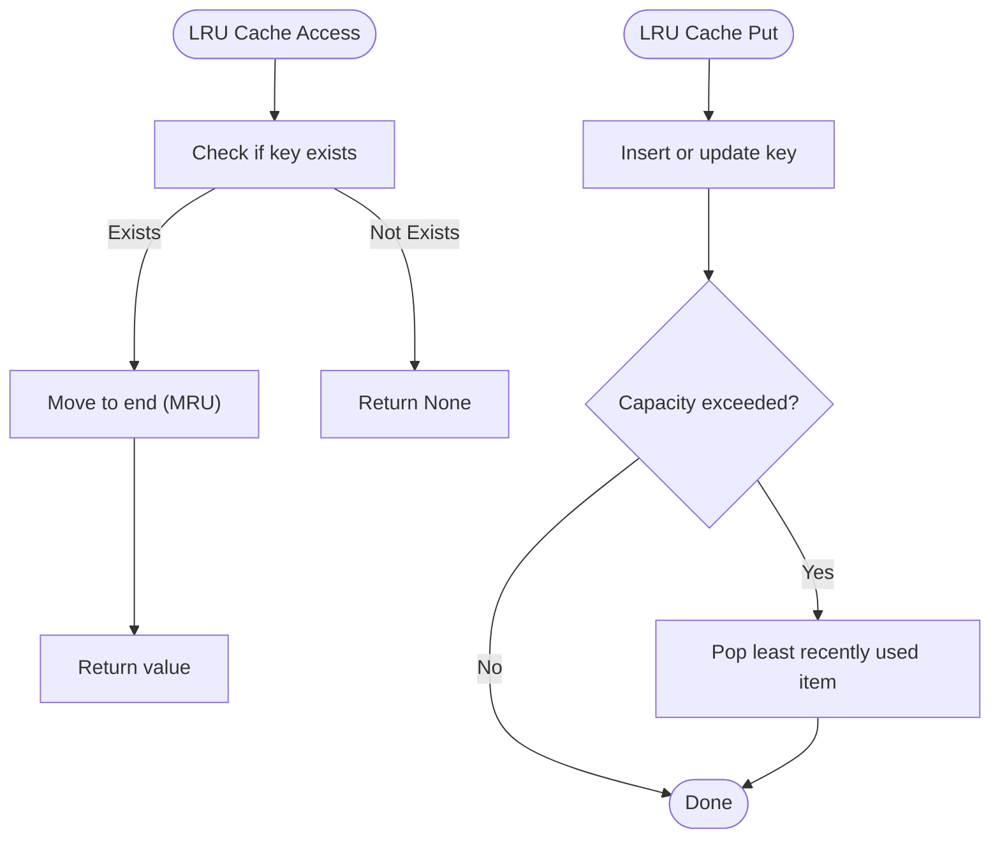
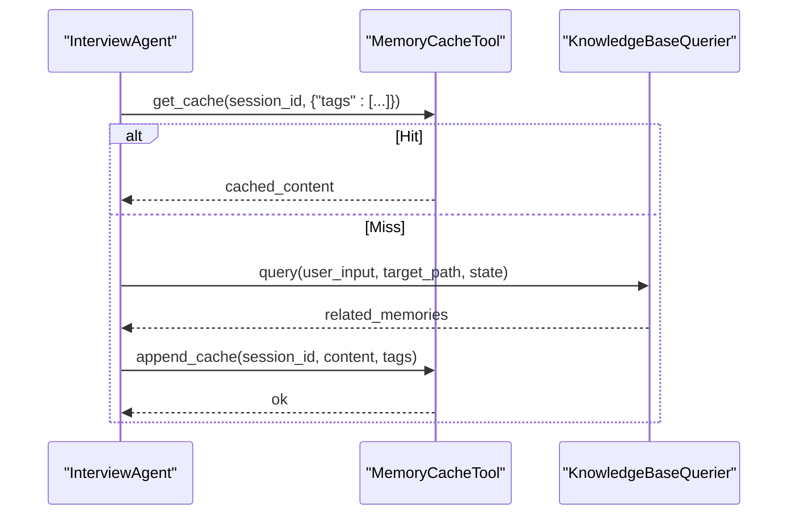
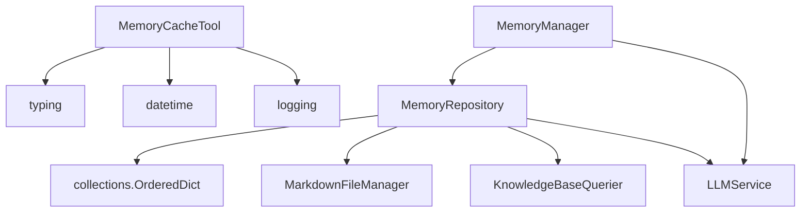

# Memory Cache Tool

<cite>
**Referenced Files in This Document**
- [memory_cache_tool.py](file://src/tools/memory_cache_tool.py)
- [memory_repository.py](file://src/storage/memory_repository.py)
- [memory_manager.py](file://src/services/memory_manager.py)
- [interview_agent.py](file://src/agents/interview_agent.py)
- [interview_session_agent.py](file://src/agents/interview_session_agent.py)
- [knowledge_base_querier.py](file://src/services/knowledge_base_querier.py)
- [__init__.py](file://src/tools/__init__.py)
</cite>

## Table of Contents
1. [Introduction](#introduction)
2. [Project Structure](#project-structure)
3. [Core Components](#core-components)
4. [Architecture Overview](#architecture-overview)
5. [Detailed Component Analysis](#detailed-component-analysis)
6. [Dependency Analysis](#dependency-analysis)
7. [Performance Considerations](#performance-considerations)
8. [Troubleshooting Guide](#troubleshooting-guide)
9. [Conclusion](#conclusion)

## Introduction
This document provides comprehensive documentation for the MemoryCacheTool class, focusing on its role in cache management, LRU eviction algorithms, and performance optimization strategies. It explains cache operations (put, get, delete, and eviction), integration with MemoryRepository for seamless cache-to-persistent storage transitions, configuration and sizing guidance, and thread-safety considerations. It also covers cache invalidation strategies, performance tuning, monitoring, and troubleshooting.

## Project Structure
The MemoryCacheTool resides in the tools package and integrates with the broader memory management stack:
- Tools layer: MemoryCacheTool provides session-scoped caching with tag-based retrieval.
- Services layer: MemoryManager orchestrates memory operations and coordinates with MemoryRepository.
- Storage layer: MemoryRepository manages short-term, long-term, and profile memories, including an LRU cache for frequently accessed items.
- Agents layer: InterviewAgent and InterviewSessionAgent use MemoryCacheTool to accelerate knowledge retrieval during interviews.

**Diagram sources**
- [interview_agent.py:16-200](file://src/agents/interview_agent.py#L16-L200)
- [interview_session_agent.py:33-200](file://src/agents/interview_session_agent.py#L33-L200)
- [memory_manager.py:27-470](file://src/services/memory_manager.py#L27-L470)
- [memory_repository.py:40-359](file://src/storage/memory_repository.py#L40-L359)
- [memory_cache_tool.py:8-89](file://src/tools/memory_cache_tool.py#L8-L89)
- [knowledge_base_querier.py:202-540](file://src/services/knowledge_base_querier.py#L202-L540)

**Section sources**
- [memory_cache_tool.py:1-89](file://src/tools/memory_cache_tool.py#L1-L89)
- [memory_repository.py:1-359](file://src/storage/memory_repository.py#L1-L359)
- [memory_manager.py:1-470](file://src/services/memory_manager.py#L1-L470)
- [interview_agent.py:1-200](file://src/agents/interview_agent.py#L1-L200)
- [interview_session_agent.py:1-200](file://src/agents/interview_session_agent.py#L1-L200)
- [knowledge_base_querier.py:1-540](file://src/services/knowledge_base_querier.py#L1-L540)

## Core Components
- MemoryCacheTool: Provides session-scoped caching with tag-based retrieval and append operations. It stores lists of entries per session, each containing content, tags, and timestamps.
- MemoryRepository: Manages three memory tiers (short-term, long-term, profile) and includes an LRU cache for frequently accessed items. It integrates with persistent storage and caches items for quick retrieval.
- MemoryManager: Orchestrates memory operations, coordinates with MemoryRepository, and exposes higher-level APIs for organizing and saving structured memories.

Key responsibilities:
- MemoryCacheTool: Manage session-level cache, support keyword/tag-based retrieval, and append new cache entries.
- MemoryRepository: Provide LRU caching, short-term memory, long-term persistence, and profile indexing.
- MemoryManager: Coordinate LLM-driven memory organization and apply structured results to storage.

**Section sources**
- [memory_cache_tool.py:8-89](file://src/tools/memory_cache_tool.py#L8-L89)
- [memory_repository.py:40-359](file://src/storage/memory_repository.py#L40-L359)
- [memory_manager.py:27-470](file://src/services/memory_manager.py#L27-L470)

## Architecture Overview
MemoryCacheTool sits alongside MemoryRepository and MemoryManager to optimize memory access patterns:
- Short-term memory: Managed in-memory dictionaries for recent conversation turns and profile updates.
- Long-term memory: Persisted to Markdown files with indices maintained for fast retrieval.
- LRU cache: Maintains hot items in memory to reduce repeated disk reads.
- Session cache: Tag-based cache scoped to a session ID for quick retrieval during interviews.

**Diagram sources**
- [interview_agent.py:115-184](file://src/agents/interview_agent.py#L115-L184)
- [memory_cache_tool.py:34-89](file://src/tools/memory_cache_tool.py#L34-L89)
- [memory_manager.py:111-156](file://src/services/memory_manager.py#L111-L156)
- [memory_repository.py:16-38](file://src/storage/memory_repository.py#L16-L38)
- [knowledge_base_querier.py:257-373](file://src/services/knowledge_base_querier.py#L257-L373)

## Detailed Component Analysis

### MemoryCacheTool
Purpose:
- Provide session-scoped cache for interview contexts.
- Enable tag-based retrieval to quickly locate relevant cached content.
- Append new cache entries with timestamps and tags.

Operations:
- get_cache(session_id, query): Returns cached content if any tag in the query matches an entry’s tags for the given session.
- append_cache(session_id, content, tags): Adds a new entry to the session’s cache list.
- clear_cache(session_id): Removes all entries for a session.

Thread-safety and concurrency:
- The current implementation uses a simple dictionary and list structure without explicit locking. It is suitable for single-threaded or controlled environments. For multi-threaded scenarios, consider adding locks or migrating to a thread-safe cache backend.

Integration with MemoryRepository:
- MemoryRepository maintains an LRU cache for frequently accessed items (e.g., events and persons). While MemoryCacheTool operates at the session level, MemoryRepository’s LRU cache reduces repeated disk reads for long-term items.

Performance characteristics:
- Retrieval complexity: O(n) where n is the number of entries for the session.
- Append complexity: O(1) amortized.
- No built-in eviction policy; growth is unbounded per session.

**Diagram sources**
- [memory_cache_tool.py:8-89](file://src/tools/memory_cache_tool.py#L8-L89)
- [memory_repository.py:16-87](file://src/storage/memory_repository.py#L16-L87)

**Section sources**
- [memory_cache_tool.py:8-89](file://src/tools/memory_cache_tool.py#L8-L89)

### MemoryRepository and LRUCache
Purpose:
- Manage three memory tiers: short-term (in-memory), long-term (persistent), and profile (indexed).
- Provide LRU caching for hot items to minimize disk I/O.

LRU eviction:
- Implemented with an ordered dictionary to track recency.
- On get, accessed items are moved to the end (most recently used).
- On put, if capacity is exceeded, the least recently used item is removed from the front.

Long-term memory operations:
- save_event and save_person persist items to Markdown files and update indices.
- get_event and get_person first check the LRU cache, then fall back to indices.

Capacity management:
- Short-term capacity controls conversation history length.
- LRU cache capacity controls hot item retention.

**Diagram sources**
- [memory_repository.py:16-38](file://src/storage/memory_repository.py#L16-L38)

**Section sources**
- [memory_repository.py:16-359](file://src/storage/memory_repository.py#L16-L359)

### Integration with Interview Agents
MemoryCacheTool is used by InterviewAgent and InterviewSessionAgent to:
- Retrieve cached knowledge based on tags extracted from user input.
- Append newly discovered knowledge to the cache for subsequent rounds.
- Reduce repeated knowledge base queries and improve responsiveness.

**Diagram sources**
- [interview_agent.py:115-184](file://src/agents/interview_agent.py#L115-L184)
- [memory_cache_tool.py:34-89](file://src/tools/memory_cache_tool.py#L34-L89)
- [knowledge_base_querier.py:257-373](file://src/services/knowledge_base_querier.py#L257-L373)

**Section sources**
- [interview_agent.py:115-184](file://src/agents/interview_agent.py#L115-L184)
- [interview_session_agent.py:94-105](file://src/agents/interview_session_agent.py#L94-L105)

## Dependency Analysis
- MemoryCacheTool depends on:
  - Python typing and datetime for type hints and timestamps.
  - Logging for diagnostics.
- MemoryRepository depends on:
  - Ordered dictionary for LRU implementation.
  - MarkdownFileManager for file operations.
  - KnowledgeBaseQuerier and LLM service for knowledge processing.
- MemoryManager depends on:
  - MemoryRepository for storage operations.
  - LLMService for memory organization.

**Diagram sources**
- [memory_cache_tool.py:1-5](file://src/tools/memory_cache_tool.py#L1-L5)
- [memory_repository.py:1-11](file://src/storage/memory_repository.py#L1-L11)
- [memory_manager.py:1-13](file://src/services/memory_manager.py#L1-L13)

**Section sources**
- [memory_cache_tool.py:1-5](file://src/tools/memory_cache_tool.py#L1-L5)
- [memory_repository.py:1-11](file://src/storage/memory_repository.py#L1-L11)
- [memory_manager.py:1-13](file://src/services/memory_manager.py#L1-L13)

## Performance Considerations
- MemoryCacheTool retrieval cost is linear in the number of entries per session. For sessions with many entries, consider:
  - Limiting session cache size by periodically clearing old entries.
  - Using a more efficient data structure (e.g., inverted index by tags) for faster lookups.
- MemoryRepository LRU cache:
  - Tune capacity based on available memory and access patterns.
  - Monitor cache hit rates to adjust capacity dynamically.
- Concurrency:
  - Current implementation is not thread-safe. For multi-threaded usage, add locks or migrate to a thread-safe cache backend.
- Disk I/O:
  - Prefer MemoryRepository’s LRU cache to minimize repeated file reads.
  - Batch operations where possible to reduce I/O overhead.

[No sources needed since this section provides general guidance]

## Troubleshooting Guide
Common issues and resolutions:
- Cache misses despite relevant content:
  - Verify tag extraction logic and ensure tags align with cache entries.
  - Confirm session_id consistency across get and append calls.
- Slow retrieval in long sessions:
  - Clear expired or irrelevant cache entries periodically.
  - Consider pruning cache entries older than a threshold.
- Memory growth:
  - Implement periodic cleanup of old session entries.
  - Monitor cache sizes and adjust capacities accordingly.
- Thread-safety concerns:
  - Add synchronization primitives or switch to a thread-safe cache backend.
- Integration issues:
  - Ensure KnowledgeBaseQuerier is configured with the correct target path and state.
  - Validate that MemoryManager is initialized with the correct MemoryRepository.

**Section sources**
- [interview_agent.py:115-184](file://src/agents/interview_agent.py#L115-L184)
- [memory_cache_tool.py:34-89](file://src/tools/memory_cache_tool.py#L34-L89)
- [memory_repository.py:16-38](file://src/storage/memory_repository.py#L16-L38)

## Conclusion
MemoryCacheTool provides a lightweight, session-scoped caching mechanism that accelerates knowledge retrieval during interviews. Combined with MemoryRepository’s LRU cache and MemoryManager’s orchestration, it balances performance with data consistency. For production deployments, consider thread-safety improvements, cache size limits, and monitoring to maintain responsiveness and memory efficiency.