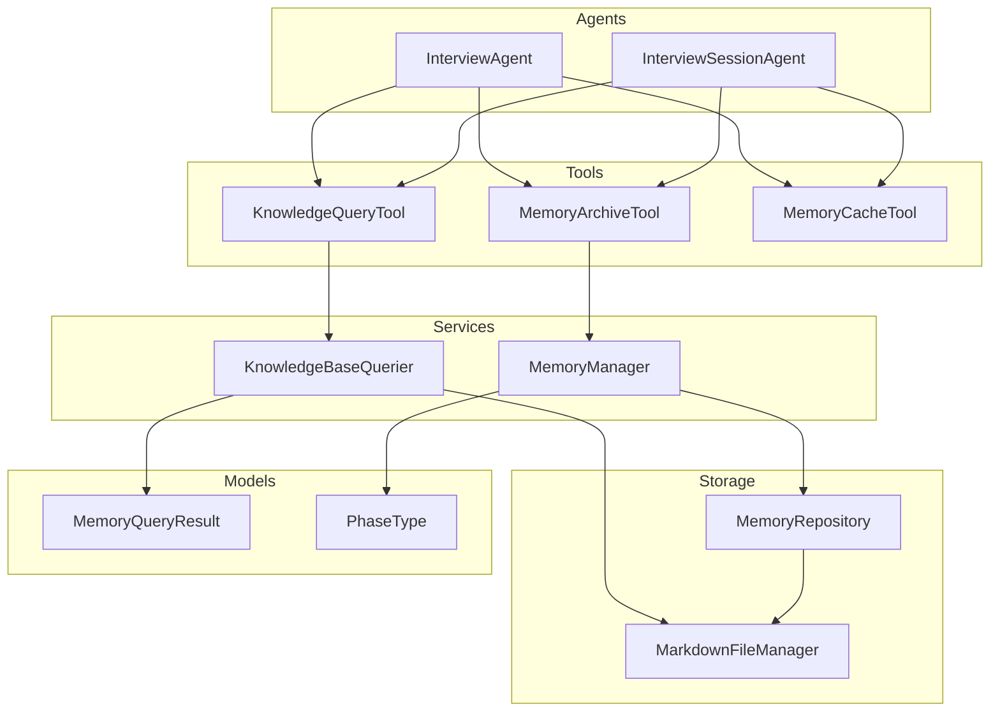
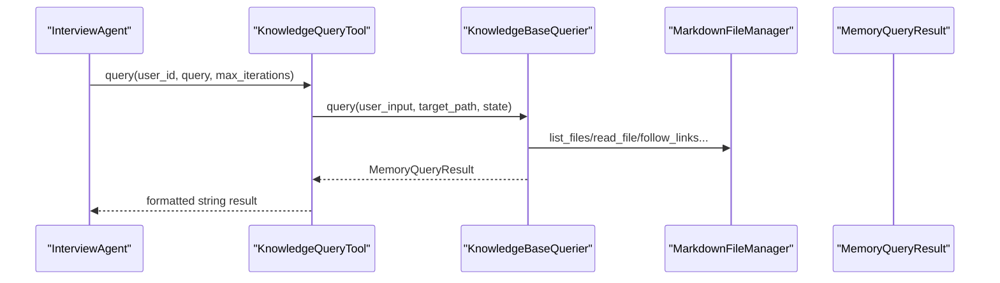
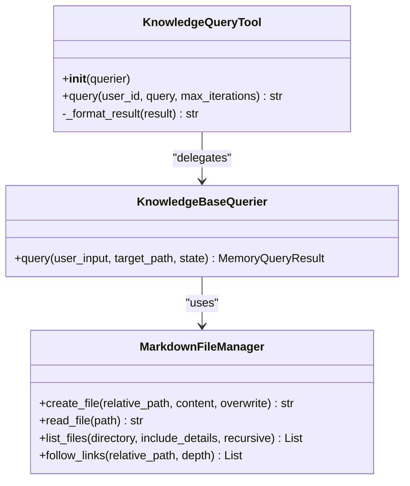
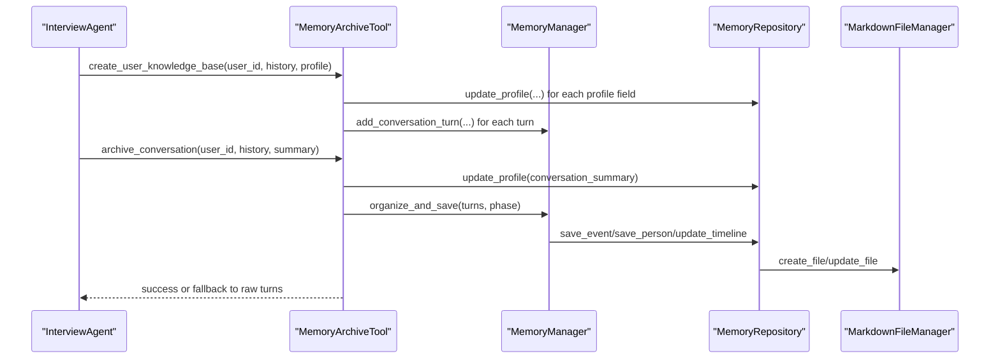
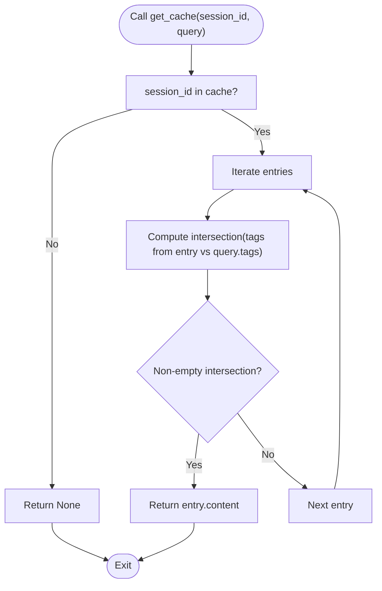
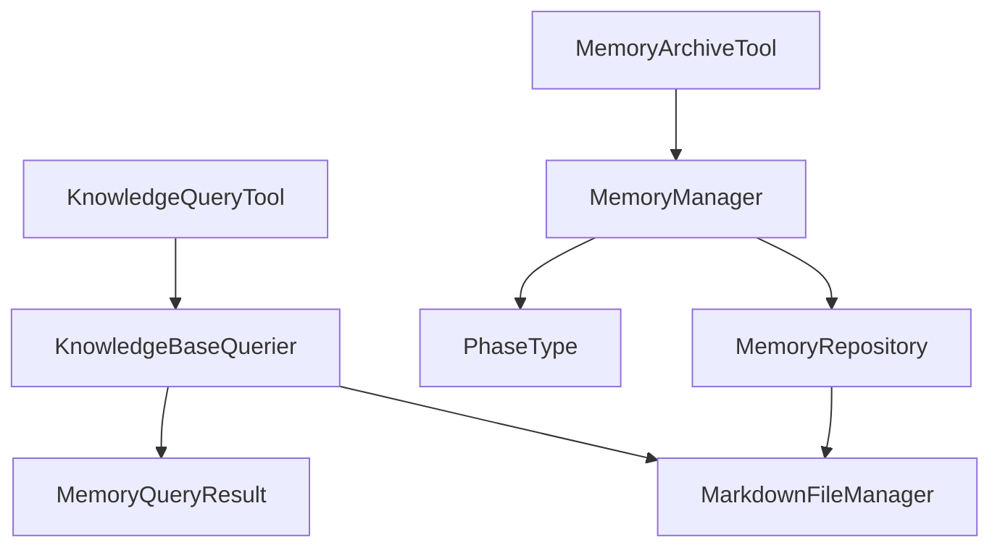

# Tools and Utilities

<cite>
**Referenced Files in This Document**
- [knowledge_query_tool.py](file://src/tools/knowledge_query_tool.py)
- [memory_archive_tool.py](file://src/tools/memory_archive_tool.py)
- [memory_cache_tool.py](file://src/tools/memory_cache_tool.py)
- [knowledge_base_querier.py](file://src/services/knowledge_base_querier.py)
- [memory_manager.py](file://src/services/memory_manager.py)
- [memory_repository.py](file://src/storage/memory_repository.py)
- [markdown_file_manager.py](file://src/storage/markdown_file_manager.py)
- [memory_query_result.py](file://src/models/memory_query_result.py)
- [phase_type.py](file://src/enums/phase_type.py)
- [test_kb_tools.py](file://test_kb_tools.py)
- [interview_agent.py](file://src/agents/interview_agent.py)
- [interview_session_agent.py](file://src/agents/interview_session_agent.py)
</cite>

## Table of Contents
1. [Introduction](#introduction)
2. [Project Structure](#project-structure)
3. [Core Components](#core-components)
4. [Architecture Overview](#architecture-overview)
5. [Detailed Component Analysis](#detailed-component-analysis)
6. [Dependency Analysis](#dependency-analysis)
7. [Performance Considerations](#performance-considerations)
8. [Troubleshooting Guide](#troubleshooting-guide)
9. [Conclusion](#conclusion)
10. [Appendices](#appendices)

## Introduction
This document provides comprehensive documentation for three utility tools and helper classes that integrate with the memory and knowledge base system:
- KnowledgeQueryTool: wraps the knowledge base ReAct-style querying pipeline and formats results for downstream consumption.
- MemoryArchiveTool: orchestrates session completion by organizing and persisting conversation history and profiles into the knowledge base.
- MemoryCacheTool: provides lightweight in-memory caching for session-scoped short-term memory with tag-based retrieval.

It explains implementation details, usage patterns, integration points, error handling, performance considerations, and extension guidelines. Concrete examples are provided via file references and diagrams.

## Project Structure
The tools live under src/tools and integrate with services and storage layers:
- Tools depend on services (KnowledgeBaseQuerier, MemoryManager) and storage (MarkdownFileManager, MemoryRepository).
- Models define the shape of query results and memory entries.
- Agents consume tools to drive conversation orchestration and session completion.

**Diagram sources**
- [interview_agent.py:8-60](file://src/agents/interview_agent.py#L8-L60)
- [interview_session_agent.py:12-104](file://src/agents/interview_session_agent.py#L12-L104)
- [knowledge_query_tool.py:11-32](file://src/tools/knowledge_query_tool.py#L11-L32)
- [memory_archive_tool.py:10-29](file://src/tools/memory_archive_tool.py#L10-L29)
- [memory_cache_tool.py:8-32](file://src/tools/memory_cache_tool.py#L8-L32)
- [knowledge_base_querier.py:202-236](file://src/services/knowledge_base_querier.py#L202-L236)
- [memory_manager.py:27-61](file://src/services/memory_manager.py#L27-L61)
- [memory_repository.py:40-87](file://src/storage/memory_repository.py#L40-L87)
- [markdown_file_manager.py:31-77](file://src/storage/markdown_file_manager.py#L31-L77)
- [memory_query_result.py:23-50](file://src/models/memory_query_result.py#L23-L50)
- [phase_type.py:4-10](file://src/enums/phase_type.py#L4-L10)

**Section sources**
- [interview_agent.py:8-60](file://src/agents/interview_agent.py#L8-L60)
- [interview_session_agent.py:12-104](file://src/agents/interview_session_agent.py#L12-L104)
- [knowledge_query_tool.py:11-32](file://src/tools/knowledge_query_tool.py#L11-L32)
- [memory_archive_tool.py:10-29](file://src/tools/memory_archive_tool.py#L10-L29)
- [memory_cache_tool.py:8-32](file://src/tools/memory_cache_tool.py#L8-L32)
- [knowledge_base_querier.py:202-236](file://src/services/knowledge_base_querier.py#L202-L236)
- [memory_manager.py:27-61](file://src/services/memory_manager.py#L27-L61)
- [memory_repository.py:40-87](file://src/storage/memory_repository.py#L40-L87)
- [markdown_file_manager.py:31-77](file://src/storage/markdown_file_manager.py#L31-L77)
- [memory_query_result.py:23-50](file://src/models/memory_query_result.py#L23-L50)
- [phase_type.py:4-10](file://src/enums/phase_type.py#L4-L10)

## Core Components
- KnowledgeQueryTool: encapsulates KnowledgeBaseQuerier, extracts and normalizes queries, ensures target_path scoping, and formats results into a unified string representation.
- MemoryArchiveTool: manages creation of user knowledge base during initialization and archives completed sessions by organizing conversation turns and saving summaries.
- MemoryCacheTool: provides a simple in-memory cache keyed by session_id with tag-based matching for quick retrieval of session-scoped content.

Key responsibilities and integration points are detailed in the following sections.

**Section sources**
- [knowledge_query_tool.py:11-81](file://src/tools/knowledge_query_tool.py#L11-L81)
- [memory_archive_tool.py:10-112](file://src/tools/memory_archive_tool.py#L10-L112)
- [memory_cache_tool.py:8-89](file://src/tools/memory_cache_tool.py#L8-L89)

## Architecture Overview
The tools operate at the orchestration layer, delegating to services and storage for persistence and retrieval. KnowledgeQueryTool leverages KnowledgeBaseQuerier (ReAct agent) to produce MemoryQueryResult, which is then formatted for agent consumption. MemoryArchiveTool coordinates MemoryManager and MemoryRepository to persist structured memories and timelines. MemoryCacheTool offers lightweight caching for short-term session memory.

**Diagram sources**
- [knowledge_query_tool.py:33-66](file://src/tools/knowledge_query_tool.py#L33-L66)
- [knowledge_base_querier.py:257-373](file://src/services/knowledge_base_querier.py#L257-L373)
- [markdown_file_manager.py:31-77](file://src/storage/markdown_file_manager.py#L31-L77)
- [memory_query_result.py:23-50](file://src/models/memory_query_result.py#L23-L50)

**Section sources**
- [knowledge_query_tool.py:33-66](file://src/tools/knowledge_query_tool.py#L33-L66)
- [knowledge_base_querier.py:257-373](file://src/services/knowledge_base_querier.py#L257-L373)
- [memory_query_result.py:23-50](file://src/models/memory_query_result.py#L23-L50)

## Detailed Component Analysis

### KnowledgeQueryTool
- Purpose: Provide a concise interface to query the knowledge base scoped to a user’s directory and return a formatted string result.
- Key behaviors:
  - Accepts either a string or dict query; normalizes to a query_text.
  - Builds target_path as "./knowledge_base/{user_id}".
  - Delegates to KnowledgeBaseQuerier.query and formats results via _format_result.
  - Supports multiple result shapes: str, MemoryQueryResult.entries, dict, or fallback to str.
- Integration:
  - Uses MarkdownFileManager with base_path "./knowledge_base".
  - Uses LLMService via KnowledgeBaseQuerier.
- Usage pattern:
  - Called by InterviewAgent or InterviewSessionAgent after determining relevant context.
- Error handling:
  - Returns empty result when target_path is invalid or when KnowledgeBaseQuerier fails.

**Diagram sources**
- [knowledge_query_tool.py:11-81](file://src/tools/knowledge_query_tool.py#L11-L81)
- [knowledge_base_querier.py:202-236](file://src/services/knowledge_base_querier.py#L202-L236)
- [markdown_file_manager.py:134-200](file://src/storage/markdown_file_manager.py#L134-L200)

**Section sources**
- [knowledge_query_tool.py:25-66](file://src/tools/knowledge_query_tool.py#L25-L66)
- [knowledge_base_querier.py:257-373](file://src/services/knowledge_base_querier.py#L257-L373)
- [markdown_file_manager.py:134-200](file://src/storage/markdown_file_manager.py#L134-L200)

#### Example usage
- Agent invokes KnowledgeQueryTool.query with user_id and a query payload.
- Tool resolves target_path and calls KnowledgeBaseQuerier.query.
- Tool formats the returned MemoryQueryResult into a human-readable string.

References:
- [interview_agent.py:8-60](file://src/agents/interview_agent.py#L8-L60)
- [interview_session_agent.py:94-104](file://src/agents/interview_session_agent.py#L94-L104)

### MemoryArchiveTool
- Purpose: Archive conversation sessions and initialize user knowledge bases during onboarding.
- Key behaviors:
  - create_user_knowledge_base: persists profile info and initial conversation turns into short-term memory.
  - archive_conversation: saves session summary and organizes conversation turns into structured memories via MemoryManager; falls back to raw turns if organization fails.
- Integration:
  - Uses MemoryManager and MemoryRepository.
  - Writes to MarkdownFileManager-backed directories (events, people, timeline).
  - Uses PhaseType for categorization defaults.
- Error handling:
  - Logs failures during organize_and_save and writes raw turns as a safety net.

**Diagram sources**
- [memory_archive_tool.py:31-112](file://src/tools/memory_archive_tool.py#L31-L112)
- [memory_manager.py:111-157](file://src/services/memory_manager.py#L111-L157)
- [memory_repository.py:176-226](file://src/storage/memory_repository.py#L176-L226)
- [markdown_file_manager.py:134-170](file://src/storage/markdown_file_manager.py#L134-L170)
- [phase_type.py:4-10](file://src/enums/phase_type.py#L4-L10)

**Section sources**
- [memory_archive_tool.py:31-112](file://src/tools/memory_archive_tool.py#L31-L112)
- [memory_manager.py:111-157](file://src/services/memory_manager.py#L111-L157)
- [memory_repository.py:176-226](file://src/storage/memory_repository.py#L176-L226)
- [phase_type.py:4-10](file://src/enums/phase_type.py#L4-L10)

#### Example usage
- After collecting profile data, call create_user_knowledge_base to seed short-term memory.
- At session end, call archive_conversation to persist structured memories and update timeline.

References:
- [interview_agent.py:8-60](file://src/agents/interview_agent.py#L8-L60)
- [interview_session_agent.py:94-104](file://src/agents/interview_session_agent.py#L94-L104)

### MemoryCacheTool
- Purpose: Provide lightweight in-memory caching for session-scoped short-term memory with tag-based retrieval.
- Key behaviors:
  - get_cache(session_id, query): returns first cache entry whose tags intersect with the query tags.
  - append_cache(session_id, content, tags): appends a new entry with timestamp.
  - clear_cache(session_id): removes all entries for a session.
- Storage structure:
  - Dict keyed by session_id mapping to a list of entries containing content, tags, and timestamp.
- Notes:
  - Current implementation uses in-memory storage; production should use Redis-compatible cache.

**Diagram sources**
- [memory_cache_tool.py:34-61](file://src/tools/memory_cache_tool.py#L34-L61)

**Section sources**
- [memory_cache_tool.py:8-89](file://src/tools/memory_cache_tool.py#L8-L89)

#### Example usage
- Append contextual facts with tags during conversation.
- Retrieve cached content by providing overlapping tags.

References:
- [interview_agent.py:8-60](file://src/agents/interview_agent.py#L8-L60)
- [interview_session_agent.py:94-104](file://src/agents/interview_session_agent.py#L94-L104)

## Dependency Analysis
- KnowledgeQueryTool depends on KnowledgeBaseQuerier and MarkdownFileManager.
- KnowledgeBaseQuerier depends on MarkdownFileManager and LLMService, and constructs a ReAct agent with a toolset.
- MemoryArchiveTool depends on MemoryManager, which in turn depends on MemoryRepository and LLMService.
- MemoryRepository depends on MarkdownFileManager and maintains LRUCache and in-memory indices.
- MemoryQueryResult defines the result contract used across the system.

**Diagram sources**
- [knowledge_query_tool.py:25-31](file://src/tools/knowledge_query_tool.py#L25-L31)
- [knowledge_base_querier.py:220-236](file://src/services/knowledge_base_querier.py#L220-L236)
- [memory_archive_tool.py:24-29](file://src/tools/memory_archive_tool.py#L24-L29)
- [memory_manager.py:47-61](file://src/services/memory_manager.py#L47-L61)
- [memory_repository.py:54-87](file://src/storage/memory_repository.py#L54-L87)
- [memory_query_result.py:23-50](file://src/models/memory_query_result.py#L23-L50)
- [phase_type.py:4-10](file://src/enums/phase_type.py#L4-L10)

**Section sources**
- [knowledge_query_tool.py:25-31](file://src/tools/knowledge_query_tool.py#L25-L31)
- [knowledge_base_querier.py:220-236](file://src/services/knowledge_base_querier.py#L220-L236)
- [memory_archive_tool.py:24-29](file://src/tools/memory_archive_tool.py#L24-L29)
- [memory_manager.py:47-61](file://src/services/memory_manager.py#L47-L61)
- [memory_repository.py:54-87](file://src/storage/memory_repository.py#L54-L87)
- [memory_query_result.py:23-50](file://src/models/memory_query_result.py#L23-L50)
- [phase_type.py:4-10](file://src/enums/phase_type.py#L4-L10)

## Performance Considerations
- Knowledge base queries:
  - ReAct agent explores recursively; prefer narrowing target_path to reduce IO.
  - Use list_files with recursive enabled once per session to minimize repeated scans.
  - follow_links can be expensive; limit depth and rely on mark_suspected_file to pre-filter candidates.
- Memory persistence:
  - MemoryManager.apply_organized_memory performs parallel saves; ensure adequate concurrency limits.
  - MemoryRepository.update_timeline appends to a single file; consider batching updates for high-frequency scenarios.
- Caching:
  - MemoryCacheTool uses in-memory storage; for distributed systems, replace with Redis to avoid cache misses across instances.
  - Tag-based retrieval is linear over cached entries; keep tag sets small and representative.
- File operations:
  - MarkdownFileManager.search_files reads all MD files; restrict search scope and keywords to improve latency.

[No sources needed since this section provides general guidance]

## Troubleshooting Guide
Common issues and resolutions:
- KnowledgeQueryTool returns empty result:
  - Verify target_path exists and is a directory; ensure user_id is correct.
  - Check KnowledgeBaseQuerier logs for parsing errors or missing templates.
- MemoryArchiveTool fails to organize:
  - Review MemoryManager logs for LLM invocation errors; fallback writes raw turns.
  - Confirm conversation history conforms to expected structure (role/content/timestamp).
- MemoryCacheTool yields None:
  - Ensure tags overlap between query and stored entries.
  - Clear cache for a session if stale data is present.

**Section sources**
- [knowledge_query_tool.py:56-66](file://src/tools/knowledge_query_tool.py#L56-L66)
- [knowledge_base_querier.py:368-373](file://src/services/knowledge_base_querier.py#L368-L373)
- [memory_archive_tool.py:91-111](file://src/tools/memory_archive_tool.py#L91-L111)
- [memory_cache_tool.py:49-61](file://src/tools/memory_cache_tool.py#L49-L61)

## Conclusion
These tools form the backbone of memory and knowledge base interactions:
- KnowledgeQueryTool streamlines ReAct-based querying and result formatting.
- MemoryArchiveTool ensures robust session completion and knowledge base growth.
- MemoryCacheTool enables efficient session-level caching with straightforward tag-based retrieval.

Adopt the usage patterns and performance recommendations outlined above to build reliable, scalable integrations.

[No sources needed since this section summarizes without analyzing specific files]

## Appendices

### API Definitions and Interfaces

- KnowledgeQueryTool.query
  - Inputs: user_id (str), query (Any), max_iterations (int, default 5)
  - Output: formatted result (str)
  - Behavior: normalize query, scope target_path to "./knowledge_base/{user_id}", delegate to KnowledgeBaseQuerier, format result

- MemoryArchiveTool.create_user_knowledge_base
  - Inputs: user_id (str), conversation_history (List[Dict]), profile_info (Dict[str, Any])
  - Behavior: persist profile fields and initial turns to short-term memory

- MemoryArchiveTool.archive_conversation
  - Inputs: user_id (str), conversation_history (List[Dict]), session_summary (str)
  - Behavior: persist summary, convert turns, organize and save via MemoryManager, fallback to raw turns on failure

- MemoryCacheTool.get_cache
  - Inputs: session_id (str), query (Dict with tags)
  - Output: content (Optional[str])

- MemoryCacheTool.append_cache
  - Inputs: session_id (str), content (str), tags (List[str], optional)
  - Behavior: append entry with timestamp

- MemoryCacheTool.clear_cache
  - Inputs: session_id (str)
  - Behavior: remove all entries for session

**Section sources**
- [knowledge_query_tool.py:33-66](file://src/tools/knowledge_query_tool.py#L33-L66)
- [memory_archive_tool.py:31-112](file://src/tools/memory_archive_tool.py#L31-L112)
- [memory_cache_tool.py:34-89](file://src/tools/memory_cache_tool.py#L34-L89)

### Plugin Architecture and Extension Points
- KnowledgeBaseQuerier exposes a toolset (list_files, read_file, follow_links, mark_suspected_file, get_exploration_report, has_visited) suitable for extending the ReAct agent’s capabilities.
- MemoryRepository supports pluggable storage via MarkdownFileManager; future extensions could swap to cloud storage or vector stores.
- MemoryManager orchestrates LLM-driven organization; new extraction templates can be added to LLMService to support richer memory types.

**Section sources**
- [knowledge_base_querier.py:54-196](file://src/services/knowledge_base_querier.py#L54-L196)
- [memory_repository.py:54-87](file://src/storage/memory_repository.py#L54-L87)
- [memory_manager.py:47-61](file://src/services/memory_manager.py#L47-L61)

### Concrete Examples and References
- Testing KnowledgeBaseTools end-to-end behavior and path exploration:
  - [test_kb_tools.py:49-121](file://test_kb_tools.py#L49-L121)

- Agent usage of tools:
  - [interview_agent.py:8-60](file://src/agents/interview_agent.py#L8-L60)
  - [interview_session_agent.py:94-104](file://src/agents/interview_session_agent.py#L94-L104)

**Section sources**
- [test_kb_tools.py:49-121](file://test_kb_tools.py#L49-L121)
- [interview_agent.py:8-60](file://src/agents/interview_agent.py#L8-L60)
- [interview_session_agent.py:94-104](file://src/agents/interview_session_agent.py#L94-L104)