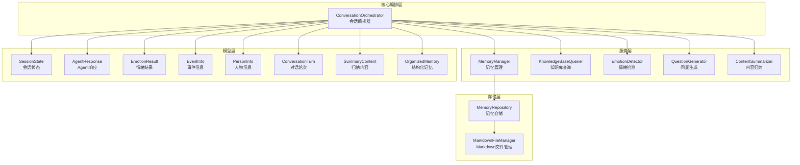
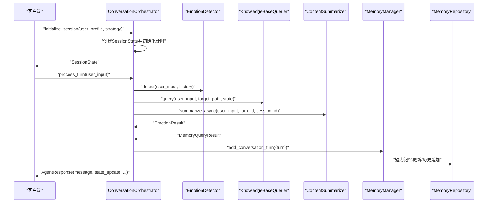
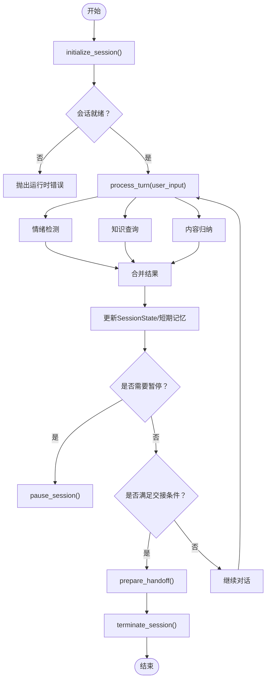
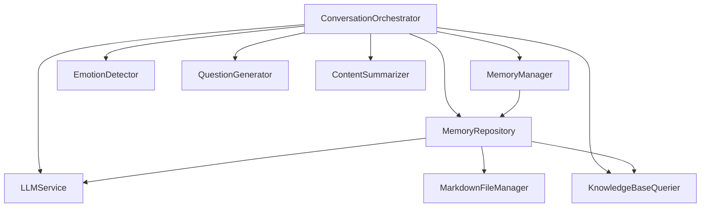

# API参考文档

<cite>
**本文档引用的文件**
- [src/models/__init__.py](file://src/models/__init__.py)
- [src/models/agent_response.py](file://src/models/agent_response.py)
- [src/models/emotion_result.py](file://src/models/emotion_result.py)
- [src/models/event_info.py](file://src/models/event_info.py)
- [src/models/person_info.py](file://src/models/person_info.py)
- [src/models/session_state.py](file://src/models/session_state.py)
- [src/models/conversation_turn.py](file://src/models/conversation_turn.py)
- [src/models/summary_content.py](file://src/models/summary_content.py)
- [src/models/organized_memory.py](file://src/models/organized_memory.py)
- [src/services/memory_manager.py](file://src/services/memory_manager.py)
- [src/storage/memory_repository.py](file://src/storage/memory_repository.py)
- [src/core/conversation_orchestrator.py](file://src/core/conversation_orchestrator.py)
- [src/enums/state_type.py](file://src/enums/state_type.py)
- [src/enums/emotion_type.py](file://src/enums/emotion_type.py)
- [src/enums/phase_type.py](file://src/enums/phase_type.py)
- [src/enums/strategy_type.py](file://src/enums/strategy_type.py)
</cite>

## 目录
1. [简介](#简介)
2. [项目结构](#项目结构)
3. [核心组件](#核心组件)
4. [架构总览](#架构总览)
5. [详细组件分析](#详细组件分析)
6. [依赖分析](#依赖分析)
7. [性能考虑](#性能考虑)
8. [故障排除指南](#故障排除指南)
9. [结论](#结论)
10. [附录](#附录)

## 简介
本API参考文档面向开发者，系统性梳理了“老人自传”项目的公共接口与数据模型，涵盖会话状态管理、记忆管理、情绪识别、内容归纳与交接等核心能力。文档以渐进方式呈现，既提供高层架构视图，也深入到类定义、方法签名、参数说明与返回值格式，并给出错误码与异常处理建议、使用示例与最佳实践。

## 项目结构
项目采用分层架构：核心编排层负责会话生命周期与状态流转；服务层提供记忆管理、知识查询、情绪检测、问题生成、内容归纳等能力；存储层统一管理短期/长期/画像三层记忆；模型层定义数据契约与枚举类型；工具与提示词层支撑LLM调用。

图表来源
- [src/core/conversation_orchestrator.py:138-401](file://src/core/conversation_orchestrator.py#L138-L401)
- [src/services/memory_manager.py:27-61](file://src/services/memory_manager.py#L27-L61)
- [src/storage/memory_repository.py:40-87](file://src/storage/memory_repository.py#L40-L87)
- [src/models/session_state.py:24-86](file://src/models/session_state.py#L24-L86)
- [src/models/agent_response.py:5-22](file://src/models/agent_response.py#L5-L22)
- [src/models/emotion_result.py:6-57](file://src/models/emotion_result.py#L6-L57)
- [src/models/event_info.py:5-69](file://src/models/event_info.py#L5-L69)
- [src/models/person_info.py:5-61](file://src/models/person_info.py#L5-L61)
- [src/models/conversation_turn.py:14-52](file://src/models/conversation_turn.py#L14-L52)
- [src/models/summary_content.py:37-67](file://src/models/summary_content.py#L37-L67)
- [src/models/organized_memory.py:141-151](file://src/models/organized_memory.py#L141-L151)

章节来源
- [src/core/conversation_orchestrator.py:138-401](file://src/core/conversation_orchestrator.py#L138-L401)
- [src/services/memory_manager.py:27-61](file://src/services/memory_manager.py#L27-L61)
- [src/storage/memory_repository.py:40-87](file://src/storage/memory_repository.py#L40-L87)
- [src/models/__init__.py:41-86](file://src/models/__init__.py#L41-L86)

## 核心组件
本节聚焦公共数据模型与关键服务接口，帮助快速定位API契约与使用方式。

- 数据模型概览
  - 会话状态：SessionState、TopicInfo、EmotionState
  - 对话轮次：ConversationTurn、Entity
  - 情绪结果：EmotionResult
  - 归纳内容：SummaryContent、ExtractedInfo、MemoryUpdatePlan、TimeMarker、ThemeInfo
  - 结构化记忆：OrganizedMemory、EventExtract、PersonExtract、ProfileUpdates、TimelineUpdate、各类枚举
  - 记忆条目：EventInfo、PersonInfo
  - Agent响应：AgentResponse
  - 会话交接：HandoffPackage、SessionSummary、ProgressInfo、CollectedData

- 服务接口概览
  - MemoryManager：短期/长期/画像记忆管理、查询、应用归纳、清空会话
  - MemoryRepository：短期/长期/画像记忆的底层存储与缓存
  - ConversationOrchestrator：会话初始化、处理对话轮次、暂停/恢复/终止、准备交接

章节来源
- [src/models/__init__.py:41-86](file://src/models/__init__.py#L41-L86)
- [src/models/session_state.py:24-139](file://src/models/session_state.py#L24-L139)
- [src/models/conversation_turn.py:14-52](file://src/models/conversation_turn.py#L14-L52)
- [src/models/emotion_result.py:6-57](file://src/models/emotion_result.py#L6-L57)
- [src/models/summary_content.py:37-67](file://src/models/summary_content.py#L37-L67)
- [src/models/organized_memory.py:141-151](file://src/models/organized_memory.py#L141-L151)
- [src/models/event_info.py:5-69](file://src/models/event_info.py#L5-L69)
- [src/models/person_info.py:5-61](file://src/models/person_info.py#L5-L61)
- [src/models/agent_response.py:5-22](file://src/models/agent_response.py#L5-L22)
- [src/services/memory_manager.py:27-470](file://src/services/memory_manager.py#L27-L470)
- [src/storage/memory_repository.py:40-359](file://src/storage/memory_repository.py#L40-L359)
- [src/core/conversation_orchestrator.py:138-401](file://src/core/conversation_orchestrator.py#L138-L401)

## 架构总览
下图展示会话编排器如何协调各子服务与存储层，驱动一次对话轮次的完整流程。

图表来源
- [src/core/conversation_orchestrator.py:198-343](file://src/core/conversation_orchestrator.py#L198-L343)
- [src/services/memory_manager.py:86-105](file://src/services/memory_manager.py#L86-L105)
- [src/storage/memory_repository.py:91-110](file://src/storage/memory_repository.py#L91-L110)

## 详细组件分析

### 会话状态管理API
- 会话初始化
  - 接口：initialize_session(user_profile: dict, strategy: StrategyType = SPARKLE_FIRST) -> SessionState
  - 功能：生成会话ID，初始化会话计时器，可选启用首次画像收集流程，发布SESSION_STARTED事件
  - 返回：SessionState实例
  - 异常：未初始化时调用process_turn会抛出运行时错误
  - 最佳实践：在调用initialize_session后，确保后续所有请求均基于同一SessionState

- 处理对话轮次
  - 接口：process_turn(user_input: str) -> AgentResponse
  - 功能：并行执行情绪检测、知识查询、内容归纳；根据情绪结果更新状态；生成下一轮问题；更新短期记忆；检查交接条件；发布TURN_COMPLETED事件
  - 返回：AgentResponse，包含message、state_update、should_pause、pause_reason、handoff_triggered
  - 超时保护：情绪检测与知识查询分别设置超时，超时则回退为默认中性情绪或空查询结果
  - 最佳实践：合理设置OrchestratorConfig中的超时参数，避免阻塞

- 会话暂停/恢复/终止
  - 暂停：pause_session() -> None
  - 恢复：resume_session(session_id: str) -> SessionState（预留实现）
  - 终止：terminate_session() -> HandoffPackage
  - 准备交接：prepare_handoff() -> HandoffPackage
  - 事件：发布SESSION_PAUSED、SESSION_TERMINATED、HANDOFF_READY事件

- 会话计时与结束引导
  - SessionTiming：跟踪开始时间、时长、警告阈值、是否已发出警告/时间到
  - _handle_session_time_up：当达到时长限制时，生成结束引导内容并触发交接
  - _generate_session_end_guide：调用LLM生成结束消息、总结与下次主题提示

章节来源
- [src/core/conversation_orchestrator.py:198-401](file://src/core/conversation_orchestrator.py#L198-L401)
- [src/enums/strategy_type.py:4-8](file://src/enums/strategy_type.py#L4-L8)
- [src/enums/state_type.py:4-12](file://src/enums/state_type.py#L4-L12)

### 记忆管理API
- 短期记忆
  - update_short_term(key: str, value: Any) -> None
  - get_short_term(key: str) -> Optional[Any]
  - add_conversation_turn(turn_data: Dict[str, Any]) -> None
  - get_history(n: Optional[int] = None) -> List[Dict[str, Any]]
  - clear_short_term() -> None
  - get_latest_conversation_records(user_id: str, n: Optional[int] = None) -> List[Dict[str, Any]]

- 长期记忆
  - save_event(event: EventInfo) -> str
  - save_person(person: PersonInfo) -> str
  - get_event(event_id: str) -> Optional[EventInfo]
  - get_person(person_id: str) -> Optional[PersonInfo]
  - update_timeline(event: EventInfo) -> None
  - query_events(keyword: Optional[str] = None, time_range: Optional[tuple] = None, event_type: Optional[str] = None) -> List[EventInfo]
  - get_all_people() -> List[PersonInfo]
  - get_all_events() -> List[EventInfo]

- 画像记忆
  - update_profile(key: str, value: Any) -> None
  - get_profile(key: str) -> Optional[Any]

- 结构化整理与应用
  - organize_and_save(turns: List[ConversationTurn], current_phase: PhaseType) -> OrganizedMemory
  - _apply_organized_memory(memory: OrganizedMemory) -> Dict[str, str]
  - apply_summary(summary: SummaryContent) -> Dict[str, Any]
  - update_long_term(extracted_info) -> Dict[str, str]（兼容旧接口）
  - update_profile(extracted_info) -> None（兼容旧接口）

- 清空会话
  - clear_session() -> None（仅清空短期记忆，保留长期记忆）

章节来源
- [src/services/memory_manager.py:64-470](file://src/services/memory_manager.py#L64-L470)
- [src/storage/memory_repository.py:91-306](file://src/storage/memory_repository.py#L91-L306)

### 数据模型详解

#### AgentResponse
- 字段
  - message: str —— Agent回复消息
  - state_update: Dict[str, Any] —— 状态更新摘要
  - should_pause: bool —— 是否应该暂停
  - pause_reason: Optional[str] —— 暂停原因
  - handoff_triggered: bool —— 是否触发交接
- 使用场景
  - ConversationOrchestrator.process_turn() 的返回值
  - 返回给上层调用者

章节来源
- [src/models/agent_response.py:5-22](file://src/models/agent_response.py#L5-L22)

#### EmotionResult
- 字段
  - emotion_type: EmotionType —— 情绪类型
  - intensity: EmotionIntensity —— 情绪强度
  - valence: EmotionValence —— 情绪极性
  - confidence: float —— 置信度（0.0~1.0）
  - suggested_action: SuggestedAction —— 建议动作
- 行为
  - needs_special_handling: bool —— 是否需要特殊处理（高负向或特定情绪）
  - should_pause(): bool —— 是否应该暂停
  - default_neutral(): EmotionResult —— 创建默认中性情绪结果
- 使用场景
  - EmotionDetector.detect() 的返回值
  - ConversationOrchestrator 根据情绪调整策略
  - QuestionGenerator 根据情绪生成响应

章节来源
- [src/models/emotion_result.py:6-57](file://src/models/emotion_result.py#L6-L57)
- [src/enums/emotion_type.py:4-50](file://src/enums/emotion_type.py#L4-L50)

#### EventInfo
- 字段
  - event_id: str —— 事件ID
  - title: str —— 事件标题
  - time: str —— 时间描述
  - time_precision: str —— 时间精度（year/month/day）
  - location: str —— 地点
  - type: str —— 事件类型
  - description: str —— 事件描述
  - details: List[str] —— 关键细节
  - participants: List[str] —— 参与人物
  - emotions: List[str] —— 情感标签
  - significance: str —— 事件意义
  - source_turns: List[int] —— 来源对话轮次
- 行为
  - to_markdown() -> str —— 转换为Markdown格式
- 使用场景
  - ContentSummarizer 的提取结果
  - MarkdownFileManager 写入文件
  - HandoffPackage 的组成部分

章节来源
- [src/models/event_info.py:5-69](file://src/models/event_info.py#L5-L69)

#### PersonInfo
- 字段
  - person_id: str —— 人物ID
  - name: str —— 姓名
  - role: str —— 角色/关系
  - description: str —— 人物描述
  - relation_to_protagonist: str —— 与主人公的关系
  - source_events: List[str] —— 相关事件ID
  - 可选扩展：birth_year、characteristics、influence、quotes
- 行为
  - to_markdown() -> str —— 转换为Markdown格式
- 使用场景
  - ContentSummarizer 的提取结果
  - MarkdownFileManager 写入文件
  - HandoffPackage 的组成部分

章节来源
- [src/models/person_info.py:5-61](file://src/models/person_info.py#L5-L61)

#### SessionState
- 字段
  - session_id: str —— 会话唯一标识
  - created_at/last_activity: datetime —— 创建时间/最后活动时间
  - current_state: StateType —— 当前对话状态
  - current_phase: PhaseType —— 当前人生阶段
  - strategy: StrategyType —— 当前采访策略
  - turn_count: int —— 对话轮数
  - coverage: Dict[PhaseType, float] —— 各阶段覆盖率
  - collected_events/collected_people: List[str] —— 已收集事件/人物ID列表
  - current_topic: Optional[TopicInfo] —— 当前话题
  - emotion_state: EmotionState —— 情绪状态
  - pending_questions: List[str] —— 待追问问题列表
  - conversation_history: List[ConversationTurn] —— 对话历史
  - user_preferences: Dict[str, Any] —— 用户偏好
- 行为
  - add_turn(turn: ConversationTurn) -> None
  - update_coverage(phase: PhaseType, value: float) -> None
  - mark_event_collected(event_id: str) -> None
  - mark_person_collected(person_id: str) -> None
  - push_pending_question(question: str) -> None
  - pop_pending_question() -> Optional[str]
  - has_pending_questions() -> bool
  - update_from_emotion(emotion_result: EmotionResult) -> None
  - to_summary() -> Dict[str, Any]
  - get_recent_history(n: int = 5) -> List[ConversationTurn]

章节来源
- [src/models/session_state.py:24-139](file://src/models/session_state.py#L24-L139)
- [src/enums/state_type.py:4-12](file://src/enums/state_type.py#L4-L12)
- [src/enums/phase_type.py:4-10](file://src/enums/phase_type.py#L4-L10)
- [src/enums/strategy_type.py:4-8](file://src/enums/strategy_type.py#L4-L8)

#### ConversationTurn
- 字段
  - turn_id: int —— 轮次ID
  - timestamp: datetime —— 时间戳
  - user_input: str —— 用户输入文本
  - agent_response: Optional[str] —— Agent回复文本
  - extracted_entities: List[Entity] —— 提取的实体
  - extracted_events: List[EventInfo] —— 提取的事件预览
  - emotion: Optional[str] —— 情绪类型
  - source_files_referenced: List[str] —— 引用的记忆库文件
  - metadata: dict —— 额外元数据
- 使用场景
  - SessionState.conversation_history 的元素
  - EmotionDetector 的输入
  - ContentSummarizer 的输入

章节来源
- [src/models/conversation_turn.py:14-52](file://src/models/conversation_turn.py#L14-L52)

#### SummaryContent
- 字段
  - summary_id: str —— 归纳ID
  - session_id: str —— 会话ID
  - turn_range: Tuple[int, int] —— 覆盖的对话轮次范围
  - created_at: datetime —— 创建时间
  - extracted_info: ExtractedInfo —— 提取的信息
  - memory_updates: MemoryUpdatePlan —— 记忆更新指令
  - pending_questions: List[str] —— 待处理问题
  - handoff_ready: bool —— 交接状态
  - handoff_reason: Optional[str] —— 交接原因

章节来源
- [src/models/summary_content.py:37-67](file://src/models/summary_content.py#L37-L67)

#### OrganizedMemory及相关枚举
- 枚举
  - TimeType: EXACT/APPROXIMATE/PERIOD/UNKNOWN
  - EventType: BIRTH/FAMILY/EDUCATION/CAREER/MARRIAGE/CHILDREN/ACHIEVEMENT/DIFFICULTY/MIGRATION/OTHER
  - Importance: CORE/IMPORTANT/NORMAL
  - RelationType: FAMILY/FRIEND/COLLEAGUE/NEIGHBOR/TEACHER/STUDENT/OTHER
  - InfluenceLevel: HIGH/MEDIUM/LOW
- 类型
  - TimelineUpdate、EventExtract、PersonExtract、ProfileUpdates、RelationshipEdge、FileSuggestion、StorageSuggestions、ProcessingSummary
  - OrganizedMemory：包含timeline_updates、events、people、profile_updates、storage_suggestions、processing_summary
  - empty() -> OrganizedMemory

章节来源
- [src/models/organized_memory.py:6-151](file://src/models/organized_memory.py#L6-L151)

### 会话状态管理API流程图

图表来源
- [src/core/conversation_orchestrator.py:198-401](file://src/core/conversation_orchestrator.py#L198-L401)

## 依赖分析
- 组件耦合
  - ConversationOrchestrator 依赖 LLMService、MemoryRepository、MemoryManager、KnowledgeBaseQuerier、EmotionDetector、QuestionGenerator、ContentSummarizer、EventBus
  - MemoryManager 依赖 MemoryRepository 与 LLMService
  - MemoryRepository 依赖 MarkdownFileManager、KnowledgeBaseQuerier、LLMService
- 枚举与模型
  - StateType、PhaseType、StrategyType、EmotionType 等枚举被 SessionState、EmotionResult 等模型使用
- 外部依赖
  - LLMService：提供结构化/非结构化调用能力
  - MarkdownFileManager：提供文件读写与目录遍历能力

图表来源
- [src/core/conversation_orchestrator.py:163-187](file://src/core/conversation_orchestrator.py#L163-L187)
- [src/services/memory_manager.py:47-60](file://src/services/memory_manager.py#L47-L60)
- [src/storage/memory_repository.py:54-87](file://src/storage/memory_repository.py#L54-L87)

章节来源
- [src/core/conversation_orchestrator.py:163-187](file://src/core/conversation_orchestrator.py#L163-L187)
- [src/services/memory_manager.py:47-60](file://src/services/memory_manager.py#L47-L60)
- [src/storage/memory_repository.py:54-87](file://src/storage/memory_repository.py#L54-L87)

## 性能考虑
- 并行化
  - process_turn 中对情绪检测、知识查询、内容归纳采用异步并行，缩短端到端延迟
- 超时保护
  - 为关键异步任务设置超时，避免阻塞；超时后回退至安全默认值
- 缓存
  - MemoryRepository 内置LRU缓存，降低重复读取开销
- 批量写入
  - organize_and_save 使用 asyncio.gather 并行保存事件与人物，提升吞吐
- 建议
  - 合理设置 OrchestratorConfig 的超时与会话时长，平衡体验与资源占用
  - 对高频查询建立索引与缓存策略，必要时引入数据库或搜索引擎

## 故障排除指南
- 常见错误类型与处理建议
  - 会话未初始化：调用 process_turn 前必须先 initialize_session，否则抛出运行时错误
  - 记忆写入失败：save_event/save_person 可能因文件系统权限或路径冲突导致异常，需检查目标路径与权限
  - LLM调用失败：组织结构化输出失败时，MemoryManager 返回空结构化记忆，上层应降级处理
  - 超时：情绪检测/知识查询超时会回退为默认中性结果或空查询，确保业务逻辑具备兜底策略
- 日志与可观测性
  - 各服务模块记录关键日志（如保存成功/失败、应用归纳结果），便于排查
  - 事件总线发布 SESSION_STARTED/TURN_COMPLETED/HANDOFF_READY 等事件，便于外部监控

章节来源
- [src/core/conversation_orchestrator.py:238-293](file://src/core/conversation_orchestrator.py#L238-L293)
- [src/services/memory_manager.py:147-149](file://src/services/memory_manager.py#L147-L149)
- [src/storage/memory_repository.py:159-161](file://src/storage/memory_repository.py#L159-L161)

## 结论
本API参考文档系统化梳理了会话状态管理与记忆管理两大核心域的数据模型与服务接口，提供了清晰的类定义、方法签名、参数说明与返回值格式，并结合流程图与依赖图帮助开发者快速理解与正确使用。建议在生产环境中配合超时保护、缓存与可观测性机制，确保系统的稳定性与可维护性。

## 附录

### API使用示例与最佳实践
- 会话初始化与对话轮次处理
  - 步骤：initialize_session -> process_turn 循环 -> terminate_session
  - 最佳实践：在循环中捕获并记录 AgentResponse.state_update，以便前端渲染与状态同步
- 记忆整理与应用
  - 步骤：organize_and_save -> _apply_organized_memory -> update_profile
  - 最佳实践：在应用归纳结果后，检查返回的文件路径列表，确保关键文件已创建
- 情绪与问题生成
  - 最佳实践：根据 EmotionResult.suggested_action 调整问题生成策略，必要时暂停或安慰
- 交接与收尾
  - 最佳实践：prepare_handoff 生成 HandoffPackage，包含事件、人物、时间线与主题摘要，便于下游流程处理

### 错误码与异常处理
- 运行时错误
  - 会话未初始化：在未调用 initialize_session 前调用 process_turn
  - 处理建议：在调用前检查会话状态，或在入口处统一初始化
- 文件写入异常
  - 保存失败：权限不足、路径非法、磁盘空间不足
  - 处理建议：捕获异常并回滚短期记忆，提示用户重试或检查配置
- LLM调用异常
  - 结构化输出失败：模板不可用或模型输出不符合预期
  - 处理建议：回退到默认空结构，记录原始输出并上报监控