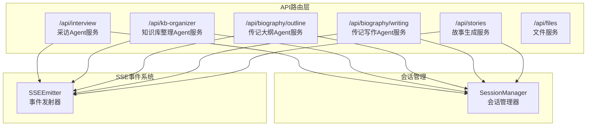
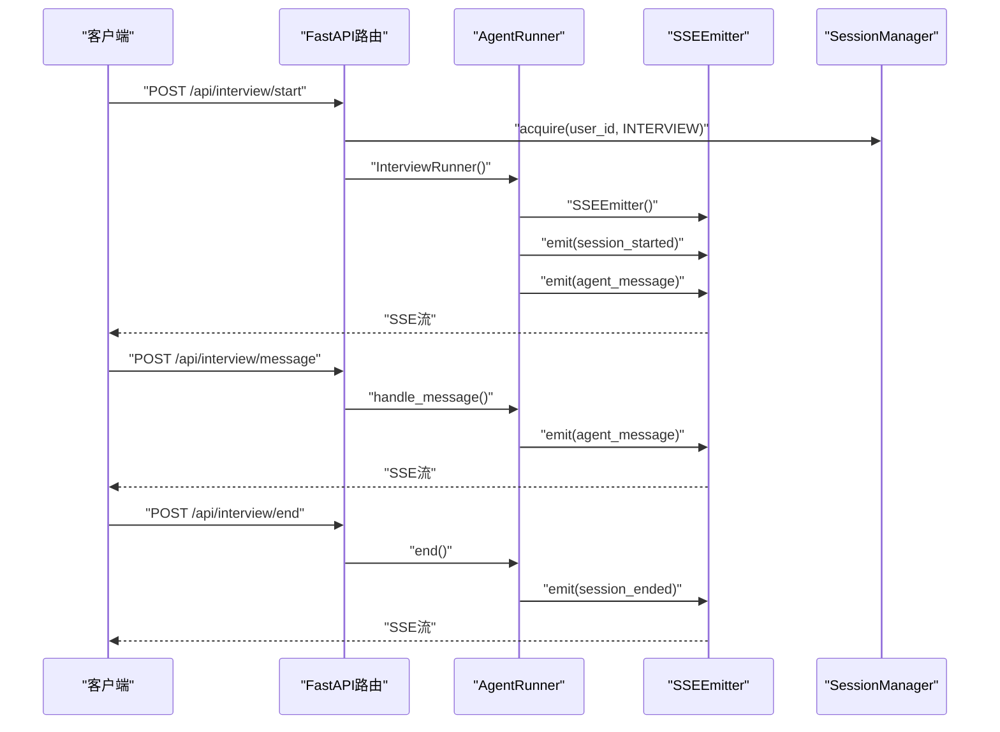
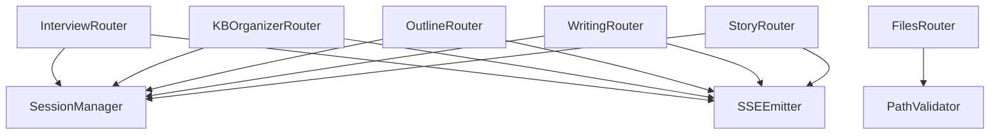

# API参考文档

<cite>
**本文档引用的文件**
- [src/models/__init__.py](file://src/models/__init__.py)
- [src/models/agent_response.py](file://src/models/agent_response.py)
- [src/models/emotion_result.py](file://src/models/emotion_result.py)
- [src/models/event_info.py](file://src/models/event_info.py)
- [src/models/person_info.py](file://src/models/person_info.py)
- [src/models/session_state.py](file://src/models/session_state.py)
- [src/models/conversation_turn.py](file://src/models/conversation_turn.py)
- [src/models/summary_content.py](file://src/models/summary_content.py)
- [src/models/organized_memory.py](file://src/models/organized_memory.py)
- [src/services/memory_manager.py](file://src/services/memory_manager.py)
- [src/storage/memory_repository.py](file://src/storage/memory_repository.py)
- [src/core/conversation_orchestrator.py](file://src/core/conversation_orchestrator.py)
- [src/enums/state_type.py](file://src/enums/state_type.py)
- [src/enums/emotion_type.py](file://src/enums/emotion_type.py)
- [src/enums/phase_type.py](file://src/enums/phase_type.py)
- [src/enums/strategy_type.py](file://src/enums/strategy_type.py)
- [API接口文档.md](file://API接口文档.md)
- [src/service/routes/interview.py](file://src/service/routes/interview.py)
- [src/service/routes/kb_organizer.py](file://src/service/routes/kb_organizer.py)
- [src/service/routes/biography_outline.py](file://src/service/routes/biography_outline.py)
- [src/service/routes/biography_writing.py](file://src/service/routes/biography_writing.py)
- [src/service/routes/files.py](file://src/service/routes/files.py)
- [src/service/routes/stories.py](file://src/service/routes/stories.py)
</cite>

## 更新摘要
**所做更改**
- 新增完整的API接口文档，包含所有服务路由和数据模型的详细说明
- 更新架构总览，反映新增的四个Agent服务接口
- 新增详细的API路由说明，包括采访Agent、知识库整理Agent、传记大纲Agent、传记写作Agent和文件服务
- 新增SSE事件格式规范和数据模型说明
- 更新错误码和异常处理指南
- 新增完整的接口使用示例和最佳实践

## 目录
1. [简介](#简介)
2. [项目结构](#项目结构)
3. [核心组件](#核心组件)
4. [架构总览](#架构总览)
5. [详细组件分析](#详细组件分析)
6. [依赖分析](#依赖分析)
7. [性能考虑](#性能考虑)
8. [故障排除指南](#故障排除指南)
9. [结论](#结论)
10. [附录](#附录)

## 简介
本API参考文档面向开发者，系统性梳理了"老人自传"项目的完整API接口体系，涵盖五个核心Agent服务和文件服务的详细接口说明。文档基于最新的API接口文档.md文件，提供了完整的HTTP接口规范、SSE流式协议说明、数据模型定义、错误码说明和使用示例。

## 项目结构
项目采用FastAPI框架构建，包含五个核心Agent服务路由和文件服务路由，每个Agent服务都通过SSE协议提供实时通信能力。



**章节来源**
- [API接口文档.md:1-1320](file://API接口文档.md#L1-L1320)
- [src/service/routes/interview.py:22](file://src/service/routes/interview.py#L22)
- [src/service/routes/kb_organizer.py:16](file://src/service/routes/kb_organizer.py#L16)
- [src/service/routes/biography_outline.py:16](file://src/service/routes/biography_outline.py#L16)
- [src/service/routes/biography_writing.py:17](file://src/service/routes/biography_writing.py#L17)
- [src/service/routes/stories.py:15](file://src/service/routes/stories.py#L15)
- [src/service/routes/files.py:10](file://src/service/routes/files.py#L10)

## 核心组件
本节详细介绍五个核心Agent服务的API接口和数据模型。

### 服务接口概览
- **采访Agent服务**：支持持续多轮对话，包含用户信息收集和主体采访两个阶段
- **知识库整理Agent服务**：自动执行文件去重合并、矛盾检测、链接修复等任务
- **传记大纲Agent服务**：扫描知识库材料，生成或更新传记章节大纲
- **传记写作Agent服务**：根据确认的大纲章节逐章写作，合并为完整传记
- **故事生成服务**：从知识库事件生成第一人称故事
- **文件服务**：提供用户知识库目录的只读访问

### 数据模型概览
- **会话状态模型**：SessionState、TopicInfo、EmotionState
- **对话轮次模型**：ConversationTurn、Entity
- **情绪结果模型**：EmotionResult
- **归纳内容模型**：SummaryContent、ExtractedInfo、MemoryUpdatePlan、TimeMarker、ThemeInfo
- **结构化记忆模型**：OrganizedMemory、EventExtract、PersonExtract、ProfileUpdates、TimelineUpdate
- **记忆条目模型**：EventInfo、PersonInfo
- **Agent响应模型**：AgentResponse
- **会话交接模型**：HandoffPackage、SessionSummary、ProgressInfo、CollectedData

**章节来源**
- [API接口文档.md:1183-1298](file://API接口文档.md#L1183-L1298)
- [src/models/__init__.py:41-86](file://src/models/__init__.py#L41-L86)
- [src/models/session_state.py:24-139](file://src/models/session_state.py#L24-L139)
- [src/models/conversation_turn.py:14-52](file://src/models/conversation_turn.py#L14-L52)
- [src/models/emotion_result.py:6-57](file://src/models/emotion_result.py#L6-L57)
- [src/models/summary_content.py:37-67](file://src/models/summary_content.py#L37-L67)
- [src/models/organized_memory.py:141-151](file://src/models/organized_memory.py#L141-L151)
- [src/models/event_info.py:5-69](file://src/models/event_info.py#L5-L69)
- [src/models/person_info.py:5-61](file://src/models/person_info.py#L5-L61)
- [src/models/agent_response.py:5-22](file://src/models/agent_response.py#L5-L22)

## 架构总览
下图展示完整的API架构，包括五个Agent服务如何通过SSE协议与客户端通信。



**图表来源**
- [src/service/routes/interview.py:134-196](file://src/service/routes/interview.py#L134-L196)
- [src/service/routes/kb_organizer.py:34-99](file://src/service/routes/kb_organizer.py#L34-L99)
- [src/service/routes/biography_outline.py:34-99](file://src/service/routes/biography_outline.py#L34-L99)
- [src/service/routes/biography_writing.py:35-100](file://src/service/routes/biography_writing.py#L35-L100)
- [src/service/routes/stories.py:31-96](file://src/service/routes/stories.py#L31-L96)

**章节来源**
- [API接口文档.md:1039-1181](file://API接口文档.md#L1039-L1181)

## 详细组件分析

### 采访Agent服务接口
采访Agent服务提供持续多轮对话能力，支持用户信息收集和主体采访两个阶段。

#### 微信画像预填接口
**POST** `/api/interview/profile/prefill`

在调用会话启动接口之前，预填用户的微信画像信息。

**请求体：**
```json
{
  "wechat_id": "wx_openid_abc",
  "user_id": "test_user002",
  "name": "王秀兰",
  "age": 78,
  "birth_date": "1948-01-02",
  "gender": "女"
}
```

**响应：**
```json
{
  "status": "ok",
  "user_id": "test_user002",
  "wechat_id": "wx_openid_abc",
  "profile": {
    "wechat_id": "wx_openid_abc",
    "name": "王秀兰",
    "age": "78",
    "gender": "女",
    "birth_date": "1948-01-02",
    "birth_year": "1948"
  },
  "profile_complete": false,
  "missing_required_fields": [
    "occupation",
    "family_status",
    "living_arrangement",
    "story_expectation"
  ]
}
```

#### 启动会话接口
**POST** `/api/interview/start`

启动一次新的采访会话，返回SSE流。

**请求体：**
```json
{
  "user_id": "test_user002"
}
```

**SSE事件流：**
```
event: session_started
data: {"session_id": "sess_20260516_103000_abc123", "user_id": "test_user002", "phase": "profile", "timestamp": "2026-05-16T10:30:00+08:00"}

event: agent_message
data: {"session_id": "sess_20260516_103000_abc123", "message": "您好！我是您的传记采访助手。在开始之前，我想先了解一些您的基本信息。请问您怎么称呼？", "phase": "profile", "timestamp": "2026-05-16T10:30:01+08:00"}
```

#### 发送消息接口
**POST** `/api/interview/message`

在已有会话中发送一条消息。

**请求体：**
```json
{
  "user_id": "test_user002",
  "session_id": "sess_20260516_103000_abc123",
  "message": "我叫张伟，今年78岁了。",
  "candidate_questions": [
    {"id": "q1", "question": "您当年为什么选择参军？"}
  ]
}
```

**agent_message事件字段：**
| 字段 | 类型 | 说明 |
|------|------|------|
| `session_id` | string | 会话标识 |
| `message` | string | Agent回复内容 |
| `phase` | string | 当前阶段（profile / interview / ending） |
| `question_source` | string | 问题来源：`generated`（AI生成）或 `candidate_question`（候选问题改写） |
| `candidate_question_id` | string | 当前阶段（profile / interview / ending） |

#### 结束会话接口
**POST** `/api/interview/end`

主动结束当前会话。

**请求体：**
```json
{
  "user_id": "test_user002",
  "session_id": "sess_20260516_103000_abc123"
}
```

**响应：**
```json
{
  "status": "ended",
  "session_id": "sess_20260516_103000_abc123",
  "summary": {
    "total_turns": 24,
    "duration_minutes": 12,
    "phase_reached": "interview",
    "collected_events": 5,
    "collected_people": 3,
    "coverage": {
      "childhood": 0.6,
      "youth": 0.3,
      "middle_age": 0.0,
      "elderly": 0.0
    }
  },
  "conversation_saved": "knowledge_base/test_user002/conversation_2026-05-16_10-42-00.json"
}
```

#### 获取会话状态接口
**GET** `/api/interview/status/{user_id}/{session_id}`

查询当前会话的实时状态。

**响应：**
```json
{
  "session_id": "sess_20260516_103000_abc123",
  "user_id": "test_user002",
  "phase": "interview",
  "turn_count": 12,
  "elapsed_minutes": 8,
  "remaining_minutes": 7,
  "current_topic": {
    "type": "event",
    "name": "上山下乡经历",
    "depth": 2
  },
  "emotion_state": {
    "emotion_type": "nostalgic",
    "intensity": "medium"
  }
}
```

**章节来源**
- [API接口文档.md:109-368](file://API接口文档.md#L109-L368)
- [src/service/routes/interview.py:95-323](file://src/service/routes/interview.py#L95-L323)

### 知识库整理Agent服务接口
知识库整理Agent自动执行文件去重合并、矛盾检测、链接修复等整理任务。

#### 启动整理任务接口
**POST** `/api/kb-organizer/run`

**请求体：**
```json
{
  "user_id": "test_user002"
}
```

**SSE事件流：**
```
event: task_started
data: {"user_id": "test_user002", "task_count": 7, "timestamp": "2026-05-16T11:00:00+08:00"}

event: task_progress
data: {"task_id": "task_001", "task_type": "setup_workspace", "status": "in_progress", "description": "初始化工作目录...", "timestamp": "2026-05-16T11:00:01+08:00"}

event: task_completed
data: {"status": "completed", "iteration_count": 1, "summary": {"merge_records": [...], "conflict_items": [...], "link_redirect_map": {...}}, "timestamp": "2026-05-16T11:00:42+08:00"}

event: done
data: {"message": "知识库整理完成"}
```

**task_type枚举：**
| 值 | 说明 |
|----|------|
| `setup_workspace` | 初始化工作目录 |
| `read_documents` | 读取文档内容 |
| `merge_duplicates` | 合并重复文档 |
| `detect_contradictions` | 检测矛盾信息 |
| `repair_links` | 修复链接 |
| `prune_conversations` | 清理对话文件 |
| `finalize_swap` | 最终替换 |

#### 获取整理结果接口
**GET** `/api/kb-organizer/result/{user_id}`

获取最近一次整理任务的结果摘要。

**响应：**
```json
{
  "user_id": "test_user002",
  "status": "completed",
  "completed_at": "2026-05-16T11:00:42+08:00",
  "iteration_count": 1,
  "merge_records": [
    {
      "merge_id": "merge_001",
      "source_files": ["events/childhood/出生.md", "events/childhood/出生记录.md"],
      "target_file": "events/childhood/出生.md",
      "merge_reason": "内容重复",
      "preserved_details": ["出生地点", "出生日期", "家庭情况"]
    }
  ],
  "conflict_items": [
    {
      "conflict_id": "conflict_001",
      "conflict_type": "time",
      "description": "出生年份在两份文档中不一致：1948 vs 1949",
      "source_files": ["events/childhood/出生.md", "timeline/timeline.md"],
      "resolved": false,
      "resolution": null
    }
  ],
  "link_redirect_map": {
    "events/childhood/出生记录.md": "events/childhood/出生.md"
  }
}
```

**章节来源**
- [API接口文档.md:370-504](file://API接口文档.md#L370-L504)
- [src/service/routes/kb_organizer.py:34-126](file://src/service/routes/kb_organizer.py#L34-L126)

### 传记大纲Agent服务接口
传记大纲Agent扫描知识库材料，自动生成或增量更新传记章节大纲。

#### 生成/更新大纲接口
**POST** `/api/biography/outline/generate`

**请求体：**
```json
{
  "user_id": "test_user002"
}
```

**SSE事件流：**
```
event: task_started
data: {"user_id": "test_user002", "mode": "generate", "timestamp": "2026-05-16T12:00:00+08:00"}

event: scanning
data: {"step": "scanning", "message": "正在扫描知识库材料...", "timestamp": "2026-05-16T12:00:01+08:00"}

event: generating
data: {"step": "generating", "message": "生成了 6 个章节", "chapters_count": 6, "timestamp": "2026-05-16T12:00:30+08:00"}

event: completed
data: {"status": "completed", "outline": {"title": "我的人生故事", "author": "张伟", "style": "first_person_oral", "version": 1, "chapters": [...]}, "changes_made": [...], "timestamp": "2026-05-16T12:00:31+08:00"}

event: done
data: {"message": "大纲生成完成"}
```

#### 获取当前大纲接口
**GET** `/api/biography/outline/{user_id}`

获取当前已保存的outline.yaml内容（JSON格式返回）。

**响应：**
```json
{
  "title": "我的人生故事",
  "author": "张伟",
  "style": "first_person_oral",
  "version": 1,
  "last_updated": "2026-05-16T12:00:31+08:00",
  "chapters": [
    {
      "id": "ch01",
      "title": "故乡的记忆",
      "life_stage": "childhood",
      "theme": "成长环境",
      "status": "draft",
      "source_materials": ["events/childhood/出生.md", "events/childhood/上学.md"],
      "summary": "描述童年时期的家庭环境和乡村生活...",
      "confirmed_at": null,
      "written_at": null
    }
  ]
}
```

#### 确认章节接口
**PUT** `/api/biography/outline/{user_id}/chapters/{chapter_id}/confirm`

将指定章节的状态从`draft`变为`confirmed`。

**请求体：**
```json
{
  "notes": "这个章节的方向很好，可以动笔了"
}
```

**响应：**
```json
{
  "chapter_id": "ch01",
  "status": "confirmed",
  "confirmed_at": "2026-05-16T14:00:00+08:00",
  "message": "章节已确认，可进行写作"
}
```

**章节来源**
- [API接口文档.md:565-729](file://API接口文档.md#L565-L729)
- [src/service/routes/biography_outline.py:34-171](file://src/service/routes/biography_outline.py#L34-L171)

### 传记写作Agent服务接口
传记写作Agent根据已确认的大纲章节逐章写作，并合并为完整传记。

#### 启动写作任务接口
**POST** `/api/biography/writing/run`

**请求体：**
```json
{
  "user_id": "test_user002"
}
```

**SSE事件流：**
```
event: task_started
data: {"user_id": "test_user002", "chapters_to_write": 3, "timestamp": "2026-05-16T15:00:00+08:00"}

event: loading_tasks
data: {"step": "loading_tasks", "message": "正在加载写作任务...", "chapters": ["ch01", "ch02", "ch03"], "timestamp": "2026-05-16T15:00:01+08:00"}

event: writing_chapter
data: {"step": "writing_chapter", "chapter_id": "ch01", "chapter_title": "故乡的记忆", "status": "gathering_materials", "message": "正在收集章节素材...", "progress": "1/3", "timestamp": "2026-05-16T15:00:02+08:00"}

event: saved
data: {"step": "saved", "chapter_id": "ch01", "chapter_title": "故乡的记忆", "file_path": "biography/chapters/ch01_故乡的记忆.md", "word_count": 2350, "progress": "1/3", "timestamp": "2026-05-16T15:01:30+08:00"}

event: completed
data: {"status": "completed", "completed_chapters": ["ch01", "ch02", "ch03"], "total_word_count": 6430, "full_biography_path": "biography/full_biography.md", "timestamp": "2026-05-16T15:04:33+08:00"}

event: done
data: {"message": "传记写作完成"}
```

#### 获取章节列表接口
**GET** `/api/biography/writing/{user_id}/chapters`

列出所有已写作完成的章节文件。

**响应：**
```json
{
  "user_id": "test_user002",
  "chapters": [
    {
      "chapter_id": "ch01",
      "title": "故乡的记忆",
      "file_path": "biography/chapters/ch01_故乡的记忆.md",
      "word_count": 2350,
      "written_at": "2026-05-16T15:01:30+08:00"
    }
  ],
  "total_word_count": 6430
}
```

#### 获取完整传记接口
**GET** `/api/biography/writing/{user_id}/full`

获取合并后的完整传记内容。

**响应：**
```json
{
  "user_id": "test_user002",
  "title": "我的人生故事",
  "author": "张伟",
  "total_word_count": 6430,
  "chapters_count": 3,
  "generated_at": "2026-05-16T15:04:33+08:00",
  "content": "# 我的人生故事\n\n## 第一章 故乡的记忆\n\n我出生在一个小山村里...\n\n## 第二章 求学之路\n\n那年秋天，我背着母亲缝制的布书包...\n\n## 第三章 工作岁月\n\n大学毕业后，我被分配到..."
}
```

**章节来源**
- [API接口文档.md:731-865](file://API接口文档.md#L731-L865)
- [src/service/routes/biography_writing.py:35-174](file://src/service/routes/biography_writing.py#L35-L174)

### 故事生成服务接口
故事生成服务从用户知识库中选择最早的15个未消费事件生成一篇第一人称故事。

#### 生成故事接口
**POST** `/api/stories/generate`

**请求体：**
```json
{
  "user_id": "test_user002"
}
```

**SSE事件流：**
```
event: task_started
data: {"user_id": "test_user002", "required_event_count": 15, "timestamp": "2026-06-05T10:00:00+08:00"}

event: scanning
data: {"step": "scanning", "message": "扫描到 18 个未生成故事的事件", "available_events": 18, "required_events": 15, "timestamp": "2026-06-05T10:00:01+08:00"}

event: generating
data: {"step": "generating", "message": "正在根据最早的 15 个事件生成故事...", "selected_event_count": 15, "selected_event_paths": ["events/childhood/出生.md"], "timestamp": "2026-06-05T10:00:02+08:00"}

event: saved
data: {"step": "saved", "message": "故事已保存，事件消费状态已更新", "story_id": "story_20260605_100030", "story_path": "stories/story_20260605_100030.md", "consumed_event_count": 15, "timestamp": "2026-06-05T10:00:30+08:00"}

event: completed
data: {"status": "completed", "story_id": "story_20260605_100030", "story_path": "stories/story_20260605_100030.md", "consumed_event_count": 15, "remaining_event_count": 3, "timestamp": "2026-06-05T10:00:31+08:00"}

event: done
data: {"message": "故事生成完成"}
```

**章节来源**
- [API接口文档.md:507-562](file://API接口文档.md#L507-L562)
- [src/service/routes/stories.py:31-97](file://src/service/routes/stories.py#L31-L97)

### 文件服务接口
文件服务提供对用户知识库目录的只读访问。

#### 列出文件目录接口
**GET** `/api/files/{user_id}`

列出指定用户知识库根目录下的文件和目录（仅一级）。

**响应：**
```json
{
  "user_id": "test_user002",
  "base_path": "knowledge_base/test_user002/",
  "items": [
    {"name": "events", "path": "events/", "type": "directory"},
    {"name": "people", "path": "people/", "type": "directory"},
    {"name": "timeline", "path": "timeline/", "type": "directory"},
    {"name": "themes", "path": "themes/", "type": "directory"},
    {"name": "biography", "path": "biography/", "type": "directory"},
    {"name": "index.md", "path": "index.md", "type": "file", "size": 234, "last_modified": "2026-05-16T10:00:00+08:00"}
  ]
}
```

#### 获取文件内容接口
**GET** `/api/files/{user_id}/{path}`

按相对路径获取文件内容。

**响应：**
```json
{
  "user_id": "test_user002",
  "filename": "出生.md",
  "path": "events/childhood/出生.md",
  "size": 456,
  "last_modified": "2026-05-13T22:45:44+08:00",
  "content_type": "text/markdown",
  "content": "# 出生\n\n## 基本信息\n- 时间：1948年农历三月\n- 地点：湖南省长沙市望城区\n\n## 详细描述\n我出生在一个普通的农民家庭..."
}
```

#### 获取完整目录树接口
**GET** `/api/files/{user_id}/tree`

递归获取用户知识库的完整目录树结构。

**响应：**
```json
{
  "user_id": "test_user002",
  "tree": {
    "name": "test_user002",
    "type": "directory",
    "children": [
      {
        "name": "events",
        "type": "directory",
        "children": [
          {
            "name": "childhood",
            "type": "directory",
            "children": [
              {"name": "出生.md", "type": "file", "size": 456, "path": "events/childhood/出生.md"},
              {"name": "上学.md", "type": "file", "size": 789, "path": "events/childhood/上学.md"}
            ]
          }
        ]
      }
    ]
  }
}
```

**章节来源**
- [API接口文档.md:868-1036](file://API接口文档.md#L868-L1036)
- [src/service/routes/files.py:137-229](file://src/service/routes/files.py#L137-L229)

### SSE事件格式规范
所有任务式Agent都使用SSE协议进行实时通信，支持多种事件类型。

#### 任务式Agent通用事件类型
| 事件类型 | 说明 | 触发时机 |
|----------|------|----------|
| `task_started` | 任务开始 | 任务启动时，包含任务总数 |
| `task_progress` | 任务进度更新 | 每个子任务状态变化时 |
| `scanning` | 扫描阶段 | 大纲Agent扫描知识库时 |
| `analyzing` | 分析阶段 | 大纲Agent分析材料时 |
| `generating` | 生成阶段 | 大纲Agent生成章节时 |
| `loading_tasks` | 加载任务 | 写作Agent加载写作队列时 |
| `writing_chapter` | 写作进度 | 写作Agent撰写每章时 |
| `reviewing` | 审阅阶段 | 写作Agent审阅润色时 |
| `saved` | 保存完成 | 单章写作保存时 |
| `merging` | 合并阶段 | 写作Agent合并全文时 |
| `completed` | 任务完成 | 全部任务成功完成 |
| `failed` | 任务失败 | 任务执行失败 |
| `error` | 错误 | 运行时出错 |
| `done` | 流结束 | SSE连接即将关闭 |

#### 交互式Agent事件类型
| 事件类型 | 说明 | 触发时机 |
|----------|------|----------|
| `session_started` | 会话已创建 | 调用start接口时 |
| `agent_message` | Agent回复 | Agent生成回复时 |
| `phase_changed` | 阶段切换 | profile→interview→ending |
| `session_ended` | 会话结束 | 会话正常结束时 |
| `error` | 错误 | 运行时出错 |

**章节来源**
- [API接口文档.md:1039-1181](file://API接口文档.md#L1039-L1181)

### 数据模型详解

#### OutlineDocument（大纲文档）
```json
{
  "title": "string - 传记标题",
  "author": "string - 传主姓名",
  "style": "string - 写作风格 (first_person_oral)",
  "version": "integer - 大纲版本号",
  "last_updated": "datetime - 最后更新时间",
  "chapters": "ChapterEntry[] - 章节列表"
}
```

#### ChapterEntry（章节条目）
```json
{
  "id": "string - 章节唯一标识 (ch01, ch02...)",
  "title": "string - 章节标题",
  "life_stage": "string - 人生阶段 (childhood|youth|middle_age|elderly)",
  "theme": "string - 章节主题",
  "status": "string - 章节状态 (draft|confirmed|written|outdated)",
  "source_materials": "string[] - 引用的知识库文件路径列表",
  "summary": "string - 章节内容摘要",
  "confirmed_at": "datetime|null - 确认时间",
  "written_at": "datetime|null - 写作完成时间"
}
```

#### OrganizerTask（整理任务）
```json
{
  "task_id": "string - 任务唯一标识",
  "task_type": "string - 任务类型",
  "description": "string - 任务描述",
  "status": "string - 任务状态 (pending|in_progress|completed|failed|skipped)",
  "result": "string|null - 执行结果摘要",
  "error": "string|null - 错误信息",
  "affected_files": "string[] - 受影响的文件列表",
  "retry_count": "integer - 重试次数"
}
```

#### MergeRecord（合并记录）
```json
{
  "merge_id": "string - 合并记录唯一标识",
  "source_files": "string[] - 被合并的源文件列表",
  "target_file": "string - 合并后的目标文件",
  "merge_reason": "string - 合并原因",
  "preserved_details": "string[] - 保留的关键细节清单"
}
```

#### ConflictItem（矛盾问题）
```json
{
  "conflict_id": "string - 矛盾唯一标识",
  "conflict_type": "string - 矛盾类型 (time|location|relationship|causal)",
  "description": "string - 矛盾描述",
  "source_files": "string[] - 涉及的文档路径",
  "resolved": "boolean - 是否已解决",
  "resolution": "string|null - 解决方案描述",
  "evidence": "string|null - 支撑解决的证据来源"
}
```

#### SessionState（采访会话状态）
```json
{
  "session_id": "string - 会话唯一标识",
  "created_at": "datetime - 创建时间",
  "last_activity": "datetime - 最后活动时间",
  "current_state": "string - 当前对话状态 (init|greeting|chatting|deep_dive|summarizing)",
  "current_phase": "string - 当前人生阶段 (childhood|youth|young_adult|middle_age|elderly)",
  "strategy": "string - 采访策略",
  "turn_count": "integer - 对话轮数",
  "coverage": "object - 各阶段覆盖率 {phase: float}",
  "collected_events": "string[] - 已收集事件ID列表",
  "collected_people": "string[] - 已收集人物ID列表",
  "current_topic": "TopicInfo|null - 当前话题",
  "emotion_state": "EmotionState - 情绪状态"
}
```

#### OutlineChange（大纲变更记录）
```json
{
  "action": "string - 变更动作 (add|update|mark_outdated)",
  "chapter_id": "string - 章节ID",
  "chapter_entry": "ChapterEntry|null - 新章节条目（add时）",
  "reason": "string - 变更原因"
}
```

#### ChapterTask（写作任务项）
```json
{
  "chapter_id": "string - 章节ID",
  "chapter_title": "string - 章节标题",
  "life_stage": "string - 人生阶段",
  "theme": "string - 章节主题",
  "source_materials": "string[] - 参考材料路径列表",
  "summary": "string - 章节摘要"
}
```

**章节来源**
- [API接口文档.md:1183-1298](file://API接口文档.md#L1183-L1298)

## 依赖分析
- **路由层依赖**
  - 每个Agent服务路由都依赖SessionManager进行会话管理
  - 所有Agent服务都使用SSEEmitter进行事件流式传输
  - 文件服务路由依赖路径验证和目录遍历防护
- **会话管理**
  - SessionManager管理不同Agent类型的会话冲突
  - 支持INTERVIEW、KB_ORGANIZER、BIOGRAPHY_OUTLINE、BIOGRAPHY_WRITING、STORY_GENERATION五种Agent类型
- **SSE事件系统**
  - SSEEmitter统一处理事件格式和流式传输
  - 支持错误事件和完成事件的标准化处理



**图表来源**
- [src/service/routes/interview.py:16](file://src/service/routes/interview.py#L16)
- [src/service/routes/kb_organizer.py:11](file://src/service/routes/kb_organizer.py#L11)
- [src/service/routes/biography_outline.py:11](file://src/service/routes/biography_outline.py#L11)
- [src/service/routes/biography_writing.py:12](file://src/service/routes/biography_writing.py#L12)
- [src/service/routes/stories.py:11](file://src/service/routes/stories.py#L11)
- [src/service/routes/files.py:33](file://src/service/routes/files.py#L33)

**章节来源**
- [src/service/routes/interview.py:16-22](file://src/service/routes/interview.py#L16-L22)
- [src/service/routes/kb_organizer.py:11-14](file://src/service/routes/kb_organizer.py#L11-L14)
- [src/service/routes/biography_outline.py:11-14](file://src/service/routes/biography_outline.py#L11-L14)
- [src/service/routes/biography_writing.py:12-15](file://src/service/routes/biography_writing.py#L12-L15)
- [src/service/routes/stories.py:11-13](file://src/service/routes/stories.py#L11-L13)
- [src/service/routes/files.py:33-40](file://src/service/routes/files.py#L33-L40)

## 性能考虑
- **SSE流式传输**
  - 所有任务式Agent都使用SSE协议，减少HTTP连接开销
  - 支持长时间任务的实时状态更新
- **会话并发控制**
  - SessionManager防止同一用户同时运行多个相同类型的Agent
  - 支持任务取消和资源释放
- **文件服务优化**
  - 目录遍历使用递归算法，支持大目录结构
  - 文件读取采用UTF-8编码，支持各种文件类型
- **错误处理**
  - 所有Agent都实现统一的错误事件处理
  - 支持可恢复和不可恢复错误的区分

## 故障排除指南
- **会话管理错误**
  - TASK_ALREADY_RUNNING：同一用户已在运行相同类型的任务
  - SESSION_NOT_FOUND：会话不存在或会话ID不匹配
- **文件访问错误**
  - USER_NOT_FOUND：用户知识库不存在
  - FILE_NOT_FOUND：文件或目录不存在，检查路径是否包含`..`
- **Agent执行错误**
  - AGENT_ERROR：Agent执行过程中发生错误
  - INSUFFICIENT_EVENTS：故事生成所需的事件数量不足
- **SSE连接问题**
  - 确保客户端正确处理SSE事件格式
  - 监听`done`事件以检测连接结束

**章节来源**
- [API接口文档.md:70-106](file://API接口文档.md#L70-L106)
- [src/service/routes/interview.py:147-151](file://src/service/routes/interview.py#L147-L151)
- [src/service/routes/kb_organizer.py:48-52](file://src/service/routes/kb_organizer.py#L48-L52)
- [src/service/routes/biography_outline.py:150-158](file://src/service/routes/biography_outline.py#L150-L158)

## 结论
本API参考文档全面覆盖了"老人自传"系统的完整API接口体系，包括五个核心Agent服务和文件服务的详细接口说明。文档基于最新的API接口文档.md文件，提供了标准化的HTTP接口规范、SSE流式协议说明、完整的数据模型定义和错误码说明。开发者可以根据本文档快速集成和使用各个API接口，实现完整的自传写作流程。

## 附录

### API使用示例与最佳实践
- **SSE连接示例**
  ```javascript
  // 任务式Agent调用示例
  const eventSource = new EventSource('/api/kb-organizer/run', {
    method: 'POST',
    headers: { 'Content-Type': 'application/json' },
    body: JSON.stringify({ user_id: 'test_user002' })
  });

  // 使用fetch + ReadableStream（推荐，支持POST）
  async function runTaskAgent(url, body) {
    const response = await fetch(url, {
      method: 'POST',
      headers: { 'Content-Type': 'application/json' },
      body: JSON.stringify(body)
    });

    const reader = response.body.getReader();
    const decoder = new TextDecoder();
    let buffer = '';

    while (true) {
      const { done, value } = await reader.read();
      if (done) break;

      buffer += decoder.decode(value, { stream: true });
      const lines = buffer.split('\n');
      buffer = lines.pop();

      let eventType = '';
      for (const line of lines) {
        if (line.startsWith('event: ')) {
          eventType = line.slice(7);
        } else if (line.startsWith('data: ')) {
          const data = JSON.parse(line.slice(6));
          handleEvent(eventType, data);
        }
      }
    }
  }
  ```

- **采访Agent最佳实践**
  - 在调用`/api/interview/start`前先调用`/api/interview/profile/prefill`
  - 监听`phase_changed`事件以了解采访阶段转换
  - 使用`/api/interview/status`接口定期查询会话状态
  - 处理`error`事件以实现错误恢复

- **知识库整理最佳实践**
  - 在整理前确保知识库结构完整
  - 监听`task_progress`事件以了解整理进度
  - 使用`/api/kb-organizer/result`获取整理结果摘要
  - 处理`failed`事件以实现重试机制

- **传记大纲和写作最佳实践**
  - 先生成大纲，再确认章节状态
  - 监听写作过程中的各个阶段事件
  - 使用`/api/biography/writing/{user_id}/chapters`获取已完成章节
  - 通过`/api/biography/writing/{user_id}/full`获取完整传记

- **文件服务最佳实践**
  - 使用`/api/files/{user_id}`获取知识库根目录结构
  - 使用`/api/files/{user_id}/tree`获取完整目录树
  - 注意路径遍历攻击防护，不要包含`..`字符
  - 处理文件编码问题，确保UTF-8编码

### 错误码与异常处理
- **HTTP状态码**
  - 400 INVALID_REQUEST：请求参数不合法
  - 404 USER_NOT_FOUND：用户知识库不存在
  - 409 TASK_ALREADY_RUNNING：该用户已有相同类型任务正在运行
  - 500 INTERNAL_ERROR：服务内部错误
  - 503 LLM_UNAVAILABLE：LLM服务不可用

- **Agent特定错误码**
  - SESSION_NOT_FOUND：会话不存在或会话ID不匹配
  - RESULT_CORRUPTED：知识库整理结果文件损坏
  - FILE_NOT_FOUND：文件或目录不存在
  - INVALID_STATUS_TRANSITION：章节状态转换无效

- **SSE错误事件**
  - AGENT_ERROR：Agent执行错误
  - LLM_TIMEOUT：LLM调用超时
  - INSUFFICIENT_EVENTS：事件数量不足

**章节来源**
- [API接口文档.md:91-106](file://API接口文档.md#L91-L106)
- [src/service/routes/interview.py:213-221](file://src/service/routes/interview.py#L213-L221)
- [src/service/routes/kb_organizer.py:112-119](file://src/service/routes/kb_organizer.py#L112-L119)
- [src/service/routes/biography_outline.py:150-158](file://src/service/routes/biography_outline.py#L150-L158)

### 接口总览
| 方法 | 路径 | 类型 | 说明 |
|------|------|------|------|
| POST | `/api/interview/start` | SSE | 启动采访会话 |
| POST | `/api/interview/message` | SSE | 发送用户消息 |
| POST | `/api/interview/end` | JSON | 结束会话 |
| GET | `/api/interview/status/{user_id}/{session_id}` | JSON | 获取会话状态 |
| POST | `/api/kb-organizer/run` | SSE | 启动知识库整理 |
| GET | `/api/kb-organizer/result/{user_id}` | JSON | 获取整理结果 |
| POST | `/api/stories/generate` | SSE | 生成一篇故事并消费15个事件 |
| POST | `/api/biography/outline/generate` | SSE | 生成/更新大纲 |
| GET | `/api/biography/outline/{user_id}` | JSON | 获取当前大纲 |
| PUT | `/api/biography/outline/{user_id}/chapters/{chapter_id}/confirm` | JSON | 确认章节 |
| POST | `/api/biography/writing/run` | SSE | 启动传记写作 |
| GET | `/api/biography/writing/{user_id}/chapters` | JSON | 获取章节列表 |
| GET | `/api/biography/writing/{user_id}/full` | JSON | 获取完整传记 |
| GET | `/api/files/{user_id}` | JSON | 列出文件目录 |
| GET | `/api/files/{user_id}/{path}` | JSON | 获取文件内容 |
| GET | `/api/files/{user_id}/tree` | JSON | 获取完整目录树 |

**章节来源**
- [API接口文档.md:1300-1320](file://API接口文档.md#L1300-L1320)