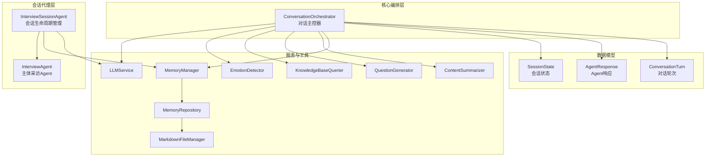
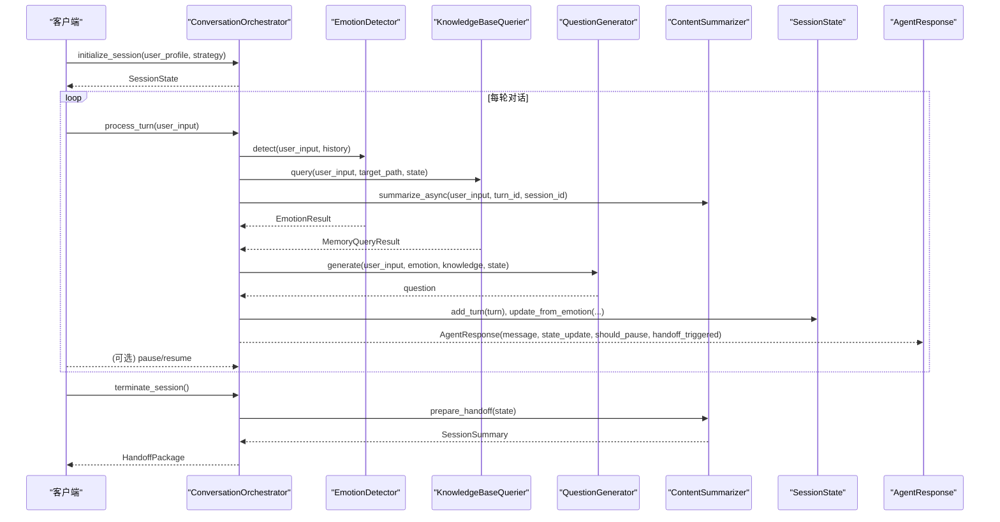
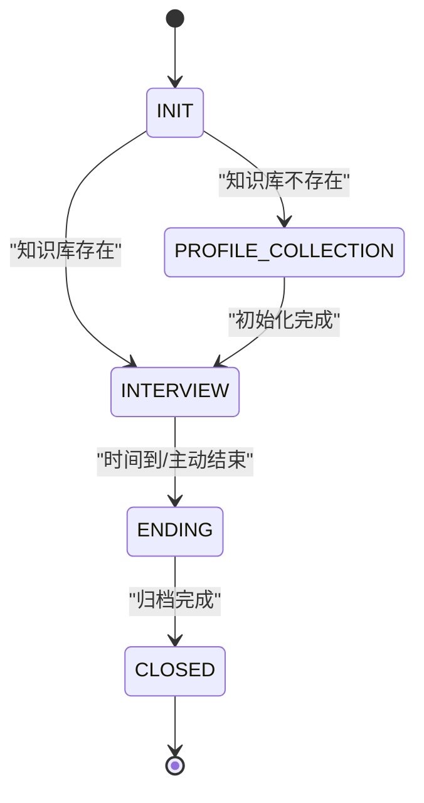
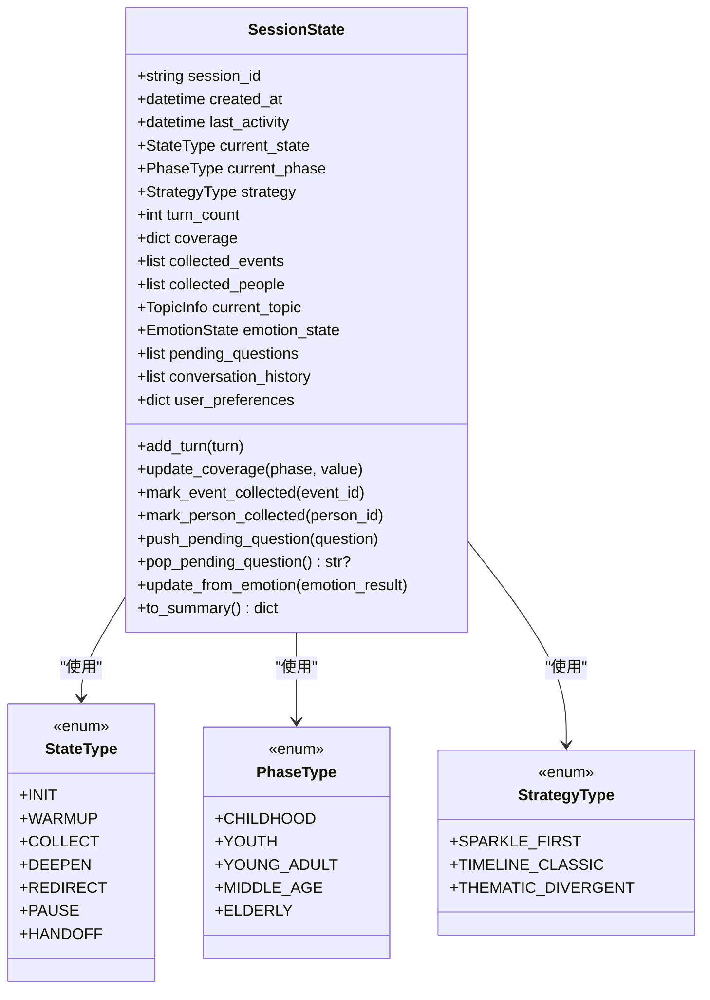
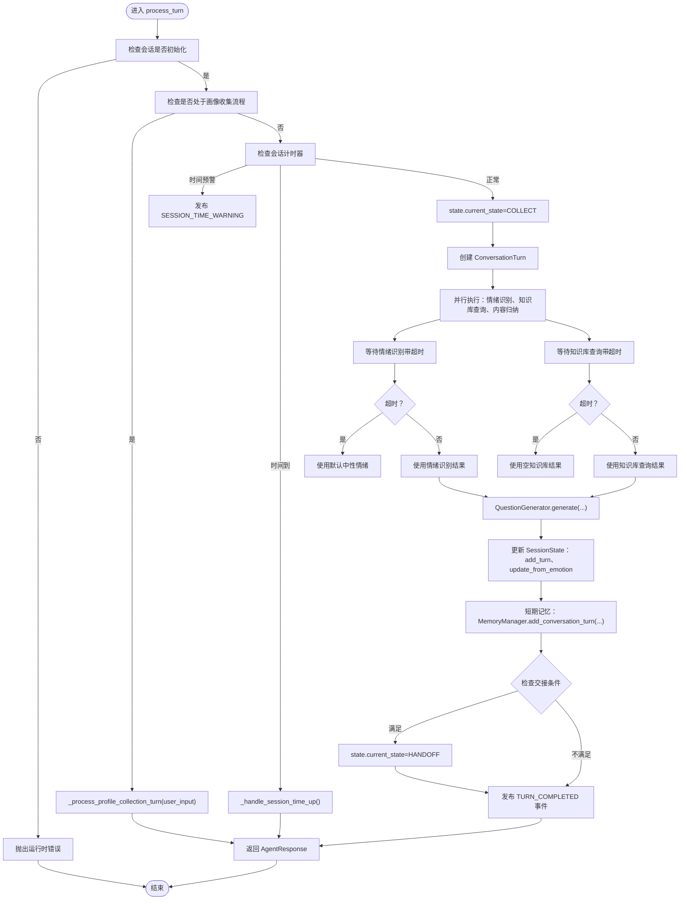
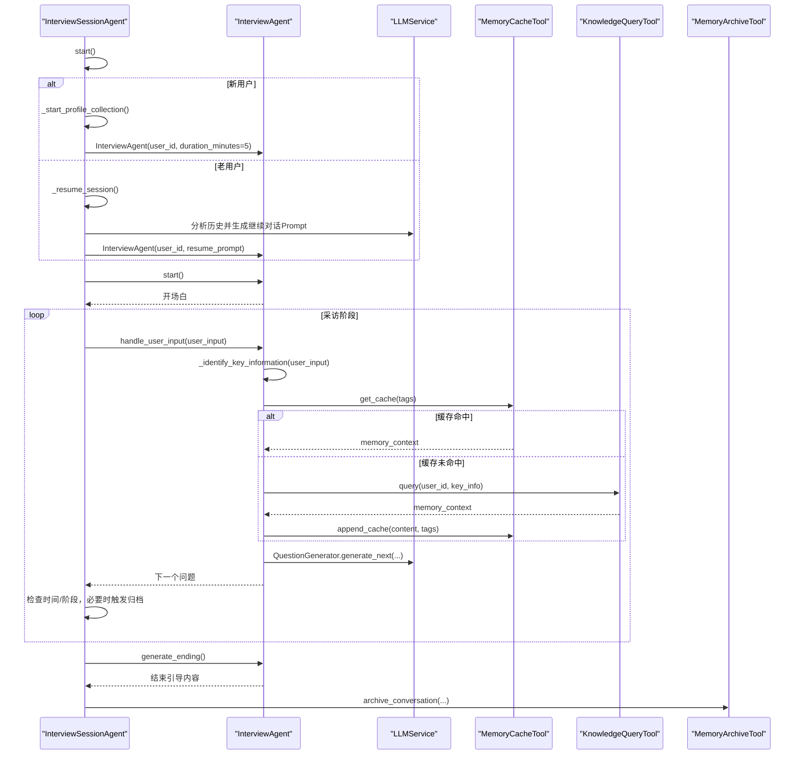
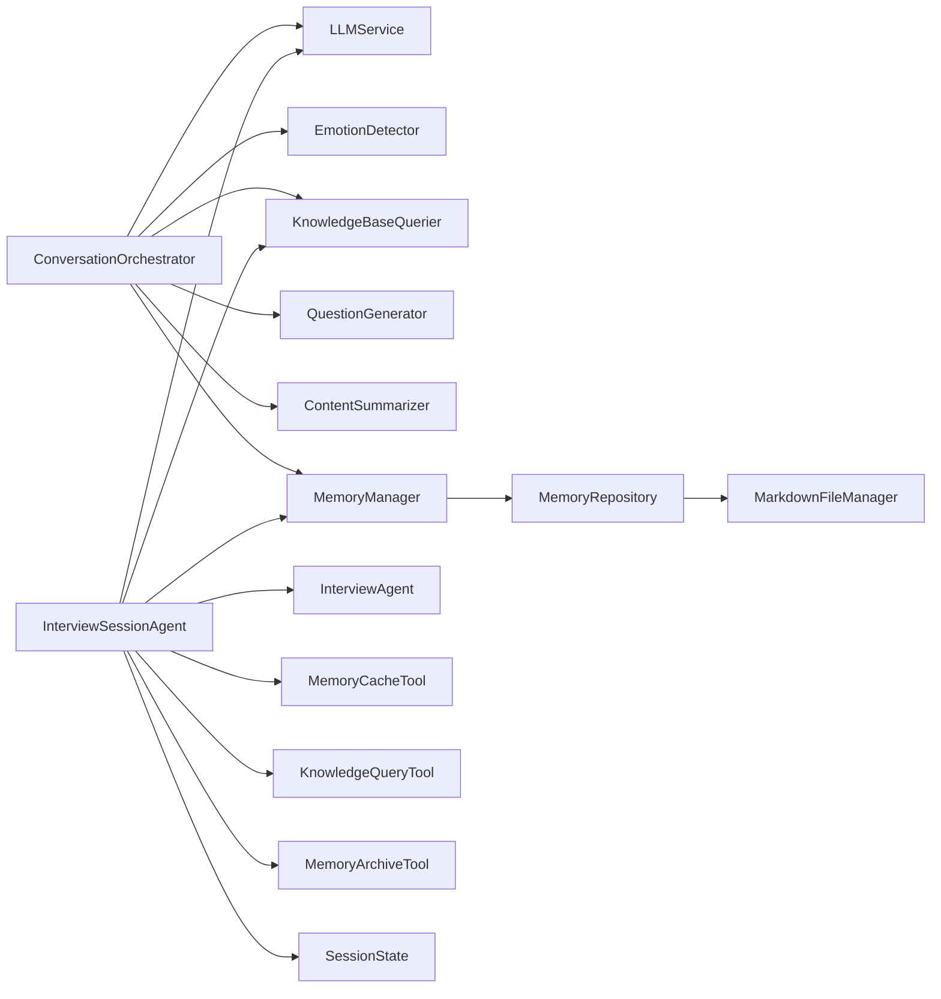

# 对话管理API

<cite>
**本文引用的文件**
- [conversation_orchestrator.py](file://src/core/conversation_orchestrator.py)
- [interview_agent.py](file://src/agents/interview_agent.py)
- [interview_session_agent.py](file://src/agents/interview_session_agent.py)
- [session_state.py](file://src/models/session_state.py)
- [state_type.py](file://src/enums/state_type.py)
- [phase_type.py](file://src/enums/phase_type.py)
- [strategy_type.py](file://src/enums/strategy_type.py)
- [agent_response.py](file://src/models/agent_response.py)
- [conversation_turn.py](file://src/models/conversation_turn.py)
- [profile_questions.py](file://src/config/profile_questions.py)
- [SessionEndGuide-Prompt.md](file://Prompts/SessionEndGuide-Prompt.md)
- [QuestionGenerator-Prompt.md](file://Prompts/QuestionGenerator-Prompt.md)
- [README.md](file://README.md)
- [test_session_state.py](file://tests/test_session_state.py)
- [test_interview_session_agent.py](file://tests/test_interview_session_agent.py)
</cite>

## 目录
1. [简介](#简介)
2. [项目结构](#项目结构)
3. [核心组件](#核心组件)
4. [架构总览](#架构总览)
5. [详细组件分析](#详细组件分析)
6. [依赖分析](#依赖分析)
7. [性能考量](#性能考量)
8. [故障排查指南](#故障排查指南)
9. [结论](#结论)
10. [附录](#附录)

## 简介
本文件面向开发者，系统化梳理“对话管理API”的接口与行为，重点覆盖以下内容：
- ConversationOrchestrator 的核心方法：initialize_session、process_turn、terminate_session、pause_session、prepare_handoff 等的参数、返回值与使用示例
- InterviewAgent 与 InterviewSessionAgent 的交互协议与状态转换
- 会话状态管理机制：SessionState 的状态变更与摘要输出
- 对话轮次处理流程：用户输入接收、Agent 响应生成、情绪与知识库协同、状态更新与事件发布
- 完整的 API 调用示例与错误处理方案

## 项目结构
对话管理API位于 src/core 与 src/agents 目录，围绕 ConversationOrchestrator 作为主控器，协调多个服务与工具，形成“问答引导层”的核心编排。

图表来源
- [conversation_orchestrator.py:138-401](file://src/core/conversation_orchestrator.py#L138-L401)
- [interview_agent.py:16-114](file://src/agents/interview_agent.py#L16-L114)
- [interview_session_agent.py:33-130](file://src/agents/interview_session_agent.py#L33-L130)
- [session_state.py:24-139](file://src/models/session_state.py#L24-L139)
- [agent_response.py:5-22](file://src/models/agent_response.py#L5-L22)
- [conversation_turn.py:14-52](file://src/models/conversation_turn.py#L14-L52)

章节来源
- [README.md:27-53](file://README.md#L27-L53)

## 核心组件
- ConversationOrchestrator：负责会话初始化、轮次处理、状态管理、事件发布、交接准备与终止
- InterviewSessionAgent：负责会话生命周期（初始化→采访→结束）、阶段切换、时间控制与知识库协调
- InterviewAgent：负责主体采访流程，问题生成、知识库查询、缓存管理、时间提示与结束引导
- SessionState：会话状态数据模型，记录轮次、覆盖率、采集内容、情绪状态、待追问问题等
- AgentResponse：封装单轮对话的 Agent 响应与状态摘要
- ConversationTurn：记录单轮对话的用户输入、Agent 回复、提取实体与事件、情绪与来源文件

章节来源
- [conversation_orchestrator.py:138-401](file://src/core/conversation_orchestrator.py#L138-L401)
- [interview_agent.py:16-114](file://src/agents/interview_agent.py#L16-L114)
- [interview_session_agent.py:33-130](file://src/agents/interview_session_agent.py#L33-L130)
- [session_state.py:24-139](file://src/models/session_state.py#L24-L139)
- [agent_response.py:5-22](file://src/models/agent_response.py#L5-L22)
- [conversation_turn.py:14-52](file://src/models/conversation_turn.py#L14-L52)

## 架构总览
对话管理API采用“主控器 + 会话代理 + 服务工具 + 数据模型”的分层架构。主控器在每轮对话中并行执行情绪识别、知识库查询与内容归纳，并根据结果生成问题、更新状态、发布事件；会话代理负责会话生命周期与阶段推进；数据模型贯穿全链路，保证状态一致性与可观测性。

图表来源
- [conversation_orchestrator.py:198-401](file://src/core/conversation_orchestrator.py#L198-L401)
- [session_state.py:87-139](file://src/models/session_state.py#L87-L139)
- [agent_response.py:18-22](file://src/models/agent_response.py#L18-L22)

## 详细组件分析

### ConversationOrchestrator 接口规范
- initialize_session(user_profile: dict, strategy: StrategyType = SPARKLE_FIRST) -> SessionState
  - 功能：初始化会话，设置会话计时器，可选启用首次画像收集流程，创建 SessionState，发布 SESSION_STARTED 事件
  - 参数：
    - user_profile: 用户偏好字典
    - strategy: 采访策略，默认为“闪光点优先”
  - 返回：SessionState
  - 异常：无显式异常抛出，若后续未初始化直接调用 process_turn 将触发运行时错误
  - 使用示例：参考 [conversation_orchestrator.py:151-161](file://src/core/conversation_orchestrator.py#L151-L161)

- process_turn(user_input: str) -> AgentResponse
  - 功能：处理一轮对话，包含画像收集流程、时间预警与终止、情绪处理、并发执行情绪识别与知识库查询、生成问题、更新 SessionState、记录短期记忆、检查交接条件、发布 TURN_COMPLETED 事件
  - 参数：user_input
  - 返回：AgentResponse，包含 message、state_update、should_pause、pause_reason、handoff_triggered
  - 异常：若未初始化会话，抛出运行时错误
  - 使用示例：参考 [conversation_orchestrator.py:236-343](file://src/core/conversation_orchestrator.py#L236-L343)

- prepare_handoff() -> HandoffPackage
  - 功能：生成交接包，包含会话摘要、采集进度、收集数据、原始对话路径与待追问问题，发布 HANDOFF_READY 事件
  - 返回：HandoffPackage
  - 使用示例：参考 [conversation_orchestrator.py:353-389](file://src/core/conversation_orchestrator.py#L353-L389)

- terminate_session() -> HandoffPackage
  - 功能：终止会话，内部调用 prepare_handoff，发布 SESSION_TERMINATED 事件
  - 返回：HandoffPackage
  - 使用示例：参考 [conversation_orchestrator.py:391-401](file://src/core/conversation_orchestrator.py#L391-L401)

- pause_session() -> None
  - 功能：将当前会话状态置为 PAUSE，发布 SESSION_PAUSED 事件
  - 使用示例：参考 [conversation_orchestrator.py:403-410](file://src/core/conversation_orchestrator.py#L403-L410)

- resume_session(session_id: str) -> SessionState
  - 功能：预留恢复会话接口（当前为 TODO）
  - 使用示例：参考 [conversation_orchestrator.py:411-414](file://src/core/conversation_orchestrator.py#L411-L414)

- _process_profile_collection_turn(user_input: str) -> AgentResponse
  - 功能：处理画像收集流程的单轮输入，按 INIT_PROFILE → COLLECT_BASIC → COLLECT_DETAIL → READY 状态机推进
  - 使用示例：参考 [conversation_orchestrator.py:421-551](file://src/core/conversation_orchestrator.py#L421-L551)

- _handle_session_time_up() -> AgentResponse
  - 功能：会话超时处理，生成结束引导内容，标记 HANDOFF，发布 SESSION_TERMINATED
  - 使用示例：参考 [conversation_orchestrator.py:570-592](file://src/core/conversation_orchestrator.py#L570-L592)

- _generate_session_end_guide() -> SessionEndGuideContent
  - 功能：基于 LLM 生成结束引导内容，使用 Prompt 模板
  - 使用示例：参考 [conversation_orchestrator.py:594-615](file://src/core/conversation_orchestrator.py#L594-L615)，模板定义参考 [SessionEndGuide-Prompt.md:31-88](file://Prompts/SessionEndGuide-Prompt.md#L31-L88)

章节来源
- [conversation_orchestrator.py:198-401](file://src/core/conversation_orchestrator.py#L198-L401)
- [conversation_orchestrator.py:421-551](file://src/core/conversation_orchestrator.py#L421-L551)
- [conversation_orchestrator.py:570-615](file://src/core/conversation_orchestrator.py#L570-L615)
- [SessionEndGuide-Prompt.md:31-88](file://Prompts/SessionEndGuide-Prompt.md#L31-L88)

### InterviewAgent 与 InterviewSessionAgent 交互协议与状态转换
InterviewSessionAgent 负责会话生命周期与阶段推进，InterviewAgent 负责主体采访流程。两者通过 InterviewSessionAgent 的 handle_user_input 分发到对应阶段的 Agent。

图表来源
- [interview_session_agent.py:24-52](file://src/agents/interview_session_agent.py#L24-L52)
- [interview_session_agent.py:112-130](file://src/agents/interview_session_agent.py#L112-L130)
- [interview_session_agent.py:178-241](file://src/agents/interview_session_agent.py#L178-L241)
- [interview_session_agent.py:271-284](file://src/agents/interview_session_agent.py#L271-L284)
- [interview_session_agent.py:369-392](file://src/agents/interview_session_agent.py#L369-L392)

章节来源
- [interview_session_agent.py:33-130](file://src/agents/interview_session_agent.py#L33-L130)
- [interview_session_agent.py:178-241](file://src/agents/interview_session_agent.py#L178-L241)
- [interview_session_agent.py:271-284](file://src/agents/interview_session_agent.py#L271-L284)
- [interview_session_agent.py:369-392](file://src/agents/interview_session_agent.py#L369-L392)

### 会话状态管理机制（SessionState）
SessionState 是贯穿会话生命周期的核心数据对象，包含：
- 基本信息：session_id、created_at、last_activity
- 状态：current_state（StateType）、current_phase（PhaseType）、strategy（StrategyType）
- 进度：turn_count、coverage（按阶段覆盖率）
- 采集内容：collected_events、collected_people
- 当前话题：current_topic
- 情绪状态：emotion_state
- 待处理：pending_questions
- 对话历史：conversation_history
- 用户偏好：user_preferences

状态变更与持久化：
- add_turn：追加对话轮次并更新 last_activity
- update_coverage：更新阶段覆盖率（裁剪到 [0,1]）
- mark_event_collected/mark_person_collected：去重标记
- push_pending_question/pop_pending_question：待追问队列操作
- update_from_emotion：从 EmotionResult 更新情绪状态
- to_summary：生成状态摘要（用于对外返回）

图表来源
- [session_state.py:24-139](file://src/models/session_state.py#L24-L139)
- [state_type.py:4-12](file://src/enums/state_type.py#L4-L12)
- [phase_type.py:4-10](file://src/enums/phase_type.py#L4-L10)
- [strategy_type.py:4-8](file://src/enums/strategy_type.py#L4-L8)

章节来源
- [session_state.py:24-139](file://src/models/session_state.py#L24-L139)
- [state_type.py:4-12](file://src/enums/state_type.py#L4-L12)
- [phase_type.py:4-10](file://src/enums/phase_type.py#L4-L10)
- [strategy_type.py:4-8](file://src/enums/strategy_type.py#L4-L8)

### 对话轮次处理流程
每轮对话的关键步骤如下：

图表来源
- [conversation_orchestrator.py:236-343](file://src/core/conversation_orchestrator.py#L236-L343)
- [conversation_orchestrator.py:345-351](file://src/core/conversation_orchestrator.py#L345-L351)
- [conversation_orchestrator.py:570-592](file://src/core/conversation_orchestrator.py#L570-L592)

章节来源
- [conversation_orchestrator.py:236-343](file://src/core/conversation_orchestrator.py#L236-L343)
- [conversation_orchestrator.py:345-351](file://src/core/conversation_orchestrator.py#L345-L351)
- [conversation_orchestrator.py:570-592](file://src/core/conversation_orchestrator.py#L570-L592)

### InterviewAgent 与 InterviewSessionAgent 的交互
InterviewSessionAgent 根据知识库是否存在决定会话起点：
- 新用户：进入 PROFILE_COLLECTION 阶段，由 ProfileCollectionAgent 收集画像，完成后生成基础知识库并切换到 INTERVIEW
- 老用户：直接加载历史对话，分析需要的知识库信息，生成继续对话的 Prompt，初始化 InterviewAgent 启动采访

InterviewAgent 的核心流程：
- start：生成开场白
- handle_input：识别关键信息、查询知识库缓存/知识库、更新缓存、生成下一个问题、检查时间限制
- generate_ending：基于 Prompt 模板生成结束引导内容

图表来源
- [interview_session_agent.py:112-130](file://src/agents/interview_session_agent.py#L112-L130)
- [interview_session_agent.py:178-241](file://src/agents/interview_session_agent.py#L178-L241)
- [interview_session_agent.py:271-284](file://src/agents/interview_session_agent.py#L271-L284)
- [interview_session_agent.py:369-392](file://src/agents/interview_session_agent.py#L369-L392)
- [interview_agent.py:80-114](file://src/agents/interview_agent.py#L80-L114)
- [interview_agent.py:115-184](file://src/agents/interview_agent.py#L115-L184)
- [interview_agent.py:244-272](file://src/agents/interview_agent.py#L244-L272)

章节来源
- [interview_session_agent.py:112-130](file://src/agents/interview_session_agent.py#L112-L130)
- [interview_session_agent.py:178-241](file://src/agents/interview_session_agent.py#L178-L241)
- [interview_session_agent.py:271-284](file://src/agents/interview_session_agent.py#L271-L284)
- [interview_session_agent.py:369-392](file://src/agents/interview_session_agent.py#L369-L392)
- [interview_agent.py:80-114](file://src/agents/interview_agent.py#L80-L114)
- [interview_agent.py:115-184](file://src/agents/interview_agent.py#L115-L184)
- [interview_agent.py:244-272](file://src/agents/interview_agent.py#L244-L272)

### 画像收集与问题库
ConversationOrchestrator 在首次会话时启用画像收集流程，使用 ProfileQuestionBank 提供的基础与详细问题集，按状态机推进并最终保存画像数据。

章节来源
- [conversation_orchestrator.py:421-551](file://src/core/conversation_orchestrator.py#L421-L551)
- [profile_questions.py:3-94](file://src/config/profile_questions.py#L3-L94)

## 依赖分析
- ConversationOrchestrator 依赖 LLMService、EmotionDetector、KnowledgeBaseQuerier、QuestionGenerator、ContentSummarizer、MemoryManager、MemoryRepository、MarkdownFileManager、EventBus、SessionState、AgentResponse、ConversationTurn、StateType、PhaseType、StrategyType、LLMConfig、ProfileQuestionBank
- InterviewSessionAgent 依赖 InterviewAgent、ProfileCollectionAgent、LLMService、MemoryManager、KnowledgeBaseQuerier、MemoryCacheTool、KnowledgeQueryTool、MemoryArchiveTool、SessionState、HandoffPackage、MarkdownFileManager
- InterviewAgent 依赖 LLMService、MemoryManager、QuestionGenerator、MemoryCacheTool、KnowledgeQueryTool、MemoryArchiveTool、SessionState

图表来源
- [conversation_orchestrator.py:9-25](file://src/core/conversation_orchestrator.py#L9-L25)
- [interview_session_agent.py:7-20](file://src/agents/interview_session_agent.py#L7-L20)

章节来源
- [conversation_orchestrator.py:9-25](file://src/core/conversation_orchestrator.py#L9-L25)
- [interview_session_agent.py:7-20](file://src/agents/interview_session_agent.py#L7-L20)

## 性能考量
- 并行执行：process_turn 中对情绪识别与知识库查询采用 asyncio.create_task 并行执行，显著降低端到端延迟
- 超时保护：为情绪识别与知识库查询设置超时，避免阻塞；超时后使用默认值继续流程
- 内容归纳延迟：内容归纳任务异步执行，不阻塞主流程
- 缓存与归档：InterviewAgent 使用缓存减少重复查询，达到5分钟时进行归档，平衡实时性与性能
- 状态摘要：SessionState.to_summary 提供轻量级摘要，便于事件发布与外部观察

章节来源
- [conversation_orchestrator.py:269-302](file://src/core/conversation_orchestrator.py#L269-L302)
- [conversation_orchestrator.py:280-284](file://src/core/conversation_orchestrator.py#L280-L284)
- [interview_agent.py:134-162](file://src/agents/interview_agent.py#L134-L162)
- [interview_agent.py:346-354](file://src/agents/interview_agent.py#L346-L354)

## 故障排查指南
常见错误与处理：
- 未初始化会话即调用 process_turn：抛出运行时错误
  - 处理：确保先调用 initialize_session
  - 参考：[conversation_orchestrator.py:238-239](file://src/core/conversation_orchestrator.py#L238-L239)

- 情绪识别或知识库查询超时：使用默认值继续流程
  - 处理：检查 LLM 服务可用性与网络连接，适当增大超时配置
  - 参考：[conversation_orchestrator.py:288-301](file://src/core/conversation_orchestrator.py#L288-L301)

- 会话时间到：自动触发结束引导并标记交接
  - 处理：调用 terminate_session 获取 HandoffPackage，或在超时后返回结束引导
  - 参考：[conversation_orchestrator.py:256-258](file://src/core/conversation_orchestrator.py#L256-L258)，[conversation_orchestrator.py:570-592](file://src/core/conversation_orchestrator.py#L570-L592)

- InterviewSessionAgent 知识库检查失败：
  - 现象：_check_knowledge_base 返回 False
  - 处理：确认知识库目录结构完整且包含非 index.md 的 Markdown 文件
  - 参考：[test_interview_session_agent.py:16-77](file://tests/test_interview_session_agent.py#L16-L77)，[interview_session_agent.py:131-176](file://src/agents/interview_session_agent.py#L131-L176)

- SessionState 断言失败：
  - 现象：覆盖率越界、待追问队列为空仍弹出等问题
  - 处理：使用 update_coverage 裁剪到 [0,1]，使用 has_pending_questions 判断后再弹出
  - 参考：[test_session_state.py:29-41](file://tests/test_session_state.py#L29-L41)，[test_session_state.py:61-81](file://tests/test_session_state.py#L61-L81)

章节来源
- [conversation_orchestrator.py:238-239](file://src/core/conversation_orchestrator.py#L238-L239)
- [conversation_orchestrator.py:288-301](file://src/core/conversation_orchestrator.py#L288-L301)
- [conversation_orchestrator.py:256-258](file://src/core/conversation_orchestrator.py#L256-L258)
- [conversation_orchestrator.py:570-592](file://src/core/conversation_orchestrator.py#L570-L592)
- [test_interview_session_agent.py:16-77](file://tests/test_interview_session_agent.py#L16-L77)
- [interview_session_agent.py:131-176](file://src/agents/interview_session_agent.py#L131-L176)
- [test_session_state.py:29-41](file://tests/test_session_state.py#L29-L41)
- [test_session_state.py:61-81](file://tests/test_session_state.py#L61-L81)

## 结论
对话管理API通过 ConversationOrchestrator 实现对多服务的统一编排，结合 InterviewSessionAgent 与 InterviewAgent 的阶段化流程，实现了从画像收集到主体采访再到结束引导的完整闭环。SessionState 提供一致的状态视图，AgentResponse 与事件总线保障了可观测性与可扩展性。开发者可据此快速集成并扩展对话管理功能。

## 附录

### API 调用示例（路径引用）
- 初始化会话
  - [conversation_orchestrator.py:198-234](file://src/core/conversation_orchestrator.py#L198-L234)
- 处理对话轮次
  - [conversation_orchestrator.py:236-343](file://src/core/conversation_orchestrator.py#L236-L343)
- 终止会话并获取交接包
  - [conversation_orchestrator.py:391-401](file://src/core/conversation_orchestrator.py#L391-L401)
  - [conversation_orchestrator.py:353-389](file://src/core/conversation_orchestrator.py#L353-L389)
- 会话时间到处理
  - [conversation_orchestrator.py:570-592](file://src/core/conversation_orchestrator.py#L570-L592)
- InterviewAgent 开始与处理输入
  - [interview_agent.py:80-114](file://src/agents/interview_agent.py#L80-L114)
  - [interview_agent.py:115-184](file://src/agents/interview_agent.py#L115-L184)
- InterviewSessionAgent 生命周期
  - [interview_session_agent.py:112-130](file://src/agents/interview_session_agent.py#L112-L130)
  - [interview_session_agent.py:178-241](file://src/agents/interview_session_agent.py#L178-L241)
  - [interview_session_agent.py:271-284](file://src/agents/interview_session_agent.py#L271-L284)
  - [interview_session_agent.py:369-392](file://src/agents/interview_session_agent.py#L369-L392)

### Prompt 模板参考
- 会话结束引导模板
  - [SessionEndGuide-Prompt.md:31-88](file://Prompts/SessionEndGuide-Prompt.md#L31-L88)
- 问题生成模板
  - [QuestionGenerator-Prompt.md:12-89](file://Prompts/QuestionGenerator-Prompt.md#L12-L89)