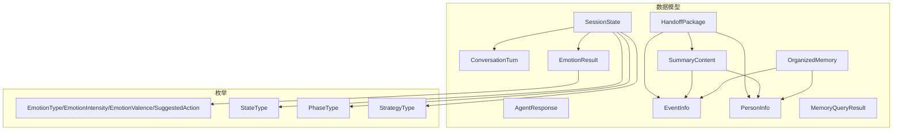
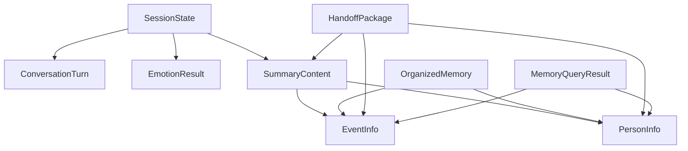
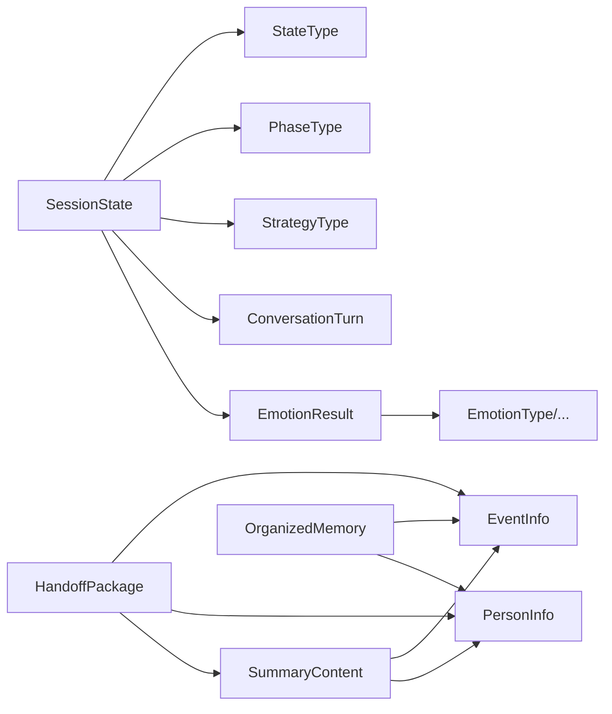

# 数据模型

<cite>
**本文引用的文件**
- [src/models/agent_response.py](file://src/models/agent_response.py)
- [src/models/conversation_turn.py](file://src/models/conversation_turn.py)
- [src/models/emotion_result.py](file://src/models/emotion_result.py)
- [src/models/event_info.py](file://src/models/event_info.py)
- [src/models/handoff_package.py](file://src/models/handoff_package.py)
- [src/models/memory_query_result.py](file://src/models/memory_query_result.py)
- [src/models/organized_memory.py](file://src/models/organized_memory.py)
- [src/models/person_info.py](file://src/models/person_info.py)
- [src/models/session_state.py](file://src/models/session_state.py)
- [src/models/summary_content.py](file://src/models/summary_content.py)
- [src/service/schemas/requests.py](file://src/service/schemas/requests.py)
- [src/enums/emotion_type.py](file://src/enums/emotion_type.py)
- [src/enums/state_type.py](file://src/enums/state_type.py)
- [src/enums/phase_type.py](file://src/enums/phase_type.py)
- [src/enums/strategy_type.py](file://src/enums/strategy_type.py)
- [tests/test_session_state.py](file://tests/test_session_state.py)
</cite>

## 目录
1. [简介](#简介)
2. [项目结构](#项目结构)
3. [核心组件](#核心组件)
4. [架构总览](#架构总览)
5. [详细组件分析](#详细组件分析)
6. [依赖分析](#依赖分析)
7. [性能考虑](#性能考虑)
8. [故障排查指南](#故障排查指南)
9. [结论](#结论)
10. [附录](#附录)

## 简介
本章节概述数据模型的设计目标与整体职责，强调其在会话编排、记忆抽取与结构化存储中的作用，并给出面向开发者的使用指引。

## 项目结构
数据模型主要位于 src/models 目录下，围绕“会话状态”“对话轮次”“情绪识别结果”“事件与人物信息”“记忆查询结果”“结构化记忆组织”“交接包”“归纳内容”等核心对象构建，配合 src/enums 中的枚举类型统一状态与分类。

图表来源
- [src/models/session_state.py:24-139](file://src/models/session_state.py#L24-L139)
- [src/models/conversation_turn.py:14-52](file://src/models/conversation_turn.py#L14-L52)
- [src/models/emotion_result.py:6-57](file://src/models/emotion_result.py#L6-L57)
- [src/models/event_info.py:5-69](file://src/models/event_info.py#L5-L69)
- [src/models/person_info.py:5-61](file://src/models/person_info.py#L5-L61)
- [src/models/memory_query_result.py:23-81](file://src/models/memory_query_result.py#L23-L81)
- [src/models/organized_memory.py:141-151](file://src/models/organized_memory.py#L141-L151)
- [src/models/handoff_package.py:32-66](file://src/models/handoff_package.py#L32-L66)
- [src/models/summary_content.py:37-67](file://src/models/summary_content.py#L37-L67)
- [src/enums/emotion_type.py:4-50](file://src/enums/emotion_type.py#L4-L50)
- [src/enums/state_type.py:4-12](file://src/enums/state_type.py#L4-L12)
- [src/enums/phase_type.py:4-10](file://src/enums/phase_type.py#L4-L10)
- [src/enums/strategy_type.py:4-8](file://src/enums/strategy_type.py#L4-L8)

章节来源
- [src/models/session_state.py:24-139](file://src/models/session_state.py#L24-L139)
- [src/models/conversation_turn.py:14-52](file://src/models/conversation_turn.py#L14-L52)
- [src/models/emotion_result.py:6-57](file://src/models/emotion_result.py#L6-L57)
- [src/models/event_info.py:5-69](file://src/models/event_info.py#L5-L69)
- [src/models/person_info.py:5-61](file://src/models/person_info.py#L5-L61)
- [src/models/memory_query_result.py:23-81](file://src/models/memory_query_result.py#L23-L81)
- [src/models/organized_memory.py:141-151](file://src/models/organized_memory.py#L141-L151)
- [src/models/handoff_package.py:32-66](file://src/models/handoff_package.py#L32-L66)
- [src/models/summary_content.py:37-67](file://src/models/summary_content.py#L37-L67)
- [src/enums/emotion_type.py:4-50](file://src/enums/emotion_type.py#L4-L50)
- [src/enums/state_type.py:4-12](file://src/enums/state_type.py#L4-L12)
- [src/enums/phase_type.py:4-10](file://src/enums/phase_type.py#L4-L10)
- [src/enums/strategy_type.py:4-8](file://src/enums/strategy_type.py#L4-L8)

## 核心组件
本节聚焦于关键数据模型的定义、字段说明与典型使用场景，帮助开发者快速理解数据结构与流转。

- AgentResponse
  - 字段与含义
    - message: 字符串，Agent回复消息
    - state_update: 字典，状态更新摘要
    - should_pause: 布尔，是否应该暂停
    - pause_reason: 可选字符串，暂停原因
    - handoff_triggered: 布尔，是否触发交接
  - 使用场景
    - 作为会话编排器单轮处理的返回值
    - 向上层调用者传递响应与控制信号
  - 参考路径
    - [src/models/agent_response.py:5-22](file://src/models/agent_response.py#L5-L22)

- EmotionResult
  - 字段与含义
    - emotion_type: 枚举，情绪类型
    - intensity: 枚举，情绪强度
    - valence: 枚举，情绪极性
    - confidence: 浮点数，置信度
    - suggested_action: 枚举，建议动作
  - 行为方法
    - needs_special_handling: 是否需要特殊处理
    - should_pause(): 是否应该暂停
    - default_neutral(): 创建默认中性情绪结果
  - 使用场景
    - 情绪检测器的输出
    - 会话编排器根据情绪调整策略
    - 问题生成器基于情绪生成响应
  - 参考路径
    - [src/models/emotion_result.py:6-57](file://src/models/emotion_result.py#L6-L57)
    - [src/enums/emotion_type.py:4-50](file://src/enums/emotion_type.py#L4-L50)

- EventInfo
  - 字段与含义
    - event_id: 字符串，事件ID
    - title: 字符串，事件标题
    - time: 字符串，时间描述
    - time_precision: 字符串，默认“year”，时间精度
    - location: 字符串，默认空，地点
    - type: 字符串，默认“other”，事件类型
    - description: 字符串，事件描述
    - details: 字符串列表，默认空，关键细节
    - participants: 字符串列表，默认空，参与人物
    - emotions: 字符串列表，默认空，情感标签
    - significance: 字符串，默认空，事件意义
    - source_turns: 整数列表，默认空，来源对话轮次
  - 行为方法
    - to_markdown(): 转换为Markdown格式
  - 使用场景
    - 内容归纳器的提取结果
    - Markdown文件管理器写入文件
    - 交接包的组成部分
  - 参考路径
    - [src/models/event_info.py:5-69](file://src/models/event_info.py#L5-L69)

- PersonInfo
  - 字段与含义
    - person_id: 字符串，人物ID
    - name: 字符串，姓名
    - role: 字符串，角色/关系
    - description: 字符串，默认空，人物描述
    - relation_to_protagonist: 字符串，默认空，与主人公的关系
    - source_events: 字符串列表，默认空，相关事件ID
    - birth_year: 字符串，默认空，出生年份
    - characteristics: 字符串列表，默认空，性格特征
    - influence: 字符串，默认空，对主人公的影响
    - quotes: 字符串列表，默认空，重要语录
  - 行为方法
    - to_markdown(): 转换为Markdown格式
  - 使用场景
    - 内容归纳器的提取结果
    - Markdown文件管理器写入文件
    - 交接包的组成部分
  - 参考路径
    - [src/models/person_info.py:5-61](file://src/models/person_info.py#L5-L61)

- SessionState
  - 字段与含义
    - session_id: 字符串，会话唯一标识
    - created_at/last_activity: 时间戳
    - current_state: 枚举，当前对话状态
    - current_phase: 枚举，当前人生阶段
    - strategy: 枚举，当前采访策略
    - turn_count: 整数，对话轮数
    - coverage: 字典，各阶段覆盖率
    - collected_events/collected_people: 字符串列表，已收集事件与人物ID
    - current_topic: 可选当前话题信息
    - emotion_state: 情绪状态
    - pending_questions: 字符串列表，待追问问题
    - conversation_history: 对话历史（ConversationTurn列表）
    - user_preferences: 字典，用户偏好
  - 行为方法
    - add_turn(turn): 添加一轮对话
    - update_coverage(phase, value): 更新覆盖率
    - mark_event_collected(event_id)/mark_person_collected(person_id): 标记采集
    - push_pending_question()/pop_pending_question()/has_pending_questions(): 待追问问题队列操作
    - update_from_emotion(emotion_result): 从情绪结果更新状态
    - to_summary(): 生成状态摘要
    - get_recent_history(n): 获取最近n轮对话
  - 使用场景
    - 会话编排器持有并更新
    - 各服务对象读取状态信息
    - 暂停/恢复时持久化/反序列化
  - 参考路径
    - [src/models/session_state.py:24-139](file://src/models/session_state.py#L24-L139)
    - [src/enums/state_type.py:4-12](file://src/enums/state_type.py#L4-L12)
    - [src/enums/phase_type.py:4-10](file://src/enums/phase_type.py#L4-L10)
    - [src/enums/strategy_type.py:4-8](file://src/enums/strategy_type.py#L4-L8)

- ConversationTurn
  - 字段与含义
    - turn_id: 整数，轮次ID
    - timestamp: 时间戳
    - user_input: 字符串，用户输入文本
    - agent_response: 可选字符串，Agent回复文本
    - extracted_entities: 实体列表
    - extracted_events: 事件预览列表（EventInfo）
    - emotion: 可选字符串，情绪类型
    - source_files_referenced: 字符串列表，引用的记忆库文件
    - metadata: 字典，额外元数据
  - 使用场景
    - 作为会话状态的历史记录元素
    - 情绪检测器的输入
    - 内容归纳器的输入
  - 参考路径
    - [src/models/conversation_turn.py:14-52](file://src/models/conversation_turn.py#L14-L52)

- MemoryQueryResult
  - 字段与含义
    - query/query_time: 查询与时间
    - entries: 记忆条目列表（MemoryEntry）
    - linked_content: 链接内容列表（LinkedContent）
    - total_count/has_results: 总数与是否存在结果
  - 行为方法
    - get_top_entries(n)/get_events()/get_people(): 结果筛选与聚合
    - has_related_events(): 是否存在相关事件
    - empty()/from_entries(query, entries): 工厂方法
  - 使用场景
    - 知识库查询器的返回值
    - 问题生成器的上下文
    - 内容归纳器的参考
  - 参考路径
    - [src/models/memory_query_result.py:23-81](file://src/models/memory_query_result.py#L23-L81)

- OrganizedMemory
  - 字段与含义
    - timeline_updates: 时间线更新列表
    - events: 事件提取列表
    - people: 人物提取列表
    - profile_updates/storage_suggestions/processing_summary: 可选画像更新、存储建议与处理摘要
  - 使用场景
    - 结构化记忆组织的完整输出
    - 指导后续存储与更新
  - 参考路径
    - [src/models/organized_memory.py:141-151](file://src/models/organized_memory.py#L141-L151)

- HTTP 请求模型
  - UserIdRequest: user_id
  - InterviewProfilePrefillRequest: wechat_id, user_id, name, age, birth_date, gender
  - InterviewMessageRequest: user_id, session_id, message, candidate_questions
  - InterviewEndRequest: user_id, session_id
  - ChapterConfirmRequest: notes
  - ErrorResponse / ErrorDetail: 标准错误响应结构
  - 参考路径
    - [src/service/schemas/requests.py:9-113](file://src/service/schemas/requests.py#L9-L113)

- HandoffPackage
  - 字段与含义
    - handoff_id/from_agent/to_agent/timestamp: 交接标识与时间
    - session_info: 会话摘要
    - collection_progress: 采集进度
    - collected_data: 采集数据（事件、人物、时间线、主题）
    - raw_conversations_path: 原始对话记录文件路径
    - pending_questions: 待处理问题
    - notes_for_agent_b: 给下游Agent的提示
  - 使用场景
    - 会话终止时的输出
    - 传递给下游Agent-B（结构化内容整理层）
  - 参考路径
    - [src/models/handoff_package.py:32-66](file://src/models/handoff_package.py#L32-L66)

- SummaryContent
  - 字段与含义
    - summary_id/session_id/turn_range/created_at: 归纳标识与时间范围
    - extracted_info: 提取的信息（事件、人物、时间标记、主题）
    - memory_updates: 记忆更新计划
    - pending_questions: 待处理问题
    - handoff_ready/handoff_reason: 交接状态与原因
  - 使用场景
    - 内容归纳器的输出
    - 记忆管理器更新记忆的依据
    - 交接包的组成部分
  - 参考路径
    - [src/models/summary_content.py:37-67](file://src/models/summary_content.py#L37-L67)

章节来源
- [src/models/agent_response.py:5-22](file://src/models/agent_response.py#L5-L22)
- [src/models/emotion_result.py:6-57](file://src/models/emotion_result.py#L6-L57)
- [src/models/event_info.py:5-69](file://src/models/event_info.py#L5-L69)
- [src/models/person_info.py:5-61](file://src/models/person_info.py#L5-L61)
- [src/models/session_state.py:24-139](file://src/models/session_state.py#L24-L139)
- [src/models/conversation_turn.py:14-52](file://src/models/conversation_turn.py#L14-L52)
- [src/models/memory_query_result.py:23-81](file://src/models/memory_query_result.py#L23-L81)
- [src/models/organized_memory.py:141-151](file://src/models/organized_memory.py#L141-L151)
- [src/models/handoff_package.py:32-66](file://src/models/handoff_package.py#L32-L66)
- [src/models/summary_content.py:37-67](file://src/models/summary_content.py#L37-L67)
- [src/enums/emotion_type.py:4-50](file://src/enums/emotion_type.py#L4-L50)
- [src/enums/state_type.py:4-12](file://src/enums/state_type.py#L4-L12)
- [src/enums/phase_type.py:4-10](file://src/enums/phase_type.py#L4-L10)
- [src/enums/strategy_type.py:4-8](file://src/enums/strategy_type.py#L4-L8)

## 架构总览
下图展示数据模型之间的高层关系与典型交互路径，体现从会话到记忆、从抽取到结构化组织再到交接的全链路。

图表来源
- [src/models/session_state.py:24-139](file://src/models/session_state.py#L24-L139)
- [src/models/conversation_turn.py:14-52](file://src/models/conversation_turn.py#L14-L52)
- [src/models/emotion_result.py:6-57](file://src/models/emotion_result.py#L6-L57)
- [src/models/summary_content.py:37-67](file://src/models/summary_content.py#L37-L67)
- [src/models/event_info.py:5-69](file://src/models/event_info.py#L5-L69)
- [src/models/person_info.py:5-61](file://src/models/person_info.py#L5-L61)
- [src/models/organized_memory.py:141-151](file://src/models/organized_memory.py#L141-L151)
- [src/models/handoff_package.py:32-66](file://src/models/handoff_package.py#L32-L66)
- [src/models/memory_query_result.py:23-81](file://src/models/memory_query_result.py#L23-L81)

## 详细组件分析

### AgentResponse 模型详解
- 字段说明
  - message: 用于承载Agent的回复文本
  - state_update: 用于携带本轮对话后的状态摘要（如覆盖率、话题变化等）
  - should_pause: 控制是否暂停当前会话流程
  - pause_reason: 说明暂停的原因（可选）
  - handoff_triggered: 标识是否触发交接流程
- 使用方法
  - 在会话编排器完成一轮处理后，封装为 AgentResponse 返回给上层调用者
  - 上层根据 should_pause 和 handoff_triggered 决策后续流程
- 示例与最佳实践
  - 当需要提示用户稍后再继续或需要人工介入时，设置 should_pause 并填充 pause_reason
  - 当达到交接条件时，设置 handoff_triggered，以便进入下游Agent处理

章节来源
- [src/models/agent_response.py:5-22](file://src/models/agent_response.py#L5-L22)

### EmotionResult 模型详解
- 字段说明
  - emotion_type: 情绪类型（正向/中性/负向/特殊）
  - intensity: 情绪强度（低/中/高）
  - valence: 情绪极性（正/中/负）
  - confidence: 置信度（0~1）
  - suggested_action: 建议动作（继续/暂停/安慰/重定向）
- 行为方法
  - needs_special_handling: 当高负面强度或特定情绪类型时返回真
  - should_pause(): 当建议动作为暂停或安慰时返回真
  - default_neutral(): 快速构造默认中性情绪结果
- 使用方法
  - 情绪检测器输出 EmotionResult，会话编排器据此决定策略调整与问题生成
- 示例与最佳实践
  - 高强度负面情绪或疲劳、抗拒、困惑等特殊类型应触发暂停或安慰策略
  - 默认中性结果可用于兜底，确保系统稳定

章节来源
- [src/models/emotion_result.py:6-57](file://src/models/emotion_result.py#L6-L57)
- [src/enums/emotion_type.py:4-50](file://src/enums/emotion_type.py#L4-L50)

### EventInfo 与 PersonInfo 模型详解
- EventInfo
  - 用途：结构化记录单个事件，支持写入记忆库
  - 关键字段：事件ID、标题、时间、地点、类型、描述、细节、参与者、情感标签、意义、来源轮次
  - 行为：to_markdown() 输出标准Markdown格式
- PersonInfo
  - 用途：结构化记录人物画像，支持写入记忆库
  - 关键字段：人物ID、姓名、角色/关系、描述、与主人公关系、相关事件ID；可选扩展字段包括出生年份、性格特征、影响、语录
  - 行为：to_markdown() 输出标准Markdown格式
- 使用方法
  - 内容归纳器提取后，分别封装为 EventInfo 与 PersonInfo
  - 由文件管理器写入知识库对应目录
  - 作为交接包与归纳内容的一部分传递给下游模块
- 示例与最佳实践
  - 事件与人物的来源轮次用于溯源，便于回查对话上下文
  - Markdown格式保证了知识库的一致性与可读性

章节来源
- [src/models/event_info.py:5-69](file://src/models/event_info.py#L5-L69)
- [src/models/person_info.py:5-61](file://src/models/person_info.py#L5-L61)

### SessionState 会话状态管理机制
- 结构组成
  - 基本信息：会话ID、创建/最后活动时间
  - 状态：当前对话状态、当前人生阶段、当前策略
  - 进度：对话轮数、各阶段覆盖率
  - 采集：已收集事件与人物ID列表
  - 当前话题与情绪状态
  - 待处理问题队列
  - 对话历史（ConversationTurn列表）
  - 用户偏好
- 核心方法
  - add_turn()/update_coverage()/mark_event_collected()/mark_person_collected()
  - push_pending_question()/pop_pending_question()/has_pending_questions()
  - update_from_emotion()/to_summary()/get_recent_history(n)
- 使用方法
  - 会话编排器持有并持续更新；各服务读取状态进行决策
  - 暂停/恢复时进行持久化/反序列化
- 示例与最佳实践
  - 覆盖率更新需限制在[0,1]区间
  - 情绪状态随每轮对话更新，便于策略动态调整

章节来源
- [src/models/session_state.py:24-139](file://src/models/session_state.py#L24-L139)
- [src/enums/state_type.py:4-12](file://src/enums/state_type.py#L4-L12)
- [src/enums/phase_type.py:4-10](file://src/enums/phase_type.py#L4-L10)
- [src/enums/strategy_type.py:4-8](file://src/enums/strategy_type.py#L4-L8)
- [tests/test_session_state.py:18-143](file://tests/test_session_state.py#L18-L143)

### 中间数据结构：ConversationTurn、MemoryQueryResult、OrganizedMemory
- ConversationTurn
  - 用途：记录单轮对话的完整信息，包括用户输入、Agent回复、抽取的实体与事件、情绪、来源文件与元数据
  - 与SessionState的交互：作为历史记录存入 conversation_history
- MemoryQueryResult
  - 用途：封装记忆库查询结果，包含匹配条目、链接内容、总数与是否存在结果
  - 方法：按相关度排序、筛选事件/人物、工厂方法
- OrganizedMemory
  - 用途：结构化记忆组织的完整输出，包含时间线更新、事件与人物提取、画像更新、存储建议与处理摘要
  - 与EventInfo/PersonInfo的关系：作为更高层的聚合载体

章节来源
- [src/models/conversation_turn.py:14-52](file://src/models/conversation_turn.py#L14-L52)
- [src/models/memory_query_result.py:23-81](file://src/models/memory_query_result.py#L23-L81)
- [src/models/organized_memory.py:141-151](file://src/models/organized_memory.py#L141-L151)

### 交接与归纳：HandoffPackage 与 SummaryContent
- HandoffPackage
  - 用途：封装完整的采集结果与进度，传递给下游Agent
  - 关键字段：会话摘要、采集进度、采集数据（事件、人物、时间线、主题）、原始对话路径、待处理问题、给下游的提示
- SummaryContent
  - 用途：内容归纳的结构化结果，指导记忆库更新
  - 关键字段：归纳ID、会话ID、轮次范围、提取信息、记忆更新计划、待处理问题、交接状态与原因

章节来源
- [src/models/handoff_package.py:32-66](file://src/models/handoff_package.py#L32-L66)
- [src/models/summary_content.py:37-67](file://src/models/summary_content.py#L37-L67)

## 依赖分析
- 枚举依赖
  - EmotionResult 依赖情绪相关枚举（类型、强度、极性、建议动作）
  - SessionState 依赖状态、阶段、策略枚举
- 类型耦合
  - SessionState 依赖 ConversationTurn、EmotionResult
  - SummaryContent 依赖 EventInfo、PersonInfo
  - OrganizedMemory 依赖 EventInfo、PersonInfo
  - HandoffPackage 依赖 EventInfo、PersonInfo、SummaryContent
- 依赖可视化

图表来源
- [src/models/session_state.py:24-139](file://src/models/session_state.py#L24-L139)
- [src/models/emotion_result.py:6-57](file://src/models/emotion_result.py#L6-L57)
- [src/models/summary_content.py:37-67](file://src/models/summary_content.py#L37-L67)
- [src/models/organized_memory.py:141-151](file://src/models/organized_memory.py#L141-L151)
- [src/models/handoff_package.py:32-66](file://src/models/handoff_package.py#L32-L66)
- [src/enums/emotion_type.py:4-50](file://src/enums/emotion_type.py#L4-L50)
- [src/enums/state_type.py:4-12](file://src/enums/state_type.py#L4-L12)
- [src/enums/phase_type.py:4-10](file://src/enums/phase_type.py#L4-L10)
- [src/enums/strategy_type.py:4-8](file://src/enums/strategy_type.py#L4-L8)

## 性能考虑
- 序列化与持久化
  - SessionState 与 HandoffPackage 建议采用紧凑的字典形式进行序列化，避免深层嵌套导致的体积膨胀
- 查询与过滤
  - MemoryQueryResult 的 get_top_entries 与筛选方法应结合索引或缓存提升性能
- 内存占用
  - ConversationTurn 与 SessionState.history 需要定期清理过期轮次，防止内存增长

## 故障排查指南
- 常见问题
  - 覆盖率越界：update_coverage 应限制在[0,1]区间
  - 重复采集：mark_event_collected/mark_person_collected 应去重
  - 待追问问题队列为空：pop_pending_question 返回None时需判空
- 单元测试参考
  - 会话状态的创建、添加轮次、覆盖率更新、采集标记、待追问问题队列、摘要生成、最近历史获取、从情绪更新状态等均有完备测试覆盖

章节来源
- [tests/test_session_state.py:7-143](file://tests/test_session_state.py#L7-L143)

## 结论
本数据模型体系围绕“会话—抽取—组织—交接”的主线，提供了清晰、可扩展的数据结构与行为接口。通过统一的枚举与严格的字段约束，确保了跨模块协作的一致性与可靠性。建议在实际集成中遵循字段命名规范与行为契约，充分利用摘要与工厂方法简化开发。

## 附录
- JSON 示例与 Python 类定义
  - 以下示例仅展示字段结构与类型，不包含具体业务值，请根据实际需求填充
  - AgentResponse
    - 字段：message: string, state_update: object, should_pause: boolean, pause_reason: string|null, handoff_triggered: boolean
    - 参考路径：[src/models/agent_response.py:5-22](file://src/models/agent_response.py#L5-L22)
  - EmotionResult
    - 字段：emotion_type: enum, intensity: enum, valence: enum, confidence: number, suggested_action: enum
    - 行为：needs_special_handling(), should_pause(), default_neutral()
    - 参考路径：[src/models/emotion_result.py:6-57](file://src/models/emotion_result.py#L6-L57)
  - EventInfo
    - 字段：event_id: string, title: string, time: string, time_precision: string, location: string, type: string, description: string, details: string[], participants: string[], emotions: string[], significance: string, source_turns: number[]
    - 行为：to_markdown()
    - 参考路径：[src/models/event_info.py:5-69](file://src/models/event_info.py#L5-L69)
  - PersonInfo
    - 字段：person_id: string, name: string, role: string, description: string, relation_to_protagonist: string, source_events: string[], birth_year: string, characteristics: string[], influence: string, quotes: string[]
    - 行为：to_markdown()
    - 参考路径：[src/models/person_info.py:5-61](file://src/models/person_info.py#L5-L61)
  - SessionState
    - 字段：session_id: string, created_at: datetime, last_activity: datetime, current_state: enum, current_phase: enum, strategy: enum, turn_count: number, coverage: object, collected_events: string[], collected_people: string[], current_topic: object|null, emotion_state: object, pending_questions: string[], conversation_history: object[], user_preferences: object
    - 行为：add_turn(), update_coverage(), mark_event_collected(), mark_person_collected(), push_pending_question(), pop_pending_question(), has_pending_questions(), update_from_emotion(), to_summary(), get_recent_history(n)
    - 参考路径：[src/models/session_state.py:24-139](file://src/models/session_state.py#L24-L139)
  - ConversationTurn
    - 字段：turn_id: number, timestamp: datetime, user_input: string, agent_response: string|null, extracted_entities: object[], extracted_events: object[], emotion: string|null, source_files_referenced: string[], metadata: object
    - 参考路径：[src/models/conversation_turn.py:14-52](file://src/models/conversation_turn.py#L14-L52)
  - MemoryQueryResult
    - 字段：query: string, query_time: datetime, entries: object[], linked_content: object[], total_count: number, has_results: boolean
    - 行为：get_top_entries(n), get_events(), get_people(), has_related_events(), empty(), from_entries(query, entries)
    - 参考路径：[src/models/memory_query_result.py:23-81](file://src/models/memory_query_result.py#L23-L81)
  - OrganizedMemory
    - 字段：timeline_updates: object[], events: object[], people: object[], profile_updates: object|null, storage_suggestions: object|null, processing_summary: object|null
    - 参考路径：[src/models/organized_memory.py:141-151](file://src/models/organized_memory.py#L141-L151)
  - HandoffPackage
    - 字段：handoff_id: string, from_agent: string, to_agent: string, timestamp: datetime, session_info: object, collection_progress: object, collected_data: object, raw_conversations_path: string, pending_questions: string[], notes_for_agent_b: string[]
    - 参考路径：[src/models/handoff_package.py:32-66](file://src/models/handoff_package.py#L32-L66)
  - SummaryContent
    - 字段：summary_id: string, session_id: string, turn_range: [number, number], created_at: datetime, extracted_info: object, memory_updates: object, pending_questions: string[], handoff_ready: boolean, handoff_reason: string|null
    - 参考路径：[src/models/summary_content.py:37-67](file://src/models/summary_content.py#L37-L67)
