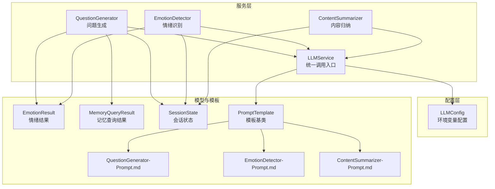
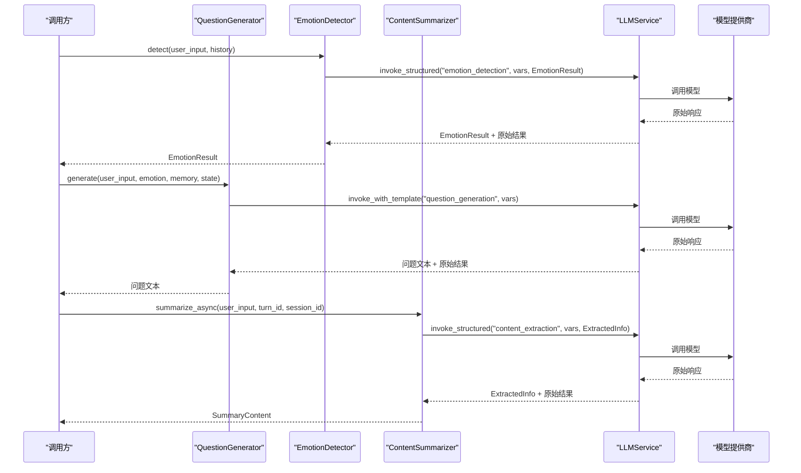
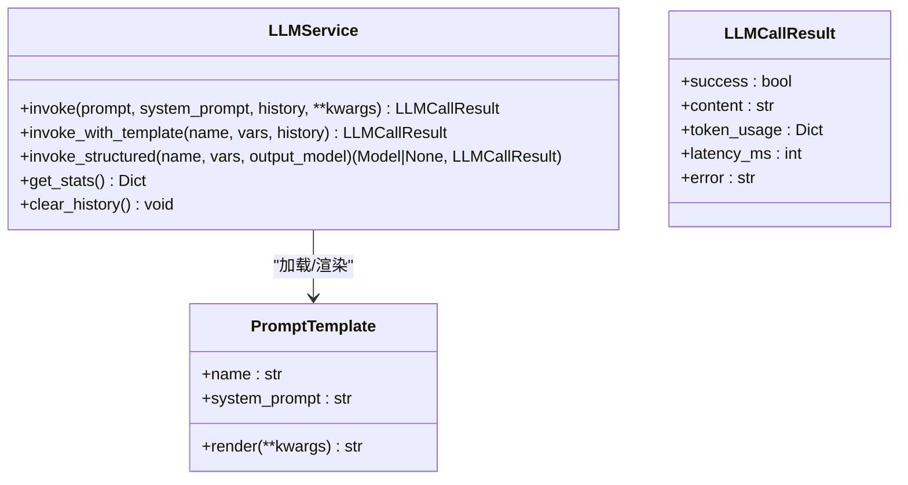
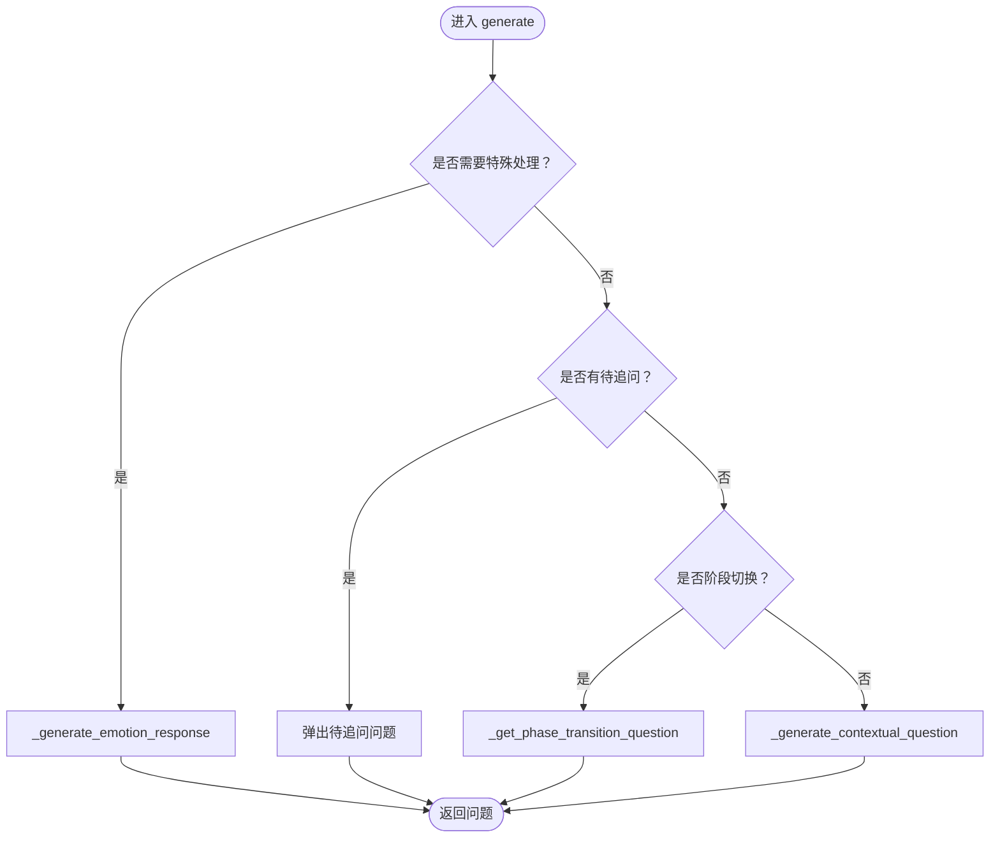
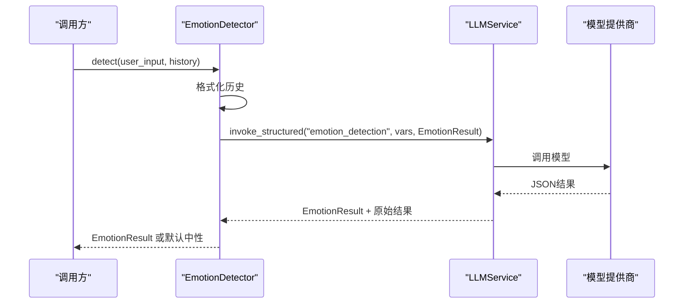
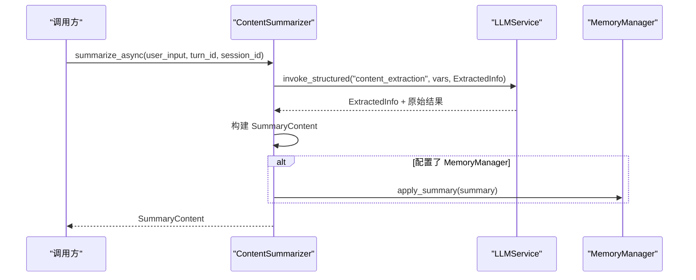
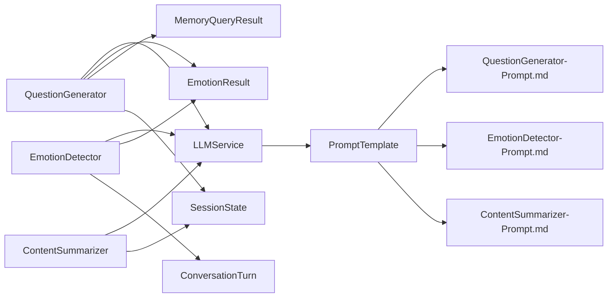

# 服务接口

<cite>
**本文引用的文件**
- [llm_service.py](file://src/services/llm_service.py)
- [question_generator.py](file://src/services/question_generator.py)
- [emotion_detector.py](file://src/services/emotion_detector.py)
- [content_summarizer.py](file://src/services/content_summarizer.py)
- [llm_config.py](file://src/config/llm_config.py)
- [emotion_result.py](file://src/models/emotion_result.py)
- [memory_query_result.py](file://src/models/memory_query_result.py)
- [session_state.py](file://src/models/session_state.py)
- [base.py](file://src/prompts/base.py)
- [QuestionGenerator-Prompt.md](file://Prompts/QuestionGenerator-Prompt.md)
- [EmotionDetector-Prompt.md](file://Prompts/EmotionDetector-Prompt.md)
- [ContentSummarizer-Prompt.md](file://Prompts/ContentSummarizer-Prompt.md)
- [emotion_type.py](file://src/enums/emotion_type.py)
- [phase_type.py](file://src/enums/phase_type.py)
</cite>

## 目录
1. [简介](#简介)
2. [项目结构](#项目结构)
3. [核心组件](#核心组件)
4. [架构总览](#架构总览)
5. [详细组件分析](#详细组件分析)
6. [依赖分析](#依赖分析)
7. [性能考量](#性能考量)
8. [故障排查指南](#故障排查指南)
9. [结论](#结论)
10. [附录](#附录)

## 简介
本文件面向服务接口，系统化梳理并说明以下能力：
- LLMService 统一接口：模型调用、参数配置、结构化输出、Prompt模板管理、重试与统计
- QuestionGenerator 问题生成接口与优化策略
- EmotionDetector 情绪识别API与情感分析结果
- ContentSummarizer 内容归纳接口与摘要生成方法
- LLMConfig 配置管理接口与环境变量设置
- 完整调用示例与错误处理方案（含重试机制与性能监控）

## 项目结构
围绕“服务接口”主题，相关代码分布在如下模块：
- 服务层：LLMService、QuestionGenerator、EmotionDetector、ContentSummarizer
- 配置层：LLMConfig（支持环境变量注入）
- 数据模型：EmotionResult、MemoryQueryResult、SessionState 等
- 提示词模板：QuestionGenerator-Prompt.md、EmotionDetector-Prompt.md、ContentSummarizer-Prompt.md
- 提示词基类：PromptTemplate（用于模板注册与渲染）

**图表来源**
- [llm_service.py:32-481](file://src/services/llm_service.py#L32-L481)
- [question_generator.py:12-253](file://src/services/question_generator.py#L12-L253)
- [emotion_detector.py:12-131](file://src/services/emotion_detector.py#L12-L131)
- [content_summarizer.py:17-177](file://src/services/content_summarizer.py#L17-L177)
- [llm_config.py:10-120](file://src/config/llm_config.py#L10-L120)
- [emotion_result.py:6-57](file://src/models/emotion_result.py#L6-L57)
- [memory_query_result.py:23-81](file://src/models/memory_query_result.py#L23-L81)
- [session_state.py:24-139](file://src/models/session_state.py#L24-L139)
- [base.py:6-33](file://src/prompts/base.py#L6-L33)

**章节来源**
- [llm_service.py:32-481](file://src/services/llm_service.py#L32-L481)
- [question_generator.py:12-253](file://src/services/question_generator.py#L12-L253)
- [emotion_detector.py:12-131](file://src/services/emotion_detector.py#L12-L131)
- [content_summarizer.py:17-177](file://src/services/content_summarizer.py#L17-L177)
- [llm_config.py:10-120](file://src/config/llm_config.py#L10-L120)
- [emotion_result.py:6-57](file://src/models/emotion_result.py#L6-L57)
- [memory_query_result.py:23-81](file://src/models/memory_query_result.py#L23-L81)
- [session_state.py:24-139](file://src/models/session_state.py#L24-L139)
- [base.py:6-33](file://src/prompts/base.py#L6-L33)

## 核心组件
- LLMService：统一模型调用入口，封装LangChain调用、Prompt模板管理、结构化输出、重试与统计
- QuestionGenerator：基于状态与上下文生成问题，包含情绪响应、阶段过渡与降级策略
- EmotionDetector：识别用户情绪，输出结构化结果并提供响应策略建议
- ContentSummarizer：将对话内容归纳为结构化信息，指导记忆库更新
- LLMConfig：集中式配置管理，支持多提供商与环境变量注入

**章节来源**
- [llm_service.py:32-481](file://src/services/llm_service.py#L32-L481)
- [question_generator.py:12-253](file://src/services/question_generator.py#L12-L253)
- [emotion_detector.py:12-131](file://src/services/emotion_detector.py#L12-L131)
- [content_summarizer.py:17-177](file://src/services/content_summarizer.py#L17-L177)
- [llm_config.py:10-120](file://src/config/llm_config.py#L10-L120)

## 架构总览
LLMService作为统一入口，向上为各业务服务提供一致的调用接口；向下对接不同提供商模型，并通过PromptTemplate加载外部Markdown模板。业务服务（QuestionGenerator、EmotionDetector、ContentSummarizer）通过LLMService完成结构化输出与非结构化对话。

**图表来源**
- [llm_service.py:225-438](file://src/services/llm_service.py#L225-L438)
- [question_generator.py:38-140](file://src/services/question_generator.py#L38-L140)
- [emotion_detector.py:39-73](file://src/services/emotion_detector.py#L39-L73)
- [content_summarizer.py:43-92](file://src/services/content_summarizer.py#L43-L92)

## 详细组件分析

### LLMService 统一接口
- 基础调用 invoke(prompt, system_prompt, history, **kwargs)
  - 支持系统提示、历史消息拼接与结构化输出
  - 自动统计token用量与延迟，记录调用历史
- 模板调用 invoke_with_template(template_name, variables, history)
  - 从PromptTemplate渲染后调用模型
- 结构化输出 invoke_structured(template_name, variables, output_model)
  - 通过JSON Schema约束输出，自动解析并校验
- 重试机制 _invoke_with_retry(messages, max_retries)
  - 指数退避重试，失败抛出最后一次异常
- 统计与清理 get_stats()、clear_history()
- 单例工厂 get_llm_service()、init_llm_service(config)

**图表来源**
- [llm_service.py:32-481](file://src/services/llm_service.py#L32-L481)
- [base.py:6-33](file://src/prompts/base.py#L6-L33)

**章节来源**
- [llm_service.py:225-481](file://src/services/llm_service.py#L225-L481)
- [base.py:6-33](file://src/prompts/base.py#L6-L33)

### QuestionGenerator 问题生成接口与优化策略
- 主流程 generate(user_input, emotion, memory, state, history)
  - 优先级：情绪响应 → 待追问 → 阶段过渡 → 上下文生成
- 情绪响应 _generate_emotion_response(user_input, emotion, history)
  - 使用模板 "emotion_response"，失败时降级为预设响应
- 上下文生成 _generate_contextual_question(user_input, memory, state)
  - 使用模板 "question_generation"，变量包含策略、阶段、覆盖率、记忆上下文等
- 阶段过渡 _get_phase_transition_question(state)
  - 基于阶段顺序生成自然过渡问题
- InterviewAgent专用接口 generate_next(user_input, memory_context, history)
  - 直接构造Prompt生成问题，传递历史

**图表来源**
- [question_generator.py:38-194](file://src/services/question_generator.py#L38-L194)

**章节来源**
- [question_generator.py:12-253](file://src/services/question_generator.py#L12-L253)
- [QuestionGenerator-Prompt.md:1-352](file://Prompts/QuestionGenerator-Prompt.md#L1-L352)

### EmotionDetector 情绪识别API与情感分析结果
- detect(user_input, conversation_history) -> EmotionResult
  - 使用模板 "emotion_detection"，结构化输出 EmotionResult
  - 失败时降级为默认中性结果
- 响应策略 get_response_strategy(emotion) -> dict
  - 基于情绪类型与强度映射到动作与语气温和度

**图表来源**
- [emotion_detector.py:39-73](file://src/services/emotion_detector.py#L39-L73)
- [EmotionDetector-Prompt.md:1-259](file://Prompts/EmotionDetector-Prompt.md#L1-L259)

**章节来源**
- [emotion_detector.py:12-131](file://src/services/emotion_detector.py#L12-L131)
- [emotion_result.py:6-57](file://src/models/emotion_result.py#L6-L57)
- [EmotionDetector-Prompt.md:1-259](file://Prompts/EmotionDetector-Prompt.md#L1-L259)
- [emotion_type.py:4-50](file://src/enums/emotion_type.py#L4-L50)

### ContentSummarizer 内容归纳接口与摘要生成方法
- 异步归纳 summarize_async(user_input, turn_id, session_id)
  - 使用模板 "content_extraction"，结构化输出 ExtractedInfo
  - 构建 SummaryContent，生成记忆更新计划，可选立即应用到 MemoryManager
- 交接准备 prepare_handoff(state)
  - 汇总事件与人物，构建最终 SummaryContent
- 计划构建 _build_memory_update_plan(info)
  - 短期/长期更新与档案更新

**图表来源**
- [content_summarizer.py:43-92](file://src/services/content_summarizer.py#L43-L92)
- [ContentSummarizer-Prompt.md:1-567](file://Prompts/ContentSummarizer-Prompt.md#L1-L567)

**章节来源**
- [content_summarizer.py:17-177](file://src/services/content_summarizer.py#L17-L177)
- [ContentSummarizer-Prompt.md:1-567](file://Prompts/ContentSummarizer-Prompt.md#L1-L567)

### LLMConfig 配置管理接口与环境变量设置
- 提供多种 from_env_* 方法：
  - from_env(): 通用配置（可选）
  - from_env(): 优先使用 DeepSeek 专属配置（推荐）
  - from_env(): 使用 Deepseek 专属配置
- 默认配置 get_default_config(): 优先 DeepSeek，失败回退 DeepSeek
- 环境变量键：
  - 通用：LLM_PROVIDER、LLM_MODEL_NAME、LLM_API_KEY、LLM_BASE_URL、LLM_TEMPERATURE、LLM_MAX_TOKENS
  - DeepSeek专属：DEEPSEEK_URL、DEEPSEEK_APIKEY
  - Deepseek专属：DEEPSEEK_URL、DEEPSEEK_APIKEY

**章节来源**
- [llm_config.py:10-120](file://src/config/llm_config.py#L10-L120)

## 依赖分析
- 服务间耦合
  - QuestionGenerator、EmotionDetector、ContentSummarizer 均依赖 LLMService
  - QuestionGenerator 依赖 EmotionResult、MemoryQueryResult、SessionState
  - EmotionDetector 依赖 EmotionResult、ConversationTurn
  - ContentSummarizer 依赖 MemoryManager（可选）、SessionState
- 模板依赖
  - LLMService 通过 PromptTemplate 加载外部 Markdown 模板
  - 模板定义位于 Prompts 目录，分别对应各服务职责

**图表来源**
- [question_generator.py:5-36](file://src/services/question_generator.py#L5-L36)
- [emotion_detector.py:5-37](file://src/services/emotion_detector.py#L5-L37)
- [content_summarizer.py:6-41](file://src/services/content_summarizer.py#L6-L41)
- [llm_service.py:12-15](file://src/services/llm_service.py#L12-L15)
- [base.py:6-33](file://src/prompts/base.py#L6-L33)

**章节来源**
- [question_generator.py:5-36](file://src/services/question_generator.py#L5-L36)
- [emotion_detector.py:5-37](file://src/services/emotion_detector.py#L5-L37)
- [content_summarizer.py:6-41](file://src/services/content_summarizer.py#L6-L41)
- [llm_service.py:12-15](file://src/services/llm_service.py#L12-L15)
- [base.py:6-33](file://src/prompts/base.py#L6-L33)

## 性能考量
- Token与延迟统计：每次调用记录 token_usage 与 latency_ms，便于成本与性能监控
- 重试策略：指数退避，降低瞬时错误影响
- 温度与最大Token：结构化输出建议较低温度，提高稳定性；非结构化输出可适当提升创造性
- 异步归纳：ContentSummarizer 提供异步接口，避免阻塞主流程

[本节为通用性能建议，无需特定文件引用]

## 故障排查指南
- LLMService.invoke 失败
  - 检查网络与API密钥、基础URL配置
  - 查看 LLMCallResult.error 字段与日志
  - 启用重试（默认最多3次，指数退避）
- 结构化输出解析失败
  - 确认模板输出符合 JSON Schema
  - 检查模型是否严格遵循指令
- 模板未找到
  - 确认模板名称与注册一致，或模板文件存在
- 情绪识别降级
  - 检查 "emotion_detection" 模板变量完整性
  - 适当降低温度，提升JSON输出稳定性
- 问题生成降级
  - 检查 "question_generation" 模板变量格式化
  - 使用预设默认问题兜底

**章节来源**
- [llm_service.py:285-291](file://src/services/llm_service.py#L285-L291)
- [llm_service.py:394-438](file://src/services/llm_service.py#L394-L438)
- [emotion_detector.py:67-73](file://src/services/emotion_detector.py#L67-L73)
- [question_generator.py:96-107](file://src/services/question_generator.py#L96-L107)

## 结论
本服务接口体系以 LLMService 为核心，通过统一的调用、模板与结构化输出能力，支撑问题生成、情绪识别与内容归纳三大业务场景。配合完善的配置管理与错误处理策略，可在保证稳定性的同时，灵活适配多提供商与多场景需求。

[本节为总结性内容，无需特定文件引用]

## 附录

### API 调用示例与最佳实践
- LLMService 基础调用
  - 用途：简单对话或调试
  - 关键参数：prompt、system_prompt、history
  - 返回：LLMCallResult（success、content、token_usage、latency_ms、error）
- LLMService 模板调用
  - 用途：按模板生成问题或情绪响应
  - 关键参数：template_name、variables、history
  - 返回：LLMCallResult
- LLMService 结构化输出
  - 用途：确保输出符合Schema
  - 关键参数：template_name、variables、output_model
  - 返回：(模型实例|None, 原始结果)
- QuestionGenerator.generate
  - 用途：生成下一条问题
  - 关键参数：user_input、emotion、memory、state、conversation_history
  - 返回：问题文本
- EmotionDetector.detect
  - 用途：识别情绪并给出策略
  - 关键参数：user_input、conversation_history
  - 返回：EmotionResult
- ContentSummarizer.summarize_async
  - 用途：异步归纳对话内容
  - 关键参数：user_input、turn_id、session_id
  - 返回：SummaryContent

**章节来源**
- [llm_service.py:225-438](file://src/services/llm_service.py#L225-L438)
- [question_generator.py:38-253](file://src/services/question_generator.py#L38-L253)
- [emotion_detector.py:39-73](file://src/services/emotion_detector.py#L39-L73)
- [content_summarizer.py:43-92](file://src/services/content_summarizer.py#L43-L92)

### 错误处理与重试机制
- LLMService._invoke_with_retry
  - 最大重试次数可配置
  - 指数退避等待
  - 记录警告日志并抛出最后一次异常
- 降级策略
  - QuestionGenerator：情绪响应失败时使用预设兜底
  - EmotionDetector：解析失败时返回默认中性结果
  - ContentSummarizer：解析失败时返回空摘要

**章节来源**
- [llm_service.py:400-438](file://src/services/llm_service.py#L400-L438)
- [question_generator.py:96-107](file://src/services/question_generator.py#L96-L107)
- [emotion_detector.py:67-73](file://src/services/emotion_detector.py#L67-L73)
- [content_summarizer.py:70-92](file://src/services/content_summarizer.py#L70-L92)

### 性能监控建议
- 使用 LLMService.get_stats() 获取成功率、平均延迟与总token消耗
- 结合日志级别与外部监控平台（如指标采集）持续观察
- 对高延迟或高错误率的模板与提供商进行专项优化

**章节来源**
- [llm_service.py:449-456](file://src/services/llm_service.py#L449-L456)