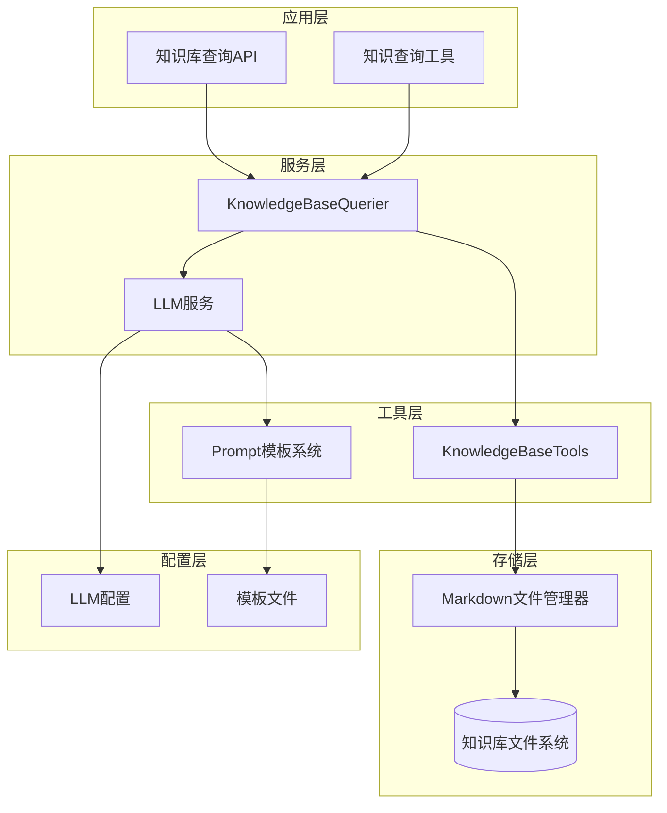
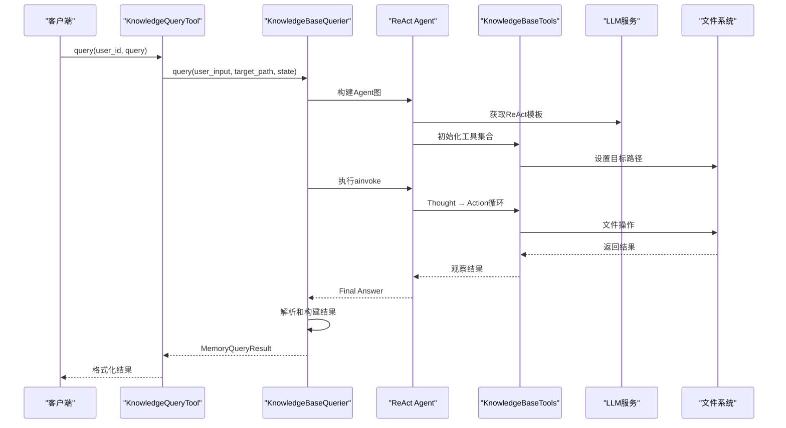
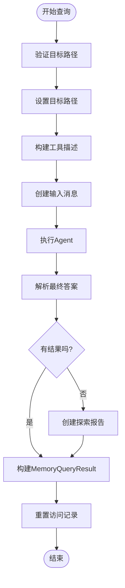
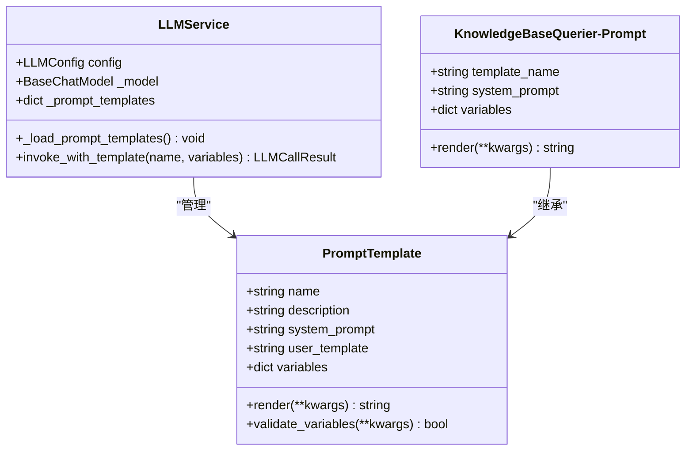
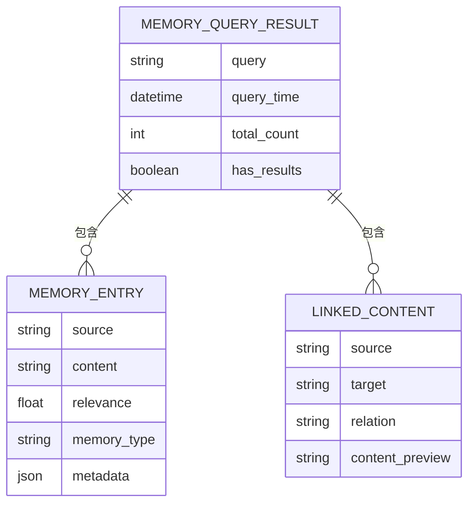
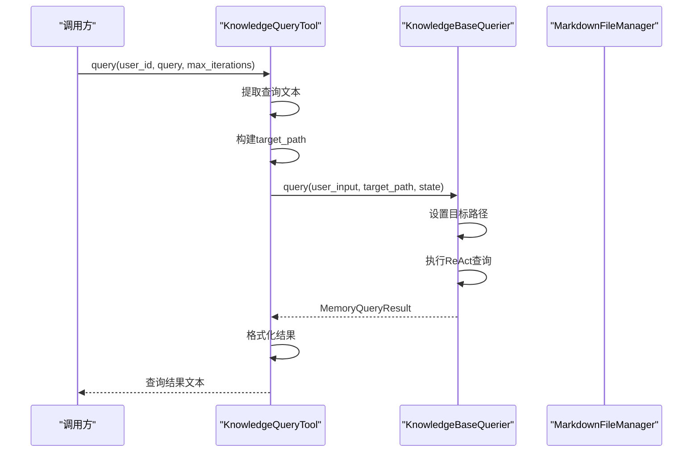
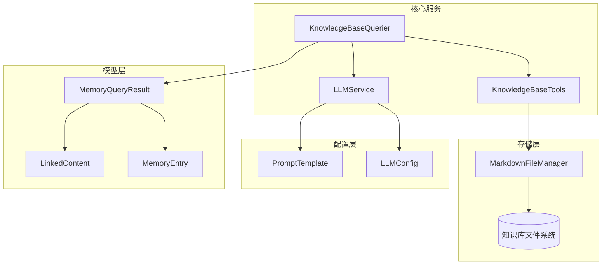

# 知识库查询API

<cite>
**本文档引用的文件**
- [knowledge_base_querier.py](file://src/services/knowledge_base_querier.py)
- [knowledge_query_tool.py](file://src/tools/knowledge_query_tool.py)
- [memory_query_result.py](file://src/models/memory_query_result.py)
- [markdown_file_manager.py](file://src/storage/markdown_file_manager.py)
- [llm_service.py](file://src/services/llm_service.py)
- [base.py](file://src/prompts/base.py)
- [KnowledgeBaseQuerier-Prompt.md](file://Prompts/KnowledgeBaseQuerier-Prompt.md)
- [llm_config.py](file://src/config/llm_config.py)
- [test_kb_querier_target_path.py](file://test_kb_querier_target_path.py)
- [test_kb_optimization.py](file://test_kb_optimization.py)
- [test_kb_tools.py](file://test_kb_tools.py)
</cite>

## 目录
1. [简介](#简介)
2. [项目结构](#项目结构)
3. [核心组件](#核心组件)
4. [架构概览](#架构概览)
5. [详细组件分析](#详细组件分析)
6. [依赖关系分析](#依赖关系分析)
7. [性能考虑](#性能考虑)
8. [故障排除指南](#故障排除指南)
9. [结论](#结论)
10. [附录](#附录)

## 简介
本文件为知识库查询API的详细技术文档，重点涵盖KnowledgeBaseQuerier的query方法、KnowledgeQueryTool工具方法、Prompt模板系统、查询结果处理流程以及与外部知识库的集成接口。文档旨在帮助开发者快速理解并正确使用该知识库查询系统，包括ReAct模式的自然语言查询、语义搜索策略和查询优化最佳实践。

## 项目结构
该项目采用分层架构设计，主要分为服务层、工具层、存储层和配置层：



**图表来源**
- [knowledge_base_querier.py:202-540](file://src/services/knowledge_base_querier.py#L202-L540)
- [knowledge_query_tool.py:11-81](file://src/tools/knowledge_query_tool.py#L11-L81)
- [markdown_file_manager.py:31-546](file://src/storage/markdown_file_manager.py#L31-L546)

**章节来源**
- [knowledge_base_querier.py:1-540](file://src/services/knowledge_base_querier.py#L1-L540)
- [knowledge_query_tool.py:1-81](file://src/tools/knowledge_query_tool.py#L1-L81)
- [markdown_file_manager.py:1-546](file://src/storage/markdown_file_manager.py#L1-L546)

## 核心组件
本系统的核心组件包括：

### KnowledgeBaseQuerier（ReAct查询器）
- **职责**：实现ReAct模式的自然语言查询，动态探索知识库并返回相关记忆
- **关键特性**：支持工具链调用、路径探索、结果解析和错误处理
- **查询模式**：Thought → Action → Observation循环

### KnowledgeBaseTools（工具集合）
- **职责**：提供文件系统操作工具，包括文件列表、内容读取、全文搜索和链接追踪
- **安全机制**：路径验证、访问控制和错误处理
- **探索策略**：系统性路径探索和相关性优先原则

### KnowledgeQueryTool（查询工具）
- **职责**：封装KnowledgeBaseQuerier的调用，提供简化的查询接口
- **用户适配**：自动处理用户ID和目标路径映射
- **结果格式化**：将复杂的数据结构转换为易读的文本

**章节来源**
- [knowledge_base_querier.py:17-200](file://src/services/knowledge_base_querier.py#L17-L200)
- [knowledge_query_tool.py:11-81](file://src/tools/knowledge_query_tool.py#L11-L81)

## 架构概览
系统采用LangChain Agent框架实现ReAct模式，结合自定义工具和Prompt模板：



**图表来源**
- [knowledge_base_querier.py:237-373](file://src/services/knowledge_base_querier.py#L237-L373)
- [knowledge_query_tool.py:33-66](file://src/tools/knowledge_query_tool.py#L33-L66)

## 详细组件分析

### KnowledgeBaseQuerier组件分析

#### ReAct查询流程
KnowledgeBaseQuerier实现了完整的ReAct模式查询流程：



**图表来源**
- [knowledge_base_querier.py:257-373](file://src/services/knowledge_base_querier.py#L257-L373)

#### 查询策略和算法
系统采用多层次的查询策略：

1. **路径探索策略**：优先使用`list_files()`一次性获取所有层级信息
2. **内容读取策略**：优先完整阅读文档内容而非片段检索
3. **相关性优先**：优先处理名称与查询关键词相关的文件
4. **链接追踪策略**：对标记的文件进行深度链接追踪

**章节来源**
- [knowledge_base_querier.py:434-433](file://src/services/knowledge_base_querier.py#L434-L433)

#### KnowledgeBaseTools工具集
KnowledgeBaseTools提供了6个核心工具：

| 工具名称 | 功能描述 | 参数 | 返回值 |
|---------|----------|------|--------|
| list_files | 列出指定目录下的文件和子目录 | path(可选), recursive(默认True) | JSON格式的文件列表 |
| read_file | 读取指定文件的内容 | file_path | 文件完整内容 |
| search_content | 在所有文件中搜索关键词 | keyword, limit(默认10) | 匹配结果列表 |
| follow_links | 追踪文件中的Wiki链接 | file_path, depth(默认1) | 关联文件内容列表 |
| mark_suspected_file | 标记疑似相关文件 | file_path | 操作结果 |
| get_exploration_report | 获取探索报告 | 无 | JSON格式的探索状态 |

**章节来源**
- [knowledge_base_querier.py:54-196](file://src/services/knowledge_base_querier.py#L54-L196)

### Prompt模板系统

#### 模板结构和配置
系统采用动态Prompt模板机制：



**图表来源**
- [base.py:6-33](file://src/prompts/base.py#L6-L33)
- [llm_service.py:126-217](file://src/services/llm_service.py#L126-L217)
- [KnowledgeBaseQuerier-Prompt.md:1-538](file://Prompts/KnowledgeBaseQuerier-Prompt.md#L1-L538)

#### 模板加载机制
模板系统支持从多个来源加载：

1. **Python模块**：从`src.prompts`模块加载内置模板
2. **Markdown文件**：从`Prompts/`目录加载外部模板文件
3. **动态解析**：支持从Markdown文件中解析模板内容和变量

**章节来源**
- [llm_service.py:126-217](file://src/services/llm_service.py#L126-L217)
- [KnowledgeBaseQuerier-Prompt.md:163-217](file://Prompts/KnowledgeBaseQuerier-Prompt.md#L163-L217)

### 查询结果处理和过滤机制

#### MemoryQueryResult数据结构
系统使用标准化的数据结构来封装查询结果：



**图表来源**
- [memory_query_result.py:23-81](file://src/models/memory_query_result.py#L23-L81)

#### 结果过滤和排序
系统提供多种结果处理方法：

1. **相关度排序**：`get_top_entries(n)`获取最高相关度的条目
2. **类型过滤**：`get_events()`和`get_people()`分别获取事件和人物条目
3. **存在性检查**：`has_related_events()`检查是否存在相关事件

**章节来源**
- [memory_query_result.py:51-81](file://src/models/memory_query_result.py#L51-L81)

### 知识查询工具

#### KnowledgeQueryTool使用方法
KnowledgeQueryTool提供了简化的查询接口：



**图表来源**
- [knowledge_query_tool.py:33-66](file://src/tools/knowledge_query_tool.py#L33-L66)

**章节来源**
- [knowledge_query_tool.py:11-81](file://src/tools/knowledge_query_tool.py#L11-L81)

## 依赖关系分析

### 组件依赖图
系统各组件之间的依赖关系如下：



**图表来源**
- [knowledge_base_querier.py:10-14](file://src/services/knowledge_base_querier.py#L10-L14)
- [markdown_file_manager.py:31-45](file://src/storage/markdown_file_manager.py#L31-L45)
- [memory_query_result.py:23-45](file://src/models/memory_query_result.py#L23-L45)

### 外部依赖
系统依赖的关键外部组件：

1. **LangChain框架**：提供Agent执行和工具管理
2. **大模型服务**：支持多种提供商（OpenAI、DeepSeek等）
3. **文件系统**：支持Markdown文件的读写和搜索
4. **模板引擎**：支持Prompt模板的动态加载和渲染

**章节来源**
- [llm_service.py:90-125](file://src/services/llm_service.py#L90-L125)
- [llm_config.py:10-120](file://src/config/llm_config.py#L10-L120)

## 性能考虑

### 查询优化策略
系统实现了多项性能优化措施：

1. **路径探索优化**：一次性获取所有层级目录信息，避免多次重复调用
2. **内容读取优化**：优先完整阅读文档内容，减少后续查询次数
3. **相关性优先**：优先处理名称与查询关键词相关的文件
4. **缓存机制**：利用工具的访问记录和标记功能减少重复操作

### 性能监控
系统提供调用统计和性能指标：

- **Token使用统计**：跟踪模型调用的Token消耗
- **调用成功率**：监控服务调用的成功率
- **平均延迟**：记录请求的平均响应时间

**章节来源**
- [llm_service.py:449-462](file://src/services/llm_service.py#L449-L462)

## 故障排除指南

### 常见问题和解决方案

#### 1. 目标路径验证失败
**问题**：目标路径不存在或不是目录
**解决方案**：检查路径的有效性和权限

#### 2. 工具调用异常
**问题**：文件读取或搜索过程中出现错误
**解决方案**：查看日志信息，确认文件路径和权限

#### 3. 模板加载失败
**问题**：Prompt模板无法加载
**解决方案**：检查模板文件格式和变量配置

#### 4. 查询结果为空
**问题**：未找到相关记忆
**解决方案**：使用探索报告功能获取详细信息

**章节来源**
- [knowledge_base_querier.py:368-372](file://src/services/knowledge_base_querier.py#L368-L372)
- [test_kb_querier_target_path.py:64-97](file://test_kb_querier_target_path.py#L64-L97)

### 调试技巧
1. **启用详细日志**：查看查询过程中的详细信息
2. **使用探索报告**：获取完整的路径探索状态
3. **检查工具描述**：确认可用工具的功能和参数
4. **验证路径安全**：确保路径访问符合预期

## 结论
本知识库查询API通过ReAct模式实现了智能化的知识检索，结合了自然语言理解和工具链调用的优势。系统具有良好的扩展性，支持多种大模型提供商和Prompt模板配置。通过合理的查询策略和优化机制，能够高效地从复杂的Markdown文件系统中提取相关信息。

## 附录

### API使用示例

#### 基本查询示例
```python
# 创建查询工具
tool = KnowledgeQueryTool()

# 执行查询
result = await tool.query(
    user_id="test_user001",
    query="我小时候住在哪里？",
    max_iterations=5
)

print(result)
```

#### 高级查询示例
```python
# 直接使用查询器
querier = KnowledgeBaseQuerier(file_manager)

result = await querier.query(
    user_input="查找关于家庭成员的信息",
    target_path="./knowledge_base/test_user001",
    state=session_state
)

# 获取Top N相关条目
top_entries = result.get_top_entries(5)
```

### 最佳实践建议

#### 查询优化
1. **明确查询意图**：提供清晰具体的查询描述
2. **合理使用工具**：遵循路径探索指南的顺序
3. **监控资源使用**：关注Token消耗和响应时间
4. **处理边界情况**：正确处理路径遍历和权限问题

#### 结果排序
1. **相关度优先**：系统默认按相关度排序
2. **手动调整**：可根据业务需求自定义排序规则
3. **类型过滤**：使用专门的方法获取特定类型的条目

**章节来源**
- [test_kb_optimization.py:73-150](file://test_kb_optimization.py#L73-L150)
- [test_kb_tools.py:49-133](file://test_kb_tools.py#L49-L133)