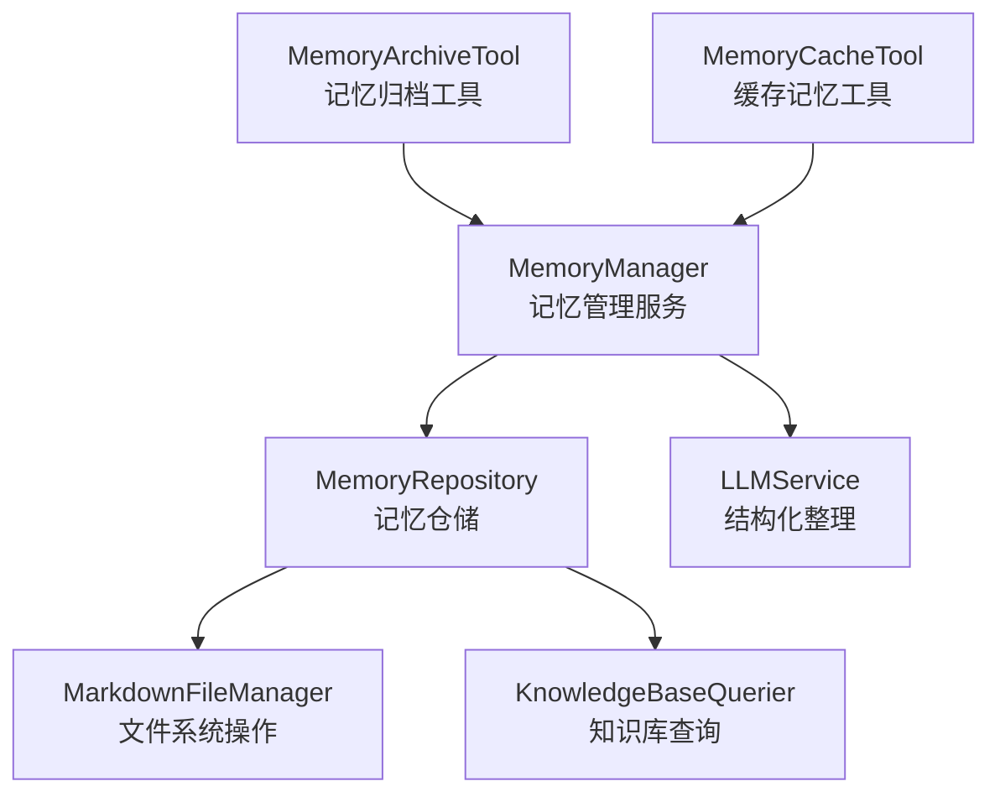
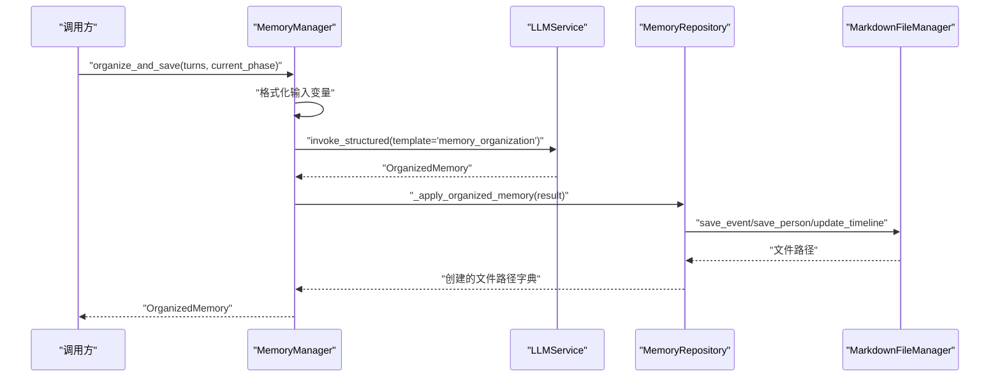
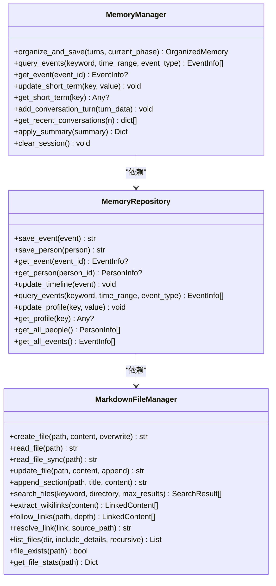

# 记忆管理API

<cite>
**本文引用的文件**
- [memory_manager.py](file://src/services/memory_manager.py)
- [memory_repository.py](file://src/storage/memory_repository.py)
- [markdown_file_manager.py](file://src/storage/markdown_file_manager.py)
- [memory_archive_tool.py](file://src/tools/memory_archive_tool.py)
- [memory_cache_tool.py](file://src/tools/memory_cache_tool.py)
- [organized_memory.py](file://src/models/organized_memory.py)
- [event_info.py](file://src/models/event_info.py)
- [person_info.py](file://src/models/person_info.py)
- [memory_query_result.py](file://src/models/memory_query_result.py)
- [test_memory_manager.py](file://tests/test_memory_manager.py)
- [demo_memory_storage.py](file://demo_memory_storage.py)
- [MEMORY_INTERACTION_GUIDE.md](file://MEMORY_INTERACTION_GUIDE.md)
</cite>

## 目录
1. [简介](#简介)
2. [项目结构](#项目结构)
3. [核心组件](#核心组件)
4. [架构总览](#架构总览)
5. [详细组件分析](#详细组件分析)
6. [依赖关系分析](#依赖关系分析)
7. [性能考量](#性能考量)
8. [故障排查指南](#故障排查指南)
9. [结论](#结论)
10. [附录](#附录)

## 简介
本文件面向记忆管理API的使用者与维护者，系统性梳理MemoryManager、MemoryRepository、MarkdownFileManager以及相关工具类的接口与行为，涵盖记忆的组织、存储、查询与删除流程，并提供完整的API使用示例、错误处理与性能优化建议。读者无需深入代码即可理解如何高效、稳定地使用记忆管理能力。

## 项目结构
围绕记忆管理的关键模块如下：
- 服务层：MemoryManager（协调LLM整理与存储）
- 存储层：MemoryRepository（三层记忆统一管理）
- 文件层：MarkdownFileManager（文件系统读写、索引与链接追踪）
- 工具层：MemoryArchiveTool（会话归档）、MemoryCacheTool（会话级短期缓存）
- 数据模型：EventInfo、PersonInfo、OrganizedMemory、MemoryQueryResult等

图表来源
- [memory_manager.py:27-470](file://src/services/memory_manager.py#L27-L470)
- [memory_repository.py:40-359](file://src/storage/memory_repository.py#L40-L359)
- [markdown_file_manager.py:31-546](file://src/storage/markdown_file_manager.py#L31-L546)
- [memory_archive_tool.py:10-112](file://src/tools/memory_archive_tool.py#L10-L112)
- [memory_cache_tool.py:8-89](file://src/tools/memory_cache_tool.py#L8-L89)

章节来源
- [memory_manager.py:27-470](file://src/services/memory_manager.py#L27-L470)
- [memory_repository.py:40-359](file://src/storage/memory_repository.py#L40-L359)
- [markdown_file_manager.py:31-546](file://src/storage/markdown_file_manager.py#L31-L546)
- [memory_archive_tool.py:10-112](file://src/tools/memory_archive_tool.py#L10-L112)
- [memory_cache_tool.py:8-89](file://src/tools/memory_cache_tool.py#L8-L89)

## 核心组件
- MemoryManager：对外暴露记忆组织与查询接口，内部协调LLM结构化整理与MemoryRepository持久化。
- MemoryRepository：三层记忆（短期、长期、画像）的统一入口，负责文件路径规划、索引与缓存。
- MarkdownFileManager：文件系统操作、全文搜索、Wiki链接解析与追踪。
- MemoryArchiveTool：封装归档流程，支持初始化知识库与会话归档。
- MemoryCacheTool：会话级短期缓存，支持关键词检索与追加更新。

章节来源
- [memory_manager.py:27-470](file://src/services/memory_manager.py#L27-L470)
- [memory_repository.py:40-359](file://src/storage/memory_repository.py#L40-L359)
- [markdown_file_manager.py:31-546](file://src/storage/markdown_file_manager.py#L31-L546)
- [memory_archive_tool.py:10-112](file://src/tools/memory_archive_tool.py#L10-L112)
- [memory_cache_tool.py:8-89](file://src/tools/memory_cache_tool.py#L8-L89)

## 架构总览
记忆管理采用“服务-仓储-文件”分层架构，MemoryManager作为门面协调LLM与仓储；MemoryRepository负责索引与缓存；MarkdownFileManager提供文件系统能力；工具类辅助归档与缓存。

图表来源
- [memory_manager.py:111-156](file://src/services/memory_manager.py#L111-L156)
- [memory_manager.py:158-193](file://src/services/memory_manager.py#L158-L193)
- [memory_repository.py:176-200](file://src/storage/memory_repository.py#L176-L200)
- [memory_repository.py:202-226](file://src/storage/memory_repository.py#L202-L226)
- [memory_repository.py:248-260](file://src/storage/memory_repository.py#L248-L260)

## 详细组件分析

### MemoryManager 接口文档
- initialize
  - 参数：repository: MemoryRepository, llm_service: LLMService（可选）
  - 作用：注入仓储与LLM服务
- organize_and_save
  - 参数：
    - turns: List[ConversationTurn]
    - current_phase: PhaseType
  - 返回：OrganizedMemory
  - 行为：格式化对话、调用LLM结构化、并行保存事件/人物、更新时间线、更新画像
- query_events
  - 参数：keyword: Optional[str], time_range: Optional[tuple], event_type: Optional[str]
  - 返回：List[EventInfo]
  - 行为：委托仓储查询事件
- get_event
  - 参数：event_id: str
  - 返回：Optional[EventInfo]
- update_short_term / get_short_term
  - 参数：key: str, value: Any
  - 返回：None 或值
- add_conversation_turn / get_recent_conversations
  - 参数：turn_data: Dict[str, Any], n: int
  - 返回：None 或历史列表
- apply_summary
  - 参数：summary: SummaryContent
  - 返回：Dict[str, Any]
  - 行为：应用归纳结果，更新短期/长期/画像记忆
- clear_session
  - 行为：清空短期记忆与历史

章节来源
- [memory_manager.py:47-61](file://src/services/memory_manager.py#L47-L61)
- [memory_manager.py:111-156](file://src/services/memory_manager.py#L111-L156)
- [memory_manager.py:324-341](file://src/services/memory_manager.py#L324-L341)
- [memory_manager.py:343-345](file://src/services/memory_manager.py#L343-L345)
- [memory_manager.py:64-84](file://src/services/memory_manager.py#L64-L84)
- [memory_manager.py:86-105](file://src/services/memory_manager.py#L86-L105)
- [memory_manager.py:435-466](file://src/services/memory_manager.py#L435-L466)
- [memory_manager.py:468-470](file://src/services/memory_manager.py#L468-L470)

### MemoryRepository 接口文档
- initialize
  - 参数：file_manager: MarkdownFileManager, short_term_capacity: int, cache_capacity: int
  - 作用：初始化短期记忆、缓存、索引与知识库查询器
- save_event
  - 参数：event: EventInfo
  - 返回：str（文件路径）
  - 行为：按人生阶段目录生成文件名，写入Markdown，更新索引与缓存
- save_person
  - 参数：person: PersonInfo
  - 返回：str（文件路径）
  - 行为：主人公单独存储，其他按角色分类，写入Markdown，更新索引与缓存
- get_event / get_person
  - 参数：event_id / person_id: str
  - 返回：Optional[EventInfo/PersonInfo]
  - 行为：优先缓存命中，否则索引查找
- update_timeline
  - 参数：event: EventInfo
  - 行为：向时间线文件追加条目
- query_events
  - 参数：keyword: Optional[str], time_range: Optional[tuple], event_type: Optional[str]
  - 返回：List[EventInfo]
  - 行为：基于索引过滤
- update_profile / get_profile
  - 参数：key: str, value: Any
  - 返回：None
  - 行为：画像记忆（短期内存）
- get_all_people / get_all_events
  - 返回：List[PersonInfo/EventInfo]
- 工具方法：_get_phase_directory/_get_role_directory/_generate_event_filename/_sanitize_filename

章节来源
- [memory_repository.py:54-87](file://src/storage/memory_repository.py#L54-L87)
- [memory_repository.py:176-200](file://src/storage/memory_repository.py#L176-L200)
- [memory_repository.py:202-226](file://src/storage/memory_repository.py#L202-L226)
- [memory_repository.py:228-246](file://src/storage/memory_repository.py#L228-L246)
- [memory_repository.py:248-260](file://src/storage/memory_repository.py#L248-L260)
- [memory_repository.py:262-284](file://src/storage/memory_repository.py#L262-L284)
- [memory_repository.py:288-298](file://src/storage/memory_repository.py#L288-L298)
- [memory_repository.py:300-306](file://src/storage/memory_repository.py#L300-L306)
- [memory_repository.py:310-359](file://src/storage/memory_repository.py#L310-L359)

### MarkdownFileManager 接口文档
- initialize
  - 参数：base_path: str（可选），conversation_id: str（可选）
  - 行为：确保目录结构存在，创建索引文件
- create_file
  - 参数：relative_path: str, content: str, overwrite: bool
  - 返回：str（文件路径）
  - 行为：异步创建文件，必要时父目录不存在则创建
- read_file / read_file_sync
  - 参数：path: str
  - 返回：str（文件内容）
  - 行为：异步/同步读取，支持绝对/相对路径
- update_file
  - 参数：relative_path: str, content: str, append: bool
  - 返回：str（文件路径）
  - 行为：若文件不存在则创建，支持追加
- append_section
  - 参数：relative_path: str, section_title: str, section_content: str
  - 返回：str（文件路径）
  - 行为：追加章节到文件
- search_files
  - 参数：keyword: str, directory: Optional[str], max_results: int
  - 返回：List[SearchResult]
  - 行为：全文搜索，计算相关度并返回上下文
- extract_wikilinks / follow_links / resolve_link
  - 行为：提取、追踪与解析Wiki链接
- list_files / file_exists / get_file_stats
  - 行为：列出文件、检查存在性、获取统计信息

章节来源
- [markdown_file_manager.py:47-78](file://src/storage/markdown_file_manager.py#L47-L78)
- [markdown_file_manager.py:134-169](file://src/storage/markdown_file_manager.py#L134-L169)
- [markdown_file_manager.py:171-199](file://src/storage/markdown_file_manager.py#L171-L199)
- [markdown_file_manager.py:201-229](file://src/storage/markdown_file_manager.py#L201-L229)
- [markdown_file_manager.py:231-261](file://src/storage/markdown_file_manager.py#L231-L261)
- [markdown_file_manager.py:263-282](file://src/storage/markdown_file_manager.py#L263-L282)
- [markdown_file_manager.py:285-334](file://src/storage/markdown_file_manager.py#L285-L334)
- [markdown_file_manager.py:358-388](file://src/storage/markdown_file_manager.py#L358-L388)
- [markdown_file_manager.py:390-430](file://src/storage/markdown_file_manager.py#L390-L430)
- [markdown_file_manager.py:432-471](file://src/storage/markdown_file_manager.py#L432-L471)
- [markdown_file_manager.py:475-528](file://src/storage/markdown_file_manager.py#L475-L528)
- [markdown_file_manager.py:530-546](file://src/storage/markdown_file_manager.py#L530-L546)

### MemoryArchiveTool 接口文档
- initialize
  - 参数：memory_manager: MemoryManager（可选）
  - 行为：若未提供则自动构建（含MarkdownFileManager）
- create_user_knowledge_base
  - 参数：user_id: str, conversation_history: List[Dict], profile_info: Dict[str, Any]
  - 行为：保存画像信息到短期记忆，将对话记录写入短期历史
- archive_conversation
  - 参数：user_id: str, conversation_history: List[Dict], session_summary: str
  - 行为：保存会话总结到短期记忆；将对话转为ConversationTurn；调用MemoryManager组织并保存；失败时回退到短期历史

章节来源
- [memory_archive_tool.py:24-30](file://src/tools/memory_archive_tool.py#L24-L30)
- [memory_archive_tool.py:31-58](file://src/tools/memory_archive_tool.py#L31-L58)
- [memory_archive_tool.py:61-111](file://src/tools/memory_archive_tool.py#L61-L111)

### MemoryCacheTool 接口文档
- initialize
  - 行为：初始化内存缓存容器
- get_cache
  - 参数：session_id: str, query: Dict（包含tags）
  - 返回：Optional[str]
  - 行为：按标签交集匹配缓存条目
- append_cache
  - 参数：session_id: str, content: str, tags: List[str]
  - 行为：追加缓存条目（带时间戳）
- clear_cache
  - 参数：session_id: str
  - 行为：清空指定会话缓存

章节来源
- [memory_cache_tool.py:29-32](file://src/tools/memory_cache_tool.py#L29-L32)
- [memory_cache_tool.py:34-61](file://src/tools/memory_cache_tool.py#L34-L61)
- [memory_cache_tool.py:63-84](file://src/tools/memory_cache_tool.py#L63-L84)
- [memory_cache_tool.py:86-89](file://src/tools/memory_cache_tool.py#L86-L89)

### 数据模型与返回格式
- OrganizedMemory：包含时间线更新、事件提取、人物提取、画像更新、存储建议、处理摘要
- EventInfo：事件结构化信息，支持to_markdown输出
- PersonInfo：人物结构化信息，支持to_markdown输出
- MemoryQueryResult：查询结果封装，包含条目、链接内容、汇总信息

章节来源
- [organized_memory.py:141-151](file://src/models/organized_memory.py#L141-L151)
- [event_info.py:5-69](file://src/models/event_info.py#L5-L69)
- [person_info.py:5-61](file://src/models/person_info.py#L5-L61)
- [memory_query_result.py:23-81](file://src/models/memory_query_result.py#L23-L81)

## 依赖关系分析
- MemoryManager 依赖 MemoryRepository 与 LLMService
- MemoryRepository 依赖 MarkdownFileManager 与 KnowledgeBaseQuerier
- MemoryArchiveTool 依赖 MemoryManager
- MemoryCacheTool 独立于其他组件

图表来源
- [memory_manager.py:27-470](file://src/services/memory_manager.py#L27-L470)
- [memory_repository.py:40-359](file://src/storage/memory_repository.py#L40-L359)
- [markdown_file_manager.py:31-546](file://src/storage/markdown_file_manager.py#L31-L546)

章节来源
- [memory_manager.py:27-470](file://src/services/memory_manager.py#L27-L470)
- [memory_repository.py:40-359](file://src/storage/memory_repository.py#L40-L359)
- [markdown_file_manager.py:31-546](file://src/storage/markdown_file_manager.py#L31-L546)

## 性能考量
- 并行保存：MemoryManager在应用结构化记忆时对事件与人物保存采用并发，显著提升吞吐。
- LRU缓存：MemoryRepository内置LRU缓存，降低重复读取开销。
- 短期记忆容量：MemoryRepository支持短期记忆容量控制，避免内存膨胀。
- 异步IO：MarkdownFileManager大量使用异步文件操作，减少阻塞。
- 搜索相关度：search_files提供相关度评分，便于快速定位高价值内容。
- 建议：
  - 大批量事件/人物保存时，合理设置并发度，避免磁盘IO瓶颈。
  - 长期记忆查询建议结合关键词与类型过滤，减少索引扫描范围。
  - 对频繁访问的事件/人物，利用LRU缓存减少文件系统访问。

[本节为通用性能建议，不直接分析具体文件]

## 故障排查指南
- LLM调用失败
  - 现象：organize_and_save返回空结构化结果
  - 处理：检查模板名称与变量格式；查看日志错误信息
- 文件不存在
  - 现象：read_file抛出异常
  - 处理：确认路径是否为绝对路径或相对base_path；检查目录结构
- 缓存未命中
  - 现象：get_event/get_person返回None
  - 处理：确认事件/人物ID是否正确；检查索引是否已更新
- 归档失败回退
  - 现象：archive_conversation组织失败
  - 处理：系统自动将对话记录写入短期历史，确保不会丢失

章节来源
- [memory_manager.py:147-150](file://src/services/memory_manager.py#L147-L150)
- [markdown_file_manager.py:188-189](file://src/storage/markdown_file_manager.py#L188-L189)
- [memory_repository.py:231-236](file://src/storage/memory_repository.py#L231-L236)
- [memory_archive_tool.py:101-110](file://src/tools/memory_archive_tool.py#L101-L110)

## 结论
记忆管理API通过清晰的分层设计与完善的工具链，实现了从对话到结构化记忆的自动化处理、多维存储与高效查询。MemoryManager提供统一入口，MemoryRepository负责索引与缓存，MarkdownFileManager保障文件系统稳定性，MemoryArchiveTool与MemoryCacheTool分别满足归档与会话级缓存需求。配合测试与示例脚本，可快速集成并稳定运行。

[本节为总结性内容，不直接分析具体文件]

## 附录

### API使用示例与最佳实践

- 记忆组织与保存
  - 场景：将一段采访对话整理为结构化记忆并持久化
  - 步骤：
    1) 准备对话轮次列表
    2) 调用 MemoryManager.organize_and_save
    3) 检查返回的 OrganizedMemory
    4) 若需批量应用，使用 MemoryManager.apply_summary
  - 参考路径
    - [memory_manager.py:111-156](file://src/services/memory_manager.py#L111-L156)
    - [memory_manager.py:435-466](file://src/services/memory_manager.py#L435-L466)

- 记忆查询
  - 场景：按关键词/类型查询事件
  - 步骤：
    1) 调用 MemoryManager.query_events
    2) 根据返回列表筛选所需事件
  - 参考路径
    - [memory_manager.py:324-341](file://src/services/memory_manager.py#L324-L341)

- 记忆删除
  - 场景：删除特定事件或人物
  - 步骤：
    1) 通过 MemoryRepository.get_event/get_person 获取对象
    2) 删除对应Markdown文件
    3) 更新索引与缓存
  - 参考路径
    - [memory_repository.py:176-200](file://src/storage/memory_repository.py#L176-L200)
    - [memory_repository.py:202-226](file://src/storage/memory_repository.py#L202-L226)

- 会话归档
  - 场景：结束会话后归档对话记录
  - 步骤：
    1) 使用 MemoryArchiveTool.archive_conversation
    2) 失败时自动回退到短期历史
  - 参考路径
    - [memory_archive_tool.py:61-111](file://src/tools/memory_archive_tool.py#L61-L111)

- 会话级缓存
  - 场景：在会话内复用关键信息
  - 步骤：
    1) 使用 MemoryCacheTool.append_cache 追加内容
    2) 使用 MemoryCacheTool.get_cache 按标签检索
    3) 会话结束使用 clear_cache 清理
  - 参考路径
    - [memory_cache_tool.py:34-61](file://src/tools/memory_cache_tool.py#L34-L61)
    - [memory_cache_tool.py:63-84](file://src/tools/memory_cache_tool.py#L63-L84)
    - [memory_cache_tool.py:86-89](file://src/tools/memory_cache_tool.py#L86-L89)

- 文件操作与命名规范
  - 目录结构：events/{childhood/youth/middle_age/elderly}、people/{family/friends/colleagues/others}、timeline、themes
  - 文件命名：事件文件名由标题清洗生成，人物文件名由姓名清洗生成，主人公单独存储于 people/protagonist.md
  - 时间线：timeline/life-events.md
  - 参考路径
    - [markdown_file_manager.py:80-98](file://src/storage/markdown_file_manager.py#L80-L98)
    - [memory_repository.py:310-359](file://src/storage/memory_repository.py#L310-L359)

- 错误处理与性能优化建议
  - 错误处理：捕获LLM调用异常与文件系统异常，必要时回退到短期历史
  - 性能优化：并发保存、LRU缓存、异步IO、关键词过滤
  - 参考路径
    - [memory_manager.py:147-150](file://src/services/memory_manager.py#L147-L150)
    - [memory_repository.py:16-38](file://src/storage/memory_repository.py#L16-L38)
    - [markdown_file_manager.py:134-169](file://src/storage/markdown_file_manager.py#L134-L169)

- 示例脚本与交互指南
  - 演示脚本：demo_memory_storage.py
  - 交互指南：MEMORY_INTERACTION_GUIDE.md
  - 测试用例：tests/test_memory_manager.py
  - 参考路径
    - [demo_memory_storage.py:16-118](file://demo_memory_storage.py#L16-L118)
    - [MEMORY_INTERACTION_GUIDE.md:1-172](file://MEMORY_INTERACTION_GUIDE.md#L1-L172)
    - [test_memory_manager.py:32-96](file://tests/test_memory_manager.py#L32-L96)