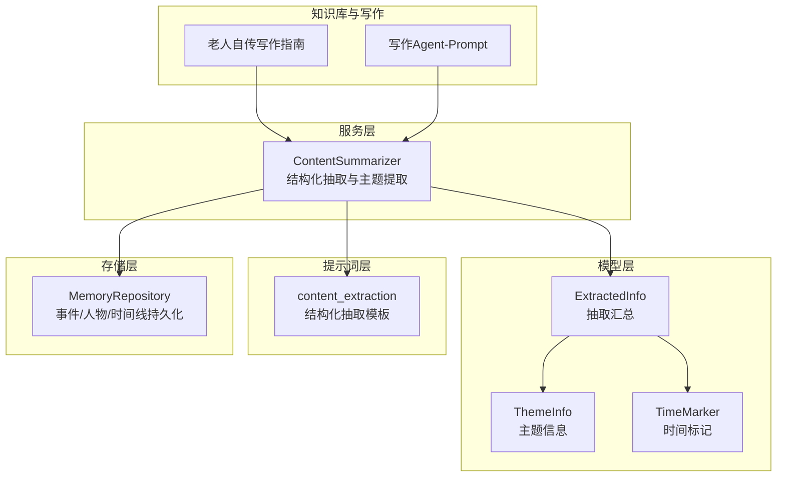
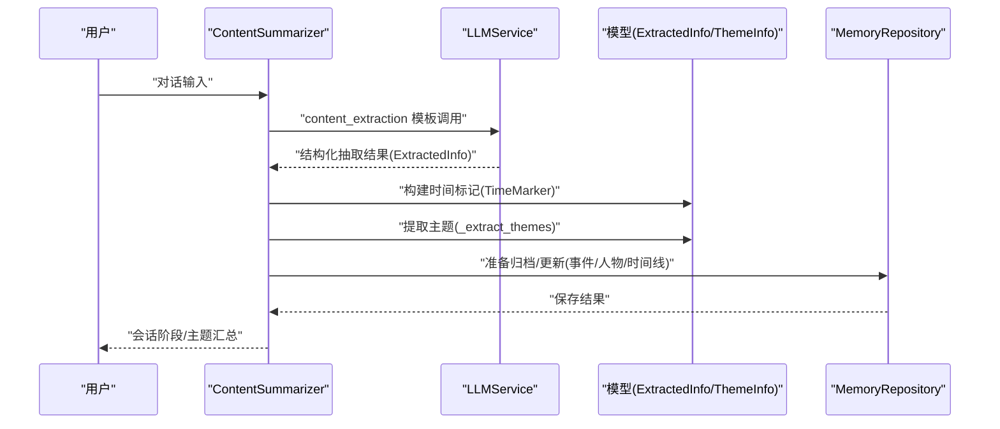
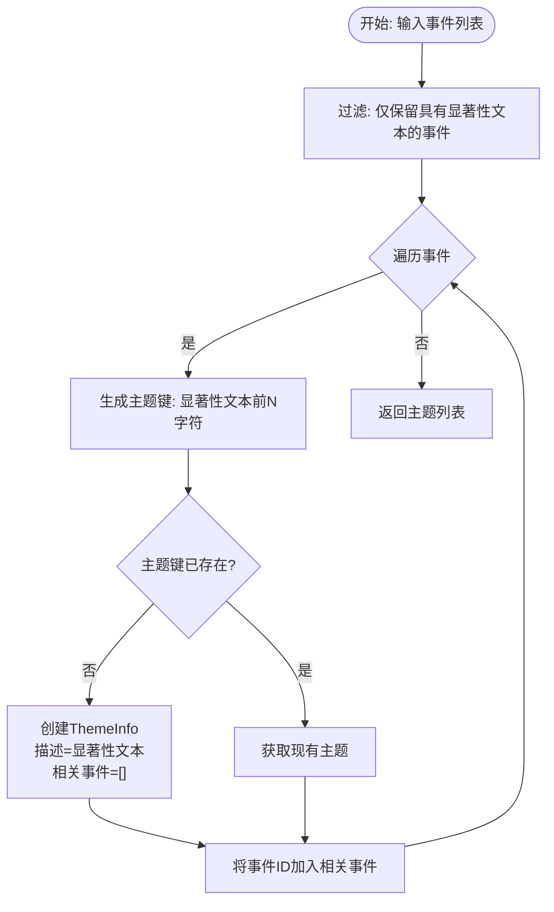
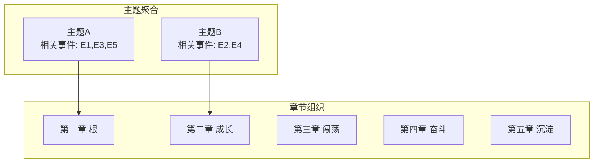
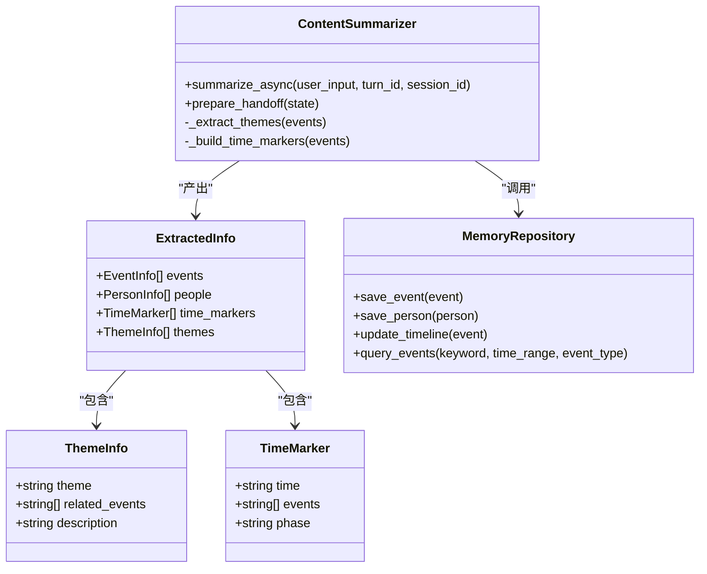

# 主题提取机制

<cite>
**本文引用的文件**
- [content_summarizer.py](file://src/services/content_summarizer.py)
- [summary_prompts.py](file://src/prompts/summary_prompts.py)
- [summary_content.py](file://src/models/summary_content.py)
- [event_info.py](file://src/models/event_info.py)
- [person_info.py](file://src/models/person_info.py)
- [memory_repository.py](file://src/storage/memory_repository.py)
- [test_memory_manager.py](file://tests/test_memory_manager.py)
- [老人自传写作指南.md](file://老人自传写作指南.md)
- [写作Agent-Prompt.md](file://写作Agent-Prompt.md)
- [Refactor-底层代码优化重构Spec.md](file://开发故事卡/Refactor-底层代码优化重构Spec.md)
</cite>

## 目录
1. [简介](#简介)
2. [项目结构](#项目结构)
3. [核心组件](#核心组件)
4. [架构总览](#架构总览)
5. [详细组件分析](#详细组件分析)
6. [依赖分析](#依赖分析)
7. [性能考虑](#性能考虑)
8. [故障排除指南](#故障排除指南)
9. [结论](#结论)
10. [附录](#附录)

## 简介
本技术文档聚焦于“主题提取机制”，围绕 ContentSummarizer 服务中的 _extract_themes 方法展开，系统阐释其主题识别算法（显著性文本分析、主题聚类与相关事件关联）、主题描述生成机制（事件重要性提取与描述文本构建）、在内容组织与自传结构中的作用（主题分类与章节划分应用）、扩展性设计（自定义主题规则与机器学习集成可能性），以及性能优化与准确性提升策略（预处理与后处理机制）。文档同时结合知识库结构与写作指导，给出可操作的实践建议。

## 项目结构
主题提取贯穿“对话→结构化抽取→主题聚合→记忆归档”的流程。核心涉及以下模块：
- 服务层：ContentSummarizer（结构化抽取与主题提取）
- 模型层：ThemeInfo、ExtractedInfo、TimeMarker 等
- 提示词层：content_extraction 模板
- 存储层：MemoryRepository（事件/人物/时间线持久化）
- 测试与知识库：测试用例与自传写作指南

**图表来源**
- [content_summarizer.py:39-200](file://src/services/content_summarizer.py#L39-L200)
- [summary_prompts.py:1-49](file://src/prompts/summary_prompts.py#L1-L49)
- [summary_content.py:8-34](file://src/models/summary_content.py#L8-L34)
- [memory_repository.py:40-359](file://src/storage/memory_repository.py#L40-L359)
- [老人自传写作指南.md:1-117](file://老人自传写作指南.md#L1-L117)
- [写作Agent-Prompt.md:52-88](file://写作Agent-Prompt.md#L52-L88)

**章节来源**
- [content_summarizer.py:39-200](file://src/services/content_summarizer.py#L39-L200)
- [summary_prompts.py:1-49](file://src/prompts/summary_prompts.py#L1-L49)
- [summary_content.py:8-34](file://src/models/summary_content.py#L8-L34)
- [memory_repository.py:40-359](file://src/storage/memory_repository.py#L40-L359)

## 核心组件
- ContentSummarizer：负责调用 LLM 进行结构化抽取，并在会话结束时执行主题提取与时间标记构建。
- ThemeInfo：主题实体，包含主题名、相关事件列表与描述。
- ExtractedInfo：抽取结果汇总，包含事件、人物、时间标记与主题。
- MemoryRepository：事件/人物/时间线的持久化与查询，支持按阶段与类型检索。
- 提示词模板 content_extraction：约束 LLM 输出结构，确保显著性文本可用。

**章节来源**
- [content_summarizer.py:39-200](file://src/services/content_summarizer.py#L39-L200)
- [summary_content.py:8-34](file://src/models/summary_content.py#L8-L34)
- [memory_repository.py:40-359](file://src/storage/memory_repository.py#L40-L359)
- [summary_prompts.py:1-49](file://src/prompts/summary_prompts.py#L1-L49)

## 架构总览
主题提取在系统中的位置与交互如下：

**图表来源**
- [content_summarizer.py:65-165](file://src/services/content_summarizer.py#L65-L165)
- [summary_prompts.py:4-49](file://src/prompts/summary_prompts.py#L4-L49)
- [summary_content.py:22-34](file://src/models/summary_content.py#L22-L34)
- [memory_repository.py:176-261](file://src/storage/memory_repository.py#L176-L261)

## 详细组件分析

### 主题识别算法：_extract_themes
- 输入：事件集合（EventInfo 列表），要求事件具备显著性文本（significance）。
- 算法步骤：
  1) 遍历事件，过滤具有显著性文本的事件；
  2) 以显著性文本的前若干字符作为主题键（截断长度限制）；
  3) 若主题键未出现过，创建 ThemeInfo，初始描述为该事件的显著性文本；
  4) 将事件ID加入该主题的“相关事件”列表；
  5) 返回去重后的主题列表。
- 关键点：
  - 显著性文本即主题识别的“信号”，体现了事件的重要性与情感价值；
  - 截断策略避免主题键过长导致稀疏与碎片化；
  - 采用字典聚合，天然具备去重与快速查找能力。

**图表来源**
- [content_summarizer.py:164-199](file://src/services/content_summarizer.py#L164-L199)

**章节来源**
- [content_summarizer.py:164-199](file://src/services/content_summarizer.py#L164-L199)

### 主题描述生成机制
- 事件重要性提取：显著性文本由 LLM 在 content_extraction 模板中强制产出，作为主题的“锚点”。
- 描述文本构建：首次遇到某主题键时，直接采用该事件的显著性文本作为主题描述；后续同类事件仅追加到“相关事件”列表，不重复生成描述，保证描述的权威性与一致性。
- 与时间标记协同：主题提取与时间标记构建在会话结束时统一进行，便于后续按阶段/主题双维组织内容。

**章节来源**
- [summary_prompts.py:27-31](file://src/prompts/summary_prompts.py#L27-L31)
- [content_summarizer.py:133-199](file://src/services/content_summarizer.py#L133-L199)

### 主题提取在内容组织与自传结构中的作用
- 主题分类与章节划分：
  - 自传写作指南建议按时间顺序分为五个阶段（根、成长、闯荡、奋斗、沉淀），主题可作为“章节内主题线索”；
  - 写作Agent-Prompt强调“时代背景交织”“情感注入”，主题可承载这些维度，使章节内容更有纵深与情感厚度。
- 事件关联与叙事连贯：
  - 主题内的相关事件列表可作为章节内事件排序与取舍的依据；
  - 通过时间标记与主题聚合，可实现“主题驱动的章节组织”。

**图表来源**
- [老人自传写作指南.md:44-81](file://老人自传写作指南.md#L44-L81)
- [写作Agent-Prompt.md:52-88](file://写作Agent-Prompt.md#L52-L88)
- [content_summarizer.py:164-199](file://src/services/content_summarizer.py#L164-L199)

**章节来源**
- [老人自传写作指南.md:44-81](file://老人自传写作指南.md#L44-L81)
- [写作Agent-Prompt.md:52-88](file://写作Agent-Prompt.md#L52-L88)

### 扩展性设计
- 自定义主题规则：
  - 可在 _extract_themes 中引入更复杂的规则（如正则匹配、停用词过滤、主题权重），以提升主题粒度与稳定性；
  - 可扩展 ThemeInfo，增加“主题类别”“情感倾向”“时代背景”等字段，增强主题的可解释性。
- 机器学习集成：
  - 使用事件显著性文本训练主题向量表示，结合聚类算法（如 KMeans、层次聚类）实现自动主题发现；
  - 引入相似度阈值与主题合并策略，减少噪声主题。
- 与知识库的衔接：
  - 主题提取结果可写入知识库的 themes 目录，形成“主题-事件”索引，供后续检索与可视化。

**章节来源**
- [content_summarizer.py:164-199](file://src/services/content_summarizer.py#L164-L199)
- [memory_repository.py:40-359](file://src/storage/memory_repository.py#L40-L359)

### 性能优化与准确性提升策略
- 预处理：
  - 对显著性文本进行清洗（去除冗余空格、标准化标点、统一时间表达），降低主题键歧义；
  - 引入停用词表与领域词典，提升主题键的代表性。
- 后处理：
  - 对主题键进行近似匹配与归一化（如拼音首字母、简繁转换），提高聚合效果；
  - 增加“主题质量评分”（基于事件数量、显著性强度、情感强度），用于主题筛选与排序。
- 存储与查询：
  - MemoryRepository 已内置 LRU 缓存与索引，建议在主题聚合后同步更新缓存，减少重复计算；
  - 对主题-事件映射建立二级索引，支持按主题快速检索事件集合。

**章节来源**
- [content_summarizer.py:164-199](file://src/services/content_summarizer.py#L164-L199)
- [memory_repository.py:16-88](file://src/storage/memory_repository.py#L16-L88)

## 依赖分析
- ContentSummarizer 依赖 LLMService 与 MemoryManager（在构造函数中注入），并在会话结束时调用 MemoryManager 获取全量事件，执行主题提取与时间标记构建。
- ExtractedInfo 作为抽取结果容器，包含 ThemeInfo 与 TimeMarker，确保主题与时间维度的统一输出。
- MemoryRepository 提供事件/人物/时间线的持久化与查询能力，支撑主题提取后的归档与检索。

**图表来源**
- [content_summarizer.py:39-200](file://src/services/content_summarizer.py#L39-L200)
- [summary_content.py:8-34](file://src/models/summary_content.py#L8-L34)
- [memory_repository.py:40-359](file://src/storage/memory_repository.py#L40-L359)

**章节来源**
- [content_summarizer.py:39-200](file://src/services/content_summarizer.py#L39-L200)
- [summary_content.py:8-34](file://src/models/summary_content.py#L8-L34)
- [memory_repository.py:40-359](file://src/storage/memory_repository.py#L40-L359)

## 性能考虑
- 异步化与并发：ContentSummarizer 的 summarize_async 采用异步调用，避免阻塞主流程；建议在主题提取阶段引入批量处理与并发控制，减少等待时间。
- 缓存策略：MemoryRepository 已内置 LRU 缓存，建议在主题聚合后同步更新缓存，避免重复计算；可新增“主题聚合缓存”以复用跨轮次结果。
- Token 预算：参考重构规范中的 Token 预算与限流方案，对 LLM 调用进行成本控制，确保主题提取在预算内稳定运行。

**章节来源**
- [content_summarizer.py:65-114](file://src/services/content_summarizer.py#L65-L114)
- [Refactor-底层代码优化重构Spec.md:349-364](file://开发故事卡/Refactor-底层代码优化重构Spec.md#L349-L364)

## 故障排除指南
- 主题为空或过少：
  - 检查显著性文本是否为空或缺失（content_extraction 模板需强制产出）；
  - 确认事件是否具备重要性标注（如事件类型、情感标签）。
- 主题重复或碎片化：
  - 调整主题键截断长度与清洗规则；
  - 引入近似匹配与主题合并策略。
- 归档失败：
  - 检查 MemoryRepository 的保存路径与权限；
  - 确认事件/人物 ID 的唯一性与格式。

**章节来源**
- [summary_prompts.py:27-31](file://src/prompts/summary_prompts.py#L27-L31)
- [memory_repository.py:176-261](file://src/storage/memory_repository.py#L176-L261)

## 结论
主题提取机制以显著性文本为核心信号，通过简单的键聚合实现主题识别与描述生成，具备良好的可解释性与可落地性。结合时间标记与知识库持久化，可有效支撑自传的章节组织与主题化叙事。未来可在规则扩展、机器学习集成与缓存优化方面持续演进，进一步提升主题质量与系统性能。

## 附录
- 相关测试参考：测试用例展示了 MemoryManager 的 apply_summary 流程，验证事件与人物的保存与时间线更新，可作为主题提取后归档流程的对照参考。

**章节来源**
- [test_memory_manager.py:99-151](file://tests/test_memory_manager.py#L99-L151)