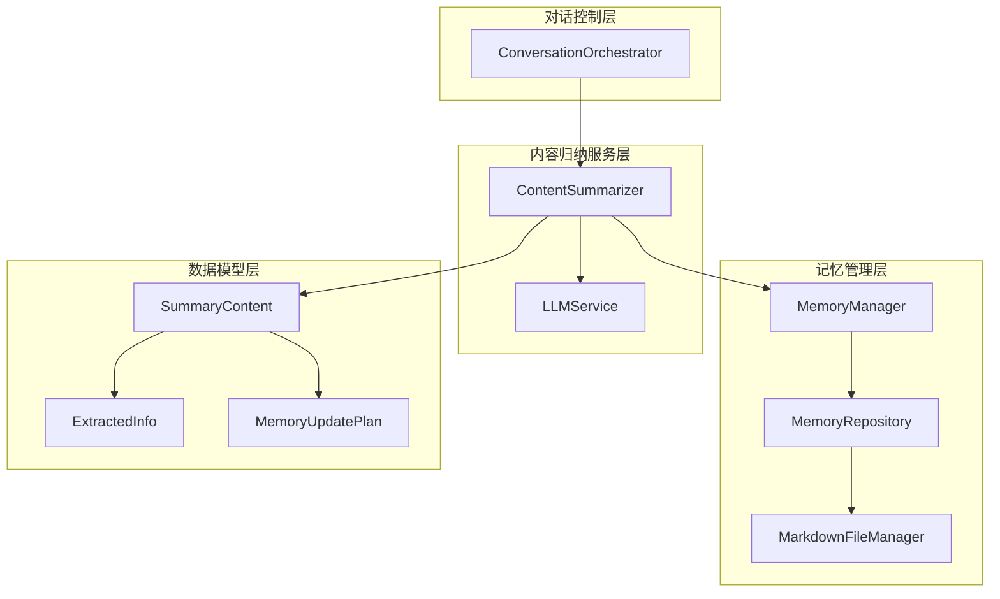
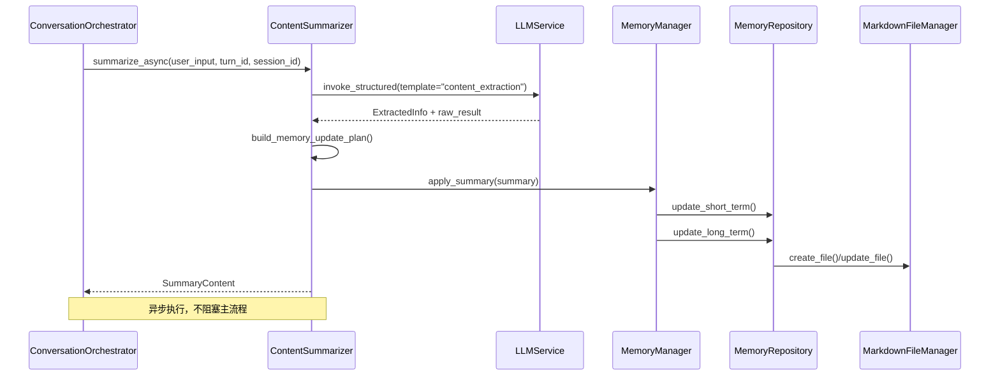
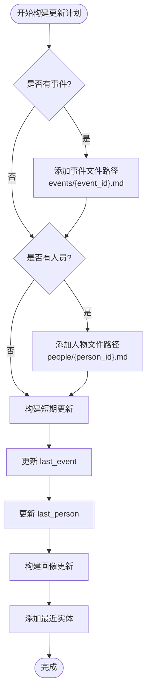
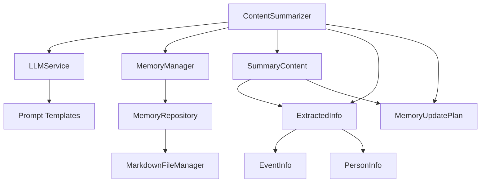

# 内容归纳服务

<cite>
**本文档引用的文件**
- [content_summarizer.py](file://src/services/content_summarizer.py)
- [summary_prompts.py](file://src/prompts/summary_prompts.py)
- [summary_content.py](file://src/models/summary_content.py)
- [event_info.py](file://src/models/event_info.py)
- [person_info.py](file://src/models/person_info.py)
- [memory_manager.py](file://src/services/memory_manager.py)
- [llm_service.py](file://src/services/llm_service.py)
- [memory_repository.py](file://src/storage/memory_repository.py)
- [conversation_orchestrator.py](file://src/core/conversation_orchestrator.py)
- [handoff_package.py](file://src/models/handoff_package.py)
</cite>

## 目录
1. [简介](#简介)
2. [项目结构](#项目结构)
3. [核心组件](#核心组件)
4. [架构概览](#架构概览)
5. [详细组件分析](#详细组件分析)
6. [依赖分析](#依赖分析)
7. [性能考虑](#性能考虑)
8. [故障排除指南](#故障排除指南)
9. [结论](#结论)

## 简介

内容归纳服务是老人自传写作系统中的关键组件，负责将对话内容转化为结构化的信息，并指导记忆库的更新。该服务采用异步处理机制，确保不会阻塞主对话流程，同时提供了完整的记忆更新计划构建能力。

## 项目结构

内容归纳服务位于系统的中间层，连接对话控制层和记忆管理层：

**图表来源**
- [content_summarizer.py:17-42](file://src/services/content_summarizer.py#L17-L42)
- [conversation_orchestrator.py:183-185](file://src/core/conversation_orchestrator.py#L183-L185)
- [memory_manager.py:27-61](file://src/services/memory_manager.py#L27-L61)

**章节来源**
- [content_summarizer.py:1-177](file://src/services/content_summarizer.py#L1-L177)
- [conversation_orchestrator.py:138-181](file://src/core/conversation_orchestrator.py#L138-L181)

## 核心组件

内容归纳服务包含以下核心组件：

### ContentSummarizer 类
- **职责**：将对话内容归纳为结构化信息，提取事件、人物、主题
- **异步处理**：支持非阻塞的归纳调用
- **记忆更新**：构建并应用记忆更新计划

### LLMService 集成
- **模板系统**：使用 "content_extraction" 模板
- **结构化输出**：返回 Pydantic 模型实例
- **错误处理**：完善的异常捕获和重试机制

### MemoryManager 集成
- **短期记忆**：更新最近事件和人物信息
- **长期记忆**：保存事件和人物到文件系统
- **画像记忆**：维护人物关系和特征

**章节来源**
- [content_summarizer.py:17-42](file://src/services/content_summarizer.py#L17-L42)
- [summary_prompts.py:3-49](file://src/prompts/summary_prompts.py#L3-L49)

## 架构概览

内容归纳服务在整个系统中的位置和交互关系：

**图表来源**
- [conversation_orchestrator.py:279-284](file://src/core/conversation_orchestrator.py#L279-L284)
- [content_summarizer.py:43-92](file://src/services/content_summarizer.py#L43-L92)
- [memory_manager.py:435-466](file://src/services/memory_manager.py#L435-L466)

## 详细组件分析

### ContentSummarizer 类分析

ContentSummarizer 是内容归纳服务的核心类，实现了完整的异步归纳机制：

#### 核心方法

**summarize_async 方法**
- **异步调用**：使用 asyncio.create_task() 非阻塞执行
- **LLM 调用**：通过 LLMService.invoke_structured() 提取结构化信息
- **错误处理**：捕获异常并返回 None
- **记忆更新**：自动应用记忆更新计划

**prepare_handoff 方法**
- **会话结束**：在会话终止时调用
- **完整汇总**：收集所有已提取的事件和人物
- **交接准备**：构建完整的 SummaryContent

#### 记忆更新计划构建

**图表来源**
- [content_summarizer.py:94-109](file://src/services/content_summarizer.py#L94-L109)

**章节来源**
- [content_summarizer.py:43-143](file://src/services/content_summarizer.py#L43-L143)

### 数据模型分析

#### SummaryContent 模型
- **结构化封装**：封装完整的归纳结果
- **记忆更新指令**：包含 MemoryUpdatePlan
- **交接状态**：支持会话交接标记

#### ExtractedInfo 模型
- **事件信息**：EventInfo 列表
- **人物信息**：PersonInfo 列表
- **时间标记**：TimeMarker 列表
- **主题信息**：ThemeInfo 列表

#### MemoryUpdatePlan 模型
- **短期更新**：last_event, last_person
- **长期文件**：需要更新的文件路径列表
- **画像更新**：recent_entities

**章节来源**
- [summary_content.py:37-67](file://src/models/summary_content.py#L37-L67)
- [summary_content.py:22-35](file://src/models/summary_content.py#L22-L35)

### LLMService 集成分析

ContentSummarizer 通过 LLMService 实现与大语言模型的交互：

#### Prompt 模板
- **content_extraction**：专门用于内容提取的模板
- **结构化输出**：要求 JSON 格式的结构化输出
- **变量绑定**：user_input 和 turn_id

#### 错误处理机制
- **异常捕获**：try-catch 包装所有 LLM 调用
- **日志记录**：详细的错误日志
- **降级处理**：失败时返回 None

**章节来源**
- [summary_prompts.py:3-49](file://src/prompts/summary_prompts.py#L3-L49)
- [llm_service.py:327-399](file://src/services/llm_service.py#L327-L399)

### MemoryManager 集成分析

ContentSummarizer 与 MemoryManager 的集成体现在记忆更新的应用：

#### apply_summary 方法
- **短期记忆更新**：更新 last_event 和 last_person
- **长期记忆更新**：并行保存事件和人物文件
- **画像记忆更新**：维护人物关系和特征

#### 并行处理
- **异步任务**：使用 asyncio.gather() 并行执行
- **资源管理**：合理管理文件系统访问
- **错误隔离**：单个文件保存失败不影响整体

**章节来源**
- [memory_manager.py:435-466](file://src/services/memory_manager.py#L435-L466)

## 依赖分析

内容归纳服务的依赖关系：

**图表来源**
- [content_summarizer.py:6-12](file://src/services/content_summarizer.py#L6-L12)
- [memory_manager.py:5-13](file://src/services/memory_manager.py#L5-L13)

### 组件耦合度分析

- **低耦合设计**：ContentSummarizer 通过接口与 MemoryManager 交互
- **高内聚性**：所有归纳相关逻辑集中在单一类中
- **清晰边界**：与 LLMService 和 MemoryManager 的职责分离明确

**章节来源**
- [content_summarizer.py:17-42](file://src/services/content_summarizer.py#L17-L42)
- [memory_manager.py:27-61](file://src/services/memory_manager.py#L27-L61)

## 性能考虑

### 异步处理优化

1. **非阻塞调用**
   - 使用 asyncio.create_task() 避免阻塞主流程
   - 合理设置超时时间防止长时间等待

2. **并行文件操作**
   - MemoryManager 中使用 asyncio.gather() 并行保存多个文件
   - 减少 I/O 等待时间

3. **缓存机制**
   - MemoryRepository 实现了 LRU 缓存
   - 减少重复的文件读取操作

### 资源管理最佳实践

1. **内存使用**
   - 控制短期记忆容量（默认 20）
   - 及时清理不需要的历史记录

2. **文件系统优化**
   - 合理的文件命名和目录结构
   - 批量操作减少磁盘 I/O

3. **LLM 调用优化**
   - 结构化输出模板减少解析开销
   - 适当的重试机制避免失败重试

**章节来源**
- [conversation_orchestrator.py:279-284](file://src/core/conversation_orchestrator.py#L279-L284)
- [memory_repository.py:16-38](file://src/storage/memory_repository.py#L16-L38)

## 故障排除指南

### 常见问题及解决方案

#### LLM 调用失败
- **症状**：Content extraction failed 日志
- **原因**：网络问题、模型不可用、参数错误
- **解决**：检查 LLM 配置，验证 API 密钥，查看网络连接

#### 记忆更新失败
- **症状**：文件保存失败或权限错误
- **原因**：文件路径不存在、权限不足、磁盘空间不足
- **解决**：检查存储路径，验证权限设置，清理磁盘空间

#### 异步任务超时
- **症状**：ContentSummarizer 调用超时
- **原因**：LLM 响应慢、系统负载高
- **解决**：调整超时配置，优化系统性能

### 调试建议

1. **启用详细日志**
   - 设置日志级别为 DEBUG
   - 监控 LLM 调用统计信息

2. **监控资源使用**
   - 监控内存使用情况
   - 跟踪文件系统 I/O 操作

3. **性能基准测试**
   - 测量不同规模数据的处理时间
   - 识别性能瓶颈

**章节来源**
- [content_summarizer.py:90-92](file://src/services/content_summarizer.py#L90-L92)
- [llm_service.py:420-437](file://src/services/llm_service.py#L420-L437)

## 结论

内容归纳服务通过精心设计的异步架构和清晰的职责分离，为整个老人自传写作系统提供了强大的内容处理能力。其核心优势包括：

1. **异步非阻塞**：确保对话流程的流畅性
2. **结构化输出**：提供标准化的数据格式
3. **智能记忆管理**：自动维护短期、长期和画像记忆
4. **可扩展性**：模块化设计便于功能扩展

该服务为后续的交接包生成和下游 Agent 的处理奠定了坚实的基础，是整个系统架构中的关键枢纽。