# 内容结构化系统

<cite>
**本文档引用的文件**
- [src/services/content_summarizer.py](file://src/services/content_summarizer.py)
- [src/models/event_info.py](file://src/models/event_info.py)
- [src/models/person_info.py](file://src/models/person_info.py)
- [src/models/organized_memory.py](file://src/models/organized_memory.py)
- [src/models/summary_content.py](file://src/models/summary_content.py)
- [src/prompts/summary_prompts.py](file://src/prompts/summary_prompts.py)
- [src/services/memory_manager.py](file://src/services/memory_manager.py)
- [src/storage/markdown_file_manager.py](file://src/storage/markdown_file_manager.py)
- [src/core/conversation_orchestrator.py](file://src/core/conversation_orchestrator.py)
- [Prompts/MemoryOrganizer-Prompt.md](file://Prompts/MemoryOrganizer-Prompt.md)
- [src/enums/strategy_type.py](file://src/enums/strategy_type.py)
- [src/models/session_state.py](file://src/models/session_state.py)
- [src/storage/memory_repository.py](file://src/storage/memory_repository.py)
- [knowledge_base/test_user001/events/childhood/保护妹妹与邻居家胖墩打架.md](file://knowledge_base/test_user001/events/childhood/保护妹妹与邻居家胖墩打架.md)
- [knowledge_base/test_user001/people/family/母亲.md](file://knowledge_base/test_user001/people/family/母亲.md)
- [Prompts/ContentSummarizer-Prompt.md](file://Prompts/ContentSummarizer-Prompt.md)
</cite>

## 目录
1. [简介](#简介)
2. [项目结构](#项目结构)
3. [核心组件](#核心组件)
4. [架构概览](#架构概览)
5. [详细组件分析](#详细组件分析)
6. [依赖分析](#依赖分析)
7. [性能考虑](#性能考虑)
8. [故障排除指南](#故障排除指南)
9. [结论](#结论)
10. [附录](#附录)

## 简介
本系统旨在将对话内容结构化为可长期存储的知识条目，支持事件、人物、主题的提取与组织，并生成时间线与叙事连贯的自传素材。系统采用模块化设计，通过内容归纳服务、记忆管理服务、文件存储与查询等组件协同工作，实现从对话到结构化知识的自动化转换。

## 项目结构
系统采用分层架构，主要分为以下层次：
- 控制层：对话主控器协调各子组件，管理会话状态与流程控制
- 服务层：内容归纳、记忆管理、情感检测、知识库查询、LLM服务等
- 存储层：Markdown文件管理器与内存仓库，负责文件系统与缓存
- 模型层：事件、人物、主题、时间标记等数据模型
- 提示词层：结构化提示模板，指导LLM输出符合Schema的JSON

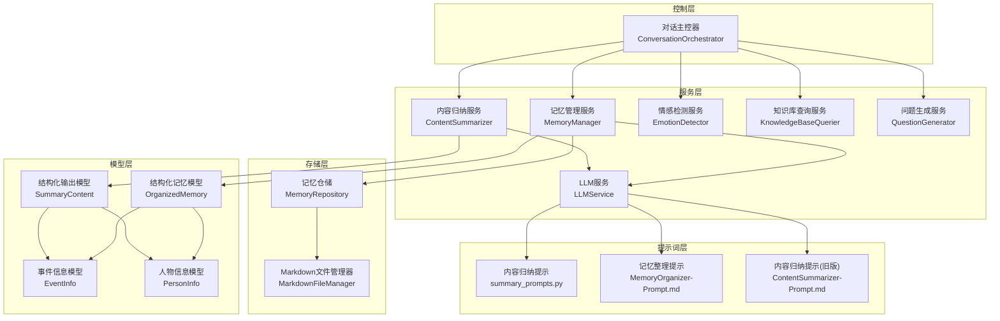

**图表来源**
- [src/core/conversation_orchestrator.py:138-401](file://src/core/conversation_orchestrator.py#L138-L401)
- [src/services/content_summarizer.py:17-93](file://src/services/content_summarizer.py#L17-L93)
- [src/services/memory_manager.py:27-156](file://src/services/memory_manager.py#L27-L156)
- [src/storage/memory_repository.py:40-87](file://src/storage/memory_repository.py#L40-L87)
- [src/storage/markdown_file_manager.py:31-131](file://src/storage/markdown_file_manager.py#L31-L131)
- [src/prompts/summary_prompts.py:3-49](file://src/prompts/summary_prompts.py#L3-L49)
- [Prompts/MemoryOrganizer-Prompt.md:1-773](file://Prompts/MemoryOrganizer-Prompt.md#L1-L773)
- [Prompts/ContentSummarizer-Prompt.md:1-567](file://Prompts/ContentSummarizer-Prompt.md#L1-L567)

**章节来源**
- [src/core/conversation_orchestrator.py:138-401](file://src/core/conversation_orchestrator.py#L138-L401)
- [src/services/content_summarizer.py:17-93](file://src/services/content_summarizer.py#L17-L93)
- [src/services/memory_manager.py:27-156](file://src/services/memory_manager.py#L27-L156)
- [src/storage/memory_repository.py:40-87](file://src/storage/memory_repository.py#L40-L87)
- [src/storage/markdown_file_manager.py:31-131](file://src/storage/markdown_file_manager.py#L31-L131)
- [src/prompts/summary_prompts.py:3-49](file://src/prompts/summary_prompts.py#L3-L49)
- [Prompts/MemoryOrganizer-Prompt.md:1-773](file://Prompts/MemoryOrganizer-Prompt.md#L1-L773)
- [Prompts/ContentSummarizer-Prompt.md:1-567](file://Prompts/ContentSummarizer-Prompt.md#L1-L567)

## 核心组件
本节深入分析内容结构化系统的核心组件，包括内容归纳机制、数据模型设计、时间线生成算法、主题提取与分类、以及结构化输出与验证规则。

### 内容归纳机制
内容归纳服务负责将对话内容转化为结构化信息，包括事件、人物、主题与时间标记，并指导记忆库更新。其核心流程如下：
- 异步调用LLM服务，使用结构化提示模板提取信息
- 构建结构化输出模型，包含事件列表、人物列表、时间标记与主题
- 生成记忆更新计划，指导短期与长期记忆的更新
- 在会话结束时，汇总所有已收集的事件与人物，生成最终归纳结果

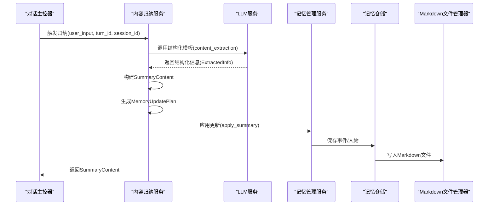

**图表来源**
- [src/services/content_summarizer.py:43-93](file://src/services/content_summarizer.py#L43-L93)
- [src/services/memory_manager.py:435-466](file://src/services/memory_manager.py#L435-L466)
- [src/storage/memory_repository.py:176-226](file://src/storage/memory_repository.py#L176-L226)
- [src/storage/markdown_file_manager.py:134-169](file://src/storage/markdown_file_manager.py#L134-L169)
- [src/prompts/summary_prompts.py:3-49](file://src/prompts/summary_prompts.py#L3-L49)

**章节来源**
- [src/services/content_summarizer.py:43-93](file://src/services/content_summarizer.py#L43-L93)
- [src/services/memory_manager.py:435-466](file://src/services/memory_manager.py#L435-L466)
- [src/storage/memory_repository.py:176-226](file://src/storage/memory_repository.py#L176-L226)
- [src/storage/markdown_file_manager.py:134-169](file://src/storage/markdown_file_manager.py#L134-L169)
- [src/prompts/summary_prompts.py:3-49](file://src/prompts/summary_prompts.py#L3-L49)

### 数据模型设计
系统采用Pydantic模型定义数据结构，确保类型安全与Schema一致性。核心模型包括：

- 事件信息模型（EventInfo）：记录单个事件的基本信息、描述、参与者、情感标签、显著性等，并提供Markdown转换方法
- 人物信息模型（PersonInfo）：记录人物画像，包括关系、描述、与主人公的关系、影响等，并提供Markdown转换方法
- 结构化输出模型（SummaryContent）：封装归纳结果，包含事件、人物、时间标记、主题、记忆更新计划等
- 结构化记忆模型（OrganizedMemory）：用于记忆整理服务的输出，包含时间线更新、事件提取、人物提取、画像更新、存储建议与处理摘要

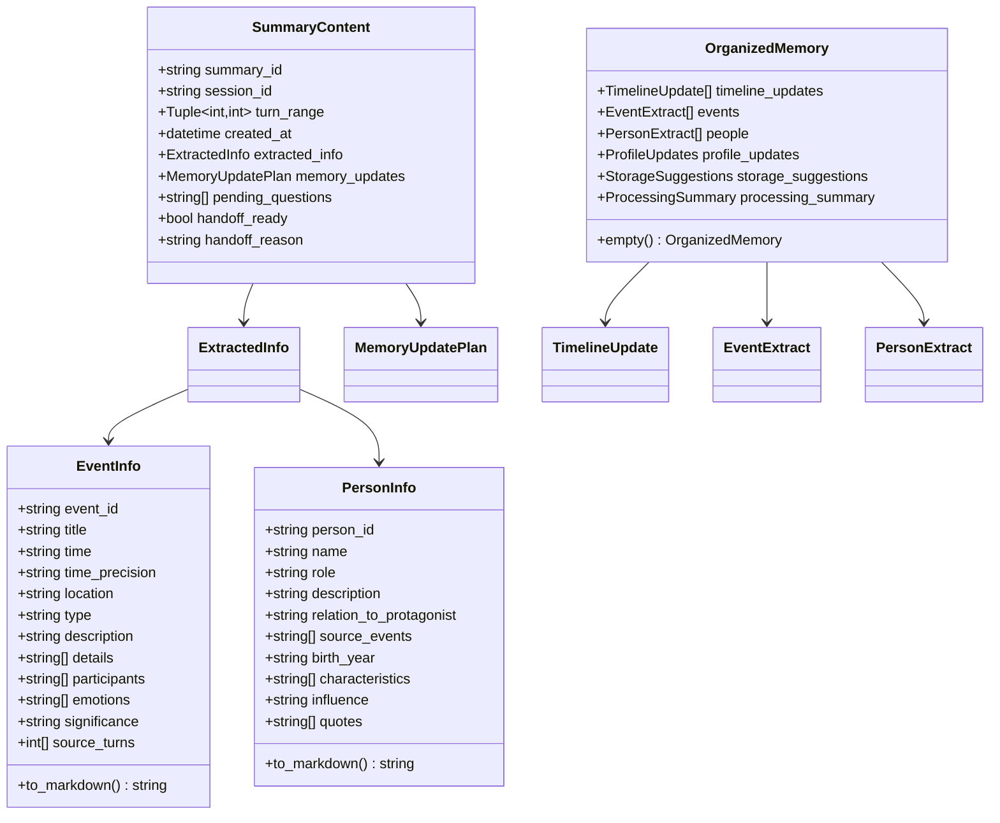

**图表来源**
- [src/models/event_info.py:5-69](file://src/models/event_info.py#L5-L69)
- [src/models/person_info.py:5-61](file://src/models/person_info.py#L5-L61)
- [src/models/summary_content.py:37-67](file://src/models/summary_content.py#L37-L67)
- [src/models/organized_memory.py:141-151](file://src/models/organized_memory.py#L141-L151)

**章节来源**
- [src/models/event_info.py:5-69](file://src/models/event_info.py#L5-L69)
- [src/models/person_info.py:5-61](file://src/models/person_info.py#L5-L61)
- [src/models/summary_content.py:37-67](file://src/models/summary_content.py#L37-L67)
- [src/models/organized_memory.py:141-151](file://src/models/organized_memory.py#L141-L151)

### 时间线生成算法
时间线生成算法负责将事件按时间顺序组织，并标注人生阶段。核心步骤包括：
- 从事件集合构建时间标记，按时间点聚合相关事件
- 根据时间字符串确定人生阶段（简化实现）
- 生成主题列表，按事件显著性聚类主题

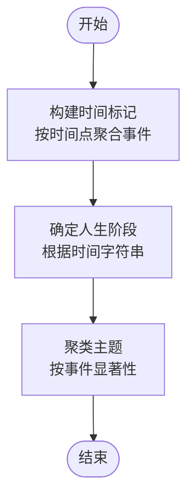

**图表来源**
- [src/services/content_summarizer.py:145-177](file://src/services/content_summarizer.py#L145-L177)

**章节来源**
- [src/services/content_summarizer.py:145-177](file://src/services/content_summarizer.py#L145-L177)

### 主题提取与内容分类
主题提取通过事件显著性进行聚类，生成主题列表及其相关事件。内容分类包括事件类型与人物关系类型，分别用于事件维度与人物维度的分类标注。系统还提供置信度评估，用于衡量信息的可靠性。

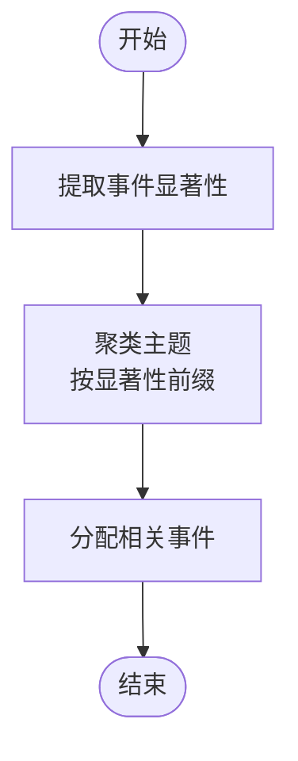

**图表来源**
- [src/services/content_summarizer.py:164-177](file://src/services/content_summarizer.py#L164-L177)
- [src/models/organized_memory.py:13-46](file://src/models/organized_memory.py#L13-L46)

**章节来源**
- [src/services/content_summarizer.py:164-177](file://src/services/content_summarizer.py#L164-L177)
- [src/models/organized_memory.py:13-46](file://src/models/organized_memory.py#L13-L46)

### 结构化输出标准与数据验证
系统通过提示模板与Pydantic模型实现结构化输出与数据验证：
- 提示模板定义输出Schema，确保LLM输出符合预期结构
- Pydantic模型提供字段类型、默认值与约束（如置信度范围）
- Markdown模板确保文件内容的可读性与链接一致性

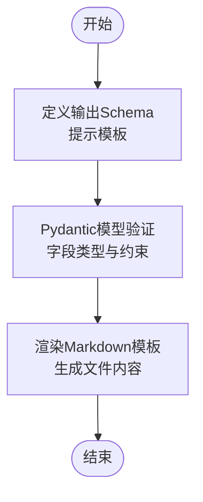

**图表来源**
- [src/prompts/summary_prompts.py:3-49](file://src/prompts/summary_prompts.py#L3-L49)
- [src/models/summary_content.py:22-67](file://src/models/summary_content.py#L22-L67)
- [src/models/event_info.py:34-69](file://src/models/event_info.py#L34-L69)
- [src/models/person_info.py:34-61](file://src/models/person_info.py#L34-L61)

**章节来源**
- [src/prompts/summary_prompts.py:3-49](file://src/prompts/summary_prompts.py#L3-L49)
- [src/models/summary_content.py:22-67](file://src/models/summary_content.py#L22-L67)
- [src/models/event_info.py:34-69](file://src/models/event_info.py#L34-L69)
- [src/models/person_info.py:34-61](file://src/models/person_info.py#L34-L61)

## 架构概览
系统采用事件驱动与异步处理相结合的架构，对话主控器协调各服务组件，内容归纳服务与记忆管理服务通过LLM服务进行结构化信息提取与整理，存储层负责文件系统的读写与缓存。

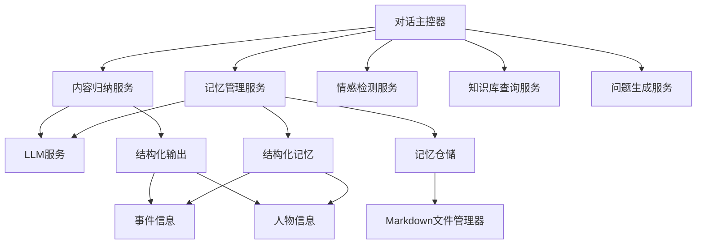

**图表来源**
- [src/core/conversation_orchestrator.py:163-197](file://src/core/conversation_orchestrator.py#L163-L197)
- [src/services/content_summarizer.py:35-42](file://src/services/content_summarizer.py#L35-L42)
- [src/services/memory_manager.py:47-61](file://src/services/memory_manager.py#L47-L61)
- [src/storage/memory_repository.py:54-87](file://src/storage/memory_repository.py#L54-L87)
- [src/storage/markdown_file_manager.py:47-78](file://src/storage/markdown_file_manager.py#L47-L78)

**章节来源**
- [src/core/conversation_orchestrator.py:163-197](file://src/core/conversation_orchestrator.py#L163-L197)
- [src/services/content_summarizer.py:35-42](file://src/services/content_summarizer.py#L35-L42)
- [src/services/memory_manager.py:47-61](file://src/services/memory_manager.py#L47-L61)
- [src/storage/memory_repository.py:54-87](file://src/storage/memory_repository.py#L54-L87)
- [src/storage/markdown_file_manager.py:47-78](file://src/storage/markdown_file_manager.py#L47-L78)

## 详细组件分析

### 内容归纳服务（ContentSummarizer）
内容归纳服务负责从对话中提取结构化信息，包括事件、人物、主题与时间标记，并生成记忆更新计划。其异步调用LLM服务，使用结构化提示模板，确保输出符合Schema。服务还支持会话结束时的最终归纳，汇总所有已收集的事件与人物。

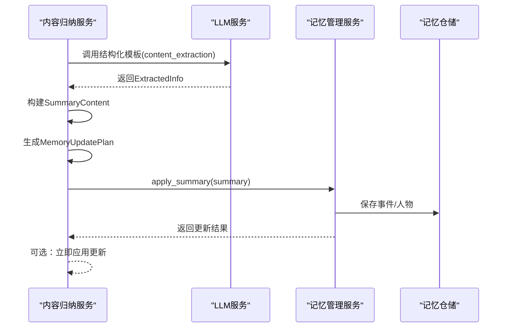

**图表来源**
- [src/services/content_summarizer.py:43-93](file://src/services/content_summarizer.py#L43-L93)
- [src/services/memory_manager.py:435-466](file://src/services/memory_manager.py#L435-L466)

**章节来源**
- [src/services/content_summarizer.py:43-93](file://src/services/content_summarizer.py#L43-L93)
- [src/services/memory_manager.py:435-466](file://src/services/memory_manager.py#L435-L466)

### 记忆管理服务（MemoryManager）
记忆管理服务提供统一的记忆读写接口，协调LLM整理采访内容为结构化信息，并通过记忆仓储完成存储。其核心方法包括组织与保存记忆、应用整理结果、查询事件与人物、更新画像记忆等。服务支持并行保存事件与人物，提升存储效率。

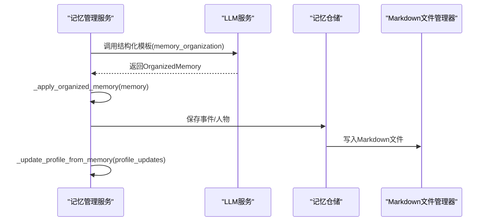

**图表来源**
- [src/services/memory_manager.py:111-156](file://src/services/memory_manager.py#L111-L156)
- [src/services/memory_manager.py:158-193](file://src/services/memory_manager.py#L158-L193)
- [src/storage/memory_repository.py:176-226](file://src/storage/memory_repository.py#L176-L226)
- [src/storage/markdown_file_manager.py:134-169](file://src/storage/markdown_file_manager.py#L134-L169)

**章节来源**
- [src/services/memory_manager.py:111-156](file://src/services/memory_manager.py#L111-L156)
- [src/services/memory_manager.py:158-193](file://src/services/memory_manager.py#L158-L193)
- [src/storage/memory_repository.py:176-226](file://src/storage/memory_repository.py#L176-L226)
- [src/storage/markdown_file_manager.py:134-169](file://src/storage/markdown_file_manager.py#L134-L169)

### 存储与查询（MarkdownFileManager 与 MemoryRepository）
Markdown文件管理器负责管理记忆库的Markdown文件，提供创建、读取、更新、全文搜索与Wiki链接追踪功能。记忆仓储负责短期记忆（内存缓存）、长期记忆（文件系统）与画像记忆（结构化存储），并提供事件与人物的查询接口。

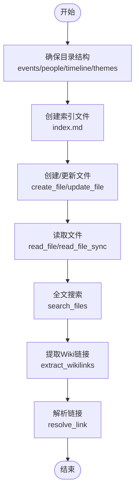

**图表来源**
- [src/storage/markdown_file_manager.py:80-131](file://src/storage/markdown_file_manager.py#L80-L131)
- [src/storage/markdown_file_manager.py:134-262](file://src/storage/markdown_file_manager.py#L134-L262)
- [src/storage/markdown_file_manager.py:285-355](file://src/storage/markdown_file_manager.py#L285-L355)
- [src/storage/markdown_file_manager.py:358-472](file://src/storage/markdown_file_manager.py#L358-L472)

**章节来源**
- [src/storage/markdown_file_manager.py:80-131](file://src/storage/markdown_file_manager.py#L80-L131)
- [src/storage/markdown_file_manager.py:134-262](file://src/storage/markdown_file_manager.py#L134-L262)
- [src/storage/markdown_file_manager.py:285-355](file://src/storage/markdown_file_manager.py#L285-L355)
- [src/storage/markdown_file_manager.py:358-472](file://src/storage/markdown_file_manager.py#L358-L472)

### 会话状态与策略（SessionState 与 StrategyType）
会话状态管理贯穿整个会话生命周期，包括会话ID、对话轮数、覆盖率、采集内容、当前话题、情绪状态、待处理问题与对话历史等。策略类型定义了不同的采访策略，如闪光点优先、时间线经典与主题式发散。

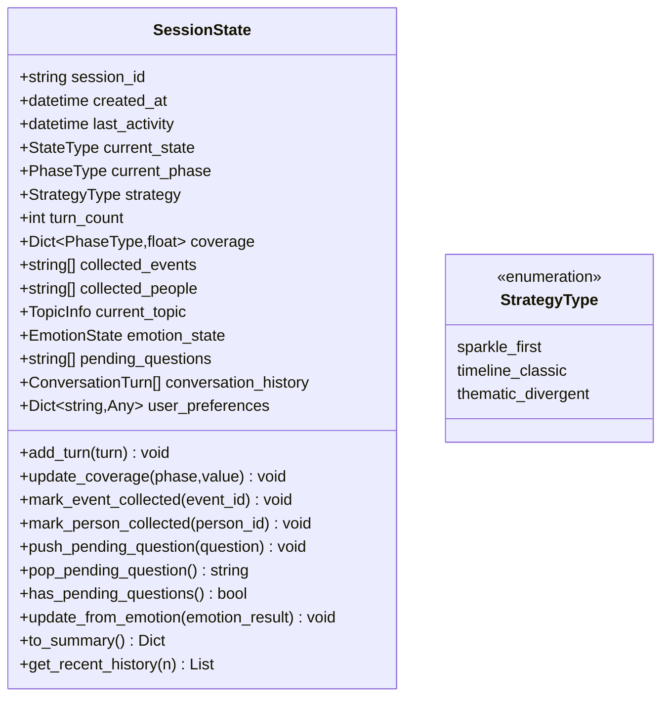

**图表来源**
- [src/models/session_state.py:24-139](file://src/models/session_state.py#L24-L139)
- [src/enums/strategy_type.py:4-8](file://src/enums/strategy_type.py#L4-L8)

**章节来源**
- [src/models/session_state.py:24-139](file://src/models/session_state.py#L24-L139)
- [src/enums/strategy_type.py:4-8](file://src/enums/strategy_type.py#L4-L8)

## 依赖分析
系统组件间存在明确的依赖关系，耦合度适中，职责清晰：
- 内容归纳服务依赖LLM服务与记忆管理服务
- 记忆管理服务依赖记忆仓储与LLM服务
- 记忆仓储依赖Markdown文件管理器
- 对话主控器协调所有服务组件

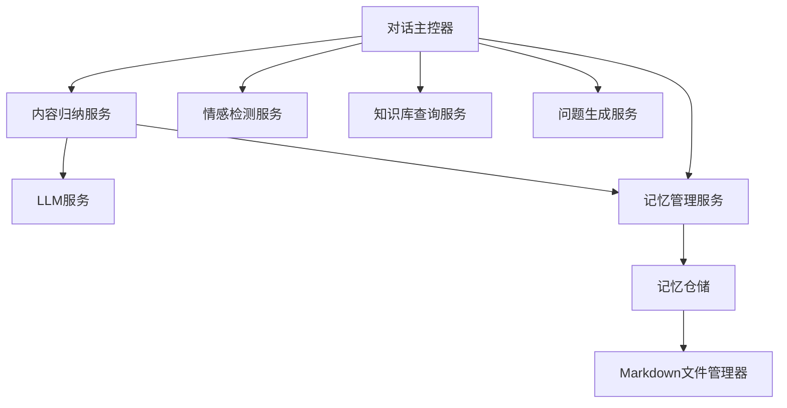

**图表来源**
- [src/services/content_summarizer.py:35-42](file://src/services/content_summarizer.py#L35-L42)
- [src/services/memory_manager.py:47-61](file://src/services/memory_manager.py#L47-L61)
- [src/storage/memory_repository.py:54-67](file://src/storage/memory_repository.py#L54-L67)
- [src/core/conversation_orchestrator.py:163-197](file://src/core/conversation_orchestrator.py#L163-L197)

**章节来源**
- [src/services/content_summarizer.py:35-42](file://src/services/content_summarizer.py#L35-L42)
- [src/services/memory_manager.py:47-61](file://src/services/memory_manager.py#L47-L61)
- [src/storage/memory_repository.py:54-67](file://src/storage/memory_repository.py#L54-L67)
- [src/core/conversation_orchestrator.py:163-197](file://src/core/conversation_orchestrator.py#L163-L197)

## 性能考虑
- 异步处理：内容归纳服务与记忆管理服务均采用异步方法，避免阻塞主流程
- 并行保存：记忆管理服务在应用整理结果时并行保存事件与人物，提升存储效率
- 缓存机制：记忆仓储使用LRU缓存，减少重复读取开销
- 事件驱动：对话主控器通过事件总线发布事件，降低组件间的直接耦合

[本节为通用性能讨论，无需特定文件分析]

## 故障排除指南
- LLM调用失败：检查提示模板与输出Schema，确保结构化输出正确
- 文件写入异常：验证目录权限与路径，确认Markdown文件管理器的目录结构
- 记忆更新失败：检查记忆管理服务的应用逻辑，确认事件与人物的ID与路径
- 会话超时：调整会话时长配置，确保在时间到达时正确触发结束引导

**章节来源**
- [src/services/content_summarizer.py:90-92](file://src/services/content_summarizer.py#L90-L92)
- [src/storage/markdown_file_manager.py:164-169](file://src/storage/markdown_file_manager.py#L164-L169)
- [src/services/memory_manager.py:147-149](file://src/services/memory_manager.py#L147-L149)
- [src/core/conversation_orchestrator.py:570-592](file://src/core/conversation_orchestrator.py#L570-L592)

## 结论
内容结构化系统通过模块化设计与事件驱动架构，实现了从对话到结构化知识的高效转换。系统采用提示模板与Pydantic模型确保输出的准确性与一致性，结合异步处理与并行保存机制，提升了整体性能。未来可在主题提取的语义分析、时间线排序的智能算法与扩展性设计方面进一步优化。

[本节为总结性内容，无需特定文件分析]

## 附录

### 示例文件参考
- 事件文件示例：展示了事件的基本信息、描述、相关人物、时间线关联、关键细节、情感标签与来源记录
- 人物文件示例：展示了人物的基本信息、与主人公的关系、影响、相关事件、重要语录与来源记录

**章节来源**
- [knowledge_base/test_user001/events/childhood/保护妹妹与邻居家胖墩打架.md:1-31](file://knowledge_base/test_user001/events/childhood/保护妹妹与邻居家胖墩打架.md#L1-L31)
- [knowledge_base/test_user001/people/family/母亲.md:1-23](file://knowledge_base/test_user001/people/family/母亲.md#L1-L23)