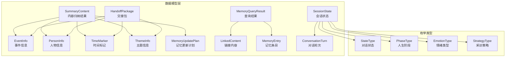
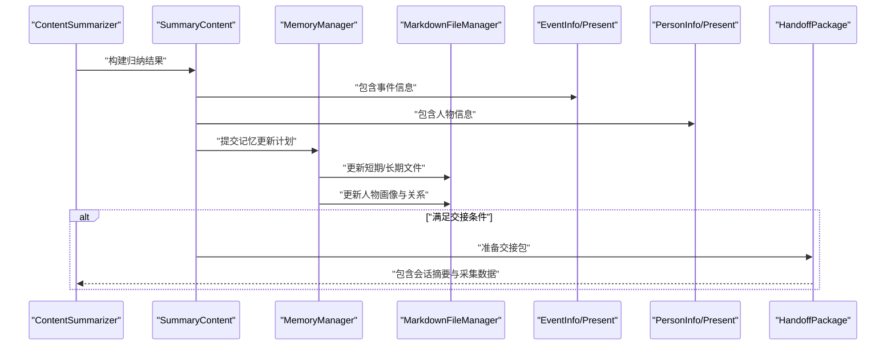
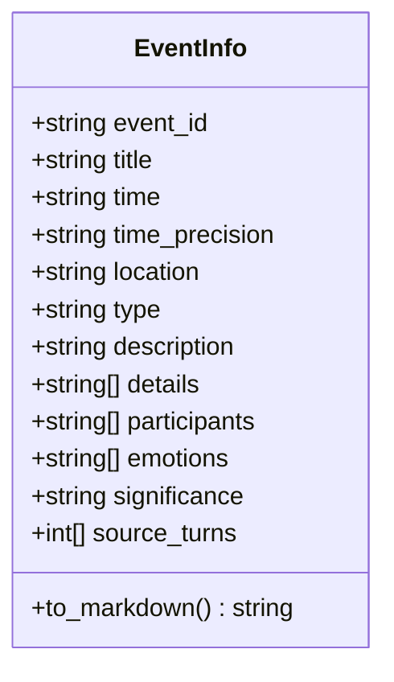
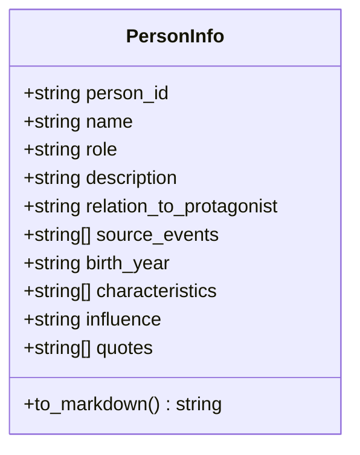
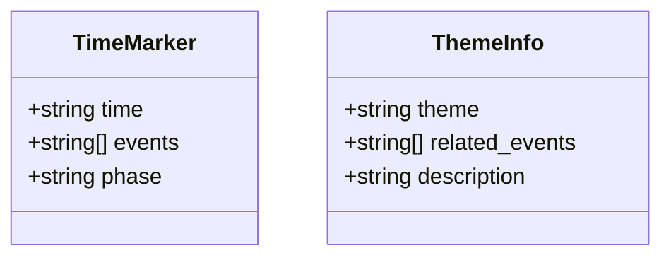
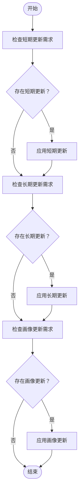
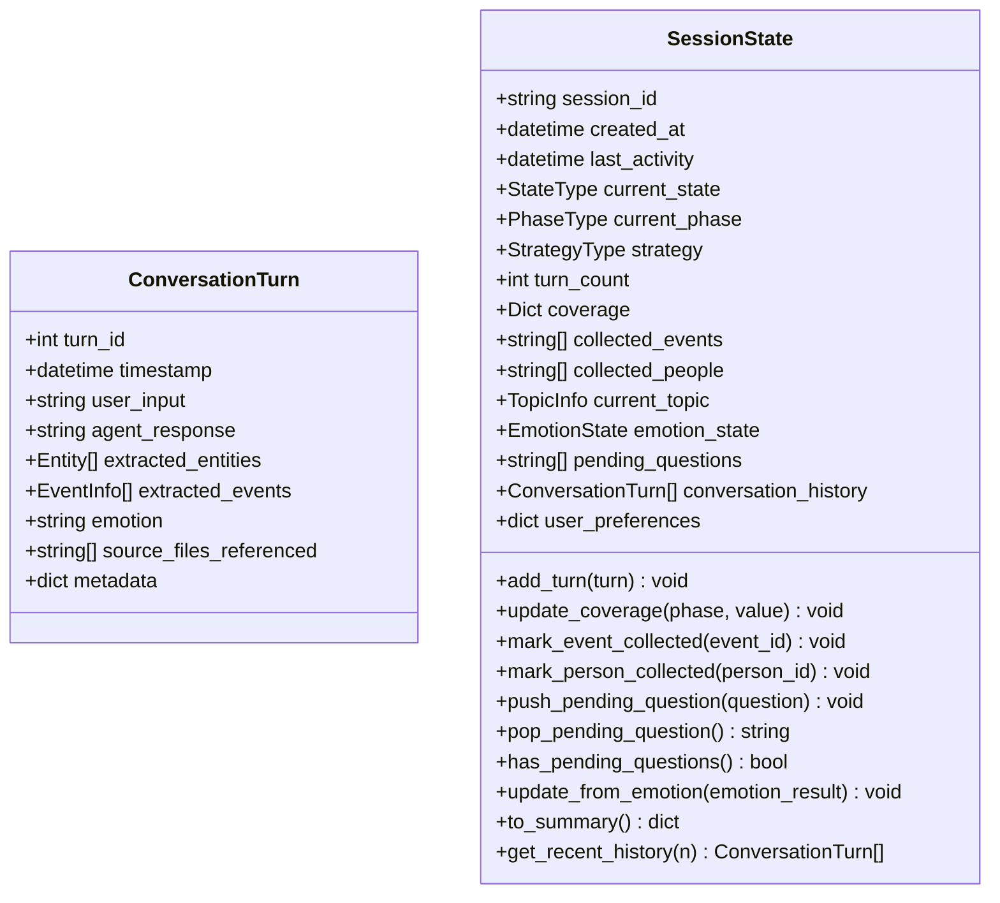
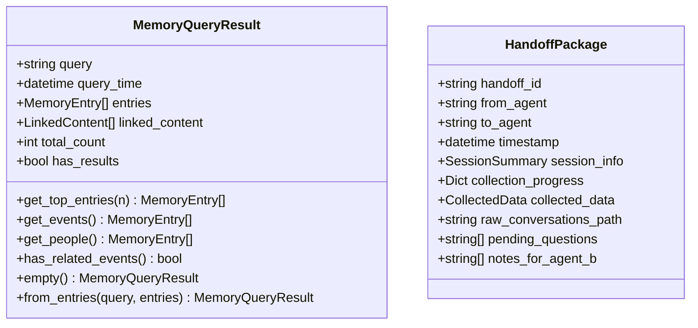
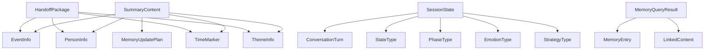

# 数据模型设计

<cite>
**本文档引用的文件**
- [src/models/summary_content.py](file://src/models/summary_content.py)
- [src/models/event_info.py](file://src/models/event_info.py)
- [src/models/person_info.py](file://src/models/person_info.py)
- [src/models/organized_memory.py](file://src/models/organized_memory.py)
- [src/models/conversation_turn.py](file://src/models/conversation_turn.py)
- [src/models/memory_query_result.py](file://src/models/memory_query_result.py)
- [src/models/session_state.py](file://src/models/session_state.py)
- [src/models/handoff_package.py](file://src/models/handoff_package.py)
- [src/enums/state_type.py](file://src/enums/state_type.py)
- [src/enums/phase_type.py](file://src/enums/phase_type.py)
- [src/enums/emotion_type.py](file://src/enums/emotion_type.py)
- [src/enums/strategy_type.py](file://src/enums/strategy_type.py)
</cite>

## 目录
1. [简介](#简介)
2. [项目结构](#项目结构)
3. [核心组件](#核心组件)
4. [架构概览](#架构概览)
5. [详细组件分析](#详细组件分析)
6. [依赖分析](#依赖分析)
7. [性能考虑](#性能考虑)
8. [故障排除指南](#故障排除指南)
9. [结论](#结论)
10. [附录](#附录)

## 简介
本文件面向内容结构化系统中的数据模型，围绕以下核心对象进行深入技术说明：
- SummaryContent：内容归纳的结构化结果载体，指导记忆库更新与交接流程
- EventInfo：事件信息模型，支持写入记忆库与Markdown导出
- PersonInfo：人物信息模型，支持写入记忆库与Markdown导出
- TimeMarker：时间标记，用于时间线梳理与阶段标注
- ThemeInfo：主题信息，用于主题提取与关联事件管理
- MemoryUpdatePlan：记忆更新计划，定义短期、长期与画像更新策略

本设计以Pydantic为基础，结合枚举类型与序列化机制，确保数据一致性、可追踪性与可扩展性。

## 项目结构
数据模型位于src/models目录下，采用按职责分层的组织方式：
- 核心数据对象：SummaryContent、EventInfo、PersonInfo、SessionState等
- 辅助数据对象：TimeMarker、ThemeInfo、MemoryUpdatePlan等
- 查询与结果：MemoryQueryResult、LinkedContent、MemoryEntry
- 交接与会话：HandoffPackage、SessionSummary、ProgressInfo
- 枚举类型：StateType、PhaseType、EmotionType、StrategyType等

图表来源
- [src/models/summary_content.py:37-67](file://src/models/summary_content.py#L37-L67)
- [src/models/event_info.py:5-69](file://src/models/event_info.py#L5-L69)
- [src/models/person_info.py:5-61](file://src/models/person_info.py#L5-L61)
- [src/models/memory_query_result.py:23-81](file://src/models/memory_query_result.py#L23-L81)
- [src/models/conversation_turn.py:14-52](file://src/models/conversation_turn.py#L14-L52)
- [src/models/session_state.py:24-139](file://src/models/session_state.py#L24-L139)
- [src/models/handoff_package.py:32-66](file://src/models/handoff_package.py#L32-L66)
- [src/enums/state_type.py:4-12](file://src/enums/state_type.py#L4-L12)
- [src/enums/phase_type.py:4-10](file://src/enums/phase_type.py#L4-L10)
- [src/enums/emotion_type.py:4-50](file://src/enums/emotion_type.py#L4-L50)
- [src/enums/strategy_type.py:4-8](file://src/enums/strategy_type.py#L4-L8)

章节来源
- [src/models/__init__.py:1-86](file://src/models/__init__.py#L1-L86)

## 核心组件
本节聚焦于SummaryContent及其子模型的设计理念与使用场景，涵盖字段定义、数据类型、关系映射与序列化机制。

- SummaryContent
  - 角色定位：封装内容归纳的完整结果，指导记忆库更新与交接流程
  - 关键字段
    - summary_id：归纳ID（字符串，必填）
    - session_id：会话ID（字符串，必填）
    - turn_range：覆盖的对话轮次范围（二元元组，必填）
    - created_at：创建时间（datetime，默认当前时间）
    - extracted_info：提取的信息汇总（ExtractedInfo，默认工厂）
    - memory_updates：记忆更新指令（MemoryUpdatePlan，默认工厂）
    - pending_questions：待处理问题（列表，默认空列表）
    - handoff_ready：交接就绪标志（布尔，默认False）
    - handoff_reason：交接原因（可选字符串，默认None）
  - 设计要点
    - 字段校验：使用Pydantic Field定义必填项与默认值
    - 关系映射：与EventInfo、PersonInfo、TimeMarker、ThemeInfo形成聚合关系
    - 序列化：支持JSON序列化与反序列化，便于跨模块传输
  - 使用场景
    - ContentSummarizer.summarize()的输出
    - MemoryManager更新记忆的依据
    - HandoffPackage的组成部分

- ExtractedInfo
  - 聚合多个子模型，统一承载提取结果
  - 字段：events（事件列表）、people（人物列表）、time_markers（时间标记列表）、themes（主题列表）

- MemoryUpdatePlan
  - 记忆更新策略的结构化表达
  - 字段：short_term_updates（短期更新字典，默认空）、long_term_files（长期文件路径列表，默认空）、profile_updates（画像更新字典，默认空）
  - 设计意图：分离短期缓存更新、长期文件落盘与画像维度更新，便于精细化控制

- TimeMarker
  - 时间标记，用于时间线梳理
  - 字段：time（时间点字符串）、events（相关事件ID列表）、phase（人生阶段字符串）

- ThemeInfo
  - 主题信息，用于主题提取与关联事件管理
  - 字段：theme（主题名称）、related_events（相关事件列表）、description（描述）

章节来源
- [src/models/summary_content.py:37-67](file://src/models/summary_content.py#L37-L67)
- [src/models/summary_content.py:22-28](file://src/models/summary_content.py#L22-L28)
- [src/models/summary_content.py:30-35](file://src/models/summary_content.py#L30-L35)
- [src/models/summary_content.py:8-13](file://src/models/summary_content.py#L8-L13)
- [src/models/summary_content.py:15-20](file://src/models/summary_content.py#L15-L20)

## 架构概览
下图展示数据模型在系统中的交互关系，重点体现SummaryContent如何驱动记忆更新与交接流程。

图表来源
- [src/models/summary_content.py:37-67](file://src/models/summary_content.py#L37-L67)
- [src/models/event_info.py:5-69](file://src/models/event_info.py#L5-L69)
- [src/models/person_info.py:5-61](file://src/models/person_info.py#L5-L61)
- [src/models/handoff_package.py:32-66](file://src/models/handoff_package.py#L32-L66)

## 详细组件分析

### EventInfo模型分析
- 设计理念
  - 结构化记录单个事件，支持写入记忆库与Markdown导出
  - 字段覆盖时间、地点、类型、描述、参与者、情感标签、来源轮次等关键要素
- 字段定义与数据类型
  - event_id：字符串，必填
  - title：字符串，必填
  - time：字符串，必填
  - time_precision：字符串，默认"year"，取值范围为year/month/day
  - location：字符串，默认空
  - type：字符串，默认"other"
  - description：字符串，必填
  - details：字符串列表，默认空
  - participants：字符串列表，默认空
  - emotions：字符串列表，默认空
  - significance：字符串，默认空
  - source_turns：整数列表，默认空
- 验证规则
  - 必填字段通过Pydantic Field强制校验
  - time_precision与type为受控枚举值的候选集合
- 序列化机制
  - to_markdown方法生成标准Markdown模板，便于直接写入文件
  - 支持JSON序列化，便于跨模块传输与持久化
- 使用示例与最佳实践
  - 在ContentSummarizer中作为提取结果的一部分
  - 通过MarkdownFileManager写入events/{phase}/{event_name}.md
  - 在HandoffPackage中作为采集数据的一部分

图表来源
- [src/models/event_info.py:5-69](file://src/models/event_info.py#L5-L69)

章节来源
- [src/models/event_info.py:5-69](file://src/models/event_info.py#L5-L69)

### PersonInfo模型分析
- 设计理念
  - 结构化记录人物画像，支持写入记忆库与Markdown导出
  - 字段覆盖角色/关系、描述、与主人公的关系、影响等关键维度
- 字段定义与数据类型
  - person_id：字符串，必填
  - name：字符串，必填
  - role：字符串，必填
  - description：字符串，默认空
  - relation_to_protagonist：字符串，默认空
  - source_events：字符串列表，默认空
  - 可选扩展字段：birth_year、characteristics、influence、quotes
- 验证规则
  - 必填字段通过Pydantic Field强制校验
  - role为受控枚举值的候选集合
- 序列化机制
  - to_markdown方法生成标准Markdown模板，便于直接写入文件
  - 支持JSON序列化，便于跨模块传输与持久化
- 使用示例与最佳实践
  - 在ContentSummarizer中作为提取结果的一部分
  - 通过MarkdownFileManager写入people/{relation}/{person_name}.md
  - 在HandoffPackage中作为采集数据的一部分

图表来源
- [src/models/person_info.py:5-61](file://src/models/person_info.py#L5-L61)

章节来源
- [src/models/person_info.py:5-61](file://src/models/person_info.py#L5-L61)

### TimeMarker与ThemeInfo模型分析
- TimeMarker
  - 作用：在时间线梳理中标识关键时间点，关联相关事件与人生阶段
  - 字段：time（时间点）、events（事件ID列表）、phase（人生阶段）
  - 使用场景：与MarkdownFileManager协作更新timeline/life-events.md
- ThemeInfo
  - 作用：主题提取与关联事件管理，支撑主题式内容组织
  - 字段：theme（主题名称）、related_events（相关事件列表）、description（描述）
  - 使用场景：与HandoffPackage协作，作为采集数据的一部分

图表来源
- [src/models/summary_content.py:8-13](file://src/models/summary_content.py#L8-L13)
- [src/models/summary_content.py:15-20](file://src/models/summary_content.py#L15-L20)

章节来源
- [src/models/summary_content.py:8-20](file://src/models/summary_content.py#L8-L20)

### MemoryUpdatePlan模型分析
- 设计理念
  - 将记忆更新策略结构化，分离短期、长期与画像更新，便于精细化控制
- 字段定义与数据类型
  - short_term_updates：字典，默认空，用于短期缓存更新
  - long_term_files：字符串列表，默认空，用于需要更新的文件路径
  - profile_updates：字典，默认空，用于画像维度更新
- 更新策略设计
  - 短期更新：基于内存缓存，快速响应与迭代
  - 长期更新：落地到Markdown文件，形成稳定知识资产
  - 画像更新：维护人物关系网络与主人公画像
- 触发条件
  - 内容归纳完成后，根据SummaryContent.extracted_info与业务规则决定是否触发
  - 交接流程中，HandoffPackage携带MemoryUpdatePlan以指导后续处理

图表来源
- [src/models/summary_content.py:30-35](file://src/models/summary_content.py#L30-L35)

章节来源
- [src/models/summary_content.py:30-35](file://src/models/summary_content.py#L30-L35)

### 会话状态与实体模型
- ConversationTurn
  - 记录单轮对话的完整信息，包含用户输入、Agent回复、提取的实体与事件、情绪状态、来源文件引用与元数据
  - 字段：turn_id、timestamp、user_input、agent_response、extracted_entities、extracted_events、emotion、source_files_referenced、metadata
- SessionState
  - 贯穿会话生命周期的核心数据对象，记录会话状态、进度、采集内容、当前话题、情绪状态、待处理问题与对话历史
  - 字段：session_id、created_at、last_activity、current_state、current_phase、strategy、turn_count、coverage、collected_events、collected_people、current_topic、emotion_state、pending_questions、conversation_history、user_preferences
  - 方法：add_turn、update_coverage、mark_event_collected、mark_person_collected、push_pending_question、pop_pending_question、has_pending_questions、update_from_emotion、to_summary、get_recent_history

图表来源
- [src/models/conversation_turn.py:14-52](file://src/models/conversation_turn.py#L14-L52)
- [src/models/session_state.py:24-139](file://src/models/session_state.py#L24-L139)

章节来源
- [src/models/conversation_turn.py:14-52](file://src/models/conversation_turn.py#L14-L52)
- [src/models/session_state.py:24-139](file://src/models/session_state.py#L24-L139)

### 查询结果与交接包模型
- MemoryQueryResult
  - 封装记忆库查询结果，提供匹配的记忆条目与通过链接关联的内容
  - 字段：query、query_time、entries、linked_content、total_count、has_results
  - 方法：get_top_entries、get_events、get_people、has_related_events、empty、from_entries
- HandoffPackage
  - 传递给下游Agent的数据包，封装完整的采集结果与进度信息
  - 字段：handoff_id、from_agent、to_agent、timestamp、session_info、collection_progress、collected_data、raw_conversations_path、pending_questions、notes_for_agent_b
  - 组件：SessionSummary、CollectedData、ProgressInfo

图表来源
- [src/models/memory_query_result.py:23-81](file://src/models/memory_query_result.py#L23-L81)
- [src/models/handoff_package.py:32-66](file://src/models/handoff_package.py#L32-L66)

章节来源
- [src/models/memory_query_result.py:23-81](file://src/models/memory_query_result.py#L23-L81)
- [src/models/handoff_package.py:32-66](file://src/models/handoff_package.py#L32-L66)

## 依赖分析
- 组件耦合与内聚
  - SummaryContent聚合EventInfo、PersonInfo、TimeMarker、ThemeInfo，形成高内聚的数据单元
  - MemoryUpdatePlan独立于具体存储实现，仅描述更新策略，降低耦合
  - SessionState与ConversationTurn紧密耦合，支撑会话生命周期管理
- 直接与间接依赖
  - EventInfo与PersonInfo被SummaryContent与HandoffPackage直接依赖
  - MemoryQueryResult与MemoryEntry、LinkedContent形成查询结果链路
  - 枚举类型（StateType、PhaseType、EmotionType、StrategyType）被SessionState与相关服务使用
- 外部依赖与集成点
  - Pydantic BaseModel提供数据校验与序列化能力
  - MarkdownFileManager负责文件级存储与更新（由流程文档定义）

图表来源
- [src/models/summary_content.py:37-67](file://src/models/summary_content.py#L37-L67)
- [src/models/handoff_package.py:32-66](file://src/models/handoff_package.py#L32-L66)
- [src/models/session_state.py:24-139](file://src/models/session_state.py#L24-L139)
- [src/models/memory_query_result.py:23-81](file://src/models/memory_query_result.py#L23-L81)
- [src/enums/state_type.py:4-12](file://src/enums/state_type.py#L4-L12)
- [src/enums/phase_type.py:4-10](file://src/enums/phase_type.py#L4-L10)
- [src/enums/emotion_type.py:4-50](file://src/enums/emotion_type.py#L4-L50)
- [src/enums/strategy_type.py:4-8](file://src/enums/strategy_type.py#L4-L8)

章节来源
- [src/models/summary_content.py:37-67](file://src/models/summary_content.py#L37-L67)
- [src/models/handoff_package.py:32-66](file://src/models/handoff_package.py#L32-L66)
- [src/models/session_state.py:24-139](file://src/models/session_state.py#L24-L139)
- [src/models/memory_query_result.py:23-81](file://src/models/memory_query_result.py#L23-L81)

## 性能考虑
- 数据校验开销
  - Pydantic在构造与序列化时执行字段校验，建议批量处理时复用模型实例以减少重复校验
- 序列化与反序列化
  - JSON序列化适合跨模块传输；对于大规模数据，可考虑压缩或分批处理
- 文件写入与更新
  - MarkdownFileManager的批量写入应避免频繁I/O，建议合并操作或使用缓冲区
- 查询性能
  - MemoryQueryResult提供top-n筛选与类型过滤，建议在上层服务中结合索引与缓存提升查询效率

## 故障排除指南
- 字段缺失或类型错误
  - 现象：构造模型时报错
  - 排查：检查必填字段是否填充、数据类型是否正确
  - 处置：根据错误信息修正字段值或调整模型定义
- 序列化异常
  - 现象：JSON序列化失败
  - 排查：确认字段类型可序列化（如datetime需转换为字符串或使用自定义编码器）
  - 处置：在上层服务中进行类型转换或注册自定义序列化器
- 文件写入失败
  - 现象：MarkdownFileManager写入异常
  - 排查：检查文件路径是否存在、权限是否足够、磁盘空间是否充足
  - 处置：修复路径与权限，清理磁盘空间，重试写入
- 交接流程中断
  - 现象：HandoffPackage未按预期生成
  - 排查：检查SummaryContent的handoff_ready与handoff_reason字段
  - 处置：根据业务规则设置交接条件，确保MemoryUpdatePlan完整

章节来源
- [src/models/event_info.py:34-69](file://src/models/event_info.py#L34-L69)
- [src/models/person_info.py:34-61](file://src/models/person_info.py#L34-L61)
- [src/models/memory_query_result.py:51-81](file://src/models/memory_query_result.py#L51-L81)

## 结论
本数据模型体系以Pydantic为核心，围绕SummaryContent构建了从事件与人物提取、时间线与主题管理到记忆更新与交接的完整闭环。EventInfo与PersonInfo提供了标准化的结构化信息载体，TimeMarker与ThemeInfo支撑时间线与主题的精细化组织，MemoryUpdatePlan则明确了短期、长期与画像更新的策略边界。配合SessionState与HandoffPackage，系统实现了从内容归纳到知识沉淀再到任务交接的全链路数据驱动。

## 附录
- 最佳实践清单
  - 使用Pydantic Field明确必填与默认值，确保数据完整性
  - 在模型间保持单一职责，避免过度耦合
  - 利用to_markdown方法生成标准模板，统一文件格式
  - 在上层服务中进行批量处理与缓存，提升整体性能
  - 明确交接条件与更新策略，确保MemoryUpdatePlan的可执行性