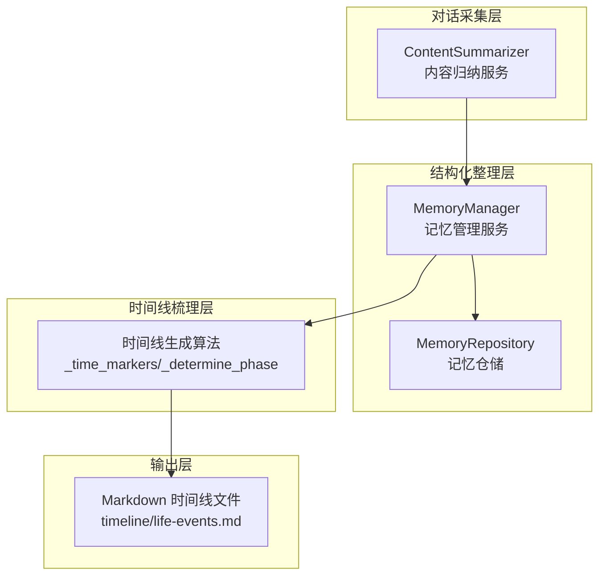
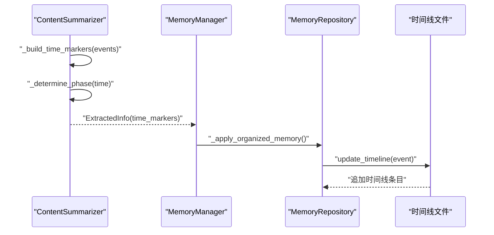
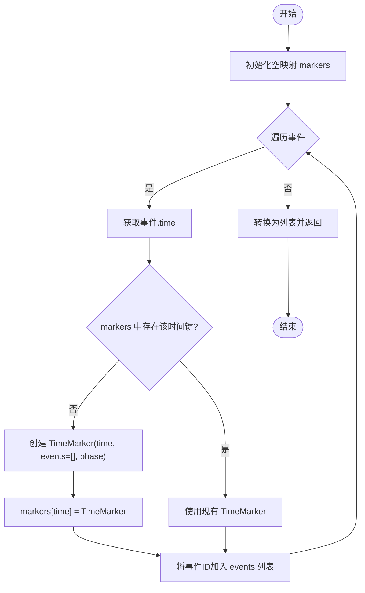
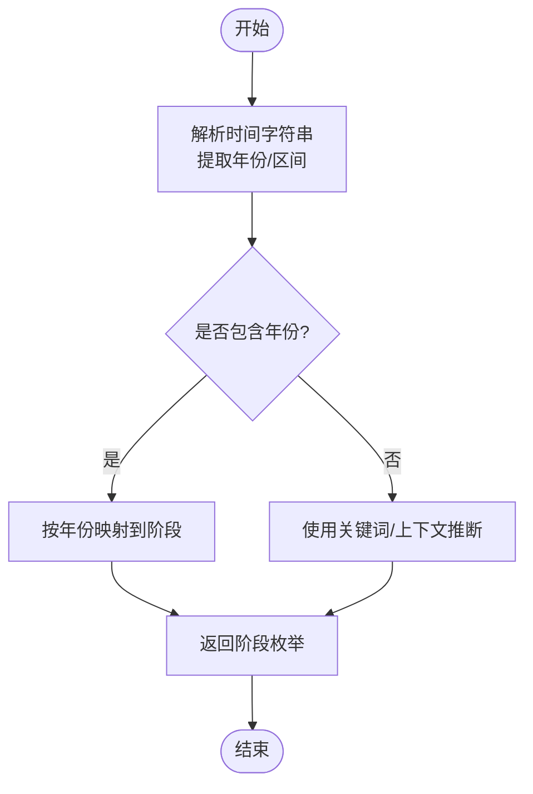
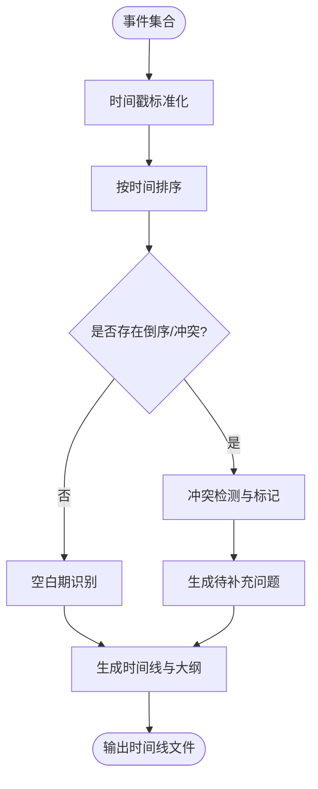
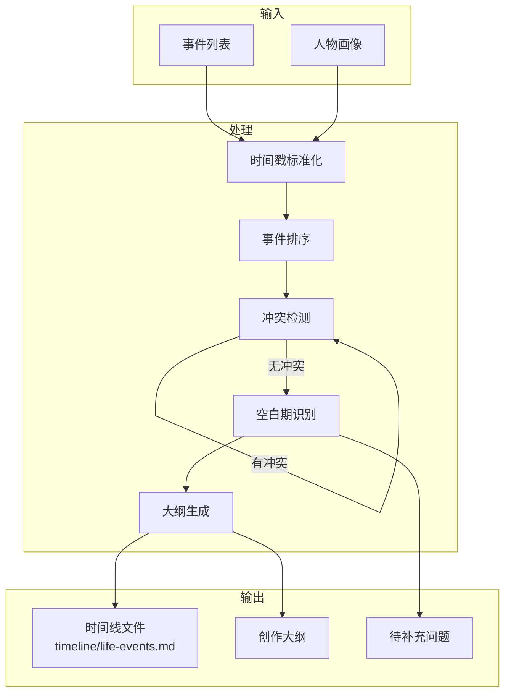
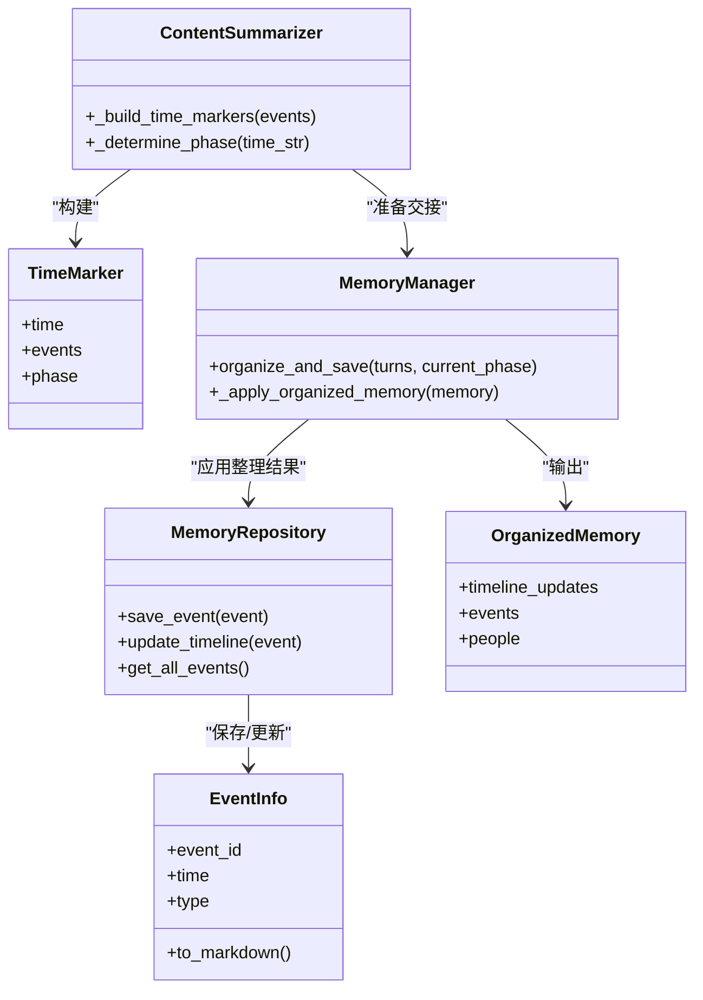

# 时间线生成算法

<cite>
**本文引用的文件**
- [content_summarizer.py](file://src/services/content_summarizer.py)
- [summary_content.py](file://src/models/summary_content.py)
- [memory_repository.py](file://src/storage/memory_repository.py)
- [memory_manager.py](file://src/services/memory_manager.py)
- [phase_type.py](file://src/enums/phase_type.py)
- [organized_memory.py](file://src/models/organized_memory.py)
- [event_info.py](file://src/models/event_info.py)
- [老人自传 Agent 协作架构.md](file://老人自传 Agent 协作架构.md)
- [老人自传写作指南.md](file://老人自传写作指南.md)
- [MemoryOrganizer-Prompt.md](file://Prompts/MemoryOrganizer-Prompt.md)
</cite>

## 目录
1. [简介](#简介)
2. [项目结构](#项目结构)
3. [核心组件](#核心组件)
4. [架构总览](#架构总览)
5. [详细组件分析](#详细组件分析)
6. [依赖分析](#依赖分析)
7. [性能考虑](#性能考虑)
8. [故障排查指南](#故障排查指南)
9. [结论](#结论)
10. [附录](#附录)

## 简介
本技术文档聚焦于“时间线生成算法”，围绕以下目标展开：
- 深入解释 _time_markers 方法的时间标记构建机制，包括时间聚合、事件分组和阶段确定算法
- 详细说明 _determine_phase 方法的阶段识别逻辑，包括年龄阶段判断和时间范围映射
- 阐述时间线排序与叙事连贯性的保证机制，包括事件时间戳处理和顺序验证
- 解释时间线生成在自传创作中的应用场景与输出格式
- 提供时间线生成的性能优化策略与扩展性设计，涵盖大数据量处理与内存管理

## 项目结构
该项目采用分层架构，围绕“对话采集—结构化整理—时间线梳理—撰写”四个阶段协作。时间线生成位于第三阶段，主要由内容归纳服务与记忆仓储共同完成。

图表来源
- [content_summarizer.py:145-162](file://src/services/content_summarizer.py#L145-L162)
- [memory_manager.py:459-504](file://src/services/memory_manager.py#L459-L504)
- [memory_repository.py:248-260](file://src/storage/memory_repository.py#L248-L260)

章节来源
- [content_summarizer.py:17-177](file://src/services/content_summarizer.py#L17-L177)
- [memory_manager.py:375-822](file://src/services/memory_manager.py#L375-L822)
- [memory_repository.py:40-359](file://src/storage/memory_repository.py#L40-L359)

## 核心组件
- 时间标记模型 TimeMarker：封装时间点、相关事件ID集合与阶段标签
- 时间线生成服务 ContentSummarizer：负责构建时间标记、提取主题、准备交接
- 记忆仓储 MemoryRepository：负责事件持久化、时间线文件更新、阶段目录判定
- 阶段枚举 PhaseType：定义人生阶段划分
- 自传写作指南与协作架构：提供时间线生成在自传创作中的应用场景与输出格式

章节来源
- [summary_content.py:8-28](file://src/models/summary_content.py#L8-L28)
- [content_summarizer.py:145-162](file://src/services/content_summarizer.py#L145-L162)
- [memory_repository.py:248-260](file://src/storage/memory_repository.py#L248-L260)
- [phase_type.py:4-10](file://src/enums/phase_type.py#L4-L10)
- [老人自传写作指南.md:44-74](file://老人自传写作指南.md#L44-L74)

## 架构总览
时间线生成贯穿“内容归纳—记忆管理—仓储持久化”的链路，核心流程如下：

图表来源
- [content_summarizer.py:145-162](file://src/services/content_summarizer.py#L145-L162)
- [memory_manager.py:506-541](file://src/services/memory_manager.py#L506-L541)
- [memory_repository.py:248-260](file://src/storage/memory_repository.py#L248-L260)

## 详细组件分析

### 时间标记构建算法（_time_markers）
_time_markers 的职责是将事件列表聚合成时间标记，实现“时间聚合 + 事件分组 + 阶段标注”。其核心步骤如下：
- 输入：事件列表（包含时间字符串、事件ID等）
- 聚合策略：以事件的 time 字段为键，构建时间到 TimeMarker 的映射
- 分组策略：同一时间点的多个事件，合并到该时间点的事件ID列表
- 阶段标注：对每个时间点调用 _determine_phase，为 TimeMarker 增加阶段标签

图表来源
- [content_summarizer.py:145-157](file://src/services/content_summarizer.py#L145-L157)

章节来源
- [content_summarizer.py:145-157](file://src/services/content_summarizer.py#L145-L157)
- [summary_content.py:8-13](file://src/models/summary_content.py#L8-L13)

### 阶段识别逻辑（_determine_phase）
_determine_phase 的当前实现为占位符，返回固定字符串。实际阶段识别应基于时间字符串解析与年龄映射，典型流程如下：
- 输入：时间字符串（如“1950年”、“1960年代”、“约1970年”等）
- 解析策略：提取年份或时间段边界；若为模糊表达，设定置信区间
- 映射策略：根据年份落在不同年龄段区间，映射到 PhaseType 的对应阶段
- 输出：阶段枚举值（如童年、青少年、青年、中年、老年）

图表来源
- [content_summarizer.py:159-162](file://src/services/content_summarizer.py#L159-L162)
- [phase_type.py:4-10](file://src/enums/phase_type.py#L4-L10)

章节来源
- [content_summarizer.py:159-162](file://src/services/content_summarizer.py#L159-L162)
- [phase_type.py:4-10](file://src/enums/phase_type.py#L4-L10)

### 时间线排序与叙事连贯性
- 排序依据：时间戳字符串（或解析后的数值）进行升序排序
- 顺序验证：在生成时间线时，确保相邻事件的时间顺序一致；若出现倒序，提示用户校正或进行二次排序
- 冲突检测：同一时间点的多事件，按来源轮次或事件类型进行二次排序；若仍冲突，标记为待确认
- 空白期识别：在时间轴上识别较长的空白期，生成“待补充问题”清单，引导用户补充缺失事件

图表来源
- [老人自传 Agent 协作架构.md:307-342](file://老人自传 Agent 协作架构.md#L307-L342)
- [memory_manager.py:574-584](file://src/services/memory_manager.py#L574-L584)

章节来源
- [老人自传 Agent 协作架构.md:307-342](file://老人自传 Agent 协作架构.md#L307-L342)
- [memory_manager.py:574-584](file://src/services/memory_manager.py#L574-L584)

### 自传创作中的应用场景与输出格式
- 应用场景：在“时间线梳理层”中，将结构化事件按时间顺序组织，生成完整时间线与创作大纲，辅助撰写阶段的章节草稿生成
- 输出格式：Markdown 时间线文件（timeline/life-events.md），每条时间线条目包含时间、事件标题、类型与指向事件详情的链接

图表来源
- [老人自传 Agent 协作架构.md:307-342](file://老人自传 Agent 协作架构.md#L307-L342)
- [memory_repository.py:248-260](file://src/storage/memory_repository.py#L248-L260)

章节来源
- [老人自传写作指南.md:44-74](file://老人自传写作指南.md#L44-L74)
- [老人自传 Agent 协作架构.md:307-342](file://老人自传 Agent 协作架构.md#L307-L342)
- [memory_repository.py:248-260](file://src/storage/memory_repository.py#L248-L260)

## 依赖分析
- ContentSummarizer 依赖：
  - TimeMarker 模型：用于封装时间标记
  - MemoryManager：在会话结束时调用 prepare_handoff，触发时间线生成
  - MemoryRepository：提供事件查询与时间线更新能力
- MemoryManager 依赖：
  - OrganizedMemory 模型：统一结构化输出
  - MemoryRepository：执行事件与人物的持久化及时间线更新
- MemoryRepository 依赖：
  - EventInfo 模型：事件持久化与时间线条目生成
  - 阶段目录映射：根据时间字符串推断事件所属阶段目录

图表来源
- [content_summarizer.py:145-162](file://src/services/content_summarizer.py#L145-L162)
- [summary_content.py:8-28](file://src/models/summary_content.py#L8-L28)
- [memory_manager.py:506-541](file://src/services/memory_manager.py#L506-L541)
- [memory_repository.py:176-200](file://src/storage/memory_repository.py#L176-L200)
- [organized_memory.py:1037-1047](file://src/models/organized_memory.py#L1037-L1047)

章节来源
- [content_summarizer.py:17-177](file://src/services/content_summarizer.py#L17-L177)
- [memory_manager.py:375-822](file://src/services/memory_manager.py#L375-L822)
- [memory_repository.py:40-359](file://src/storage/memory_repository.py#L40-L359)
- [organized_memory.py:954-1047](file://src/models/organized_memory.py#L954-L1047)

## 性能考虑
- 时间聚合复杂度：O(n)，其中 n 为事件数量；哈希表查找与插入均摊 O(1)
- 阶段识别复杂度：当前实现为 O(1)，建议后续实现基于年份映射的 O(1) 查找
- 排序复杂度：O(m log m)，其中 m 为去重后的时间点数量；若时间戳解析成本高，可考虑并行化
- 内存管理：
  - 使用 LRU 缓存（MemoryRepository 内部缓存）减少重复读取
  - 控制短期记忆容量，避免内存膨胀
  - 事件与人物索引仅保存必要字段，避免冗余序列化
- 大数据量处理：
  - 分批处理事件，避免一次性加载过多数据
  - 使用异步 I/O 写入时间线文件，提高吞吐
  - 对时间戳解析与阶段映射进行缓存，减少重复计算

章节来源
- [memory_repository.py:16-38](file://src/storage/memory_repository.py#L16-L38)
- [memory_repository.py:176-200](file://src/storage/memory_repository.py#L176-L200)
- [memory_manager.py:518-535](file://src/services/memory_manager.py#L518-L535)

## 故障排查指南
- 阶段识别异常
  - 现象：TimeMarker 的 phase 始终为默认值
  - 排查：检查 _determine_phase 的实现是否被替换；确认时间字符串格式是否包含年份
- 时间线文件未更新
  - 现象：事件保存成功但时间线文件未追加
  - 排查：确认 MemoryRepository.update_timeline 是否被调用；检查文件路径与权限
- 排序异常
  - 现象：时间线顺序错乱
  - 排查：检查时间戳标准化逻辑；确认排序键是否正确
- 冲突与空白期
  - 现象：同一时间点事件过多或空白期过长
  - 排查：在时间线梳理层增加冲突检测与空白期识别逻辑，生成待补充问题清单

章节来源
- [content_summarizer.py:159-162](file://src/services/content_summarizer.py#L159-L162)
- [memory_repository.py:248-260](file://src/storage/memory_repository.py#L248-L260)
- [老人自传 Agent 协作架构.md:344-351](file://老人自传 Agent 协作架构.md#L344-L351)

## 结论
时间线生成算法以“时间聚合—事件分组—阶段标注—排序与连贯性保障”为主线，结合记忆管理与仓储持久化，形成从结构化事件到可读时间线的完整闭环。当前实现中，阶段识别仍为占位符，建议尽快接入基于年份映射的稳定实现；同时在排序与冲突检测方面进一步增强，以提升自传创作的叙事质量与用户体验。

## 附录
- 自传创作结构与写法建议参见《老人自传写作指南》
- 时间线梳理流程与冲突检测规则参见《老人自传 Agent 协作架构》
- 时间线输出格式与链接规范参见 MemoryRepository.update_timeline 的实现

章节来源
- [老人自传写作指南.md:44-74](file://老人自传写作指南.md#L44-L74)
- [老人自传 Agent 协作架构.md:307-342](file://老人自传 Agent 协作架构.md#L307-L342)
- [memory_repository.py:248-260](file://src/storage/memory_repository.py#L248-L260)