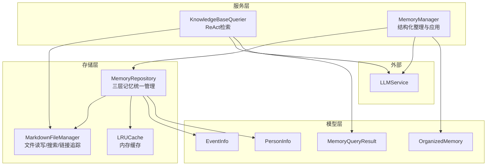
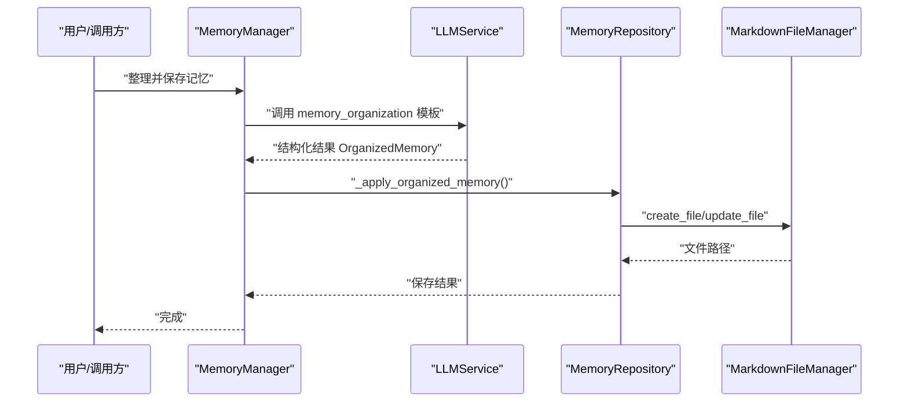
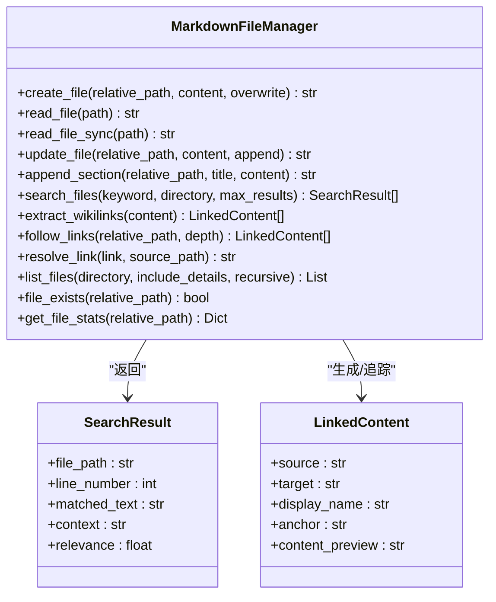
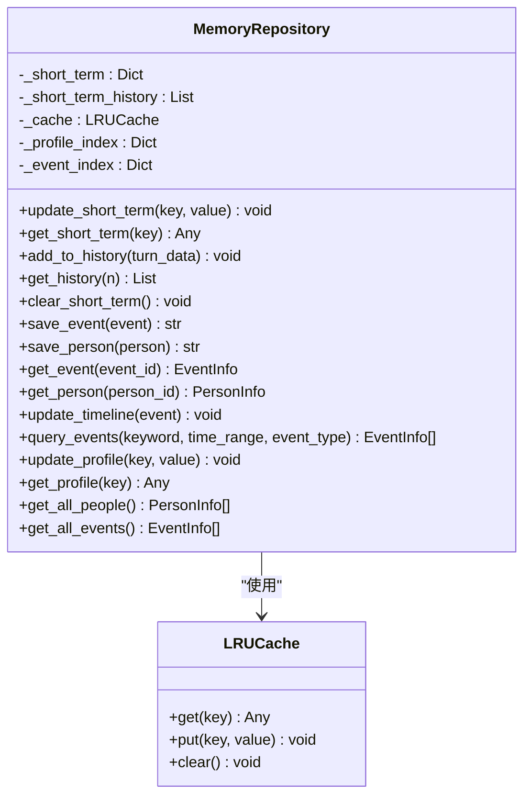
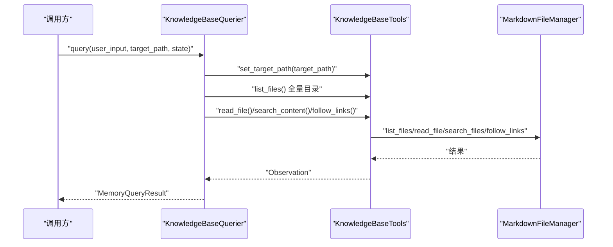
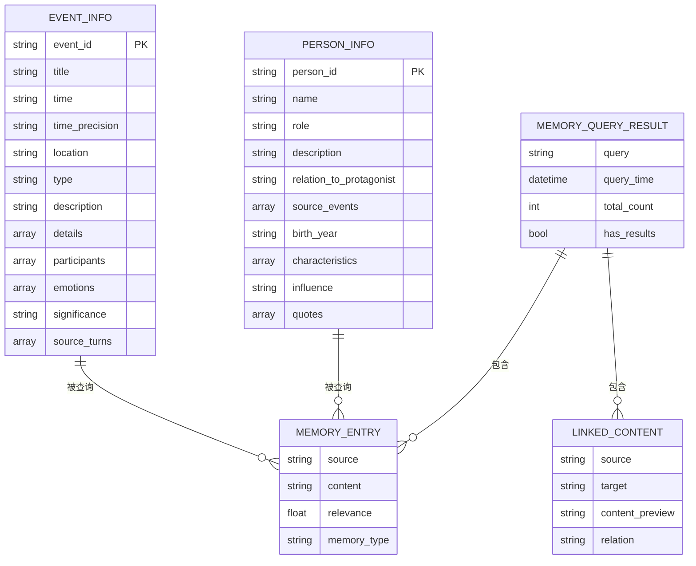
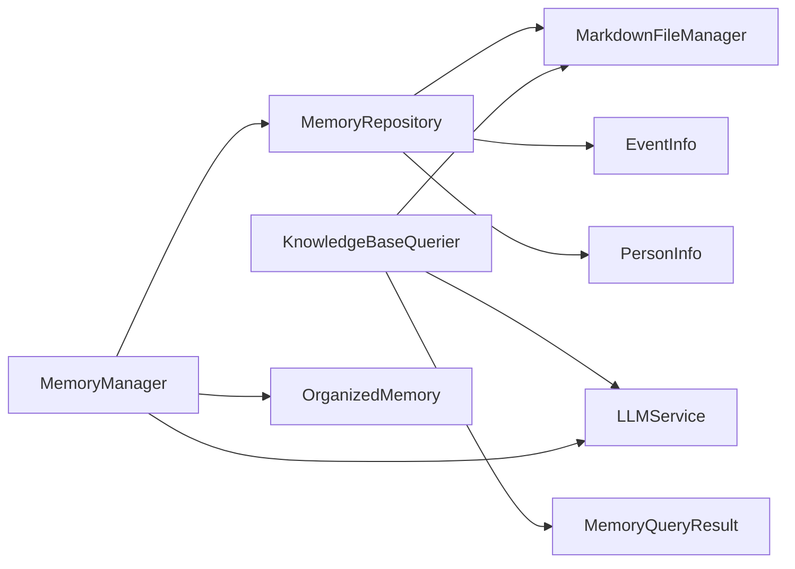

# 存储层设计

<cite>
**本文引用的文件**
- [markdown_file_manager.py](file://src/storage/markdown_file_manager.py)
- [memory_repository.py](file://src/storage/memory_repository.py)
- [knowledge_base_querier.py](file://src/services/knowledge_base_querier.py)
- [memory_manager.py](file://src/services/memory_manager.py)
- [event_info.py](file://src/models/event_info.py)
- [person_info.py](file://src/models/person_info.py)
- [organized_memory.py](file://src/models/organized_memory.py)
- [memory_query_result.py](file://src/models/memory_query_result.py)
- [memory_cache_tool.py](file://src/tools/memory_cache_tool.py)
- [demo_memory_storage.py](file://demo_memory_storage.py)
- [test_markdown_file_manager.py](file://tests/test_markdown_file_manager.py)
- [test_memory_repository.py](file://tests/test_memory_repository.py)
- [README.md](file://README.md)
- [llm_config.py](file://src/config/llm_config.py)
</cite>

## 目录
1. [简介](#简介)
2. [项目结构](#项目结构)
3. [核心组件](#核心组件)
4. [架构总览](#架构总览)
5. [详细组件分析](#详细组件分析)
6. [依赖关系分析](#依赖关系分析)
7. [性能考量](#性能考量)
8. [故障排查指南](#故障排查指南)
9. [结论](#结论)
10. [附录](#附录)

## 简介
本文件面向“存储层设计”，聚焦于基于文件系统的记忆库实现，重点阐述：
- 文件系统存储的设计理念与Markdown选择的原因与优势
- 数据模型设计原则、实体关系、字段约束与数据完整性保障
- 存储索引与查询优化策略（文件索引、元数据管理、快速检索机制）
- 数据迁移与版本管理方案（数据格式升级、兼容性处理与回滚策略）
- 存储性能优化最佳实践（缓存策略、批量操作、并发控制）
- 数据备份、恢复与安全保护的技术措施

## 项目结构
存储层位于 src/storage 目录，围绕 Markdown 文件系统组织三层记忆（短期、长期、画像），并通过 MemoryRepository 统一管理；知识库查询由 KnowledgeBaseQuerier 通过 ReAct 模式驱动，结合 LLM 进行检索与上下文抽取。

图示来源
- [markdown_file_manager.py:31-546](file://src/storage/markdown_file_manager.py#L31-L546)
- [memory_repository.py:40-359](file://src/storage/memory_repository.py#L40-L359)
- [knowledge_base_querier.py:202-540](file://src/services/knowledge_base_querier.py#L202-L540)
- [memory_manager.py:27-470](file://src/services/memory_manager.py#L27-L470)
- [event_info.py:5-69](file://src/models/event_info.py#L5-L69)
- [person_info.py:5-61](file://src/models/person_info.py#L5-L61)
- [organized_memory.py:141-151](file://src/models/organized_memory.py#L141-L151)
- [memory_query_result.py:23-81](file://src/models/memory_query_result.py#L23-L81)

章节来源
- [README.md:334-359](file://README.md#L334-L359)

## 核心组件
- MarkdownFileManager：负责文件创建/读取/更新、全文搜索、Wiki链接提取与追踪、目录列举与统计。
- MemoryRepository：三层记忆统一入口，提供短期记忆（内存）、长期记忆（文件系统）、画像记忆（内存索引）管理，并内置LRU缓存。
- KnowledgeBaseQuerier：基于 ReAct 的检索代理，通过工具链（list_files/read_file/search_content/follow_links）在限定路径内进行探索与抽取。
- MemoryManager：高层封装，协调 LLM 将对话内容结构化为 OrganizedMemory，并应用到存储层。
- 数据模型：EventInfo、PersonInfo、OrganizedMemory、MemoryQueryResult 等，支撑结构化存储与查询。

章节来源
- [markdown_file_manager.py:31-546](file://src/storage/markdown_file_manager.py#L31-L546)
- [memory_repository.py:40-359](file://src/storage/memory_repository.py#L40-L359)
- [knowledge_base_querier.py:202-540](file://src/services/knowledge_base_querier.py#L202-L540)
- [memory_manager.py:27-470](file://src/services/memory_manager.py#L27-L470)
- [event_info.py:5-69](file://src/models/event_info.py#L5-L69)
- [person_info.py:5-61](file://src/models/person_info.py#L5-L61)
- [organized_memory.py:141-151](file://src/models/organized_memory.py#L141-L151)
- [memory_query_result.py:23-81](file://src/models/memory_query_result.py#L23-L81)

## 架构总览
存储层采用“文件系统 + 内存缓存”的混合架构：
- 长期记忆以 Markdown 文件形式持久化，按用户隔离目录，结构清晰、可版本化、便于备份与迁移。
- 短期记忆与画像记忆驻留内存，配合 LRU 缓存降低IO压力。
- 知识库查询通过 ReAct Agent 在限定路径内进行系统性探索，结合链接追踪与全文搜索，形成高质量检索结果。

图示来源
- [memory_manager.py:111-157](file://src/services/memory_manager.py#L111-L157)
- [memory_repository.py:158-193](file://src/storage/memory_repository.py#L158-L193)
- [markdown_file_manager.py:134-170](file://src/storage/markdown_file_manager.py#L134-L170)

## 详细组件分析

### Markdown 文件管理器（MarkdownFileManager）
职责与能力
- 文件操作：创建、读取（异步/同步）、更新、追加章节
- 全文搜索：关键词匹配、上下文截取、相关度评分
- 链接处理：Wiki链接提取、链接解析、递归追踪
- 目录管理：自动创建约定目录结构，维护索引文件
- 工具方法：文件列举、存在性检查、统计信息

设计要点
- 异步IO与同步IO并存，兼顾高并发与简单场景
- 相对/绝对路径兼容，支持跨平台路径分隔符规范化
- 搜索结果包含上下文与相关度，便于上层排序与展示
- 链接追踪支持递归深度控制，避免无限展开

图示来源
- [markdown_file_manager.py:31-546](file://src/storage/markdown_file_manager.py#L31-L546)

章节来源
- [markdown_file_manager.py:31-546](file://src/storage/markdown_file_manager.py#L31-L546)
- [test_markdown_file_manager.py:14-207](file://tests/test_markdown_file_manager.py#L14-L207)

### 记忆仓储（MemoryRepository）
职责与能力
- 短期记忆：内存字典 + 历史队列，支持容量限制与时间戳
- 长期记忆：事件与人物的结构化存储，自动建立索引与缓存
- 画像记忆：短期内存索引，支持关键字段聚合
- 缓存：LRU缓存，按键空间隔离（event: / person:）

设计要点
- 事件与人物的存储路径按领域规则自动推断（如童年/青年/中年/老年、家庭/朋友/同事/其他）
- 事件文件包含 Wiki 链接，指向时间线与人物文件，形成轻量图谱
- 查询事件时先走内存索引，再回退到缓存，最后考虑文件系统扫描（当前实现为内存索引过滤）

图示来源
- [memory_repository.py:40-359](file://src/storage/memory_repository.py#L40-L359)

章节来源
- [memory_repository.py:40-359](file://src/storage/memory_repository.py#L40-L359)
- [test_memory_repository.py:51-325](file://tests/test_memory_repository.py#L51-L325)

### 知识库查询（KnowledgeBaseQuerier）
职责与能力
- ReAct 模式：Thought → Action → Observation 循环，限定在目标路径内探索
- 工具链：list_files、read_file、search_content、follow_links、标记相关文件、探索报告
- 结果解析：优先解析标准 JSON，降级为自然语言提取，最终构建 MemoryQueryResult

设计要点
- 目标路径校验与安全路径拼接，防止目录遍历
- 探索策略强调“一次性全量目录 + 完整阅读 + 相关性优先”
- 探索报告作为兜底结果，便于人工审阅与后续处理

图示来源
- [knowledge_base_querier.py:257-373](file://src/services/knowledge_base_querier.py#L257-L373)
- [knowledge_base_querier.py:54-200](file://src/services/knowledge_base_querier.py#L54-L200)
- [markdown_file_manager.py:285-431](file://src/storage/markdown_file_manager.py#L285-L431)

章节来源
- [knowledge_base_querier.py:202-540](file://src/services/knowledge_base_querier.py#L202-L540)

### 记忆管理（MemoryManager）
职责与能力
- 将对话内容结构化为 OrganizedMemory，应用到存储层
- 并行保存事件与人物，必要时更新时间线
- 更新画像记忆（主人公信息、关系网络等）

设计要点
- 通过 LLM 的 memory_organization 模板进行结构化抽取
- 并行任务减少端到端延迟
- 兼容旧接口，平滑过渡

章节来源
- [memory_manager.py:27-470](file://src/services/memory_manager.py#L27-L470)
- [organized_memory.py:141-151](file://src/models/organized_memory.py#L141-L151)

### 数据模型与完整性
- EventInfo：事件的结构化表示，to_markdown 输出遵循约定格式，包含 Wiki 链接、情感标签、来源等
- PersonInfo：人物画像，to_markdown 输出包含关系、影响、相关事件、语录等
- MemoryQueryResult：查询结果封装，包含条目、链接内容、汇总信息
- OrganizedMemory：结构化整理结果，包含时间线更新、事件、人物、画像更新、存储建议、处理摘要

图示来源
- [event_info.py:5-69](file://src/models/event_info.py#L5-L69)
- [person_info.py:5-61](file://src/models/person_info.py#L5-L61)
- [memory_query_result.py:6-81](file://src/models/memory_query_result.py#L6-L81)

章节来源
- [event_info.py:5-69](file://src/models/event_info.py#L5-L69)
- [person_info.py:5-61](file://src/models/person_info.py#L5-L61)
- [memory_query_result.py:23-81](file://src/models/memory_query_result.py#L23-L81)
- [organized_memory.py:141-151](file://src/models/organized_memory.py#L141-L151)

### 缓存与工具
- MemoryCacheTool：会话级短期缓存，支持关键词检索与追加更新，适合对话上下文短期复用
- LRUCache：MemoryRepository 内部缓存，按键空间隔离，避免热点事件/人物反复IO

章节来源
- [memory_cache_tool.py:8-89](file://src/tools/memory_cache_tool.py#L8-L89)
- [memory_repository.py:16-88](file://src/storage/memory_repository.py#L16-L88)

## 依赖关系分析
- MemoryRepository 依赖 MarkdownFileManager 进行文件系统操作，依赖 KnowledgeBaseQuerier/LangChain 工具链进行检索（间接）
- KnowledgeBaseQuerier 依赖 MarkdownFileManager 与 LLMService
- MemoryManager 依赖 MemoryRepository 与 LLMService
- 数据模型在存储与查询之间起到契约作用，确保结构化一致性

图示来源
- [memory_manager.py:47-61](file://src/services/memory_manager.py#L47-L61)
- [memory_repository.py:54-88](file://src/storage/memory_repository.py#L54-L88)
- [knowledge_base_querier.py:220-236](file://src/services/knowledge_base_querier.py#L220-L236)
- [event_info.py:5-69](file://src/models/event_info.py#L5-L69)
- [person_info.py:5-61](file://src/models/person_info.py#L5-L61)
- [organized_memory.py:141-151](file://src/models/organized_memory.py#L141-L151)
- [memory_query_result.py:23-81](file://src/models/memory_query_result.py#L23-L81)

## 性能考量
- 缓存策略
  - 内存LRU缓存：针对高频事件/人物ID，显著降低文件系统IO
  - 会话级短期缓存：MemoryCacheTool 适配对话上下文，避免重复检索
- 批量与并行
  - MemoryManager 在应用结构化结果时使用 asyncio.gather 并行保存事件与人物
- IO优化
  - 异步文件读写（aiofiles）提升高并发场景吞吐
  - 目录结构扁平化与索引文件减少深层遍历成本
- 检索优化
  - 全文搜索支持上下文截取与相关度评分，便于前端排序与展示
  - 链接追踪深度可控，避免无界递归导致的性能问题

章节来源
- [memory_repository.py:16-88](file://src/storage/memory_repository.py#L16-L88)
- [memory_manager.py:170-187](file://src/services/memory_manager.py#L170-L187)
- [markdown_file_manager.py:285-355](file://src/storage/markdown_file_manager.py#L285-L355)

## 故障排查指南
- 文件读取异常
  - 现象：读取不存在文件抛出 FileNotFoundError
  - 处理：先检查 file_exists，再进行读取；或捕获异常并记录日志
- 路径安全
  - 现象：非法路径导致越权访问
  - 处理：使用 get_full_path 进行路径规范化与安全检查
- 检索无结果
  - 现象：ReAct 未找到直接相关文件
  - 处理：启用探索报告，结合标记相关文件与链接追踪二次挖掘
- 缓存命中率低
  - 现象：频繁重复读取同一事件/人物
  - 处理：检查缓存键命名规范（event:/person:），确认容量与淘汰策略

章节来源
- [markdown_file_manager.py:171-229](file://src/storage/markdown_file_manager.py#L171-L229)
- [knowledge_base_querier.py:32-53](file://src/services/knowledge_base_querier.py#L32-L53)
- [knowledge_base_querier.py:335-358](file://src/services/knowledge_base_querier.py#L335-L358)
- [memory_repository.py:230-246](file://src/storage/memory_repository.py#L230-L246)

## 结论
本存储层以“文件系统 + 内存缓存”为核心，结合结构化数据模型与 ReAct 检索，实现了可扩展、可观测、可演进的记忆库方案。Markdown 文件系统提供了良好的可读性、可迁移性与可备份性；内存缓存与并行处理提升了性能；严格的路径安全与探索策略保障了可靠性。未来可在以下方向持续优化：引入更细粒度的索引（如倒排索引）、支持增量更新与事务性写入、完善版本与回滚机制。

## 附录

### 设计理念与Markdown选择
- 可读性与可维护性：Markdown 人类可读，便于人工审阅与审计
- 可移植性与可备份性：纯文本文件易于版本控制与云存储
- 轻量化与易扩展：无需数据库，部署门槛低，适合个人与小团队场景
- 链接与图谱：Wiki 链接天然支持轻量图谱，便于跨文件关联

章节来源
- [README.md:334-359](file://README.md#L334-L359)
- [event_info.py:34-69](file://src/models/event_info.py#L34-L69)
- [person_info.py:34-61](file://src/models/person_info.py#L34-L61)

### 数据模型设计原则
- 字段约束：使用 Pydantic 校验输入，枚举类型统一取值域
- 关系建模：事件与人物通过 Wiki 链接与索引建立弱耦合关系
- 数据完整性：主键唯一（event_id/person_id），来源与时间戳记录便于溯源

章节来源
- [event_info.py:19-33](file://src/models/event_info.py#L19-L33)
- [person_info.py:19-32](file://src/models/person_info.py#L19-L32)
- [organized_memory.py:58-95](file://src/models/organized_memory.py#L58-L95)

### 存储索引与查询优化
- 文件索引：约定目录结构与索引文件，减少深层遍历
- 元数据管理：事件/人物 to_markdown 输出中嵌入来源、链接、情感标签等元信息
- 快速检索：全文搜索 + 相关度评分 + 上下文截取；链接追踪 + 探索报告兜底

章节来源
- [markdown_file_manager.py:80-131](file://src/storage/markdown_file_manager.py#L80-L131)
- [markdown_file_manager.py:285-355](file://src/storage/markdown_file_manager.py#L285-L355)
- [knowledge_base_querier.py:435-512](file://src/services/knowledge_base_querier.py#L435-L512)

### 数据迁移与版本管理
- 数据格式升级：通过模型版本（Pydantic）与 to_markdown 输出格式演进，逐步迁移存量文件
- 兼容性处理：新增字段默认值与可选字段，旧版本读取兼容
- 回滚策略：基于版本号与时间戳的增量备份，必要时回退到上一版本

章节来源
- [event_info.py:34-69](file://src/models/event_info.py#L34-L69)
- [person_info.py:34-61](file://src/models/person_info.py#L34-L61)

### 备份、恢复与安全
- 备份：定期复制知识库目录，结合版本控制（Git）或云存储
- 恢复：按用户ID隔离，恢复到指定时间点的快照
- 安全：限制目标路径，防止目录穿越；敏感信息不在代码中硬编码，通过环境变量注入

章节来源
- [knowledge_base_querier.py:30-53](file://src/services/knowledge_base_querier.py#L30-L53)
- [llm_config.py:10-120](file://src/config/llm_config.py#L10-L120)

### 快速演示与验证
- 演示脚本：展示存储路径结构、主人公单独存储、事件与时间线更新
- 测试用例：覆盖文件创建/读取/更新/追加、搜索、链接解析与追踪、缓存与历史管理

章节来源
- [demo_memory_storage.py:16-118](file://demo_memory_storage.py#L16-L118)
- [test_markdown_file_manager.py:14-207](file://tests/test_markdown_file_manager.py#L14-L207)
- [test_memory_repository.py:51-325](file://tests/test_memory_repository.py#L51-L325)