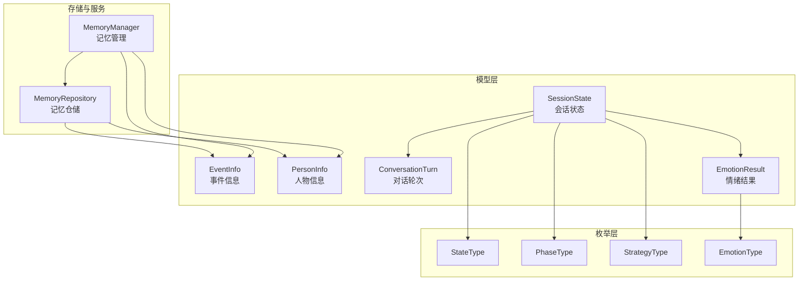
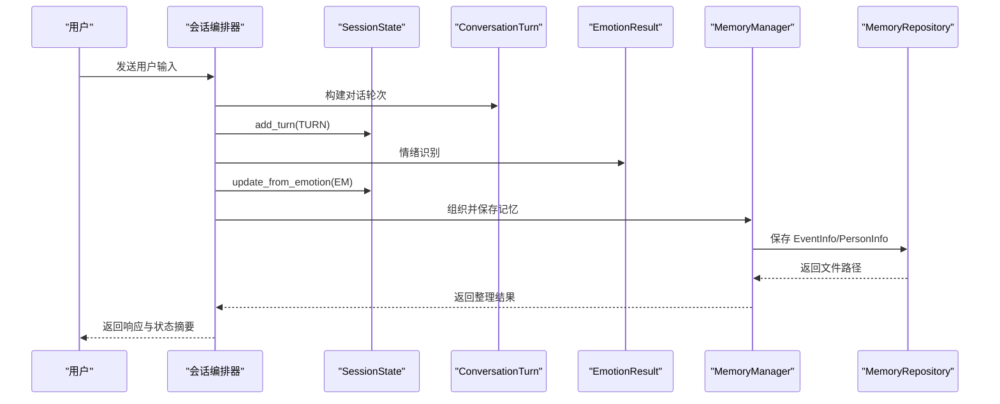
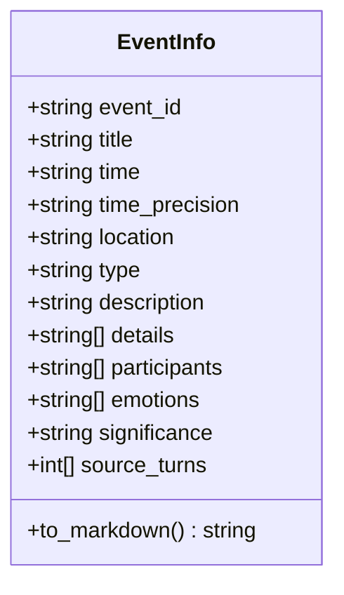
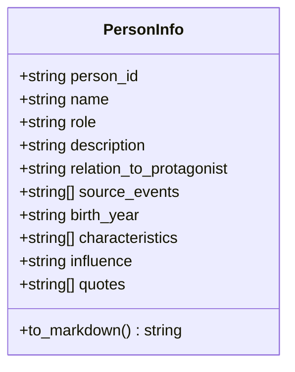
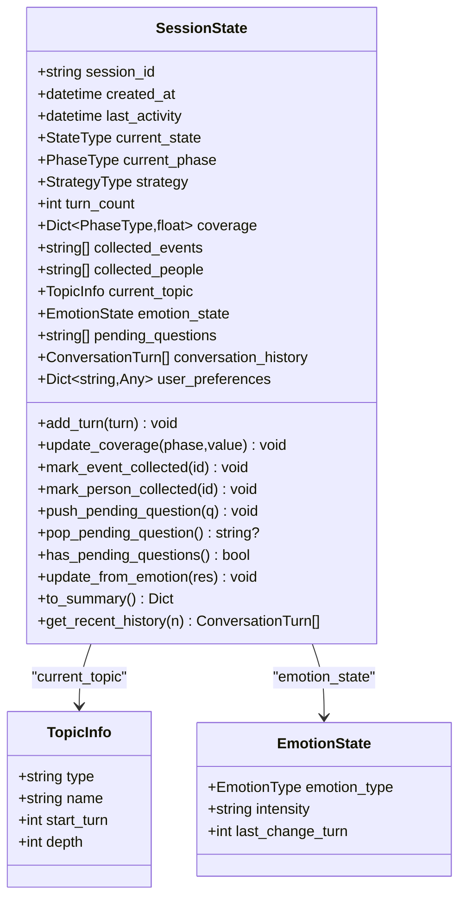
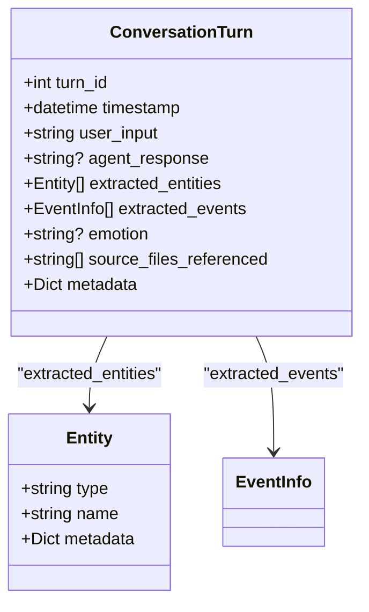
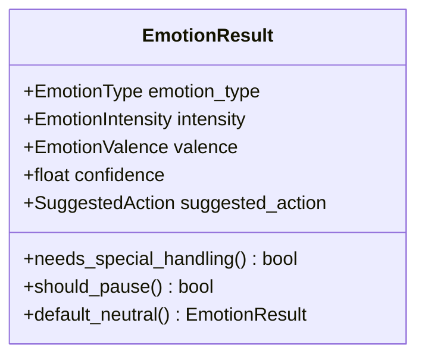
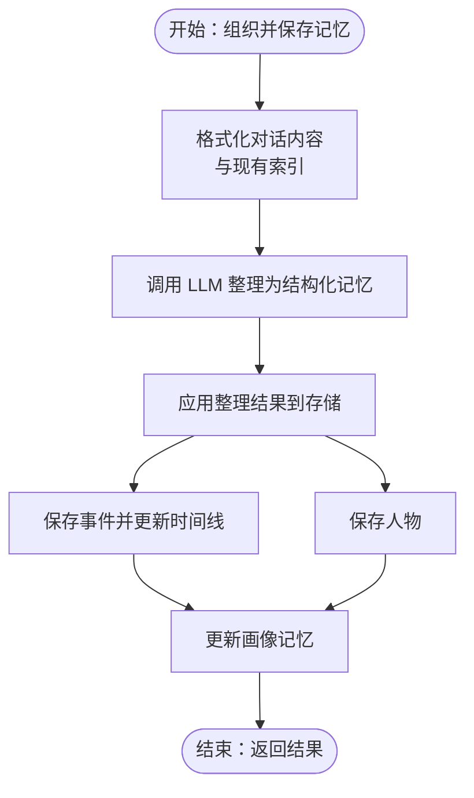
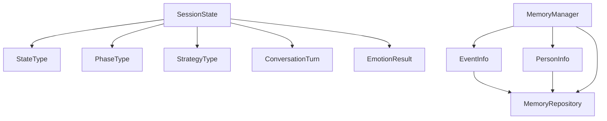

# 数据模型设计

<cite>
**本文引用的文件**
- [event_info.py](file://src/models/event_info.py)
- [person_info.py](file://src/models/person_info.py)
- [session_state.py](file://src/models/session_state.py)
- [conversation_turn.py](file://src/models/conversation_turn.py)
- [emotion_result.py](file://src/models/emotion_result.py)
- [state_type.py](file://src/enums/state_type.py)
- [phase_type.py](file://src/enums/phase_type.py)
- [strategy_type.py](file://src/enums/strategy_type.py)
- [emotion_type.py](file://src/enums/emotion_type.py)
- [memory_repository.py](file://src/storage/memory_repository.py)
- [memory_manager.py](file://src/services/memory_manager.py)
- [test_session_state.py](file://tests/test_session_state.py)
- [verify_models.py](file://verify_models.py)
</cite>

## 目录
1. [简介](#简介)
2. [项目结构](#项目结构)
3. [核心组件](#核心组件)
4. [架构总览](#架构总览)
5. [详细组件分析](#详细组件分析)
6. [依赖分析](#依赖分析)
7. [性能考量](#性能考量)
8. [故障排查指南](#故障排查指南)
9. [结论](#结论)
10. [附录](#附录)

## 简介
本文件面向“数据模型设计”，系统阐述核心数据模型的设计理念、字段定义与约束、实体间关系映射、验证与序列化机制、扩展性与版本管理策略，并给出最佳实践与性能优化建议。重点覆盖以下模型：
- 事件模型：EventInfo
- 人物模型：PersonInfo
- 会话状态模型：SessionState
- 对话轮次模型：ConversationTurn
- 情绪结果模型：EmotionResult
并结合枚举类型（StateType、PhaseType、StrategyType、EmotionType 等）与存储/管理服务（MemoryRepository、MemoryManager）展示端到端的数据流。

## 项目结构
数据模型位于 src/models，枚举类型位于 src/enums，存储与管理服务位于 src/storage 与 src/services。下图展示与本文相关的关键模块及其依赖关系。

图表来源
- [session_state.py:24-139](file://src/models/session_state.py#L24-L139)
- [conversation_turn.py:14-52](file://src/models/conversation_turn.py#L14-L52)
- [emotion_result.py:6-57](file://src/models/emotion_result.py#L6-L57)
- [memory_repository.py:40-359](file://src/storage/memory_repository.py#L40-L359)
- [memory_manager.py:27-470](file://src/services/memory_manager.py#L27-L470)
- [state_type.py:4-12](file://src/enums/state_type.py#L4-L12)
- [phase_type.py:4-10](file://src/enums/phase_type.py#L4-L10)
- [strategy_type.py:4-8](file://src/enums/strategy_type.py#L4-L8)
- [emotion_type.py:4-50](file://src/enums/emotion_type.py#L4-L50)

章节来源
- [session_state.py:24-139](file://src/models/session_state.py#L24-L139)
- [conversation_turn.py:14-52](file://src/models/conversation_turn.py#L14-L52)
- [emotion_result.py:6-57](file://src/models/emotion_result.py#L6-L57)
- [memory_repository.py:40-359](file://src/storage/memory_repository.py#L40-L359)
- [memory_manager.py:27-470](file://src/services/memory_manager.py#L27-L470)
- [state_type.py:4-12](file://src/enums/state_type.py#L4-L12)
- [phase_type.py:4-10](file://src/enums/phase_type.py#L4-L10)
- [strategy_type.py:4-8](file://src/enums/strategy_type.py#L4-L8)
- [emotion_type.py:4-50](file://src/enums/emotion_type.py#L4-L50)

## 核心组件
本节聚焦三大核心数据模型：EventInfo、PersonInfo、SessionState 的字段定义、约束与用途。

- EventInfo（事件信息）
  - 职责：结构化记录单个事件，支持写入记忆库；作为内容摘要与文件管理的输入。
  - 关键字段与约束：
    - event_id、title、time、description 必填；time_precision、location、type 有默认值；details、participants、emotions、source_turns 默认为空列表。
    - type 支持 birth、education、career、marriage、relocation、achievement、challenge、travel、historical、other 等类型。
  - 输出能力：to_markdown() 生成结构化 Markdown 内容，便于写入知识库文件。
  - 章节来源
    - [event_info.py:5-69](file://src/models/event_info.py#L5-L69)

- PersonInfo（人物信息）
  - 职责：结构化记录人物画像，支持写入记忆库；作为内容摘要与文件管理的输入。
  - 关键字段与约束：
    - person_id、name、role 必填；description、relation_to_protagonist 默认空；source_events 默认空列表。
    - role 支持 immediate_family、extended_family、spouse、friend、colleague、mentor、classmate、neighbor 等。
  - 输出能力：to_markdown() 生成结构化 Markdown 内容，便于写入知识库文件。
  - 章节来源
    - [person_info.py:5-61](file://src/models/person_info.py#L5-L61)

- SessionState（会话状态）
  - 职责：贯穿会话生命周期的核心数据对象，记录状态、进度、采集内容、对话历史、用户偏好等。
  - 关键字段与约束：
    - 基本信息：session_id 必填；created_at、last_activity 默认当前时间。
    - 状态：current_state（StateType）、current_phase（PhaseType）、strategy（StrategyType）均有默认值。
    - 进度：turn_count 默认 0；coverage 为各阶段覆盖率字典，默认均为 0.0。
    - 采集内容：collected_events、collected_people 默认空列表。
    - 当前话题：current_topic 可选；情绪状态：emotion_state 默认 EmotionState。
    - 待处理：pending_questions 默认空列表。
    - 对话历史：conversation_history 默认空列表。
    - 用户偏好：user_preferences 默认空字典。
  - 行为方法：
    - add_turn(turn)、update_coverage(phase, value)、mark_event_collected(id)、mark_person_collected(id)、push_pending_question(q)、pop_pending_question()、has_pending_questions()、update_from_emotion(emotion_result)、to_summary()、get_recent_history(n)。
  - 章节来源
    - [session_state.py:24-139](file://src/models/session_state.py#L24-L139)

章节来源
- [event_info.py:5-69](file://src/models/event_info.py#L5-L69)
- [person_info.py:5-61](file://src/models/person_info.py#L5-L61)
- [session_state.py:24-139](file://src/models/session_state.py#L24-L139)

## 架构总览
下图展示数据模型在系统中的位置与交互：会话状态承载对话进度与覆盖率，对话轮次记录每轮用户输入与提取信息，情绪结果驱动状态调整，事件与人物模型作为知识库的结构化输出。

图表来源
- [session_state.py:87-139](file://src/models/session_state.py#L87-L139)
- [conversation_turn.py:14-52](file://src/models/conversation_turn.py#L14-L52)
- [emotion_result.py:6-57](file://src/models/emotion_result.py#L6-L57)
- [memory_manager.py:111-157](file://src/services/memory_manager.py#L111-L157)
- [memory_repository.py:176-227](file://src/storage/memory_repository.py#L176-L227)

章节来源
- [session_state.py:87-139](file://src/models/session_state.py#L87-L139)
- [conversation_turn.py:14-52](file://src/models/conversation_turn.py#L14-L52)
- [emotion_result.py:6-57](file://src/models/emotion_result.py#L6-L57)
- [memory_manager.py:111-157](file://src/services/memory_manager.py#L111-L157)
- [memory_repository.py:176-227](file://src/storage/memory_repository.py#L176-L227)

## 详细组件分析

### EventInfo（事件信息）
- 设计要点
  - 使用 Pydantic 字段与默认值确保数据完整性与可序列化。
  - to_markdown() 将结构化字段映射为知识库 Markdown 模板，便于统一渲染。
  - 与会话状态的 source_turns 关联，实现“事件来源可追溯”。
- 关系映射
  - 与 PersonInfo 的 participants 建立多对多关系（通过 ID 列表）。
  - 与 Timeline（时间线）建立引用关系（Markdown 链接）。
- 章节来源
  - [event_info.py:5-69](file://src/models/event_info.py#L5-L69)

图表来源
- [event_info.py:5-69](file://src/models/event_info.py#L5-L69)

### PersonInfo（人物信息）
- 设计要点
  - 角色 role 与 relation_to_protagonist 字段明确人物定位。
  - to_markdown() 生成人物档案，便于知识库检索与展示。
- 关系映射
  - 与 EventInfo 的 source_events 建立多对多关系（通过 ID 列表）。
- 章节来源
  - [person_info.py:5-61](file://src/models/person_info.py#L5-L61)

图表来源
- [person_info.py:5-61](file://src/models/person_info.py#L5-L61)

### SessionState（会话状态）
- 设计要点
  - 使用枚举类型约束状态、阶段与策略，保证取值合法。
  - 提供 add_turn、update_coverage、mark_*、pending_* 等方法，封装状态变更。
  - to_summary() 与 get_recent_history() 便于监控与调试。
- 关系映射
  - 与 ConversationTurn 构成“轮次历史”关系。
  - 与 EmotionResult 构成“情绪状态”关系。
  - 与 EventInfo、PersonInfo 构成“采集内容”关系（通过 ID 列表）。
- 章节来源
  - [session_state.py:24-139](file://src/models/session_state.py#L24-L139)

图表来源
- [session_state.py:9-139](file://src/models/session_state.py#L9-L139)

### ConversationTurn（对话轮次）
- 设计要点
  - 记录用户输入、Agent 回复、提取实体与事件、情绪、来源文件与元数据。
  - 作为 SessionState.conversation_history 的元素，支撑状态追踪与回放。
- 章节来源
  - [conversation_turn.py:14-52](file://src/models/conversation_turn.py#L14-L52)

图表来源
- [conversation_turn.py:7-52](file://src/models/conversation_turn.py#L7-L52)

### EmotionResult（情绪结果）
- 设计要点
  - 包含情绪类型、强度、极性、置信度与建议动作。
  - 提供 needs_special_handling() 与 should_pause() 等便捷判断。
- 章节来源
  - [emotion_result.py:6-57](file://src/models/emotion_result.py#L6-L57)

图表来源
- [emotion_result.py:6-57](file://src/models/emotion_result.py#L6-L57)

### 数据验证与序列化机制
- Pydantic 验证
  - 所有模型使用 Field(...) 与默认值/工厂函数确保字段合法性与一致性。
  - 枚举类型约束取值范围，避免非法状态。
- 数据类型转换与默认值
  - datetime 默认工厂函数确保时间字段可用。
  - 字典/列表使用 default_factory 避免可变默认陷阱。
- 序列化
  - 支持 model_dump_json()/model_validate_json() 进行持久化与反序列化。
  - SessionState.Config(use_enum_values=True) 使枚举以字符串值序列化，便于跨语言消费。
- 章节来源
  - [session_state.py:84-86](file://src/models/session_state.py#L84-L86)
  - [verify_models.py:129-142](file://verify_models.py#L129-L142)

### 数据模型之间的关系映射
- 事件与人物
  - EventInfo.participants 与 PersonInfo.source_events 通过 ID 列表建立双向关联，便于“人物参与了哪些事件”和“事件涉及了哪些人物”的双向检索。
- 会话状态与对话轮次
  - SessionState.conversation_history 保存多轮对话；SessionState.turn_count 与 last_activity 记录进度与时效。
- 会话状态与情绪
  - SessionState.update_from_emotion() 将 EmotionResult 同步至 emotion_state，记录情绪类型、强度与变化轮次。
- 章节来源
  - [session_state.py:87-124](file://src/models/session_state.py#L87-L124)
  - [conversation_turn.py:38-49](file://src/models/conversation_turn.py#L38-L49)

### 存储与管理中的应用
- MemoryRepository
  - 保存 EventInfo/PersonInfo 为 Markdown 文件，更新索引与 LRU 缓存；提供查询与时间线更新能力。
- MemoryManager
  - 调用 LLM 将对话整理为结构化记忆，批量保存并更新画像记忆；提供查询与汇总应用接口。
- 章节来源
  - [memory_repository.py:176-261](file://src/storage/memory_repository.py#L176-L261)
  - [memory_manager.py:111-193](file://src/services/memory_manager.py#L111-L193)

图表来源
- [memory_manager.py:111-157](file://src/services/memory_manager.py#L111-L157)
- [memory_manager.py:158-193](file://src/services/memory_manager.py#L158-L193)
- [memory_repository.py:176-261](file://src/storage/memory_repository.py#L176-L261)

## 依赖分析
- 组件耦合
  - SessionState 依赖枚举类型与 ConversationTurn、EmotionResult；EventInfo/PersonInfo 作为存储载体被 MemoryRepository/Manager 使用。
- 外部依赖
  - Pydantic v2 提供数据验证与序列化；文件系统与 LLM 服务由 MemoryRepository/Manager 使用。
- 章节来源
  - [session_state.py:1-7](file://src/models/session_state.py#L1-L7)
  - [memory_repository.py:1-11](file://src/storage/memory_repository.py#L1-L11)
  - [memory_manager.py:1-14](file://src/services/memory_manager.py#L1-L14)

图表来源
- [session_state.py:1-7](file://src/models/session_state.py#L1-L7)
- [memory_repository.py:1-11](file://src/storage/memory_repository.py#L1-L11)
- [memory_manager.py:1-14](file://src/services/memory_manager.py#L1-L14)

## 性能考量
- 序列化与反序列化
  - 使用 model_dump_json()/model_validate_json() 进行持久化，注意在高频场景下避免重复序列化。
- 缓存策略
  - MemoryRepository 内置 LRU 缓存与索引，减少重复读取与解析成本。
- 并发与异步
  - MemoryManager 使用 asyncio.gather 并行保存事件与人物，缩短整体耗时。
- 章节来源
  - [memory_repository.py:16-38](file://src/storage/memory_repository.py#L16-L38)
  - [memory_manager.py:170-187](file://src/services/memory_manager.py#L170-L187)

## 故障排查指南
- 常见问题
  - 字段缺失：确保必填字段（如 EventInfo 的 title、time、description）与 PersonInfo 的 name、role 填充。
  - 枚举取值非法：检查 StateType、PhaseType、StrategyType、EmotionType 是否使用合法枚举值。
  - 会话状态异常：使用 SessionState.to_summary() 与 get_recent_history() 快速定位问题。
- 单元测试与验证脚本
  - test_session_state.py 覆盖创建、添加轮次、覆盖率更新、采集标记、待追问问题、摘要与历史获取、情绪更新等场景。
  - verify_models.py 验证导入、实例化与 JSON 序列化/反序列化。
- 章节来源
  - [test_session_state.py:7-143](file://tests/test_session_state.py#L7-L143)
  - [verify_models.py:48-142](file://verify_models.py#L48-L142)

## 结论
本数据模型体系以 Pydantic 为基础，结合枚举类型与工厂方法，实现了强类型、可序列化、可扩展的数据结构。通过 SessionState 统筹会话生命周期，借助 ConversationTurn 与 EmotionResult 实现状态驱动，最终将 EventInfo/PersonInfo 以结构化方式沉淀为知识库资产。配合 MemoryRepository/Manager 的缓存与并行写入策略，满足高并发与高可靠性的需求。

## 附录
- 最佳实践
  - 数据完整性：使用 Pydantic 字段校验与默认值，避免 None 滥用；必要时增加自定义验证器。
  - 错误处理：在服务层统一捕获异常并返回结构化结果，避免在模型层暴露 I/O 细节。
  - 性能优化：利用 LRU 缓存与并行写入；对大对象采用延迟加载与分页查询。
  - 扩展性设计：新增字段尽量使用可选字段与默认值；对外序列化保持向后兼容；版本升级时通过别名或迁移脚本处理字段变更。
- 章节来源
  - [session_state.py:84-86](file://src/models/session_state.py#L84-L86)
  - [memory_repository.py:16-38](file://src/storage/memory_repository.py#L16-L38)
  - [memory_manager.py:170-187](file://src/services/memory_manager.py#L170-L187)