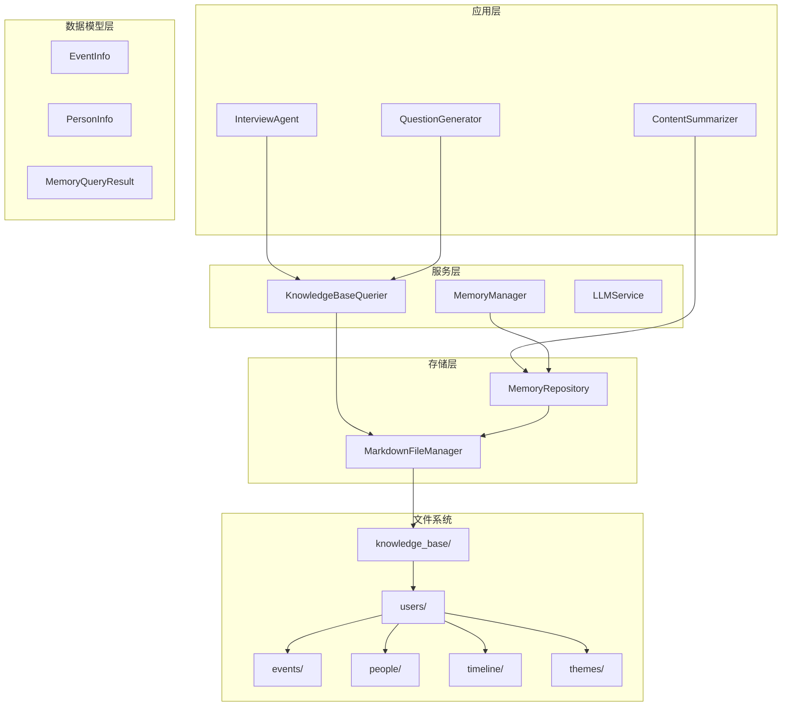
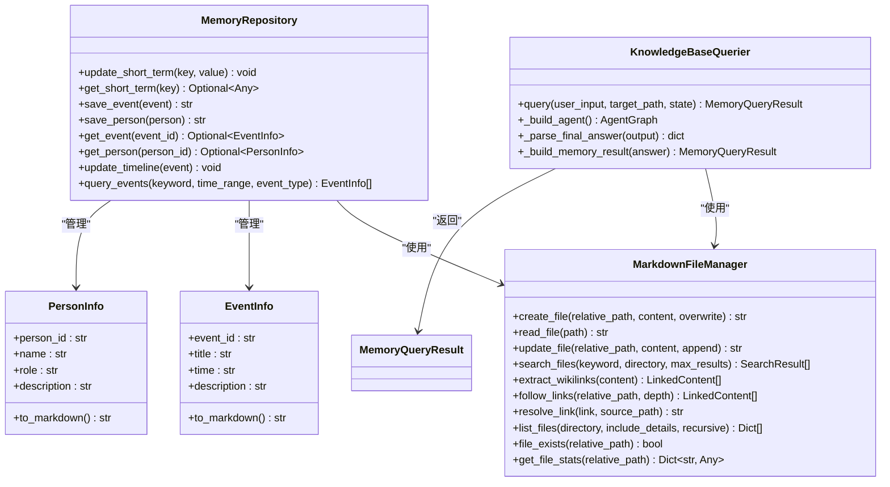
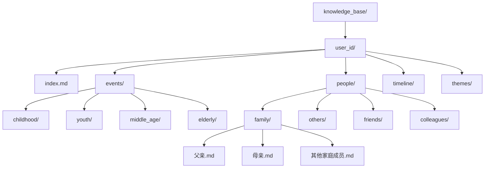
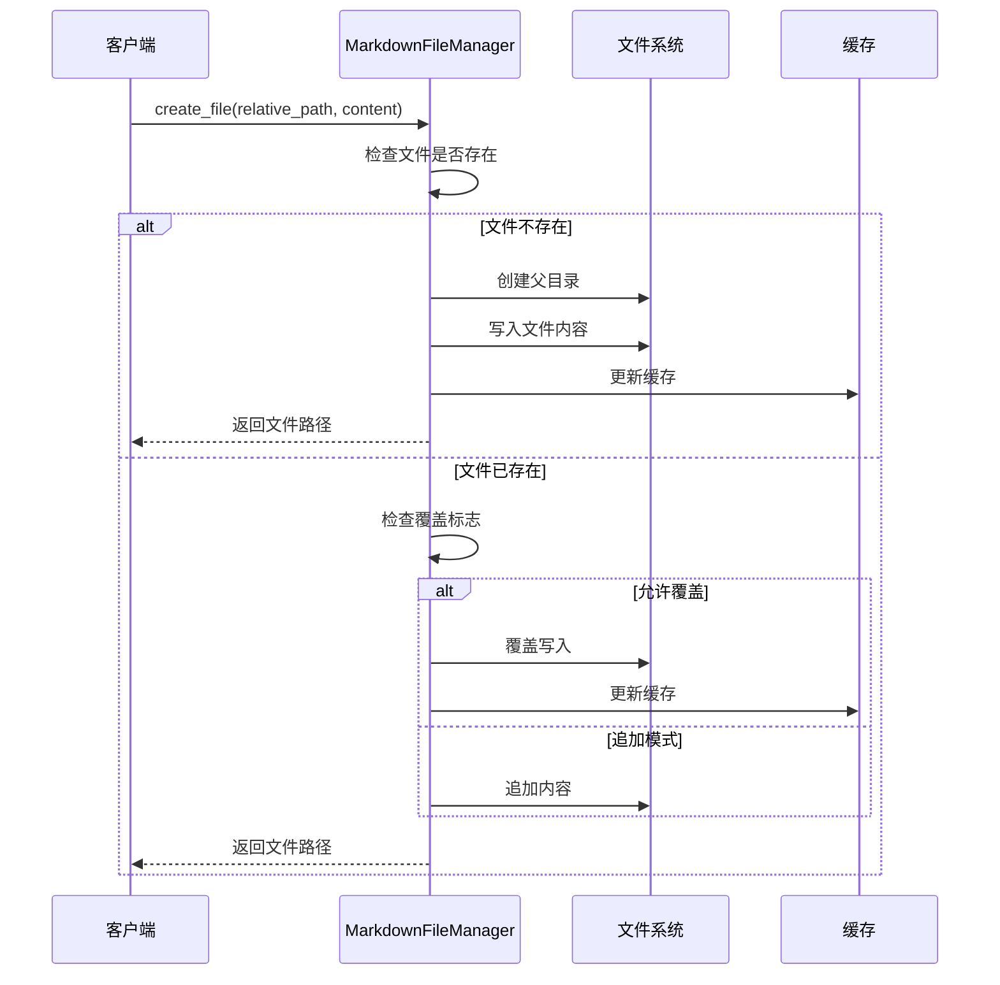
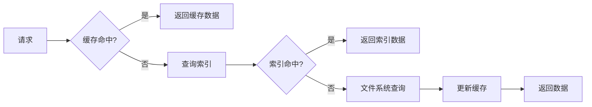
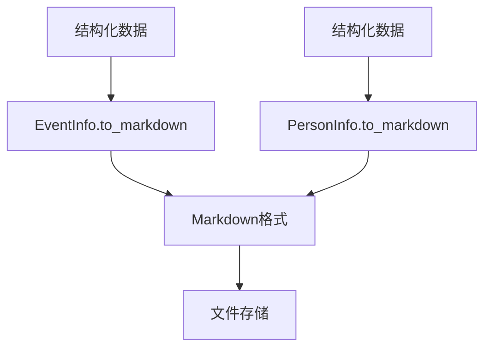
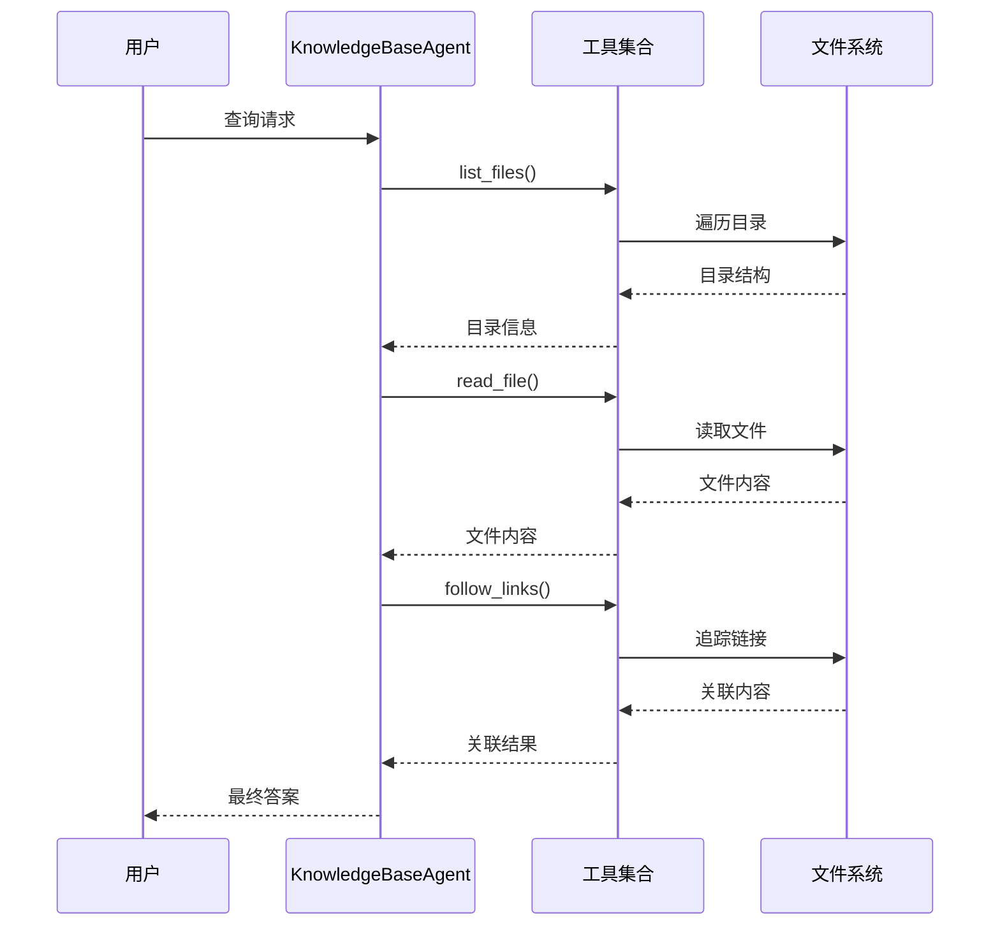
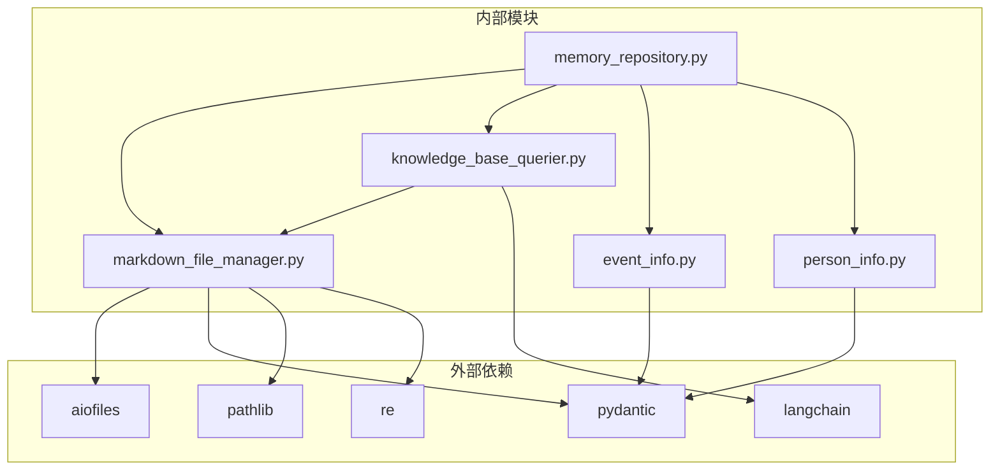
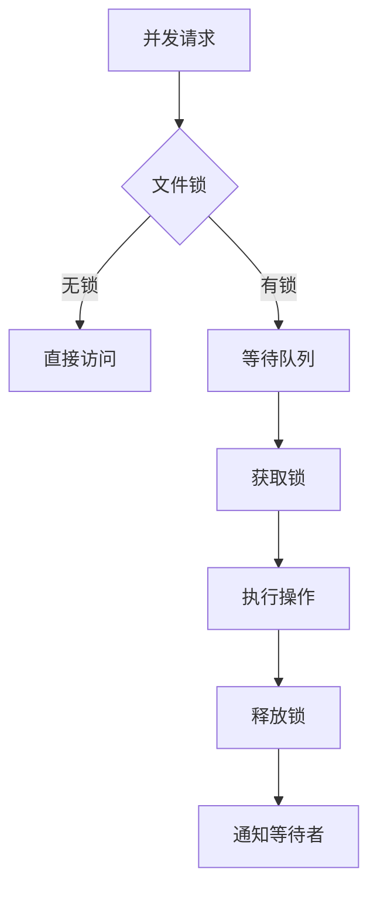

# 文件系统存储

<cite>
**本文档引用的文件**
- [markdown_file_manager.py](file://src/storage/markdown_file_manager.py)
- [memory_repository.py](file://src/storage/memory_repository.py)
- [knowledge_base_querier.py](file://src/services/knowledge_base_querier.py)
- [event_info.py](file://src/models/event_info.py)
- [person_info.py](file://src/models/person_info.py)
- [memory_query_result.py](file://src/models/memory_query_result.py)
- [session_state.py](file://src/models/session_state.py)
- [phase_type.py](file://src/enums/phase_type.py)
- [index.md](file://knowledge_base/index.md)
- [test_user002_index.md](file://knowledge_base/test_user002/index.md)
- [test_markdown_file_manager.py](file://tests/test_markdown_file_manager.py)
- [demo_memory_storage.py](file://demo_memory_storage.py)
- [README.md](file://README.md)
</cite>

## 目录
1. [简介](#简介)
2. [项目结构](#项目结构)
3. [核心组件](#核心组件)
4. [架构概览](#架构概览)
5. [详细组件分析](#详细组件分析)
6. [依赖关系分析](#依赖关系分析)
7. [性能考虑](#性能考虑)
8. [故障排除指南](#故障排除指南)
9. [结论](#结论)

## 简介

本文档深入分析了基于Markdown文件系统的存储架构，重点解释了文件管理器的设计原理、知识库目录结构、文件命名规范以及性能优化措施。该系统采用分层存储架构，通过Markdown文件管理器统一管理事件、人物、主题和时间线等不同类型的记忆数据，支持异步文件操作、全文搜索、Wiki链接追踪等功能。

## 项目结构

系统采用模块化设计，主要分为以下几个层次：



**图表来源**
- [README.md:334-358](file://README.md#L334-L358)
- [markdown_file_manager.py:31-45](file://src/storage/markdown_file_manager.py#L31-L45)

**章节来源**
- [README.md:92-200](file://README.md#L92-L200)
- [README.md:334-358](file://README.md#L334-L358)

## 核心组件

### Markdown文件管理器

Markdown文件管理器是整个存储系统的核心组件，负责：

- **文件操作**：创建、读取、更新、删除Markdown文件
- **目录管理**：自动创建和维护知识库目录结构
- **全文搜索**：支持关键词搜索和上下文提取
- **链接处理**：解析Wiki链接和建立内容关联
- **异步I/O**：使用aiofiles实现非阻塞文件操作

### 记忆仓储

记忆仓储作为中间层，提供：

- **三层记忆管理**：短期记忆、长期记忆、画像记忆
- **缓存机制**：LRU缓存提高访问性能
- **索引管理**：维护事件和人物的内存索引
- **数据转换**：将结构化数据转换为Markdown格式

### 知识库查询器

基于LangChain的ReAct模式实现：

- **智能探索**：通过工具链自动探索知识库结构
- **路径限制**：确保查询在指定范围内进行
- **结果解析**：支持JSON和自然语言两种输出格式
- **链接追踪**：自动发现相关内容的关联关系

**章节来源**
- [markdown_file_manager.py:31-131](file://src/storage/markdown_file_manager.py#L31-L131)
- [memory_repository.py:40-88](file://src/storage/memory_repository.py#L40-L88)
- [knowledge_base_querier.py:202-236](file://src/services/knowledge_base_querier.py#L202-L236)

## 架构概览

系统采用分层架构设计，每层职责明确，耦合度低：



**图表来源**
- [markdown_file_manager.py:31-546](file://src/storage/markdown_file_manager.py#L31-L546)
- [memory_repository.py:40-359](file://src/storage/memory_repository.py#L40-L359)
- [knowledge_base_querier.py:202-540](file://src/services/knowledge_base_querier.py#L202-L540)

## 详细组件分析

### 文件管理系统

#### 目录结构设计

系统采用标准化的目录结构，确保数据组织的一致性和可维护性：



**图表来源**
- [README.md:334-358](file://README.md#L334-L358)
- [index.md:1-22](file://knowledge_base/index.md#L1-L22)

#### 文件命名规范

系统实现了严格的文件命名规范：

1. **事件文件命名**：使用事件标题的拼音或英文字符，过滤特殊字符
2. **人物文件命名**：使用人物姓名，支持中文和英文混合
3. **目录命名**：使用标准化的英文目录名（childhood、youth等）

#### 文件操作流程



**图表来源**
- [markdown_file_manager.py:134-169](file://src/storage/markdown_file_manager.py#L134-L169)

**章节来源**
- [markdown_file_manager.py:80-131](file://src/storage/markdown_file_manager.py#L80-L131)
- [markdown_file_manager.py:134-262](file://src/storage/markdown_file_manager.py#L134-L262)

### 记忆仓储管理

#### 缓存策略

系统实现了多级缓存机制：



**图表来源**
- [memory_repository.py:16-38](file://src/storage/memory_repository.py#L16-L38)

#### 数据转换机制

系统通过数据模型自动转换为Markdown格式：



**图表来源**
- [event_info.py:34-69](file://src/models/event_info.py#L34-L69)
- [person_info.py:34-61](file://src/models/person_info.py#L34-L61)

**章节来源**
- [memory_repository.py:16-88](file://src/storage/memory_repository.py#L16-L88)
- [memory_repository.py:176-227](file://src/storage/memory_repository.py#L176-L227)

### 知识库查询系统

#### ReAct模式实现

查询系统采用ReAct（Reasoning and Acting）模式：



**图表来源**
- [knowledge_base_querier.py:257-373](file://src/services/knowledge_base_querier.py#L257-L373)

**章节来源**
- [knowledge_base_querier.py:17-196](file://src/services/knowledge_base_querier.py#L17-L196)
- [knowledge_base_querier.py:202-540](file://src/services/knowledge_base_querier.py#L202-L540)

## 依赖关系分析

系统采用清晰的依赖关系设计：



**图表来源**
- [markdown_file_manager.py:1-10](file://src/storage/markdown_file_manager.py#L1-L10)
- [memory_repository.py:1-12](file://src/storage/memory_repository.py#L1-L12)
- [knowledge_base_querier.py:1-15](file://src/services/knowledge_base_querier.py#L1-L15)

**章节来源**
- [markdown_file_manager.py:1-10](file://src/storage/markdown_file_manager.py#L1-L10)
- [memory_repository.py:1-12](file://src/storage/memory_repository.py#L1-L12)

## 性能考虑

### 异步I/O优化

系统采用异步文件操作减少阻塞：

- **异步读写**：使用aiofiles实现非阻塞文件操作
- **批量处理**：支持批量文件操作减少系统调用
- **连接池**：复用文件句柄减少资源消耗

### 缓存策略

多级缓存机制提升访问性能：

- **短期记忆**：内存缓存最近使用的数据
- **LRU缓存**：淘汰最少使用的数据项
- **索引缓存**：维护内存索引避免重复解析

### 并发控制



**图表来源**
- [markdown_file_manager.py:165-167](file://src/storage/markdown_file_manager.py#L165-L167)

### 错误处理机制

系统实现了完善的错误处理：

- **文件不存在**：抛出FileNotFoundError异常
- **权限不足**：捕获PermissionError并记录日志
- **磁盘空间不足**：检测磁盘空间并优雅降级
- **网络异常**：分布式存储场景下的网络错误处理

**章节来源**
- [markdown_file_manager.py:188-189](file://src/storage/markdown_file_manager.py#L188-L189)
- [memory_repository.py:159-161](file://src/storage/memory_repository.py#L159-L161)

## 故障排除指南

### 常见问题诊断

#### 文件操作失败

**症状**：文件创建或读取失败
**原因分析**：
- 权限不足
- 磁盘空间不足
- 路径不存在
- 文件被其他进程占用

**解决步骤**：
1. 检查文件权限
2. 验证磁盘空间
3. 确认路径有效性
4. 关闭占用文件的进程

#### 搜索结果不准确

**症状**：搜索关键词无法匹配预期内容
**排查方法**：
1. 检查关键词大小写
2. 验证文件编码格式
3. 确认搜索范围设置
4. 检查文件内容完整性

#### 链接解析错误

**症状**：Wiki链接无法正确解析
**解决方案**：
1. 验证链接格式
2. 检查相对路径解析
3. 确认目标文件存在
4. 修复链接锚点

### 性能优化建议

#### 存储空间监控

```python
def monitor_disk_space(path):
    """监控磁盘空间使用情况"""
    import shutil
    total, used, free = shutil.disk_usage(path)
    usage_percent = (used / total) * 100
    
    if usage_percent > 90:
        logger.warning(f"磁盘空间不足: {usage_percent:.1f}%")
    elif usage_percent > 80:
        logger.warning(f"磁盘空间告警: {usage_percent:.1f}%")
    
    return {
        'total': total,
        'used': used,
        'free': free,
        'usage_percent': usage_percent
    }
```

#### 备份策略

**定期备份**：
- 每日增量备份
- 每周全量备份
- 月度异地备份

**备份验证**：
- 定期验证备份完整性
- 测试备份恢复流程
- 监控备份成功率

#### 维护操作

**文件系统维护**：
- 定期清理临时文件
- 优化目录结构
- 压缩大文件
- 清理重复数据

**性能调优**：
- 调整缓存大小
- 优化索引策略
- 监控I/O性能
- 调整并发参数

**章节来源**
- [test_markdown_file_manager.py:41-44](file://tests/test_markdown_file_manager.py#L41-L44)
- [test_markdown_file_manager.py:198-207](file://tests/test_markdown_file_manager.py#L198-L207)

## 结论

该文件系统存储架构通过模块化设计实现了高内聚、低耦合的系统结构。Markdown文件管理器提供了完整的文件操作能力，记忆仓储实现了多层缓存和索引管理，知识库查询系统通过ReAct模式实现了智能化的内容探索。

系统的主要优势包括：
- **可扩展性**：模块化设计便于功能扩展
- **可靠性**：完善的错误处理和备份机制
- **性能**：异步I/O和多级缓存优化
- **易用性**：标准化的目录结构和文件命名规范

未来可以进一步优化的方向包括分布式存储支持、更智能的缓存策略、以及更完善的监控和告警机制。