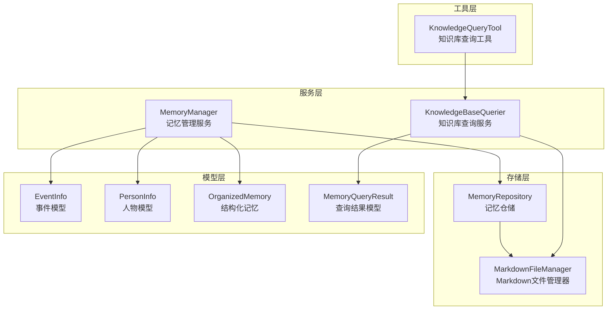
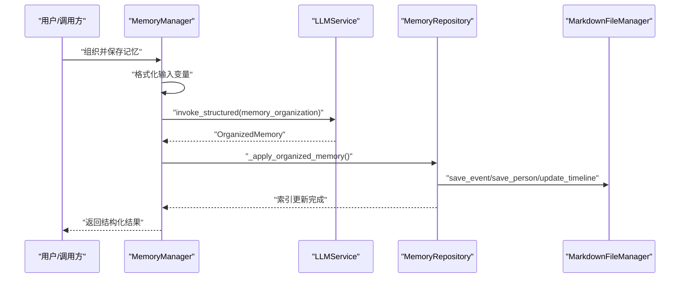
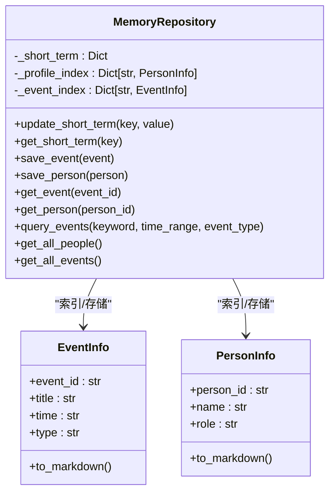
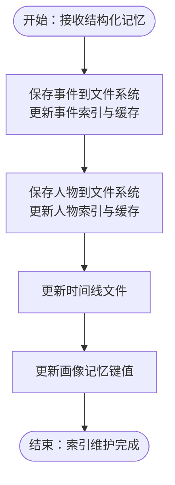
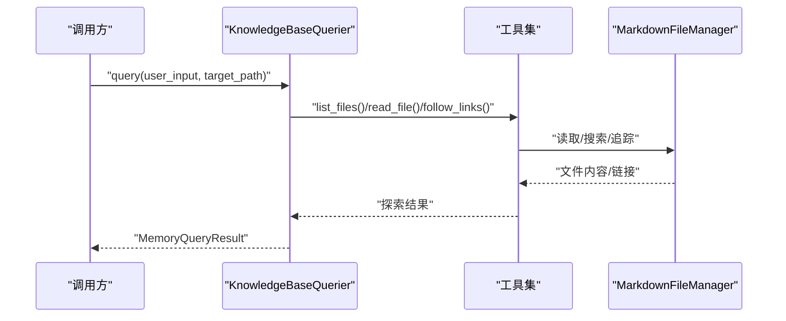
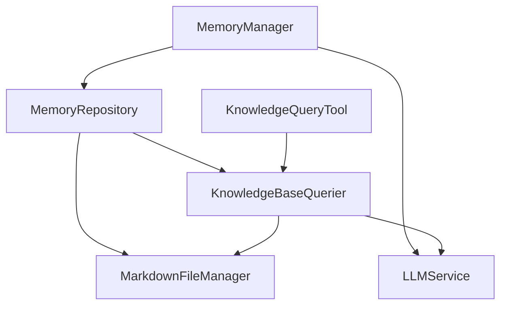

# 索引管理

<cite>
**本文引用的文件**
- [src/services/memory_manager.py](file://src/services/memory_manager.py)
- [src/storage/memory_repository.py](file://src/storage/memory_repository.py)
- [src/storage/markdown_file_manager.py](file://src/storage/markdown_file_manager.py)
- [src/services/knowledge_base_querier.py](file://src/services/knowledge_base_querier.py)
- [src/models/memory_query_result.py](file://src/models/memory_query_result.py)
- [src/models/event_info.py](file://src/models/event_info.py)
- [src/models/person_info.py](file://src/models/person_info.py)
- [src/models/organized_memory.py](file://src/models/organized_memory.py)
- [src/enums/phase_type.py](file://src/enums/phase_type.py)
- [src/tools/knowledge_query_tool.py](file://src/tools/knowledge_query_tool.py)
- [tests/test_memory_manager.py](file://tests/test_memory_manager.py)
- [tests/test_memory_repository.py](file://tests/test_memory_repository.py)
- [Prompts/MemoryOrganizer-Prompt.md](file://Prompts/MemoryOrganizer-Prompt.md)
</cite>

## 目录
1. [简介](#简介)
2. [项目结构](#项目结构)
3. [核心组件](#核心组件)
4. [架构总览](#架构总览)
5. [详细组件分析](#详细组件分析)
6. [依赖分析](#依赖分析)
7. [性能考虑](#性能考虑)
8. [故障排查指南](#故障排查指南)
9. [结论](#结论)
10. [附录](#附录)

## 简介
本文件围绕“三层记忆索引”的设计与实现，系统梳理画像记忆索引、事件索引与人物索引的结构、用途与维护机制；阐述索引建立与更新策略、数据同步与一致性保障；总结查询优化技术与性能监控调优方法，并给出持久化与恢复策略建议。文档面向开发者与产品运维，兼顾可读性与工程实践。

## 项目结构
本项目采用“服务-存储-模型-工具”分层组织，索引管理主要由 MemoryManager 与 MemoryRepository 协同完成，MarkdownFileManager 提供文件系统能力，KnowledgeBaseQuerier 提供知识库检索与ReAct查询能力，模型定义规范了事件、人物与结构化输出。

**图表来源**
- [src/services/memory_manager.py:27-470](file://src/services/memory_manager.py#L27-L470)
- [src/storage/memory_repository.py:40-359](file://src/storage/memory_repository.py#L40-L359)
- [src/storage/markdown_file_manager.py:31-546](file://src/storage/markdown_file_manager.py#L31-L546)
- [src/services/knowledge_base_querier.py:202-540](file://src/services/knowledge_base_querier.py#L202-L540)
- [src/models/event_info.py:5-69](file://src/models/event_info.py#L5-L69)
- [src/models/person_info.py:5-61](file://src/models/person_info.py#L5-L61)
- [src/models/organized_memory.py:141-151](file://src/models/organized_memory.py#L141-L151)
- [src/models/memory_query_result.py:23-81](file://src/models/memory_query_result.py#L23-L81)
- [src/tools/knowledge_query_tool.py:11-81](file://src/tools/knowledge_query_tool.py#L11-L81)

**章节来源**
- [src/services/memory_manager.py:27-470](file://src/services/memory_manager.py#L27-L470)
- [src/storage/memory_repository.py:40-359](file://src/storage/memory_repository.py#L40-L359)
- [src/storage/markdown_file_manager.py:31-546](file://src/storage/markdown_file_manager.py#L31-L546)
- [src/services/knowledge_base_querier.py:202-540](file://src/services/knowledge_base_querier.py#L202-L540)
- [src/models/memory_query_result.py:23-81](file://src/models/memory_query_result.py#L23-L81)
- [src/tools/knowledge_query_tool.py:11-81](file://src/tools/knowledge_query_tool.py#L11-L81)

## 核心组件
- MemoryManager：统一管理三层记忆的读写与结构化整理，协调 LLM 产出与存储落盘，提供短期/长期/画像记忆接口。
- MemoryRepository：三层记忆的统一存储与索引维护，包含短期记忆（内存）、长期记忆（文件系统）与画像记忆（内存索引）。
- MarkdownFileManager：提供文件创建/读取/更新、全文搜索、Wiki链接追踪与目录结构保证。
- KnowledgeBaseQuerier：基于 ReAct 的知识库查询服务，通过工具链动态探索与检索，返回结构化查询结果。
- 模型体系：EventInfo/PersonInfo/OrganizedMemory/MemoryQueryResult 等，支撑结构化存储与查询。

**章节来源**
- [src/services/memory_manager.py:27-470](file://src/services/memory_manager.py#L27-L470)
- [src/storage/memory_repository.py:40-359](file://src/storage/memory_repository.py#L40-L359)
- [src/storage/markdown_file_manager.py:31-546](file://src/storage/markdown_file_manager.py#L31-L546)
- [src/services/knowledge_base_querier.py:202-540](file://src/services/knowledge_base_querier.py#L202-L540)
- [src/models/event_info.py:5-69](file://src/models/event_info.py#L5-L69)
- [src/models/person_info.py:5-61](file://src/models/person_info.py#L5-L61)
- [src/models/organized_memory.py:141-151](file://src/models/organized_memory.py#L141-L151)
- [src/models/memory_query_result.py:23-81](file://src/models/memory_query_result.py#L23-L81)

## 架构总览
三层记忆索引的总体流程：对话轮次经 MemoryManager 调用 LLM 结构化整理，生成 OrganizedMemory；随后并行保存事件与人物，更新时间线与画像索引；查询侧由 KnowledgeBaseQuerier 通过 ReAct 动态探索与检索，结合 MemoryRepository 的索引与缓存实现快速定位。

**图表来源**
- [src/services/memory_manager.py:111-156](file://src/services/memory_manager.py#L111-L156)
- [src/storage/memory_repository.py:176-226](file://src/storage/memory_repository.py#L176-L226)
- [src/storage/markdown_file_manager.py:134-169](file://src/storage/markdown_file_manager.py#L134-L169)

**章节来源**
- [src/services/memory_manager.py:111-156](file://src/services/memory_manager.py#L111-L156)
- [src/storage/memory_repository.py:176-226](file://src/storage/memory_repository.py#L176-L226)
- [src/storage/markdown_file_manager.py:134-169](file://src/storage/markdown_file_manager.py#L134-L169)

## 详细组件分析

### 三层记忆索引设计与用途
- 画像记忆索引（Profile Index）
  - 存储于内存字典，键为人物ID，值为人物信息对象；同时提供短期画像键值（如 birth_year、personality_traits 等）便于会话级快速访问。
  - 用途：快速获取人物画像、关系网络与关键特征，支持对话上下文增强。
- 事件索引（Event Index）
  - 存储于内存字典，键为事件ID，值为事件信息对象；提供关键词/类型过滤查询。
  - 用途：按时间线、主题或类型检索事件，支撑叙事与主题分析。
- 人物索引（People Index）
  - 存储于内存字典，键为人物ID，值为人物信息对象；提供全量人物查询。
  - 用途：关系网络构建、人物画像聚合与跨事件关联。

**图表来源**
- [src/storage/memory_repository.py:40-359](file://src/storage/memory_repository.py#L40-L359)
- [src/models/event_info.py:5-69](file://src/models/event_info.py#L5-L69)
- [src/models/person_info.py:5-61](file://src/models/person_info.py#L5-L61)

**章节来源**
- [src/storage/memory_repository.py:78-306](file://src/storage/memory_repository.py#L78-L306)
- [src/models/event_info.py:5-69](file://src/models/event_info.py#L5-L69)
- [src/models/person_info.py:5-61](file://src/models/person_info.py#L5-L61)

### 索引建立与维护机制
- 短期记忆（会话级）
  - 通过 MemoryRepository 的短期内存字典与历史队列维护，容量受控，支持时间戳与最近N轮对话读取。
- 长期记忆（文件系统）
  - 事件与人物分别写入对应目录（按人生阶段/角色分类），并更新内存索引与LRU缓存。
  - 时间线文件按事件时间追加条目，形成可导航的叙事线索。
- 画像记忆（结构化）
  - 通过 MemoryManager 的结构化整理，将人物画像、关系网络与关键特征写入短期画像键值，支持去重合并。

**图表来源**
- [src/services/memory_manager.py:158-193](file://src/services/memory_manager.py#L158-L193)
- [src/storage/memory_repository.py:176-226](file://src/storage/memory_repository.py#L176-L226)
- [src/storage/memory_repository.py:248-260](file://src/storage/memory_repository.py#L248-L260)

**章节来源**
- [src/services/memory_manager.py:158-193](file://src/services/memory_manager.py#L158-L193)
- [src/storage/memory_repository.py:176-226](file://src/storage/memory_repository.py#L176-L226)
- [src/storage/memory_repository.py:248-260](file://src/storage/memory_repository.py#L248-L260)

### 数据同步与一致性保障
- 写入顺序
  - 事件与人物并行保存，完成后统一更新时间线与画像索引，确保索引与文件一致。
- 缓存与索引一致性
  - 写入成功后，LRU缓存与内存索引同步更新；读取时优先命中缓存，再回退到索引。
- 会话清理
  - MemoryManager 提供会话清理接口，清空短期记忆与历史，保留长期记忆，避免上下文污染。

**章节来源**
- [src/services/memory_manager.py:170-193](file://src/services/memory_manager.py#L170-L193)
- [src/storage/memory_repository.py:196-197](file://src/storage/memory_repository.py#L196-L197)
- [src/storage/memory_repository.py:241-243](file://src/storage/memory_repository.py#L241-L243)
- [src/services/memory_manager.py:468-470](file://src/services/memory_manager.py#L468-L470)

### 查询优化技术
- 快速查找
  - 事件/人物索引为内存字典，按ID查询为O(1)；LRU缓存命中优先，减少磁盘IO。
- 复合查询
  - MemoryRepository 提供关键词、类型过滤的事件查询；支持时间范围（预留参数）。
- 搜索性能优化
  - MarkdownFileManager 提供全文搜索，按相关度排序，支持上下文截取；链接追踪支持多跳关联。
- ReAct 查询
  - KnowledgeBaseQuerier 通过工具链（list_files/read_file/follow_links）动态探索，限定目标路径，提升检索准确性与性能。

**图表来源**
- [src/services/knowledge_base_querier.py:257-373](file://src/services/knowledge_base_querier.py#L257-L373)
- [src/storage/markdown_file_manager.py:285-334](file://src/storage/markdown_file_manager.py#L285-L334)
- [src/storage/markdown_file_manager.py:390-430](file://src/storage/markdown_file_manager.py#L390-L430)

**章节来源**
- [src/storage/memory_repository.py:262-284](file://src/storage/memory_repository.py#L262-L284)
- [src/services/knowledge_base_querier.py:257-373](file://src/services/knowledge_base_querier.py#L257-L373)
- [src/storage/markdown_file_manager.py:285-334](file://src/storage/markdown_file_manager.py#L285-L334)

### 持久化与恢复机制
- 目录结构与索引文件
  - MarkdownFileManager 初始化时确保目录结构完整，并创建顶层索引文件，便于导航。
- 文件写入与覆盖策略
  - create_file 支持覆盖或追加；update_file 支持追加章节；保证增量更新与历史保留。
- 恢复与重建
  - 通过 MemoryRepository 的索引与缓存，可在重启后重新加载内存索引；文件系统层面可通过目录结构与索引文件进行浏览与修复。

**章节来源**
- [src/storage/markdown_file_manager.py:80-131](file://src/storage/markdown_file_manager.py#L80-L131)
- [src/storage/markdown_file_manager.py:134-169](file://src/storage/markdown_file_manager.py#L134-L169)
- [src/storage/markdown_file_manager.py:231-261](file://src/storage/markdown_file_manager.py#L231-L261)

### 性能监控与调优指南
- 索引大小分析
  - 事件/人物索引规模可通过 get_all_events/get_all_people 获取；结合文件统计信息评估存储占用。
- 查询效率评估
  - MemoryQueryResult 提供 top entries 与事件/人物分类，辅助评估检索质量；KnowledgeBaseQuerier 的探索报告可用于分析工具链使用效果。
- 存储空间优化建议
  - 合理设置短期记忆容量与缓存容量；定期归档旧对话与冗余文件；利用链接追踪减少重复内容。

**章节来源**
- [src/storage/memory_repository.py:300-306](file://src/storage/memory_repository.py#L300-L306)
- [src/models/memory_query_result.py:51-61](file://src/models/memory_query_result.py#L51-L61)
- [src/services/knowledge_base_querier.py:326-357](file://src/services/knowledge_base_querier.py#L326-L357)

## 依赖分析
- MemoryManager 依赖 MemoryRepository 与 LLMService，负责结构化整理与批量落盘。
- MemoryRepository 依赖 MarkdownFileManager 与 KnowledgeBaseQuerier，负责文件系统操作与知识库查询集成。
- KnowledgeBaseQuerier 依赖 LLMService 与 MarkdownFileManager，提供 ReAct 查询能力。
- 模型层为纯数据结构，被各服务与工具广泛使用。

**图表来源**
- [src/services/memory_manager.py:5-60](file://src/services/memory_manager.py#L5-L60)
- [src/storage/memory_repository.py:83-87](file://src/storage/memory_repository.py#L83-L87)
- [src/services/knowledge_base_querier.py:220-235](file://src/services/knowledge_base_querier.py#L220-L235)
- [src/tools/knowledge_query_tool.py:25-31](file://src/tools/knowledge_query_tool.py#L25-L31)

**章节来源**
- [src/services/memory_manager.py:5-60](file://src/services/memory_manager.py#L5-L60)
- [src/storage/memory_repository.py:83-87](file://src/storage/memory_repository.py#L83-L87)
- [src/services/knowledge_base_querier.py:220-235](file://src/services/knowledge_base_querier.py#L220-L235)
- [src/tools/knowledge_query_tool.py:25-31](file://src/tools/knowledge_query_tool.py#L25-L31)

## 性能考虑
- 并行写入：MemoryManager 在应用结构化记忆时并行保存事件与人物，显著降低端到端延迟。
- 缓存命中：LRU缓存优先命中，减少重复磁盘读取；缓存键命名规范（event:、person:）避免冲突。
- 查询路径控制：KnowledgeBaseQuerier 严格限定目标路径，避免无关目录扫描，提高检索效率。
- 相关度评分：全文搜索与链接追踪提供相关度与上下文，辅助高质量检索结果。

**章节来源**
- [src/services/memory_manager.py:170-184](file://src/services/memory_manager.py#L170-L184)
- [src/storage/memory_repository.py:29-37](file://src/storage/memory_repository.py#L29-L37)
- [src/storage/memory_repository.py:230-233](file://src/storage/memory_repository.py#L230-L233)
- [src/services/knowledge_base_querier.py:280-294](file://src/services/knowledge_base_querier.py#L280-L294)
- [src/storage/markdown_file_manager.py:336-354](file://src/storage/markdown_file_manager.py#L336-L354)

## 故障排查指南
- 写入失败
  - 检查文件路径与权限；确认目录结构已初始化；查看日志输出定位异常。
- 查询无结果
  - 使用探索报告（get_exploration_report）查看已访问路径与疑似文件；确认目标路径有效。
- 缓存未命中
  - 检查缓存键命名与容量；确认写入后缓存是否同步更新。
- 会话上下文污染
  - 调用 clear_session 清空短期记忆与历史，重新组织记忆。

**章节来源**
- [src/storage/markdown_file_manager.py:134-169](file://src/storage/markdown_file_manager.py#L134-L169)
- [src/services/knowledge_base_querier.py:326-365](file://src/services/knowledge_base_querier.py#L326-L365)
- [src/storage/memory_repository.py:230-233](file://src/storage/memory_repository.py#L230-L233)
- [src/services/memory_manager.py:468-470](file://src/services/memory_manager.py#L468-L470)

## 结论
本项目通过 MemoryManager 与 MemoryRepository 实现三层记忆索引的高效管理，结合 MarkdownFileManager 的文件系统能力与 KnowledgeBaseQuerier 的 ReAct 查询，形成了从“结构化整理—索引维护—智能检索”的完整闭环。通过并行写入、缓存优先与路径控制等手段，系统在准确性与性能之间取得平衡；配套的探索报告与查询结果模型为持续优化提供了可观测性基础。

## 附录
- 术语
  - 短期记忆：会话级内存缓存与历史队列。
  - 长期记忆：文件系统中的事件与人物文件。
  - 画像记忆：人物画像与关系网络的结构化键值。
- 相关文件
  - Prompt 模板与调用方式参考：[Prompts/MemoryOrganizer-Prompt.md:282-364](file://Prompts/MemoryOrganizer-Prompt.md#L282-L364)
  - 阶段枚举：[src/enums/phase_type.py:4-10](file://src/enums/phase_type.py#L4-L10)