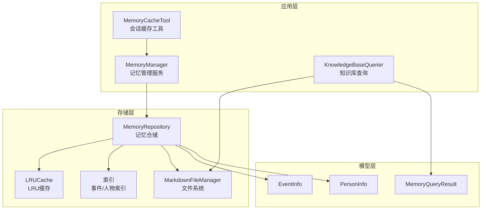
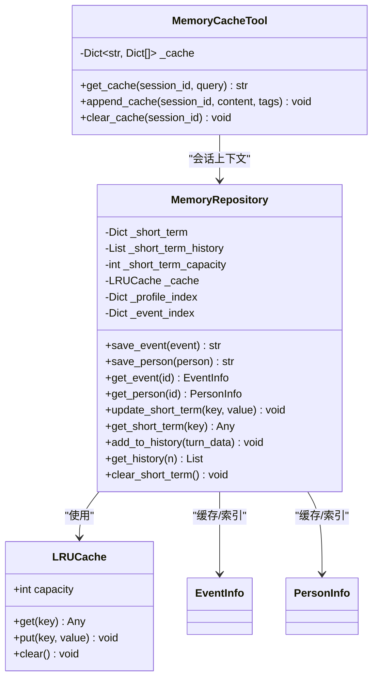
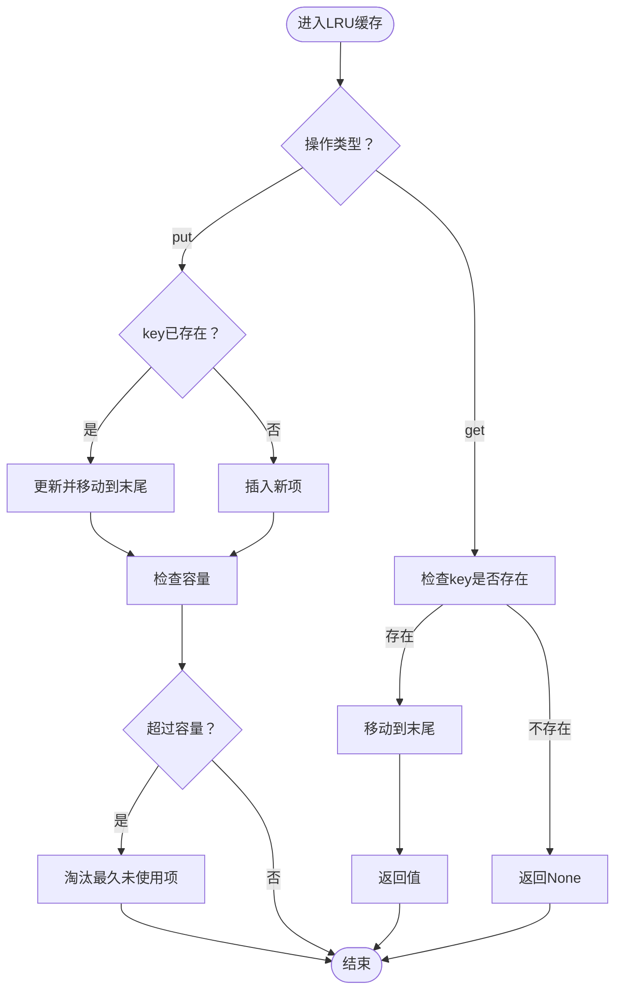
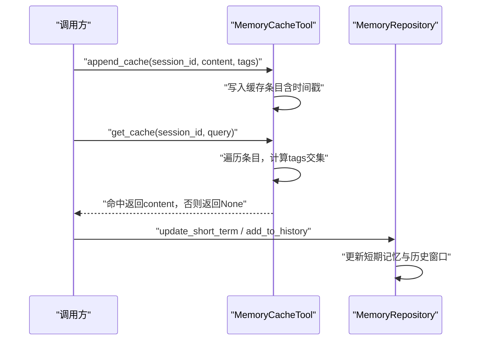
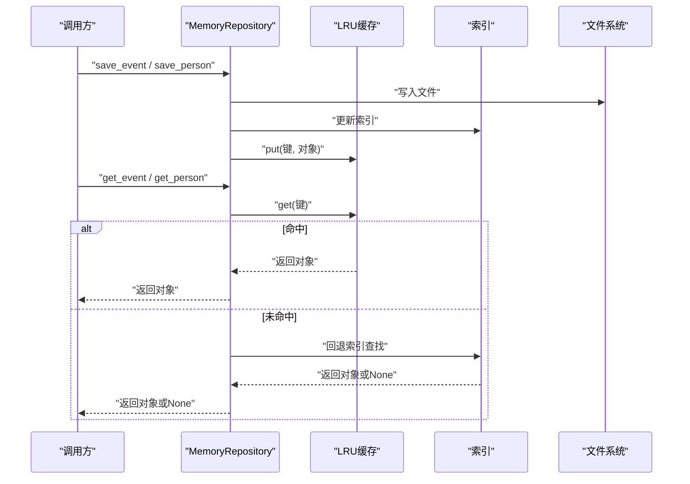
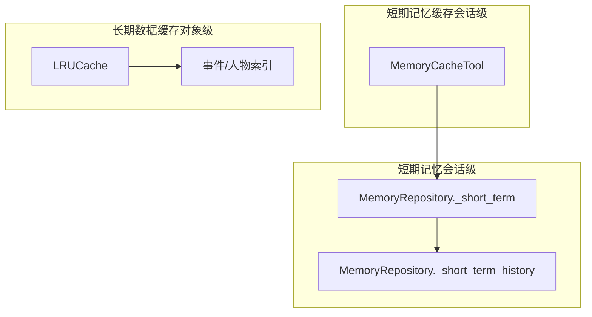
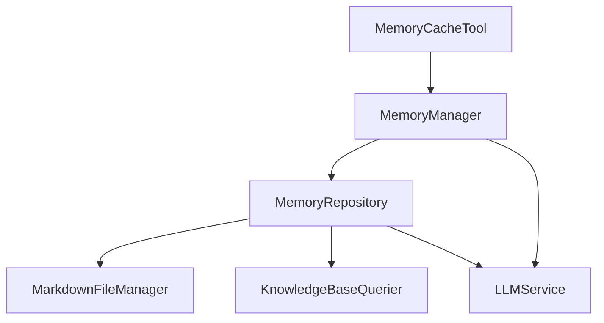

# 缓存策略

<cite>
**本文引用的文件**
- [memory_repository.py](file://src/storage/memory_repository.py)
- [memory_cache_tool.py](file://src/tools/memory_cache_tool.py)
- [memory_manager.py](file://src/services/memory_manager.py)
- [markdown_file_manager.py](file://src/storage/markdown_file_manager.py)
- [knowledge_base_querier.py](file://src/services/knowledge_base_querier.py)
- [memory_query_result.py](file://src/models/memory_query_result.py)
- [event_info.py](file://src/models/event_info.py)
- [person_info.py](file://src/models/person_info.py)
- [test_memory_repository.py](file://tests/test_memory_repository.py)
- [test_memory_manager.py](file://tests/test_memory_manager.py)
</cite>

## 目录
1. [简介](#简介)
2. [项目结构](#项目结构)
3. [核心组件](#核心组件)
4. [架构总览](#架构总览)
5. [详细组件分析](#详细组件分析)
6. [依赖分析](#依赖分析)
7. [性能考量](#性能考量)
8. [故障排除指南](#故障排除指南)
9. [结论](#结论)
10. [附录](#附录)

## 简介
本文件围绕本项目的缓存策略展开，重点解释三层记忆体系中的缓存设计与实现，包括短期记忆缓存、长期数据缓存与索引缓存的职责划分、LRU缓存的实现与配置、缓存的读写流程、失效与更新策略、以及性能监控与优化建议。文档同时提供可视化图示与实操指引，帮助开发者与运维人员快速理解并优化缓存系统。

## 项目结构
本项目采用“三层记忆”与“工具层”的分层架构：
- 存储层（MemoryRepository）：负责短期记忆（内存）、长期记忆（文件系统）、画像记忆（内存索引），并内置LRU缓存。
- 服务层（MemoryManager）：对外提供统一的记忆管理接口，协调存储与LLM整理。
- 工具层（MemoryCacheTool）：面向会话的短期记忆缓存工具，支持关键词检索与追加更新。
- 知识库查询（KnowledgeBaseQuerier）：ReAct模式的检索工具，配合MarkdownFileManager进行全文搜索与链接追踪。
- 模型层（EventInfo/PersonInfo/MemoryQueryResult）：结构化数据模型支撑缓存与查询。

图表来源
- [memory_manager.py:27-61](file://src/services/memory_manager.py#L27-L61)
- [memory_repository.py:40-88](file://src/storage/memory_repository.py#L40-L88)
- [memory_cache_tool.py:8-27](file://src/tools/memory_cache_tool.py#L8-L27)
- [knowledge_base_querier.py:202-236](file://src/services/knowledge_base_querier.py#L202-L236)
- [markdown_file_manager.py:31-46](file://src/storage/markdown_file_manager.py#L31-L46)
- [event_info.py:5-17](file://src/models/event_info.py#L5-L17)
- [person_info.py:5-17](file://src/models/person_info.py#L5-L17)
- [memory_query_result.py:23-35](file://src/models/memory_query_result.py#L23-L35)

章节来源
- [memory_manager.py:27-61](file://src/services/memory_manager.py#L27-L61)
- [memory_repository.py:40-88](file://src/storage/memory_repository.py#L40-L88)
- [memory_cache_tool.py:8-27](file://src/tools/memory_cache_tool.py#L8-L27)
- [knowledge_base_querier.py:202-236](file://src/services/knowledge_base_querier.py#L202-L236)
- [markdown_file_manager.py:31-46](file://src/storage/markdown_file_manager.py#L31-L46)
- [event_info.py:5-17](file://src/models/event_info.py#L5-L17)
- [person_info.py:5-17](file://src/models/person_info.py#L5-L17)
- [memory_query_result.py:23-35](file://src/models/memory_query_result.py#L23-L35)

## 核心组件
- LRU缓存（MemoryRepository.LRUCache）
  - 作用：对事件与人物对象进行内存缓存，按LRU策略淘汰最久未使用的条目。
  - 容量：构造函数接收capacity参数，默认100；可通过初始化参数调整。
  - 行为：get命中后移动至末尾，put若已存在则更新并移动至末尾，超出容量时淘汰最久未使用项。
- 短期记忆缓存（MemoryRepository._short_term）
  - 作用：会话级短期记忆，保存键值与时间戳，容量受短时历史容量控制。
  - 特点：非持久化，会话结束即清空。
- 长期数据缓存与索引（MemoryRepository._cache + _event_index/_profile_index）
  - 作用：事件与人物对象的索引与LRU缓存，提升查询效率。
  - 触发点：保存事件/人物时更新索引与缓存；查询时优先命中缓存再回退索引。
- 会话短期记忆缓存（MemoryCacheTool）
  - 作用：按会话ID维护关键词标签到内容的映射，支持关键词检索与追加更新。
  - 特点：内存存储，适合会话内的快速检索与上下文复用。

章节来源
- [memory_repository.py:16-38](file://src/storage/memory_repository.py#L16-L38)
- [memory_repository.py:70-81](file://src/storage/memory_repository.py#L70-L81)
- [memory_repository.py:176-247](file://src/storage/memory_repository.py#L176-L247)
- [memory_cache_tool.py:8-27](file://src/tools/memory_cache_tool.py#L8-L27)
- [memory_cache_tool.py:34-89](file://src/tools/memory_cache_tool.py#L34-L89)

## 架构总览
缓存在三层记忆中的分工与协作如下：
- 短期记忆缓存（内存）：用于会话内高频读写，容量较小，生命周期短。
- 长期数据缓存（LRU）：对事件/人物对象进行缓存，减少文件系统读取与解析成本。
- 索引缓存（内存索引）：事件/人物ID到对象的映射，作为缓存的后备与加速。
- 会话短期记忆缓存（MemoryCacheTool）：按会话维度的关键词检索缓存，便于快速上下文匹配。

图表来源
- [memory_repository.py:16-88](file://src/storage/memory_repository.py#L16-L88)
- [memory_cache_tool.py:8-27](file://src/tools/memory_cache_tool.py#L8-L27)

章节来源
- [memory_repository.py:16-88](file://src/storage/memory_repository.py#L16-L88)
- [memory_cache_tool.py:8-27](file://src/tools/memory_cache_tool.py#L8-L27)

## 详细组件分析

### LRU缓存实现与配置
- 实现要点
  - 使用有序字典维护访问顺序，get命中后move_to_end，put若已存在则更新并移动至末尾，超出容量popitem(last=False)淘汰最久未使用项。
  - 容量通过构造函数参数capacity配置，默认100；可通过MemoryRepository初始化参数cache_capacity调整。
- 性能特性
  - get/put均为O(1)，适合高并发读写场景。
  - 有序字典保证淘汰顺序稳定，避免热点数据被频繁驱逐。
- 配置建议
  - 长期数据缓存容量建议根据事件/人物总量与访问模式设定，结合单元测试验证容量边界行为。

图表来源
- [memory_repository.py:19-34](file://src/storage/memory_repository.py#L19-L34)

章节来源
- [memory_repository.py:16-38](file://src/storage/memory_repository.py#L16-L38)

### 短期记忆缓存（会话级）
- MemoryCacheTool
  - 会话维度的短期记忆缓存，支持关键词检索与追加更新。
  - 存储结构：按session_id组织，每个条目包含content、tags、timestamp。
  - 查询逻辑：对给定tags集合与缓存条目tags集合求交集，命中即返回content。
  - 清理：按会话ID清空该会话的所有缓存条目。
- MemoryRepository短期记忆
  - 保存键值与时间戳，容量由_short_term_capacity控制（默认20）。
  - 历史记录容量限制：超过容量时弹出最早项，保持固定窗口大小。

图表来源
- [memory_cache_tool.py:34-89](file://src/tools/memory_cache_tool.py#L34-L89)
- [memory_repository.py:91-110](file://src/storage/memory_repository.py#L91-L110)

章节来源
- [memory_cache_tool.py:8-27](file://src/tools/memory_cache_tool.py#L8-L27)
- [memory_cache_tool.py:34-89](file://src/tools/memory_cache_tool.py#L34-L89)
- [memory_repository.py:91-110](file://src/storage/memory_repository.py#L91-L110)

### 长期数据缓存与索引
- 写入流程
  - 保存事件/人物时，先写入文件系统，再更新内存索引与LRU缓存。
  - 事件：更新_event_index与_cache（键前缀"event:"）。
  - 人物：更新_profile_index与_cache（键前缀"person:"）。
- 读取流程
  - 优先从LRU缓存get，命中则直接返回；未命中再回退到索引查找。
  - 未找到返回None。
- 查询与展示
  - MemoryManager封装查询接口，委托MemoryRepository执行。
  - KnowledgeBaseQuerier通过MarkdownFileManager进行全文搜索与链接追踪，辅助检索。

图表来源
- [memory_repository.py:176-247](file://src/storage/memory_repository.py#L176-L247)
- [memory_repository.py:228-246](file://src/storage/memory_repository.py#L228-L246)

章节来源
- [memory_repository.py:176-247](file://src/storage/memory_repository.py#L176-L247)
- [memory_repository.py:228-246](file://src/storage/memory_repository.py#L228-L246)
- [markdown_file_manager.py:31-46](file://src/storage/markdown_file_manager.py#L31-L46)

### 缓存层次结构的设计与协作
- 短期记忆缓存（MemoryCacheTool）
  - 面向会话的关键词检索，适合快速上下文匹配与会话内复用。
- 长期数据缓存（LRU + 索引）
  - 面向事件/人物对象的缓存，降低文件系统读取与解析开销。
- 短期记忆（MemoryRepository）
  - 面向会话的键值存储，容量小、生命周期短，适合临时状态与历史窗口。

图表来源
- [memory_cache_tool.py:8-27](file://src/tools/memory_cache_tool.py#L8-L27)
- [memory_repository.py:70-81](file://src/storage/memory_repository.py#L70-L81)
- [memory_repository.py:16-38](file://src/storage/memory_repository.py#L16-L38)

章节来源
- [memory_cache_tool.py:8-27](file://src/tools/memory_cache_tool.py#L8-L27)
- [memory_repository.py:70-81](file://src/storage/memory_repository.py#L70-L81)
- [memory_repository.py:16-38](file://src/storage/memory_repository.py#L16-L38)

### 缓存失效与更新策略
- LRU淘汰
  - 通过有序字典维护访问顺序，超容量时淘汰最久未使用项。
- 手动刷新
  - MemoryCacheTool提供按会话ID清空缓存的能力。
  - MemoryRepository提供清空短期记忆的能力。
- 自动过期
  - 本项目未实现基于时间的自动过期策略；短期记忆与LRU缓存均以容量为约束。
- 缓存一致性
  - 写入时同时更新索引与缓存，读取时优先缓存，回退索引，保证一致性。
  - 事件/人物对象更新后，缓存与索引同步更新，避免脏读。

章节来源
- [memory_repository.py:19-34](file://src/storage/memory_repository.py#L19-L34)
- [memory_cache_tool.py:86-89](file://src/tools/memory_cache_tool.py#L86-L89)
- [memory_repository.py:169-173](file://src/storage/memory_repository.py#L169-L173)

### 缓存性能监控与优化
- 命中率统计
  - 可在LRU缓存层增加命中/未命中计数器，在MemoryRepository中记录事件/人物缓存命中情况。
- 内存使用分析
  - 分别统计LRU缓存、索引、短期记忆占用；结合容量参数评估内存压力。
- 缓存效果评估
  - 通过查询耗时对比（缓存命中 vs 回退索引）评估缓存收益。
- 优化建议
  - 合理设置cache_capacity与short_term_capacity，结合业务峰值流量压测。
  - 对热点事件/人物ID建立预热策略，减少首次冷启动延迟。
  - 对频繁读取的对象采用更细粒度的缓存键，避免大对象全量缓存带来的内存压力。

[本节为通用性能指导，无需特定文件引用]

## 依赖分析
- MemoryRepository依赖
  - MarkdownFileManager：文件系统读写与搜索。
  - KnowledgeBaseQuerier：ReAct模式检索辅助。
  - LLMService：记忆整理与结构化输出。
- MemoryManager依赖
  - MemoryRepository：统一的存储接口。
  - LLMService：结构化整理。
- MemoryCacheTool依赖
  - 与MemoryRepository协作，提供会话级上下文缓存。

图表来源
- [memory_repository.py:83-87](file://src/storage/memory_repository.py#L83-L87)
- [memory_manager.py:5-60](file://src/services/memory_manager.py#L5-L60)
- [memory_cache_tool.py:8-27](file://src/tools/memory_cache_tool.py#L8-L27)

章节来源
- [memory_repository.py:83-87](file://src/storage/memory_repository.py#L83-L87)
- [memory_manager.py:5-60](file://src/services/memory_manager.py#L5-L60)
- [memory_cache_tool.py:8-27](file://src/tools/memory_cache_tool.py#L8-L27)

## 性能考量
- LRU复杂度
  - get/put均为O(1)，适合高并发场景。
- 写入路径
  - 事件/人物写入涉及文件系统I/O与索引更新，建议批量写入与并行处理（MemoryManager内部已使用gather）。
- 读取路径
  - 优先LRU缓存，其次索引，最后文件系统；合理容量可显著降低I/O。
- 会话短期缓存
  - MemoryCacheTool按会话维度组织，适合高频关键词检索，避免跨会话污染。

[本节为通用性能指导，无需特定文件引用]

## 故障排除指南
- 缓存未命中
  - 检查LRU缓存容量是否过小导致频繁淘汰；检查键前缀是否一致（事件/人物）。
- 会话缓存缺失
  - 确认append_cache是否正确调用；检查session_id是否一致；必要时调用clear_cache进行重置。
- 短期记忆异常
  - 检查_short_term_capacity是否过小；确认add_to_history是否触发容量限制弹出。
- 查询结果为空
  - 确认索引是否已更新（保存后应更新_index与_cache）；检查关键词是否正确传递。
- 单元测试验证
  - LRU缓存容量与更新行为：见测试用例。
  - 事件/人物缓存与索引：见测试用例。
  - 短期记忆与历史窗口：见测试用例。

章节来源
- [test_memory_repository.py:10-42](file://tests/test_memory_repository.py#L10-L42)
- [test_memory_repository.py:94-131](file://tests/test_memory_repository.py#L94-L131)
- [test_memory_repository.py:148-182](file://tests/test_memory_repository.py#L148-L182)
- [test_memory_manager.py:189-200](file://tests/test_memory_manager.py#L189-L200)

## 结论
本项目通过“短期记忆缓存（会话级）+长期数据缓存（LRU+索引）+短期记忆（会话级）”的三层缓存设计，实现了高效、可扩展的记忆读写能力。LRU缓存以O(1)复杂度保障高频访问性能，索引与短期记忆分别承担对象级与会话级的快速检索需求。建议在生产环境中结合容量参数与业务峰值进行压测，并通过命中率与内存使用分析持续优化缓存策略。

[本节为总结性内容，无需特定文件引用]

## 附录
- 关键配置参数
  - MemoryRepository初始化参数：short_term_capacity（短期记忆容量，默认20）、cache_capacity（LRU缓存容量，默认100）。
  - LRUCache初始化参数：capacity（默认100）。
- 数据模型
  - EventInfo/PersonInfo：事件与人物对象，作为缓存与索引的载体。
  - MemoryQueryResult：查询结果封装，便于上层消费。

章节来源
- [memory_repository.py:54-67](file://src/storage/memory_repository.py#L54-L67)
- [memory_repository.py:19-21](file://src/storage/memory_repository.py#L19-L21)
- [event_info.py:5-17](file://src/models/event_info.py#L5-L17)
- [person_info.py:5-17](file://src/models/person_info.py#L5-L17)
- [memory_query_result.py:23-35](file://src/models/memory_query_result.py#L23-L35)