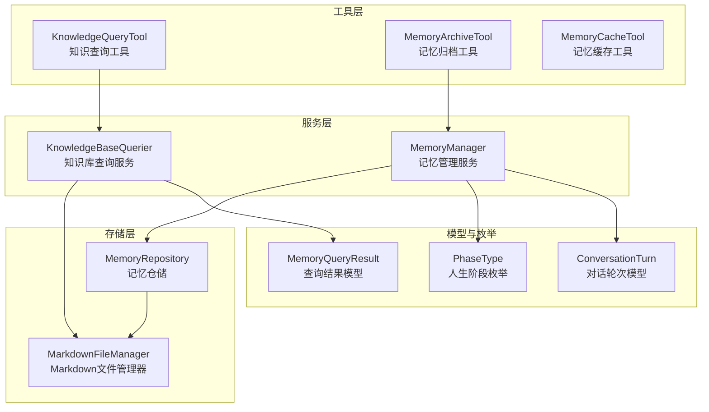
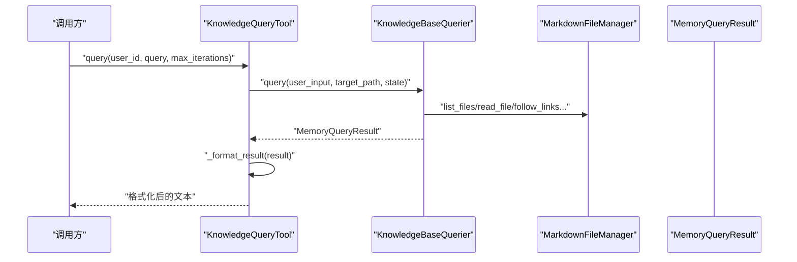
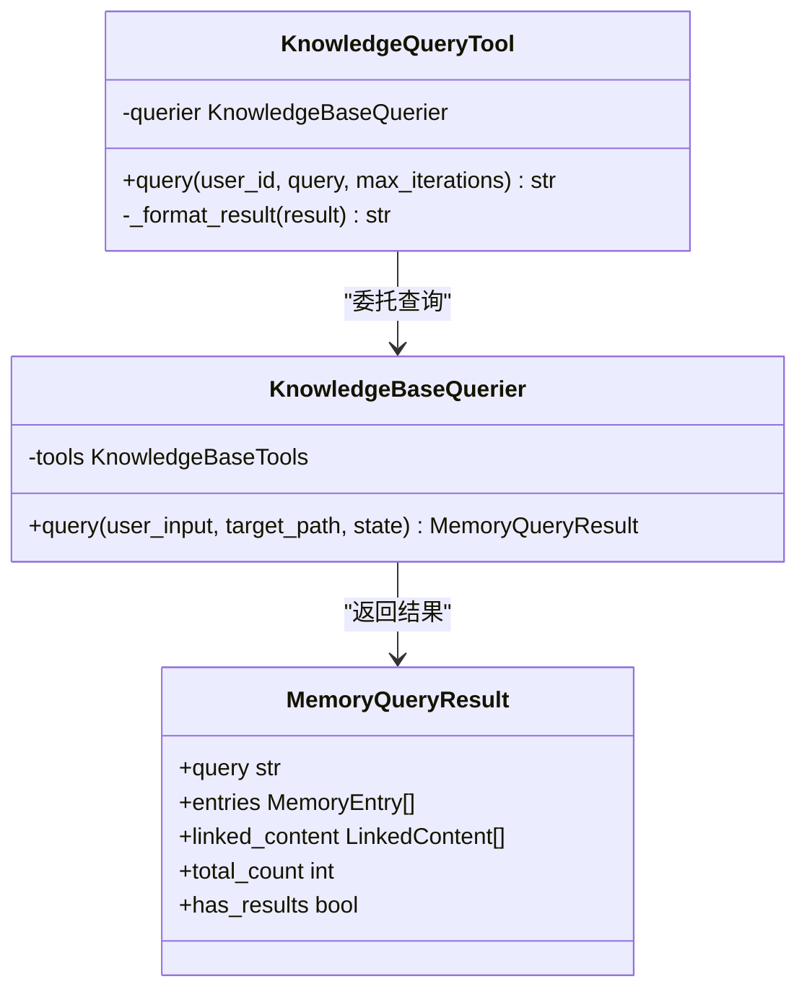
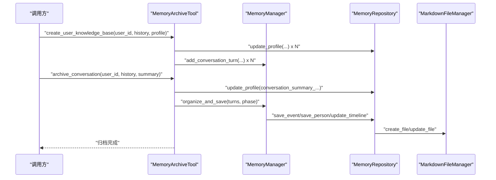
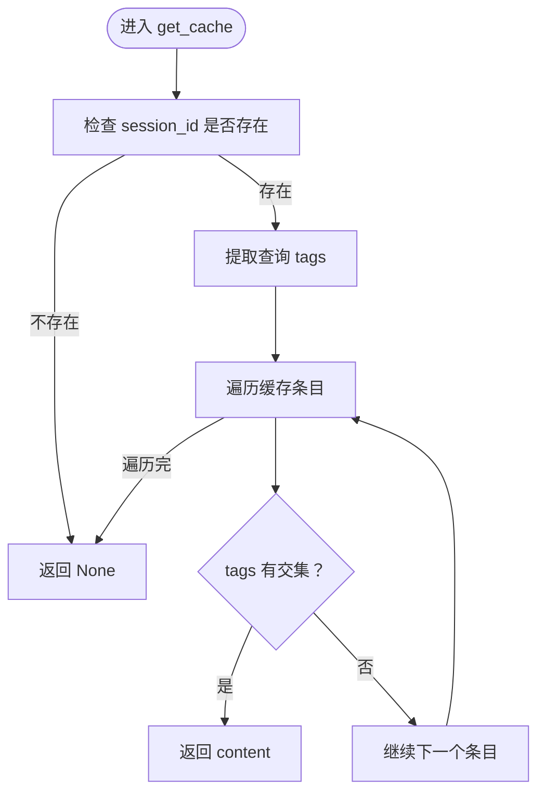
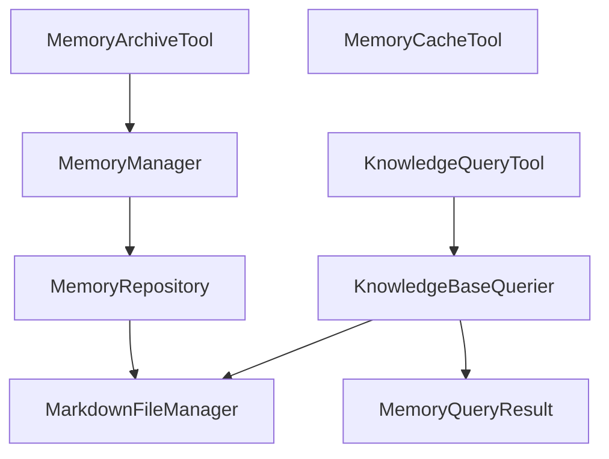

# 工具和实用程序

<cite>
**本文引用的文件**
- [src/tools/__init__.py](file://src/tools/__init__.py)
- [src/tools/knowledge_query_tool.py](file://src/tools/knowledge_query_tool.py)
- [src/tools/memory_archive_tool.py](file://src/tools/memory_archive_tool.py)
- [src/tools/memory_cache_tool.py](file://src/tools/memory_cache_tool.py)
- [src/services/knowledge_base_querier.py](file://src/services/knowledge_base_querier.py)
- [src/services/memory_manager.py](file://src/services/memory_manager.py)
- [src/storage/memory_repository.py](file://src/storage/memory_repository.py)
- [src/storage/markdown_file_manager.py](file://src/storage/markdown_file_manager.py)
- [src/models/memory_query_result.py](file://src/models/memory_query_result.py)
- [src/enums/phase_type.py](file://src/enums/phase_type.py)
- [src/models/conversation_turn.py](file://src/models/conversation_turn.py)
- [test_memory_interaction.py](file://test_memory_interaction.py)
</cite>

## 目录
1. [简介](#简介)
2. [项目结构](#项目结构)
3. [核心组件](#核心组件)
4. [架构总览](#架构总览)
5. [详细组件分析](#详细组件分析)
6. [依赖分析](#依赖分析)
7. [性能考虑](#性能考虑)
8. [故障排查指南](#故障排查指南)
9. [结论](#结论)
10. [附录](#附录)

## 简介
本文件聚焦于“工具和实用程序”模块，系统梳理知识查询工具、记忆归档工具与记忆缓存工具的功能定位、实现原理、数据流与协作关系，并给出最佳实践、扩展指南与调试技巧。读者无需深入底层即可理解各工具如何协同工作，支撑记忆库的查询、组织与短期缓存。

## 项目结构
工具模块位于 src/tools 下，围绕知识库查询、记忆归档与短期缓存三大职责展开；上层服务与存储层分别位于 src/services 与 src/storage，模型定义位于 src/models，枚举类型位于 src/enums。测试脚本 test_memory_interaction.py 展示了记忆管理的典型使用流程。

图表来源
- [src/tools/knowledge_query_tool.py:11-81](file://src/tools/knowledge_query_tool.py#L11-L81)
- [src/tools/memory_archive_tool.py:10-112](file://src/tools/memory_archive_tool.py#L10-L112)
- [src/tools/memory_cache_tool.py:8-89](file://src/tools/memory_cache_tool.py#L8-L89)
- [src/services/knowledge_base_querier.py:202-540](file://src/services/knowledge_base_querier.py#L202-L540)
- [src/services/memory_manager.py:27-470](file://src/services/memory_manager.py#L27-L470)
- [src/storage/memory_repository.py:40-359](file://src/storage/memory_repository.py#L40-L359)
- [src/storage/markdown_file_manager.py:31-200](file://src/storage/markdown_file_manager.py#L31-L200)
- [src/models/memory_query_result.py:23-81](file://src/models/memory_query_result.py#L23-L81)
- [src/enums/phase_type.py:4-10](file://src/enums/phase_type.py#L4-L10)
- [src/models/conversation_turn.py:14-52](file://src/models/conversation_turn.py#L14-L52)

章节来源
- [src/tools/__init__.py:1-3](file://src/tools/__init__.py#L1-L3)
- [src/tools/knowledge_query_tool.py:11-81](file://src/tools/knowledge_query_tool.py#L11-L81)
- [src/tools/memory_archive_tool.py:10-112](file://src/tools/memory_archive_tool.py#L10-L112)
- [src/tools/memory_cache_tool.py:8-89](file://src/tools/memory_cache_tool.py#L8-L89)
- [src/services/knowledge_base_querier.py:202-540](file://src/services/knowledge_base_querier.py#L202-L540)
- [src/services/memory_manager.py:27-470](file://src/services/memory_manager.py#L27-L470)
- [src/storage/memory_repository.py:40-359](file://src/storage/memory_repository.py#L40-L359)
- [src/storage/markdown_file_manager.py:31-200](file://src/storage/markdown_file_manager.py#L31-L200)
- [src/models/memory_query_result.py:23-81](file://src/models/memory_query_result.py#L23-L81)
- [src/enums/phase_type.py:4-10](file://src/enums/phase_type.py#L4-L10)
- [src/models/conversation_turn.py:14-52](file://src/models/conversation_turn.py#L14-L52)

## 核心组件
- 知识查询工具（KnowledgeQueryTool）
  - 职责：封装知识库查询服务，提供简洁的查询接口，负责结果格式化。
  - 输入：用户ID、查询内容（字符串或结构化）、最大迭代次数。
  - 输出：格式化后的查询结果文本。
  - 关键点：限定查询目标路径为“./knowledge_base/{user_id}”，统一结果格式化策略。
  
- 记忆归档工具（MemoryArchiveTool）
  - 职责：封装记忆管理器的归档操作，支持初始化阶段的知识库生成与会话结束后的归档。
  - 输入：用户ID、对话历史、画像信息、会话总结。
  - 输出：无（副作用：写入画像与短期记忆，触发组织与保存流程）。
  - 关键点：失败回退至原始对话记录保存；默认人生阶段可调整。
  
- 记忆缓存工具（MemoryCacheTool）
  - 职责：会话级短期记忆缓存，支持关键词检索与追加更新。
  - 输入：会话ID、查询条件（含tags）、缓存内容与标签。
  - 输出：匹配的缓存内容或None。
  - 关键点：内存存储，生产环境建议替换为Redis等持久化缓存。

章节来源
- [src/tools/knowledge_query_tool.py:11-81](file://src/tools/knowledge_query_tool.py#L11-L81)
- [src/tools/memory_archive_tool.py:10-112](file://src/tools/memory_archive_tool.py#L10-L112)
- [src/tools/memory_cache_tool.py:8-89](file://src/tools/memory_cache_tool.py#L8-L89)

## 架构总览
工具层通过服务层与存储层间接耦合，形成清晰的分层职责：
- 工具层：对外暴露简化的API，屏蔽内部复杂性。
- 服务层：编排业务逻辑，协调LLM与存储。
- 存储层：抽象文件系统与缓存，提供统一的读写接口。

图表来源
- [src/tools/knowledge_query_tool.py:33-66](file://src/tools/knowledge_query_tool.py#L33-L66)
- [src/services/knowledge_base_querier.py:257-373](file://src/services/knowledge_base_querier.py#L257-L373)
- [src/storage/markdown_file_manager.py:134-200](file://src/storage/markdown_file_manager.py#L134-L200)
- [src/models/memory_query_result.py:23-81](file://src/models/memory_query_result.py#L23-L81)

## 详细组件分析

### 知识查询工具（KnowledgeQueryTool）
- 设计思路
  - 适配器模式：封装 KnowledgeBaseQuerier，隐藏LangChain Agent细节。
  - 结果格式化：统一输出为人类可读文本，兼容字符串、MemoryQueryResult与字典。
  - 路径隔离：强制 target_path 为“./knowledge_base/{user_id}”，避免越权访问。
- 数据结构与复杂度
  - 查询参数：字符串或字典，O(1) 解析。
  - 结果格式化：遍历 entries，O(n)。
- 错误处理
  - 目标路径校验失败时返回空结果。
  - 解析 Final Answer 降级处理，保证输出稳定性。
- 性能要点
  - 通过 _format_result 避免重复序列化。
  - 与 LLMService 的模板配合，减少上下文噪声。

图表来源
- [src/tools/knowledge_query_tool.py:11-81](file://src/tools/knowledge_query_tool.py#L11-L81)
- [src/services/knowledge_base_querier.py:202-540](file://src/services/knowledge_base_querier.py#L202-L540)
- [src/models/memory_query_result.py:23-81](file://src/models/memory_query_result.py#L23-L81)

章节来源
- [src/tools/knowledge_query_tool.py:11-81](file://src/tools/knowledge_query_tool.py#L11-L81)
- [src/services/knowledge_base_querier.py:202-540](file://src/services/knowledge_base_querier.py#L202-L540)
- [src/models/memory_query_result.py:23-81](file://src/models/memory_query_result.py#L23-L81)

### 记忆归档工具（MemoryArchiveTool）
- 设计思路
  - 生命周期视角：初始化阶段生成画像与短期记忆；会话结束后组织并保存为长期记忆。
  - 容错设计：组织失败时至少保存原始对话记录。
- 数据流
  - 初始化：将画像键值写入 profile，对话轮次写入短期历史。
  - 归档：将对话转为 ConversationTurn，调用 MemoryManager 组织并保存，更新时间线。
- 错误处理
  - 组织异常捕获并回退保存。
  - 严格过滤空内容的对话轮次。
- 性能要点
  - 使用默认人生阶段（可配置），避免重复推断。
  - 并行保存事件与人物（由 MemoryManager 统一封装）。

图表来源
- [src/tools/memory_archive_tool.py:31-112](file://src/tools/memory_archive_tool.py#L31-L112)
- [src/services/memory_manager.py:111-156](file://src/services/memory_manager.py#L111-L156)
- [src/storage/memory_repository.py:176-261](file://src/storage/memory_repository.py#L176-L261)
- [src/storage/markdown_file_manager.py:134-200](file://src/storage/markdown_file_manager.py#L134-L200)

章节来源
- [src/tools/memory_archive_tool.py:10-112](file://src/tools/memory_archive_tool.py#L10-L112)
- [src/services/memory_manager.py:111-156](file://src/services/memory_manager.py#L111-L156)
- [src/storage/memory_repository.py:176-261](file://src/storage/memory_repository.py#L176-L261)

### 记忆缓存工具（MemoryCacheTool）
- 设计思路
  - 会话级短期缓存：以 session_id 为键，缓存条目包含 content、tags、timestamp。
  - 关键词检索：基于 tags 的集合交集匹配。
  - 简化实现：内存字典存储，适合开发与测试；生产建议替换为 Redis。
- 数据结构
  - 缓存结构：Dict[str, List[Dict]]，键为 session_id，值为条目列表。
- 复杂度
  - 查询：O(k)，k 为该会话缓存条目数。
  - 追加：O(1) 均摊。
- 错误处理
  - 不存在会话ID时返回 None。
  - 无交集标签时返回 None。

图表来源
- [src/tools/memory_cache_tool.py:34-61](file://src/tools/memory_cache_tool.py#L34-L61)

章节来源
- [src/tools/memory_cache_tool.py:8-89](file://src/tools/memory_cache_tool.py#L8-L89)

### 辅助函数与通用工具的设计
- 代码复用机制
  - 工具层统一入口导出，便于集中管理与替换。
  - 服务层通过 LLMService 模板驱动，减少重复Prompt编写。
  - 存储层提供通用文件操作与索引管理，降低上层耦合。
- 模块化组织原则
  - 分层清晰：工具层薄、服务层厚、存储层薄。
  - 职责单一：每个类专注于一个领域（查询、归档、缓存）。
  - 可插拔：MemoryCacheTool 可替换为外部缓存实现；KnowledgeBaseQuerier 可更换工具集。

章节来源
- [src/tools/__init__.py:1-3](file://src/tools/__init__.py#L1-L3)
- [src/services/knowledge_base_querier.py:17-196](file://src/services/knowledge_base_querier.py#L17-L196)
- [src/storage/markdown_file_manager.py:31-200](file://src/storage/markdown_file_manager.py#L31-L200)

## 依赖分析
- 组件耦合
  - KnowledgeQueryTool 依赖 KnowledgeBaseQuerier 与 MarkdownFileManager。
  - MemoryArchiveTool 依赖 MemoryManager 与 MemoryRepository。
  - MemoryCacheTool 为独立组件，不依赖其他工具。
- 外部依赖
  - LLMService：提供模板与结构化输出能力。
  - LangChain Agent：实现 ReAct 查询循环。
  - 文件系统：MarkdownFileManager 提供异步/同步文件操作。

图表来源
- [src/tools/knowledge_query_tool.py:1-8](file://src/tools/knowledge_query_tool.py#L1-L8)
- [src/tools/memory_archive_tool.py:1-6](file://src/tools/memory_archive_tool.py#L1-L6)
- [src/tools/memory_cache_tool.py:1-5](file://src/tools/memory_cache_tool.py#L1-L5)
- [src/services/knowledge_base_querier.py:1-14](file://src/services/knowledge_base_querier.py#L1-L14)
- [src/services/memory_manager.py:1-13](file://src/services/memory_manager.py#L1-L13)
- [src/storage/memory_repository.py:1-11](file://src/storage/memory_repository.py#L1-L11)
- [src/storage/markdown_file_manager.py:1-10](file://src/storage/markdown_file_manager.py#L1-L10)
- [src/models/memory_query_result.py:1-3](file://src/models/memory_query_result.py#L1-L3)

章节来源
- [src/tools/knowledge_query_tool.py:1-8](file://src/tools/knowledge_query_tool.py#L1-L8)
- [src/tools/memory_archive_tool.py:1-6](file://src/tools/memory_archive_tool.py#L1-L6)
- [src/tools/memory_cache_tool.py:1-5](file://src/tools/memory_cache_tool.py#L1-L5)
- [src/services/knowledge_base_querier.py:1-14](file://src/services/knowledge_base_querier.py#L1-L14)
- [src/services/memory_manager.py:1-13](file://src/services/memory_manager.py#L1-L13)
- [src/storage/memory_repository.py:1-11](file://src/storage/memory_repository.py#L1-L11)
- [src/storage/markdown_file_manager.py:1-10](file://src/storage/markdown_file_manager.py#L1-L10)
- [src/models/memory_query_result.py:1-3](file://src/models/memory_query_result.py#L1-L3)

## 性能考虑
- 查询路径隔离
  - 通过固定 target_path 限制扫描范围，避免全盘搜索。
- 结果格式化
  - 统一格式化策略，减少上层重复处理。
- 并行保存
  - MemoryManager 在应用结构化结果时采用并发任务，提升写入吞吐。
- 缓存策略
  - MemoryCacheTool 为内存缓存，适合高频短生命周期数据；建议在高并发场景引入分布式缓存（如Redis）。
- I/O 优化
  - MarkdownFileManager 提供异步文件操作接口，结合 aiofiles 降低阻塞。

章节来源
- [src/tools/knowledge_query_tool.py:56-66](file://src/tools/knowledge_query_tool.py#L56-L66)
- [src/services/memory_manager.py:170-193](file://src/services/memory_manager.py#L170-L193)
- [src/tools/memory_cache_tool.py:29-32](file://src/tools/memory_cache_tool.py#L29-L32)
- [src/storage/markdown_file_manager.py:134-200](file://src/storage/markdown_file_manager.py#L134-L200)

## 故障排查指南
- 知识库查询失败
  - 现象：返回空结果或异常。
  - 排查：确认 target_path 存在且为目录；检查 LLM 模板是否存在；查看 Final Answer 解析降级日志。
  - 参考
    - [src/services/knowledge_base_querier.py:280-373](file://src/services/knowledge_base_querier.py#L280-L373)
    - [src/tools/knowledge_query_tool.py:68-81](file://src/tools/knowledge_query_tool.py#L68-L81)
- 归档失败回退
  - 现象：组织保存异常，但原始对话仍被保存。
  - 排查：检查 MemoryManager 组织流程与存储权限；确认对话轮次字段完整性。
  - 参考
    - [src/tools/memory_archive_tool.py:91-111](file://src/tools/memory_archive_tool.py#L91-L111)
    - [src/services/memory_manager.py:111-156](file://src/services/memory_manager.py#L111-L156)
- 缓存未命中
  - 现象：get_cache 返回 None。
  - 排查：确认 session_id 一致；检查 tags 是否为空或无交集；确认 append_cache 已执行。
  - 参考
    - [src/tools/memory_cache_tool.py:34-89](file://src/tools/memory_cache_tool.py#L34-L89)
- 交互式测试验证
  - 使用 test_memory_interaction.py 验证记忆管理端到端流程，观察事件、人物与时间线的生成。
  - 参考
    - [test_memory_interaction.py:29-179](file://test_memory_interaction.py#L29-L179)

章节来源
- [src/services/knowledge_base_querier.py:280-373](file://src/services/knowledge_base_querier.py#L280-L373)
- [src/tools/knowledge_query_tool.py:68-81](file://src/tools/knowledge_query_tool.py#L68-L81)
- [src/tools/memory_archive_tool.py:91-111](file://src/tools/memory_archive_tool.py#L91-L111)
- [src/services/memory_manager.py:111-156](file://src/services/memory_manager.py#L111-L156)
- [src/tools/memory_cache_tool.py:34-89](file://src/tools/memory_cache_tool.py#L34-L89)
- [test_memory_interaction.py:29-179](file://test_memory_interaction.py#L29-L179)

## 结论
工具层通过简洁的API屏蔽了服务与存储的复杂性，使上层Agent与控制器能够专注于业务逻辑。知识查询工具、记忆归档工具与记忆缓存工具分别承担“查”“存”“缓”的职责，配合服务层与存储层实现了从短期记忆到长期结构化记忆的闭环。建议在生产环境中替换内存缓存为分布式缓存，增强并发与持久化能力；同时完善工具的单元测试与集成测试，保障跨模块协作的稳定性。

## 附录
- 最佳实践
  - 工具扩展：新增工具遵循“薄适配、强封装”原则，尽量通过服务层与存储层抽象实现。
  - 接口设计：统一输入输出格式，明确错误码与降级策略。
  - 集成测试：结合 test_memory_interaction.py 的交互流程，补充自动化回归用例。
- 扩展指南
  - 自定义工具开发：参考 MemoryCacheTool 的结构，定义 async 方法与输入输出契约。
  - 缓存替换：实现与 MemoryCacheTool 同构的接口，注入到上层调用方。
  - 查询增强：在 KnowledgeBaseQuerier 中增加新的工具函数，完善 ReAct 循环能力。
- 调试技巧
  - 开启详细日志：关注路径校验、工具调用与结果解析的关键节点。
  - 快速验证：使用 test_memory_interaction.py 快速验证记忆管理链路。
  - 性能观测：统计查询耗时、组织保存耗时与缓存命中率，定位瓶颈。