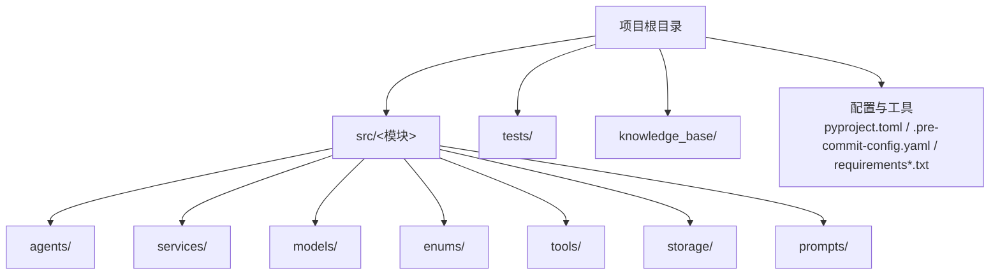
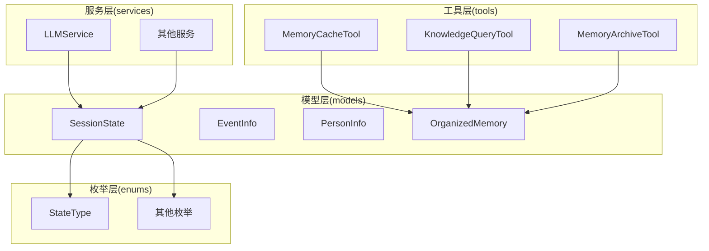
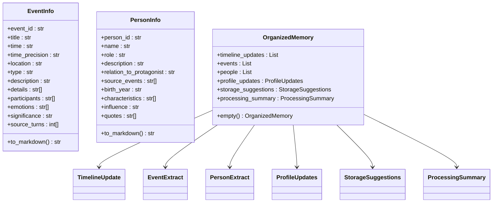
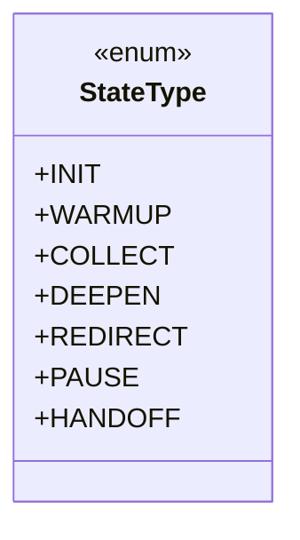
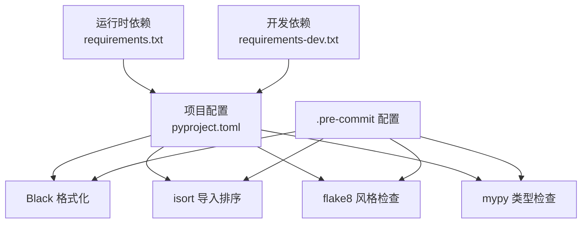

# 代码规范和约定

<cite>
**本文引用的文件**
- [README.md](file://README.md)
- [pyproject.toml](file://pyproject.toml)
- [.pre-commit-config.yaml](file://.pre-commit-config.yaml)
- [requirements.txt](file://requirements.txt)
- [requirements-dev.txt](file://requirements-dev.txt)
- [src/models/__init__.py](file://src/models/__init__.py)
- [src/enums/__init__.py](file://src/enums/__init__.py)
- [src/tools/__init__.py](file://src/tools/__init__.py)
- [src/services/__init__.py](file://src/services/__init__.py)
- [src/models/event_info.py](file://src/models/event_info.py)
- [src/models/person_info.py](file://src/models/person_info.py)
- [src/models/session_state.py](file://src/models/session_state.py)
- [src/models/organized_memory.py](file://src/models/organized_memory.py)
- [src/enums/state_type.py](file://src/enums/state_type.py)
</cite>

## 目录
1. [引言](#引言)
2. [项目结构](#项目结构)
3. [核心组件](#核心组件)
4. [架构总览](#架构总览)
5. [详细组件分析](#详细组件分析)
6. [依赖分析](#依赖分析)
7. [性能考虑](#性能考虑)
8. [故障排查指南](#故障排查指南)
9. [结论](#结论)
10. [附录](#附录)

## 引言
本文件旨在为本项目提供一套统一、可执行的代码规范与约定，覆盖以下方面：
- Python 代码风格与 PEP8 实践
- 命名约定（类、函数、变量、常量）
- 代码格式化与静态检查工具链
- 数据模型设计（Pydantic）与字段约束
- 注释与文档编写标准（docstring）
- 导入组织与模块化设计原则
- 项目特定的编码约定与最佳实践

本规范以项目现有工具链与代码实现为基础，结合实际工程经验制定，确保代码一致性、可读性与可维护性。

## 项目结构
本项目采用分层模块化组织方式，核心目录与职责如下：
- src/：源代码根目录，按功能域划分子包（agents、services、models、enums、tools、storage、prompts 等）
- tests/：单元测试目录
- knowledge_base/：知识库（Markdown 文件系统）
- 配置与工具：pyproject.toml（项目与工具配置）、.pre-commit-config.yaml（pre-commit 钩子）、requirements*.txt（依赖）

**章节来源**
- [README.md: 92-200:92-200](file://README.md#L92-L200)

## 核心组件
本节概述与代码规范直接相关的几个核心组件及其职责，便于后续规范落地：

- 数据模型层（models）：以 Pydantic 为核心的数据结构定义，统一字段约束、默认值与序列化行为。
- 枚举层（enums）：统一的状态、阶段、策略与类型枚举，保证跨模块一致性。
- 服务层（services）：封装业务逻辑与外部调用，提供稳定接口。
- 工具层（tools）：面向功能的可复用工具类。
- 模块导出（__init__.py）：集中导出公共 API，避免上层直接依赖内部实现细节。

**章节来源**
- [src/models/__init__.py: 1-86:1-86](file://src/models/__init__.py#L1-L86)
- [src/enums/__init__.py: 1-20:1-20](file://src/enums/__init__.py#L1-L20)
- [src/services/__init__.py: 1-8:1-8](file://src/services/__init__.py#L1-L8)
- [src/tools/__init__.py: 1-3:1-3](file://src/tools/__init__.py#L1-L3)

## 架构总览
下图展示与代码规范相关的关键组件关系与交互，体现“模型-枚举-服务-工具”的分层与依赖方向。

**图表来源**
- [src/models/session_state.py: 24-139:24-139](file://src/models/session_state.py#L24-L139)
- [src/models/event_info.py: 5-69:5-69](file://src/models/event_info.py#L5-L69)
- [src/models/person_info.py: 5-61:5-61](file://src/models/person_info.py#L5-L61)
- [src/models/organized_memory.py: 141-151:141-151](file://src/models/organized_memory.py#L141-L151)
- [src/enums/state_type.py: 4-12:4-12](file://src/enums/state_type.py#L4-L12)
- [src/services/__init__.py: 1-8:1-8](file://src/services/__init__.py#L1-L8)
- [src/tools/__init__.py: 1-3:1-3](file://src/tools/__init__.py#L1-L3)

## 详细组件分析

### 数据模型设计与 Pydantic 规范
- 字段定义与约束
  - 显式声明字段类型与默认值；必要时使用 Field(...) 提供描述与约束（如 ge/le、default_factory）。
  - 使用枚举类型限定取值范围，避免魔法字符串。
  - 对外暴露的序列化/反序列化行为由 Pydantic 自动处理，必要时在模型内提供 to_markdown 等序列化方法。
- 字段顺序与可读性
  - 将“基本信息”“扩展字段”“序列化方法”等分组排列，提升可读性。
- 验证规则
  - 利用 Pydantic 的类型系统与约束（如 Field(..., ge=0, le=1)）在构造阶段即拦截非法输入。
- 枚举使用
  - 在模型中使用强类型枚举，避免字符串拼写错误；必要时在 Config 中启用 use_enum_values 以统一序列化表现。

**图表来源**
- [src/models/event_info.py: 5-69:5-69](file://src/models/event_info.py#L5-L69)
- [src/models/person_info.py: 5-61:5-61](file://src/models/person_info.py#L5-L61)
- [src/models/organized_memory.py: 49-151:49-151](file://src/models/organized_memory.py#L49-L151)

**章节来源**
- [src/models/event_info.py: 5-69:5-69](file://src/models/event_info.py#L5-L69)
- [src/models/person_info.py: 5-61:5-61](file://src/models/person_info.py#L5-L61)
- [src/models/organized_memory.py: 6-46:6-46](file://src/models/organized_memory.py#L6-L46)
- [src/models/organized_memory.py: 141-151:141-151](file://src/models/organized_memory.py#L141-L151)

### 枚举与状态管理规范
- 枚举命名与取值
  - 使用清晰的枚举名（如 StateType），取值为小写字符串，便于序列化与日志可读性。
- 在模型中使用枚举
  - 将状态、阶段、策略等以枚举字段出现，避免字符串漂移。
- 配置与序列化
  - 如需统一序列化为枚举值，可在模型 Config 中开启 use_enum_values。

**图表来源**
- [src/enums/state_type.py: 4-12:4-12](file://src/enums/state_type.py#L4-L12)

**章节来源**
- [src/enums/state_type.py: 4-12:4-12](file://src/enums/state_type.py#L4-L12)
- [src/models/session_state.py: 84-86:84-86](file://src/models/session_state.py#L84-L86)

### 服务与工具模块导出规范
- 通过 __init__.py 集中导出公共 API，避免上层直接依赖内部实现细节。
- 导出项应与模块职责一致，保持简洁明确。

**章节来源**
- [src/services/__init__.py: 1-8:1-8](file://src/services/__init__.py#L1-L8)
- [src/tools/__init__.py: 1-3:1-3](file://src/tools/__init__.py#L1-L3)
- [src/models/__init__.py: 1-86:1-86](file://src/models/__init__.py#L1-L86)
- [src/enums/__init__.py: 1-20:1-20](file://src/enums/__init__.py#L1-L20)

### 代码风格与 PEP8 实践
- 行长度与缩进
  - 使用工具链限制行长度（Black 默认 88），保持一致缩进。
- 导入组织
  - 使用 isort 组织导入顺序，遵循“标准库/第三方/项目内”的层次。
- 类型检查
  - 使用 mypy 进行严格类型检查，开启 strict 模式，忽略缺失导入以适配动态环境。
- 静态检查
  - 使用 flake8 进行额外风格检查，配合 Black 与 isort 形成完整工具链。

**章节来源**
- [pyproject.toml: 11-25:11-25](file://pyproject.toml#L11-L25)
- [.pre-commit-config.yaml: 1-20:1-20](file://.pre-commit-config.yaml#L1-L20)

### 命名约定
- 类命名
  - 使用帕斯卡命名法（PascalCase），如 EventInfo、SessionState、OrganizedMemory。
- 函数与方法命名
  - 使用下划线命名法（snake_case），如 to_markdown、add_turn、update_coverage。
- 变量命名
  - 使用下划线命名法（snake_case），尽量语义化，避免缩写。
- 常量命名
  - 使用全大写下划线命名法（UPPER_CASE），如 TIME_PRECISION_YEAR。
- 模块与包命名
  - 使用下划线命名法（snake_case），避免与内置冲突。
- 枚举命名
  - 使用帕斯卡命名法（PascalCase），枚举值使用全大写（UPPER_CASE）。

**章节来源**
- [src/models/event_info.py: 5-69:5-69](file://src/models/event_info.py#L5-L69)
- [src/models/person_info.py: 5-61:5-61](file://src/models/person_info.py#L5-L61)
- [src/models/session_state.py: 24-139:24-139](file://src/models/session_state.py#L24-L139)
- [src/models/organized_memory.py: 141-151:141-151](file://src/models/organized_memory.py#L141-L151)
- [src/enums/state_type.py: 4-12:4-12](file://src/enums/state_type.py#L4-L12)

### 注释与文档编写标准
- docstring
  - 使用三引号 docstring，首行简述职责，空行后说明使用场景与注意事项。
  - 方法的 docstring 包含参数说明与返回值描述，保持简洁一致。
- 字段级注释
  - 对关键字段提供简短描述，说明用途与取值范围。
- 类型注解
  - 优先使用 typing 中的类型（如 List、Dict、Optional、Any），提升可读性与类型检查效果。
- 模块级说明
  - __init__.py 中可提供模块导出概览，帮助使用者快速定位公共 API。

**章节来源**
- [src/models/event_info.py: 6-17:6-17](file://src/models/event_info.py#L6-L17)
- [src/models/person_info.py: 6-17:6-17](file://src/models/person_info.py#L6-L17)
- [src/models/session_state.py: 25-37:25-37](file://src/models/session_state.py#L25-L37)

### 导入组织与模块化设计原则
- 导入顺序
  - 标准库 → 第三方库 → 项目内模块；同一层级内按字母序排列。
- 相对导入与绝对导入
  - 在包内使用相对导入；跨包使用绝对导入，避免循环依赖。
- __all__ 导出
  - 在 __init__.py 中显式列出导出项，避免 from package import * 泄露内部实现。
- 低耦合高内聚
  - 模型与服务分离，枚举集中管理，工具类单一职责。
- 可测试性
  - 通过清晰的接口与最小依赖，便于单元测试与模拟。

**章节来源**
- [src/models/__init__.py: 41-86:41-86](file://src/models/__init__.py#L41-L86)
- [src/enums/__init__.py: 12-20:12-20](file://src/enums/__init__.py#L12-L20)
- [src/services/__init__.py: 3-8:3-8](file://src/services/__init__.py#L3-L8)
- [src/tools/__init__.py: 1-3:1-3](file://src/tools/__init__.py#L1-L3)

## 依赖分析
项目依赖与工具链关系如下：
- 运行时依赖：langchain、langgraph、pydantic、openai 等
- 开发依赖：pytest、black、isort、flake8、mypy、pre-commit
- 工具链配置：pyproject.toml 与 .pre-commit-config.yaml

**图表来源**
- [requirements.txt: 1-24:1-24](file://requirements.txt#L1-L24)
- [requirements-dev.txt: 1-13:1-13](file://requirements-dev.txt#L1-L13)
- [pyproject.toml: 11-25:11-25](file://pyproject.toml#L11-L25)
- [.pre-commit-config.yaml: 1-20:1-20](file://.pre-commit-config.yaml#L1-L20)

**章节来源**
- [requirements.txt: 1-24:1-24](file://requirements.txt#L1-L24)
- [requirements-dev.txt: 1-13:1-13](file://requirements-dev.txt#L1-L13)
- [pyproject.toml: 11-25:11-25](file://pyproject.toml#L11-L25)
- [.pre-commit-config.yaml: 1-20:1-20](file://.pre-commit-config.yaml#L1-L20)

## 性能考虑
- 类型检查与静态分析
  - 使用 mypy 的 strict 模式在开发期发现潜在性能与正确性问题。
- 代码格式化与导入排序
  - Black 与 isort 自动化减少人工成本，避免因风格差异导致的 diff 增大。
- 日志与可观测性
  - 使用 loguru 等日志库，避免在热路径中进行昂贵操作（如频繁格式化字符串）。
- 模型序列化
  - 在模型中提供轻量序列化方法（如 to_markdown），避免在运行时重复计算。

[本节为通用指导，无需列出章节来源]

## 故障排查指南
- 代码风格问题
  - 现象：CI 报告 flake8 错误或 Black 格式化失败
  - 处理：在本地运行 black、isort、flake8 修复；或启用 pre-commit 自动化
- 类型检查失败
  - 现象：mypy 报错
  - 处理：补齐类型注解，修正不兼容的类型使用
- 导入顺序问题
  - 现象：isort 报告顺序错误
  - 处理：按 isort 配置调整导入顺序
- 运行时异常
  - 现象：Pydantic 校验失败
  - 处理：检查字段约束与默认值，确保输入满足 Field(..., ...) 约束

**章节来源**
- [.pre-commit-config.yaml: 1-20:1-20](file://.pre-commit-config.yaml#L1-L20)
- [pyproject.toml: 11-25:11-25](file://pyproject.toml#L11-L25)

## 结论
本规范以工具链与现有代码实现为基础，明确了 Python 代码风格、命名约定、数据模型设计、注释与文档、导入组织与模块化原则。建议团队在日常开发中：
- 严格遵循工具链配置，确保代码风格一致
- 使用 Pydantic 强类型模型与枚举，提升可维护性
- 通过清晰的 docstring 与类型注解增强可读性
- 通过集中导出与模块化设计降低耦合

[本节为总结性内容，无需列出章节来源]

## 附录

### 工具链与命令参考
- 格式化：black src/
- 导入排序：isort src/
- 类型检查：mypy src/
- 风格检查：flake8 src/
- 运行测试：pytest

**章节来源**
- [README.md: 280-294:280-294](file://README.md#L280-L294)