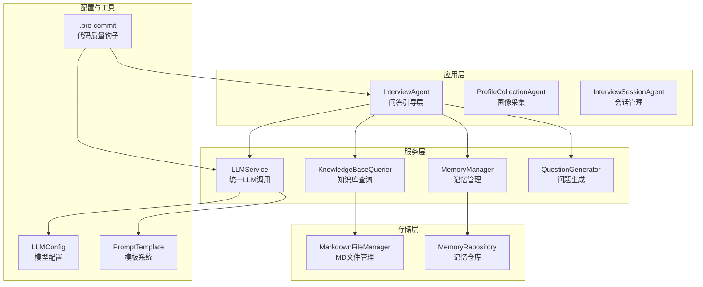
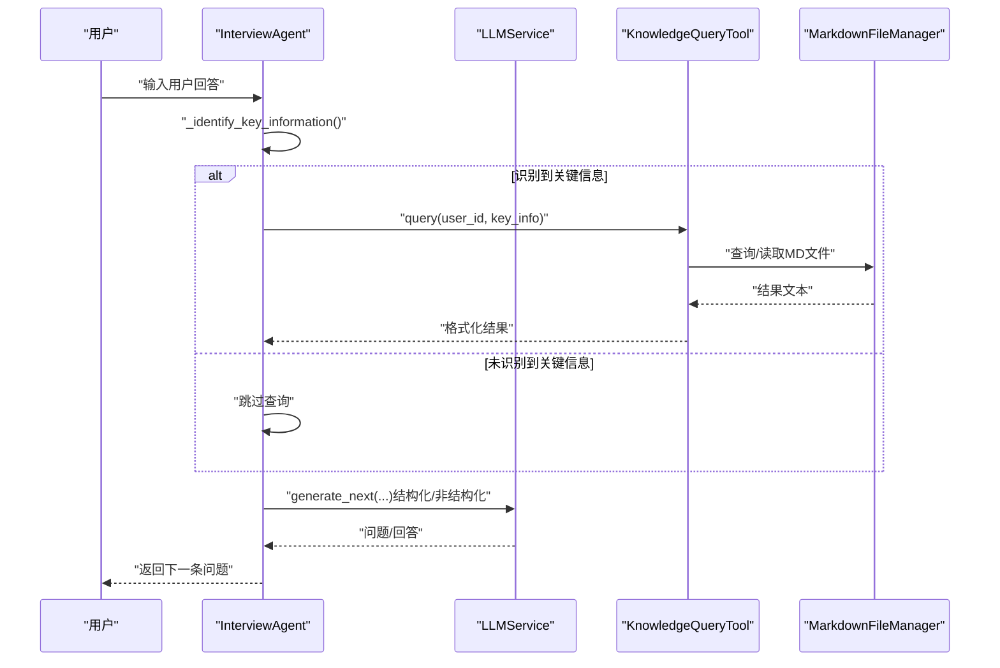
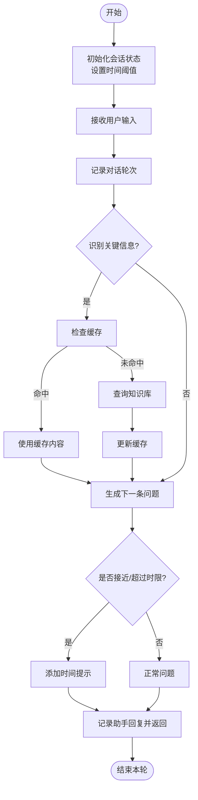
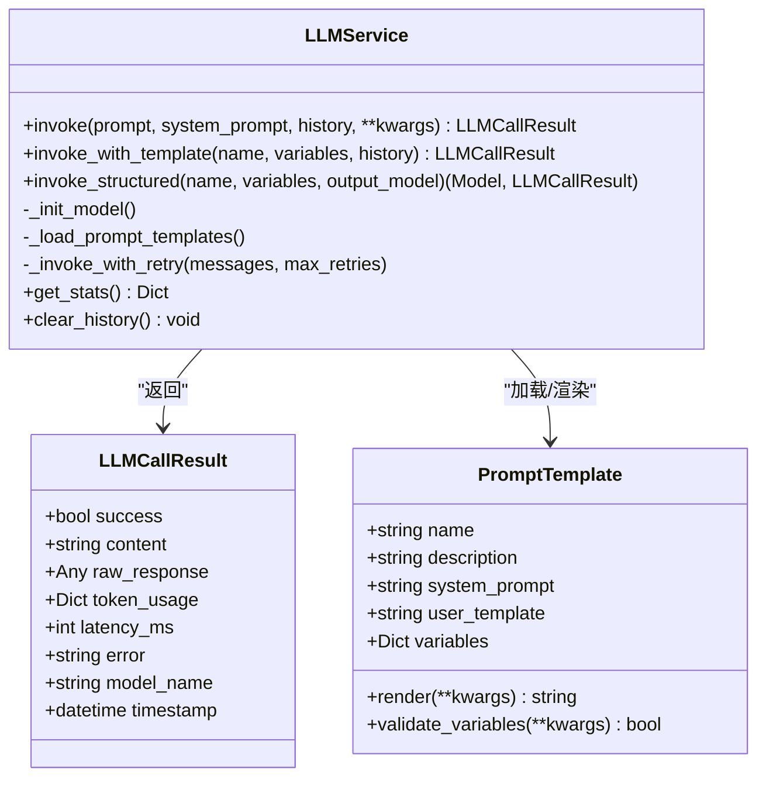
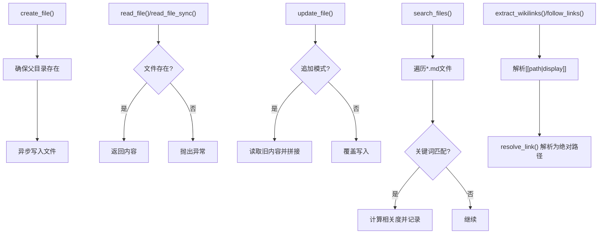
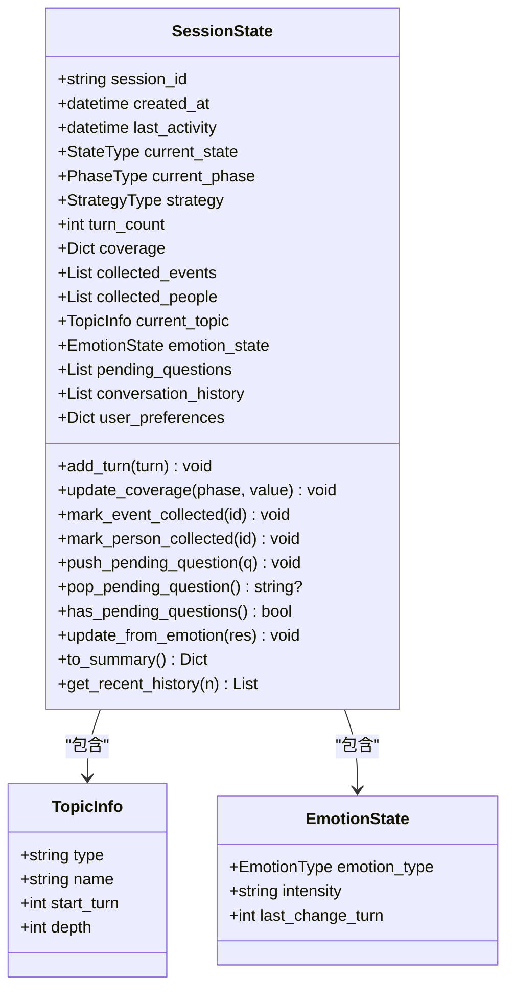
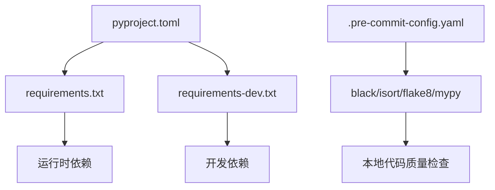

# 开发指南

<cite>
**本文引用的文件**
- [README.md](file://README.md)
- [pyproject.toml](file://pyproject.toml)
- [requirements.txt](file://requirements.txt)
- [requirements-dev.txt](file://requirements-dev.txt)
- [.pre-commit-config.yaml](file://.pre-commit-config.yaml)
- [src/agents/interview_agent.py](file://src/agents/interview_agent.py)
- [src/services/llm_service.py](file://src/services/llm_service.py)
- [src/storage/markdown_file_manager.py](file://src/storage/markdown_file_manager.py)
- [src/models/session_state.py](file://src/models/session_state.py)
- [src/config/llm_config.py](file://src/config/llm_config.py)
- [src/prompts/base.py](file://src/prompts/base.py)
- [src/enums/state_type.py](file://src/enums/state_type.py)
- [src/tools/knowledge_query_tool.py](file://src/tools/knowledge_query_tool.py)
- [tests/test_llm_service.py](file://tests/test_llm_service.py)
- [开发故事卡/Task-001-实现数据对象.md](file://开发故事卡/Task-001-实现数据对象.md)
</cite>

## 目录
1. [简介](#简介)
2. [项目结构](#项目结构)
3. [核心组件](#核心组件)
4. [架构总览](#架构总览)
5. [详细组件分析](#详细组件分析)
6. [依赖分析](#依赖分析)
7. [性能考虑](#性能考虑)
8. [故障排查指南](#故障排查指南)
9. [结论](#结论)
10. [附录](#附录)

## 简介
本指南面向参与“老人自传 Agent 系统”开发的工程师，提供从环境搭建、代码规范、开发流程、新功能开发到扩展与贡献的全流程技术文档。系统采用 Python + LangChain/LangGraph 技术栈，围绕“问答引导层”“结构化整理层”“记忆管理层”“写作生成层”的分层架构，通过统一的 LLM 服务与 Prompt 模板体系，实现对老人人生故事的采集、整理与生成。

## 项目结构
项目采用按功能域划分的模块化组织方式，核心目录与职责如下：
- src/：源代码根目录
  - agents/：Agent 实现（如 InterviewAgent）
  - services/：服务层（LLMService、知识库查询、记忆管理等）
  - storage/：存储层（Markdown 文件管理、记忆仓库）
  - models/：数据模型与枚举
  - tools/：工具类（知识查询、缓存、归档）
  - prompts/：Prompt 模板（Python 模块与 Markdown 文件）
  - config/：配置管理（LLM 配置）
- tests/：单元测试
- Prompts/：Prompt 文档集合
- knowledge_base/：用户知识库（Markdown 文件系统）
- 配置文件：pyproject.toml、requirements*.txt、.pre-commit-config.yaml

图表来源
- [src/agents/interview_agent.py](file://src/agents/interview_agent.py)
- [src/services/llm_service.py](file://src/services/llm_service.py)
- [src/storage/markdown_file_manager.py](file://src/storage/markdown_file_manager.py)
- [src/config/llm_config.py](file://src/config/llm_config.py)
- [src/prompts/base.py](file://src/prompts/base.py)
- [.pre-commit-config.yaml](file://.pre-commit-config.yaml)

章节来源
- [README.md:92-200](file://README.md#L92-L200)

## 核心组件
- InterviewAgent：问答引导层主体，负责启动会话、生成问题、识别关键信息、查询知识库、缓存管理与时间控制。
- LLMService：统一的大模型调用入口，封装 LangChain 调用、Prompt 模板加载、结构化输出、重试与统计。
- MarkdownFileManager：知识库文件系统管理，提供创建/读取/更新、全文搜索、Wiki 链接追踪与目录结构保证。
- SessionState：会话状态核心数据对象，贯穿会话生命周期，记录状态、阶段、策略、覆盖率、对话历史与情绪状态。
- LLMConfig：模型配置，支持从环境变量加载，优先使用 DeepSeek 专属配置。
- KnowledgeQueryTool：知识库查询工具，封装查询与结果格式化。
- PromptTemplate：Prompt 模板抽象，支持变量渲染与校验。

章节来源
- [src/agents/interview_agent.py:16-346](file://src/agents/interview_agent.py#L16-L346)
- [src/services/llm_service.py:32-481](file://src/services/llm_service.py#L32-L481)
- [src/storage/markdown_file_manager.py:31-546](file://src/storage/markdown_file_manager.py#L31-L546)
- [src/models/session_state.py:24-139](file://src/models/session_state.py#L24-L139)
- [src/config/llm_config.py:10-120](file://src/config/llm_config.py#L10-L120)
- [src/tools/knowledge_query_tool.py:11-81](file://src/tools/knowledge_query_tool.py#L11-L81)
- [src/prompts/base.py:6-33](file://src/prompts/base.py#L6-L33)

## 架构总览
系统采用分层架构与统一服务入口：
- 问答引导层：InterviewAgent 驱动对话，结合 QuestionGenerator 生成问题，调用 LLMService 与 KnowledgeQueryTool。
- 结构化整理层：由后续 Agent 与服务承接（本指南聚焦引导层与服务层）。
- 记忆管理层：MarkdownFileManager + MemoryRepository 提供持久化与检索。
- 写作生成层：基于记忆库生成章节草稿（本指南不展开实现细节）。

图表来源
- [src/agents/interview_agent.py:115-184](file://src/agents/interview_agent.py#L115-L184)
- [src/services/llm_service.py:225-325](file://src/services/llm_service.py#L225-L325)
- [src/tools/knowledge_query_tool.py:33-66](file://src/tools/knowledge_query_tool.py#L33-L66)
- [src/storage/markdown_file_manager.py:134-200](file://src/storage/markdown_file_manager.py#L134-L200)

## 详细组件分析

### InterviewAgent 组件分析
职责与流程
- 启动会话：根据 resume_prompt 或标准模板生成开场白，并记录对话轮次。
- 处理输入：记录用户回答、识别关键信息（事件/人物/时间/地点）、缓存命中判断、知识库查询、更新缓存、生成下一条问题、时间阈值控制与告警。
- 结束引导：加载结束 Prompt，注入会话统计与历史，生成温和结束语并保存会话摘要。

图表来源
- [src/agents/interview_agent.py:80-184](file://src/agents/interview_agent.py#L80-L184)

章节来源
- [src/agents/interview_agent.py:16-346](file://src/agents/interview_agent.py#L16-L346)

### LLMService 组件分析
职责与能力
- 统一模型初始化与调用，支持 OpenAI/DeepSeek/Anthropic。
- Prompt 模板加载与渲染，支持从 Python 模块与 Markdown 文件加载。
- 结构化输出调用，基于 Pydantic 模型解析 JSON。
- 带指数退避的重试机制、调用统计与历史记录。

图表来源
- [src/services/llm_service.py:32-481](file://src/services/llm_service.py#L32-L481)
- [src/prompts/base.py:6-33](file://src/prompts/base.py#L6-L33)

章节来源
- [src/services/llm_service.py:32-481](file://src/services/llm_service.py#L32-L481)
- [src/prompts/base.py:6-33](file://src/prompts/base.py#L6-L33)

### MarkdownFileManager 组件分析
职责与能力
- 确保知识库目录结构（events/、people/、timeline、themes 等）。
- 提供创建/读取/更新/追加章节的异步接口。
- 全文搜索与相关度评分，支持 Wiki 链接提取与追踪。
- 链接解析与文件统计。

图表来源
- [src/storage/markdown_file_manager.py:134-546](file://src/storage/markdown_file_manager.py#L134-L546)

章节来源
- [src/storage/markdown_file_manager.py:31-546](file://src/storage/markdown_file_manager.py#L31-L546)

### SessionState 组件分析
职责与能力
- 记录会话基本信息、当前状态/阶段/策略、对话轮数与覆盖率。
- 管理已采集事件/人物、当前话题、情绪状态、待追问问题与对话历史。
- 提供状态摘要与最近历史查询。

图表来源
- [src/models/session_state.py:24-139](file://src/models/session_state.py#L24-L139)

章节来源
- [src/models/session_state.py:24-139](file://src/models/session_state.py#L24-L139)

### LLMConfig 与 PromptTemplate
- LLMConfig：从环境变量加载模型配置，优先使用 DeepSeek 专属变量；支持重试与超时配置。
- PromptTemplate：提供模板渲染与变量校验，支持从 Markdown 文件解析模板内容与变量说明。

章节来源
- [src/config/llm_config.py:10-120](file://src/config/llm_config.py#L10-L120)
- [src/prompts/base.py:6-33](file://src/prompts/base.py#L6-L33)

### KnowledgeQueryTool
- 封装 KnowledgeBaseQuerier 的调用，提供简洁的查询接口与结果格式化。
- 确保查询目标路径包含 user_id，便于隔离用户知识库。

章节来源
- [src/tools/knowledge_query_tool.py:11-81](file://src/tools/knowledge_query_tool.py#L11-L81)

## 依赖分析
- 运行时依赖：LangChain、LangGraph、Pydantic、OpenAI/LangChain-OpenAI、LangChain-Anthropic、aiofiles、httpx、python-dotenv、pyyaml、rich、loguru、watchdog。
- 开发依赖：pytest、pytest-asyncio、pytest-cov、black、isort、flake8、mypy、pre-commit。
- 项目配置：pyproject.toml 定义项目元信息、可选开发依赖与工具配置；.pre-commit-config.yaml 配置代码质量钩子。

图表来源
- [pyproject.toml:1-26](file://pyproject.toml#L1-L26)
- [requirements.txt:1-24](file://requirements.txt#L1-L24)
- [requirements-dev.txt:1-13](file://requirements-dev.txt#L1-L13)
- [.pre-commit-config.yaml:1-20](file://.pre-commit-config.yaml#L1-L20)

章节来源
- [pyproject.toml:1-26](file://pyproject.toml#L1-L26)
- [requirements.txt:1-24](file://requirements.txt#L1-L24)
- [requirements-dev.txt:1-13](file://requirements-dev.txt#L1-L13)
- [.pre-commit-config.yaml:1-20](file://.pre-commit-config.yaml#L1-L20)

## 性能考虑
- 异步 I/O：MarkdownFileManager 使用异步文件读写，降低 I/O 阻塞风险。
- 缓存策略：InterviewAgent 通过 MemoryCacheTool 与 KnowledgeQueryTool 的缓存减少重复查询。
- 重试与退避：LLMService 的指数退避重试提升稳定性，避免瞬时错误导致失败。
- Token 与延迟统计：LLMService 记录 token 使用与平均延迟，便于成本与性能评估。
- 搜索相关度：MarkdownFileManager 的全文搜索采用相关度评分与上下文截取，平衡召回与性能。

章节来源
- [src/storage/markdown_file_manager.py:134-546](file://src/storage/markdown_file_manager.py#L134-L546)
- [src/agents/interview_agent.py:134-162](file://src/agents/interview_agent.py#L134-L162)
- [src/services/llm_service.py:400-438](file://src/services/llm_service.py#L400-L438)
- [src/services/llm_service.py:449-462](file://src/services/llm_service.py#L449-L462)

## 故障排查指南
常见问题与定位思路
- LLM 调用失败：检查 LLMConfig 的 provider/model_name/base_url/api_key 配置；查看 LLMService 的错误日志与重试次数。
- Prompt 模板缺失：确认模板名称与变量是否正确；检查 Markdown 模板文件的解析逻辑。
- 知识库查询无结果：确认 user_id 与目标路径；检查 MarkdownFileManager 的目录结构与文件存在性。
- 缓存未生效：确认缓存键（tags/query）构造是否一致；检查 MemoryCacheTool 的读写逻辑。
- 测试用例失败：参考测试用例对 LLMService 的模拟与断言，定位具体调用链路。

章节来源
- [tests/test_llm_service.py:1-187](file://tests/test_llm_service.py#L1-L187)
- [src/services/llm_service.py:225-325](file://src/services/llm_service.py#L225-L325)
- [src/storage/markdown_file_manager.py:134-200](file://src/storage/markdown_file_manager.py#L134-L200)
- [src/tools/knowledge_query_tool.py:33-66](file://src/tools/knowledge_query_tool.py#L33-L66)

## 结论
本指南提供了从环境搭建、代码规范、开发流程到扩展与贡献的完整技术路径。通过统一的 LLM 服务与 Prompt 模板体系、清晰的分层架构与严格的测试保障，开发者可以高效地扩展问答引导层与记忆管理层功能，持续提升系统的稳定性与可维护性。

## 附录

### 开发环境搭建与 IDE 配置
- 环境要求：Python 3.10+，支持 macOS/Linux/Windows。
- 虚拟环境：使用 venv 创建隔离环境，激活后安装生产与开发依赖。
- 环境变量：复制 .env.example 并配置 LLM 提供商的 URL 与 API Key。
- 代码质量：安装 pre-commit 钩子，确保提交前执行 black、isort、flake8、mypy。

章节来源
- [README.md:206-294](file://README.md#L206-L294)
- [.pre-commit-config.yaml:1-20](file://.pre-commit-config.yaml#L1-L20)

### 代码规范与约定
- 格式化与导入排序：使用 black 与 isort，统一行宽与导入顺序。
- 类型检查：mypy 严格模式，确保类型安全。
- 测试：pytest 异步测试，建议配合 pytest-asyncio 与 pytest-cov。
- 提交前检查：pre-commit 钩子自动执行上述检查。

章节来源
- [pyproject.toml:11-25](file://pyproject.toml#L11-L25)
- [requirements-dev.txt:1-13](file://requirements-dev.txt#L1-L13)
- [.pre-commit-config.yaml:1-20](file://.pre-commit-config.yaml#L1-L20)

### 开发流程与工作流管理
- 分支策略：功能开发在 feature/* 分支，修复在 fix/* 分支，稳定版本合并到 main/master。
- 代码审查：提交前确保通过本地 pre-commit 与 pytest；PR 需至少一名维护者审核。
- 版本控制最佳实践：提交信息使用 feat/fix/docs/style/test 标注；避免提交敏感信息至仓库。

章节来源
- [README.md:411-433](file://README.md#L411-L433)

### 新功能开发指南
- 需求分析：明确功能边界与用户场景，参考“开发故事卡”文档进行拆解。
- 设计文档：定义数据模型（models）、服务接口（services）、工具类（tools）与 Prompt 模板。
- 实现步骤：先实现数据模型与服务，再编写工具与 Agent 集成；最后完善测试。
- 测试验证：新增单元测试覆盖关键路径，确保异步调用与错误处理正确。

章节来源
- [开发故事卡/Task-001-实现数据对象.md:1-955](file://开发故事卡/Task-001-实现数据对象.md#L1-L955)

### 扩展开发方法
- 插件系统：通过 Prompt 模板与工具类扩展问答策略与知识库查询能力。
- API 扩展：在 services 层新增服务类，统一接入 LLMService 与配置管理。
- 第三方集成：在 LLMConfig 中新增提供商配置，或在 tools 层封装新的工具类。

章节来源
- [src/config/llm_config.py:10-120](file://src/config/llm_config.py#L10-L120)
- [src/prompts/base.py:6-33](file://src/prompts/base.py#L6-L33)
- [src/tools/knowledge_query_tool.py:11-81](file://src/tools/knowledge_query_tool.py#L11-L81)

### 贡献指南与社区参与
- 提交 Issue 与 Pull Request：fork 仓库后在功能分支上开发，提交 PR 并等待审核。
- 行为准则：尊重与包容，遵守开源协议与社区规范。

章节来源
- [README.md:470-480](file://README.md#L470-L480)