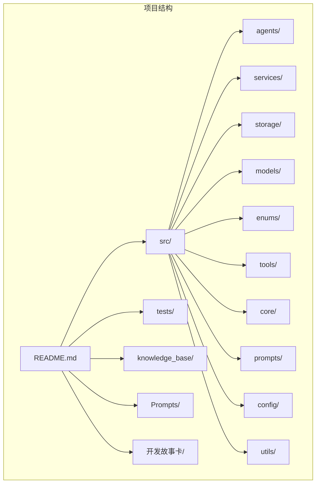
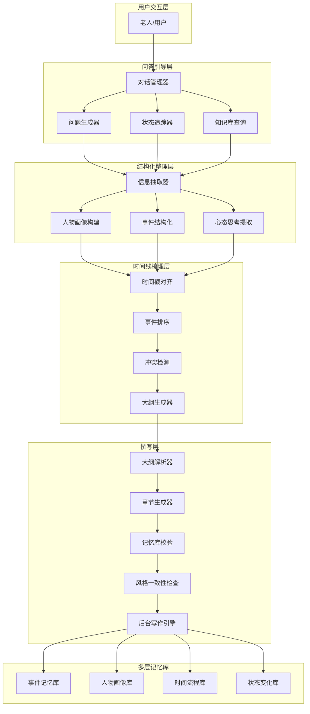
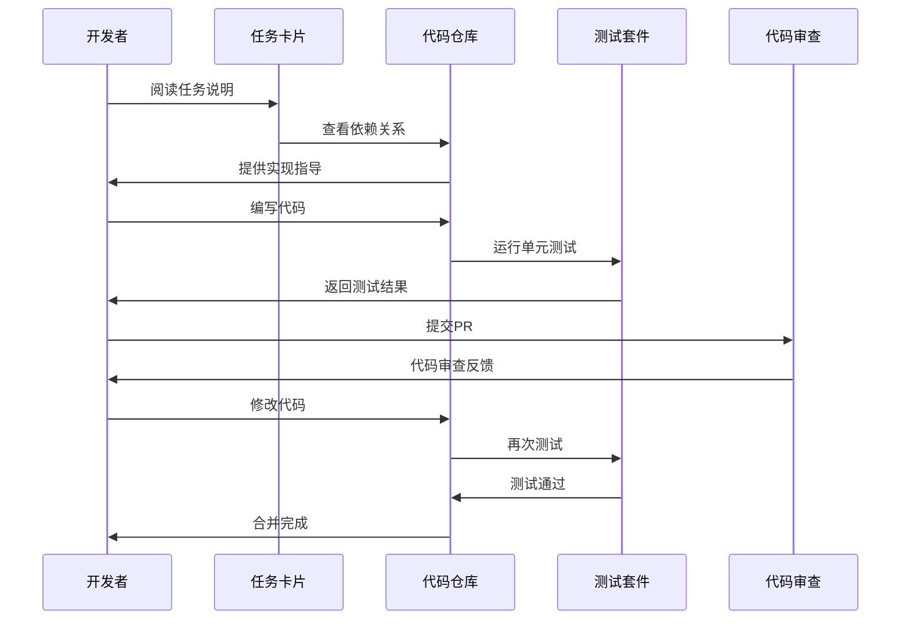
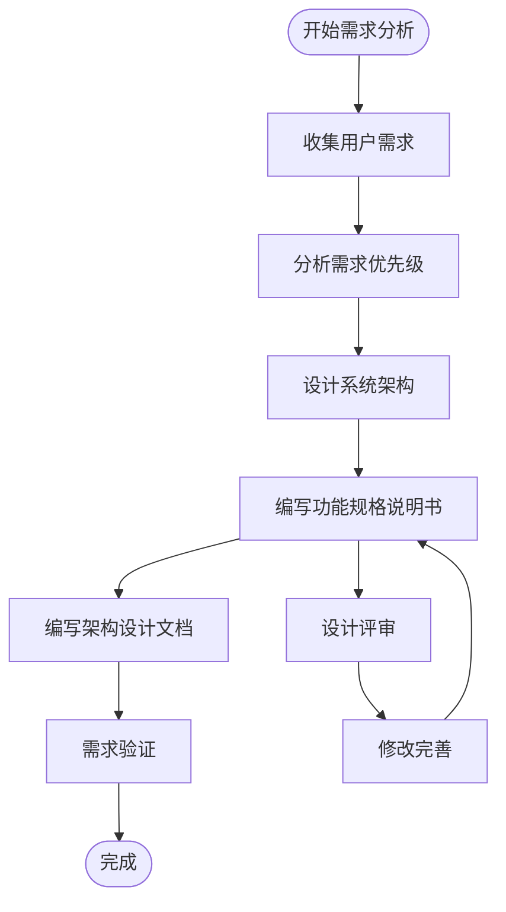
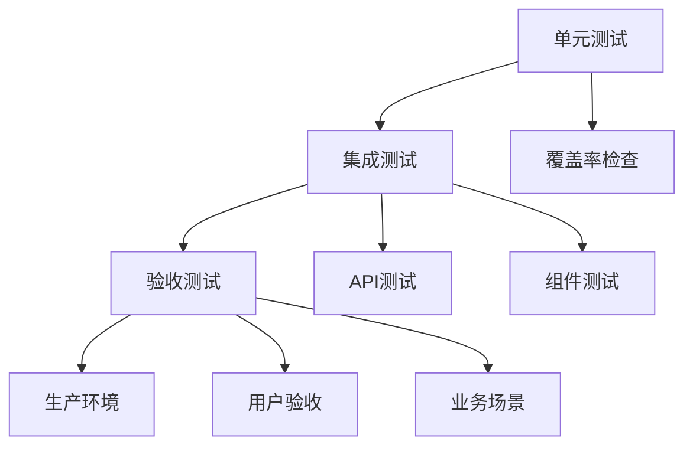
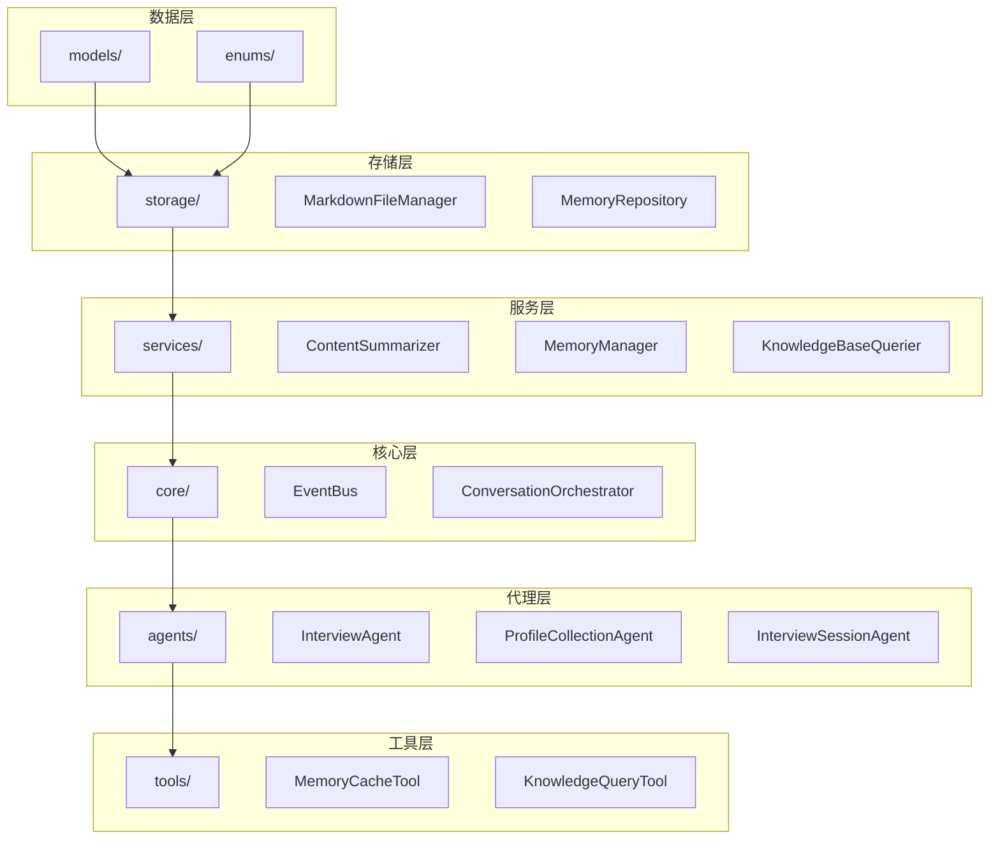

# 开发流程和工作流

<cite>
**本文档引用的文件**
- [README.md](file://README.md)
- [老人自传 Agent 协作架构.md](file://老人自传 Agent 协作架构.md)
- [老人自传写作指南.md](file://老人自传写作指南.md)
- [问答引导层Agent-系统架构设计.md](file://问答引导层Agent-系统架构设计.md)
- [开发故事卡/Task-001-实现数据对象.md](file://开发故事卡/Task-001-实现数据对象.md)
- [开发故事卡/Task-003-实现MarkdownFileManager.md](file://开发故事卡/Task-003-实现MarkdownFileManager.md)
- [开发故事卡/Task-004-005-实现MemoryRepository和MemoryManager.md](file://开发故事卡/Task-004-005-实现MemoryRepository和MemoryManager.md)
- [开发故事卡/Task-009-012-实现系统组装层.md](file://开发故事卡/Task-009-012-实现系统组装层.md)
- [开发故事卡/Task-013-实现Agent服务主体.md](file://开发故事卡/Task-013-实现Agent服务主体.md)
- [开发故事卡/Refactor-底层代码优化重构Spec.md](file://开发故事卡/Refactor-底层代码优化重构Spec.md)
- [pyproject.toml](file://pyproject.toml)
- [requirements.txt](file://requirements.txt)
- [requirements-dev.txt](file://requirements-dev.txt)
</cite>

## 目录
1. [项目概述](#项目概述)
2. [项目结构](#项目结构)
3. [核心组件](#核心组件)
4. [架构总览](#架构总览)
5. [详细组件分析](#详细组件分析)
6. [依赖关系分析](#依赖关系分析)
7. [性能考虑](#性能考虑)
8. [故障排除指南](#故障排除指南)
9. [结论](#结论)
10. [附录](#附录)

## 项目概述
本项目是一个基于大语言模型的智能对话系统，通过与老人进行多轮友好访谈，收集、整理和归纳人生经历，最终生成完整的自传文本。系统采用分层解耦的设计，包含问答引导层、结构化整理层、时间线梳理层、多层记忆库和撰写层五大协作模块，支持多模态输入、情绪识别与安抚、知识库管理、语义检索和内容归纳。

## 项目结构
项目采用模块化组织方式，核心目录结构如下：
- `src/`：源代码目录，包含各功能模块
- `tests/`：单元测试目录
- `knowledge_base/`：知识库（Markdown 文件系统）
- `Prompts/`：Prompt 文档目录
- `开发故事卡/`：任务卡片文档

**图表来源**
- [README.md:92-200](file://README.md#L92-L200)

**章节来源**
- [README.md:92-200](file://README.md#L92-L200)

## 核心组件
系统包含以下核心组件：

### 数据对象层
- **会话状态管理**：SessionState、ConversationTurn、EmotionResult
- **记忆数据结构**：EventInfo、PersonInfo、MemoryQueryResult
- **传输数据结构**：SummaryContent、HandoffPackage
- **枚举类型**：StateType、PhaseType、StrategyType、EmotionType

### 服务层
- **问答引导服务**：QuestionGenerator、EmotionDetector、KnowledgeBaseQuerier
- **内容处理服务**：ContentSummarizer、MemoryManager
- **系统协调服务**：EventBus、ConversationOrchestrator

### 存储层
- **文件管理**：MarkdownFileManager
- **记忆仓储**：MemoryRepository
- **工具集**：MemoryCacheTool、KnowledgeQueryTool、MemoryArchiveTool

**章节来源**
- [开发故事卡/Task-001-实现数据对象.md:42-80](file://开发故事卡/Task-001-实现数据对象.md#L42-L80)
- [开发故事卡/Task-003-实现MarkdownFileManager.md:65-68](file://开发故事卡/Task-003-实现MarkdownFileManager.md#L65-L68)
- [开发故事卡/Task-004-005-实现MemoryRepository和MemoryManager.md:55-57](file://开发故事卡/Task-004-005-实现MemoryRepository和MemoryManager.md#L55-L57)

## 架构总览
系统采用分层解耦的协作架构，各层职责清晰，通过事件总线实现松耦合通信。

**图表来源**
- [老人自传 Agent 协作架构.md:9-101](file://老人自传 Agent 协作架构.md#L9-L101)

**章节来源**
- [老人自传 Agent 协作架构.md:9-101](file://老人自传 Agent 协作架构.md#L9-L101)

## 详细组件分析

### 任务卡片开发流程

#### Task-001：实现数据对象
这是整个系统的基础，需要实现所有数据对象：
- **SessionState**：会话状态管理
- **ConversationTurn**：对话轮次记录
- **EmotionResult**：情绪识别结果
- **MemoryQueryResult**：记忆查询结果
- **SummaryContent**：归纳内容结构
- **HandoffPackage**：交接包
- **EventInfo/PersonInfo**：事件和人物信息
- **AgentResponse**：Agent响应结构

#### Task-003：实现MarkdownFileManager
负责管理md格式的记忆库文件系统：
- 文件的创建、读取、更新、搜索
- Wiki风格链接的追踪
- 全文搜索功能
- 异步IO操作

#### Task-004-005：实现MemoryRepository和MemoryManager
实现记忆管理的核心组件：
- **MemoryRepository**：记忆仓储，统一管理三层记忆的存储
- **MemoryManager**：记忆管理服务，提供记忆读写的高级接口

#### Task-009-012：实现系统组装层
实现系统组装层组件：
- **ContentSummarizer**：内容归纳服务
- **EventBus**：事件总线
- **ConversationOrchestrator**：对话主控器
- **HandoffPackage生成**：交接包生成

#### Task-013：实现Agent服务主体
实现 Agent 服务主体（InterviewSessionAgent）：
- 会话生命周期管理
- 流程调度（初始化→采访→结束）
- 时间控制（15分钟限制）
- 知识库协调

**图表来源**
- [开发故事卡/Task-001-实现数据对象.md:10-14](file://开发故事卡/Task-001-实现数据对象.md#L10-L14)
- [开发故事卡/Task-003-实现MarkdownFileManager.md:10-14](file://开发故事卡/Task-003-实现MarkdownFileManager.md#L10-L14)

**章节来源**
- [开发故事卡/Task-001-实现数据对象.md:10-14](file://开发故事卡/Task-001-实现数据对象.md#L10-L14)
- [开发故事卡/Task-003-实现MarkdownFileManager.md:10-14](file://开发故事卡/Task-003-实现MarkdownFileManager.md#L10-L14)
- [开发故事卡/Task-004-005-实现MemoryRepository和MemoryManager.md:10-16](file://开发故事卡/Task-004-005-实现MemoryRepository和MemoryManager.md#L10-L16)
- [开发故事卡/Task-009-012-实现系统组装层.md:10-18](file://开发故事卡/Task-009-012-实现系统组装层.md#L10-L18)
- [开发故事卡/Task-013-实现Agent服务主体.md:10-21](file://开发故事卡/Task-013-实现Agent服务主体.md#L10-L21)

### 需求分析和设计文档编写流程

#### 功能规格说明书编写
1. **需求收集**：通过用户访谈和观察收集需求
2. **需求分析**：分析用户痛点和业务场景
3. **功能定义**：明确核心功能和边界
4. **非功能性需求**：性能、安全性、可用性要求
5. **约束条件**：技术约束、法规要求

#### 架构设计文档编写
1. **系统架构设计**：定义整体架构和组件关系
2. **详细设计**：各模块的详细设计方案
3. **数据流设计**：定义数据在系统中的流动
4. **接口设计**：定义模块间的接口规范
5. **部署设计**：定义系统的部署方案

**图表来源**
- [老人自传写作指南.md:1-253](file://老人自传写作指南.md#L1-L253)
- [问答引导层Agent-系统架构设计.md:9-63](file://问答引导层Agent-系统架构设计.md#L9-L63)

**章节来源**
- [老人自传写作指南.md:1-253](file://老人自传写作指南.md#L1-L253)
- [问答引导层Agent-系统架构设计.md:9-63](file://问答引导层Agent-系统架构设计.md#L9-L63)

### 实现步骤和代码提交规范

#### 开发流程
1. **创建功能分支**：基于develop分支创建功能分支
2. **编写代码**：按照任务卡片要求实现功能
3. **运行测试**：确保代码通过所有测试
4. **代码格式化**：使用Black和isort格式化代码
5. **类型检查**：使用mypy进行类型检查
6. **提交代码**：提交到功能分支
7. **代码审查**：发起Pull Request进行代码审查
8. **合并代码**：通过审查后合并到develop分支

#### 分支策略
- **main**：生产环境分支
- **develop**：开发环境分支
- **feature/**：功能开发分支
- **hotfix/**：紧急修复分支
- **release/**：发布准备分支

#### 代码审查流程
1. **自检**：开发者进行代码自检
2. **提交PR**：创建Pull Request
3. **分配审查者**：指派团队成员进行审查
4. **审查反馈**：审查者提供反馈意见
5. **修改代码**：根据反馈修改代码
6. **再次审查**：重新进行代码审查
7. **批准合并**：审查通过后批准合并

**章节来源**
- [README.md:411-434](file://README.md#L411-L434)
- [开发故事卡/Refactor-底层代码优化重构Spec.md:458-467](file://开发故事卡/Refactor-底层代码优化重构Spec.md#L458-L467)

### 测试验证流程

#### 单元测试
- **测试覆盖率**：确保关键代码具有足够的测试覆盖率
- **测试用例设计**：覆盖正常流程、异常流程和边界条件
- **模拟依赖**：使用Mock对象模拟外部依赖
- **测试数据管理**：使用测试专用的数据集

#### 集成测试
- **组件集成测试**：测试多个组件协同工作
- **API测试**：测试系统的对外接口
- **端到端测试**：测试完整的用户流程
- **性能测试**：测试系统的性能指标

#### 验收测试
- **用户验收测试**：由最终用户进行验收测试
- **业务场景测试**：测试真实的业务场景
- **回归测试**：确保新功能不影响现有功能
- **兼容性测试**：测试不同环境下的兼容性

**图表来源**
- [开发故事卡/Task-003-实现MarkdownFileManager.md:525-575](file://开发故事卡/Task-003-实现MarkdownFileManager.md#L525-L575)

**章节来源**
- [开发故事卡/Task-003-实现MarkdownFileManager.md:525-575](file://开发故事卡/Task-003-实现MarkdownFileManager.md#L525-L575)

### 版本控制最佳实践

#### Git工作流
- **提交频率**：保持小步快跑，频繁提交
- **提交信息**：使用清晰的提交信息描述变更内容
- **分支管理**：合理使用分支策略管理代码演进
- **冲突解决**：及时解决代码冲突，避免长时间分叉

#### 提交消息规范
- **类型**：feat、fix、docs、style、refactor、test、chore
- **范围**：指定受影响的模块或文件
- **描述**：简洁明了描述变更内容
- **关联**：关联相关的Issue或任务

#### 冲突解决策略
1. **预防冲突**：定期同步上游分支，减少冲突机会
2. **及时解决**：发现冲突立即解决，不要拖延
3. **沟通协作**：遇到复杂冲突及时与团队沟通
4. **测试验证**：解决冲突后进行全面测试验证

**章节来源**
- [README.md:411-434](file://README.md#L411-L434)
- [开发故事卡/Refactor-底层代码优化重构Spec.md:470-479](file://开发故事卡/Refactor-底层代码优化重构Spec.md#L470-L479)

## 依赖关系分析

系统采用分层架构，各层之间有明确的依赖关系：

**图表来源**
- [问答引导层Agent-系统架构设计.md:43-63](file://问答引导层Agent-系统架构设计.md#L43-L63)

**章节来源**
- [问答引导层Agent-系统架构设计.md:43-63](file://问答引导层Agent-系统架构设计.md#L43-L63)

## 性能考虑
系统在设计时充分考虑了性能优化：

### 异步处理
- **异步IO**：使用aiofiles进行异步文件操作
- **并发处理**：支持多个异步任务并发执行
- **超时控制**：为耗时操作设置合理的超时时间

### 缓存策略
- **LRU缓存**：MemoryRepository使用LRU缓存提高访问性能
- **文件缓存**：避免同一轮对话中重复读取相同文件
- **会话缓存**：MemoryCacheTool提供会话级缓存

### 内存管理
- **容量控制**：短期记忆容量限制为20轮对话
- **垃圾回收**：及时清理不需要的临时数据
- **内存优化**：使用高效的数据结构存储大量数据

## 故障排除指南

### 常见问题及解决方案

#### 记忆库访问问题
- **问题**：无法读取或写入记忆库文件
- **原因**：文件权限不足或路径错误
- **解决方案**：检查文件权限和路径配置

#### 情绪识别异常
- **问题**：情绪识别结果不准确
- **原因**：LLM模型配置错误或输入格式不正确
- **解决方案**：检查LLM配置和输入数据格式

#### 会话状态异常
- **问题**：会话状态不正确或丢失
- **原因**：状态管理逻辑错误或持久化失败
- **解决方案**：检查状态管理代码和持久化机制

#### 性能问题
- **问题**：系统响应缓慢
- **原因**：I/O阻塞或内存泄漏
- **解决方案**：使用异步IO和内存分析工具

**章节来源**
- [开发故事卡/Refactor-底层代码优化重构Spec.md:14-31](file://开发故事卡/Refactor-底层代码优化重构Spec.md#L14-L31)

## 结论
本项目的开发流程和工作流设计遵循了清晰的任务卡片开发模式，从需求分析到系统实现形成了完整的开发闭环。通过分层架构设计、严格的测试验证和规范的版本控制，确保了系统的质量和可维护性。重构计划进一步提升了系统的架构质量和代码质量，为后续的功能扩展奠定了坚实基础。

## 附录

### 开发环境配置
- **Python版本**：3.10+
- **开发工具**：pytest、black、isort、flake8、mypy
- **依赖管理**：requirements.txt、requirements-dev.txt
- **项目配置**：pyproject.toml

### 测试配置
- **测试框架**：pytest
- **异步支持**：pytest-asyncio
- **覆盖率**：pytest-cov
- **测试路径**：tests/

**章节来源**
- [pyproject.toml:1-26](file://pyproject.toml#L1-L26)
- [requirements.txt:1-24](file://requirements.txt#L1-L24)
- [requirements-dev.txt:1-13](file://requirements-dev.txt#L1-L13)