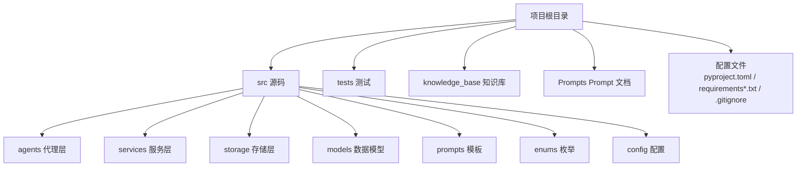
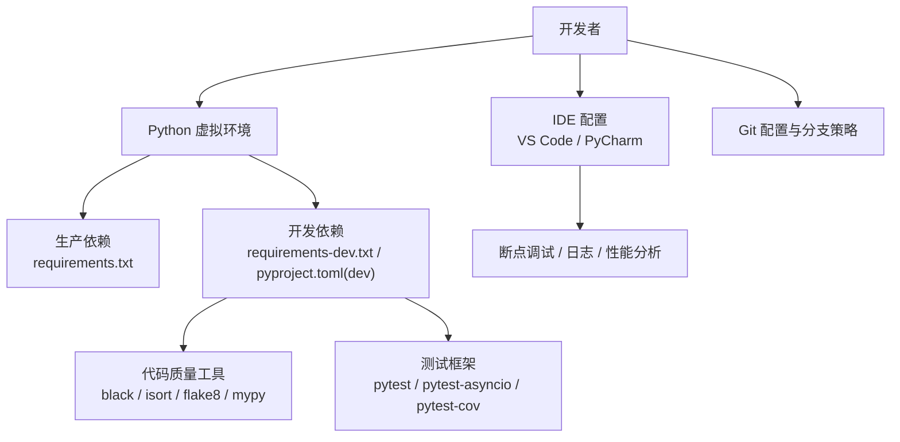
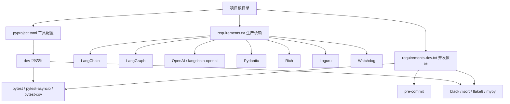

# 开发环境搭建

<cite>
**本文引用的文件**
- [README.md](file://README.md)
- [pyproject.toml](file://pyproject.toml)
- [requirements.txt](file://requirements.txt)
- [requirements-dev.txt](file://requirements-dev.txt)
- [.gitignore](file://.gitignore)
- [src/config/llm_config.py](file://src/config/llm_config.py)
- [src/services/llm_service.py](file://src/services/llm_service.py)
- [tests/test_llm_service.py](file://tests/test_llm_service.py)
- [tests/test_memory_manager.py](file://tests/test_memory_manager.py)
- [tests/test_memory_repository.py](file://tests/test_memory_repository.py)
</cite>

## 目录
1. [简介](#简介)
2. [项目结构](#项目结构)
3. [核心组件](#核心组件)
4. [架构总览](#架构总览)
5. [详细组件分析](#详细组件分析)
6. [依赖分析](#依赖分析)
7. [性能考虑](#性能考虑)
8. [故障排查指南](#故障排查指南)
9. [结论](#结论)
10. [附录](#附录)

## 简介
本指南面向首次参与“老人自传 Agent 系统”开发的工程师，提供从零到一的开发环境搭建步骤，涵盖：
- Python 环境与虚拟环境配置
- 生产与开发依赖安装与差异说明
- IDE 配置建议（VS Code、PyCharm 等）
- 调试环境设置（断点调试、日志配置、性能分析）
- Git 配置与分支管理策略

目标是帮助你在最短时间内完成环境准备，顺利运行项目、编写代码与调试。

## 项目结构
该项目采用“源码分层 + 测试分离”的组织方式，核心目录与职责如下：
- src：源代码，按功能域划分为 agents、services、storage、models、prompts、enums、config 等子模块
- tests：单元测试与集成测试，覆盖核心服务与存储层
- knowledge_base：知识库（Markdown 文件系统），用于存放用户记忆数据
- Prompts：Prompt 文档集合
- 配置文件：pyproject.toml（项目元数据与开发工具配置）、requirements.txt（生产依赖）、requirements-dev.txt（开发依赖）、.gitignore（忽略规则）

图示来源
- [README.md:92-200](file://README.md#L92-L200)

章节来源
- [README.md:92-200](file://README.md#L92-L200)

## 核心组件
- Python 版本要求：Python 3.10+
- 项目元数据与开发工具：pyproject.toml 中声明了项目名、版本、作者、Python 版本要求，并定义了可选开发依赖 dev（pytest、black、isort、flake8、mypy）
- 生产依赖：requirements.txt 列出了运行所需的核心库（如 LangChain、LangGraph、OpenAI、Rich、Loguru、Watchdog 等）
- 开发依赖：requirements-dev.txt 列出了测试与代码质量工具（pytest、pytest-asyncio、pytest-cov、black、isort、flake8、mypy、pre-commit）

章节来源
- [README.md:206-240](file://README.md#L206-L240)
- [pyproject.toml:1-26](file://pyproject.toml#L1-L26)
- [requirements.txt:1-24](file://requirements.txt#L1-L24)
- [requirements-dev.txt:1-13](file://requirements-dev.txt#L1-L13)

## 架构总览
下图展示了开发环境的关键要素与工具链关系：从 Python 虚拟环境到依赖安装，再到 IDE 调试与 Git 分支管理。

图示来源
- [README.md:206-294](file://README.md#L206-L294)
- [pyproject.toml:8-26](file://pyproject.toml#L8-L26)
- [requirements.txt:1-24](file://requirements.txt#L1-L24)
- [requirements-dev.txt:1-13](file://requirements-dev.txt#L1-L13)

## 详细组件分析

### Python 环境与虚拟环境
- 版本要求：Python 3.10+
- 推荐做法：使用 venv 创建隔离的虚拟环境，避免污染系统 Python
- 激活方式：Linux/macOS 使用 source .venv/bin/activate；Windows 使用 .venv\Scripts\activate
- 验证：激活后 pip 与 python 指向虚拟环境

章节来源
- [README.md:206-230](file://README.md#L206-L230)
- [pyproject.toml:6](file://pyproject.toml#L6)

### 依赖安装与差异
- 生产依赖：安装 requirements.txt，满足运行期核心能力（LLM、异步网络、日志、文件监控等）
- 开发依赖：安装 requirements-dev.txt 或使用 pyproject.toml 的 dev 可选组，获得测试与代码质量工具
- 代码质量工具：black（格式化）、isort（导入排序）、flake8（风格检查）、mypy（类型检查）
- 测试：pytest（含 asyncio 支持）、pytest-cov（覆盖率）

章节来源
- [README.md:232-294](file://README.md#L232-L294)
- [requirements.txt:1-24](file://requirements.txt#L1-L24)
- [requirements-dev.txt:1-13](file://requirements-dev.txt#L1-L13)
- [pyproject.toml:8-26](file://pyproject.toml#L8-L26)

### 环境变量与 LLM 配置
- 环境变量文件：.env.example 提供示例，复制为 .env 并填入 API Key
- LLM 配置：src/config/llm_config.py 支持多提供商（DeepSeek、OpenAI、Anthropic），优先读取 DeepSeek 专属变量，其次回退通用变量
- 默认配置：src/services/llm_service.py 通过 get_default_config 优先尝试 DeepSeek，失败回退 DeepSeek

章节来源
- [README.md:242-265](file://README.md#L242-L265)
- [src/config/llm_config.py:10-120](file://src/config/llm_config.py#L10-L120)
- [src/services/llm_service.py:468-481](file://src/services/llm_service.py#L468-L481)

### IDE 配置建议（VS Code / PyCharm）
- VS Code
  - Python 解释器：选择虚拟环境中的 python
  - 插件推荐：Python（官方扩展）、Pylance（类型检查）、Black Formatter、isort、flake8、pytest
  - 调试：使用 launch.json 配置，指向测试文件或主程序入口，启用断点调试
  - 任务：可配置 tasks.json 执行 black、isort、mypy、pytest 等命令
- PyCharm
  - Interpreter：选择虚拟环境中的 Python
  - 代码质量：File → Settings → Tools → Python Integrated Tools，启用 black、isort、mypy
  - 测试：使用内置 pytest 配置，或在 Run/Debug Configurations 中新增 Python tests
  - 断点调试：直接在代码行点击设置断点，运行/调试选定测试或脚本

章节来源
- [README.md:280-294](file://README.md#L280-L294)
- [requirements-dev.txt:7-10](file://requirements-dev.txt#L7-L10)
- [pyproject.toml:11-22](file://pyproject.toml#L11-L22)

### 调试环境设置
- 断点调试：在测试文件或业务代码中设置断点，使用 IDE 的调试模式运行
- 日志配置：LLMService 使用标准 logging；项目中也引入了 loguru，可在 .env 中配置 LOG_LEVEL 与 LOG_FILE
- 性能分析：pytest 支持 --benchmark，或使用 cProfile/line_profiler 对关键路径进行分析
- 测试运行：pytest、pytest -v、pytest --cov=src --cov-report=html

章节来源
- [README.md:268-278](file://README.md#L268-L278)
- [README.md:280-294](file://README.md#L280-L294)
- [src/services/llm_service.py:15](file://src/services/llm_service.py#L15)

### Git 配置与分支管理策略
- .gitignore：已包含常见 Python、IDE、日志、测试缓存、构建产物等忽略项
- 分支策略：建议采用 feature/*、fix/*、hotfix/* 等命名规范；开发流程包含创建分支、编码、测试、格式化、类型检查、提交与 PR

章节来源
- [.gitignore:1-32](file://.gitignore#L1-L32)
- [README.md:411-433](file://README.md#L411-L433)

## 依赖分析
下图展示生产与开发依赖的关系，以及与项目工具链的映射。

图示来源
- [requirements.txt:1-24](file://requirements.txt#L1-L24)
- [requirements-dev.txt:1-13](file://requirements-dev.txt#L1-L13)
- [pyproject.toml:8-26](file://pyproject.toml#L8-L26)

章节来源
- [requirements.txt:1-24](file://requirements.txt#L1-L24)
- [requirements-dev.txt:1-13](file://requirements-dev.txt#L1-L13)
- [pyproject.toml:8-26](file://pyproject.toml#L8-L26)

## 性能考虑
- LLM 调用重试：LLMService 内置指数退避重试，降低瞬时错误影响
- Token 统计：记录 prompt/completion/total tokens，便于成本与性能评估
- 异步 I/O：使用 aiofiles/httpx，适合高并发与文件/网络操作
- 代码质量：black/isort/flake8/mypy 提升一致性与可维护性，间接提升性能与稳定性

章节来源
- [src/services/llm_service.py:400-438](file://src/services/llm_service.py#L400-L438)
- [src/services/llm_service.py:449-456](file://src/services/llm_service.py#L449-L456)
- [requirements.txt:11-13](file://requirements.txt#L11-L14)
- [requirements-dev.txt:7-10](file://requirements-dev.txt#L7-L10)

## 故障排查指南
- 依赖安装失败
  - 确认 Python 版本满足 >=3.10
  - 在虚拟环境中执行 pip install -r requirements.txt 与 -r requirements-dev.txt
- LLM 配置错误
  - 检查 .env 是否存在且包含 DEEPSEEK_URL/DEEPSEEK_APIKEY（或其他提供商对应变量）
  - 若未配置，LLMConfig.from_env 会抛出异常；可改用 get_default_config 的回退逻辑
- 测试无法运行
  - 确认 pytest、pytest-asyncio、pytest-cov 已安装
  - 使用 pytest -v 查看详细输出；若需要覆盖率，使用 pytest --cov=src --cov-report=html
- 代码质量检查失败
  - black：执行 black src/
  - isort：执行 isort src/
  - flake8：执行 flake8 src/
  - mypy：执行 mypy src/ 或在 IDE 中启用 Pylance

章节来源
- [README.md:232-294](file://README.md#L232-L294)
- [src/config/llm_config.py:42-120](file://src/config/llm_config.py#L42-L120)
- [tests/test_llm_service.py:1-187](file://tests/test_llm_service.py#L1-L187)

## 结论
通过本指南，你可以在本地快速搭建符合项目要求的开发环境：使用 Python 3.10+ 与虚拟环境隔离依赖，分别安装生产与开发依赖，配置 IDE 与 Git，结合测试与代码质量工具形成高效的日常开发流程。遇到问题时，可依据故障排查章节逐项定位与解决。

## 附录

### 快速操作清单
- 安装 Python 3.10+
- 创建并激活虚拟环境
- 安装生产依赖与开发依赖
- 复制 .env.example 为 .env 并配置 LLM API Key
- 运行 pytest 验证环境
- 使用 IDE 断点调试与代码质量工具

章节来源
- [README.md:206-294](file://README.md#L206-L294)