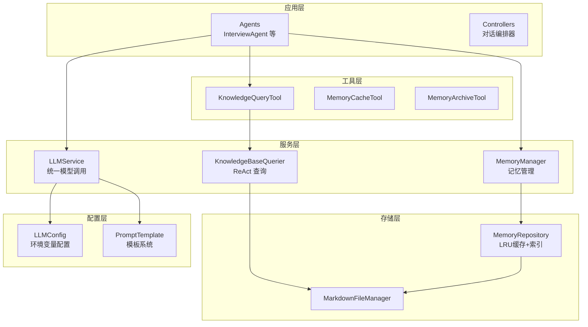
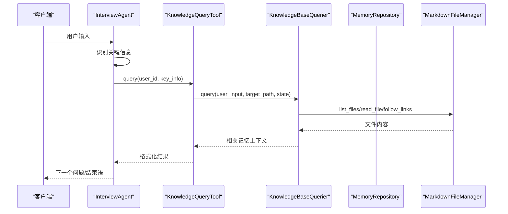
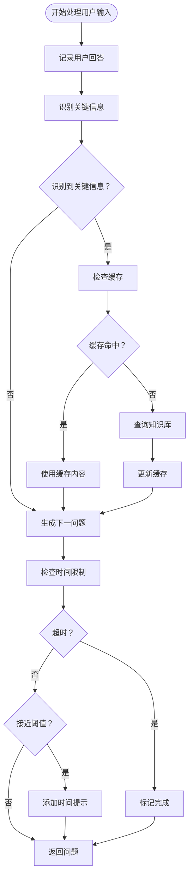
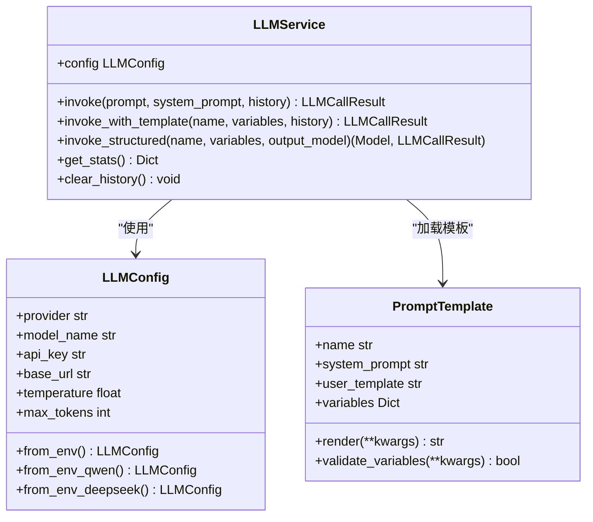
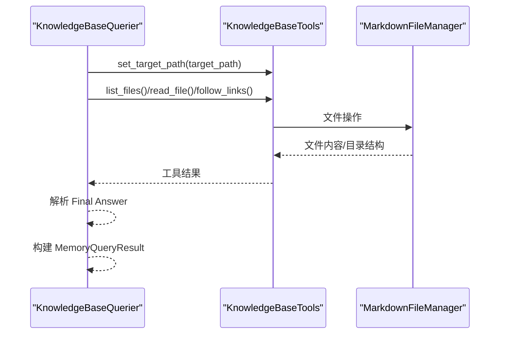
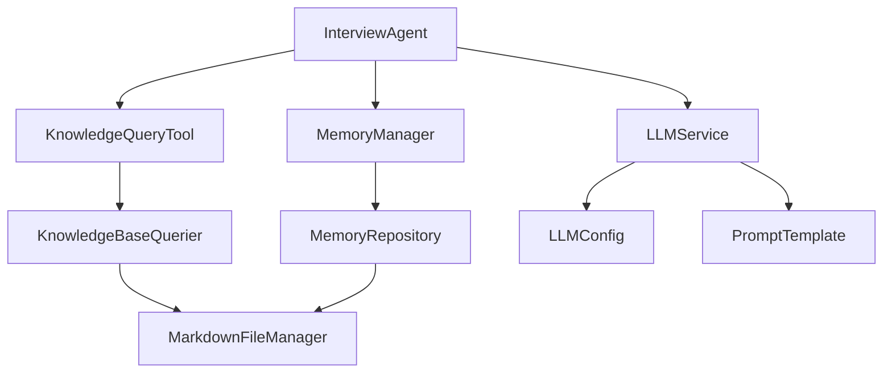

# 扩展开发指南

<cite>
**本文档引用的文件**
- [README.md](file://README.md)
- [pyproject.toml](file://pyproject.toml)
- [requirements.txt](file://requirements.txt)
- [src/agents/__init__.py](file://src/agents/__init__.py)
- [src/agents/interview_agent.py](file://src/agents/interview_agent.py)
- [src/services/__init__.py](file://src/services/__init__.py)
- [src/services/llm_service.py](file://src/services/llm_service.py)
- [src/services/knowledge_base_querier.py](file://src/services/knowledge_base_querier.py)
- [src/tools/__init__.py](file://src/tools/__init__.py)
- [src/tools/knowledge_query_tool.py](file://src/tools/knowledge_query_tool.py)
- [src/storage/memory_repository.py](file://src/storage/memory_repository.py)
- [src/config/llm_config.py](file://src/config/llm_config.py)
- [src/prompts/base.py](file://src/prompts/base.py)
- [src/models/session_state.py](file://src/models/session_state.py)
- [langgraph-agent-dev/references/tool-templates.md](file://langgraph-agent-dev/references/tool-templates.md)
</cite>

## 目录
1. [简介](#简介)
2. [项目结构](#项目结构)
3. [核心组件](#核心组件)
4. [架构概览](#架构概览)
5. [详细组件分析](#详细组件分析)
6. [依赖分析](#依赖分析)
7. [性能考虑](#性能考虑)
8. [故障排除指南](#故障排除指南)
9. [结论](#结论)
10. [附录](#附录)

## 简介
本指南面向扩展开发者，系统阐述该智能对话系统的扩展架构与开发模式，涵盖 Agent 扩展、工具扩展、服务扩展以及 API 扩展方法。文档重点说明：
- 插件系统架构与扩展点识别
- Agent 扩展（InterviewAgent、ProfileCollectionAgent、InterviewSessionAgent）的开发模式
- 工具扩展（KnowledgeQueryTool、MemoryCacheTool、MemoryArchiveTool）的实现与集成
- 服务扩展（LLMService、KnowledgeBaseQuerier、MemoryManager）的设计与接入
- API 扩展方法（新的服务接口设计、工具函数开发、配置系统扩展）
- 第三方集成指南（外部 API、数据库、文件系统）
- 工具模板与代码生成器使用方法
- 扩展点最佳实践（兼容性与稳定性保障）

## 项目结构
项目采用分层模块化组织，核心目录与职责如下：
- src/agents：Agent 层，负责对话流程与业务编排
- src/services：服务层，封装 LLM、知识库查询、记忆管理等能力
- src/tools：工具层，封装可复用的工具函数与外部系统交互
- src/storage：存储层，提供 Markdown 文件管理与记忆仓库
- src/config：配置层，集中管理 LLM 与系统配置
- src/models：数据模型，定义会话状态、事件、人物等结构
- src/prompts：Prompt 模板，支持 Python 模块与 Markdown 文件两种来源
- tests：单元测试与集成测试
- Prompts：Prompt 文档集合

**图表来源**
- [src/agents/interview_agent.py:16-346](file://src/agents/interview_agent.py#L16-L346)
- [src/services/llm_service.py:32-481](file://src/services/llm_service.py#L32-L481)
- [src/services/knowledge_base_querier.py:202-540](file://src/services/knowledge_base_querier.py#L202-L540)
- [src/tools/knowledge_query_tool.py:11-81](file://src/tools/knowledge_query_tool.py#L11-L81)
- [src/storage/memory_repository.py:40-359](file://src/storage/memory_repository.py#L40-L359)
- [src/config/llm_config.py:10-120](file://src/config/llm_config.py#L10-L120)
- [src/prompts/base.py:6-33](file://src/prompts/base.py#L6-L33)

**章节来源**
- [README.md:92-200](file://README.md#L92-L200)
- [pyproject.toml:1-26](file://pyproject.toml#L1-L26)
- [requirements.txt:1-24](file://requirements.txt#L1-L24)

## 核心组件
本节聚焦扩展开发中最常用的组件及其扩展点。

- LLMService：统一的大模型调用入口，支持多提供商适配、Prompt 模板加载、结构化输出、重试与统计。
- KnowledgeBaseQuerier：基于 ReAct 的知识库查询服务，通过 LangChain Agent 与工具集协作完成检索与上下文抽取。
- KnowledgeQueryTool：InterviewAgent 的知识库查询封装，提供简洁的异步查询接口。
- MemoryRepository：三层记忆统一存储（短期/长期/画像），内置 LRU 缓存与索引，支持事件与人物的结构化存储。
- LLMConfig：配置中心，支持环境变量加载与多提供商切换。
- PromptTemplate：Prompt 模板系统，支持从 Python 模块与 Markdown 文件加载模板。

**章节来源**
- [src/services/llm_service.py:32-481](file://src/services/llm_service.py#L32-L481)
- [src/services/knowledge_base_querier.py:202-540](file://src/services/knowledge_base_querier.py#L202-L540)
- [src/tools/knowledge_query_tool.py:11-81](file://src/tools/knowledge_query_tool.py#L11-L81)
- [src/storage/memory_repository.py:40-359](file://src/storage/memory_repository.py#L40-L359)
- [src/config/llm_config.py:10-120](file://src/config/llm_config.py#L10-L120)
- [src/prompts/base.py:6-33](file://src/prompts/base.py#L6-L33)

## 架构概览
系统采用“Agent-服务-工具-存储-配置”的分层架构，扩展点主要集中在服务层与工具层，便于通过依赖注入与工厂函数模式进行替换与增强。

**图表来源**
- [src/agents/interview_agent.py:115-184](file://src/agents/interview_agent.py#L115-L184)
- [src/tools/knowledge_query_tool.py:33-66](file://src/tools/knowledge_query_tool.py#L33-L66)
- [src/services/knowledge_base_querier.py:257-373](file://src/services/knowledge_base_querier.py#L257-L373)
- [src/storage/memory_repository.py:111-161](file://src/storage/memory_repository.py#L111-L161)

## 详细组件分析

### Agent 扩展：InterviewAgent
InterviewAgent 是核心对话 Agent，负责时间驱动的采访流程、问题生成与对话引导、知识库查询与缓存管理、关键信息识别与追踪。

- 扩展点
  - 问题生成器注入：通过 QuestionGenerator 生成下一问题，支持自定义策略。
  - 工具链注入：MemoryCacheTool、KnowledgeQueryTool、MemoryArchiveTool 可替换为自定义实现。
  - Prompt 管理：支持 resume_prompt 与结束引导 Prompt 的定制。
  - 时间控制：时长阈值与警告机制可配置。

- 开发模式
  - 依赖注入：构造函数接受 llm_service、memory_manager、工具实例等，便于替换与测试。
  - 异步流程：handle_input 为核心处理流程，包含识别、查询、缓存、生成问题、时间检查等步骤。
  - 状态管理：维护会话状态、对话历史、时间统计等。

**图表来源**
- [src/agents/interview_agent.py:115-184](file://src/agents/interview_agent.py#L115-L184)

**章节来源**
- [src/agents/interview_agent.py:16-346](file://src/agents/interview_agent.py#L16-L346)

### 服务扩展：LLMService
LLMService 提供统一的模型调用入口，支持多提供商适配、Prompt 模板加载、结构化输出、重试与统计。

- 扩展点
  - 提供商适配：支持 openai、qwen、deepseek、anthropic 等，可通过配置切换。
  - Prompt 模板：支持从 Python 模块与 Markdown 文件加载，模板变量校验与渲染。
  - 结构化输出：invoke_structured 支持 Pydantic 模型解析，增强稳定性。
  - 重试与统计：内置指数退避重试与调用统计，便于监控与优化。

- 开发模式
  - 工厂函数：get_llm_service/init_llm_service 提供全局单例与初始化。
  - 异步调用：统一使用 async/await，确保与 Agent 的异步流程一致。

**图表来源**
- [src/services/llm_service.py:32-481](file://src/services/llm_service.py#L32-L481)
- [src/config/llm_config.py:10-120](file://src/config/llm_config.py#L10-L120)
- [src/prompts/base.py:6-33](file://src/prompts/base.py#L6-L33)

**章节来源**
- [src/services/llm_service.py:32-481](file://src/services/llm_service.py#L32-L481)
- [src/config/llm_config.py:10-120](file://src/config/llm_config.py#L10-L120)
- [src/prompts/base.py:6-33](file://src/prompts/base.py#L6-L33)

### 服务扩展：KnowledgeBaseQuerier（ReAct）
KnowledgeBaseQuerier 通过 LangChain Agent 与工具集实现 ReAct 查询，支持路径探索、文件读取、链接追踪与相关性判断。

- 扩展点
  - 工具集扩展：可新增工具函数（如数据库查询、外部 API 调用），通过工厂函数注入。
  - 模板扩展：通过 LLMService 的模板系统加载 ReAct Prompt。
  - 结果解析：支持标准 JSON 与自然语言降级解析，保证鲁棒性。

- 开发模式
  - 工具函数：使用 @tool 装饰器，清晰的 Docstring 描述使用场景与参数。
  - 路径安全：严格的路径规范化与访问范围限制，防止目录遍历。
  - 探索报告：提供探索报告与疑似相关文件标记，便于调试与优化。

**图表来源**
- [src/services/knowledge_base_querier.py:202-540](file://src/services/knowledge_base_querier.py#L202-L540)

**章节来源**
- [src/services/knowledge_base_querier.py:202-540](file://src/services/knowledge_base_querier.py#L202-L540)

### 工具扩展：KnowledgeQueryTool
KnowledgeQueryTool 封装 KnowledgeBaseQuerier 的调用，提供简洁的查询接口与结果格式化。

- 扩展点
  - 查询策略：可扩展为多轮迭代、上下文融合、结果评分等。
  - 结果格式化：支持多种返回格式（字符串、MemoryQueryResult、字典）。
  - 路径隔离：强制 target_path 限定在用户目录内，确保数据隔离。

- 开发模式
  - 依赖注入：支持自定义 KnowledgeBaseQuerier 实例。
  - 异步调用：与 Agent 的异步流程保持一致。

**章节来源**
- [src/tools/knowledge_query_tool.py:11-81](file://src/tools/knowledge_query_tool.py#L11-L81)

### 存储扩展：MemoryRepository
MemoryRepository 统一管理三层记忆（短期/长期/画像），内置 LRU 缓存与索引，支持事件与人物的结构化存储。

- 扩展点
  - 缓存策略：可替换为 Redis、数据库等持久化缓存。
  - 索引扩展：支持向量索引、倒排索引等高级检索。
  - 文件系统：可替换为 S3、HDFS 等分布式存储。

- 开发模式
  - 三层记忆：短期内存、长期文件、画像索引，职责清晰。
  - 路径映射：事件与人物文件名生成与目录映射规则可定制。

**章节来源**
- [src/storage/memory_repository.py:40-359](file://src/storage/memory_repository.py#L40-L359)

### 配置扩展：LLMConfig
LLMConfig 提供统一的配置中心，支持环境变量加载与多提供商切换。

- 扩展点
  - 新提供商：通过工厂方法 from_env_* 添加新提供商。
  - 默认配置：get_default_config 提供回退策略。
  - 环境变量：支持 QWEN、DEEPSEEK 等专属配置。

**章节来源**
- [src/config/llm_config.py:10-120](file://src/config/llm_config.py#L10-L120)

## 依赖分析
扩展开发中的耦合与依赖关系如下：

**图表来源**
- [src/agents/interview_agent.py:6-11](file://src/agents/interview_agent.py#L6-L11)
- [src/tools/knowledge_query_tool.py:25-31](file://src/tools/knowledge_query_tool.py#L25-L31)
- [src/services/knowledge_base_querier.py:220-235](file://src/services/knowledge_base_querier.py#L220-L235)
- [src/storage/memory_repository.py:54-87](file://src/storage/memory_repository.py#L54-L87)
- [src/services/llm_service.py:71-89](file://src/services/llm_service.py#L71-L89)
- [src/config/llm_config.py:42-120](file://src/config/llm_config.py#L42-L120)
- [src/prompts/base.py:6-33](file://src/prompts/base.py#L6-L33)

**章节来源**
- [src/agents/interview_agent.py:6-11](file://src/agents/interview_agent.py#L6-L11)
- [src/tools/knowledge_query_tool.py:25-31](file://src/tools/knowledge_query_tool.py#L25-L31)
- [src/services/knowledge_base_querier.py:220-235](file://src/services/knowledge_base_querier.py#L220-L235)
- [src/storage/memory_repository.py:54-87](file://src/storage/memory_repository.py#L54-L87)
- [src/services/llm_service.py:71-89](file://src/services/llm_service.py#L71-L89)
- [src/config/llm_config.py:42-120](file://src/config/llm_config.py#L42-L120)
- [src/prompts/base.py:6-33](file://src/prompts/base.py#L6-L33)

## 性能考虑
- 异步与并发：Agent 与服务层广泛使用 async/await，建议扩展时保持异步一致性，避免阻塞。
- 缓存策略：MemoryRepository 内置 LRU 缓存，扩展时可引入分布式缓存（Redis/Memcached）提升查询性能。
- 模板加载：Prompt 模板从文件系统加载，建议在启动时预热模板，减少运行时开销。
- 重试与超时：LLMService 内置指数退避重试，建议为外部 API 工具设置合理的超时与重试策略。
- 文件系统：MarkdownFileManager 的文件操作建议批量处理与异步读写，避免频繁 IO。

## 故障排除指南
- LLM 调用失败
  - 检查 LLMConfig 的提供商与 API Key 配置。
  - 查看 LLMService 的重试日志与统计信息。
  - 确认 Prompt 模板是否存在且变量完整。

- 知识库查询异常
  - 检查 target_path 是否存在且为目录。
  - 查看工具描述与路径探索报告，定位访问范围问题。
  - 确认文件权限与编码格式。

- 缓存与存储问题
  - 检查 MemoryRepository 的缓存容量与淘汰策略。
  - 确认文件名生成与目录映射规则是否符合预期。

**章节来源**
- [src/services/llm_service.py:285-291](file://src/services/llm_service.py#L285-L291)
- [src/services/knowledge_base_querier.py:280-294](file://src/services/knowledge_base_querier.py#L280-L294)
- [src/storage/memory_repository.py:16-38](file://src/storage/memory_repository.py#L16-L38)

## 结论
本指南提供了从架构到实现的全栈扩展开发方法，强调通过依赖注入、工厂函数与模板系统实现高内聚低耦合的扩展模式。遵循本文的最佳实践，可在保证兼容性与稳定性的前提下，快速扩展 Agent、工具与服务，满足多样化的业务需求。

## 附录

### API 扩展方法
- 新的服务接口设计
  - 使用 Pydantic BaseModel 定义输入输出模型，确保类型安全。
  - 通过 LLMService 的 invoke/invoke_with_template/invoke_structured 统一接入。
  - 在 src/services/__init__.py 中导出新服务，并在 tests 中编写单元测试。

- 工具函数开发
  - 使用 @tool 装饰器与清晰的 Docstring 描述使用场景与参数。
  - 通过工厂函数注入技术依赖（如数据库会话、用户 ID），暴露简洁接口给 LLM。
  - 返回结构化数据与自然语言摘要，支持条件逻辑与后续处理。

- 配置系统扩展
  - 在 src/config/llm_config.py 中添加新的工厂方法与环境变量支持。
  - 在 src/services/llm_service.py 中注册新提供商的初始化逻辑。

**章节来源**
- [src/services/llm_service.py:293-325](file://src/services/llm_service.py#L293-L325)
- [src/services/llm_service.py:327-398](file://src/services/llm_service.py#L327-L398)
- [src/config/llm_config.py:62-120](file://src/config/llm_config.py#L62-L120)
- [langgraph-agent-dev/references/tool-templates.md:1-522](file://langgraph-agent-dev/references/tool-templates.md#L1-L522)

### 第三方集成指南
- 外部 API 集成
  - 使用工厂函数创建工具，通过 APIConfig 统一管理 base_url、api_key、超时与重试。
  - 在工具中实现超时保护与错误处理，返回结构化数据与摘要。

- 数据库连接
  - 通过工厂函数注入 AsyncSession，使用 SQLAlchemy 构建查询。
  - 返回结构化数据与自然语言摘要，支持后续条件逻辑。

- 文件系统扩展
  - 基于 MarkdownFileManager 的接口扩展，确保路径安全与访问范围限制。
  - 支持分布式文件系统（如 S3/HDFS），保持接口一致性。

**章节来源**
- [langgraph-agent-dev/references/tool-templates.md:328-396](file://langgraph-agent-dev/references/tool-templates.md#L328-L396)
- [src/services/knowledge_base_querier.py:34-52](file://src/services/knowledge_base_querier.py#L34-L52)

### 工具模板与代码生成器使用
- 工具模板
  - 参考 langgraph-agent-dev/references/tool-templates.md 中的模板，确保 Docstring 清晰、参数合理、返回结构化数据。
  - 使用工厂函数模式注入技术依赖，暴露简洁接口给 LLM。

- 代码生成器
  - 建议使用模板快速生成工具骨架，然后根据业务需求填充实现。
  - 生成后进行测试清单验证：Docstring 清晰度、参数合理性、返回结构、结果限制、错误处理、安全性、可观测性。

**章节来源**
- [langgraph-agent-dev/references/tool-templates.md:1-522](file://langgraph-agent-dev/references/tool-templates.md#L1-L522)

### 扩展点识别与最佳实践
- 扩展点识别
  - 服务层：LLMService、KnowledgeBaseQuerier、MemoryManager
  - 工具层：KnowledgeQueryTool、MemoryCacheTool、MemoryArchiveTool
  - 存储层：MemoryRepository、MarkdownFileManager
  - 配置层：LLMConfig、PromptTemplate

- 最佳实践
  - 依赖注入：通过构造函数或工厂函数注入依赖，便于替换与测试。
  - 异步一致性：保持与 Agent 的异步流程一致，避免阻塞。
  - 结构化输出：返回结构化数据与自然语言摘要，支持后续处理。
  - 错误处理：统一超时与重试策略，优雅处理异常。
  - 安全性：严格路径限制与访问范围控制，防止目录遍历与越权访问。
  - 兼容性：遵循现有接口与数据模型，确保向后兼容。
  - 稳定性：提供完善的日志与监控，便于问题定位与性能优化。

**章节来源**
- [src/agents/interview_agent.py:37-79](file://src/agents/interview_agent.py#L37-L79)
- [src/tools/knowledge_query_tool.py:25-31](file://src/tools/knowledge_query_tool.py#L25-L31)
- [src/storage/memory_repository.py:16-38](file://src/storage/memory_repository.py#L16-L38)
- [src/services/llm_service.py:400-437](file://src/services/llm_service.py#L400-L437)