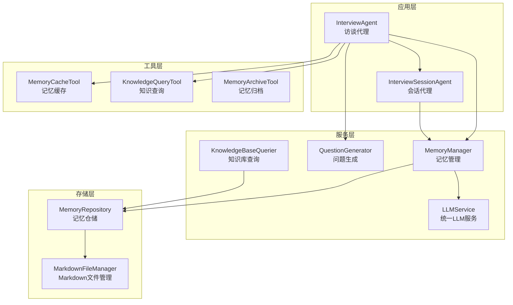
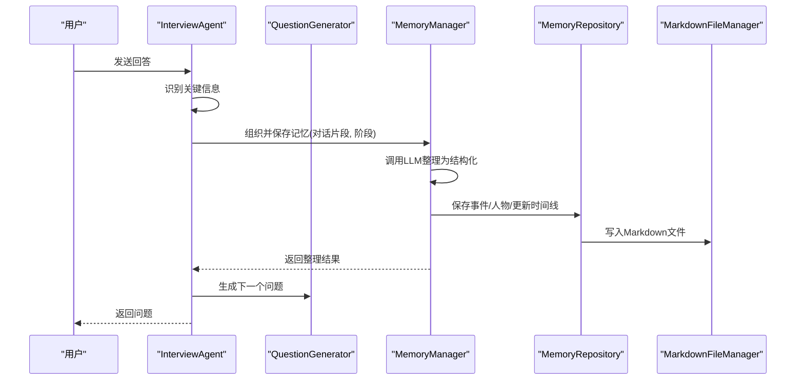
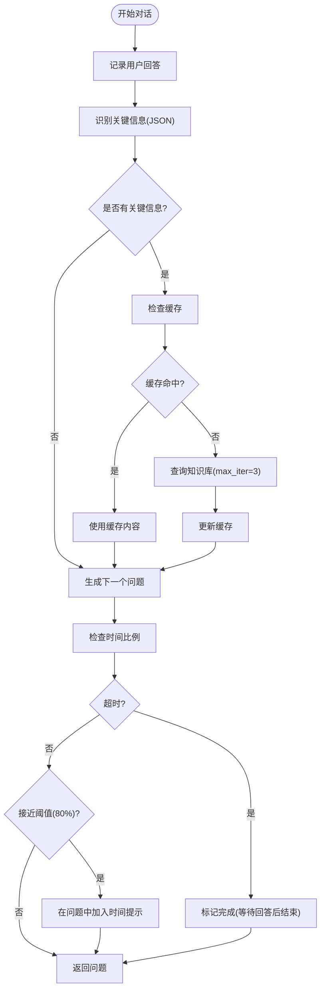
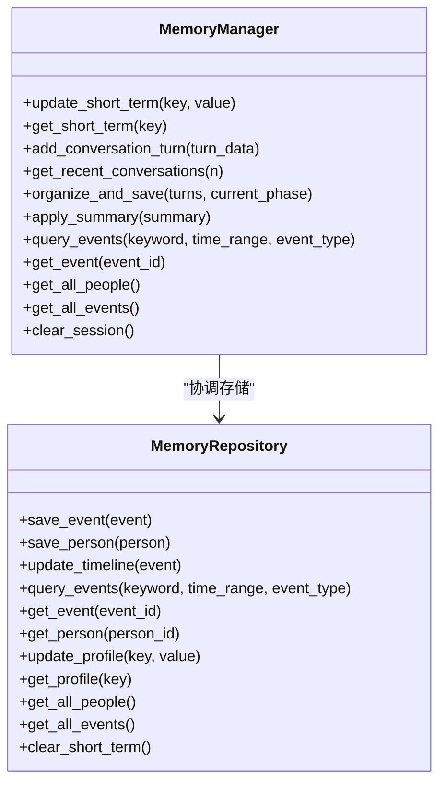
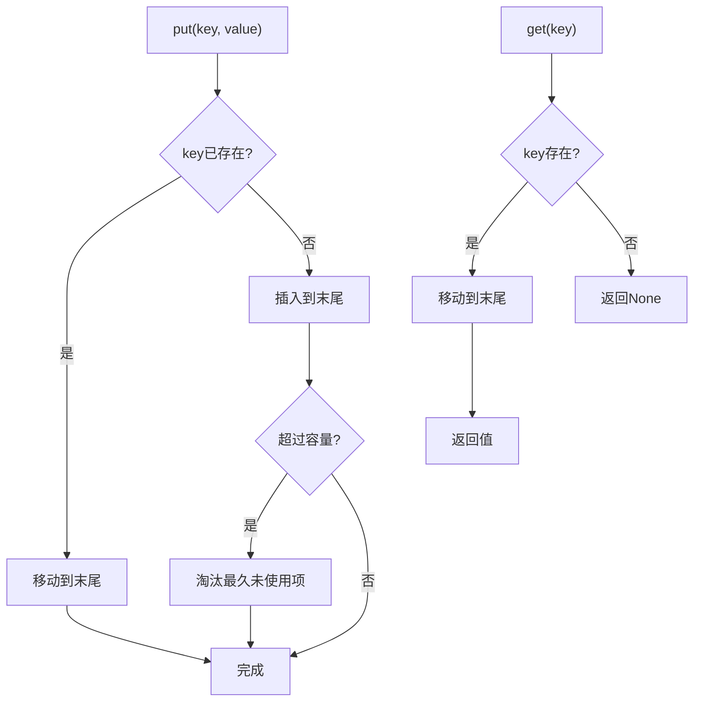
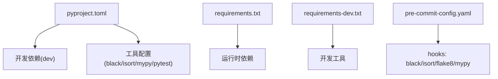

# 贡献指南

<cite>
**本文引用的文件**
- [README.md](file://README.md)
- [pyproject.toml](file://pyproject.toml)
- [requirements.txt](file://requirements.txt)
- [requirements-dev.txt](file://requirements-dev.txt)
- [.pre-commit-config.yaml](file://.pre-commit-config.yaml)
- [MEMORY_INTERACTION_GUIDE.md](file://MEMORY_INTERACTION_GUIDE.md)
- [test_memory_interaction.py](file://test_memory_interaction.py)
- [integration_test_new_user.py](file://integration_test_new_user.py)
- [src/agents/interview_agent.py](file://src/agents/interview_agent.py)
- [src/services/memory_manager.py](file://src/services/memory_manager.py)
- [src/storage/memory_repository.py](file://src/storage/memory_repository.py)
- [src/prompts/MemoryOrganizer-Prompt.md](file://src/prompts/MemoryOrganizer-Prompt.md)
- [tests/test_memory_manager.py](file://tests/test_memory_manager.py)
- [tests/test_memory_repository.py](file://tests/test_memory_repository.py)
</cite>

## 目录
1. [简介](#简介)
2. [项目结构](#项目结构)
3. [核心组件](#核心组件)
4. [架构总览](#架构总览)
5. [详细组件分析](#详细组件分析)
6. [依赖分析](#依赖分析)
7. [性能考虑](#性能考虑)
8. [故障排查指南](#故障排查指南)
9. [结论](#结论)
10. [附录](#附录)

## 简介
本项目是一个基于大语言模型的“老人自传 Agent 系统”，通过智能对话采访帮助老人记录与传承人生故事。社区欢迎各类贡献，包括但不限于：问题反馈、功能建议、Bug 修复、代码重构、测试完善与文档改进。

## 项目结构
项目采用模块化分层设计，核心围绕“对话引导层”“结构化整理层”“记忆管理层”“写作生成层”四大模块协同工作，配合 Prompt 管理、服务层、存储层与工具层，形成完整的知识库构建与管理闭环。

图表来源
- [src/agents/interview_agent.py](file://src/agents/interview_agent.py)
- [src/services/memory_manager.py](file://src/services/memory_manager.py)
- [src/storage/memory_repository.py](file://src/storage/memory_repository.py)

章节来源
- [README.md:92-200](file://README.md#L92-L200)

## 核心组件
- 访谈代理（InterviewAgent）：负责引导对话、生成问题、查询知识库、管理缓存与会话状态，支持时间限制与结束引导。
- 记忆管理（MemoryManager）：统一协调三层记忆（短期/长期/画像）的读写，调用 LLM 将对话整理为结构化信息并持久化。
- 记忆仓储（MemoryRepository）：实现短期内存缓存、长期文件系统存储、画像索引与查询，内置 LRU 缓存与历史记录管理。
- LLM 服务（LLMService）：统一接入不同模型提供商，支持结构化输出与模板化 Prompt 调用。
- Prompt 管理（MemoryOrganizer-Prompt）：定义“记忆整理”的结构化输出 Schema，指导 LLM 从对话中抽取事件、人物与时间线。

章节来源
- [src/agents/interview_agent.py:16-346](file://src/agents/interview_agent.py#L16-L346)
- [src/services/memory_manager.py:27-470](file://src/services/memory_manager.py#L27-L470)
- [src/storage/memory_repository.py:40-359](file://src/storage/memory_repository.py#L40-L359)
- [src/prompts/MemoryOrganizer-Prompt.md:1-739](file://src/prompts/MemoryOrganizer-Prompt.md#L1-L739)

## 架构总览
系统采用“对话-结构化-存储-查询-生成”的流水线式架构。InterviewAgent 与 InterviewSessionAgent 负责与用户交互；MemoryManager 通过 LLM 将对话内容结构化；MemoryRepository 负责文件系统与索引；MarkdownFileManager 负责实际文件落盘；KnowledgeBaseQuerier 提供检索能力；Prompt 模板保证输出一致性。

图表来源
- [src/agents/interview_agent.py:115-184](file://src/agents/interview_agent.py#L115-L184)
- [src/services/memory_manager.py:111-156](file://src/services/memory_manager.py#L111-L156)
- [src/storage/memory_repository.py:176-200](file://src/storage/memory_repository.py#L176-L200)

## 详细组件分析

### 访谈代理（InterviewAgent）
- 职责：启动采访、处理用户输入、生成问题、查询知识库缓存、管理会话状态与时间限制。
- 关键流程：识别关键信息 → 缓存命中/查询知识库 → 更新缓存 → 生成问题 → 检查时间阈值。
- 时间控制：默认 15 分钟，接近尾声时在问题中加入温和提示。
- 结束引导：根据会话历史与收集事件生成结束语，支持模板注入变量。

图表来源
- [src/agents/interview_agent.py:115-184](file://src/agents/interview_agent.py#L115-L184)

章节来源
- [src/agents/interview_agent.py:16-346](file://src/agents/interview_agent.py#L16-L346)

### 记忆管理（MemoryManager）
- 职责：统一管理三层记忆；调用 LLM 将对话整理为结构化信息；协调存储层持久化；提供画像更新与查询接口。
- 核心方法：organize_and_save（格式化输入 → LLM 结构化 → 并行保存 → 更新画像）。
- 并行优化：事件与人物保存采用 asyncio.gather 并行执行，提升吞吐。
- 兼容接口：提供旧版 update_long_term 与 apply_summary，逐步迁移至结构化输出。

图表来源
- [src/services/memory_manager.py:27-470](file://src/services/memory_manager.py#L27-L470)
- [src/storage/memory_repository.py:40-359](file://src/storage/memory_repository.py#L40-L359)

章节来源
- [src/services/memory_manager.py:27-470](file://src/services/memory_manager.py#L27-L470)

### 记忆仓储（MemoryRepository）
- 短期记忆：内存缓存 + 历史队列，支持容量限制与清空。
- 长期记忆：事件/人物/时间线文件落盘，支持查询与索引更新。
- 画像记忆：结构化存储主人公与关系网络，支持增量更新。
- 缓存机制：LRU 缓存，命中优先，避免重复 IO。

图表来源
- [.pre-commit-config.yaml:1-20](file://.pre-commit-config.yaml#L1-L20)
- [src/storage/memory_repository.py:16-38](file://src/storage/memory_repository.py#L16-L38)

章节来源
- [src/storage/memory_repository.py:40-359](file://src/storage/memory_repository.py#L40-L359)

### Prompt 管理（MemoryOrganizer-Prompt）
- 模板职责：将对话内容整理为时间线/事件/人物三维度结构化输出，定义 JSON Schema 与 Markdown 模板。
- 动态变量：对话内容、已有时间线、已有人物索引、当前人生阶段。
- 调用方式：MemoryManager 通过 LLMService.invoke_structured 调用模板，输出结构化模型。

章节来源
- [src/prompts/MemoryOrganizer-Prompt.md:1-739](file://src/prompts/MemoryOrganizer-Prompt.md#L1-L739)

## 依赖分析
- 运行时依赖：LangChain、LangGraph、Pydantic、OpenAI/LangChain-OpenAI、异步文件处理与日志等。
- 开发依赖：pytest、black、isort、flake8、mypy、pre-commit。
- 项目配置：pyproject.toml 定义工具链与测试路径；.pre-commit-config.yaml 统一代码风格与静态检查。

图表来源
- [pyproject.toml:1-26](file://pyproject.toml#L1-L26)
- [requirements.txt:1-24](file://requirements.txt#L1-L24)
- [requirements-dev.txt:1-13](file://requirements-dev.txt#L1-L13)
- [.pre-commit-config.yaml:1-20](file://.pre-commit-config.yaml#L1-L20)

章节来源
- [pyproject.toml:1-26](file://pyproject.toml#L1-L26)
- [requirements.txt:1-24](file://requirements.txt#L1-L24)
- [requirements-dev.txt:1-13](file://requirements-dev.txt#L1-L13)
- [.pre-commit-config.yaml:1-20](file://.pre-commit-config.yaml#L1-L20)

## 性能考虑
- 并行化：MemoryManager 在保存事件与人物时使用 asyncio.gather 并行执行，减少整体延迟。
- 缓存策略：MemoryRepository 内置 LRU 缓存与短期历史队列，降低重复 IO 与查询成本。
- 结构化输出：通过 MemoryOrganizer-Prompt 的 JSON Schema 与类型校验，减少解析错误与重试开销。
- 代码质量：pre-commit 钩子在提交前统一格式化与静态检查，降低运行时异常概率。

章节来源
- [src/services/memory_manager.py:170-193](file://src/services/memory_manager.py#L170-L193)
- [src/storage/memory_repository.py:16-38](file://src/storage/memory_repository.py#L16-L38)
- [.pre-commit-config.yaml:1-20](file://.pre-commit-config.yaml#L1-L20)

## 故障排查指南
- 记忆交互测试脚本
  - 用途：模拟采访流程，将原始对话提炼为结构化记忆并存储为 Markdown 文件。
  - 使用：在项目根目录执行脚本，按提示选择人生阶段并输入回答，支持 exit/history/clear 命令。
  - 注意：确保 .env 中 LLM 参数配置正确；首次运行可能较慢；建议每次采访聚焦单一主题。
- 集成测试（新用户）
  - 用途：模拟新用户首次与 Agent 对话，记录对话历史并保存到知识库路径。
  - 使用：直接运行脚本，按提示输入回答；支持 exit/quit 退出，stop 结束当前阶段。
  - 日志：自动创建日志文件，记录对话过程与结束提示。

章节来源
- [MEMORY_INTERACTION_GUIDE.md:1-172](file://MEMORY_INTERACTION_GUIDE.md#L1-L172)
- [test_memory_interaction.py:1-179](file://test_memory_interaction.py#L1-L179)
- [integration_test_new_user.py:1-176](file://integration_test_new_user.py#L1-L176)

## 结论
本项目通过清晰的模块划分与结构化 Prompt，实现了从对话到知识库的高效闭环。贡献者可通过 Issue 报告问题、功能请求与 Bug 反馈，遵循统一的开发流程与代码规范，共同推动项目的演进与完善。

## 附录

### 社区参与与贡献流程
- Issue 报告
  - 描述：清晰复现步骤、预期与实际结果、环境信息（操作系统、Python 版本、依赖版本）。
  - 标签：按类型选择 bug/feature/documentation/question 等标签。
- 功能请求
  - 描述：背景动机、期望行为、收益与风险评估。
  - 优先级：可参考现有任务卡片风格（如 Task-001/Refactor-Spec）。
- Bug 反馈
  - 提供最小可复现示例与日志片段；必要时附上知识库快照或对话历史文件。
- Pull Request 提交
  - 分支命名：feature/xxx、fix/xxx、docs/xxx、refactor/xxx。
  - 提交信息：使用约定式提交（feat/fix/docs/chore），简明描述变更。
  - 测试：新增/修改功能需配套单元测试；运行 pytest 并确保通过。
  - 代码质量：提交前执行 black、isort、flake8、mypy；确保 pre-commit 钩子通过。
  - 文档：更新相关 README/Prompt/测试用例注释，保持内外一致。
  - 变更范围：尽量小而聚焦，避免无关格式化改动混杂提交。

章节来源
- [README.md:470-480](file://README.md#L470-L480)
- [pyproject.toml:24-26](file://pyproject.toml#L24-L26)
- [.pre-commit-config.yaml:1-20](file://.pre-commit-config.yaml#L1-L20)

### 新贡献者入门指南
- 环境准备
  - Python 3.10+；克隆仓库；创建并激活虚拟环境；安装生产与开发依赖。
  - 配置 .env（LLM 提供商、API Key、日志与知识库路径）。
- 快速体验
  - 运行记忆交互测试脚本，熟悉结构化整理流程。
  - 运行集成测试脚本，体验新用户首次对话。
- 第一个 PR
  - 选择一个简单 Issue（如文档补充、小 Bug 修复、格式化）。
  - 新建分支、编写代码与测试、提交、推送并创建 PR。
  - 根据 Review 意见迭代，直至合并。

章节来源
- [README.md:204-294](file://README.md#L204-L294)
- [MEMORY_INTERACTION_GUIDE.md:12-172](file://MEMORY_INTERACTION_GUIDE.md#L12-L172)
- [integration_test_new_user.py:11-17](file://integration_test_new_user.py#L11-L17)

### 社区行为准则与沟通礼仪
- 尊重与包容：尊重不同观点与背景，避免人身攻击与歧视性言论。
- 积极沟通：使用清晰、礼貌的语言；提供上下文与证据；避免情绪化表达。
- 开放协作：欢迎提问与建议；及时回应 Review 与讨论；保持透明与协作精神。
- 知识共享：优先搜索已有 Issue/Pull Request；避免重复劳动；分享最佳实践。

### 维护者职责与决策流程
- 职责
  - 代码审查：确保质量、一致性与安全性；关注测试覆盖与文档更新。
  - Issue 管理：分类、标签、优先级与跟进；提供明确的验收标准。
  - 版本发布：制定发布计划、变更日志与升级指引；协调预发布与回归测试。
- 决策流程
  - 功能变更：公开征集意见 → 维护者评估 → 社区投票/讨论 → 决策与实施。
  - Bug 修复：快速修复高危问题；低风险修复纳入迭代计划。
  - 文档更新：随功能同步更新；保持与实现一致。