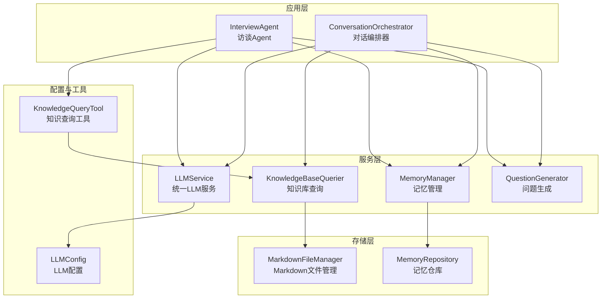
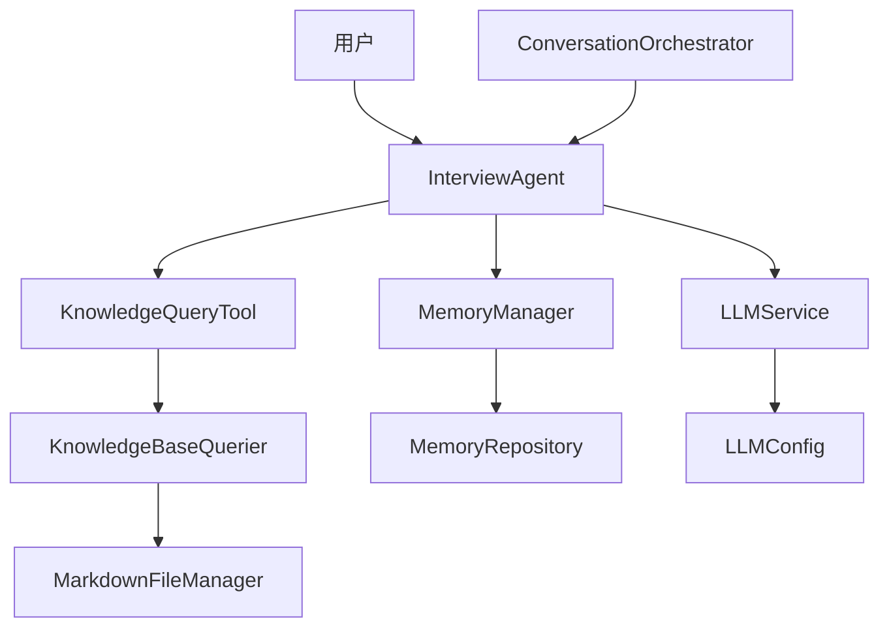
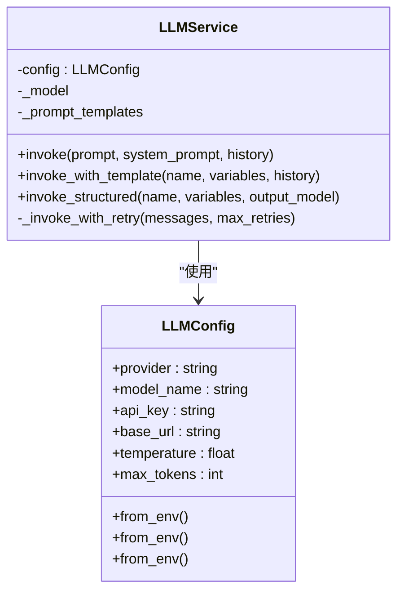
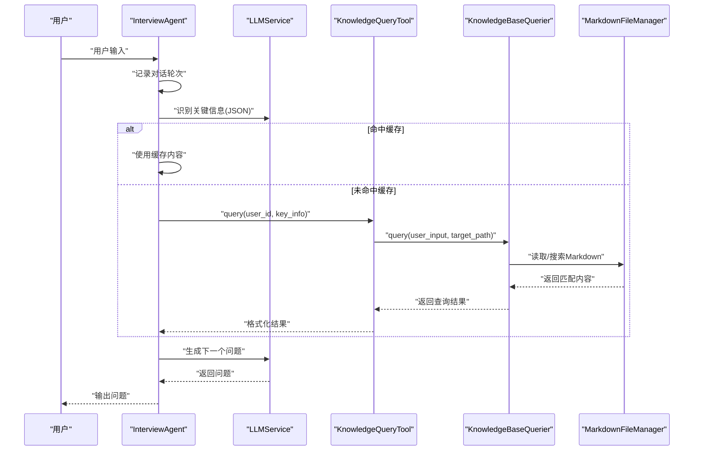
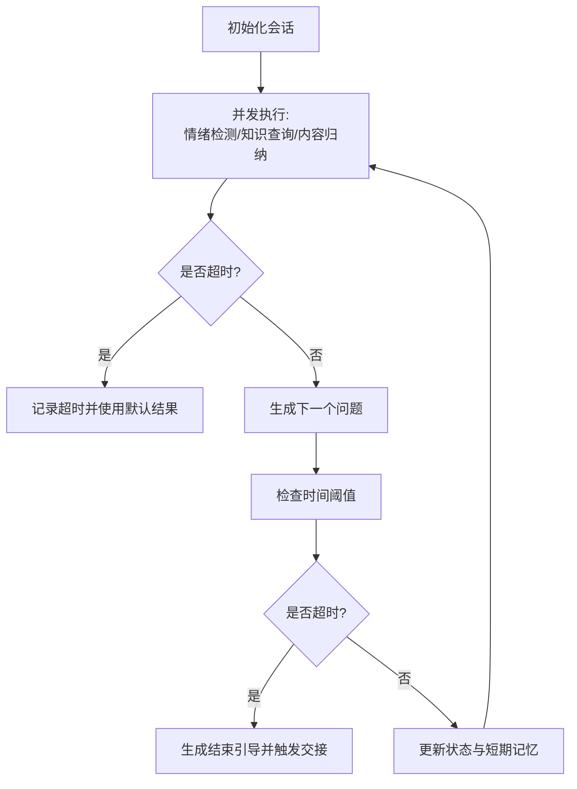
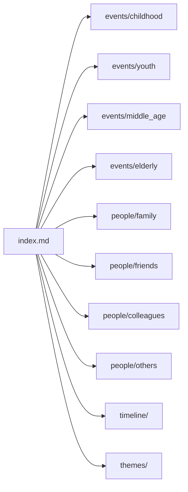
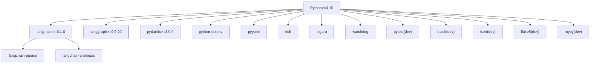

# 快速开始

<cite>
**本文引用的文件**
- [README.md](file://README.md)
- [requirements.txt](file://requirements.txt)
- [requirements-dev.txt](file://requirements-dev.txt)
- [pyproject.toml](file://pyproject.toml)
- [src/config/llm_config.py](file://src/config/llm_config.py)
- [src/services/llm_service.py](file://src/services/llm_service.py)
- [src/agents/interview_agent.py](file://src/agents/interview_agent.py)
- [src/core/conversation_orchestrator.py](file://src/core/conversation_orchestrator.py)
- [src/storage/markdown_file_manager.py](file://src/storage/markdown_file_manager.py)
- [src/tools/knowledge_query_tool.py](file://src/tools/knowledge_query_tool.py)
- [integration_test_new_user.py](file://integration_test_new_user.py)
- [demo_memory_storage.py](file://demo_memory_storage.py)
- [src/config/profile_questions.py](file://src/config/profile_questions.py)
</cite>

## 目录
1. [简介](#简介)
2. [项目结构](#项目结构)
3. [核心组件](#核心组件)
4. [架构总览](#架构总览)
5. [详细组件分析](#详细组件分析)
6. [依赖关系分析](#依赖关系分析)
7. [性能注意事项](#性能注意事项)
8. [故障排查指南](#故障排查指南)
9. [结论](#结论)
10. [附录](#附录)

## 简介
本指南面向新手开发者，帮助你在约30分钟内完成“老人自传 Agent 系统”的环境准备、安装部署与首次运行。你将学会：
- 环境要求与操作系统、Python 版本要求
- 克隆项目、创建虚拟环境、安装生产与开发依赖
- 配置 LLM 提供商 API 密钥、日志与知识库路径
- 初始化 LLM 服务、创建访谈 Agent 并开始对话
- 常见安装问题排查与解决方案

## 项目结构
该项目采用分层模块化组织，核心目录与职责概览如下：
- src/：源代码
  - agents/：对话 Agent（InterviewAgent、会话管理等）
  - services/：服务层（LLM 统一服务、知识库查询、记忆管理、问题生成等）
  - storage/：存储层（Markdown 文件管理、记忆仓库）
  - tools/：工具层（知识查询、记忆缓存、记忆归档）
  - config/：配置（LLM 配置、画像问题库）
  - core/：核心编排（对话编排器）
  - models/enums/prompts/：数据模型、枚举、Prompt 模板
- knowledge_base/：知识库（Markdown 文件系统，按用户隔离）
- tests/：单元测试
- 根目录：依赖清单、项目配置、示例脚本与集成测试

**图表来源**
- [src/agents/interview_agent.py:16-346](file://src/agents/interview_agent.py#L16-L346)
- [src/core/conversation_orchestrator.py:138-658](file://src/core/conversation_orchestrator.py#L138-L658)
- [src/services/llm_service.py:32-481](file://src/services/llm_service.py#L32-L481)
- [src/storage/markdown_file_manager.py:31-546](file://src/storage/markdown_file_manager.py#L31-L546)
- [src/tools/knowledge_query_tool.py:11-81](file://src/tools/knowledge_query_tool.py#L11-L81)
- [src/config/llm_config.py:10-120](file://src/config/llm_config.py#L10-L120)

**章节来源**
- [README.md: 第92-200 行:92-200](file://README.md#L92-L200)

## 核心组件
- LLM 配置与服务
  - LLMConfig：从环境变量加载配置，支持 DeepSeek/OpenAI 等提供商
  - LLMService：统一模型调用入口，封装 Prompt 模板、重试、统计与结构化输出
- 访谈 Agent
  - InterviewAgent：负责提问、关键信息识别、知识库查询、缓存管理与对话推进
- 对话编排器
  - ConversationOrchestrator：协调情绪检测、知识查询、问题生成、内容归纳与交接
- 存储与知识库
  - MarkdownFileManager：按约定目录结构管理 Markdown 文件，支持全文搜索、链接追踪
  - MemoryRepository：存储层实现，配合 MemoryManager 使用
- 工具
  - KnowledgeQueryTool：封装知识库查询，便于 Agent 调用

**章节来源**
- [src/config/llm_config.py: 第10-120 行:10-120](file://src/config/llm_config.py#L10-L120)
- [src/services/llm_service.py: 第32-481 行:32-481](file://src/services/llm_service.py#L32-L481)
- [src/agents/interview_agent.py: 第16-346 行:16-346](file://src/agents/interview_agent.py#L16-L346)
- [src/core/conversation_orchestrator.py: 第138-658 行:138-658](file://src/core/conversation_orchestrator.py#L138-L658)
- [src/storage/markdown_file_manager.py: 第31-546 行:31-546](file://src/storage/markdown_file_manager.py#L31-L546)
- [src/tools/knowledge_query_tool.py: 第11-81 行:11-81](file://src/tools/knowledge_query_tool.py#L11-L81)

## 架构总览
系统采用“问答引导层-结构化整理层-记忆管理层-写作生成层”的分层设计，通过 LLMService 统一调度各子服务，InterviewAgent/ConversationOrchestrator 负责对话流程与状态管理，MarkdownFileManager/MemoryRepository 提供知识库持久化。

**图表来源**
- [src/agents/interview_agent.py:16-346](file://src/agents/interview_agent.py#L16-L346)
- [src/core/conversation_orchestrator.py:138-658](file://src/core/conversation_orchestrator.py#L138-L658)
- [src/services/llm_service.py:32-481](file://src/services/llm_service.py#L32-L481)
- [src/tools/knowledge_query_tool.py:11-81](file://src/tools/knowledge_query_tool.py#L11-L81)
- [src/storage/markdown_file_manager.py:31-546](file://src/storage/markdown_file_manager.py#L31-L546)
- [src/config/llm_config.py:10-120](file://src/config/llm_config.py#L10-L120)

## 详细组件分析

### LLM 配置与服务
- 配置加载
  - 优先读取 DeepSeek 专属环境变量（DEEPSEEK_URL/DEEPSEEK_APIKEY），否则抛出错误
  - 支持从环境变量加载通用参数（模型名、温度、最大 Token 数、重试与超时）
- 模型初始化
  - 支持 DeepSeek/OpenAI 兼容接口；DeepSeek 通过额外参数禁用思考模式
  - Anthropic 按需动态导入
- Prompt 管理
  - 从 Python 模块与 Markdown 目录加载模板，支持变量提取与渲染
- 调用与重试
  - 指数退避重试，记录调用统计（耗时、Token 使用）

**图表来源**
- [src/config/llm_config.py:10-120](file://src/config/llm_config.py#L10-L120)
- [src/services/llm_service.py:32-481](file://src/services/llm_service.py#L32-L481)

**章节来源**
- [src/config/llm_config.py: 第10-120 行:10-120](file://src/config/llm_config.py#L10-L120)
- [src/services/llm_service.py: 第32-481 行:32-481](file://src/services/llm_service.py#L32-L481)

### 访谈 Agent 流程
- 启动与开场
  - 若无 resume_prompt，使用标准开场模板生成问候语
- 处理用户输入
  - 记录对话轮次
  - 识别关键信息（事件/人物/时间点/地点），生成查询关键词与缓存标签
  - 缓存命中则直接使用，未命中则调用知识库查询并更新缓存
  - 基于历史与上下文生成下一个问题
  - 检查时间阈值，接近结束时加入时间提示
- 结束引导
  - 生成结束引导内容，汇总对话亮点与下次主题建议

**图表来源**
- [src/agents/interview_agent.py:115-184](file://src/agents/interview_agent.py#L115-L184)
- [src/tools/knowledge_query_tool.py:33-66](file://src/tools/knowledge_query_tool.py#L33-L66)
- [src/storage/markdown_file_manager.py:285-334](file://src/storage/markdown_file_manager.py#L285-L334)

**章节来源**
- [src/agents/interview_agent.py: 第16-346 行:16-346](file://src/agents/interview_agent.py#L16-L346)
- [src/tools/knowledge_query_tool.py: 第11-81 行:11-81](file://src/tools/knowledge_query_tool.py#L11-L81)
- [src/storage/markdown_file_manager.py: 第285-334 行:285-334](file://src/storage/markdown_file_manager.py#L285-L334)

### 对话编排器（高级）
- 会话初始化与计时
  - 初始化会话计时器，支持时间警告与超时处理
- 并行处理
  - 并发执行情绪检测、知识查询与内容归纳，带超时保护
- 状态流转
  - 根据情绪与覆盖率判断是否触发交接
- 画像收集
  - 支持基础/详细信息两阶段收集，逐步推进至主对话

**图表来源**
- [src/core/conversation_orchestrator.py:236-343](file://src/core/conversation_orchestrator.py#L236-L343)

**章节来源**
- [src/core/conversation_orchestrator.py: 第138-658 行:138-658](file://src/core/conversation_orchestrator.py#L138-L658)

### 知识库与存储
- 目录结构
  - events/childhood、youth、middle_age、elderly
  - people/family、friends、colleagues、others
  - timeline、themes、index.md
- 文件操作
  - 创建/读取/更新/追加章节
  - 全文搜索与 Wiki 链接追踪
- 存储路径
  - 默认使用用户临时目录，也可指定绝对/相对路径

**图表来源**
- [src/storage/markdown_file_manager.py:80-131](file://src/storage/markdown_file_manager.py#L80-L131)

**章节来源**
- [src/storage/markdown_file_manager.py: 第31-546 行:31-546](file://src/storage/markdown_file_manager.py#L31-L546)

## 依赖关系分析
- Python 版本要求：3.10+
- 核心框架：LangChain、LangGraph、Pydantic
- LLM 相关：OpenAI、LangChain-OpenAI、LangChain-Anthropic
- 工具类：python-dotenv、pyyaml、rich、loguru、watchdog
- 开发工具：pytest、black、isort、flake8、mypy、pre-commit

**图表来源**
- [requirements.txt:1-24](file://requirements.txt#L1-L24)
- [requirements-dev.txt:1-13](file://requirements-dev.txt#L1-L13)
- [pyproject.toml:1-26](file://pyproject.toml#L1-L26)

**章节来源**
- [requirements.txt: 第1-24 行:1-24](file://requirements.txt#L1-L24)
- [requirements-dev.txt: 第1-13 行:1-13](file://requirements-dev.txt#L1-L13)
- [pyproject.toml: 第1-26 行:1-26](file://pyproject.toml#L1-L26)

## 性能注意事项
- 模型调用重试与指数退避，避免瞬时网络波动导致失败
- 并发执行情绪检测、知识查询与内容归纳，缩短整体响应时间
- 使用缓存减少重复知识库查询，提高交互流畅度
- 合理设置温度与最大 Token 数，平衡创造性与稳定性

[本节为通用指导，无需特定文件引用]

## 故障排查指南
- 环境变量未配置
  - 现象：初始化 LLMConfig 抛出“未配置 DeepSeek 专属 API 密钥或 URL”
  - 处理：复制 .env.example 为 .env，填入 DEEPSEEK_URL/DEEPSEEK_APIKEY
- Python 版本过低
  - 现象：安装依赖时报错或运行时报错
  - 处理：升级至 Python 3.10+
- 依赖安装失败
  - 现象：安装 requirements*.txt 失败
  - 处理：使用国内镜像源；确保网络稳定；清理 pip 缓存后重试
- LLM 请求超时
  - 现象：调用 LLMService.invoke/_invoke_with_retry 报错
  - 处理：检查 API 密钥、网络连通性；适当增大超时与重试次数
- 知识库路径不存在
  - 现象：MarkdownFileManager 创建目录失败或读取文件报错
  - 处理：确保 KNOWLEDGE_BASE_PATH 指向有效目录，具备读写权限
- 无法加载 Prompt 模板
  - 现象：LLMService 提示模板未找到或加载失败
  - 处理：确认 Markdown 模板文件位于指定目录，且包含合法的模板名称与变量说明

**章节来源**
- [src/config/llm_config.py: 第42-60 行:42-60](file://src/config/llm_config.py#L42-L60)
- [src/services/llm_service.py: 第400-437 行:400-437](file://src/services/llm_service.py#L400-L437)
- [src/storage/markdown_file_manager.py: 第80-102 行:80-102](file://src/storage/markdown_file_manager.py#L80-L102)

## 结论
通过本指南，你已完成环境准备、依赖安装与首次运行。建议下一步：
- 配置多个 LLM 提供商以对比效果
- 使用 ConversationOrchestrator 进行更复杂的会话编排
- 借助 demo_memory_storage.py 体验记忆存储与文件结构
- 运行 integration_test_new_user.py 进行端到端交互测试

[本节为总结，无需特定文件引用]

## 附录

### 快速开始步骤
- 环境要求
  - Python 3.10 或更高版本
  - 支持的操作系统：macOS、Linux、Windows
- 克隆项目与创建虚拟环境
  - 克隆仓库后，使用 venv 创建虚拟环境并激活
- 安装依赖
  - 安装生产依赖与可选开发依赖
- 配置环境变量
  - 复制 .env.example 为 .env，填入 DEEPSEEK_URL/DEEPSEEK_APIKEY
  - 配置 LOG_LEVEL/LOG_FILE/KNOWLEDGE_BASE_PATH
- 运行测试与代码质量检查
  - 使用 pytest 运行测试；使用 black/isort/mypy/flake8 进行代码质量检查

**章节来源**
- [README.md: 第206-294 行:206-294](file://README.md#L206-L294)

### 基本使用示例
- 初始化 LLM 服务
  - 通过 LLMConfig.from_env()/from_env()/from_env() 从环境变量加载配置
  - 或直接传入配置对象给 LLMService
- 创建访谈 Agent 并开始对话
  - 使用 InterviewAgent(llm_service=user_id="test_user")
  - 调用 start() 获取开场白
  - 循环调用 handle_input(user_input) 获取下一个问题
- 知识库查询
  - 使用 KnowledgeQueryTool.query(user_id, key_info) 获取结构化上下文

**章节来源**
- [README.md: 第298-330 行:298-330](file://README.md#L298-L330)
- [src/agents/interview_agent.py: 第80-184 行:80-184](file://src/agents/interview_agent.py#L80-L184)
- [src/tools/knowledge_query_tool.py: 第33-66 行:33-66](file://src/tools/knowledge_query_tool.py#L33-L66)

### 集成测试与演示
- 集成测试
  - integration_test_new_user.py 展示新用户首次对话全流程
- 记忆存储演示
  - demo_memory_storage.py 展示存储路径结构与文件生成

**章节来源**
- [integration_test_new_user.py: 第1-176 行:1-176](file://integration_test_new_user.py#L1-L176)
- [demo_memory_storage.py: 第1-118 行:1-118](file://demo_memory_storage.py#L1-L118)

### 画像问题库（可选）
- ProfileQuestionBank 提供基础/详细信息两阶段问题集合与过渡话术
- 适用于 ConversationOrchestrator 的画像收集流程

**章节来源**
- [src/config/profile_questions.py: 第1-94 行:1-94](file://src/config/profile_questions.py#L1-L94)