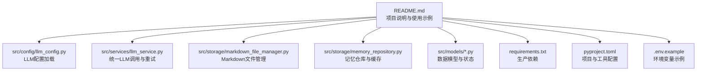
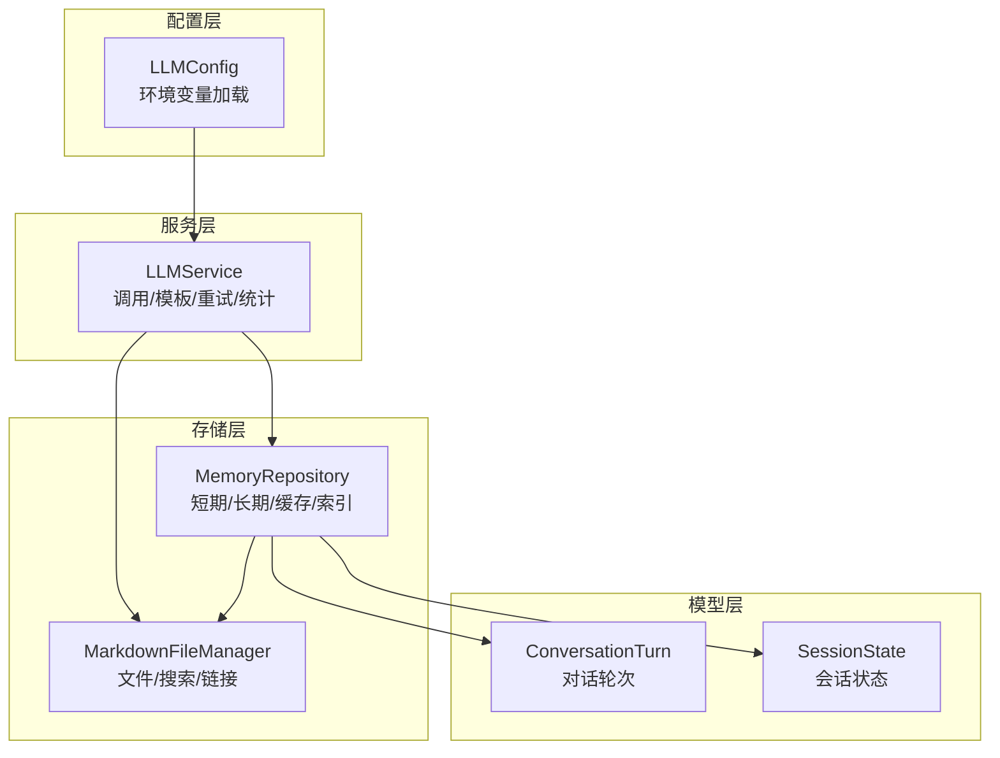
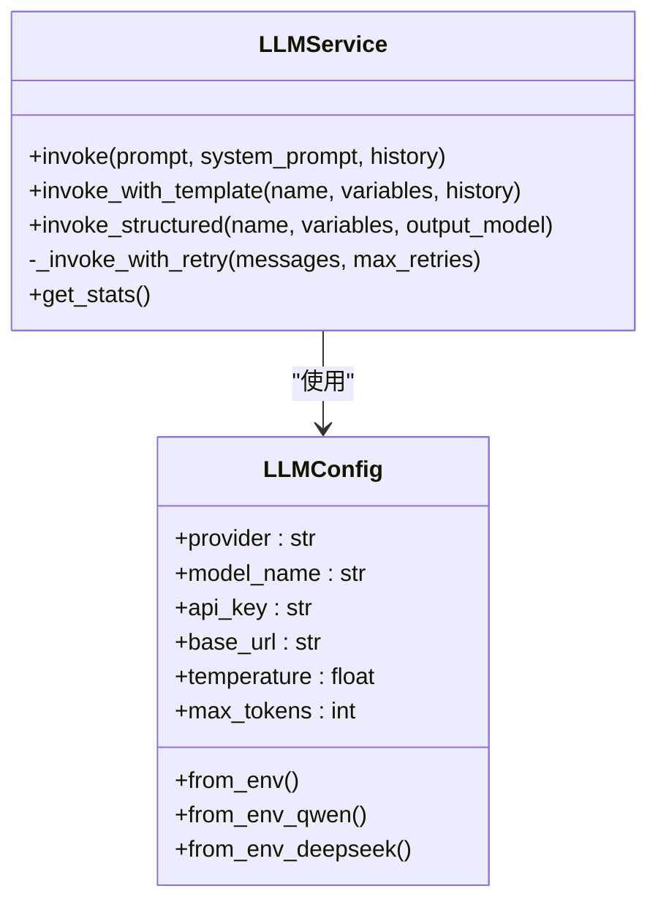
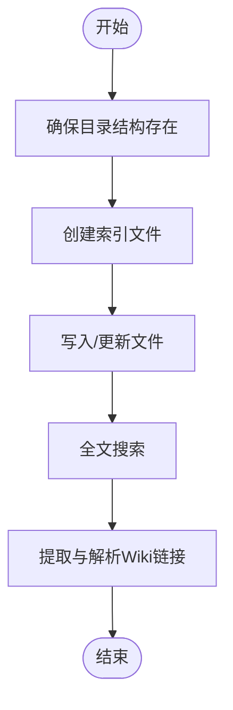
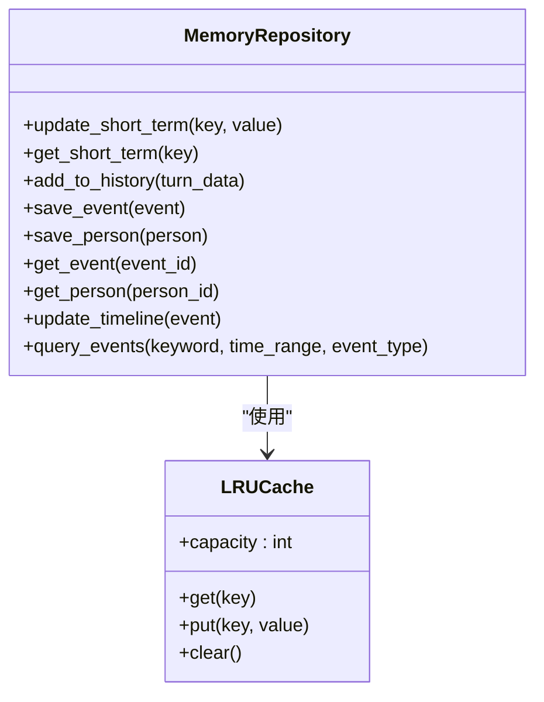
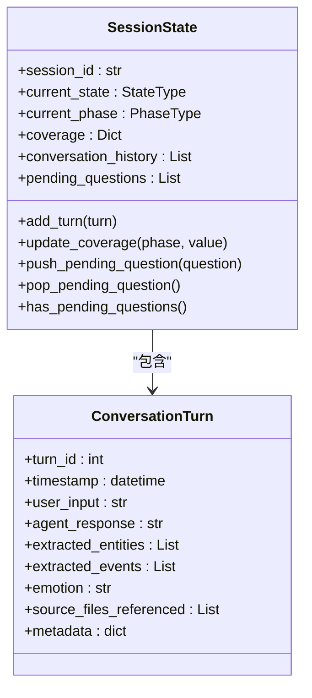
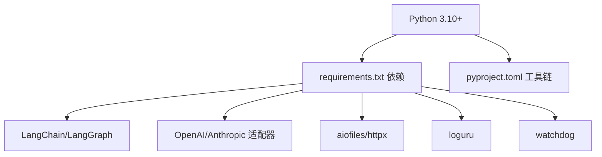

# 常见问题解答

<cite>
**本文引用的文件**
- [README.md](file://README.md)
- [requirements.txt](file://requirements.txt)
- [pyproject.toml](file://pyproject.toml)
- [src/config/llm_config.py](file://src/config/llm_config.py)
- [src/services/llm_service.py](file://src/services/llm_service.py)
- [src/storage/markdown_file_manager.py](file://src/storage/markdown_file_manager.py)
- [src/storage/memory_repository.py](file://src/storage/memory_repository.py)
- [src/models/conversation_turn.py](file://src/models/conversation_turn.py)
- [src/models/session_state.py](file://src/models/session_state.py)
- [src/enums/state_type.py](file://src/enums/state_type.py)
- [src/enums/phase_type.py](file://src/enums/phase_type.py)
- [.env.example](file://.env.example)
</cite>

## 目录
1. [简介](#简介)
2. [项目结构](#项目结构)
3. [核心组件](#核心组件)
4. [架构总览](#架构总览)
5. [详细组件分析](#详细组件分析)
6. [依赖关系分析](#依赖关系分析)
7. [性能注意事项](#性能注意事项)
8. [故障排查指南](#故障排查指南)
9. [结论](#结论)
10. [附录](#附录)

## 简介
本FAQ面向首次使用“老人自传 Agent 系统”的用户与维护者，聚焦安装与配置、运行时常见错误、UI/交互问题以及自检与快速排查步骤。内容基于仓库中的配置、服务与存储实现，帮助您快速定位并解决问题。

## 项目结构
- 项目采用模块化分层组织：配置、服务、存储、模型、提示词、工具等职责清晰。
- 关键运行要素包括：LLM 配置与调用、Markdown 文件管理、记忆仓库与缓存、会话状态与对话轮次模型。
- 环境变量通过 .env.example 提供参考，生产依赖在 requirements.txt 中声明。

**图表来源**
- [README.md:204-294](file://README.md#L204-L294)
- [src/config/llm_config.py:10-120](file://src/config/llm_config.py#L10-L120)
- [src/services/llm_service.py:32-481](file://src/services/llm_service.py#L32-L481)
- [src/storage/markdown_file_manager.py:31-546](file://src/storage/markdown_file_manager.py#L31-L546)
- [src/storage/memory_repository.py:40-359](file://src/storage/memory_repository.py#L40-L359)
- [requirements.txt:1-24](file://requirements.txt#L1-L24)
- [pyproject.toml:1-26](file://pyproject.toml#L1-L26)
- [.env.example](file://.env.example)

**章节来源**
- [README.md:92-200](file://README.md#L92-L200)
- [requirements.txt:1-24](file://requirements.txt#L1-L24)
- [pyproject.toml:1-26](file://pyproject.toml#L1-L26)

## 核心组件
- LLM 配置与调用
  - 通过 LLMConfig 从环境变量加载配置，支持 Qwen、DeepSeek、OpenAI、Anthropic 等提供商；提供默认配置回退策略。
  - LLMService 统一封装调用、模板加载、结构化输出、重试与统计。
- 存储与记忆
  - MarkdownFileManager 负责目录结构、文件读写、全文搜索、Wiki 链接解析与追踪。
  - MemoryRepository 提供短期/长期记忆、LRU 缓存、画像索引、事件与人物持久化。
- 数据模型与状态
  - ConversationTurn 记录单轮对话、实体与事件提取、情绪与来源文件。
  - SessionState 管理会话生命周期状态、覆盖率、对话历史与用户偏好。

**章节来源**
- [src/config/llm_config.py:10-120](file://src/config/llm_config.py#L10-L120)
- [src/services/llm_service.py:32-481](file://src/services/llm_service.py#L32-L481)
- [src/storage/markdown_file_manager.py:31-546](file://src/storage/markdown_file_manager.py#L31-L546)
- [src/storage/memory_repository.py:40-359](file://src/storage/memory_repository.py#L40-L359)
- [src/models/conversation_turn.py:14-52](file://src/models/conversation_turn.py#L14-L52)
- [src/models/session_state.py:24-139](file://src/models/session_state.py#L24-L139)

## 架构总览
系统围绕“配置—服务—存储—模型”四层展开，LLM 服务作为统一入口协调各模块；记忆仓库与文件管理器支撑知识库的结构化与检索；会话状态贯穿全流程。

**图表来源**
- [src/config/llm_config.py:10-120](file://src/config/llm_config.py#L10-L120)
- [src/services/llm_service.py:32-481](file://src/services/llm_service.py#L32-L481)
- [src/storage/markdown_file_manager.py:31-546](file://src/storage/markdown_file_manager.py#L31-L546)
- [src/storage/memory_repository.py:40-359](file://src/storage/memory_repository.py#L40-L359)
- [src/models/conversation_turn.py:14-52](file://src/models/conversation_turn.py#L14-L52)
- [src/models/session_state.py:24-139](file://src/models/session_state.py#L24-L139)

## 详细组件分析

### LLM 配置与调用（FAQ 关键）
- 依赖与版本
  - 生产依赖包含 LangChain、LangGraph、OpenAI、Pydantic、aiofiles、httpx、loguru、watchdog 等。
  - 项目要求 Python 3.10+，开发工具链由 pyproject.toml 管理。
- 环境变量与 API 密钥
  - Qwen 专属配置优先：QWEN_URL、QWEN_APIKEY；若缺失则抛出配置错误。
  - 也可使用通用配置（如 LLM_PROVIDER、LLM_MODEL_NAME、LLM_API_KEY、LLM_BASE_URL 等），但默认优先 DeepSeek/Qwen。
- 调用与重试
  - LLMService.invoke 支持系统提示、历史消息、指数退避重试与统计。
  - 结构化输出通过模板渲染与 JSON 解析，失败时返回错误结果。
- 常见问题与对策
  - 未配置 QWEN_URL/QWEN_APIKEY：将导致 LLMConfig.from_env/from_env_qwen 抛错。请复制 .env.example 并填入对应值。
  - 模板加载失败：检查 src/prompts 下的 Markdown 模板是否符合解析规则。
  - 超时/网络异常：查看日志与重试间隔，必要时调整 LLM_CONFIG 的超时与重试参数。

**图表来源**
- [src/config/llm_config.py:10-120](file://src/config/llm_config.py#L10-L120)
- [src/services/llm_service.py:32-481](file://src/services/llm_service.py#L32-L481)

**章节来源**
- [requirements.txt:1-24](file://requirements.txt#L1-L24)
- [pyproject.toml:1-26](file://pyproject.toml#L1-L26)
- [src/config/llm_config.py:10-120](file://src/config/llm_config.py#L10-L120)
- [src/services/llm_service.py:32-481](file://src/services/llm_service.py#L32-L481)

### 存储与知识库（FAQ 关键）
- 目录结构与索引
  - 初始化时确保 events/childhood、people/family 等目录存在，并创建 index.md。
- 文件读写与搜索
  - 支持异步/同步读取、追加章节、全文搜索与相关度排序。
- 链接与追踪
  - 提取与解析 Wiki 链接，支持锚点与递归追踪。
- 常见问题与对策
  - 目录不存在/权限不足：检查 KNOWLEDGE_BASE_PATH 或临时目录权限。
  - 文件不存在：确认相对路径与 base_path 组合是否正确。
  - 搜索无结果：关键词大小写不敏感，但需确保文件编码为 UTF-8。

**图表来源**
- [src/storage/markdown_file_manager.py:80-131](file://src/storage/markdown_file_manager.py#L80-L131)
- [src/storage/markdown_file_manager.py:134-262](file://src/storage/markdown_file_manager.py#L134-L262)
- [src/storage/markdown_file_manager.py:285-335](file://src/storage/markdown_file_manager.py#L285-L335)
- [src/storage/markdown_file_manager.py:358-431](file://src/storage/markdown_file_manager.py#L358-L431)

**章节来源**
- [src/storage/markdown_file_manager.py:31-546](file://src/storage/markdown_file_manager.py#L31-L546)

### 记忆仓库与缓存（FAQ 关键）
- 短期记忆与历史
  - 内存字典与固定容量队列，支持添加对话历史与容量控制。
- 长期记忆与索引
  - 事件与人物持久化至 Markdown 文件，按人生阶段与角色分类；维护索引与 LRU 缓存。
- 常见问题与对策
  - 事件/人物未落盘：检查事件时间与角色映射逻辑，确认生成的相对路径有效。
  - 缓存命中率低：适当增大缓存容量或减少频繁小文件读写。

**图表来源**
- [src/storage/memory_repository.py:16-38](file://src/storage/memory_repository.py#L16-L38)
- [src/storage/memory_repository.py:40-359](file://src/storage/memory_repository.py#L40-L359)

**章节来源**
- [src/storage/memory_repository.py:40-359](file://src/storage/memory_repository.py#L40-L359)

### 会话状态与对话轮次（FAQ 关键）
- 会话状态
  - 包含会话 ID、创建/最后活动时间、当前状态与阶段、覆盖率、对话历史、待追问问题等。
- 对话轮次
  - 记录用户输入、Agent 回复、提取实体与事件、情绪、引用的记忆库文件与元数据。
- 常见问题与对策
  - 状态未更新：确认每轮对话后调用 SessionState.add_turn 并更新覆盖率。
  - 实体/事件为空：检查 LLM 模板与结构化输出是否正确渲染与解析。

**图表来源**
- [src/models/conversation_turn.py:14-52](file://src/models/conversation_turn.py#L14-L52)
- [src/models/session_state.py:24-139](file://src/models/session_state.py#L24-L139)
- [src/enums/state_type.py:4-12](file://src/enums/state_type.py#L4-L12)
- [src/enums/phase_type.py:4-10](file://src/enums/phase_type.py#L4-L10)

**章节来源**
- [src/models/conversation_turn.py:14-52](file://src/models/conversation_turn.py#L14-L52)
- [src/models/session_state.py:24-139](file://src/models/session_state.py#L24-L139)
- [src/enums/state_type.py:4-12](file://src/enums/state_type.py#L4-L12)
- [src/enums/phase_type.py:4-10](file://src/enums/phase_type.py#L4-L10)

## 依赖关系分析
- Python 版本与工具链
  - requires-python >= 3.10；开发依赖由 pyproject.toml 的 dev 选项与 pytest、black、isort、flake8、mypy 管理。
- 运行时依赖
  - LangChain/LangGraph 用于 Agent 与链路；OpenAI/Anthropic 适配器用于模型调用；aiofiles/httpx 用于异步文件与网络；loguru 用于日志；watchdog 用于文件监控。
- 版本冲突建议
  - 若出现 LangChain/LangGraph 版本不兼容，优先对照 README 的技术栈版本范围进行锁定或升级。
  - 若 httpx/aiofiles 版本引发异步行为差异，建议统一至与 requirements.txt 一致的版本。

**图表来源**
- [requirements.txt:1-24](file://requirements.txt#L1-L24)
- [pyproject.toml:1-26](file://pyproject.toml#L1-L26)

**章节来源**
- [requirements.txt:1-24](file://requirements.txt#L1-L24)
- [pyproject.toml:1-26](file://pyproject.toml#L1-L26)

## 性能注意事项
- Token 用量与延迟
  - LLMService 统计 total_tokens、平均延迟与成功率，便于评估成本与性能瓶颈。
- 文件 I/O 与搜索
  - 大量小文件读写会影响性能，建议合并写入、避免频繁追加；搜索时限制关键字与目录范围。
- 缓存策略
  - MemoryRepository 的 LRU 缓存可显著降低重复读取开销，合理设置容量与淘汰策略。

**章节来源**
- [src/services/llm_service.py:449-456](file://src/services/llm_service.py#L449-L456)
- [src/storage/memory_repository.py:16-38](file://src/storage/memory_repository.py#L16-L38)

## 故障排查指南

### 安装与配置类问题
- 依赖安装失败或版本冲突
  - 现象：pip 安装时报错或运行时报模块导入失败。
  - 排查：确认 Python 版本满足要求；使用与 requirements.txt 一致的版本；避免在同一环境中混用不同来源的依赖。
  - 参考：[requirements.txt:1-24](file://requirements.txt#L1-L24)、[pyproject.toml:1-26](file://pyproject.toml#L1-L26)
- 环境变量未生效
  - 现象：QWEN_URL/QWEN_APIKEY 未被读取，导致配置加载失败。
  - 排查：复制 .env.example 并命名为 .env；确保键名与 LLMConfig 支持的环境变量一致；重启终端或重新加载环境。
  - 参考：[src/config/llm_config.py:42-61](file://src/config/llm_config.py#L42-L61)
- API 密钥无效或网络受限
  - 现象：调用 LLMService 抛出异常或超时。
  - 排查：确认 API Key 与 base_url 正确；检查网络连通性与代理设置；查看日志中重试记录。
  - 参考：[src/services/llm_service.py:400-437](file://src/services/llm_service.py#L400-L437)

### 运行时常见错误
- 文件权限问题
  - 现象：无法创建/写入知识库文件或索引。
  - 排查：检查 KNOWLEDGE_BASE_PATH 指向的目录权限；确保进程对目标路径具有读写权限。
  - 参考：[src/storage/markdown_file_manager.py:134-169](file://src/storage/markdown_file_manager.py#L134-L169)
- 内存不足
  - 现象：大量并发调用或大文件读取导致 OOM。
  - 排查：降低并发、限制单次处理的数据量；优化模板与输出结构，减少中间对象。
  - 参考：[src/services/llm_service.py:327-398](file://src/services/llm_service.py#L327-L398)
- 网络连接失败
  - 现象：调用 LLMService 时超时或连接被拒。
  - 排查：检查 base_url 与防火墙；必要时配置代理；查看重试日志。
  - 参考：[src/services/llm_service.py:400-437](file://src/services/llm_service.py#L400-L437)

### 用户界面与交互问题
- 对话异常/无响应
  - 现象：调用 LLMService 后无返回或报错。
  - 排查：确认模板名称存在；检查结构化输出 JSON 解析；查看 SessionState 是否正确更新。
  - 参考：[src/services/llm_service.py:293-325](file://src/services/llm_service.py#L293-L325)、[src/models/session_state.py:87-91](file://src/models/session_state.py#L87-L91)
- 显示错误/内容缺失
  - 现象：知识库页面或搜索结果不完整。
  - 排查：确认文件编码为 UTF-8；检查 Wiki 链接格式与目标文件是否存在。
  - 参考：[src/storage/markdown_file_manager.py:358-431](file://src/storage/markdown_file_manager.py#L358-L431)
- 功能不可用
  - 现象：某些服务（如知识库查询）不可用。
  - 排查：确认 LLMService 初始化成功；检查 MarkdownFileManager 的目录结构是否完整。
  - 参考：[src/storage/memory_repository.py:82-87](file://src/storage/memory_repository.py#L82-L87)

### 错误信息解读与修复步骤
- 配置类错误
  - “未配置Qwen专属API密钥或URL”：请在 .env 中设置 QWEN_URL 与 QWEN_APIKEY。
  - 参考：[src/config/llm_config.py:59-60](file://src/config/llm_config.py#L59-L60)
- 调用类错误
  - “Template not found”：检查模板名称与加载路径。
  - “Parse error”：检查模板渲染与 JSON 输出格式。
  - 参考：[src/services/llm_service.py:312-313](file://src/services/llm_service.py#L312-L313)、[src/services/llm_service.py:394-398](file://src/services/llm_service.py#L394-L398)
- 文件类错误
  - “File not found”：检查相对路径与 base_path 组合。
  - 参考：[src/storage/markdown_file_manager.py:188-189](file://src/storage/markdown_file_manager.py#L188-L189)

### 问题自检清单与快速排查步骤
- 安装与环境
  - Python 版本是否满足要求
  - 依赖是否与 requirements.txt 一致
  - .env 是否存在且包含 QWEN_URL/QWEN_APIKEY
- 运行与配置
  - LLMService 是否初始化成功
  - 知识库目录结构是否完整（events/people/timeline/themes/index.md）
  - 模板文件是否可被正确加载
- 性能与稳定性
  - 是否存在大量小文件写入
  - 是否开启过多并发
  - 日志中是否有频繁重试
- UI/交互
  - 对话轮次是否正常推进
  - 搜索结果是否返回
  - Wiki 链接是否可解析

**章节来源**
- [README.md:242-278](file://README.md#L242-L278)
- [src/config/llm_config.py:42-120](file://src/config/llm_config.py#L42-L120)
- [src/services/llm_service.py:218-437](file://src/services/llm_service.py#L218-L437)
- [src/storage/markdown_file_manager.py:80-131](file://src/storage/markdown_file_manager.py#L80-L131)
- [src/storage/memory_repository.py:82-87](file://src/storage/memory_repository.py#L82-L87)

## 结论
通过本 FAQ，您可以系统地定位与解决安装、配置、运行时与交互层面的问题。建议在部署与调试过程中遵循“先配置后运行、先本地后线上、先单点后全链路”的原则，并结合日志与统计指标进行持续优化。

## 附录
- 快速参考
  - 环境变量示例与配置位置：[README.md:242-265](file://README.md#L242-L265)、[.env.example](file://.env.example)
  - 依赖与版本：[requirements.txt:1-24](file://requirements.txt#L1-L24)、[pyproject.toml:1-26](file://pyproject.toml#L1-L26)
  - LLM 配置加载与默认回退：[src/config/llm_config.py:42-120](file://src/config/llm_config.py#L42-L120)
  - 统一日志与统计：[src/services/llm_service.py:449-456](file://src/services/llm_service.py#L449-L456)