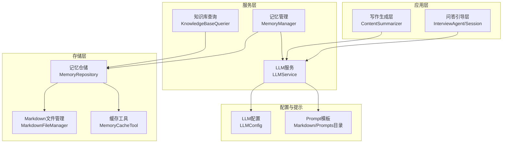
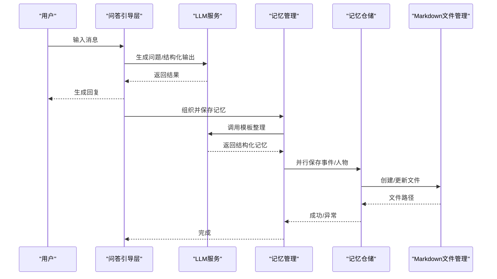
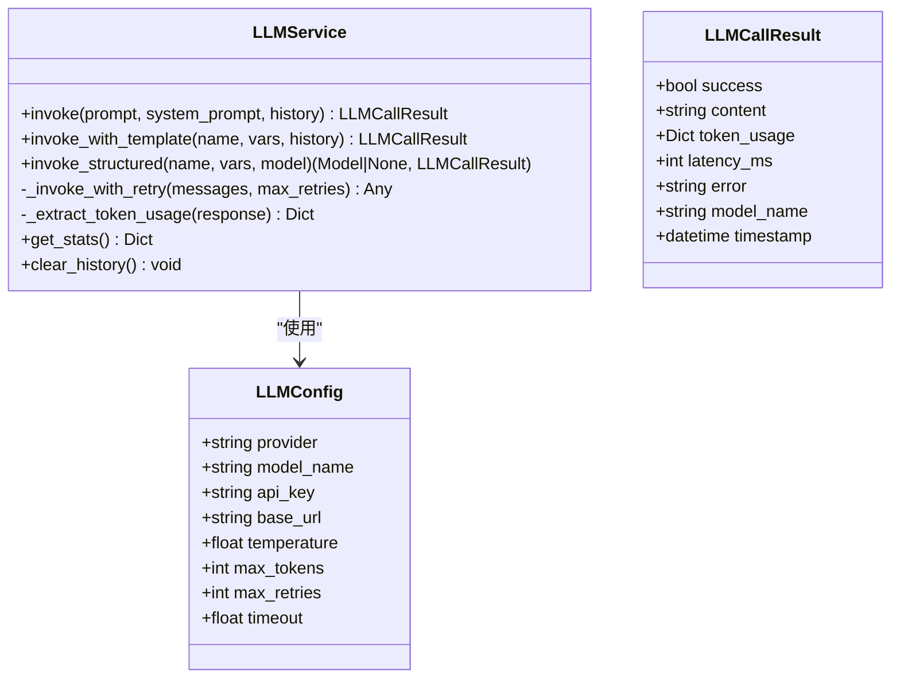
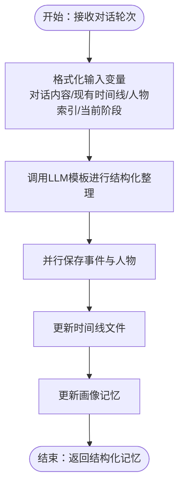
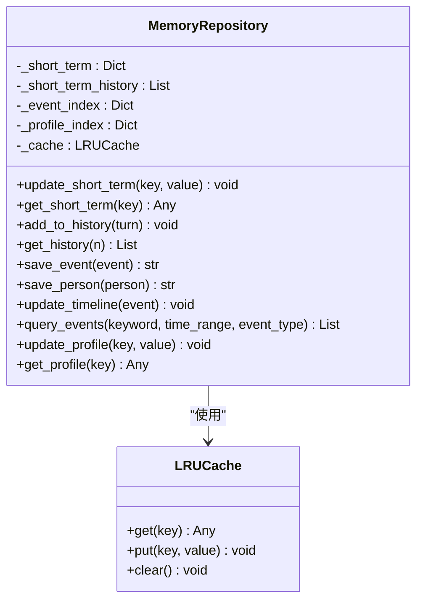
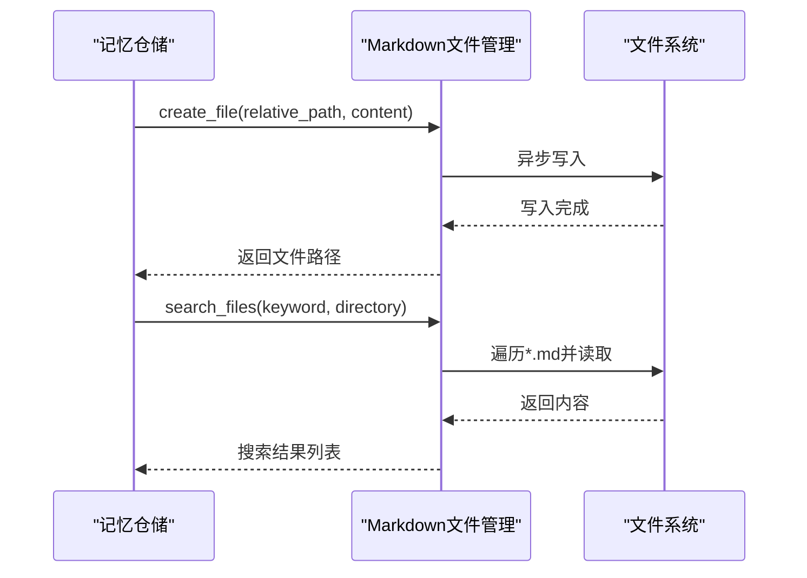
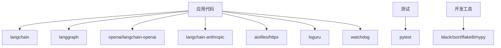

# 性能问题诊断

<cite>
**本文引用的文件**
- [README.md](file://README.md)
- [requirements.txt](file://requirements.txt)
- [pyproject.toml](file://pyproject.toml)
- [src/services/llm_service.py](file://src/services/llm_service.py)
- [src/services/memory_manager.py](file://src/services/memory_manager.py)
- [src/storage/memory_repository.py](file://src/storage/memory_repository.py)
- [src/storage/markdown_file_manager.py](file://src/storage/markdown_file_manager.py)
- [src/tools/memory_cache_tool.py](file://src/tools/memory_cache_tool.py)
- [src/models/organized_memory.py](file://src/models/organized_memory.py)
- [src/config/llm_config.py](file://src/config/llm_config.py)
- [tests/test_memory_manager.py](file://tests/test_memory_manager.py)
- [tests/test_llm_service.py](file://tests/test_llm_service.py)
</cite>

## 目录
1. [简介](#简介)
2. [项目结构](#项目结构)
3. [核心组件](#核心组件)
4. [架构概览](#架构概览)
5. [详细组件分析](#详细组件分析)
6. [依赖分析](#依赖分析)
7. [性能考量](#性能考量)
8. [故障排查指南](#故障排查指南)
9. [结论](#结论)
10. [附录](#附录)

## 简介
本技术文档面向“老人自传 Agent 系统”的性能问题诊断与优化，聚焦以下关键领域：
- CPU 使用率分析与热点定位：识别大模型调用、文件 I/O、并发任务调度的热点路径
- 内存管理问题诊断：短期记忆缓存、事件/人物索引、Markdown 文件读写与缓存的内存占用与增长趋势
- 磁盘 I/O 监控：文件创建、更新、全文搜索、链接追踪的 I/O 行为与延迟
- 网络延迟测量：大模型 API 请求的延迟、成功率与重试开销
- 性能优化策略：LLM 调用优化、缓存策略、批量与并行化、配置调优
- 基准与压测：基于现有测试与服务接口的性能评估方法

## 项目结构
系统采用分层架构，围绕“对话编排—记忆管理—知识库存储”三大主线展开，辅以 Prompt 模板与配置管理。

图表来源
- [src/services/llm_service.py](file://src/services/llm_service.py)
- [src/services/memory_manager.py](file://src/services/memory_manager.py)
- [src/storage/memory_repository.py](file://src/storage/memory_repository.py)
- [src/storage/markdown_file_manager.py](file://src/storage/markdown_file_manager.py)
- [src/tools/memory_cache_tool.py](file://src/tools/memory_cache_tool.py)
- [src/config/llm_config.py](file://src/config/llm_config.py)

章节来源
- [README.md](file://README.md)
- [requirements.txt](file://requirements.txt)
- [pyproject.toml](file://pyproject.toml)

## 核心组件
- LLM 服务：统一的大模型调用入口，封装模板加载、结构化输出、重试与统计
- 记忆管理：将多轮对话整理为结构化记忆（事件/人物/时间线），并落盘
- 记忆仓储：短期/长期/画像记忆的统一存储与索引，内置 LRU 缓存
- Markdown 文件管理：异步文件读写、全文搜索、Wiki 链接追踪
- 缓存工具：会话级短期缓存，支持关键词检索与追加更新
- 配置管理：从环境变量加载 LLM 提供商、模型、超时与重试参数

章节来源
- [src/services/llm_service.py](file://src/services/llm_service.py)
- [src/services/memory_manager.py](file://src/services/memory_manager.py)
- [src/storage/memory_repository.py](file://src/storage/memory_repository.py)
- [src/storage/markdown_file_manager.py](file://src/storage/markdown_file_manager.py)
- [src/tools/memory_cache_tool.py](file://src/tools/memory_cache_tool.py)
- [src/config/llm_config.py](file://src/config/llm_config.py)

## 架构概览
系统运行时的关键调用链如下：

图表来源
- [src/services/llm_service.py](file://src/services/llm_service.py)
- [src/services/memory_manager.py](file://src/services/memory_manager.py)
- [src/storage/memory_repository.py](file://src/storage/memory_repository.py)
- [src/storage/markdown_file_manager.py](file://src/storage/markdown_file_manager.py)

## 详细组件分析

### LLM 服务（性能关键点）
- 统一模型初始化与模板加载，支持多种提供商与兼容 API
- 结构化输出解析与错误处理，包含 JSON 提取与降级
- 指数退避重试与延迟统计，便于性能观测
- Token 使用量与平均延迟统计，支撑成本与延迟分析

图表来源
- [src/services/llm_service.py](file://src/services/llm_service.py)
- [src/config/llm_config.py](file://src/config/llm_config.py)

章节来源
- [src/services/llm_service.py](file://src/services/llm_service.py)
- [src/config/llm_config.py](file://src/config/llm_config.py)
- [tests/test_llm_service.py](file://tests/test_llm_service.py)

### 记忆管理（结构化处理与并行落盘）
- 将多轮对话格式化为模板变量，调用 LLM 进行结构化整理
- 并行保存事件与人物，减少 I/O 等待；随后更新时间线
- 画像更新：合并关键事件、性格特征、价值观线索与人物关系

图表来源
- [src/services/memory_manager.py](file://src/services/memory_manager.py)
- [src/models/organized_memory.py](file://src/models/organized_memory.py)

章节来源
- [src/services/memory_manager.py](file://src/services/memory_manager.py)
- [src/models/organized_memory.py](file://src/models/organized_memory.py)

### 记忆仓储（短期/长期/画像与 LRU 缓存）
- 短期记忆：会话内键值缓存与对话历史队列（固定容量）
- 长期记忆：事件/人物/时间线文件落盘，维护索引与 LRU 缓存
- 画像记忆：结构化键值存储，便于快速查询与更新
- 查询与更新：事件检索、人物获取、时间线追加

图表来源
- [src/storage/memory_repository.py](file://src/storage/memory_repository.py)

章节来源
- [src/storage/memory_repository.py](file://src/storage/memory_repository.py)

### Markdown 文件管理（异步 I/O 与全文搜索）
- 异步文件创建/读取/更新，支持追加章节
- 全文搜索：按关键词检索，计算相关度并返回上下文
- 链接追踪：提取与解析 Wiki 链接，支持递归深度追踪

图表来源
- [src/storage/markdown_file_manager.py](file://src/storage/markdown_file_manager.py)

章节来源
- [src/storage/markdown_file_manager.py](file://src/storage/markdown_file_manager.py)

### 缓存工具（会话级短期缓存）
- 以会话为单位的内存缓存，支持标签检索与时间戳
- 适用于对话上下文、中间结果的快速复用

章节来源
- [src/tools/memory_cache_tool.py](file://src/tools/memory_cache_tool.py)

## 依赖分析
- 运行时依赖：LangChain、LangGraph、OpenAI/Anthropic、aiofiles、httpx、loguru、watchdog 等
- 开发与测试：pytest、black、isort、flake8、mypy
- LLM 提供商：DeepSeek、OpenAI、Anthropic（通过配置切换）

图表来源
- [requirements.txt](file://requirements.txt)
- [pyproject.toml](file://pyproject.toml)

章节来源
- [requirements.txt](file://requirements.txt)
- [pyproject.toml](file://pyproject.toml)

## 性能考量

### CPU 使用率分析与热点定位
- LLM 调用：结构化输出解析与 JSON 提取可能产生 CPU 开销，建议在高频场景下减少解析失败与重试次数
- 并行保存：记忆管理中的事件/人物并行保存可提升吞吐，但需注意并发度与锁竞争
- 模板加载：首次加载 Prompt 模板存在 IO 与解析成本，建议在进程启动时预热

优化建议
- 降低结构化输出失败率：完善模板约束与输出格式提示
- 合理设置并发度：根据硬件资源与 I/O 能力调整并行任务数
- 预热模板：在应用启动阶段加载常用模板

章节来源
- [src/services/llm_service.py](file://src/services/llm_service.py)
- [src/services/memory_manager.py](file://src/services/memory_manager.py)

### 内存管理问题诊断
- 短期记忆：会话内键值缓存与历史队列容量有限，避免无限增长
- LRU 缓存：事件/人物索引缓存容量可控，注意缓存命中率与淘汰策略
- 文件读写：异步文件操作减少阻塞，但大量小文件读写仍会带来内存压力

诊断方法
- 监控短期记忆与缓存大小：定期打印容量与条目数
- 分析缓存命中率：统计缓存命中/未命中次数
- 观察内存曲线：结合系统监控工具观察内存增长趋势

章节来源
- [src/storage/memory_repository.py](file://src/storage/memory_repository.py)
- [src/tools/memory_cache_tool.py](file://src/tools/memory_cache_tool.py)

### 磁盘 I/O 监控
- 文件创建/更新：事件与人物文件频繁创建，建议批量写入与去重
- 全文搜索：遍历 *.md 文件并读取内容，建议限制搜索范围与结果数
- 链接追踪：递归深度越大，I/O 与内存消耗越高

优化建议
- 批量写入：合并多次更新为单次写入
- 限制搜索：设置最大结果数与目录范围
- 控制递归深度：根据需求调整链接追踪深度

章节来源
- [src/storage/markdown_file_manager.py](file://src/storage/markdown_file_manager.py)
- [src/storage/memory_repository.py](file://src/storage/memory_repository.py)

### 网络延迟测量
- LLM 调用延迟：记录每次请求的耗时与成功率，结合重试次数评估稳定性
- Token 使用：统计总 Token 与平均单价，评估成本与延迟的权衡

测量方法
- 使用 LLM 服务的统计接口获取平均延迟与成功率
- 记录每次调用的 token_usage，计算总成本

章节来源
- [src/services/llm_service.py](file://src/services/llm_service.py)

### 性能优化策略与最佳实践
- 代码优化
  - 减少不必要的字符串拼接与正则匹配
  - 合理使用异步 I/O，避免阻塞
- 配置调优
  - 调整 LLM 温度与最大 Token，平衡质量与延迟
  - 设置合理的重试次数与超时时间
- 架构改进
  - 引入外部缓存（如 Redis）替代内存缓存，提升共享与持久化能力
  - 对热点文件引入只增式更新策略，减少随机写

章节来源
- [src/config/llm_config.py](file://src/config/llm_config.py)
- [src/services/llm_service.py](file://src/services/llm_service.py)

### 基准与压力测试
- 基于现有测试用例扩展
  - 增加不同规模对话轮次的基准测试，记录平均延迟与内存占用
  - 压力测试：模拟高并发 LLM 调用与文件写入，观察系统瓶颈
- 测试方法
  - 使用测试框架的性能标记与统计接口
  - 结合系统监控工具（如 top、htop、iotop、iostat）观测资源使用

章节来源
- [tests/test_memory_manager.py](file://tests/test_memory_manager.py)
- [tests/test_llm_service.py](file://tests/test_llm_service.py)

## 故障排查指南

常见问题与定位步骤
- LLM 调用失败
  - 检查 API Key、Base URL 与提供商配置
  - 观察重试日志与延迟统计，确认是否为网络抖动
- 结构化输出解析失败
  - 检查模板输出格式与 JSON 包裹
  - 降低温度与最大 Token，提高输出稳定性
- 文件写入异常
  - 检查磁盘空间与权限
  - 优化写入策略，避免频繁小文件写入
- 缓存命中率低
  - 分析查询模式，优化标签与检索策略
  - 调整缓存容量与淘汰策略

章节来源
- [src/services/llm_service.py](file://src/services/llm_service.py)
- [src/storage/markdown_file_manager.py](file://src/storage/markdown_file_manager.py)
- [src/storage/memory_repository.py](file://src/storage/memory_repository.py)

## 结论
通过对 LLM 服务、记忆管理、存储层与缓存工具的性能剖析，可以系统性地识别与缓解 CPU、内存、磁盘 I/O 与网络延迟方面的瓶颈。建议在生产环境中引入外部缓存、优化文件写入策略、合理配置 LLM 参数，并建立完善的监控与压测体系，持续迭代性能表现。

## 附录
- 环境变量与配置项参考：见 LLM 配置模块
- 依赖清单：见 requirements 与 pyproject 配置

章节来源
- [src/config/llm_config.py](file://src/config/llm_config.py)
- [requirements.txt](file://requirements.txt)
- [pyproject.toml](file://pyproject.toml)