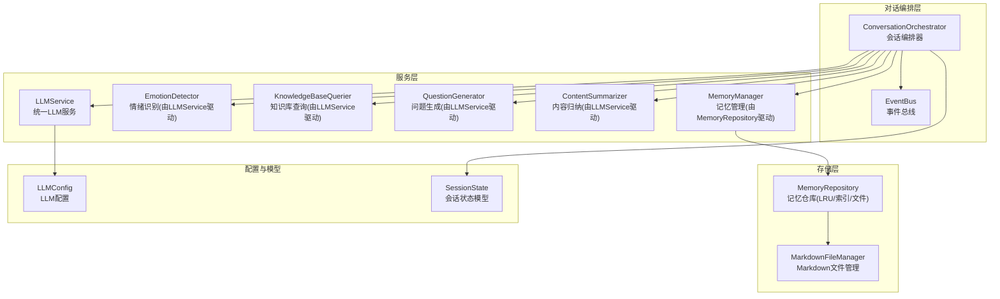
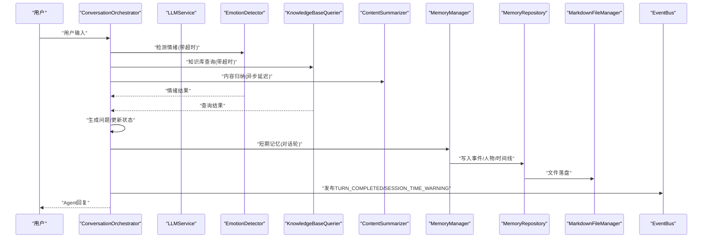
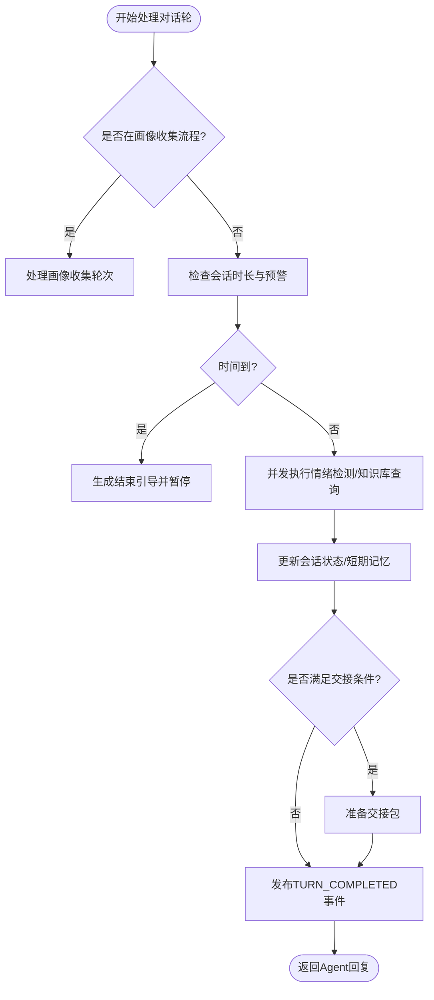
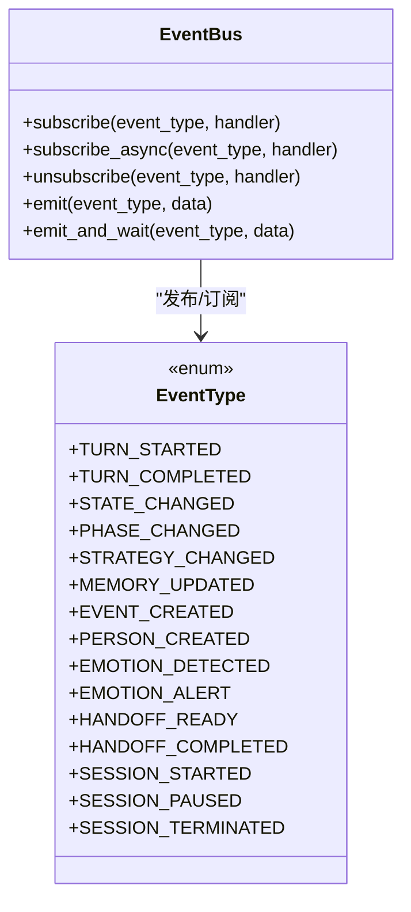
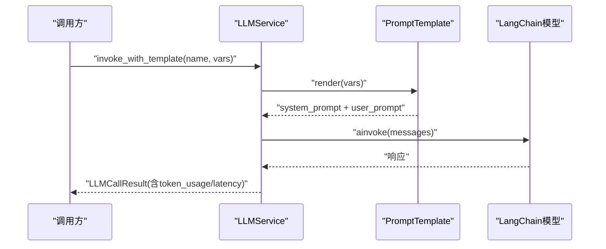
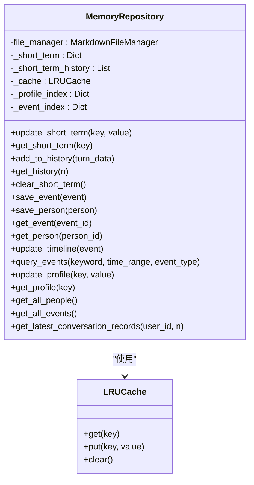
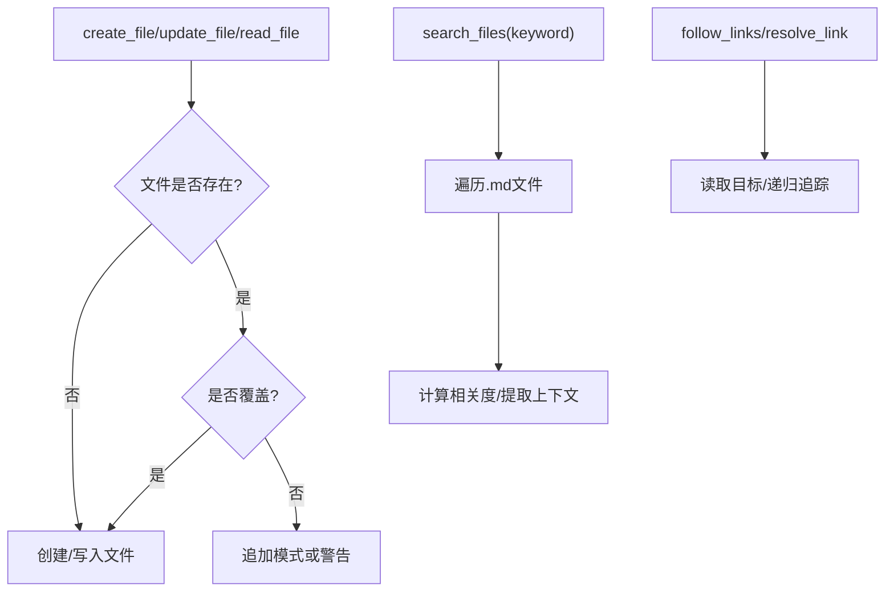
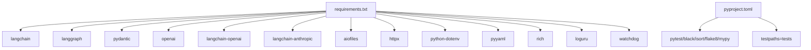

# 故障排除

<cite>
**本文引用的文件**
- [README.md](file://README.md)
- [pyproject.toml](file://pyproject.toml)
- [requirements.txt](file://requirements.txt)
- [src/core/conversation_orchestrator.py](file://src/core/conversation_orchestrator.py)
- [src/core/event_bus.py](file://src/core/event_bus.py)
- [src/services/llm_service.py](file://src/services/llm_service.py)
- [src/storage/memory_repository.py](file://src/storage/memory_repository.py)
- [src/storage/markdown_file_manager.py](file://src/storage/markdown_file_manager.py)
- [src/config/llm_config.py](file://src/config/llm_config.py)
- [src/models/session_state.py](file://src/models/session_state.py)
- [tests/test_llm_service.py](file://tests/test_llm_service.py)
- [tests/test_memory_repository.py](file://tests/test_memory_repository.py)
- [test_log/conversation1.log](file://test_log/conversation1.log)
</cite>

## 目录
1. [简介](#简介)
2. [项目结构](#项目结构)
3. [核心组件](#核心组件)
4. [架构总览](#架构总览)
5. [详细组件分析](#详细组件分析)
6. [依赖关系分析](#依赖关系分析)
7. [性能考量](#性能考量)
8. [故障排除指南](#故障排除指南)
9. [结论](#结论)
10. [附录](#附录)

## 简介
本技术文档面向“老人自传 Agent 系统”的运维与开发人员，提供系统级故障排除指南。内容涵盖安装与环境问题、配置错误、运行时异常、性能问题诊断、紧急处理流程、应急预案、监控告警与预防措施，并给出调试技巧与工具使用建议，帮助快速定位与解决问题。

## 项目结构
系统采用模块化分层设计，核心模块包括：
- 对话编排层：负责会话状态管理、超时控制、情绪检测、问题生成、内容归纳与交接。
- 服务层：统一LLM调用、情绪识别、知识库查询、问题生成、内容归纳、记忆管理。
- 存储层：Markdown文件管理、记忆仓库（短期/长期/画像记忆）、LRU缓存。
- 配置与模型：LLM配置、会话状态模型、事件/人物模型等。

图表来源
- [src/core/conversation_orchestrator.py](file://src/core/conversation_orchestrator.py)
- [src/core/event_bus.py](file://src/core/event_bus.py)
- [src/services/llm_service.py](file://src/services/llm_service.py)
- [src/storage/memory_repository.py](file://src/storage/memory_repository.py)
- [src/storage/markdown_file_manager.py](file://src/storage/markdown_file_manager.py)
- [src/config/llm_config.py](file://src/config/llm_config.py)
- [src/models/session_state.py](file://src/models/session_state.py)

章节来源
- [README.md](file://README.md)
- [pyproject.toml](file://pyproject.toml)
- [requirements.txt](file://requirements.txt)

## 核心组件
- 会话编排器：协调异步任务、管理会话状态、处理超时与交接、发布事件。
- 事件总线：解耦组件间通信，支持同步/异步订阅与安全异步调用。
- LLM服务：统一模型调用、模板加载、结构化输出、重试与统计。
- 记忆仓库：短期/长期/画像记忆统一管理，LRU缓存与索引。
- Markdown文件管理：目录结构保证、文件读写、全文搜索、Wiki链接追踪。
- LLM配置：环境变量优先策略、多提供商支持、超时与重试配置。
- 会话状态：覆盖度、对话历史、情绪状态、待追问问题等。

章节来源
- [src/core/conversation_orchestrator.py](file://src/core/conversation_orchestrator.py)
- [src/core/event_bus.py](file://src/core/event_bus.py)
- [src/services/llm_service.py](file://src/services/llm_service.py)
- [src/storage/memory_repository.py](file://src/storage/memory_repository.py)
- [src/storage/markdown_file_manager.py](file://src/storage/markdown_file_manager.py)
- [src/config/llm_config.py](file://src/config/llm_config.py)
- [src/models/session_state.py](file://src/models/session_state.py)

## 架构总览
系统采用“编排器-服务-存储-配置-模型”分层，事件总线贯穿各层，实现低耦合高内聚。编排器负责会话生命周期与状态流转；服务层封装LLM与工具；存储层提供文件系统与缓存；配置与模型提供运行参数与数据契约。

图表来源
- [src/core/conversation_orchestrator.py](file://src/core/conversation_orchestrator.py)
- [src/services/llm_service.py](file://src/services/llm_service.py)
- [src/storage/memory_repository.py](file://src/storage/memory_repository.py)
- [src/storage/markdown_file_manager.py](file://src/storage/markdown_file_manager.py)
- [src/core/event_bus.py](file://src/core/event_bus.py)

## 详细组件分析

### 会话编排器（ConversationOrchestrator）
- 关键职责：初始化会话、处理对话轮次、并发执行情绪检测与知识库查询、超时保护、会话计时与时间预警、交接准备与终止。
- 超时与重试：对情绪检测与知识库查询设置超时；对LLM调用内置指数退避重试。
- 事件发布：在关键节点发布TURN_COMPLETED、SESSION_TIME_WARNING、SESSION_TERMINATED等事件。
- 会话时长控制：SessionTiming提供剩余时间计算、预警阈值与“时间到”判定。
- 画像收集流程：ProfileCollectionState管理首次信息收集的状态机，逐步推进基础与详细信息采集。

图表来源
- [src/core/conversation_orchestrator.py](file://src/core/conversation_orchestrator.py)

章节来源
- [src/core/conversation_orchestrator.py](file://src/core/conversation_orchestrator.py)

### 事件总线（EventBus）
- 设计要点：支持同步与异步订阅，安全异步调用，emit_and_wait等待所有异步处理器完成。
- 使用场景：编排器发布会话事件，外部系统订阅进行监控与告警。

图表来源
- [src/core/event_bus.py](file://src/core/event_bus.py)

章节来源
- [src/core/event_bus.py](file://src/core/event_bus.py)

### LLM服务（LLMService）
- 统一入口：封装LangChain调用、模板加载、结构化输出、统计与历史。
- 模板系统：从Python模块与外部Markdown目录加载Prompt模板，支持变量提取与渲染。
- 结构化输出：通过系统提示强制JSON输出并解析，增强鲁棒性。
- 重试与统计：内置指数退避重试与调用统计（成功率、平均延迟、Token用量）。

图表来源
- [src/services/llm_service.py](file://src/services/llm_service.py)

章节来源
- [src/services/llm_service.py](file://src/services/llm_service.py)
- [tests/test_llm_service.py](file://tests/test_llm_service.py)

### 记忆仓库（MemoryRepository）
- 记忆分层：短期记忆（内存队列与缓存）、长期记忆（文件系统）、画像记忆（内存索引）。
- 缓存策略：LRU缓存，命中优先，容量淘汰。
- 文件落盘：事件/人物/时间线文件写入与索引更新。
- 会话记录读取：按最新文件排序读取对话记录，支持n条最近记录。

图表来源
- [src/storage/memory_repository.py](file://src/storage/memory_repository.py)

章节来源
- [src/storage/memory_repository.py](file://src/storage/memory_repository.py)
- [tests/test_memory_repository.py](file://tests/test_memory_repository.py)

### Markdown文件管理（MarkdownFileManager）
- 目录结构：确保events/childhood等目录存在，创建索引文件。
- 文件操作：异步/同步读写、追加章节、更新文件。
- 搜索功能：全文搜索，计算相关度，返回上下文。
- 链接处理：提取Wiki链接、解析链接、递归追踪。

图表来源
- [src/storage/markdown_file_manager.py](file://src/storage/markdown_file_manager.py)

章节来源
- [src/storage/markdown_file_manager.py](file://src/storage/markdown_file_manager.py)

### LLM配置（LLMConfig）
- 环境变量优先策略：优先使用QWEN专属配置，其次DeepSeek，最后回退到通用配置。
- 超时与重试：max_retries、retry_delay、timeout。
- 提供商支持：openai/anthropic/qwen/deepseek。

章节来源
- [src/config/llm_config.py](file://src/config/llm_config.py)

### 会话状态（SessionState）
- 状态字段：会话ID、创建时间、最后活动时间、当前状态/阶段/策略、轮次、覆盖率、采集事件/人物、当前话题、情绪状态、待追问问题、对话历史、用户偏好。
- 方法：添加对话轮、更新覆盖率、标记采集、待追问问题队列、从情绪结果更新状态、摘要与最近历史。

章节来源
- [src/models/session_state.py](file://src/models/session_state.py)

## 依赖关系分析
- 运行时依赖：langchain、langgraph、pydantic、openai、langchain-openai、aiofiles、httpx、python-dotenv、pyyaml、rich、loguru、watchdog。
- 开发依赖：pytest、black、isort、flake8、mypy。
- 项目配置：pytest测试路径、mypy严格模式、black/isort风格。

图表来源
- [requirements.txt](file://requirements.txt)
- [pyproject.toml](file://pyproject.toml)

章节来源
- [requirements.txt](file://requirements.txt)
- [pyproject.toml](file://pyproject.toml)

## 性能考量
- 并发与超时：编排器对情绪检测与知识库查询分别设置超时，避免阻塞；LLM调用内置指数退避重试。
- 缓存与索引：记忆仓库使用LRU缓存与索引，减少重复IO与解析成本。
- 文件系统：MarkdownFileManager异步读写，降低I/O阻塞；目录结构预先保证，减少运行时检查。
- 统计与可观测：LLMService记录调用统计（成功率、平均延迟、Token用量），便于性能分析。

章节来源
- [src/core/conversation_orchestrator.py](file://src/core/conversation_orchestrator.py)
- [src/storage/memory_repository.py](file://src/storage/memory_repository.py)
- [src/storage/markdown_file_manager.py](file://src/storage/markdown_file_manager.py)
- [src/services/llm_service.py](file://src/services/llm_service.py)

## 故障排除指南

### 安装与环境问题
- 症状
  - 依赖安装失败或版本冲突
  - Python版本不满足（需3.10+）
  - 无法加载环境变量（.env未配置或缺失）
- 诊断步骤
  - 确认Python版本与虚拟环境激活
  - 检查requirements.txt与pyproject.toml中的依赖声明
  - 验证.venv/bin/activate（Linux/macOS）或.venv\Scripts\activate（Windows）是否正确
  - 确认复制.env.example为.env并填写必要字段（如QWEN_URL/QWEN_APIKEY）
- 解决方案
  - 使用Python 3.10+创建并激活虚拟环境
  - 优先安装生产依赖，再按需安装开发依赖
  - 使用pytest -v运行测试，定位具体失败项

章节来源
- [README.md](file://README.md)
- [requirements.txt](file://requirements.txt)
- [pyproject.toml](file://pyproject.toml)

### 配置错误
- 症状
  - LLM初始化失败或抛出“未配置Qwen专属API密钥或URL”
  - LLM调用超时或频繁重试
- 诊断步骤
  - 检查LLMConfig.from_env_qwen/from_env_deepseek是否被调用
  - 验证QWEN_URL/QWEN_APIKEY/DEEPSEEK_URL/DEEPSEEK_APIKEY是否设置
  - 检查LLMConfig中的timeout/max_retries/temperature/max_tokens
- 解决方案
  - 优先配置QWEN专属变量，或DeepSeek专属变量
  - 如需OpenAI/Anthropic，补充通用LLM_*变量
  - 调整timeout与max_retries以适配网络环境

章节来源
- [src/config/llm_config.py](file://src/config/llm_config.py)
- [tests/test_llm_service.py](file://tests/test_llm_service.py)

### 运行时异常
- 情绪检测/知识库查询超时
  - 现象：编排器记录warning并返回默认结果
  - 处理：检查LLM可用性、网络连通性、超时阈值是否合理
- LLM调用失败
  - 现象：LLMService返回success=False并记录错误
  - 处理：查看错误堆栈、重试次数、模板是否加载成功
- 结构化输出解析失败
  - 现象：invoke_structured返回None并携带Parse error
  - 处理：检查模板输出格式、是否包含代码块、JSON有效性
- 文件读写异常
  - 现象：MarkdownFileManager抛出FileNotFoundError或写入失败
  - 处理：确认base_path存在、权限充足、目录结构已创建

章节来源
- [src/core/conversation_orchestrator.py](file://src/core/conversation_orchestrator.py)
- [src/services/llm_service.py](file://src/services/llm_service.py)
- [src/storage/markdown_file_manager.py](file://src/storage/markdown_file_manager.py)
- [tests/test_llm_service.py](file://tests/test_llm_service.py)
- [tests/test_memory_repository.py](file://tests/test_memory_repository.py)

### 性能问题诊断
- CPU使用率分析
  - 使用异步并发：编排器对情绪检测与知识库查询并行执行，注意事件循环负载
  - 检查LLM调用频率与批量大小，避免过度并发
- 内存泄漏检测
  - 短期记忆容量限制：短期历史容量默认20，超出将丢弃最早项
  - LRU缓存容量：默认100，注意缓存命中率与淘汰频率
  - 建议：定期调用MemoryRepository.clear_short_term释放短期记忆
- I/O瓶颈识别
  - 文件读写：使用异步读写，避免阻塞主线程
  - 目录结构：确保events/childhood等目录预先创建
  - 搜索与链接追踪：限制搜索范围与递归深度，避免全库扫描

章节来源
- [src/core/conversation_orchestrator.py](file://src/core/conversation_orchestrator.py)
- [src/storage/memory_repository.py](file://src/storage/memory_repository.py)
- [src/storage/markdown_file_manager.py](file://src/storage/markdown_file_manager.py)

### 调试技巧与工具
- 日志分析
  - 使用loguru记录LLM调用、事件发布、文件操作等关键路径
  - 参考测试日志样例，定位请求与响应时间点
- 错误追踪
  - LLMService捕获异常并记录错误信息，便于定位上游调用
  - 编排器在超时场景记录warning并继续流程
- 性能分析
  - LLMService提供调用统计（成功率、平均延迟、Token用量）
  - 建议结合系统监控工具观察CPU/内存/I/O趋势

章节来源
- [src/services/llm_service.py](file://src/services/llm_service.py)
- [src/core/conversation_orchestrator.py](file://src/core/conversation_orchestrator.py)
- [test_log/conversation1.log](file://test_log/conversation1.log)

### 紧急处理流程与应急预案
- 系统崩溃恢复
  - 会话暂停：调用pause_session，后续通过resume_session恢复（预留实现）
  - 会话终止：terminate_session生成交接包，保留会话摘要与采集数据
- 数据丢失处理
  - 事件/人物/时间线文件落盘，检查文件完整性与编码
  - 通过MemoryRepository.get_latest_conversation_records读取最新对话记录
- 安全事件响应
  - 敏感信息本地存储，避免上传至第三方
  - 涉及他人隐私需征得同意，遵循隐私保护条款

章节来源
- [src/core/conversation_orchestrator.py](file://src/core/conversation_orchestrator.py)
- [src/storage/memory_repository.py](file://src/storage/memory_repository.py)
- [README.md](file://README.md)

### 监控告警与预防措施
- 健康检查
  - 事件总线：订阅SESSION_STARTED/SESSION_TERMINATED/TURN_COMPLETED事件，统计会话时长与成功率
  - LLM调用：监控success_rate与avg_latency_ms，异常时触发告警
- 性能监控
  - 记忆仓库：监控LRU缓存命中率与淘汰频率
  - 文件系统：监控磁盘空间与文件句柄数
- 容量规划
  - 评估事件/人物文件增长速率，预留磁盘空间
  - 控制短期历史容量与LRU缓存容量，平衡内存占用与性能

章节来源
- [src/core/event_bus.py](file://src/core/event_bus.py)
- [src/services/llm_service.py](file://src/services/llm_service.py)
- [src/storage/memory_repository.py](file://src/storage/memory_repository.py)

### 社区支持与问题反馈
- 项目采用MIT许可证，欢迎提交Issue与Pull Request
- 建议在提交前运行pytest与代码质量检查（black、isort、mypy、flake8）

章节来源
- [README.md](file://README.md)

## 结论
本故障排除文档围绕系统架构与核心组件，提供了从安装、配置、运行时异常到性能诊断与应急处理的完整流程。通过事件总线、LLM服务、记忆仓库与文件管理器的协同，系统具备良好的可观测性与可维护性。建议在生产环境中结合日志与监控指标，持续优化超时与重试策略、缓存与I/O性能，并建立完善的告警与应急预案。

## 附录
- 快速检查清单
  - 环境变量：QWEN_URL/QWEN_APIKEY/LOG_LEVEL/LOG_FILE/KNOWLEDGE_BASE_PATH
  - 依赖安装：requirements.txt与pyproject.toml
  - 测试运行：pytest -v，关注LLMService与MemoryRepository相关用例
  - 日志位置：参考test_log中的示例日志，定位请求与响应时间点

章节来源
- [README.md](file://README.md)
- [tests/test_llm_service.py](file://tests/test_llm_service.py)
- [tests/test_memory_repository.py](file://tests/test_memory_repository.py)
- [test_log/conversation1.log](file://test_log/conversation1.log)