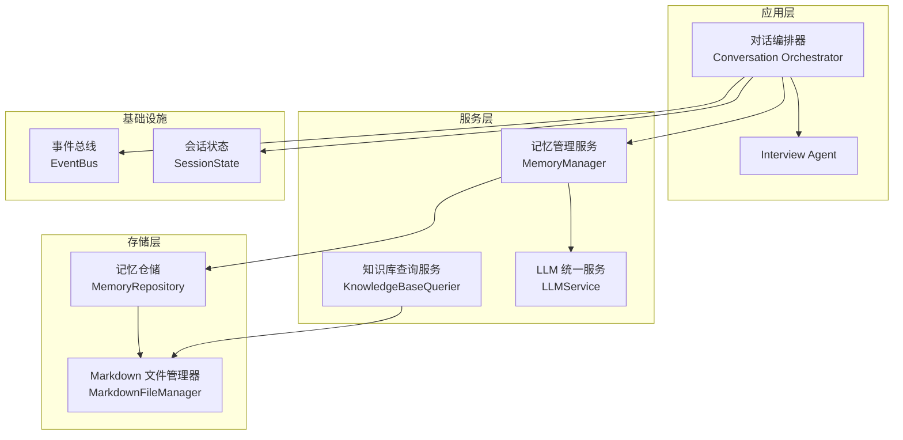
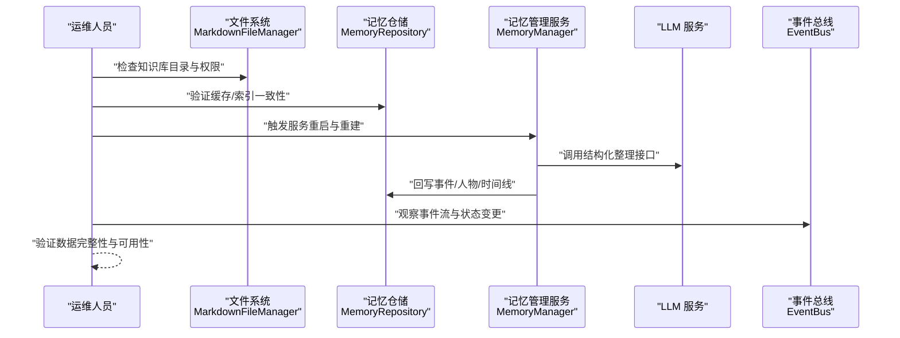
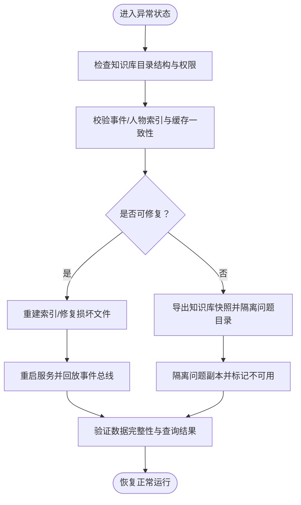
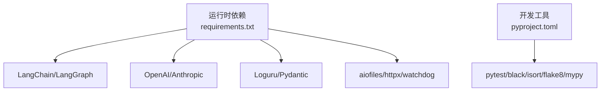
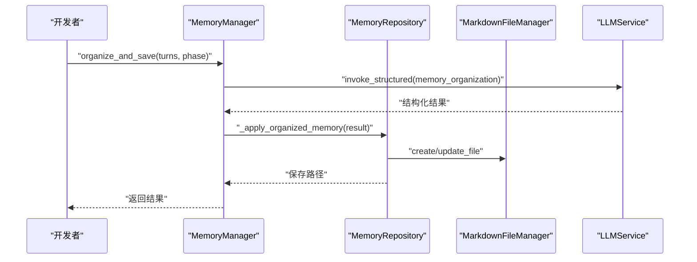

# 紧急处理流程

<cite>
**本文引用的文件**   
- [README.md](file://README.md)
- [pyproject.toml](file://pyproject.toml)
- [requirements.txt](file://requirements.txt)
- [src/storage/memory_repository.py](file://src/storage/memory_repository.py)
- [src/storage/markdown_file_manager.py](file://src/storage/markdown_file_manager.py)
- [src/services/memory_manager.py](file://src/services/memory_manager.py)
- [src/core/event_bus.py](file://src/core/event_bus.py)
- [src/models/session_state.py](file://src/models/session_state.py)
- [src/enums/state_type.py](file://src/enums/state_type.py)
- [src/enums/phase_type.py](file://src/enums/phase_type.py)
- [src/enums/emotion_type.py](file://src/enums/emotion_type.py)
- [MEMORY_INTERACTION_GUIDE.md](file://MEMORY_INTERACTION_GUIDE.md)
</cite>

## 目录
1. [简介](#简介)
2. [项目结构](#项目结构)
3. [核心组件](#核心组件)
4. [架构总览](#架构总览)
5. [详细组件分析](#详细组件分析)
6. [依赖分析](#依赖分析)
7. [性能考虑](#性能考虑)
8. [故障排查指南](#故障排查指南)
9. [结论](#结论)
10. [附录](#附录)

## 简介
本文件面向“老人自传 Agent 系统”的紧急处理流程，围绕系统崩溃恢复、数据备份与恢复、服务重启与状态重置、数据丢失处理、安全事件响应、灾难恢复与业务连续性保障、紧急联系与升级流程、以及定期演练与培训等方面，结合代码库现有架构与组件能力，制定标准化操作程序（SOP）。目标是在突发情况下快速定位问题、最小化数据损失、尽快恢复服务，并持续提升团队应急响应能力。

## 项目结构
系统采用模块化分层架构，核心围绕“对话编排”“记忆管理”“知识库存储”“事件总线”等模块协同工作。知识库采用本地 Markdown 文件系统存储，具备良好的可读性与可维护性；同时通过 LLM 服务进行内容结构化与归纳。

图示来源
- [README.md:92-200](file://README.md#L92-L200)
- [src/services/memory_manager.py:27-46](file://src/services/memory_manager.py#L27-L46)
- [src/storage/memory_repository.py:40-88](file://src/storage/memory_repository.py#L40-L88)
- [src/storage/markdown_file_manager.py:31-46](file://src/storage/markdown_file_manager.py#L31-L46)
- [src/core/event_bus.py:40-53](file://src/core/event_bus.py#L40-L53)
- [src/models/session_state.py:24-86](file://src/models/session_state.py#L24-L86)

章节来源
- [README.md:27-200](file://README.md#L27-L200)

## 核心组件
- 记忆仓储（MemoryRepository）：统一管理短期/长期/画像三层记忆，负责事件、人物、时间线的持久化与索引，提供缓存与查询能力。
- Markdown 文件管理器（MarkdownFileManager）：负责知识库目录结构、文件创建/读取/更新、全文搜索、Wiki 链接追踪与解析。
- 记忆管理服务（MemoryManager）：对外提供结构化记忆整理与落库接口，协调 LLM 服务与存储层。
- 事件总线（EventBus）：发布/订阅模式解耦组件通信，支持同步与异步处理器。
- 会话状态（SessionState）：贯穿会话生命周期的状态对象，记录阶段、覆盖率、对话历史等。
- 枚举体系：状态类型（StateType）、人生阶段（PhaseType）、情绪类型（EmotionType）等，规范系统行为与数据结构。

章节来源
- [src/storage/memory_repository.py:40-359](file://src/storage/memory_repository.py#L40-L359)
- [src/storage/markdown_file_manager.py:31-546](file://src/storage/markdown_file_manager.py#L31-L546)
- [src/services/memory_manager.py:27-470](file://src/services/memory_manager.py#L27-L470)
- [src/core/event_bus.py:40-182](file://src/core/event_bus.py#L40-L182)
- [src/models/session_state.py:24-139](file://src/models/session_state.py#L24-L139)
- [src/enums/state_type.py:4-12](file://src/enums/state_type.py#L4-L12)
- [src/enums/phase_type.py:4-10](file://src/enums/phase_type.py#L4-L10)
- [src/enums/emotion_type.py:4-50](file://src/enums/emotion_type.py#L4-L50)

## 架构总览
系统崩溃恢复与应急处置应遵循“快速隔离—数据保护—服务重启—状态校验—验证回归”的闭环流程。结合现有组件，可将知识库视为核心数据资产，文件系统为持久化介质，事件总线与会话状态为运行态关键指标。

图示来源
- [src/storage/markdown_file_manager.py:31-103](file://src/storage/markdown_file_manager.py#L31-L103)
- [src/storage/memory_repository.py:40-88](file://src/storage/memory_repository.py#L40-L88)
- [src/services/memory_manager.py:111-157](file://src/services/memory_manager.py#L111-L157)
- [src/core/event_bus.py:108-171](file://src/core/event_bus.py#L108-L171)

## 详细组件分析

### 记忆仓储（MemoryRepository）应急要点
- 短期记忆：内存缓存与历史队列，容量受控，便于快速清理与重置。
- 长期记忆：事件、人物、时间线三类文件落盘，具备索引与 LRU 缓存，支持查询与增量更新。
- 工具方法：按时间/角色生成目录与文件名，保证命名规范与可追溯性。

图示来源
- [src/storage/memory_repository.py:16-38](file://src/storage/memory_repository.py#L16-L38)
- [src/storage/memory_repository.py:174-307](file://src/storage/memory_repository.py#L174-L307)
- [src/storage/markdown_file_manager.py:80-131](file://src/storage/markdown_file_manager.py#L80-L131)

章节来源
- [src/storage/memory_repository.py:40-359](file://src/storage/memory_repository.py#L40-L359)
- [src/storage/markdown_file_manager.py:31-131](file://src/storage/markdown_file_manager.py#L31-L131)

### Markdown 文件管理器（知识库持久化）应急要点
- 目录结构：events/childhood、people/family 等固定目录，确保备份与迁移一致性。
- 文件操作：异步/同步读写、追加章节、全文搜索、链接解析与追踪。
- 统计与存在性：文件存在性检查与统计信息，便于快速评估损坏范围。

章节来源
- [src/storage/markdown_file_manager.py:31-546](file://src/storage/markdown_file_manager.py#L31-L546)

### 记忆管理服务（结构化落库）应急要点
- 核心流程：格式化对话→LLM 结构化→并行保存事件/人物→更新时间线→更新画像记忆。
- 批量应用：支持从归纳结果批量落库，减少重复处理成本。
- 会话清理：提供清空短期记忆的能力，便于在异常后重置会话上下文。

章节来源
- [src/services/memory_manager.py:111-157](file://src/services/memory_manager.py#L111-L157)
- [src/services/memory_manager.py:435-467](file://src/services/memory_manager.py#L435-L467)
- [src/services/memory_manager.py:468-470](file://src/services/memory_manager.py#L468-L470)

### 事件总线（运行态可观测性）应急要点
- 发布/订阅：支持同步与异步处理器，便于在异常时触发告警与自愈逻辑。
- 等待模式：emit_and_wait 可确保关键异步处理完成后再继续。
- 事件类型：涵盖对话、状态、记忆、情绪、交接、会话等，便于精准定位问题。

章节来源
- [src/core/event_bus.py:40-182](file://src/core/event_bus.py#L40-L182)

### 会话状态（运行态指标）应急要点
- 状态机：INIT/WARMUP/COLLECT/DEEPEN/REDIRECT/PAUSE/HANDOFF，异常时可强制重置。
- 覆盖率与历史：按阶段覆盖率与最近对话历史，便于快速判断会话中断点。
- 情绪状态：记录情绪类型与强度，辅助判断是否需要人工干预。

章节来源
- [src/models/session_state.py:24-139](file://src/models/session_state.py#L24-L139)
- [src/enums/state_type.py:4-12](file://src/enums/state_type.py#L4-L12)
- [src/enums/phase_type.py:4-10](file://src/enums/phase_type.py#L4-L10)
- [src/enums/emotion_type.py:4-50](file://src/enums/emotion_type.py#L4-L50)

## 依赖分析
- 运行时依赖：LangChain/LangGraph、OpenAI、Loguru、Pydantic、aiofiles、httpx、watchdog 等。
- 开发与测试：pytest、black、isort、flake8、mypy，支持代码质量与自动化测试。
- 知识库路径：通过环境变量或默认临时目录管理，便于备份与迁移。

图示来源
- [requirements.txt:1-24](file://requirements.txt#L1-L24)
- [pyproject.toml:8-26](file://pyproject.toml#L8-L26)

章节来源
- [requirements.txt:1-24](file://requirements.txt#L1-L24)
- [pyproject.toml:1-26](file://pyproject.toml#L1-L26)

## 性能考虑
- 异步 I/O：文件读写与 LLM 调用均采用异步模式，提升并发与吞吐。
- 缓存与索引：LRU 缓存与内存索引减少重复查询开销。
- 并行落库：事件与人物保存采用 gather 并行，缩短落库时间。
- 日志与可观测：Loguru 提供结构化日志，事件总线提供运行态事件流。

章节来源
- [src/storage/markdown_file_manager.py:134-170](file://src/storage/markdown_file_manager.py#L134-L170)
- [src/storage/memory_repository.py:16-38](file://src/storage/memory_repository.py#L16-L38)
- [src/services/memory_manager.py:170-193](file://src/services/memory_manager.py#L170-L193)
- [README.md:77-89](file://README.md#L77-L89)

## 故障排查指南

### 系统崩溃恢复流程（SOP）
- 快速隔离
  - 停止服务进程，隔离知识库目录，防止二次写入破坏数据。
  - 记录崩溃时间点与异常日志位置。
- 数据备份与恢复
  - 备份知识库根目录至安全介质，保留时间戳与哈希值。
  - 恢复时先对比哈希，再逐目录校验文件完整性。
- 服务重启与状态重置
  - 重启后优先加载事件总线与会话状态，观察状态机流转。
  - 若短期记忆异常，调用会话清理接口重置上下文。
- 验证与回归
  - 执行最小化回归测试：读取最近事件、人物、时间线，验证查询与链接解析。
  - 检查 LLM 结构化整理流程是否正常返回。

章节来源
- [src/core/event_bus.py:108-171](file://src/core/event_bus.py#L108-L171)
- [src/models/session_state.py:87-139](file://src/models/session_state.py#L87-L139)
- [src/services/memory_manager.py:468-470](file://src/services/memory_manager.py#L468-L470)

### 数据丢失处理程序（SOP）
- 策略
  - 优先从最新备份恢复；若无备份，尝试从历史 JSON 对话记录中恢复关键片段。
  - 通过文件管理器的搜索与链接追踪能力，交叉验证事件与人物关联。
- 验证
  - 使用 Markdown 文件管理器的文件存在性与统计信息，快速定位缺失文件。
  - 对时间线与人物索引进行一致性检查，必要时重建索引。
- 完整性检查
  - 逐文件读取并解析，统计标题行、Wiki 链接数量，评估内容完整性。

章节来源
- [src/storage/markdown_file_manager.py:285-355](file://src/storage/markdown_file_manager.py#L285-L355)
- [src/storage/markdown_file_manager.py:475-529](file://src/storage/markdown_file_manager.py#L475-L529)
- [src/storage/memory_repository.py:174-307](file://src/storage/memory_repository.py#L174-L307)

### 安全事件响应流程（SOP）
- 入侵检测
  - 通过事件总线订阅异常事件类型，触发告警与审计日志。
  - 检查知识库目录访问权限与最近修改时间异常。
- 恶意攻击处理
  - 立即隔离受影响目录，阻断写入权限，备份现场证据。
  - 分析 LLM 请求日志，排查是否被滥用或凭据泄露。
- 数据泄露应对
  - 评估泄露范围（按用户维度），通知相关方并记录处置过程。
  - 更换凭据，重置会话状态，重新授权访问。

章节来源
- [src/core/event_bus.py:108-171](file://src/core/event_bus.py#L108-L171)
- [src/storage/markdown_file_manager.py:80-131](file://src/storage/markdown_file_manager.py#L80-L131)
- [README.md:450-467](file://README.md#L450-L467)

### 灾难恢复计划（SOP）
- 故障转移
  - 启动备用节点，挂载知识库共享存储，确保目录结构一致。
  - 通过事件总线观察状态机与会话状态，确认服务就绪。
- 备用系统启动
  - 优先恢复事件总线与会话状态，再启动记忆管理服务与 LLM 服务。
  - 执行全量一致性检查，确保事件、人物、时间线三者关联正确。
- 业务连续性保障
  - 通过会话状态的历史与覆盖率指标，快速恢复用户会话。
  - 建立人工干预通道，遇复杂异常时暂停自动流程，交由人工处理。

章节来源
- [src/core/event_bus.py:142-171](file://src/core/event_bus.py#L142-L171)
- [src/models/session_state.py:87-139](file://src/models/session_state.py#L87-L139)
- [src/services/memory_manager.py:111-157](file://src/services/memory_manager.py#L111-L157)

### 紧急联系与升级流程
- 一级响应（15分钟内）
  - 负责人：值班工程师
  - 行动：隔离现场、备份日志、通知团队
- 二级响应（1小时内）
  - 负责人：技术主管
  - 行动：评估影响面、制定恢复方案、协调资源
- 三级响应（24小时内）
  - 负责人：项目经理/架构师
  - 行动：复盘与改进、更新应急预案、演练与培训

章节来源
- [README.md:450-467](file://README.md#L450-L467)

### 定期演练与培训指南
- 演练内容
  - 知识库损坏恢复、备份验证、服务重启与状态重置、安全事件处置、灾难切换。
- 培训对象
  - 开发、测试、运维与产品人员，确保各角色熟悉职责与流程。
- 考核方式
  - 以任务卡片形式记录演练过程与结果，纳入团队绩效与知识库。

章节来源
- [MEMORY_INTERACTION_GUIDE.md:147-172](file://MEMORY_INTERACTION_GUIDE.md#L147-L172)

## 结论
本 SOP 将系统现有组件能力与应急处置流程相结合，形成“预防—发现—隔离—恢复—验证—改进”的闭环。通过事件总线与会话状态实现可观测，通过记忆仓储与文件管理器实现可恢复，通过演练与培训持续提升团队响应能力，确保在突发情况下快速稳定地恢复服务并保障数据安全。

## 附录

### 关键流程图（代码级映射）

图示来源
- [src/services/memory_manager.py:111-157](file://src/services/memory_manager.py#L111-L157)
- [src/services/memory_manager.py:158-193](file://src/services/memory_manager.py#L158-L193)
- [src/storage/memory_repository.py:176-227](file://src/storage/memory_repository.py#L176-L227)
- [src/storage/markdown_file_manager.py:134-170](file://src/storage/markdown_file_manager.py#L134-L170)