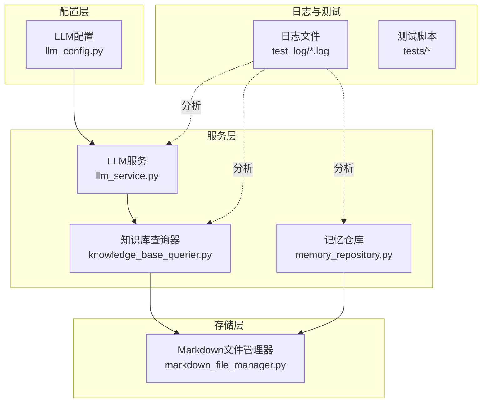
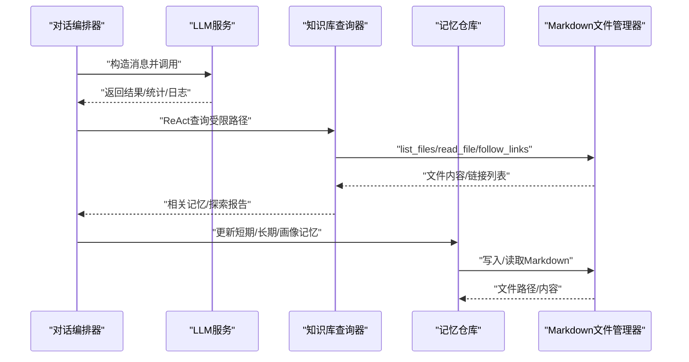
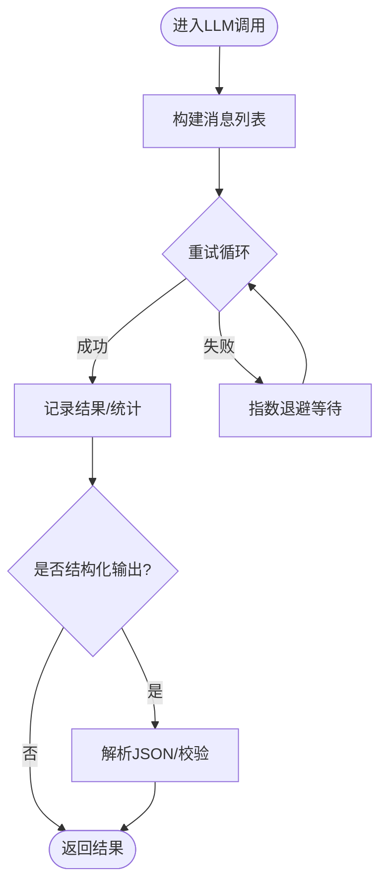
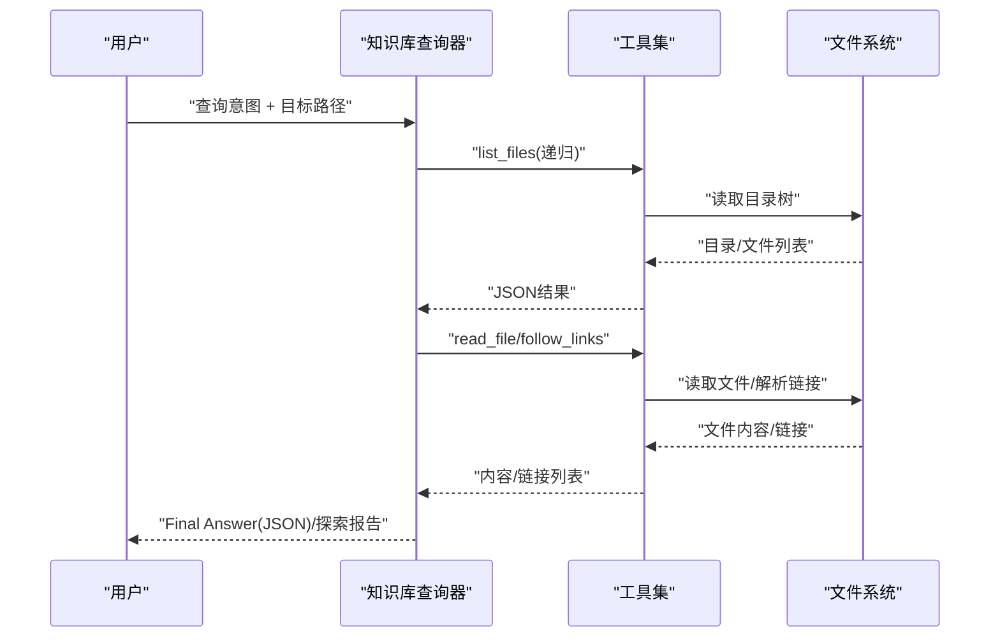
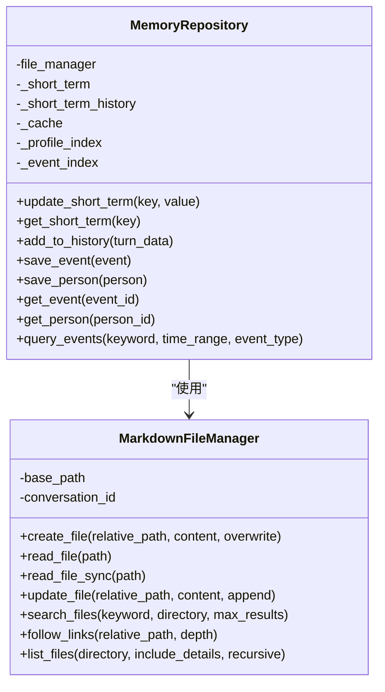
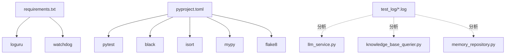

# 调试工具和技巧

<cite>
**本文引用的文件**
- [README.md](file://README.md)
- [pyproject.toml](file://pyproject.toml)
- [requirements.txt](file://requirements.txt)
- [llm_service.py](file://src/services/llm_service.py)
- [memory_repository.py](file://src/storage/memory_repository.py)
- [markdown_file_manager.py](file://src/storage/markdown_file_manager.py)
- [llm_config.py](file://src/config/llm_config.py)
- [knowledge_base_querier.py](file://src/services/knowledge_base_querier.py)
- [session_state.py](file://src/models/session_state.py)
- [base.py](file://src/prompts/base.py)
- [conversation1.log](file://test_log/conversation1.log)
</cite>

## 目录
1. [简介](#简介)
2. [项目结构](#项目结构)
3. [核心组件](#核心组件)
4. [架构总览](#架构总览)
5. [详细组件分析](#详细组件分析)
6. [依赖关系分析](#依赖关系分析)
7. [性能考量](#性能考量)
8. [故障排查指南](#故障排查指南)
9. [结论](#结论)
10. [附录](#附录)

## 简介
本文件面向“调试工具和技巧”的主题，结合代码库中的日志、配置、服务与工具模块，系统性介绍如何在该系统中进行调试与性能分析。内容涵盖：
- 日志级别与输出控制
- 调试模式与详细输出开关
- 日志分析与关键信息提取
- 断点调试与单步执行技巧
- 性能分析（内存、CPU、I/O）
- 远程与生产环境调试最佳实践

## 项目结构
该项目采用模块化分层组织，围绕“对话编排—记忆管理—知识库查询—LLM服务”展开。调试相关的关键位置包括：
- 配置层：LLM配置与环境变量
- 服务层：LLM服务、知识库查询、记忆仓库
- 存储层：Markdown文件管理器
- 日志与测试：日志文件与测试脚本

图表来源
- [llm_config.py:1-120](file://src/config/llm_config.py#L1-L120)
- [llm_service.py:1-481](file://src/services/llm_service.py#L1-L481)
- [knowledge_base_querier.py:1-540](file://src/services/knowledge_base_querier.py#L1-L540)
- [memory_repository.py:1-359](file://src/storage/memory_repository.py#L1-L359)
- [markdown_file_manager.py:1-546](file://src/storage/markdown_file_manager.py#L1-L546)
- [conversation1.log:1-48](file://test_log/conversation1.log#L1-L48)

章节来源
- [README.md:92-200](file://README.md#L92-L200)

## 核心组件
- LLM服务：封装模型调用、重试、统计与日志；提供结构化输出能力
- 知识库查询器：基于ReAct模式的Agent，使用工具进行文件列举、读取、链接追踪与标记
- 记忆仓库：短期/长期/画像记忆的统一管理，含LRU缓存与索引
- Markdown文件管理器：异步/同步文件读写、全文搜索、Wiki链接解析与追踪
- LLM配置：从环境变量加载，支持多提供商与重试/超时参数
- 日志：使用标准库logging与第三方loguru，配合pytest与测试日志

章节来源
- [llm_service.py:32-481](file://src/services/llm_service.py#L32-L481)
- [knowledge_base_querier.py:202-540](file://src/services/knowledge_base_querier.py#L202-L540)
- [memory_repository.py:40-359](file://src/storage/memory_repository.py#L40-L359)
- [markdown_file_manager.py:31-546](file://src/storage/markdown_file_manager.py#L31-L546)
- [llm_config.py:10-120](file://src/config/llm_config.py#L10-L120)
- [requirements.txt:20-21](file://requirements.txt#L20-L21)

## 架构总览
调试视角下的关键交互链路：
- 对话轮次由编排器推进，触发LLM服务调用
- LLM服务负责消息构造、调用、统计与日志
- 知识库查询器在每轮中使用工具探索知识库，受限于目标路径
- 记忆仓库协调短期/长期/画像记忆，并维护缓存与索引
- Markdown文件管理器支撑文件读写、搜索与链接追踪

图表来源
- [llm_service.py:225-292](file://src/services/llm_service.py#L225-L292)
- [knowledge_base_querier.py:257-373](file://src/services/knowledge_base_querier.py#L257-L373)
- [memory_repository.py:111-200](file://src/storage/memory_repository.py#L111-L200)
- [markdown_file_manager.py:134-262](file://src/storage/markdown_file_manager.py#L134-L262)

## 详细组件分析

### LLM服务调试要点
- 日志与统计
  - 使用标准库logger记录初始化、模板加载、调用失败与重试警告
  - 记录调用耗时、Token用量与成功比例
- 重试机制
  - 指数退避重试，最大重试次数可配置
- 结构化输出
  - 通过模板渲染与JSON解析，便于定位解析错误
- 调试建议
  - 在调用前后打印关键上下文（如消息列表、模板名称）
  - 使用get_stats查看整体表现，定位异常批次

图表来源
- [llm_service.py:400-437](file://src/services/llm_service.py#L400-L437)
- [llm_service.py:225-292](file://src/services/llm_service.py#L225-L292)
- [llm_service.py:327-398](file://src/services/llm_service.py#L327-L398)

章节来源
- [llm_service.py:32-481](file://src/services/llm_service.py#L32-L481)

### 知识库查询器调试要点
- ReAct模式
  - 工具集合：list_files、read_file、follow_links、mark_suspected_file、get_exploration_report、has_visited
  - 严格限定目标路径，防止越权访问
- 探索报告
  - 记录已访问路径与疑似相关文件，便于回溯
- 解析策略
  - 优先解析标准JSON；失败时降级为自然语言提取
- 调试建议
  - 在query入口打印user_input与target_path
  - 使用get_exploration_report快速定位未命中原因
  - 对异常路径进行白名单/黑名单校验

图表来源
- [knowledge_base_querier.py:257-373](file://src/services/knowledge_base_querier.py#L257-L373)
- [knowledge_base_querier.py:54-196](file://src/services/knowledge_base_querier.py#L54-L196)
- [markdown_file_manager.py:285-335](file://src/storage/markdown_file_manager.py#L285-L335)

章节来源
- [knowledge_base_querier.py:202-540](file://src/services/knowledge_base_querier.py#L202-L540)

### 记忆仓库与文件管理器调试要点
- 记忆仓库
  - 短期记忆：对话历史队列，受容量限制
  - 长期记忆：事件/人物写入Markdown，维护索引与LRU缓存
  - 画像记忆：短期键值存储，便于跨模块共享
- 文件管理器
  - 异步/同步读写，支持全文搜索与链接追踪
  - 目录结构自动确保，索引文件自动生成
- 调试建议
  - 在save_event/save_person后打印写入路径与索引更新
  - 使用list_files与search_files验证数据落盘与检索一致性

图表来源
- [memory_repository.py:40-359](file://src/storage/memory_repository.py#L40-L359)
- [markdown_file_manager.py:31-546](file://src/storage/markdown_file_manager.py#L31-L546)

章节来源
- [memory_repository.py:40-359](file://src/storage/memory_repository.py#L40-L359)
- [markdown_file_manager.py:31-546](file://src/storage/markdown_file_manager.py#L31-L546)

### LLM配置与环境变量
- 从环境变量加载，优先支持Qwen与DeepSeek
- 提供默认配置回退策略
- 调试建议
  - 在应用启动时打印当前配置来源与关键参数
  - 使用不同provider/模型进行对比测试

章节来源
- [llm_config.py:10-120](file://src/config/llm_config.py#L10-L120)

### Prompt模板与变量校验
- PromptTemplate支持变量渲染与完整性校验
- 调试建议
  - 在渲染前打印required vs provided变量集合
  - 对缺失变量抛出明确异常，便于定位

章节来源
- [base.py:6-33](file://src/prompts/base.py#L6-L33)

## 依赖关系分析
- 第三方依赖
  - loguru用于日志管理
  - watchdog用于文件监控（可用于生产环境文件变更告警）
- 测试与质量工具
  - pytest、black、isort、mypy、flake8
- 调试相关
  - 日志文件位于test_log目录，便于离线分析
  - 测试脚本覆盖核心服务，便于回归与定位

图表来源
- [requirements.txt:1-24](file://requirements.txt#L1-L24)
- [pyproject.toml:1-26](file://pyproject.toml#L1-L26)
- [conversation1.log:1-48](file://test_log/conversation1.log#L1-L48)

章节来源
- [requirements.txt:1-24](file://requirements.txt#L1-L24)
- [pyproject.toml:1-26](file://pyproject.toml#L1-L26)

## 性能考量
- LLM调用
  - 使用指数退避重试，避免瞬时峰值导致的失败放大
  - 统计token用量与平均延迟，识别慢调用批次
- 文件I/O
  - 异步读写减少阻塞；全文搜索按需限制结果数量
  - 链接追踪深度可控，避免无限递归
- 内存管理
  - LRU缓存与短期记忆容量限制，防止内存膨胀
- CPU与并发
  - 异步模型调用与文件操作，提高吞吐
  - 建议在高负载场景下拆分任务与限流

章节来源
- [llm_service.py:400-437](file://src/services/llm_service.py#L400-L437)
- [markdown_file_manager.py:285-335](file://src/storage/markdown_file_manager.py#L285-L335)
- [memory_repository.py:16-38](file://src/storage/memory_repository.py#L16-L38)

## 故障排查指南
- 日志分析
  - 关键信息：HTTP请求状态、模型调用耗时、Token用量、错误堆栈
  - 建议：按时间窗口聚合，识别异常峰值与重复错误
- 常见问题定位
  - LLM调用失败：检查网络、API Key、Provider配置与重试日志
  - 知识库查询无结果：使用探索报告核对已访问路径与标记文件
  - 文件读写异常：确认路径合法性与权限，关注同步/异步读写差异
- 断点与单步
  - 在LLMService.invoke与KnowledgeBaseQuerier.query入口设置断点
  - 单步检查消息构造、模板渲染与工具调用返回
- 调用栈与变量
  - 记录关键变量：消息列表、模板名称、目标路径、返回内容
  - 使用get_stats与探索报告辅助定位瓶颈

章节来源
- [conversation1.log:1-48](file://test_log/conversation1.log#L1-L48)
- [llm_service.py:225-292](file://src/services/llm_service.py#L225-L292)
- [knowledge_base_querier.py:368-372](file://src/services/knowledge_base_querier.py#L368-L372)

## 结论
本项目在日志、配置与服务层面提供了完善的调试基础。通过合理利用日志文件、探索报告、统计指标与工具断点，可在开发与生产环境中高效定位问题、优化性能并保障稳定性。建议将调试流程标准化，形成可复用的排查清单与回归测试。

## 附录
- 快速开始与调试命令
  - 运行测试并显示详细输出
  - 生成覆盖率报告
  - 代码格式化、导入排序、类型检查、代码检查
- 环境变量与日志
  - LOG_LEVEL、LOG_FILE用于控制日志级别与输出位置
  - 在不同环境切换Provider与模型，观察性能与稳定性差异

章节来源
- [README.md:267-294](file://README.md#L267-L294)
- [README.md:252-265](file://README.md#L252-L265)