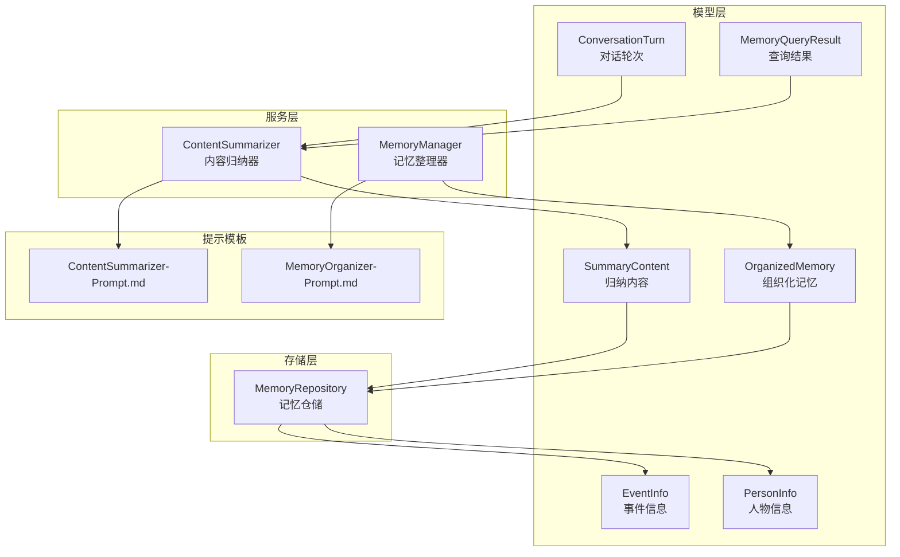
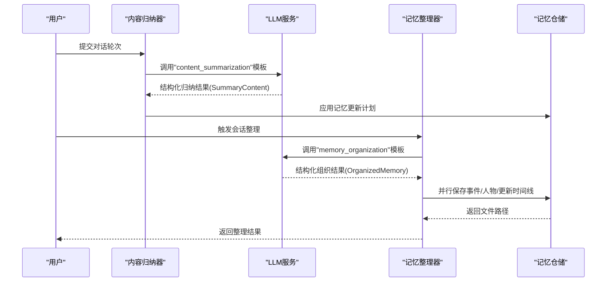
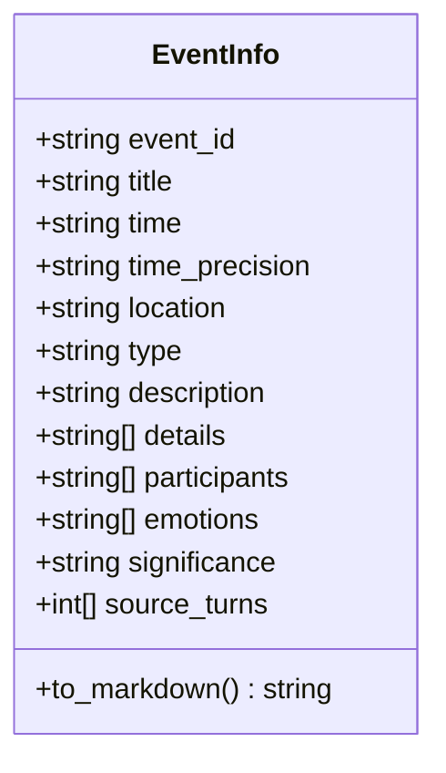
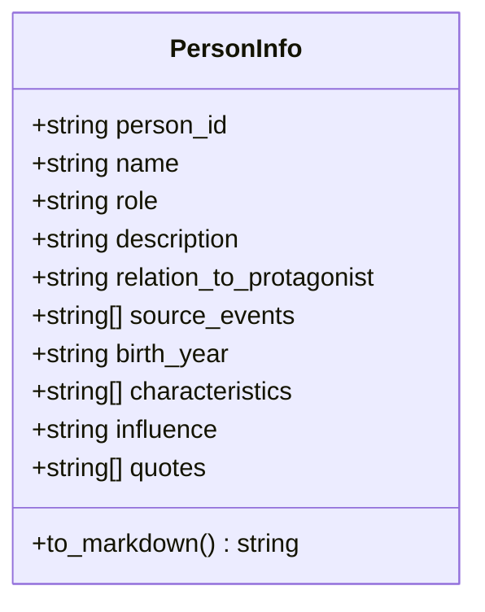
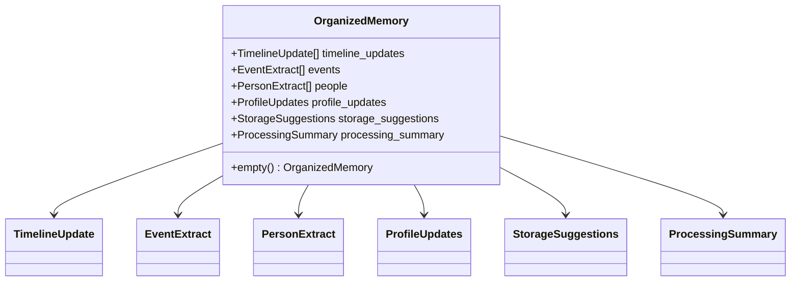
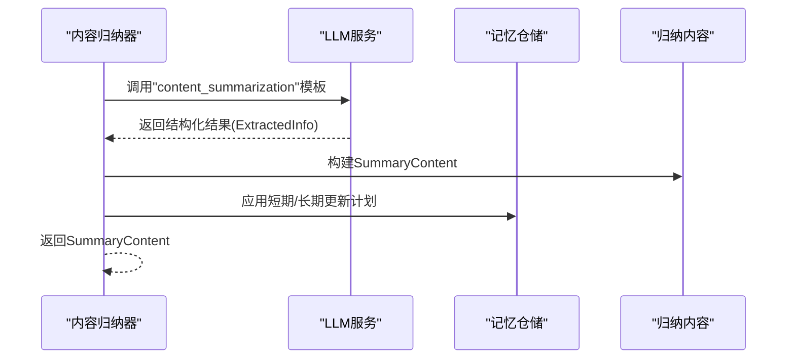
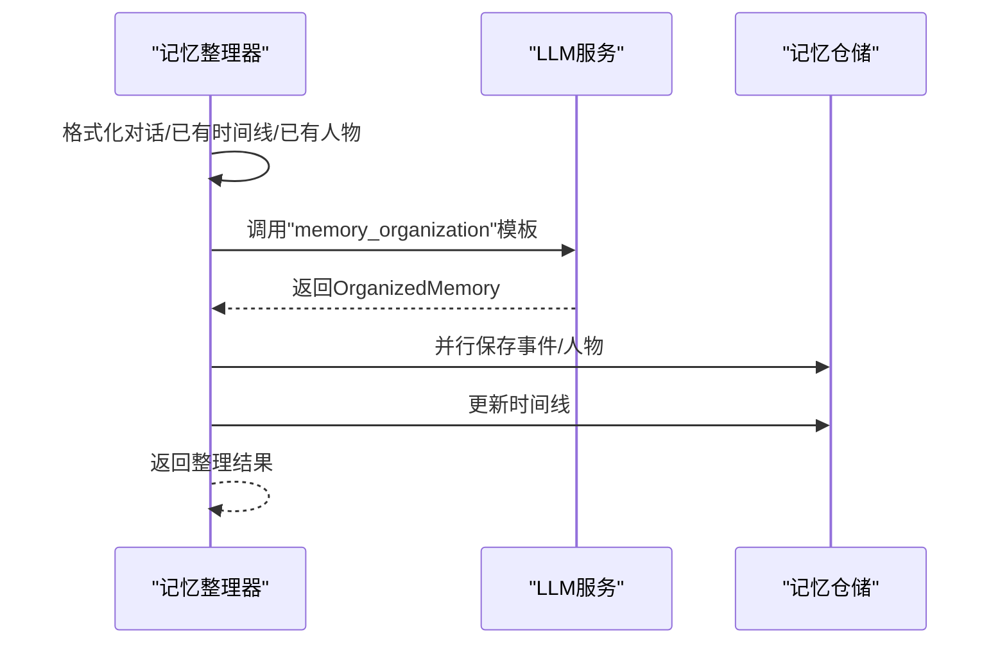
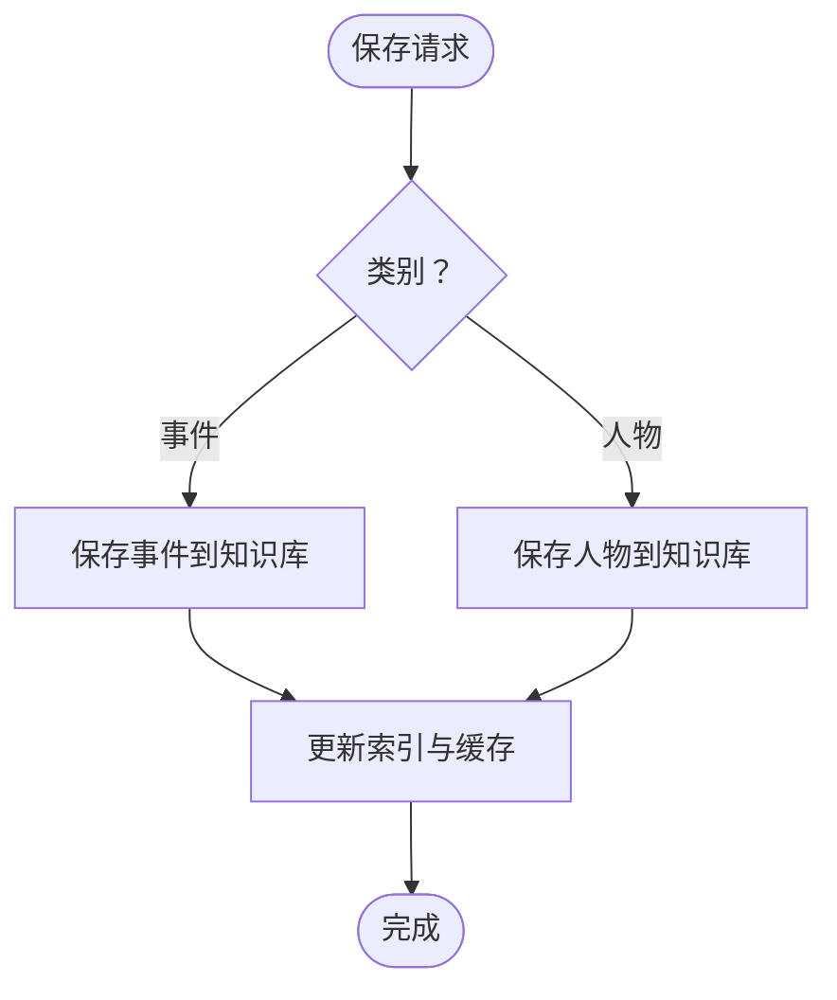
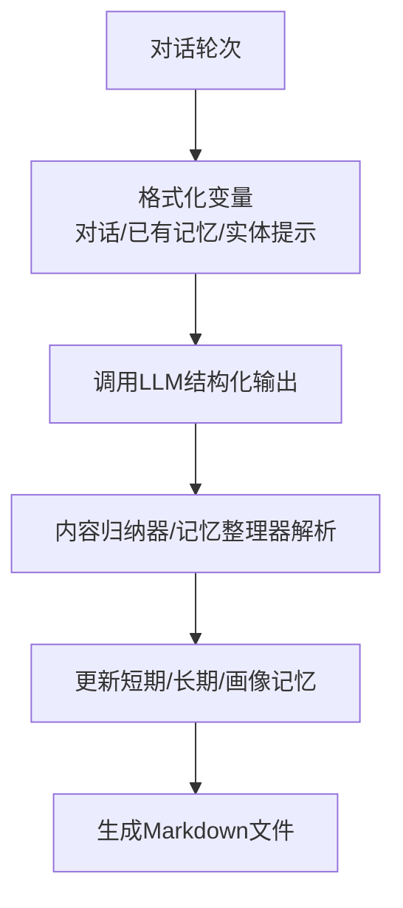
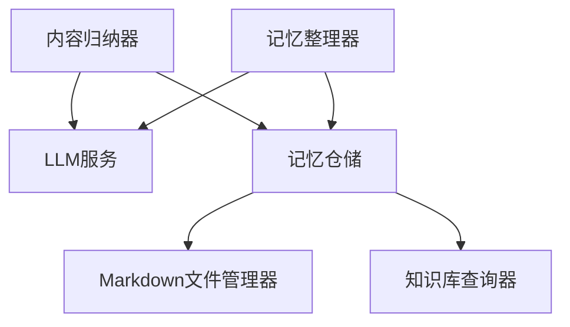

# 关键信息提取

<cite>
**本文档引用的文件**
- [src/models/event_info.py](file://src/models/event_info.py)
- [src/models/person_info.py](file://src/models/person_info.py)
- [src/models/organized_memory.py](file://src/models/organized_memory.py)
- [src/models/memory_query_result.py](file://src/models/memory_query_result.py)
- [src/models/summary_content.py](file://src/models/summary_content.py)
- [src/models/conversation_turn.py](file://src/models/conversation_turn.py)
- [src/services/content_summarizer.py](file://src/services/content_summarizer.py)
- [src/services/memory_manager.py](file://src/services/memory_manager.py)
- [src/storage/memory_repository.py](file://src/storage/memory_repository.py)
- [src/prompts/ContentSummarizer-Prompt.md](file://src/prompts/ContentSummarizer-Prompt.md)
- [src/prompts/MemoryOrganizer-Prompt.md](file://src/prompts/MemoryOrganizer-Prompt.md)
- [src/enums/phase_type.py](file://src/enums/phase_type.py)
</cite>

## 目录
1. [简介](#简介)
2. [项目结构](#项目结构)
3. [核心组件](#核心组件)
4. [架构总览](#架构总览)
5. [详细组件分析](#详细组件分析)
6. [依赖分析](#依赖分析)
7. [性能考虑](#性能考虑)
8. [故障排查指南](#故障排查指南)
9. [结论](#结论)
10. [附录](#附录)

## 简介
本模块围绕“关键信息提取”展开，目标是从复杂且非结构化的用户回答中，自动识别并结构化输出事件、人物、时间点、地点、情感、主题等关键信息。系统采用“两阶段结构化提取 + 三层记忆存储”的技术路线：
- 第一阶段：基于对话轮次的细粒度信息归纳（事件、人物、情感、细节、时间线更新），由内容归纳器负责。
- 第二阶段：基于会话聚合的三维度结构化整理（时间线/事件/人物），由记忆整理器负责。
- 存储层：短期记忆（内存）、长期记忆（文件系统）、画像记忆（结构化索引），由记忆仓储统一管理。

该模块强调“真实可信、结构化输出、去重与更新、来源追溯”，并通过提示工程与模型结构化输出保障准确性；通过并行化与缓存提升性能；通过错误降级与日志记录保证稳定性。

## 项目结构
关键文件分布如下：
- 模型层：定义事件、人物、组织化记忆、查询结果、对话轮次等数据结构。
- 服务层：内容归纳器与记忆整理器，负责调用LLM模板、构建结构化输出、驱动存储。
- 存储层：记忆仓储，负责短期/长期/画像记忆的统一管理与持久化。
- 提示模板：面向LLM的结构化提示，指导模型按Schema输出。

**图表来源**
- [src/models/event_info.py:1-69](file://src/models/event_info.py#L1-L69)
- [src/models/person_info.py:1-61](file://src/models/person_info.py#L1-L61)
- [src/models/organized_memory.py:1-151](file://src/models/organized_memory.py#L1-L151)
- [src/models/memory_query_result.py:1-81](file://src/models/memory_query_result.py#L1-L81)
- [src/models/summary_content.py:1-67](file://src/models/summary_content.py#L1-L67)
- [src/models/conversation_turn.py:1-52](file://src/models/conversation_turn.py#L1-L52)
- [src/services/content_summarizer.py:1-177](file://src/services/content_summarizer.py#L1-L177)
- [src/services/memory_manager.py:1-470](file://src/services/memory_manager.py#L1-L470)
- [src/storage/memory_repository.py:1-359](file://src/storage/memory_repository.py#L1-L359)
- [src/prompts/ContentSummarizer-Prompt.md:1-567](file://src/prompts/ContentSummarizer-Prompt.md#L1-L567)
- [src/prompts/MemoryOrganizer-Prompt.md:1-739](file://src/prompts/MemoryOrganizer-Prompt.md#L1-L739)

**章节来源**
- [src/services/content_summarizer.py:1-177](file://src/services/content_summarizer.py#L1-L177)
- [src/services/memory_manager.py:1-470](file://src/services/memory_manager.py#L1-L470)
- [src/storage/memory_repository.py:1-359](file://src/storage/memory_repository.py#L1-L359)
- [src/prompts/ContentSummarizer-Prompt.md:1-567](file://src/prompts/ContentSummarizer-Prompt.md#L1-L567)
- [src/prompts/MemoryOrganizer-Prompt.md:1-739](file://src/prompts/MemoryOrganizer-Prompt.md#L1-L739)

## 核心组件
- 事件信息模型（EventInfo）：结构化记录单个事件，支持转为Markdown并写入知识库。
- 人物信息模型（PersonInfo）：结构化记录人物画像，支持转为Markdown并写入知识库。
- 组织化记忆模型（OrganizedMemory）：三维度结构化输出（时间线/事件/人物）及画像更新。
- 内容归纳器（ContentSummarizer）：面向对话轮次的细粒度信息提取与归纳。
- 记忆整理器（MemoryManager）：面向会话的三维度结构化整理与存储。
- 记忆仓储（MemoryRepository）：短期/长期/画像记忆的统一管理与持久化。
- 提示模板：结构化Schema驱动的LLM输出，保障提取一致性与可解析性。

**章节来源**
- [src/models/event_info.py:1-69](file://src/models/event_info.py#L1-L69)
- [src/models/person_info.py:1-61](file://src/models/person_info.py#L1-L61)
- [src/models/organized_memory.py:1-151](file://src/models/organized_memory.py#L1-L151)
- [src/models/summary_content.py:1-67](file://src/models/summary_content.py#L1-L67)
- [src/services/content_summarizer.py:1-177](file://src/services/content_summarizer.py#L1-L177)
- [src/services/memory_manager.py:1-470](file://src/services/memory_manager.py#L1-L470)
- [src/storage/memory_repository.py:1-359](file://src/storage/memory_repository.py#L1-L359)

## 架构总览
系统以“对话轮次”为输入，通过两阶段提取与整理，最终形成可检索、可链接、可复用的知识条目。核心流程如下：

**图表来源**
- [src/services/content_summarizer.py:43-93](file://src/services/content_summarizer.py#L43-L93)
- [src/prompts/ContentSummarizer-Prompt.md:214-264](file://src/prompts/ContentSummarizer-Prompt.md#L214-L264)
- [src/services/memory_manager.py:111-156](file://src/services/memory_manager.py#L111-L156)
- [src/prompts/MemoryOrganizer-Prompt.md:249-330](file://src/prompts/MemoryOrganizer-Prompt.md#L249-L330)
- [src/storage/memory_repository.py:176-261](file://src/storage/memory_repository.py#L176-L261)

## 详细组件分析

### 事件信息模型（EventInfo）
职责与能力
- 结构化记录单个事件，包含时间、地点、类型、描述、参与者、情感标签、来源轮次等。
- 提供Markdown转换方法，便于写入知识库文件。
- 支持与时间线、人物、主题等模块的链接与引用。

**图表来源**
- [src/models/event_info.py:5-69](file://src/models/event_info.py#L5-L69)

**章节来源**
- [src/models/event_info.py:1-69](file://src/models/event_info.py#L1-L69)

### 人物信息模型（PersonInfo）
职责与能力
- 结构化记录人物画像，包含角色/关系、描述、与主人公关系、相关事件等。
- 提供Markdown转换方法，便于写入知识库文件。
- 支持扩展字段（出生年份、性格特征、影响、重要语录等）。

**图表来源**
- [src/models/person_info.py:5-61](file://src/models/person_info.py#L5-L61)

**章节来源**
- [src/models/person_info.py:1-61](file://src/models/person_info.py#L1-L61)

### 组织化记忆模型（OrganizedMemory）
职责与能力
- 三维度结构化输出：时间线更新、事件提取、人物提取、画像更新、存储建议、处理摘要。
- 通过枚举类型（时间类型、事件类型、重要性、关系类型、影响力等级）统一语义。
- 支持置信度与来源轮次追踪，便于核查与回溯。

**图表来源**
- [src/models/organized_memory.py:48-151](file://src/models/organized_memory.py#L48-L151)

**章节来源**
- [src/models/organized_memory.py:1-151](file://src/models/organized_memory.py#L1-L151)

### 内容归纳器（ContentSummarizer）
职责与能力
- 面向对话轮次的细粒度信息提取，输出事件、人物、情感、细节、时间线更新等。
- 通过结构化提示模板驱动LLM输出，支持错误降级与日志记录。
- 与记忆仓储对接，即时应用短期/长期记忆更新计划。

**图表来源**
- [src/services/content_summarizer.py:43-93](file://src/services/content_summarizer.py#L43-L93)
- [src/prompts/ContentSummarizer-Prompt.md:214-264](file://src/prompts/ContentSummarizer-Prompt.md#L214-L264)

**章节来源**
- [src/services/content_summarizer.py:1-177](file://src/services/content_summarizer.py#L1-L177)
- [src/prompts/ContentSummarizer-Prompt.md:1-567](file://src/prompts/ContentSummarizer-Prompt.md#L1-L567)

### 记忆整理器（MemoryManager）
职责与能力
- 面向会话的三维度结构化整理，调用“memory_organization”模板。
- 统一管理短期/长期/画像记忆，协调存储与更新。
- 支持并行保存事件与人物，更新时间线文件，应用画像更新。

**图表来源**
- [src/services/memory_manager.py:111-156](file://src/services/memory_manager.py#L111-L156)
- [src/prompts/MemoryOrganizer-Prompt.md:249-330](file://src/prompts/MemoryOrganizer-Prompt.md#L249-L330)

**章节来源**
- [src/services/memory_manager.py:1-470](file://src/services/memory_manager.py#L1-L470)
- [src/prompts/MemoryOrganizer-Prompt.md:1-739](file://src/prompts/MemoryOrganizer-Prompt.md#L1-L739)

### 记忆仓储（MemoryRepository）
职责与能力
- 管理三层记忆：短期（内存缓存+历史轮次）、长期（文件系统）、画像（结构化索引）。
- 提供事件/人物的保存、查询、索引与缓存，支持时间线更新。
- 提供LRU缓存与容量控制，降低重复读取成本。

**图表来源**
- [src/storage/memory_repository.py:176-261](file://src/storage/memory_repository.py#L176-L261)

**章节来源**
- [src/storage/memory_repository.py:1-359](file://src/storage/memory_repository.py#L1-L359)

### 提示模板与结构化输出
- 内容归纳模板（content_summarization）：指导LLM从对话中提取事件、人物、情感、细节与时间线更新，并按JSON Schema输出。
- 记忆整理模板（memory_organization）：指导LLM按时间线/事件/人物三维度结构化整理，并输出统一Schema。

**图表来源**
- [src/prompts/ContentSummarizer-Prompt.md:10-132](file://src/prompts/ContentSummarizer-Prompt.md#L10-L132)
- [src/prompts/MemoryOrganizer-Prompt.md:10-172](file://src/prompts/MemoryOrganizer-Prompt.md#L10-L172)

**章节来源**
- [src/prompts/ContentSummarizer-Prompt.md:1-567](file://src/prompts/ContentSummarizer-Prompt.md#L1-L567)
- [src/prompts/MemoryOrganizer-Prompt.md:1-739](file://src/prompts/MemoryOrganizer-Prompt.md#L1-L739)

## 依赖分析
- 组件耦合
  - ContentSummarizer 依赖 LLMService 与 MemoryRepository，负责短期/长期记忆更新。
  - MemoryManager 依赖 LLMService 与 MemoryRepository，负责三维度整理与存储。
  - MemoryRepository 依赖 MarkdownFileManager 与 KnowledgeBaseQuerier，负责文件系统与查询。
- 数据流
  - 对话轮次 → 内容归纳器 → 结构化归纳结果 → 记忆仓储（短期/长期/画像）。
  - 会话结束 → 记忆整理器 → 组织化记忆 → 并行保存事件/人物/更新时间线。
- 外部依赖
  - LLMService：提供结构化提示调用与输出解析。
  - MarkdownFileManager：提供文件创建/更新能力。
  - KnowledgeBaseQuerier：提供知识库查询能力。

**图表来源**
- [src/services/content_summarizer.py:1-177](file://src/services/content_summarizer.py#L1-L177)
- [src/services/memory_manager.py:1-470](file://src/services/memory_manager.py#L1-L470)
- [src/storage/memory_repository.py:1-359](file://src/storage/memory_repository.py#L1-L359)

**章节来源**
- [src/services/content_summarizer.py:1-177](file://src/services/content_summarizer.py#L1-L177)
- [src/services/memory_manager.py:1-470](file://src/services/memory_manager.py#L1-L470)
- [src/storage/memory_repository.py:1-359](file://src/storage/memory_repository.py#L1-L359)

## 性能考虑
- 并行化
  - 记忆整理器在保存事件与人物时采用并发等待，显著缩短I/O耗时。
  - 内容归纳器在应用短期/长期更新时，优先使用内存索引与缓存。
- 缓存与索引
  - 记忆仓储内置LRU缓存与事件/人物索引，减少重复读取与全量扫描。
- I/O优化
  - Markdown文件按阶段与角色目录组织，便于快速定位与增量更新。
- 温度与令牌
  - 归纳模板使用较低温度与较大最大令牌，平衡准确性与长度需求。

**章节来源**
- [src/services/memory_manager.py:170-193](file://src/services/memory_manager.py#L170-L193)
- [src/storage/memory_repository.py:16-38](file://src/storage/memory_repository.py#L16-L38)
- [src/prompts/ContentSummarizer-Prompt.md:251-264](file://src/prompts/ContentSummarizer-Prompt.md#L251-L264)
- [src/prompts/MemoryOrganizer-Prompt.md:251-264](file://src/prompts/MemoryOrganizer-Prompt.md#L251-L264)

## 故障排查指南
- LLM输出为空或失败
  - 现象：结构化输出解析失败，返回空结果。
  - 措施：检查提示模板完整性与变量填充；查看日志中的错误信息；启用降级逻辑返回空对象。
- 存储异常
  - 现象：保存事件/人物失败或路径异常。
  - 措施：检查文件权限与路径规则；确认MarkdownFileManager可用；查看返回的异常堆栈。
- 重复与冲突
  - 现象：时间线/人物重复创建或信息冲突。
  - 措施：利用提示模板的“避免重复/增量更新”原则；在记忆整理器中比对已有索引；在输出中记录来源轮次以便核查。
- 性能瓶颈
  - 现象：大量I/O导致延迟上升。
  - 措施：启用并行保存；扩大缓存容量；优化文件命名与目录层级。

**章节来源**
- [src/services/content_summarizer.py:90-92](file://src/services/content_summarizer.py#L90-L92)
- [src/services/memory_manager.py:147-150](file://src/services/memory_manager.py#L147-L150)
- [src/storage/memory_repository.py:169-173](file://src/storage/memory_repository.py#L169-L173)

## 结论
本模块通过“两阶段结构化提取 + 三层记忆存储”的体系，实现了从复杂用户回答中稳定、可追溯地提取关键信息的目标。提示模板与结构化Schema确保了输出的一致性与可解析性；并行化与缓存提升了性能；错误降级与日志记录增强了鲁棒性。未来可在以下方面持续优化：
- 引入命名实体识别（NER）与关系抽取（RE）增强实体发现与关系建模。
- 增强模糊信息处理（如时间/地点歧义消解）与去重合并策略。
- 扩展情感与主题的自动化标注与聚类，提升检索与导航体验。

## 附录

### 信息提取策略概览
- 结构化信息提取
  - 通过提示模板约束输出Schema，确保事件、人物、情感、细节等字段完整。
- 非结构化信息解析
  - 基于对话轮次的上下文与实体提示，结合时间线与人物索引进行增量更新。
- 模糊信息处理
  - 对不确定信息标注低置信度；对无法确定的时间标记为“时间不详”；对冲突信息在输出中注明。

**章节来源**
- [src/prompts/ContentSummarizer-Prompt.md:36-57](file://src/prompts/ContentSummarizer-Prompt.md#L36-L57)
- [src/prompts/MemoryOrganizer-Prompt.md:38-63](file://src/prompts/MemoryOrganizer-Prompt.md#L38-L63)

### 结果格式化与标准化
- 数据清洗
  - 去除冗余空白与重复项；规范化时间/地点表述。
- 去重合并
  - 通过ID与索引比对避免重复；对已存在人物仅增量更新。
- 格式转换
  - 统一转为Markdown文件；按阶段/角色目录组织；保留来源轮次与置信度。

**章节来源**
- [src/models/event_info.py:34-69](file://src/models/event_info.py#L34-L69)
- [src/models/person_info.py:34-61](file://src/models/person_info.py#L34-L61)
- [src/storage/memory_repository.py:176-261](file://src/storage/memory_repository.py#L176-L261)

### 示例与实现路径
- 内容归纳示例
  - 输入：多轮对话与实体提示；输出：事件、人物、情感、细节与时间线更新。
  - 实现路径：[src/services/content_summarizer.py:43-93](file://src/services/content_summarizer.py#L43-L93)，[src/prompts/ContentSummarizer-Prompt.md:446-567](file://src/prompts/ContentSummarizer-Prompt.md#L446-L567)
- 记忆整理示例
  - 输入：对话内容、已有时间线与人物索引、当前人生阶段；输出：三维度结构化记忆。
  - 实现路径：[src/services/memory_manager.py:111-156](file://src/services/memory_manager.py#L111-L156)，[src/prompts/MemoryOrganizer-Prompt.md:604-739](file://src/prompts/MemoryOrganizer-Prompt.md#L604-L739)