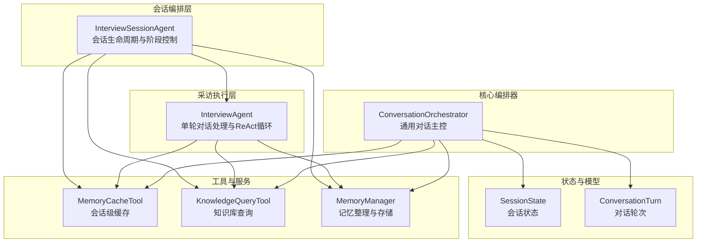
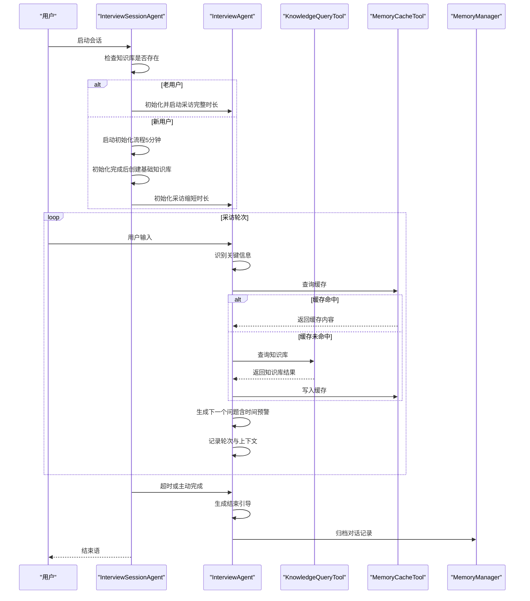
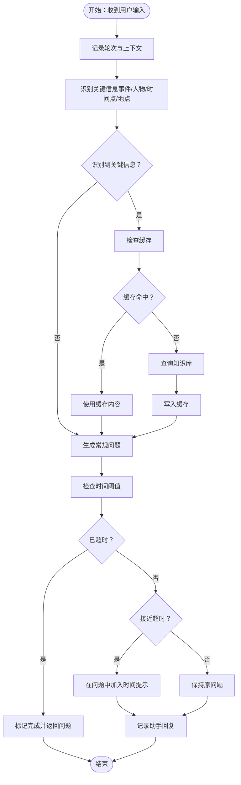
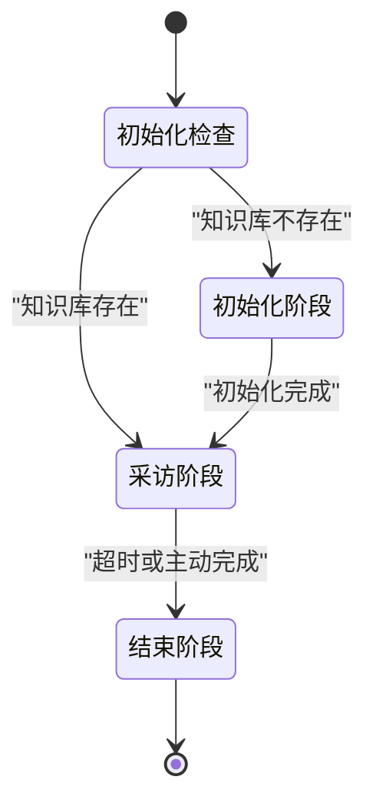
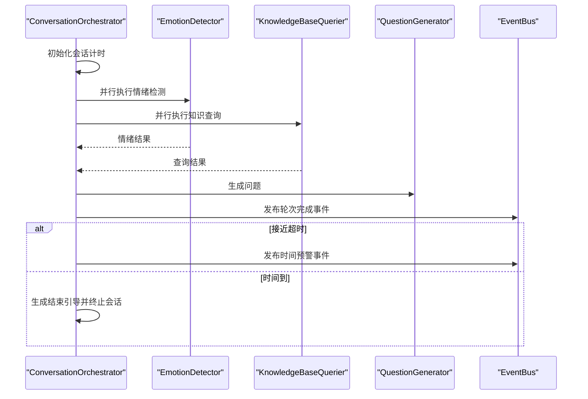
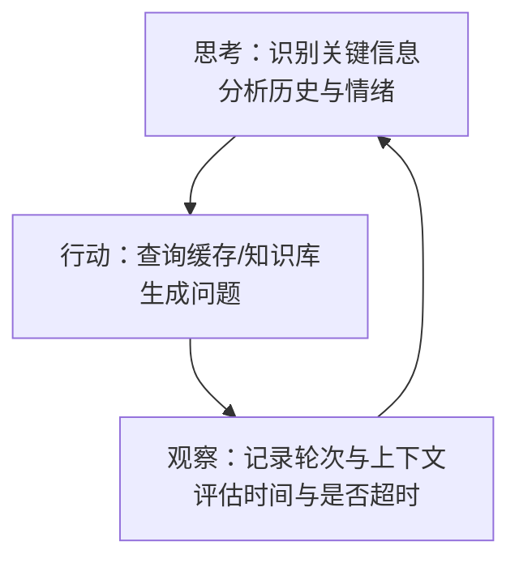
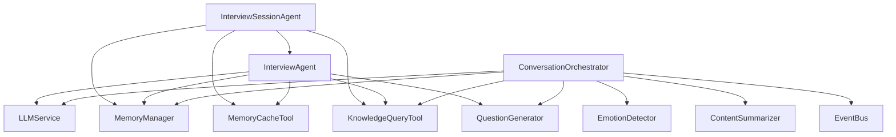

# 对话流程控制

<cite>
**本文引用的文件**
- [src/agents/interview_agent.py](file://src/agents/interview_agent.py)
- [src/agents/interview_session_agent.py](file://src/agents/interview_session_agent.py)
- [src/core/conversation_orchestrator.py](file://src/core/conversation_orchestrator.py)
- [src/models/session_state.py](file://src/models/session_state.py)
- [src/models/conversation_turn.py](file://src/models/conversation_turn.py)
- [src/enums/state_type.py](file://src/enums/state_type.py)
- [src/enums/phase_type.py](file://src/enums/phase_type.py)
- [src/services/memory_manager.py](file://src/services/memory_manager.py)
- [src/tools/memory_cache_tool.py](file://src/tools/memory_cache_tool.py)
- [src/tools/knowledge_query_tool.py](file://src/tools/knowledge_query_tool.py)
- [src/prompts/QuestionGenerator-Prompt.md](file://src/prompts/QuestionGenerator-Prompt.md)
- [src/prompts/MemoryOrganizer-Prompt.md](file://src/prompts/MemoryOrganizer-Prompt.md)
- [tests/test_interview_session_agent.py](file://tests/test_interview_session_agent.py)
</cite>

## 目录
1. [简介](#简介)
2. [项目结构](#项目结构)
3. [核心组件](#核心组件)
4. [架构总览](#架构总览)
5. [详细组件分析](#详细组件分析)
6. [依赖分析](#依赖分析)
7. [性能考量](#性能考量)
8. [故障排查指南](#故障排查指南)
9. [结论](#结论)
10. [附录](#附录)

## 简介
本文件聚焦“对话流程控制”模块，围绕 InterviewAgent 的核心控制逻辑进行深入解析，涵盖会话启动、对话轮次管理、会话结束的完整流程；详细说明时间控制机制（会话时长限制、时间警告机制、超时处理策略）；阐述对话状态管理（会话状态跟踪、对话历史维护、上下文保持技术）；解释 ReAct 模式在对话控制中的应用（思考-行动-观察的循环机制与决策制定过程）；并提供对话流程的具体示例与代码实现路径，展示如何处理多种对话场景。同时包含对话质量保证、用户体验优化与异常情况处理的技术细节。

## 项目结构
对话流程控制模块位于 src/agents 与 src/core 两大层次：
- 会话编排层：InterviewSessionAgent 负责会话生命周期管理、阶段切换与时间控制。
- 采访执行层：InterviewAgent 负责单轮对话的处理、关键信息识别、知识库查询与缓存、问题生成与时间预警。
- 核心编排器：ConversationOrchestrator 提供通用的对话主控能力（情绪检测、知识查询、问题生成、会话计时与结束引导），并与 InterviewAgent/SessionAgent 协同。
- 状态与模型：SessionState、ConversationTurn 等模型承载会话状态、轮次与上下文。
- 工具与服务：MemoryCacheTool、KnowledgeQueryTool、MemoryManager 等支撑缓存、查询与记忆组织。

图表来源
- [src/agents/interview_session_agent.py:33-482](file://src/agents/interview_session_agent.py#L33-L482)
- [src/agents/interview_agent.py:16-346](file://src/agents/interview_agent.py#L16-L346)
- [src/core/conversation_orchestrator.py:138-658](file://src/core/conversation_orchestrator.py#L138-L658)
- [src/models/session_state.py:24-139](file://src/models/session_state.py#L24-L139)
- [src/models/conversation_turn.py:14-52](file://src/models/conversation_turn.py#L14-L52)
- [src/tools/memory_cache_tool.py:8-89](file://src/tools/memory_cache_tool.py#L8-L89)
- [src/tools/knowledge_query_tool.py:11-81](file://src/tools/knowledge_query_tool.py#L11-L81)
- [src/services/memory_manager.py:27-470](file://src/services/memory_manager.py#L27-L470)

章节来源
- [src/agents/interview_session_agent.py:33-482](file://src/agents/interview_session_agent.py#L33-L482)
- [src/agents/interview_agent.py:16-346](file://src/agents/interview_agent.py#L16-L346)
- [src/core/conversation_orchestrator.py:138-658](file://src/core/conversation_orchestrator.py#L138-L658)
- [src/models/session_state.py:24-139](file://src/models/session_state.py#L24-L139)
- [src/models/conversation_turn.py:14-52](file://src/models/conversation_turn.py#L14-L52)
- [src/tools/memory_cache_tool.py:8-89](file://src/tools/memory_cache_tool.py#L8-L89)
- [src/tools/knowledge_query_tool.py:11-81](file://src/tools/knowledge_query_tool.py#L11-L81)
- [src/services/memory_manager.py:27-470](file://src/services/memory_manager.py#L27-L470)

## 核心组件
- InterviewSessionAgent：负责会话启动、阶段判定（初始化/采访/结束）、时间控制（总时长、初始化时长、前5分钟归档）、阶段内子Agent调度与会话收尾。
- InterviewAgent：负责单轮对话处理（记录轮次、识别关键信息、缓存命中/查询知识库、生成问题、时间预警与超时处理）。
- ConversationOrchestrator：通用主控器，提供情绪检测、知识查询、问题生成、会话计时与结束引导，支持 ReAct 式的思考-行动-观察循环。
- SessionState/ConversationTurn：承载会话状态、轮次与上下文，支持覆盖率、待追问、历史维护与情绪状态更新。
- MemoryCacheTool/KnowledgeQueryTool/MemoryManager：提供会话级缓存、知识库查询与记忆结构化整理，支撑上下文增强与长期记忆沉淀。

章节来源
- [src/agents/interview_session_agent.py:33-482](file://src/agents/interview_session_agent.py#L33-L482)
- [src/agents/interview_agent.py:16-346](file://src/agents/interview_agent.py#L16-L346)
- [src/core/conversation_orchestrator.py:138-658](file://src/core/conversation_orchestrator.py#L138-L658)
- [src/models/session_state.py:24-139](file://src/models/session_state.py#L24-L139)
- [src/models/conversation_turn.py:14-52](file://src/models/conversation_turn.py#L14-L52)
- [src/tools/memory_cache_tool.py:8-89](file://src/tools/memory_cache_tool.py#L8-L89)
- [src/tools/knowledge_query_tool.py:11-81](file://src/tools/knowledge_query_tool.py#L11-L81)
- [src/services/memory_manager.py:27-470](file://src/services/memory_manager.py#L27-L470)

## 架构总览
InterviewSessionAgent 作为会话入口，根据知识库是否存在决定新用户或老用户流程；InterviewAgent 承担单轮对话的 ReAct 循环与时间控制；ConversationOrchestrator 提供通用的主控能力与事件发布；MemoryCacheTool/KnowledgeQueryTool/MemoryManager 提供上下文增强与记忆沉淀。

图表来源
- [src/agents/interview_session_agent.py:112-482](file://src/agents/interview_session_agent.py#L112-L482)
- [src/agents/interview_agent.py:80-346](file://src/agents/interview_agent.py#L80-L346)
- [src/tools/knowledge_query_tool.py:33-81](file://src/tools/knowledge_query_tool.py#L33-L81)
- [src/tools/memory_cache_tool.py:34-89](file://src/tools/memory_cache_tool.py#L34-L89)
- [src/services/memory_manager.py:111-157](file://src/services/memory_manager.py#L111-L157)

## 详细组件分析

### InterviewAgent：单轮对话控制与 ReAct 循环
InterviewAgent 是采访流程的核心执行单元，其控制逻辑遵循 ReAct 模式：
- 思考：识别用户回答中的关键信息（事件/人物/时间点/地点），并基于对话历史与情绪状态进行上下文理解。
- 行动：查询缓存或知识库，生成下一个问题，并在接近超时时加入时间预警。
- 观察：记录轮次、更新会话历史与上下文，评估是否超时并决定是否结束。

关键流程要点：
- 启动：根据 resume_prompt 或标准模板生成开场白，记录轮次。
- 输入处理：记录用户回答，识别关键信息，缓存命中优先，否则查询知识库并写入缓存；生成问题并检查时间阈值。
- 结束：生成结束引导，保存会话总结，标记完成。

图表来源
- [src/agents/interview_agent.py:115-184](file://src/agents/interview_agent.py#L115-L184)
- [src/agents/interview_agent.py:186-243](file://src/agents/interview_agent.py#L186-L243)
- [src/agents/interview_agent.py:244-272](file://src/agents/interview_agent.py#L244-L272)

章节来源
- [src/agents/interview_agent.py:16-346](file://src/agents/interview_agent.py#L16-L346)

### InterviewSessionAgent：会话生命周期与阶段控制
InterviewSessionAgent 负责会话的全生命周期管理：
- 启动：检查知识库是否存在，老用户加载历史并继续，新用户启动初始化流程。
- 初始化阶段：ProfileCollectionAgent 收集用户画像，完成后创建基础知识库并切换到采访阶段。
- 采访阶段：控制总时长与前5分钟归档，分发用户输入到 InterviewAgent，处理超时与主动完成。
- 结束阶段：生成结束引导，归档对话记录，关闭会话。

图表来源
- [src/agents/interview_session_agent.py:112-130](file://src/agents/interview_session_agent.py#L112-L130)
- [src/agents/interview_session_agent.py:178-242](file://src/agents/interview_session_agent.py#L178-L242)
- [src/agents/interview_session_agent.py:243-340](file://src/agents/interview_session_agent.py#L243-L340)
- [src/agents/interview_session_agent.py:369-392](file://src/agents/interview_session_agent.py#L369-L392)

章节来源
- [src/agents/interview_session_agent.py:33-482](file://src/agents/interview_session_agent.py#L33-L482)

### ConversationOrchestrator：通用主控与 ReAct 支撑
ConversationOrchestrator 提供通用的对话主控能力：
- 会话计时：SessionTiming 支持总时长、预警阈值、剩余时间计算与时间到标记。
- ReAct 循环：并行执行情绪检测与知识查询，生成问题并更新状态；支持超时处理与结束引导。
- 事件发布：通过 EventBus 发布会话开始、轮次完成、时间预警、会话终止等事件，便于外部集成。

图表来源
- [src/core/conversation_orchestrator.py:236-344](file://src/core/conversation_orchestrator.py#L236-L344)
- [src/core/conversation_orchestrator.py:570-592](file://src/core/conversation_orchestrator.py#L570-L592)

章节来源
- [src/core/conversation_orchestrator.py:138-658](file://src/core/conversation_orchestrator.py#L138-L658)

### 时间控制机制：时长限制、预警与超时处理
- InterviewAgent：基于会话开始时间与设定时长计算已用比例，超过阈值（默认80%）时在问题中加入时间提示；达到100%时标记完成，等待用户回答后结束。
- InterviewSessionAgent：总时长默认15分钟，初始化阶段独立限制5分钟；达到前5分钟自动归档；超过总时长进入结束流程。
- ConversationOrchestrator：提供 SessionTiming 统一计时与预警逻辑，支持时间到事件与结束引导生成。

章节来源
- [src/agents/interview_agent.py:274-287](file://src/agents/interview_agent.py#L274-L287)
- [src/agents/interview_session_agent.py:344-367](file://src/agents/interview_session_agent.py#L344-L367)
- [src/core/conversation_orchestrator.py:54-94](file://src/core/conversation_orchestrator.py#L54-L94)

### 对话状态管理：会话状态跟踪、历史维护与上下文保持
- SessionState：记录会话ID、创建/最后活动时间、当前状态/阶段/策略、轮次、覆盖率、采集事件/人物、当前话题、情绪状态、待追问问题、对话历史与用户偏好。
- ConversationTurn：记录轮次ID、时间戳、用户输入、Agent回复、抽取实体/事件、情绪、来源文件与元数据。
- InterviewAgent：通过 _record_turn 维护 conversation_history，_format_history 仅取最近N轮用于上下文注入。
- MemoryManager：短期记忆通过 add_conversation_turn 维护，支持最近N轮获取与画像更新。

章节来源
- [src/models/session_state.py:24-139](file://src/models/session_state.py#L24-L139)
- [src/models/conversation_turn.py:14-52](file://src/models/conversation_turn.py#L14-L52)
- [src/agents/interview_agent.py:288-303](file://src/agents/interview_agent.py#L288-L303)
- [src/services/memory_manager.py:86-106](file://src/services/memory_manager.py#L86-L106)

### ReAct 模式在对话控制中的应用
InterviewAgent 的单轮处理严格遵循 ReAct：
- 思考（Reason）：识别关键信息、分析对话历史与情绪状态、评估是否需要知识库补充。
- 行动（Act）：查询缓存/知识库、生成问题、记录轮次。
- 观察（Observe）：评估时间阈值、是否超时、是否需要预警；更新会话历史与上下文。

图表来源
- [src/agents/interview_agent.py:115-184](file://src/agents/interview_agent.py#L115-L184)

章节来源
- [src/agents/interview_agent.py:16-346](file://src/agents/interview_agent.py#L16-L346)

### 对话流程示例与代码实现路径
- 新用户初始化流程：InterviewSessionAgent 启动 ProfileCollectionAgent，完成后创建基础知识库并切换到 InterviewAgent（缩短时长）。
- 老用户恢复流程：InterviewSessionAgent 加载历史，分析需要的知识库信息，生成继续对话的 Prompt，初始化 InterviewAgent 并启动采访。
- 单轮对话：InterviewAgent 识别关键信息、查询缓存/知识库、生成问题并在接近超时时加入时间提示。
- 会话结束：InterviewAgent 生成结束引导，InterviewSessionAgent 归档对话记录并关闭会话。

章节来源
- [src/agents/interview_session_agent.py:178-242](file://src/agents/interview_session_agent.py#L178-L242)
- [src/agents/interview_session_agent.py:243-340](file://src/agents/interview_session_agent.py#L243-L340)
- [src/agents/interview_agent.py:115-184](file://src/agents/interview_agent.py#L115-L184)
- [src/agents/interview_agent.py:244-272](file://src/agents/interview_agent.py#L244-L272)

### 对话质量保证与用户体验优化
- Prompt 管理：QuestionGenerator-Prompt.md 与 MemoryOrganizer-Prompt.md 提供结构化输出与高质量生成指导。
- 缓存与查询：MemoryCacheTool 降低重复查询成本，KnowledgeQueryTool 统一封装查询接口与结果格式化。
- 情绪与上下文：ConversationOrchestrator 并行执行情绪检测与知识查询，提升对话适配性与连贯性。
- 事件驱动：通过 EventBus 发布事件，便于前端或外部系统感知会话状态变化，优化交互体验。

章节来源
- [src/prompts/QuestionGenerator-Prompt.md:1-352](file://src/prompts/QuestionGenerator-Prompt.md#L1-L352)
- [src/prompts/MemoryOrganizer-Prompt.md:1-739](file://src/prompts/MemoryOrganizer-Prompt.md#L1-L739)
- [src/tools/memory_cache_tool.py:8-89](file://src/tools/memory_cache_tool.py#L8-L89)
- [src/tools/knowledge_query_tool.py:11-81](file://src/tools/knowledge_query_tool.py#L11-L81)
- [src/core/conversation_orchestrator.py:332-336](file://src/core/conversation_orchestrator.py#L332-L336)

### 异常情况处理
- 知识库结构校验：InterviewSessionAgent._check_knowledge_base 对目录结构与文件数量进行校验，确保会话正常启动。
- 缓存解析失败：InterviewAgent._identify_key_information 对 JSON 解析异常进行捕获与日志记录，避免中断流程。
- 超时与预警：多处采用时间阈值判断与标记，防止重复预警与重复处理。

章节来源
- [tests/test_interview_session_agent.py:15-77](file://tests/test_interview_session_agent.py#L15-L77)
- [src/agents/interview_agent.py:240-243](file://src/agents/interview_agent.py#L240-L243)
- [src/agents/interview_session_agent.py:131-177](file://src/agents/interview_session_agent.py#L131-L177)

## 依赖分析
- InterviewSessionAgent 依赖 InterviewAgent、ProfileCollectionAgent、MemoryManager、KnowledgeBaseQuerier、MemoryCacheTool、KnowledgeQueryTool、MemoryArchiveTool。
- InterviewAgent 依赖 LLMService、MemoryManager、MemoryCacheTool、KnowledgeQueryTool、QuestionGenerator、SessionState、ConversationTurn。
- ConversationOrchestrator 依赖 LLMService、EmotionDetector、KnowledgeBaseQuerier、QuestionGenerator、ContentSummarizer、MemoryManager、EventBus、SessionState、ConversationTurn。
- MemoryManager 依赖 MemoryRepository、LLMService，提供短期/长期记忆与画像更新。
- MemoryCacheTool/KnowledgeQueryTool 提供缓存与查询的基础设施。

图表来源
- [src/agents/interview_session_agent.py:54-106](file://src/agents/interview_session_agent.py#L54-L106)
- [src/agents/interview_agent.py:37-79](file://src/agents/interview_agent.py#L37-L79)
- [src/core/conversation_orchestrator.py:163-188](file://src/core/conversation_orchestrator.py#L163-L188)
- [src/services/memory_manager.py:47-61](file://src/services/memory_manager.py#L47-L61)

章节来源
- [src/agents/interview_session_agent.py:54-106](file://src/agents/interview_session_agent.py#L54-L106)
- [src/agents/interview_agent.py:37-79](file://src/agents/interview_agent.py#L37-L79)
- [src/core/conversation_orchestrator.py:163-188](file://src/core/conversation_orchestrator.py#L163-L188)
- [src/services/memory_manager.py:47-61](file://src/services/memory_manager.py#L47-L61)

## 性能考量
- 并行执行：ConversationOrchestrator 对情绪检测与知识查询采用 asyncio 并行执行，减少单轮等待时间。
- 缓存优先：InterviewAgent 优先查询缓存，降低知识库查询频率与延迟。
- 异步归档：InterviewSessionAgent 在前5分钟自动归档，避免长时间会话导致的内存压力。
- 结构化输出：通过 Prompt 模板约束输出格式，减少后处理开销与错误重试。

## 故障排查指南
- 知识库结构异常：使用测试用例验证知识库目录结构与文件数量，确保会话正常启动。
- 缓存解析失败：检查 _identify_key_information 的 JSON 解析逻辑与日志输出，定位上游 LLM 输出格式问题。
- 超时未触发：确认时间阈值与标记逻辑，避免重复预警与重复处理。
- 事件未发布：检查 EventBus 的事件发布时机与订阅方状态，确保前端或外部系统能正确感知会话状态变化。

章节来源
- [tests/test_interview_session_agent.py:15-77](file://tests/test_interview_session_agent.py#L15-L77)
- [src/agents/interview_agent.py:240-243](file://src/agents/interview_agent.py#L240-L243)
- [src/agents/interview_session_agent.py:346-355](file://src/agents/interview_session_agent.py#L346-L355)
- [src/core/conversation_orchestrator.py:332-336](file://src/core/conversation_orchestrator.py#L332-L336)

## 结论
对话流程控制模块通过 InterviewSessionAgent 与 InterviewAgent 的协同，实现了从会话启动、阶段切换、时间控制到结束归档的完整闭环；借助 ConversationOrchestrator 的通用主控能力与 ReAct 模式的思考-行动-观察循环，系统在保证对话质量的同时提升了用户体验与稳定性。缓存、查询与记忆整理工具的配合进一步增强了系统的性能与可扩展性。

## 附录
- Prompt 模板参考：
  - [QuestionGenerator-Prompt.md:1-352](file://src/prompts/QuestionGenerator-Prompt.md#L1-L352)
  - [MemoryOrganizer-Prompt.md:1-739](file://src/prompts/MemoryOrganizer-Prompt.md#L1-L739)
- 相关模型与枚举：
  - [session_state.py:24-139](file://src/models/session_state.py#L24-L139)
  - [conversation_turn.py:14-52](file://src/models/conversation_turn.py#L14-L52)
  - [state_type.py:4-12](file://src/enums/state_type.py#L4-L12)
  - [phase_type.py:4-10](file://src/enums/phase_type.py#L4-L10)