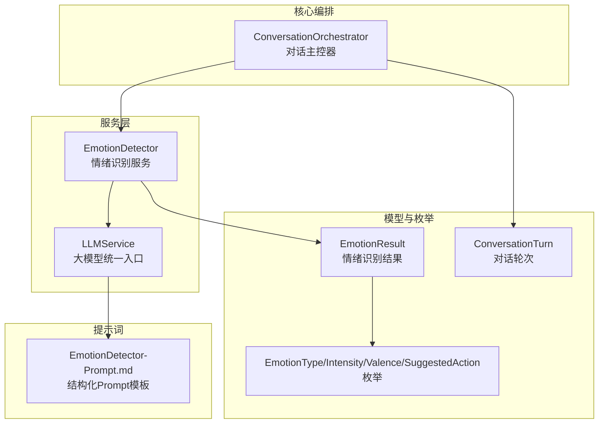
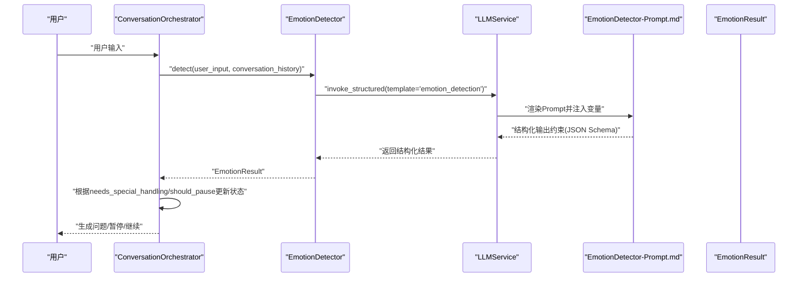
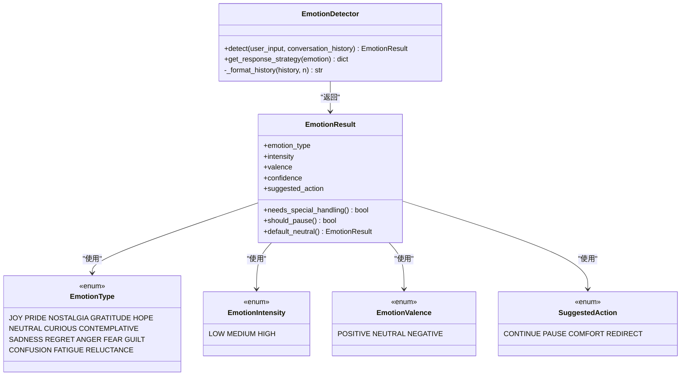
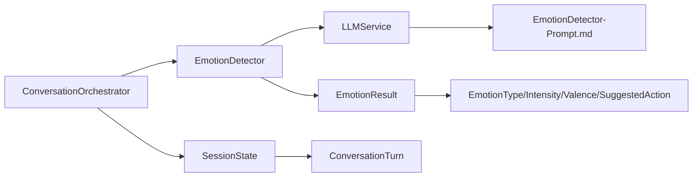

# 情绪识别与安抚

<cite>
**本文引用的文件**
- [src/services/emotion_detector.py](file://src/services/emotion_detector.py)
- [src/models/emotion_result.py](file://src/models/emotion_result.py)
- [src/enums/emotion_type.py](file://src/enums/emotion_type.py)
- [Prompts/EmotionDetector-Prompt.md](file://Prompts/EmotionDetector-Prompt.md)
- [src/models/conversation_turn.py](file://src/models/conversation_turn.py)
- [src/core/conversation_orchestrator.py](file://src/core/conversation_orchestrator.py)
- [src/services/llm_service.py](file://src/services/llm_service.py)
- [src/models/session_state.py](file://src/models/session_state.py)
- [src/enums/state_type.py](file://src/enums/state_type.py)
- [src/enums/strategy_type.py](file://src/enums/strategy_type.py)
- [test_core_services.py](file://test_core_services.py)
- [test_integration.py](file://test_integration.py)
</cite>

## 目录
1. [简介](#简介)
2. [项目结构](#项目结构)
3. [核心组件](#核心组件)
4. [架构总览](#架构总览)
5. [详细组件分析](#详细组件分析)
6. [依赖分析](#依赖分析)
7. [性能考量](#性能考量)
8. [故障排查指南](#故障排查指南)
9. [结论](#结论)
10. [附录](#附录)

## 简介
本技术文档围绕“情绪识别与安抚”模块展开，重点解释 EmotionDetector 的实现原理与工作机制，涵盖：
- 实时分析用户情感状态的技术机制
- 情感类型分类（积极、消极、中性）、情感强度评估与情感变化趋势分析
- 情绪识别的数据来源（文本情感分析、上下文情感判断）
- 情绪识别结果的应用场景（对话策略调整、问题类型选择、安抚语句生成）
- 具体示例与代码实现路径，展示如何处理不同情感状态的用户
- 准确性优化、实时性保证与用户体验提升策略

## 项目结构
该模块位于 src/services 与 src/models 之间，通过 LLMService 调用 Prompt 模板完成结构化输出，并被 ConversationOrchestrator 在每轮对话中并行调用，以驱动后续的对话策略与问题生成。

图表来源
- [src/services/emotion_detector.py:12-131](file://src/services/emotion_detector.py#L12-L131)
- [src/services/llm_service.py:32-481](file://src/services/llm_service.py#L32-L481)
- [Prompts/EmotionDetector-Prompt.md:1-259](file://Prompts/EmotionDetector-Prompt.md#L1-L259)
- [src/models/emotion_result.py:6-57](file://src/models/emotion_result.py#L6-L57)
- [src/enums/emotion_type.py:4-50](file://src/enums/emotion_type.py#L4-L50)
- [src/models/conversation_turn.py:14-52](file://src/models/conversation_turn.py#L14-L52)
- [src/core/conversation_orchestrator.py:138-420](file://src/core/conversation_orchestrator.py#L138-L420)

章节来源
- [src/services/emotion_detector.py:12-131](file://src/services/emotion_detector.py#L12-L131)
- [src/services/llm_service.py:32-481](file://src/services/llm_service.py#L32-L481)
- [Prompts/EmotionDetector-Prompt.md:1-259](file://Prompts/EmotionDetector-Prompt.md#L1-L259)
- [src/models/emotion_result.py:6-57](file://src/models/emotion_result.py#L6-L57)
- [src/enums/emotion_type.py:4-50](file://src/enums/emotion_type.py#L4-L50)
- [src/models/conversation_turn.py:14-52](file://src/models/conversation_turn.py#L14-L52)
- [src/core/conversation_orchestrator.py:138-420](file://src/core/conversation_orchestrator.py#L138-L420)

## 核心组件
- EmotionDetector：负责接收用户输入与最近对话历史，调用 LLMService 的结构化输出能力，解析为 EmotionResult，并提供响应策略映射。
- EmotionResult：承载情绪识别结果的 Pydantic 模型，包含情绪类型、强度、极性、置信度、建议动作及是否需要特殊处理等字段。
- EmotionType/EmotionIntensity/EmotionValence/SuggestedAction：枚举定义情绪分类体系与建议动作。
- ConversationOrchestrator：在每轮对话中并行调用 EmotionDetector，基于结果调整会话状态与策略。
- LLMService：统一管理大模型调用、Prompt 模板加载与结构化输出解析。
- Prompt 模板：EmotionDetector-Prompt.md 定义结构化输出 JSON Schema，确保结果可解析且一致。

章节来源
- [src/services/emotion_detector.py:12-131](file://src/services/emotion_detector.py#L12-L131)
- [src/models/emotion_result.py:6-57](file://src/models/emotion_result.py#L6-L57)
- [src/enums/emotion_type.py:4-50](file://src/enums/emotion_type.py#L4-L50)
- [src/core/conversation_orchestrator.py:269-343](file://src/core/conversation_orchestrator.py#L269-L343)
- [src/services/llm_service.py:327-399](file://src/services/llm_service.py#L327-L399)
- [Prompts/EmotionDetector-Prompt.md:43-55](file://Prompts/EmotionDetector-Prompt.md#L43-L55)

## 架构总览
下图展示了情绪识别在对话主控器中的调用链路与决策点。

图表来源
- [src/core/conversation_orchestrator.py:269-343](file://src/core/conversation_orchestrator.py#L269-L343)
- [src/services/emotion_detector.py:39-73](file://src/services/emotion_detector.py#L39-L73)
- [src/services/llm_service.py:327-399](file://src/services/llm_service.py#L327-L399)
- [Prompts/EmotionDetector-Prompt.md:43-55](file://Prompts/EmotionDetector-Prompt.md#L43-L55)

## 详细组件分析

### EmotionDetector 实现原理
- 输入：用户输入文本与最近对话历史（最多 n 轮，由内部格式化函数截取）。
- 调用链：调用 LLMService 的结构化输出接口，指定模板名为 "emotion_detection"，变量包含 user_input 与 conversation_history。
- 降级策略：当结构化解析失败或超时时，返回默认中性情绪结果，避免阻塞主流程。
- 响应策略映射：根据 valence 与 intensity 组合以及特殊类型（如 fatigue）给出动作建议（continue/pause/comfort/redirect）与语气温和程度。

图表来源
- [src/services/emotion_detector.py:12-131](file://src/services/emotion_detector.py#L12-L131)
- [src/models/emotion_result.py:6-57](file://src/models/emotion_result.py#L6-L57)
- [src/enums/emotion_type.py:4-50](file://src/enums/emotion_type.py#L4-L50)

章节来源
- [src/services/emotion_detector.py:39-131](file://src/services/emotion_detector.py#L39-L131)
- [src/models/emotion_result.py:20-57](file://src/models/emotion_result.py#L20-L57)
- [src/enums/emotion_type.py:4-50](file://src/enums/emotion_type.py#L4-L50)

### 情感识别算法与数据来源
- 文本情感分析：Prompt 模板明确要求识别情绪类型、强度与极性，并提供置信度；EmotionResult 的字段与 JSON Schema 明确约束。
- 上下文情感判断：EmotionDetector._format_history 将最近 n 轮对话历史格式化为字符串，作为上下文输入，帮助模型综合判断用户当前情绪。
- 特殊类型处理：如疲劳（fatigue）直接触发暂停建议；高强度负面情绪（valence=negative, intensity=high）与特定类型（confusion、reluctance）触发特殊处理。

章节来源
- [Prompts/EmotionDetector-Prompt.md:19-40](file://Prompts/EmotionDetector-Prompt.md#L19-L40)
- [src/services/emotion_detector.py:75-83](file://src/services/emotion_detector.py#L75-L83)
- [src/models/emotion_result.py:29-46](file://src/models/emotion_result.py#L29-L46)

### 情感类型分类、强度与极性
- 情绪类型：积极（joy/pride/nostalgia/gratitude/hope）、中性（neutral/curious/contemplative）、消极（sadness/regret/anger/fear/guilt），以及特殊类型（confusion/fatigue/reluctance）。
- 强度：低/中/高。
- 极性：正向/中性/负向。
- 建议动作：继续/暂停/安慰/重定向。

章节来源
- [src/enums/emotion_type.py:4-50](file://src/enums/emotion_type.py#L4-L50)
- [src/models/emotion_result.py:20-27](file://src/models/emotion_result.py#L20-L27)
- [Prompts/EmotionDetector-Prompt.md:34-39](file://Prompts/EmotionDetector-Prompt.md#L34-L39)

### 情感变化趋势分析
- 会话状态中维护情绪状态（emotion_state），记录最近一次变化轮次与当前类型/强度，便于趋势观察与策略调整。
- ConversationOrchestrator 在每轮结束后更新 SessionState 的情绪状态，结合 needs_special_handling/should_pause 控制会话状态流转。

章节来源
- [src/models/session_state.py:17-22](file://src/models/session_state.py#L17-L22)
- [src/models/session_state.py:119-124](file://src/models/session_state.py#L119-L124)
- [src/core/conversation_orchestrator.py:304-316](file://src/core/conversation_orchestrator.py#L304-L316)

### 情绪识别结果的应用场景
- 对话策略调整：根据 needs_special_handling/should_pause 将会话状态置为 PAUSE 或继续；根据 valence/intensity 选择语气温和程度与建议动作。
- 问题类型选择：EmotionResult.suggested_action 与 valence/intensity 组合映射到不同策略（继续深入/暂停/安慰/重定向）。
- 安抚语句生成：结合 get_response_strategy 的 tone 字段与建议动作，指导生成温和、关怀或转移注意力的回复。

章节来源
- [src/core/conversation_orchestrator.py:304-343](file://src/core/conversation_orchestrator.py#L304-L343)
- [src/services/emotion_detector.py:85-131](file://src/services/emotion_detector.py#L85-L131)

### 具体示例与代码实现路径
- 测试用例路径（正/负面情绪）：[test_core_services.py:27-58](file://test_core_services.py#L27-L58)
- 集成测试（多场景）：[test_integration.py:112-164](file://test_integration.py#L112-L164)
- Prompt 模板与输出格式：[Prompts/EmotionDetector-Prompt.md:43-55](file://Prompts/EmotionDetector-Prompt.md#L43-L55)
- EmotionDetector 调用链：[src/services/emotion_detector.py:39-73](file://src/services/emotion_detector.py#L39-L73)
- LLMService 结构化输出：[src/services/llm_service.py:327-399](file://src/services/llm_service.py#L327-L399)

章节来源
- [test_core_services.py:27-58](file://test_core_services.py#L27-L58)
- [test_integration.py:112-164](file://test_integration.py#L112-L164)
- [Prompts/EmotionDetector-Prompt.md:43-55](file://Prompts/EmotionDetector-Prompt.md#L43-L55)
- [src/services/emotion_detector.py:39-73](file://src/services/emotion_detector.py#L39-L73)
- [src/services/llm_service.py:327-399](file://src/services/llm_service.py#L327-L399)

## 依赖分析
- EmotionDetector 依赖 LLMService 与 EmotionResult；通过 Prompt 模板约束输出格式。
- ConversationOrchestrator 并行调用 EmotionDetector 与其他服务，统一管理超时与降级。
- EmotionResult 依赖多个枚举类型，提供布尔属性辅助策略决策。
- LLMService 负责模板加载、结构化输出解析与重试机制。

图表来源
- [src/core/conversation_orchestrator.py:178-185](file://src/core/conversation_orchestrator.py#L178-L185)
- [src/services/emotion_detector.py:30-37](file://src/services/emotion_detector.py#L30-L37)
- [src/services/llm_service.py:126-161](file://src/services/llm_service.py#L126-L161)
- [src/models/emotion_result.py:6-57](file://src/models/emotion_result.py#L6-L57)
- [src/enums/emotion_type.py:4-50](file://src/enums/emotion_type.py#L4-L50)
- [src/models/session_state.py:76-79](file://src/models/session_state.py#L76-L79)
- [src/models/conversation_turn.py:14-52](file://src/models/conversation_turn.py#L14-L52)

章节来源
- [src/core/conversation_orchestrator.py:178-185](file://src/core/conversation_orchestrator.py#L178-L185)
- [src/services/emotion_detector.py:30-37](file://src/services/emotion_detector.py#L30-L37)
- [src/services/llm_service.py:126-161](file://src/services/llm_service.py#L126-L161)
- [src/models/emotion_result.py:6-57](file://src/models/emotion_result.py#L6-L57)
- [src/enums/emotion_type.py:4-50](file://src/enums/emotion_type.py#L4-L50)
- [src/models/session_state.py:76-79](file://src/models/session_state.py#L76-L79)
- [src/models/conversation_turn.py:14-52](file://src/models/conversation_turn.py#L14-L52)

## 性能考量
- 并行调用：ConversationOrchestrator 在每轮对话中并行启动情绪识别与知识查询任务，缩短端到端延迟。
- 超时保护：为情绪识别设置超时阈值（默认 3 秒），超时则使用默认中性结果，保障实时性。
- 降级策略：当 LLMService 结构化解析失败或返回错误时，EmotionDetector 返回默认中性结果，避免阻塞。
- 重试机制：LLMService 内置指数退避重试，提高稳定性。
- 模板加载：Prompt 模板从 Markdown 文件动态加载，减少硬编码耦合，便于迭代。

章节来源
- [src/core/conversation_orchestrator.py:269-302](file://src/core/conversation_orchestrator.py#L269-L302)
- [src/services/emotion_detector.py:67-73](file://src/services/emotion_detector.py#L67-L73)
- [src/services/llm_service.py:400-437](file://src/services/llm_service.py#L400-L437)
- [src/services/llm_service.py:126-161](file://src/services/llm_service.py#L126-L161)

## 故障排查指南
- 情绪识别失败或超时
  - 现象：EmotionResult 为空或超时，系统回退为默认中性。
  - 排查：检查 LLMService 的模板加载与网络连接；确认 Prompt 模板存在且格式正确。
  - 参考路径：[src/services/emotion_detector.py:67-73](file://src/services/emotion_detector.py#L67-L73)，[src/services/llm_service.py:327-399](file://src/services/llm_service.py#L327-L399)
- 结构化输出解析失败
  - 现象：返回成功但 JSON 解析失败。
  - 排查：检查 Prompt 模板输出格式是否严格遵循 JSON Schema；确认模型输出未包含额外文本。
  - 参考路径：[Prompts/EmotionDetector-Prompt.md:43-55](file://Prompts/EmotionDetector-Prompt.md#L43-L55)，[src/services/llm_service.py:378-398](file://src/services/llm_service.py#L378-L398)
- 会话状态未按预期暂停
  - 现象：高强负面情绪未触发暂停。
  - 排查：确认 EmotionResult.needs_special_handling 与 should_pause 的判定逻辑；检查 SessionState.update_from_emotion 是否被调用。
  - 参考路径：[src/models/emotion_result.py:29-46](file://src/models/emotion_result.py#L29-L46)，[src/models/session_state.py:119-124](file://src/models/session_state.py#L119-L124)，[src/core/conversation_orchestrator.py:304-316](file://src/core/conversation_orchestrator.py#L304-L316)

章节来源
- [src/services/emotion_detector.py:67-73](file://src/services/emotion_detector.py#L67-L73)
- [src/services/llm_service.py:327-399](file://src/services/llm_service.py#L327-L399)
- [Prompts/EmotionDetector-Prompt.md:43-55](file://Prompts/EmotionDetector-Prompt.md#L43-L55)
- [src/models/emotion_result.py:29-46](file://src/models/emotion_result.py#L29-L46)
- [src/models/session_state.py:119-124](file://src/models/session_state.py#L119-L124)
- [src/core/conversation_orchestrator.py:304-316](file://src/core/conversation_orchestrator.py#L304-L316)

## 结论
本模块通过结构化 Prompt 与 LLMService 的统一调用，实现了对用户情感的实时识别与策略化响应。EmotionDetector 将情绪识别结果转化为可操作的策略建议，并与 ConversationOrchestrator 的状态机协同，确保在不同情感状态下提供合适的对话节奏与语气温和度。通过并行调用、超时保护与降级策略，系统在保证实时性的同时提升了鲁棒性与用户体验。

## 附录
- Prompt 模板与输出格式定义：[Prompts/EmotionDetector-Prompt.md:43-55](file://Prompts/EmotionDetector-Prompt.md#L43-L55)
- 测试用例参考路径：
  - [test_core_services.py:27-58](file://test_core_services.py#L27-L58)
  - [test_integration.py:112-164](file://test_integration.py#L112-L164)