# 智能问答系统

<cite>
**本文引用的文件**
- [InterviewAgent](file://src/agents/interview_agent.py)
- [InterviewSessionAgent](file://src/agents/interview_session_agent.py)
- [QuestionGenerator](file://src/services/question_generator.py)
- [EmotionDetector](file://src/services/emotion_detector.py)
- [ConversationOrchestrator](file://src/core/conversation_orchestrator.py)
- [LLMService](file://src/services/llm_service.py)
- [KnowledgeBaseQuerier](file://src/services/knowledge_base_querier.py)
- [KnowledgeQueryTool](file://src/tools/knowledge_query_tool.py)
- [SessionState](file://src/models/session_state.py)
- [EmotionResult](file://src/models/emotion_result.py)
- [EmotionType](file://src/enums/emotion_type.py)
- [PhaseType](file://src/enums/phase_type.py)
- [GuidedInitialInterviewController](file://src/agents/guided_initial_interview_controller.py)
- [ProfileCollectionAgent](file://src/agents/profile_collection_agent.py)
- [INITIAL_INTERVIEW_QUESTIONS](file://src/config/initial_interview_questions.py)
- [ProfileCollection-Prompt.md](file://Prompts/ProfileCollection-Prompt.md)
- [QuestionGenerator-Prompt.md](file://Prompts/QuestionGenerator-Prompt.md)
- [EmotionDetector-Prompt.md](file://src/prompts/EmotionDetector-Prompt.md)
- [MemoryOrganizer-Prompt.md](file://Prompts/MemoryOrganizer-Prompt.md)
- [问答引导层Agent-系统架构设计.md](file://问答引导层Agent-系统架构设计.md)
</cite>

## 更新摘要
**所做更改**
- 移除了 ProfileCollectionAgent 中 story_expectation 字段的处理逻辑
- 更新了 InterviewAgent 和 InterviewSessionAgent 的初始化参数以适配新的简化工作流
- 调整了会话状态管理，不再依赖 story_expectation 字段进行画像预填判断
- 简化了资料收集流程，去除了与 story_expectation 相关的复杂逻辑
- **更新**：移除了相关调用站点中的 max_iterations 参数传递，因为底层查询机制已完全重构为非迭代的两步式工作流

## 目录
1. [简介](#简介)
2. [项目结构](#项目结构)
3. [核心组件](#核心组件)
4. [架构总览](#架构总览)
5. [详细组件分析](#详细组件分析)
6. [依赖关系分析](#依赖关系分析)
7. [性能考量](#性能考量)
8. [故障排查指南](#故障排查指南)
9. [结论](#结论)
10. [附录](#附录)

## 简介
本文件面向"智能问答系统"的技术文档，聚焦 InterviewAgent 的实现原理与运行机制，涵盖以下要点：
- InterviewAgent 如何根据用户回答自动生成下一问题的算法机制
- QuestionGenerator 的智能问题生成策略（开放性、追问性、确认性、情感性问题）
- EmotionDetector 的情绪识别机制（情感状态分析、情绪变化检测、对话策略调整）
- ReAct 模式在问答系统中的应用（思考-行动-观察循环）
- 引导式初始面试流程和资料收集机制
- 会话流程控制、上下文管理与会话状态维护
- 具体问题生成示例与代码实现路径指引

## 项目结构
系统采用分层架构，围绕"对话主控器"协调多个服务与工具，形成"感知-决策-执行-反馈"的闭环。新增的引导式初始面试控制器和增强的资料收集代理进一步完善了系统的初始交互能力。

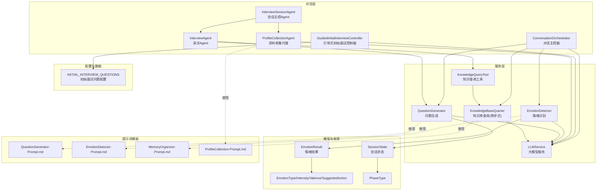

**图表来源**
- [ConversationOrchestrator:138-401](file://src/core/conversation_orchestrator.py#L138-L401)
- [InterviewAgent:16-184](file://src/agents/interview_agent.py#L16-L184)
- [InterviewSessionAgent:71-350](file://src/agents/interview_session_agent.py#L71-L350)
- [GuidedInitialInterviewController:36-458](file://src/agents/guided_initial_interview_controller.py#L36-L458)
- [ProfileCollectionAgent:454-658](file://src/agents/profile_collection_agent.py#L454-L658)
- [QuestionGenerator:12-74](file://src/services/question_generator.py#L12-L74)
- [EmotionDetector:12-73](file://src/services/emotion_detector.py#L12-L73)
- [KnowledgeBaseQuerier:17-199](file://src/services/knowledge_base_querier.py#L17-L199)
- [KnowledgeQueryTool:11-81](file://src/tools/knowledge_query_tool.py#L11-L81)
- [LLMService:32-89](file://src/services/llm_service.py#L32-L89)
- [SessionState:24-139](file://src/models/session_state.py#L24-L139)
- [EmotionResult:6-57](file://src/models/emotion_result.py#L6-L57)
- [EmotionType:4-50](file://src/enums/emotion_type.py#L4-L50)
- [PhaseType:4-10](file://src/enums/phase_type.py#L4-L10)
- [INITIAL_INTERVIEW_QUESTIONS:6-100](file://src/config/initial_interview_questions.py#L6-L100)
- [QuestionGenerator-Prompt.md:1-352](file://Prompts/QuestionGenerator-Prompt.md#L1-L352)
- [EmotionDetector-Prompt.md:1-259](file://src/prompts/EmotionDetector-Prompt.md#L1-L259)
- [MemoryOrganizer-Prompt.md:1-773](file://Prompts/MemoryOrganizer-Prompt.md#L1-L773)
- [ProfileCollection-Prompt.md:1-500](file://Prompts/ProfileCollection-Prompt.md#L1-L500)

**章节来源**
- [ConversationOrchestrator:138-401](file://src/core/conversation_orchestrator.py#L138-L401)
- [InterviewAgent:16-184](file://src/agents/interview_agent.py#L16-L184)
- [InterviewSessionAgent:71-350](file://src/agents/interview_session_agent.py#L71-L350)
- [GuidedInitialInterviewController:36-458](file://src/agents/guided_initial_interview_controller.py#L36-L458)
- [ProfileCollectionAgent:454-658](file://src/agents/profile_collection_agent.py#L454-L658)
- [QuestionGenerator:12-74](file://src/services/question_generator.py#L12-L74)
- [EmotionDetector:12-73](file://src/services/emotion_detector.py#L12-L73)
- [KnowledgeBaseQuerier:17-199](file://src/services/knowledge_base_querier.py#L17-L199)
- [KnowledgeQueryTool:11-81](file://src/tools/knowledge_query_tool.py#L11-L81)
- [LLMService:32-89](file://src/services/llm_service.py#L32-L89)
- [SessionState:24-139](file://src/models/session_state.py#L24-L139)
- [EmotionResult:6-57](file://src/models/emotion_result.py#L6-L57)
- [EmotionType:4-50](file://src/enums/emotion_type.py#L4-L50)
- [PhaseType:4-10](file://src/enums/phase_type.py#L4-L10)
- [INITIAL_INTERVIEW_QUESTIONS:6-100](file://src/config/initial_interview_questions.py#L6-L100)
- [QuestionGenerator-Prompt.md:1-352](file://Prompts/QuestionGenerator-Prompt.md#L1-L352)
- [EmotionDetector-Prompt.md:1-259](file://src/prompts/EmotionDetector-Prompt.md#L1-L259)
- [MemoryOrganizer-Prompt.md:1-773](file://Prompts/MemoryOrganizer-Prompt.md#L1-L773)
- [ProfileCollection-Prompt.md:1-500](file://Prompts/ProfileCollection-Prompt.md#L1-L500)

## 核心组件
- InterviewAgent：负责采访流程的启动、用户输入处理、关键信息识别、知识库查询与缓存、问题生成与时间控制，并记录对话轮次与会话摘要。
- InterviewSessionAgent：会话主控Agent，管理整个采访会话的生命周期，包括初始化、资料收集、正式采访和结束阶段的协调。
- GuidedInitialInterviewController：引导式初始面试控制器，管理预设问题计划和持久化进度，确保早期面试专注于静态问题计划。
- ProfileCollectionAgent：增强的资料收集代理，负责收集用户基础信息（14个字段）、渐进式提问和信息提取，支持自然对话和多轮交互。
- QuestionGenerator：根据当前状态（情绪、记忆、阶段、策略、对话历史）生成问题；支持情绪响应、追问、阶段过渡与默认问题生成。
- EmotionDetector：识别用户输入的情绪类型、强度、效价与建议动作，提供是否需要特殊处理的判断。
- ConversationOrchestrator：对话主控器，协调情绪识别、知识库查询、问题生成、内容归纳与会话状态管理，支持并行异步任务与超时保护。
- KnowledgeBaseQuerier（两步式）：以两步式工作流动态探索知识库，通过"搜索→读取"的固定流程进行检索与读取，最终输出结构化记忆结果。
- LLMService：统一的大模型调用入口，封装模板加载、结构化输出、错误处理与统计。
- KnowledgeQueryTool：封装知识库查询工具，提供简洁查询接口与结果格式化。
- SessionState/EmotionResult：会话状态与情绪结果的数据模型，承载对话进度、覆盖率、采集内容与情绪状态。

**章节来源**
- [InterviewAgent:16-184](file://src/agents/interview_agent.py#L16-L184)
- [InterviewSessionAgent:71-350](file://src/agents/interview_session_agent.py#L71-L350)
- [GuidedInitialInterviewController:36-458](file://src/agents/guided_initial_interview_controller.py#L36-L458)
- [ProfileCollectionAgent:454-658](file://src/agents/profile_collection_agent.py#L454-L658)
- [QuestionGenerator:12-74](file://src/services/question_generator.py#L12-L74)
- [EmotionDetector:12-73](file://src/services/emotion_detector.py#L12-L73)
- [ConversationOrchestrator:138-401](file://src/core/conversation_orchestrator.py#L138-L401)
- [KnowledgeBaseQuerier:17-199](file://src/services/knowledge_base_querier.py#L17-L199)
- [KnowledgeQueryTool:11-81](file://src/tools/knowledge_query_tool.py#L11-L81)
- [LLMService:32-89](file://src/services/llm_service.py#L32-L89)
- [SessionState:24-139](file://src/models/session_state.py#L24-L139)
- [EmotionResult:6-57](file://src/models/emotion_result.py#L6-L57)
- [EmotionType:4-50](file://src/enums/emotion_type.py#L4-L50)
- [PhaseType:4-10](file://src/enums/phase_type.py#L4-L10)
- [INITIAL_INTERVIEW_QUESTIONS:6-100](file://src/config/initial_interview_questions.py#L6-L100)
- [QuestionGenerator-Prompt.md:1-352](file://Prompts/QuestionGenerator-Prompt.md#L1-L352)
- [EmotionDetector-Prompt.md:1-259](file://src/prompts/EmotionDetector-Prompt.md#L1-L259)
- [MemoryOrganizer-Prompt.md:1-773](file://Prompts/MemoryOrganizer-Prompt.md#L1-L773)
- [ProfileCollection-Prompt.md:1-500](file://Prompts/ProfileCollection-Prompt.md#L1-L500)

## 架构总览
系统采用"主控器 + 多服务 + 工具 + 模板"的架构，核心流程如下：
- 用户输入 → 主控器并行触发情绪识别与知识库查询 → 生成问题 → 更新会话状态 → 触发内容归纳 → 检查交接条件 → 返回回复
- InterviewAgent 作为外部直接调用入口，内部复用 QuestionGenerator 与知识库工具链
- 新增引导式初始面试控制器处理早期面试流程，ProfileCollectionAgent 负责用户资料收集

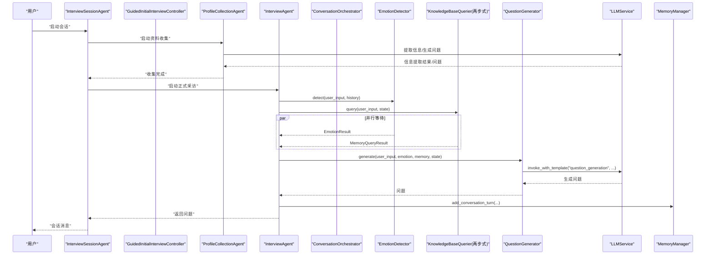

**图表来源**
- [InterviewSessionAgent:124-350](file://src/agents/interview_session_agent.py#L124-L350)
- [GuidedInitialInterviewController:120-237](file://src/agents/guided_initial_interview_controller.py#L120-L237)
- [ProfileCollectionAgent:496-658](file://src/agents/profile_collection_agent.py#L496-L658)
- [InterviewAgent:93-184](file://src/agents/interview_agent.py#L93-L184)
- [ConversationOrchestrator:236-343](file://src/core/conversation_orchestrator.py#L236-L343)
- [EmotionDetector:39-73](file://src/services/emotion_detector.py#L39-L73)
- [KnowledgeBaseQuerier:257-286](file://src/services/knowledge_base_querier.py#L257-L286)
- [QuestionGenerator:38-74](file://src/services/question_generator.py#L38-L74)
- [LLMService:32-89](file://src/services/llm_service.py#L32-L89)

**章节来源**
- [InterviewSessionAgent:124-350](file://src/agents/interview_session_agent.py#L124-L350)
- [GuidedInitialInterviewController:120-237](file://src/agents/guided_initial_interview_controller.py#L120-L237)
- [ProfileCollectionAgent:496-658](file://src/agents/profile_collection_agent.py#L496-L658)
- [InterviewAgent:93-184](file://src/agents/interview_agent.py#L93-L184)
- [ConversationOrchestrator:236-343](file://src/core/conversation_orchestrator.py#L236-L343)
- [问答引导层Agent-系统架构设计.md:933-1002](file://问答引导层Agent-系统架构设计.md#L933-L1002)

## 详细组件分析

### InterviewSessionAgent：会话主控Agent
- 功能概述：管理整个采访会话的生命周期，包括初始化、资料收集、正式采访和结束阶段的协调。
- 核心能力：
  - 会话生命周期管理：根据用户知识库状态决定进入信息收集或直接采访
  - 流程调度：初始化→采访→结束的有序流程控制
  - 时间控制：15分钟总时长，初始化5分钟，采访流程的时间分配
  - 知识库协调：与知识库查询和缓存工具的协调工作
- 状态管理：
  - INIT：启动检查阶段
  - PROFILE_COLLECTION：用户初始化阶段
  - INTERVIEW：主体采访阶段
  - ENDING：结束引导阶段
  - CLOSED：会话关闭阶段

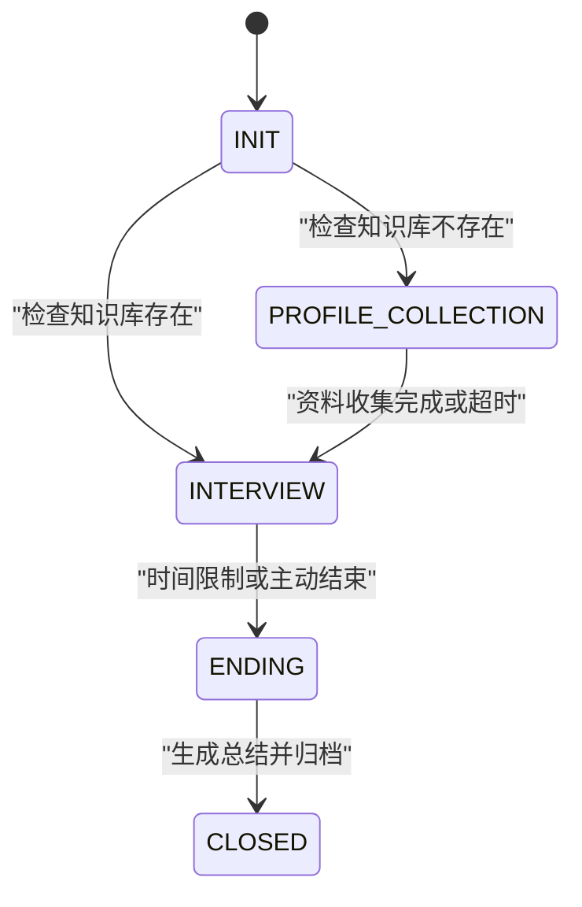

**图表来源**
- [InterviewSessionAgent:62-123](file://src/agents/interview_session_agent.py#L62-L123)
- [InterviewSessionAgent:124-350](file://src/agents/interview_session_agent.py#L124-L350)

**章节来源**
- [InterviewSessionAgent:71-350](file://src/agents/interview_session_agent.py#L71-L350)

### GuidedInitialInterviewController：引导式初始面试控制器
- 功能概述：管理预设问题计划和持久化进度，确保早期面试专注于静态问题计划，避免将 InterviewAgent 的提示变成优先事项的混乱集合。
- 核心能力：
  - 状态管理：加载/保存引导状态，重建损坏状态，确保状态有效性
  - 问题序列：按预设顺序生成问题，支持追问限制（每个问题最多2次追问）
  - 决策逻辑：根据用户回答质量决定是否推进到下一个问题
  - 主题切换：支持阶段间主题切换和自由采访过渡
- 状态持久化：使用 JSON 文件存储引导状态，包含已完成问题、当前问题、追问次数等信息
- 决策规则：
  1) 用户已提供具体细节 → 自然过渡到下一个预设问题
  2) 回答过于笼统且追问次数未达上限 → 温和地换个角度追问当前问题
  3) 候选问题与用户主动提及内容强相关 → 改写候选问题作为当前话题下的追问
  4) 用户提到强情绪、创伤等 → 先接住并短暂追问，不要硬切题

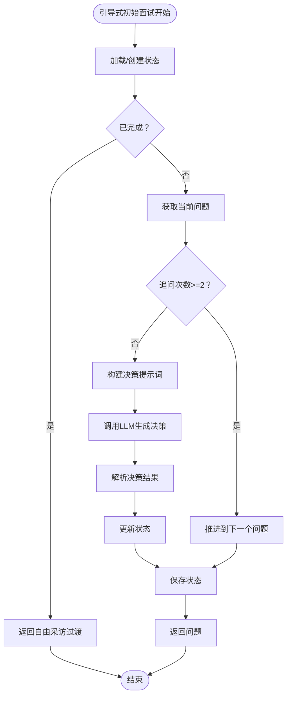

**图表来源**
- [GuidedInitialInterviewController:120-237](file://src/agents/guided_initial_interview_controller.py#L120-L237)
- [GuidedInitialInterviewController:346-415](file://src/agents/guided_initial_interview_controller.py#L346-L415)

**章节来源**
- [GuidedInitialInterviewController:36-458](file://src/agents/guided_initial_interview_controller.py#L36-L458)
- [INITIAL_INTERVIEW_QUESTIONS:6-100](file://src/config/initial_interview_questions.py#L6-L100)

### ProfileCollectionAgent：增强的资料收集代理
- 功能概述：负责收集用户基础信息（14个字段），提供渐进式提问和自然对话体验，支持对话历史记录和多轮交互。
- 核心能力：
  - 多模板支持：欢迎语、信息提取、问题生成三个独立模板
  - 字段标准化：支持多种别名映射，如"姓名"→"name"、"年龄"→"age"
  - 智能提取：从用户输入中提取结构化信息，支持正则表达式回退机制
  - 渐进式收集：根据缺失字段动态选择下一个要收集的字段
  - 结束条件：必填字段完整或对话超过5分钟自动结束
- 字段收集策略：
  - 必填字段：name、age、occupation、family_status、living_arrangement
  - 可选字段：gender、birth_year、birth_place、children_count、health_status、important_person、favorite_memory、**story_expectation（已移除）**
- 提取机制：
  1) 结构化提取：使用专门的提取模板进行 JSON 结构化提取
  2) 正则回退：无法结构化提取时使用正则表达式进行回退提取
  3) 字段归一化：统一字段名称和值格式

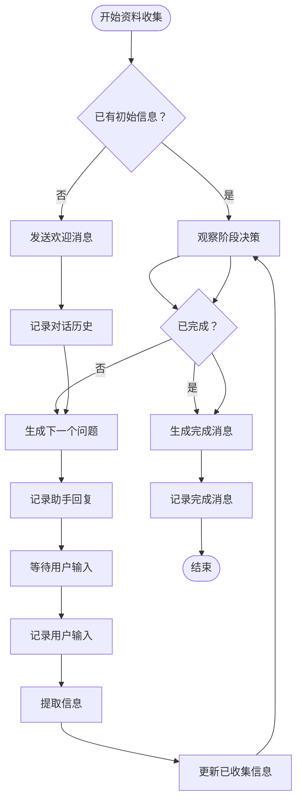

**图表来源**
- [ProfileCollectionAgent:516-658](file://src/agents/profile_collection_agent.py#L516-L658)
- [ProfileCollectionAgent:575-608](file://src/agents/profile_collection_agent.py#L575-L608)
- [ProfileCollectionAgent:487-550](file://src/agents/profile_collection_agent.py#L487-L550)

**章节来源**
- [ProfileCollectionAgent:454-658](file://src/agents/profile_collection_agent.py#L454-L658)
- [ProfileCollection-Prompt.md:1-500](file://Prompts/ProfileCollection-Prompt.md#L1-L500)

### InterviewAgent：自动问题生成与会话控制
- 启动流程：根据 resume_prompt 或标准模板生成开场白，记录对话轮次
- 输入处理：记录用户回答 → 识别关键信息（事件/人物/时间点/地点）→ 缓存命中优先，否则查询知识库并更新缓存 → 生成下一问题 → 检查时间阈值（接近超时加入时间提示）
- 关键能力：
  - 关键信息识别：通过结构化 Prompt 识别并返回 JSON，包含标签与查询文本
  - 缓存与查询：MemoryCacheTool 与 KnowledgeQueryTool 协同，减少重复检索
  - 问题生成：委托 QuestionGenerator，传递历史与记忆上下文
  - 时间控制：基于会话起始时间与持续时长计算比例，触发警告与结束

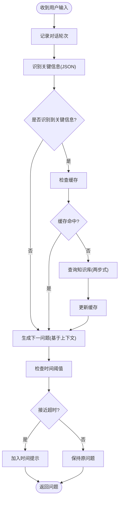

**图表来源**
- [InterviewAgent:115-184](file://src/agents/interview_agent.py#L115-L184)
- [KnowledgeQueryTool:33-66](file://src/tools/knowledge_query_tool.py#L33-L66)
- [KnowledgeBaseQuerier:257-286](file://src/services/knowledge_base_querier.py#L257-L286)

**章节来源**
- [InterviewAgent:80-184](file://src/agents/interview_agent.py#L80-L184)
- [KnowledgeQueryTool:33-66](file://src/tools/knowledge_query_tool.py#L33-L66)

### QuestionGenerator：智能问题生成策略
- 优先级决策链：
  1) 情绪响应优先：当情绪需要特殊处理时，使用"emotion_response"模板生成共情/安抚类问题
  2) 待追问问题：优先弹出 pending_questions 列表中的问题
  3) 阶段过渡：当前阶段覆盖率≥0.8 且存在后续阶段时，生成自然过渡问题
  4) 上下文生成：使用"question_generation"模板，结合策略、阶段、轮次、覆盖率、记忆上下文与对话历史生成问题
  5) 降级策略：模板调用失败时返回默认问题
- 问题类型与生成规则：
  - 开放性问题：鼓励用户自由叙述，避免"请告诉我…"等生硬表达，采用自然引导句式
  - 追问性问题：针对用户已提及的事件/人物/时间点进行具体化、情感化、关联化追问
  - 确认性问题：用于澄清事实、时间、地点等信息，降低歧义
  - 情感性问题：在用户表达负面/疲劳/抗拒等情绪时，优先安抚与暂停建议
- 阶段过渡：根据阶段顺序（童年→青少年→青年→中年→老年）在覆盖率达标时自然过渡

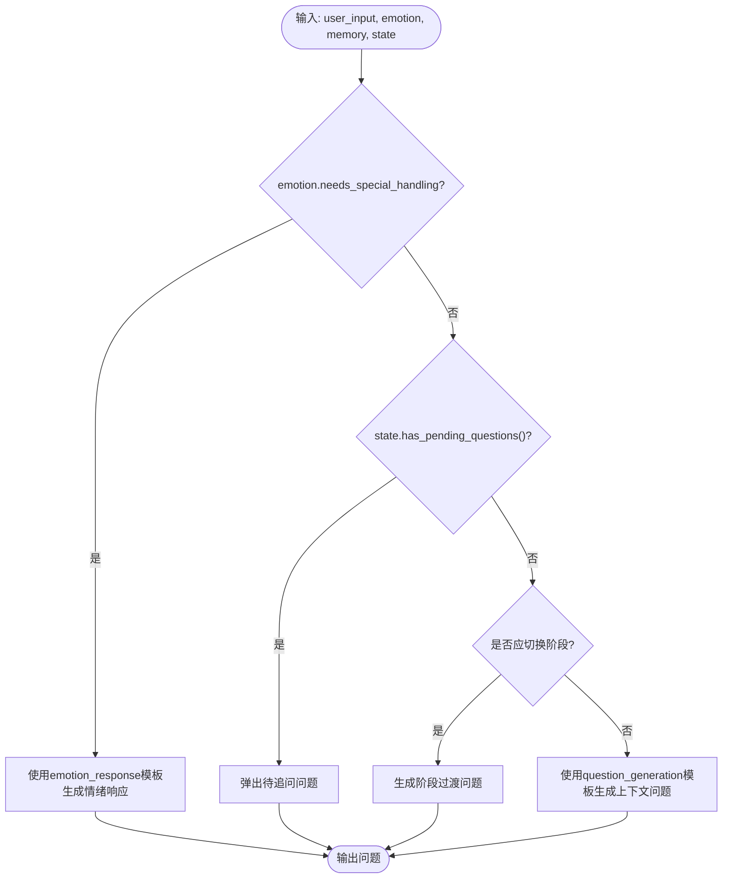

**图表来源**
- [QuestionGenerator:38-74](file://src/services/question_generator.py#L38-L74)
- [QuestionGenerator-Prompt.md:1-352](file://Prompts/QuestionGenerator-Prompt.md#L1-L352)

**章节来源**
- [QuestionGenerator:38-140](file://src/services/question_generator.py#L38-L140)
- [QuestionGenerator-Prompt.md:1-352](file://Prompts/QuestionGenerator-Prompt.md#L1-L352)

### EmotionDetector：情绪识别与策略调整
- 输入：用户输入 + 最近对话历史（格式化为"用户/助手"交替）
- 输出：EmotionResult（类型、强度、效价、置信度、建议动作、是否需要特殊处理）
- 策略映射：
  - 高强度负面情绪 → 暂停/安慰
  - 中等强度负面情绪 → 安慰/可选换话题
  - 疲劳 → 建议休息
  - 正向情绪 → 继续深入
  - 默认 → 正常推进
- 与主控器协作：当 needs_special_handling 为真时，主控器将暂停状态并触发相应事件

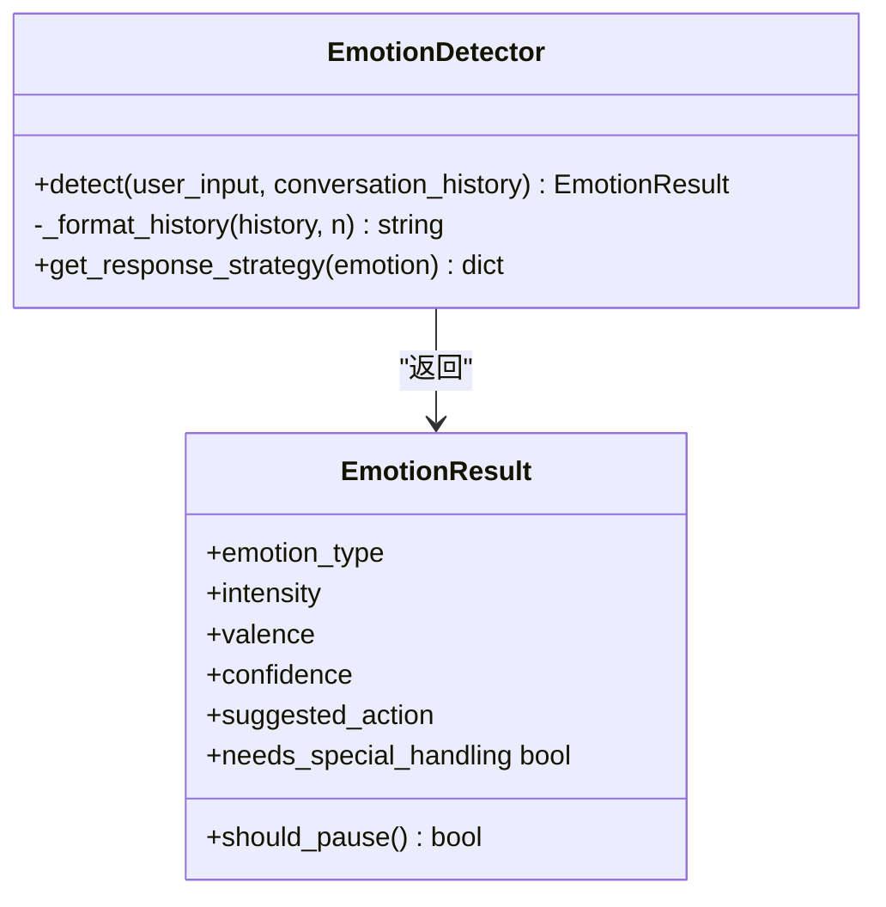

**图表来源**
- [EmotionDetector:39-73](file://src/services/emotion_detector.py#L39-L73)
- [EmotionResult:20-47](file://src/models/emotion_result.py#L20-L47)
- [EmotionType:4-50](file://src/enums/emotion_type.py#L4-L50)

**章节来源**
- [EmotionDetector:39-131](file://src/services/emotion_detector.py#L39-L131)
- [EmotionResult:20-57](file://src/models/emotion_result.py#L20-L57)
- [EmotionType:4-50](file://src/enums/emotion_type.py#L4-L50)
- [EmotionDetector-Prompt.md:1-259](file://src/prompts/EmotionDetector-Prompt.md#L1-L259)

### 两步式查询模式：知识库查询的搜索-读取固定流程
- **更新**：底层查询机制已完全重构为非迭代的两步式工作流，移除了 max_iterations 参数传递
- 第一步：搜索（Search）→ 查找与用户输入相关的文件和内容片段
- 第二步：读取（Read）→ 读取最相关的文件内容获取详细上下文
- 固定流程：通过固定的"搜索→读取"顺序进行检索与读取，避免无限循环和过度迭代
- 输出：最终输出结构化记忆结果，包含查询意图、相关记忆、链接内容等

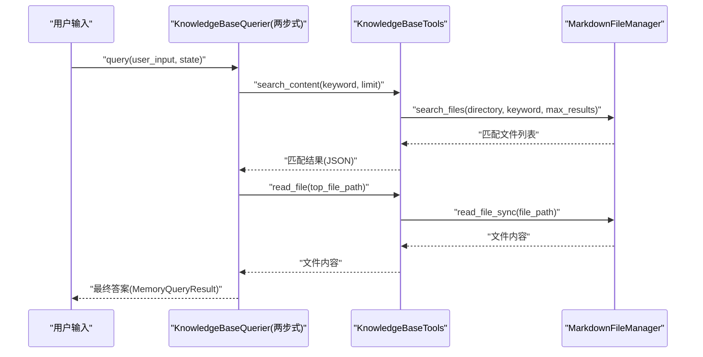

**图表来源**
- [KnowledgeBaseQuerier:257-286](file://src/services/knowledge_base_querier.py#L257-L286)
- [问答引导层Agent-系统架构设计.md:411-446](file://问答引导层Agent-系统架构设计.md#L411-L446)

**章节来源**
- [KnowledgeBaseQuerier:17-199](file://src/services/knowledge_base_querier.py#L17-L199)
- [问答引导层Agent-系统架构设计.md:332-446](file://问答引导层Agent-系统架构设计.md#L332-L446)

### 会话流程控制、上下文管理与状态维护
- 会话状态（SessionState）：包含会话ID、创建时间、当前状态、当前阶段、策略、轮次、覆盖率、采集事件/人物、当前话题、情绪状态、待追问问题、对话历史、用户偏好等
- 对话轮次（ConversationTurn）：记录每轮的用户输入、助手回复、情绪类型、时间戳
- 主控器（ConversationOrchestrator）：
  - 初始化会话与计时器
  - 并行执行情绪识别与知识库查询，带超时保护
  - 根据情绪结果更新状态（暂停/继续）
  - 生成问题并更新短期记忆
  - 检查交接条件（轮次阈值、阶段覆盖率）
  - 会话结束时生成结束引导内容与交接包

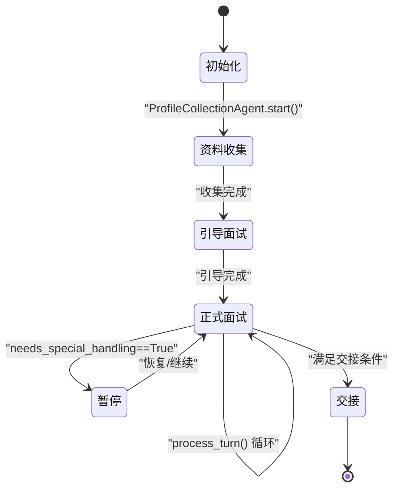

**图表来源**
- [ConversationOrchestrator:198-401](file://src/core/conversation_orchestrator.py#L198-L401)
- [SessionState:24-139](file://src/models/session_state.py#L24-L139)
- [ProfileCollectionAgent:516-550](file://src/agents/profile_collection_agent.py#L516-L550)
- [GuidedInitialInterviewController:93-118](file://src/agents/guided_initial_interview_controller.py#L93-L118)

**章节来源**
- [ConversationOrchestrator:198-401](file://src/core/conversation_orchestrator.py#L198-L401)
- [SessionState:24-139](file://src/models/session_state.py#L24-L139)

## 依赖关系分析
- 组件耦合与内聚：
  - InterviewSessionAgent 作为会话主控器，聚合 ProfileCollectionAgent、InterviewAgent、GuidedInitialInterviewController 等子组件，内聚度高
  - ConversationOrchestrator 作为协调者，聚合 EmotionDetector、KnowledgeBaseQuerier、QuestionGenerator、LLMService、MemoryManager 等，内聚度高
  - InterviewAgent 依赖 QuestionGenerator 与知识库工具链，耦合集中在问题生成与知识检索
  - GuidedInitialInterviewController 依赖 LLMService 和初始面试问题配置，提供引导式面试流程
  - ProfileCollectionAgent 独立运行，通过 LLMService 进行信息提取和问题生成
  - EmotionDetector 与 QuestionGenerator 均依赖 LLMService 的模板调用能力
- 外部依赖：
  - LLMService 统一封装模型提供商（OpenAI/DeepSeek/Anthropic），支持结构化输出与模板管理
  - KnowledgeBaseQuerier 依赖 MarkdownFileManager 进行文件系统操作
  - GuidedInitialInterviewController 依赖 INITIAL_INTERVIEW_QUESTIONS 配置
  - ProfileCollectionAgent 依赖 ProfileCollection-Prompt.md 模板文件
- 潜在循环依赖：
  - 未发现直接循环依赖；各方向调用均为单向（主控器→服务，服务→工具，工具→文件系统）

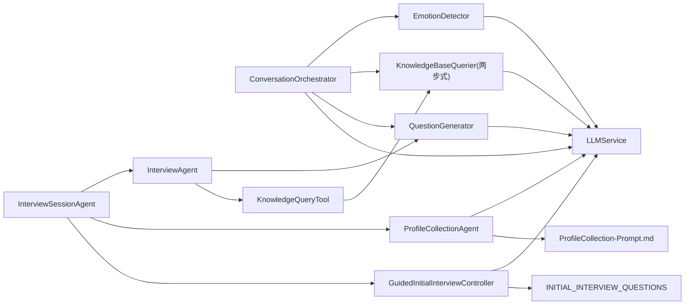

**图表来源**
- [InterviewSessionAgent:109-123](file://src/agents/interview_session_agent.py#L109-L123)
- [ConversationOrchestrator:163-187](file://src/core/conversation_orchestrator.py#L163-L187)
- [InterviewAgent:37-61](file://src/agents/interview_agent.py#L37-L61)
- [GuidedInitialInterviewController:16-51](file://src/agents/guided_initial_interview_controller.py#L16-L51)
- [ProfileCollectionAgent:8-58](file://src/agents/profile_collection_agent.py#L8-L58)
- [KnowledgeQueryTool:25-31](file://src/tools/knowledge_query_tool.py#L25-L31)

**章节来源**
- [InterviewSessionAgent:109-123](file://src/agents/interview_session_agent.py#L109-L123)
- [ConversationOrchestrator:163-187](file://src/core/conversation_orchestrator.py#L163-L187)
- [InterviewAgent:37-61](file://src/agents/interview_agent.py#L37-L61)
- [GuidedInitialInterviewController:16-51](file://src/agents/guided_initial_interview_controller.py#L16-L51)
- [ProfileCollectionAgent:8-58](file://src/agents/profile_collection_agent.py#L8-L58)
- [KnowledgeQueryTool:25-31](file://src/tools/knowledge_query_tool.py#L25-L31)

## 性能考量
- 并行异步：主控器对情绪识别与知识库查询采用 asyncio.create_task 并行执行，显著降低端到端延迟
- 超时保护：为关键异步任务设置超时（情绪识别 3s、知识库查询 5s），失败时使用降级策略（默认中性情绪、空结果）
- 缓存策略：InterviewAgent 在识别到关键信息后优先查询缓存，未命中再查询知识库并写入缓存，减少重复检索
- 模板与结构化输出：LLMService 统一管理模板与结构化输出，减少重复解析成本
- **更新**：两步式查询工作流替代了原有的迭代式 ReAct 模式，通过固定的搜索-读取流程避免了无限循环，提高了稳定性和可预测性
- 引导式面试优化：通过状态持久化避免重复工作，提高用户体验一致性
- 会话主控优化：InterviewSessionAgent 统一管理会话生命周期，减少重复初始化开销

## 故障排查指南
- 情绪识别失败：
  - 现象：返回默认中性情绪
  - 排查：检查模板加载、LLM 调用参数与输出格式；查看日志与降级分支
  - 参考：[EmotionDetector:67-73](file://src/services/emotion_detector.py#L67-L73)
- 知识库查询超时：
  - 现象：返回空结果
  - 排查：检查目标路径合法性、工具函数可用性、文件系统权限；适当增加超时或优化查询策略
  - **更新**：两步式查询工作流已移除 max_iterations 参数，查询流程更加稳定可靠
  - 参考：[KnowledgeBaseQuerier:280-286](file://src/services/knowledge_base_querier.py#L280-L286)
- 问题生成失败：
  - 现象：返回默认问题
  - 排查：检查模板注册、变量注入与结构化输出模型；确认 SessionState 与记忆上下文有效
  - 参考：[QuestionGenerator:135-139](file://src/services/question_generator.py#L135-L139)
- 引导式面试状态异常：
  - 现象：状态文件损坏或丢失
  - 排查：检查知识库根目录权限、JSON 文件格式、状态重建逻辑
  - 参考：[GuidedInitialInterviewController:61-75](file://src/agents/guided_initial_interview_controller.py#L61-L75)
- 资料收集提取失败：
  - 现象：信息提取结果为空或格式错误
  - 排查：检查正则表达式模式、字段别名映射、回退提取逻辑
  - 参考：[ProfileCollectionAgent:554-574](file://src/agents/profile_collection_agent.py#L554-L574)
- 会话时间到：
  - 现象：触发时间警告与结束引导
  - 排查：确认计时器配置与阈值；检查事件发布与状态更新
  - 参考：[InterviewSessionAgent:344-350](file://src/agents/interview_session_agent.py#L344-L350)
- 会话主控异常：
  - 现象：InterviewSessionAgent 状态管理错误
  - 排查：检查会话阶段转换逻辑、超时检测、异常处理
  - 参考：[InterviewSessionAgent:124-350](file://src/agents/interview_session_agent.py#L124-L350)

**章节来源**
- [EmotionDetector:67-73](file://src/services/emotion_detector.py#L67-L73)
- [KnowledgeBaseQuerier:280-286](file://src/services/knowledge_base_querier.py#L280-L286)
- [QuestionGenerator:135-139](file://src/services/question_generator.py#L135-L139)
- [GuidedInitialInterviewController:61-75](file://src/agents/guided_initial_interview_controller.py#L61-L75)
- [ProfileCollectionAgent:554-574](file://src/agents/profile_collection_agent.py#L554-L574)
- [InterviewSessionAgent:344-350](file://src/agents/interview_session_agent.py#L344-L350)

## 结论
本系统通过"主控器 + 多服务 + 工具 + 模板"的分层设计，实现了高效、可扩展的智能问答与采访引导能力。新增的 InterviewSessionAgent 作为会话主控Agent，进一步完善了系统的会话管理能力，提供了更加专业和人性化的面试流程。移除 story_expectation 字段的处理逻辑简化了系统架构，提高了代码的可维护性。

**更新**：底层查询机制已完全重构为非迭代的两步式工作流，移除了 max_iterations 参数传递，通过固定的"搜索→读取"流程替代了原有的迭代式 ReAct 模式，显著提高了系统的稳定性和可预测性。这一变更消除了无限循环的风险，同时保持了高效的查询性能。

InterviewAgent 以 InterviewAgent 为核心，结合 QuestionGenerator 的多策略问题生成、EmotionDetector 的情绪感知与策略调整、**更新**：重构后的两步式知识库查询机制、以及完善的会话状态管理与缓存机制，形成了从"感知-决策-执行-反馈"的闭环。该架构既保证了实时性与稳定性，又具备良好的可维护性与扩展性。

## 附录
- 提示词模板与输出数据结构：
  - QuestionGenerator-Prompt.md：定义"question_generation"模板、变量格式化规则与输出结构
  - EmotionDetector-Prompt.md：定义"emotion_detection"模板、变量格式化规则与输出结构
  - MemoryOrganizer-Prompt.md：定义"memory_organization"模板、存储建议与输出结构
  - ProfileCollection-Prompt.md：定义资料收集相关模板，包含欢迎语、信息提取、问题生成三个部分
- 代码实现路径示例（仅路径，不含具体代码内容）：
  - 会话主控：[InterviewSessionAgent.start:124-142](file://src/agents/interview_session_agent.py#L124-L142)
  - 引导式面试控制器：[GuidedInitialInterviewController.generate_next:120-237](file://src/agents/guided_initial_interview_controller.py#L120-L237)
  - 资料收集代理：[ProfileCollectionAgent.handle_input:516-658](file://src/agents/profile_collection_agent.py#L516-L658)
  - 问题生成：[QuestionGenerator.generate:38-74](file://src/services/question_generator.py#L38-L74)
  - 情绪识别：[EmotionDetector.detect:39-73](file://src/services/emotion_detector.py#L39-L73)
  - **更新**：两步式知识库查询：[KnowledgeBaseQuerier.query:257-286](file://src/services/knowledge_base_querier.py#L257-L286)
  - 会话处理主流程：[ConversationOrchestrator.process_turn:236-343](file://src/core/conversation_orchestrator.py#L236-L343)
  - InterviewAgent 输入处理：[InterviewAgent.handle_input:115-184](file://src/agents/interview_agent.py#L115-L184)

**章节来源**
- [InterviewSessionAgent:124-350](file://src/agents/interview_session_agent.py#L124-L350)
- [QuestionGenerator-Prompt.md:1-352](file://Prompts/QuestionGenerator-Prompt.md#L1-L352)
- [EmotionDetector-Prompt.md:1-259](file://src/prompts/EmotionDetector-Prompt.md#L1-L259)
- [MemoryOrganizer-Prompt.md:1-773](file://Prompts/MemoryOrganizer-Prompt.md#L1-L773)
- [ProfileCollection-Prompt.md:1-500](file://Prompts/ProfileCollection-Prompt.md#L1-L500)
- [GuidedInitialInterviewController:120-237](file://src/agents/guided_initial_interview_controller.py#L120-L237)
- [ProfileCollectionAgent:516-658](file://src/agents/profile_collection_agent.py#L516-L658)
- [QuestionGenerator:38-74](file://src/services/question_generator.py#L38-L74)
- [EmotionDetector:39-73](file://src/services/emotion_detector.py#L39-L73)
- **更新**：[KnowledgeBaseQuerier:257-286](file://src/services/knowledge_base_querier.py#L257-L286)
- [ConversationOrchestrator:236-343](file://src/core/conversation_orchestrator.py#L236-L343)
- [InterviewAgent:115-184](file://src/agents/interview_agent.py#L115-L184)