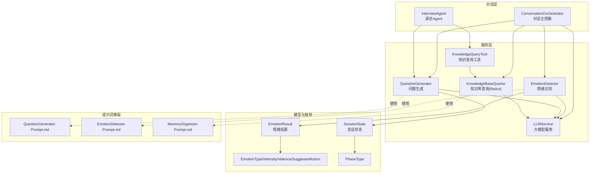
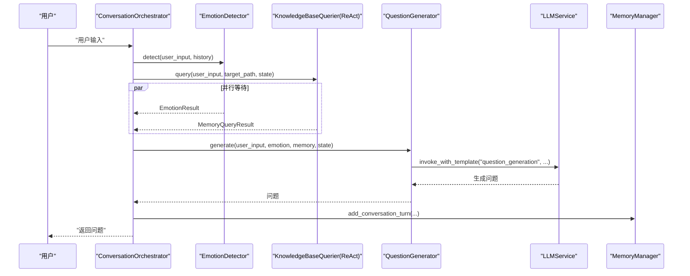
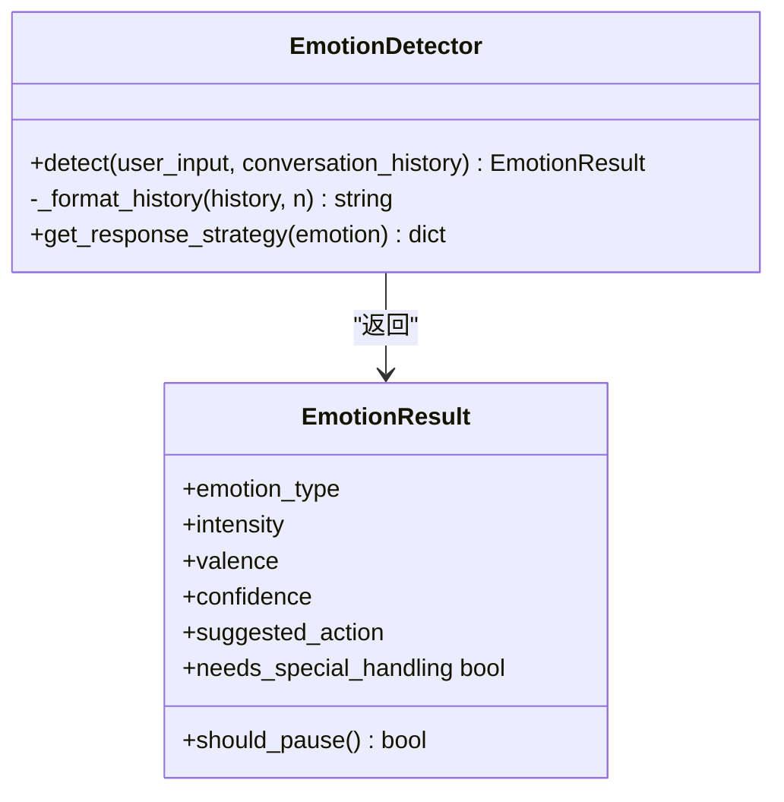
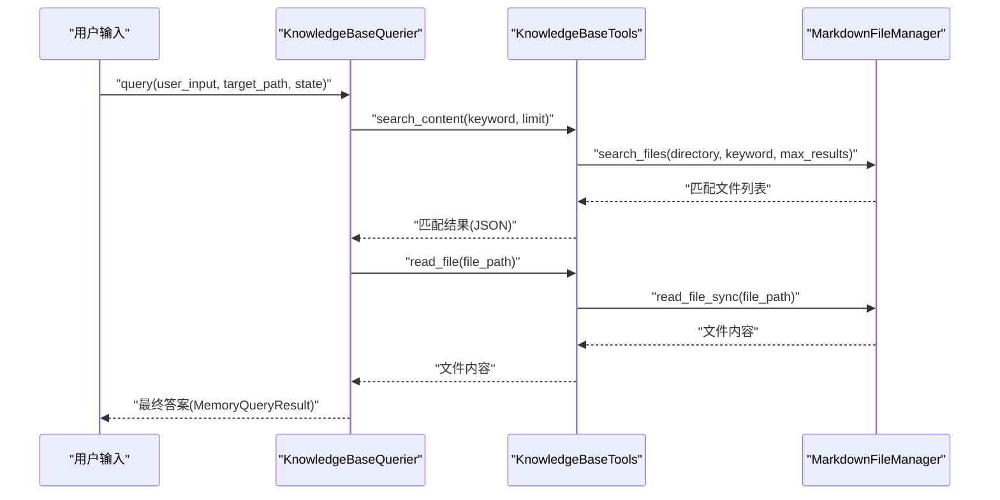
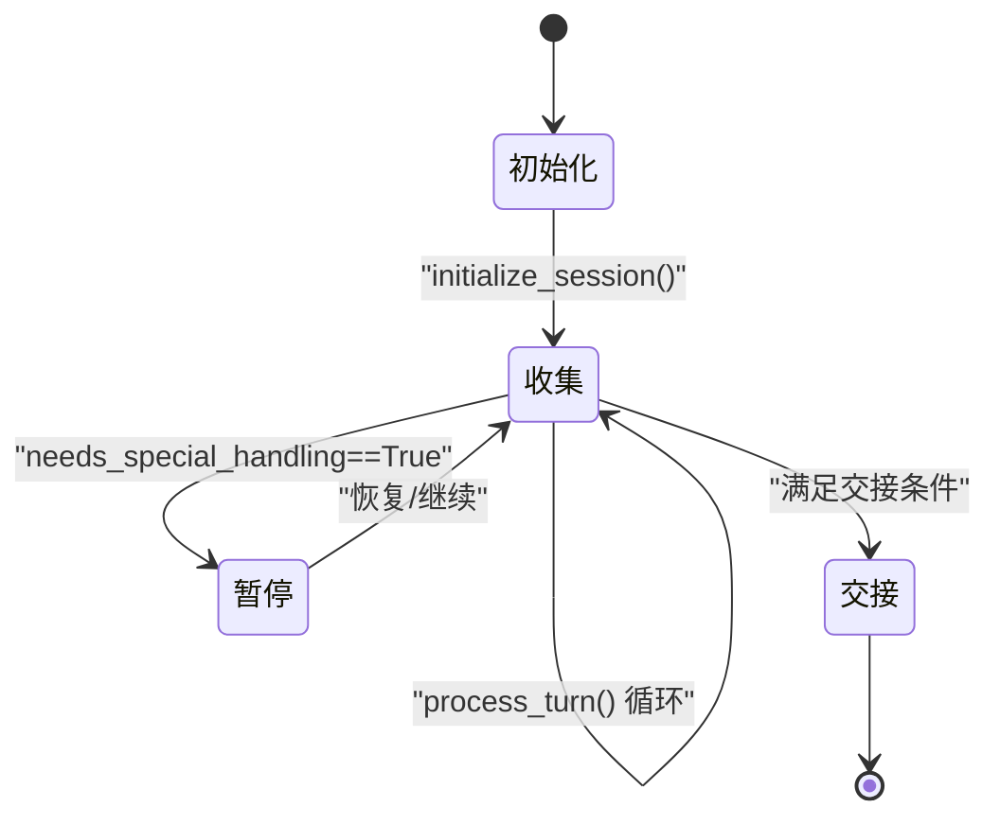
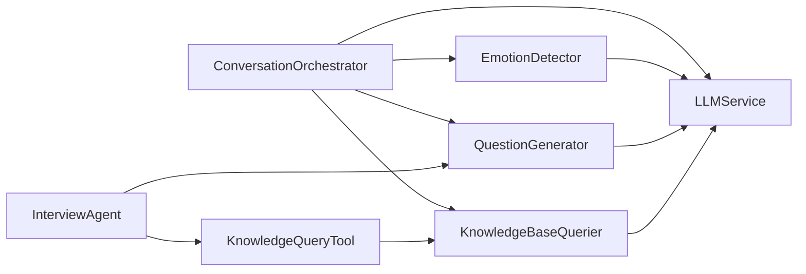

# 智能问答系统

<cite>
**本文引用的文件**
- [InterviewAgent](file://src/agents/interview_agent.py)
- [QuestionGenerator](file://src/services/question_generator.py)
- [EmotionDetector](file://src/services/emotion_detector.py)
- [ConversationOrchestrator](file://src/core/conversation_orchestrator.py)
- [LLMService](file://src/services/llm_service.py)
- [KnowledgeBaseQuerier](file://src/services/knowledge_base_querier.py)
- [KnowledgeQueryTool](file://src/tools/knowledge_query_tool.py)
- [SessionState](file://src/models/session_state.py)
- [EmotionResult](file://src/models/emotion_result.py)
- [EmotionType](file://src/enums/emotion_type.py)
- [PhaseType](file://src/enums/phase_type.py)
- [QuestionGenerator-Prompt.md](file://Prompts/QuestionGenerator-Prompt.md)
- [EmotionDetector-Prompt.md](file://src/prompts/EmotionDetector-Prompt.md)
- [MemoryOrganizer-Prompt.md](file://Prompts/MemoryOrganizer-Prompt.md)
- [问答引导层Agent-系统架构设计.md](file://问答引导层Agent-系统架构设计.md)
</cite>

## 目录
1. [简介](#简介)
2. [项目结构](#项目结构)
3. [核心组件](#核心组件)
4. [架构总览](#架构总览)
5. [详细组件分析](#详细组件分析)
6. [依赖关系分析](#依赖关系分析)
7. [性能考量](#性能考量)
8. [故障排查指南](#故障排查指南)
9. [结论](#结论)
10. [附录](#附录)

## 简介
本文件面向“智能问答系统”的技术文档，聚焦 InterviewAgent 的实现原理与运行机制，涵盖以下要点：
- InterviewAgent 如何根据用户回答自动生成下一问题的算法机制
- QuestionGenerator 的智能问题生成策略（开放性、追问性、确认性、情感性问题）
- EmotionDetector 的情绪识别机制（情感状态分析、情绪变化检测、对话策略调整）
- ReAct 模式在问答系统中的应用（思考-行动-观察循环）
- 会话流程控制、上下文管理与会话状态维护
- 具体问题生成示例与代码实现路径指引

## 项目结构
系统采用分层架构，围绕“对话主控器”协调多个服务与工具，形成“感知-决策-执行-反馈”的闭环。

**图表来源**
- [ConversationOrchestrator:138-401](file://src/core/conversation_orchestrator.py#L138-L401)
- [InterviewAgent:16-184](file://src/agents/interview_agent.py#L16-L184)
- [QuestionGenerator:12-74](file://src/services/question_generator.py#L12-L74)
- [EmotionDetector:12-73](file://src/services/emotion_detector.py#L12-L73)
- [KnowledgeBaseQuerier:17-199](file://src/services/knowledge_base_querier.py#L17-L199)
- [KnowledgeQueryTool:11-81](file://src/tools/knowledge_query_tool.py#L11-L81)
- [LLMService:32-89](file://src/services/llm_service.py#L32-L89)
- [SessionState:24-139](file://src/models/session_state.py#L24-L139)
- [EmotionResult:6-57](file://src/models/emotion_result.py#L6-L57)
- [EmotionType:4-50](file://src/enums/emotion_type.py#L4-L50)
- [PhaseType:4-10](file://src/enums/phase_type.py#L4-L10)
- [QuestionGenerator-Prompt.md:1-352](file://Prompts/QuestionGenerator-Prompt.md#L1-L352)
- [EmotionDetector-Prompt.md:1-259](file://src/prompts/EmotionDetector-Prompt.md#L1-L259)
- [MemoryOrganizer-Prompt.md:1-773](file://Prompts/MemoryOrganizer-Prompt.md#L1-L773)

**章节来源**
- [ConversationOrchestrator:138-401](file://src/core/conversation_orchestrator.py#L138-L401)
- [InterviewAgent:16-184](file://src/agents/interview_agent.py#L16-L184)
- [QuestionGenerator:12-74](file://src/services/question_generator.py#L12-L74)
- [EmotionDetector:12-73](file://src/services/emotion_detector.py#L12-L73)
- [KnowledgeBaseQuerier:17-199](file://src/services/knowledge_base_querier.py#L17-L199)
- [KnowledgeQueryTool:11-81](file://src/tools/knowledge_query_tool.py#L11-L81)
- [LLMService:32-89](file://src/services/llm_service.py#L32-L89)
- [SessionState:24-139](file://src/models/session_state.py#L24-L139)
- [EmotionResult:6-57](file://src/models/emotion_result.py#L6-L57)
- [EmotionType:4-50](file://src/enums/emotion_type.py#L4-L50)
- [PhaseType:4-10](file://src/enums/phase_type.py#L4-L10)
- [QuestionGenerator-Prompt.md:1-352](file://Prompts/QuestionGenerator-Prompt.md#L1-L352)
- [EmotionDetector-Prompt.md:1-259](file://src/prompts/EmotionDetector-Prompt.md#L1-L259)
- [MemoryOrganizer-Prompt.md:1-773](file://Prompts/MemoryOrganizer-Prompt.md#L1-L773)

## 核心组件
- InterviewAgent：负责采访流程的启动、用户输入处理、关键信息识别、知识库查询与缓存、问题生成与时间控制，并记录对话轮次与会话摘要。
- QuestionGenerator：根据当前状态（情绪、记忆、阶段、策略、对话历史）生成问题；支持情绪响应、追问、阶段过渡与默认问题生成。
- EmotionDetector：识别用户输入的情绪类型、强度、效价与建议动作，提供是否需要特殊处理的判断。
- ConversationOrchestrator：对话主控器，协调情绪识别、知识库查询、问题生成、内容归纳与会话状态管理，支持并行异步任务与超时保护。
- KnowledgeBaseQuerier（ReAct）：以 ReAct 模式动态探索知识库，通过 Thought → Action → Observation 循环进行检索与读取，最终输出结构化记忆结果。
- LLMService：统一的大模型调用入口，封装模板加载、结构化输出、错误处理与统计。
- KnowledgeQueryTool：封装知识库查询工具，提供简洁查询接口与结果格式化。
- SessionState/EmotionResult：会话状态与情绪结果的数据模型，承载对话进度、覆盖率、采集内容与情绪状态。

**章节来源**
- [InterviewAgent:16-184](file://src/agents/interview_agent.py#L16-L184)
- [QuestionGenerator:12-74](file://src/services/question_generator.py#L12-L74)
- [EmotionDetector:12-73](file://src/services/emotion_detector.py#L12-L73)
- [ConversationOrchestrator:138-401](file://src/core/conversation_orchestrator.py#L138-L401)
- [KnowledgeBaseQuerier:17-199](file://src/services/knowledge_base_querier.py#L17-L199)
- [KnowledgeQueryTool:11-81](file://src/tools/knowledge_query_tool.py#L11-L81)
- [LLMService:32-89](file://src/services/llm_service.py#L32-L89)
- [SessionState:24-139](file://src/models/session_state.py#L24-L139)
- [EmotionResult:6-57](file://src/models/emotion_result.py#L6-L57)

## 架构总览
系统采用“主控器 + 多服务 + 工具 + 模板”的架构，核心流程如下：
- 用户输入 → 主控器并行触发情绪识别与知识库查询 → 生成问题 → 更新会话状态 → 触发内容归纳 → 检查交接条件 → 返回回复
- InterviewAgent 作为外部直接调用入口，内部复用 QuestionGenerator 与知识库工具链

**图表来源**
- [ConversationOrchestrator:236-343](file://src/core/conversation_orchestrator.py#L236-L343)
- [EmotionDetector:39-73](file://src/services/emotion_detector.py#L39-L73)
- [KnowledgeBaseQuerier:257-286](file://src/services/knowledge_base_querier.py#L257-L286)
- [QuestionGenerator:38-74](file://src/services/question_generator.py#L38-L74)
- [LLMService:32-89](file://src/services/llm_service.py#L32-L89)

**章节来源**
- [ConversationOrchestrator:236-343](file://src/core/conversation_orchestrator.py#L236-L343)
- [问答引导层Agent-系统架构设计.md:933-1002](file://问答引导层Agent-系统架构设计.md#L933-L1002)

## 详细组件分析

### InterviewAgent：自动问题生成与会话控制
- 启动流程：根据 resume_prompt 或标准模板生成开场白，记录对话轮次
- 输入处理：记录用户回答 → 识别关键信息（事件/人物/时间点/地点）→ 缓存命中优先，否则查询知识库并更新缓存 → 生成下一问题 → 检查时间阈值（接近超时加入时间提示）
- 关键能力：
  - 关键信息识别：通过结构化 Prompt 识别并返回 JSON，包含标签与查询文本
  - 缓存与查询：MemoryCacheTool 与 KnowledgeQueryTool 协同，减少重复检索
  - 问题生成：委托 QuestionGenerator，传递历史与记忆上下文
  - 时间控制：基于会话起始时间与持续时长计算比例，触发警告与结束

**图表来源**
- [InterviewAgent:115-184](file://src/agents/interview_agent.py#L115-L184)
- [KnowledgeQueryTool:33-66](file://src/tools/knowledge_query_tool.py#L33-L66)
- [KnowledgeBaseQuerier:257-286](file://src/services/knowledge_base_querier.py#L257-L286)

**章节来源**
- [InterviewAgent:80-184](file://src/agents/interview_agent.py#L80-L184)
- [KnowledgeQueryTool:33-66](file://src/tools/knowledge_query_tool.py#L33-L66)

### QuestionGenerator：智能问题生成策略
- 优先级决策链：
  1) 情绪响应优先：当情绪需要特殊处理时，使用“emotion_response”模板生成共情/安抚类问题
  2) 待追问问题：优先弹出 pending_questions 列表中的问题
  3) 阶段过渡：当前阶段覆盖率≥0.8 且存在后续阶段时，生成自然过渡问题
  4) 上下文生成：使用“question_generation”模板，结合策略、阶段、轮次、覆盖率、记忆上下文与对话历史生成问题
  5) 降级策略：模板调用失败时返回默认问题
- 问题类型与生成规则：
  - 开放性问题：鼓励用户自由叙述，避免“请告诉我…”等生硬表达，采用自然引导句式
  - 追问性问题：针对用户已提及的事件/人物/时间点进行具体化、情感化、关联化追问
  - 确认性问题：用于澄清事实、时间、地点等信息，降低歧义
  - 情感性问题：在用户表达负面/疲劳/抗拒等情绪时，优先安抚与暂停建议
- 阶段过渡：根据阶段顺序（童年→青少年→青年→中年→老年）在覆盖率达标时自然过渡

**图表来源**
- [QuestionGenerator:38-74](file://src/services/question_generator.py#L38-L74)
- [QuestionGenerator-Prompt.md:1-352](file://Prompts/QuestionGenerator-Prompt.md#L1-L352)

**章节来源**
- [QuestionGenerator:38-140](file://src/services/question_generator.py#L38-L140)
- [QuestionGenerator-Prompt.md:1-352](file://Prompts/QuestionGenerator-Prompt.md#L1-L352)

### EmotionDetector：情绪识别与策略调整
- 输入：用户输入 + 最近对话历史（格式化为“用户/助手”交替）
- 输出：EmotionResult（类型、强度、效价、置信度、建议动作、是否需要特殊处理）
- 策略映射：
  - 高强度负面情绪 → 暂停/安慰
  - 中等强度负面情绪 → 安慰/可选换话题
  - 疲劳 → 建议休息
  - 正向情绪 → 继续深入
  - 默认 → 正常推进
- 与主控器协作：当 needs_special_handling 为真时，主控器将暂停状态并触发相应事件

**图表来源**
- [EmotionDetector:39-73](file://src/services/emotion_detector.py#L39-L73)
- [EmotionResult:20-47](file://src/models/emotion_result.py#L20-L47)
- [EmotionType:4-50](file://src/enums/emotion_type.py#L4-L50)

**章节来源**
- [EmotionDetector:39-131](file://src/services/emotion_detector.py#L39-L131)
- [EmotionResult:20-57](file://src/models/emotion_result.py#L20-L57)
- [EmotionType:4-50](file://src/enums/emotion_type.py#L4-L50)
- [EmotionDetector-Prompt.md:1-259](file://src/prompts/EmotionDetector-Prompt.md#L1-L259)

### ReAct 模式：知识库查询的思考-行动-观察循环
- 思考（Thought）：理解用户输入意图，决定下一步行动（搜索/读取/追踪链接）
- 行动（Action）：调用工具（list_files、read_file、search_content、follow_links、mark_suspected_file、get_exploration_report、has_visited）
- 观察（Observation）：接收工具返回结果，评估相关信息
- 循环直至判断信息足够，输出最终答案（包含查询意图、相关记忆、链接内容等）

**图表来源**
- [KnowledgeBaseQuerier:257-286](file://src/services/knowledge_base_querier.py#L257-L286)
- [问答引导层Agent-系统架构设计.md:411-446](file://问答引导层Agent-系统架构设计.md#L411-L446)

**章节来源**
- [KnowledgeBaseQuerier:17-199](file://src/services/knowledge_base_querier.py#L17-L199)
- [问答引导层Agent-系统架构设计.md:332-446](file://问答引导层Agent-系统架构设计.md#L332-L446)

### 会话流程控制、上下文管理与状态维护
- 会话状态（SessionState）：包含会话ID、创建时间、当前状态、当前阶段、策略、轮次、覆盖率、采集事件/人物、当前话题、情绪状态、待追问问题、对话历史、用户偏好等
- 对话轮次（ConversationTurn）：记录每轮的用户输入、助手回复、情绪类型、时间戳
- 主控器（ConversationOrchestrator）：
  - 初始化会话与计时器
  - 并行执行情绪识别与知识库查询，带超时保护
  - 根据情绪结果更新状态（暂停/继续）
  - 生成问题并更新短期记忆
  - 检查交接条件（轮次阈值、阶段覆盖率）
  - 会话结束时生成结束引导内容与交接包

**图表来源**
- [ConversationOrchestrator:198-401](file://src/core/conversation_orchestrator.py#L198-L401)
- [SessionState:24-139](file://src/models/session_state.py#L24-L139)

**章节来源**
- [ConversationOrchestrator:198-401](file://src/core/conversation_orchestrator.py#L198-L401)
- [SessionState:24-139](file://src/models/session_state.py#L24-L139)

## 依赖关系分析
- 组件耦合与内聚：
  - ConversationOrchestrator 作为协调者，聚合 EmotionDetector、KnowledgeBaseQuerier、QuestionGenerator、LLMService、MemoryManager 等，内聚度高
  - InterviewAgent 依赖 QuestionGenerator 与知识库工具链，耦合集中在问题生成与知识检索
  - EmotionDetector 与 QuestionGenerator 均依赖 LLMService 的模板调用能力
- 外部依赖：
  - LLMService 统一封装模型提供商（OpenAI/Qwen/DeepSeek/Anthropic），支持结构化输出与模板管理
  - KnowledgeBaseQuerier 依赖 MarkdownFileManager 进行文件系统操作
- 潜在循环依赖：
  - 未发现直接循环依赖；各方向调用均为单向（主控器→服务，服务→工具，工具→文件系统）

**图表来源**
- [ConversationOrchestrator:163-187](file://src/core/conversation_orchestrator.py#L163-L187)
- [InterviewAgent:37-61](file://src/agents/interview_agent.py#L37-L61)
- [KnowledgeQueryTool:25-31](file://src/tools/knowledge_query_tool.py#L25-L31)

**章节来源**
- [ConversationOrchestrator:163-187](file://src/core/conversation_orchestrator.py#L163-L187)
- [InterviewAgent:37-61](file://src/agents/interview_agent.py#L37-L61)
- [KnowledgeQueryTool:25-31](file://src/tools/knowledge_query_tool.py#L25-L31)

## 性能考量
- 并行异步：主控器对情绪识别与知识库查询采用 asyncio.create_task 并行执行，显著降低端到端延迟
- 超时保护：为关键异步任务设置超时（情绪识别 3s、知识库查询 5s），失败时使用降级策略（默认中性情绪、空结果）
- 缓存策略：InterviewAgent 在识别到关键信息后优先查询缓存，未命中再查询知识库并写入缓存，减少重复检索
- 模板与结构化输出：LLMService 统一管理模板与结构化输出，减少重复解析成本
- ReAct 循环：通过工具化行动与观察，避免盲目检索，提高相关性与效率

[本节为通用指导，无需特定文件分析]

## 故障排查指南
- 情绪识别失败：
  - 现象：返回默认中性情绪
  - 排查：检查模板加载、LLM 调用参数与输出格式；查看日志与降级分支
  - 参考：[EmotionDetector:67-73](file://src/services/emotion_detector.py#L67-L73)
- 知识库查询超时：
  - 现象：返回空结果
  - 排查：检查目标路径合法性、工具函数可用性、文件系统权限；适当增加超时或优化查询策略
  - 参考：[KnowledgeBaseQuerier:280-286](file://src/services/knowledge_base_querier.py#L280-L286)
- 问题生成失败：
  - 现象：返回默认问题
  - 排查：检查模板注册、变量注入与结构化输出模型；确认 SessionState 与记忆上下文有效
  - 参考：[QuestionGenerator:135-139](file://src/services/question_generator.py#L135-L139)
- 会话时间到：
  - 现象：触发时间警告与结束引导
  - 排查：确认计时器配置与阈值；检查事件发布与状态更新
  - 参考：[ConversationOrchestrator:570-592](file://src/core/conversation_orchestrator.py#L570-L592)

**章节来源**
- [EmotionDetector:67-73](file://src/services/emotion_detector.py#L67-L73)
- [KnowledgeBaseQuerier:280-286](file://src/services/knowledge_base_querier.py#L280-L286)
- [QuestionGenerator:135-139](file://src/services/question_generator.py#L135-L139)
- [ConversationOrchestrator:570-592](file://src/core/conversation_orchestrator.py#L570-L592)

## 结论
本系统通过“主控器 + 多服务 + 工具 + 模板”的分层设计，实现了高效、可扩展的智能问答与采访引导能力。InterviewAgent 以 InterviewAgent 为核心，结合 QuestionGenerator 的多策略问题生成、EmotionDetector 的情绪感知与策略调整、KnowledgeBaseQuerier 的 ReAct 知识检索，以及完善的会话状态管理与缓存机制，形成了从“感知-决策-执行-反馈”的闭环。该架构既保证了实时性与稳定性，又具备良好的可维护性与扩展性。

[本节为总结，无需特定文件分析]

## 附录
- 提示词模板与输出数据结构：
  - QuestionGenerator-Prompt.md：定义“question_generation”模板、变量格式化规则与输出结构
  - EmotionDetector-Prompt.md：定义“emotion_detection”模板、变量格式化规则与输出结构
  - MemoryOrganizer-Prompt.md：定义“memory_organization”模板、存储建议与输出结构
- 代码实现路径示例（仅路径，不含具体代码内容）：
  - 问题生成：[QuestionGenerator.generate:38-74](file://src/services/question_generator.py#L38-L74)
  - 情绪识别：[EmotionDetector.detect:39-73](file://src/services/emotion_detector.py#L39-L73)
  - 知识库查询（ReAct）：[KnowledgeBaseQuerier.query:257-286](file://src/services/knowledge_base_querier.py#L257-L286)
  - 会话处理主流程：[ConversationOrchestrator.process_turn:236-343](file://src/core/conversation_orchestrator.py#L236-L343)
  - InterviewAgent 输入处理：[InterviewAgent.handle_input:115-184](file://src/agents/interview_agent.py#L115-L184)

**章节来源**
- [QuestionGenerator-Prompt.md:1-352](file://Prompts/QuestionGenerator-Prompt.md#L1-L352)
- [EmotionDetector-Prompt.md:1-259](file://src/prompts/EmotionDetector-Prompt.md#L1-L259)
- [MemoryOrganizer-Prompt.md:1-773](file://Prompts/MemoryOrganizer-Prompt.md#L1-L773)
- [QuestionGenerator:38-74](file://src/services/question_generator.py#L38-L74)
- [EmotionDetector:39-73](file://src/services/emotion_detector.py#L39-L73)
- [KnowledgeBaseQuerier:257-286](file://src/services/knowledge_base_querier.py#L257-L286)
- [ConversationOrchestrator:236-343](file://src/core/conversation_orchestrator.py#L236-L343)
- [InterviewAgent:115-184](file://src/agents/interview_agent.py#L115-L184)