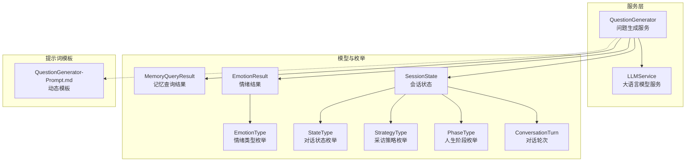
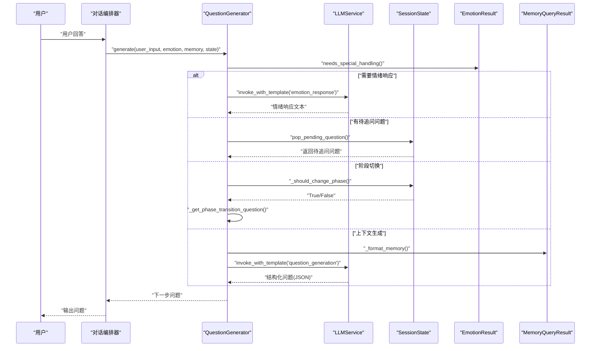
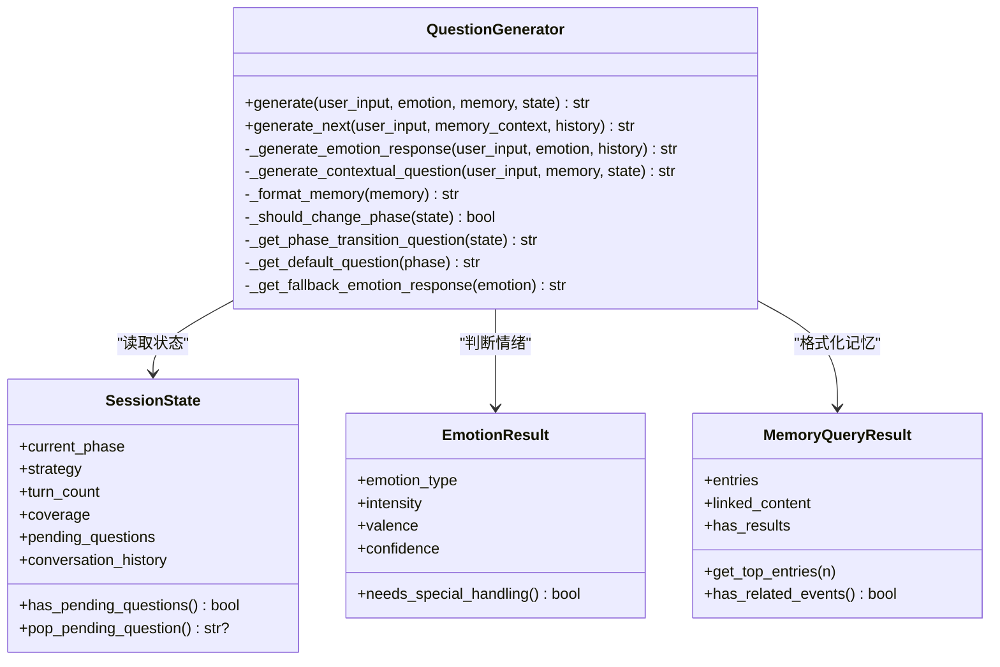
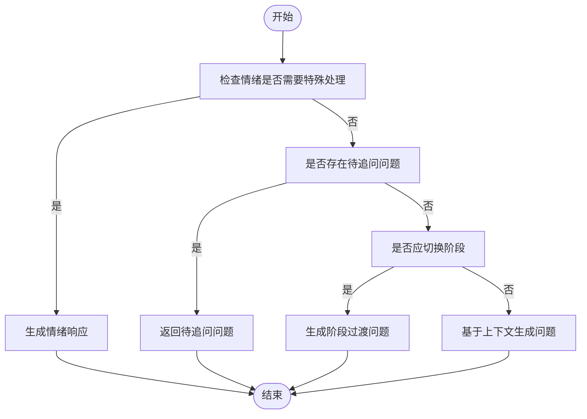
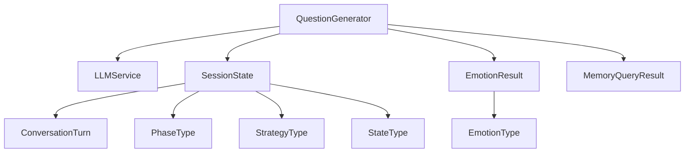

# 智能问题生成

<cite>
**本文引用的文件**
- [src/services/question_generator.py](file://src/services/question_generator.py)
- [Prompts/QuestionGenerator-Prompt.md](file://Prompts/QuestionGenerator-Prompt.md)
- [src/prompts/QuestionGenerator-Prompt.md](file://src/prompts/QuestionGenerator-Prompt.md)
- [src/models/session_state.py](file://src/models/session_state.py)
- [src/models/emotion_result.py](file://src/models/emotion_result.py)
- [src/models/memory_query_result.py](file://src/models/memory_query_result.py)
- [src/models/conversation_turn.py](file://src/models/conversation_turn.py)
- [src/enums/phase_type.py](file://src/enums/phase_type.py)
- [src/enums/emotion_type.py](file://src/enums/emotion_type.py)
- [src/enums/strategy_type.py](file://src/enums/strategy_type.py)
- [src/enums/state_type.py](file://src/enums/state_type.py)
- [test_core_services.py](file://test_core_services.py)
- [verify_core_services.py](file://verify_core_services.py)
- [问答引导层Agent-系统架构设计.md](file://问答引导层Agent-系统架构设计.md)
</cite>

## 目录
1. [简介](#简介)
2. [项目结构](#项目结构)
3. [核心组件](#核心组件)
4. [架构总览](#架构总览)
5. [详细组件分析](#详细组件分析)
6. [依赖分析](#依赖分析)
7. [性能考量](#性能考量)
8. [故障排查指南](#故障排查指南)
9. [结论](#结论)
10. [附录](#附录)

## 简介
本技术文档围绕智能问题生成模块展开，重点解析 QuestionGenerator 类的实现原理与工作机制，涵盖以下方面：
- 如何根据用户回答、情绪状态、记忆上下文与会话状态，自动生成“下一步问题”
- 不同类型问题的生成策略：开放性问题、追问性问题、确认性问题、情感性问题
- 问题生成的核心逻辑：上下文理解、关键信息提取、问题类型选择、语言优化
- 质量控制机制、多样性保证与用户体验优化策略
- 具体示例与代码实现路径，展示如何处理不同类型的用户输入

## 项目结构
智能问题生成模块位于服务层，主要由以下文件构成：
- 服务实现：src/services/question_generator.py
- Prompt 模板：Prompts/QuestionGenerator-Prompt.md 与 src/prompts/QuestionGenerator-Prompt.md
- 数据模型：会话状态、情绪结果、记忆查询结果、对话轮次
- 枚举类型：人生阶段、情绪类型、策略类型、对话状态
- 测试与验证：test_core_services.py、verify_core_services.py
- 架构设计说明：问答引导层Agent-系统架构设计.md

**图表来源**
- [src/services/question_generator.py:12-273](file://src/services/question_generator.py#L12-L273)
- [src/models/session_state.py:24-139](file://src/models/session_state.py#L24-L139)
- [src/models/emotion_result.py:6-57](file://src/models/emotion_result.py#L6-L57)
- [src/models/memory_query_result.py:23-81](file://src/models/memory_query_result.py#L23-L81)
- [src/models/conversation_turn.py:14-52](file://src/models/conversation_turn.py#L14-L52)
- [src/enums/phase_type.py:4-10](file://src/enums/phase_type.py#L4-L10)
- [src/enums/emotion_type.py:4-50](file://src/enums/emotion_type.py#L4-L50)
- [src/enums/strategy_type.py:4-8](file://src/enums/strategy_type.py#L4-L8)
- [src/enums/state_type.py:4-12](file://src/enums/state_type.py#L4-L12)
- [Prompts/QuestionGenerator-Prompt.md:1-352](file://Prompts/QuestionGenerator-Prompt.md#L1-L352)
- [src/prompts/QuestionGenerator-Prompt.md:1-352](file://src/prompts/QuestionGenerator-Prompt.md#L1-L352)

**章节来源**
- [src/services/question_generator.py:12-273](file://src/services/question_generator.py#L12-L273)
- [Prompts/QuestionGenerator-Prompt.md:1-352](file://Prompts/QuestionGenerator-Prompt.md#L1-L352)
- [src/prompts/QuestionGenerator-Prompt.md:1-352](file://src/prompts/QuestionGenerator-Prompt.md#L1-L352)
- [src/models/session_state.py:24-139](file://src/models/session_state.py#L24-L139)
- [src/models/emotion_result.py:6-57](file://src/models/emotion_result.py#L6-L57)
- [src/models/memory_query_result.py:23-81](file://src/models/memory_query_result.py#L23-L81)
- [src/models/conversation_turn.py:14-52](file://src/models/conversation_turn.py#L14-L52)
- [src/enums/phase_type.py:4-10](file://src/enums/phase_type.py#L4-L10)
- [src/enums/emotion_type.py:4-50](file://src/enums/emotion_type.py#L4-L50)
- [src/enums/strategy_type.py:4-8](file://src/enums/strategy_type.py#L4-L8)
- [src/enums/state_type.py:4-12](file://src/enums/state_type.py#L4-L12)

## 核心组件
- QuestionGenerator：问题生成服务，负责根据当前状态、情绪、记忆与会话上下文生成下一步问题；支持情绪响应、阶段过渡、默认问题与上下文生成四种路径，并具备降级策略。
- SessionState：会话状态容器，维护当前阶段、采访策略、覆盖率、对话历史、待追问问题、情绪状态等。
- EmotionResult：情绪识别结果，包含情绪类型、强度、极性、置信度与建议动作，并提供“是否需要特殊处理”的判定。
- MemoryQueryResult：记忆查询结果，封装匹配的记忆条目、链接内容与相关度排序，支持事件与人物筛选。
- ConversationTurn：单轮对话记录，包含用户输入、Agent 回复、抽取实体与事件、情绪、来源文件与元数据。
- 枚举类型：PhaseType（人生阶段）、EmotionType（情绪类型）、StrategyType（采访策略）、StateType（对话状态），统一语义与约束。

**章节来源**
- [src/services/question_generator.py:12-273](file://src/services/question_generator.py#L12-L273)
- [src/models/session_state.py:24-139](file://src/models/session_state.py#L24-L139)
- [src/models/emotion_result.py:6-57](file://src/models/emotion_result.py#L6-L57)
- [src/models/memory_query_result.py:23-81](file://src/models/memory_query_result.py#L23-L81)
- [src/models/conversation_turn.py:14-52](file://src/models/conversation_turn.py#L14-L52)
- [src/enums/phase_type.py:4-10](file://src/enums/phase_type.py#L4-L10)
- [src/enums/emotion_type.py:4-50](file://src/enums/emotion_type.py#L4-L50)
- [src/enums/strategy_type.py:4-8](file://src/enums/strategy_type.py#L4-L8)
- [src/enums/state_type.py:4-12](file://src/enums/state_type.py#L4-L12)

## 架构总览
问题生成的整体流程如下：
- 输入：用户回答、情绪结果、记忆查询结果、会话状态、可选对话历史
- 决策链：优先处理情绪响应 → 检查待追问问题 → 判断阶段切换 → 基于上下文生成问题
- 输出：下一步问题文本（字符串）

**图表来源**
- [src/services/question_generator.py:38-140](file://src/services/question_generator.py#L38-L140)
- [src/models/session_state.py:107-118](file://src/models/session_state.py#L107-L118)
- [src/models/emotion_result.py:29-46](file://src/models/emotion_result.py#L29-L46)
- [Prompts/QuestionGenerator-Prompt.md:12-89](file://Prompts/QuestionGenerator-Prompt.md#L12-L89)

**章节来源**
- [src/services/question_generator.py:38-140](file://src/services/question_generator.py#L38-L140)
- [Prompts/QuestionGenerator-Prompt.md:12-89](file://Prompts/QuestionGenerator-Prompt.md#L12-L89)

## 详细组件分析

### QuestionGenerator 类分析
- 职责与入口
  - generate：主入口，执行优先级决策链，返回下一步问题
  - generate_next：InterviewAgent 专用接口，直接基于用户回答与记忆上下文生成问题
- 决策链与策略
  - 情绪响应优先：当情绪需要特殊处理时，调用 LLM 的 emotion_response 模板生成共情话术
  - 待追问问题：若存在挂起问题，优先弹出并返回
  - 阶段切换：当前阶段覆盖率≥0.8 且存在后续阶段时，生成自然过渡问题
  - 上下文生成：将记忆上下文格式化后，调用 LLM 的 question_generation 模板生成结构化问题
- 降级策略
  - 情绪响应失败：回退到预设情绪响应
  - 问题生成失败：回退到默认问题
- 辅助方法
  - _format_memory：格式化记忆查询结果，限制条目数量与长度
  - _should_change_phase/_get_phase_transition_question：阶段推进逻辑
  - _get_default_question：按阶段返回默认问题
  - _generate_contextual_question/_generate_emotion_response：两类核心生成路径

**图表来源**
- [src/services/question_generator.py:12-273](file://src/services/question_generator.py#L12-L273)
- [src/models/session_state.py:24-139](file://src/models/session_state.py#L24-L139)
- [src/models/emotion_result.py:6-57](file://src/models/emotion_result.py#L6-L57)
- [src/models/memory_query_result.py:23-81](file://src/models/memory_query_result.py#L23-L81)

**章节来源**
- [src/services/question_generator.py:12-273](file://src/services/question_generator.py#L12-L273)

### 问题生成的核心逻辑
- 上下文理解
  - 用户回答：作为生成问题的起点，体现用户当前关注点与情绪倾向
  - 记忆上下文：通过 MemoryQueryResult 提供相关事件与人物线索，增强问题的相关性与连贯性
  - 会话状态：包含当前阶段、采访策略、覆盖率、对话历史与待追问问题，决定问题类型与风格
- 关键信息提取
  - 从 MemoryQueryResult 中提取高相关度条目与链接内容，形成“相关记忆”与“关联内容”
  - 从 SessionState 中提取最近对话摘要，帮助模型维持对话连贯性
- 问题类型选择
  - 情绪响应：当情绪需要特殊处理时，生成共情话术，避免继续提问
  - 追问性问题：针对用户已提及的事件或人物进行具体化、情感化、关联化追问
  - 开放性问题：在新阶段或新话题开始时，引导用户自由回忆
  - 确认性问题：用于验证信息准确性与完整性
  - 阶段过渡问题：在当前阶段覆盖率较高时，自然引导至下一阶段
- 语言优化
  - 采用温和、尊重的语气，避免生硬表达
  - 控制问题深度，避免让用户感到疲惫
  - 一次只问一个主题，确保聚焦

**图表来源**
- [src/services/question_generator.py:58-74](file://src/services/question_generator.py#L58-L74)
- [src/models/emotion_result.py:29-46](file://src/models/emotion_result.py#L29-L46)
- [src/models/session_state.py:107-118](file://src/models/session_state.py#L107-L118)

**章节来源**
- [src/services/question_generator.py:58-140](file://src/services/question_generator.py#L58-L140)
- [src/models/emotion_result.py:29-46](file://src/models/emotion_result.py#L29-L46)
- [src/models/session_state.py:107-118](file://src/models/session_state.py#L107-L118)

### 不同类型问题的生成策略
- 开放性问题
  - 触发条件：新阶段开始、无明确记忆线索、或需要引导用户自由回忆
  - 生成要点：温和引入主题，鼓励用户分享整体感受与经历
  - 示例路径：[默认问题生成:196-205](file://src/services/question_generator.py#L196-L205)
- 追问性问题
  - 触发条件：用户已提及具体事件或人物，需进一步具体化、情感化、关联化
  - 生成要点：针对用户回答中的关键信息进行深入挖掘，避免重复已知信息
  - 示例路径：[上下文生成与结构化输出:12-89](file://src/prompts/QuestionGenerator-Prompt.md#L12-L89)
- 确认性问题
  - 触发条件：需要验证信息准确性与完整性，避免误导
  - 生成要点：以温和方式确认关键事实，允许用户补充细节
  - 示例路径：[上下文生成与期望信息字段:70-81](file://src/prompts/QuestionGenerator-Prompt.md#L70-L81)
- 情感性问题
  - 触发条件：用户情绪需要特殊处理（高负向强度或疲劳、抗拒、困惑等）
  - 生成要点：共情、安抚、适度放缓节奏，必要时暂停
  - 示例路径：[情绪响应模板与降级策略:75-107](file://src/services/question_generator.py#L75-L107)

**章节来源**
- [src/services/question_generator.py:75-107](file://src/services/question_generator.py#L75-L107)
- [src/prompts/QuestionGenerator-Prompt.md:49-89](file://src/prompts/QuestionGenerator-Prompt.md#L49-L89)
- [src/models/emotion_result.py:29-46](file://src/models/emotion_result.py#L29-L46)

### 问题生成示例与代码实现
- 示例一：用户回答涉及具体事件，触发追问性问题
  - 输入：用户回答包含具体事件片段
  - 处理：上下文生成，结构化输出包含问题类型与预期信息
  - 输出：追问性问题，引导用户完整叙述事件
  - 示例路径：[示例输入与输出:306-351](file://src/prompts/QuestionGenerator-Prompt.md#L306-L351)
- 示例二：用户情绪需要特殊处理，触发情感性问题
  - 输入：高负向强度+低正向极性
  - 处理：生成情绪响应，必要时回退到预设响应
  - 输出：共情话术，缓解用户不适
  - 示例路径：[情绪响应生成与降级:75-107](file://src/services/question_generator.py#L75-L107)
- 示例三：阶段覆盖率达标，触发阶段过渡问题
  - 输入：当前阶段覆盖率≥0.8
  - 处理：计算下一阶段并生成自然过渡问题
  - 输出：引导用户进入下一阶段
  - 示例路径：[阶段切换判断与过渡问题:152-194](file://src/services/question_generator.py#L152-L194)

**章节来源**
- [src/prompts/QuestionGenerator-Prompt.md:306-351](file://src/prompts/QuestionGenerator-Prompt.md#L306-L351)
- [src/services/question_generator.py:75-107](file://src/services/question_generator.py#L75-L107)
- [src/services/question_generator.py:152-194](file://src/services/question_generator.py#L152-L194)

### 质量控制机制、多样性保证与用户体验优化
- 质量控制
  - 结构化输出：通过 JSON 输出格式约束，确保问题类型、推理与期望信息字段清晰
  - 降级策略：LLM 调用失败时回退到默认问题或预设情绪响应，保障稳定性
  - 温度与令牌限制：模板注册中设置温度与最大令牌数，平衡创造性与可控性
- 多样性保证
  - 多种问题类型：开放性、追问性、确认性、情感性与阶段过渡，覆盖不同对话场景
  - 记忆上下文驱动：结合记忆与对话历史，避免重复与机械
- 用户体验优化
  - 温和语气与自然表达：避免生硬指令，采用“您还记得…”等自然句式
  - 控制问题深度：根据情绪与阶段推进节奏，避免用户疲劳
  - 对话连贯性：最近对话摘要帮助模型维持一致性

**章节来源**
- [Prompts/QuestionGenerator-Prompt.md:70-89](file://Prompts/QuestionGenerator-Prompt.md#L70-L89)
- [src/prompts/QuestionGenerator-Prompt.md:245-256](file://src/prompts/QuestionGenerator-Prompt.md#L245-L256)
- [src/services/question_generator.py:135-139](file://src/services/question_generator.py#L135-L139)
- [src/services/question_generator.py:99-107](file://src/services/question_generator.py#L99-L107)

## 依赖分析
- 组件耦合与内聚
  - QuestionGenerator 与 SessionState、EmotionResult、MemoryQueryResult 强耦合，共同决定问题类型与风格
  - 与 LLMService 解耦，通过模板调用实现可替换性
- 直接与间接依赖
  - 直接依赖：LLMService、SessionState、EmotionResult、MemoryQueryResult
  - 间接依赖：对话轮次、枚举类型（阶段、情绪、策略、状态）
- 外部集成点
  - Prompt 模板注册与结构化输出定义，确保生成质量与一致性

**图表来源**
- [src/services/question_generator.py:5-7](file://src/services/question_generator.py#L5-L7)
- [src/models/session_state.py:24-139](file://src/models/session_state.py#L24-L139)
- [src/models/emotion_result.py:6-57](file://src/models/emotion_result.py#L6-L57)
- [src/models/memory_query_result.py:23-81](file://src/models/memory_query_result.py#L23-L81)
- [src/models/conversation_turn.py:14-52](file://src/models/conversation_turn.py#L14-L52)
- [src/enums/phase_type.py:4-10](file://src/enums/phase_type.py#L4-L10)
- [src/enums/emotion_type.py:4-50](file://src/enums/emotion_type.py#L4-L50)
- [src/enums/strategy_type.py:4-8](file://src/enums/strategy_type.py#L4-L8)
- [src/enums/state_type.py:4-12](file://src/enums/state_type.py#L4-L12)

**章节来源**
- [src/services/question_generator.py:5-7](file://src/services/question_generator.py#L5-L7)
- [src/models/session_state.py:24-139](file://src/models/session_state.py#L24-L139)
- [src/models/emotion_result.py:6-57](file://src/models/emotion_result.py#L6-L57)
- [src/models/memory_query_result.py:23-81](file://src/models/memory_query_result.py#L23-L81)
- [src/models/conversation_turn.py:14-52](file://src/models/conversation_turn.py#L14-L52)
- [src/enums/phase_type.py:4-10](file://src/enums/phase_type.py#L4-L10)
- [src/enums/emotion_type.py:4-50](file://src/enums/emotion_type.py#L4-L50)
- [src/enums/strategy_type.py:4-8](file://src/enums/strategy_type.py#L4-L8)
- [src/enums/state_type.py:4-12](file://src/enums/state_type.py#L4-L12)

## 性能考量
- LLM 调用成本
  - 通过模板注册与结构化输出减少重复提示词开销
  - 降级策略降低失败率，提升端到端吞吐
- 记忆上下文大小
  - 限制格式化记忆条目数量与长度，避免上下文过长导致性能下降
- 决策链短路
  - 情绪响应与待追问问题优先，快速返回，减少不必要的 LLM 调用

## 故障排查指南
- 常见问题
  - LLM 调用失败：检查模板注册与输出格式，确认降级策略是否生效
  - 情绪响应异常：验证 EmotionResult 的强度与极性阈值，确保 needs_special_handling 判定正确
  - 阶段切换无效：检查 SessionState 的覆盖率与阶段顺序，确认阈值与阶段枚举一致
- 定位方法
  - 使用测试用例验证 generate 与辅助方法行为
  - 查看对话历史摘要与记忆上下文格式化结果
- 相关实现路径
  - [问题生成主流程:38-74](file://src/services/question_generator.py#L38-L74)
  - [情绪响应与降级:75-107](file://src/services/question_generator.py#L75-L107)
  - [阶段切换与过渡问题:152-194](file://src/services/question_generator.py#L152-L194)
  - [默认问题与上下文生成:196-140](file://src/services/question_generator.py#L196-L140)
  - [测试用例与验证:102-141](file://test_core_services.py#L102-L141)
  - [结构验证:76-120](file://verify_core_services.py#L76-L120)

**章节来源**
- [src/services/question_generator.py:38-140](file://src/services/question_generator.py#L38-L140)
- [test_core_services.py:102-141](file://test_core_services.py#L102-L141)
- [verify_core_services.py:76-120](file://verify_core_services.py#L76-L120)

## 结论
智能问题生成模块通过“优先级决策链+上下文驱动+结构化输出+降级策略”的设计，在保证对话连贯性与用户体验的同时，实现了对不同类型问题的自适应生成。其核心在于：
- 将情绪、记忆与会话状态转化为可操作的生成约束
- 以阶段推进与追问技巧为核心策略，兼顾广度与深度
- 通过模板与降级机制确保质量与稳定性

## 附录
- 架构设计参考：问答引导层Agent-系统架构设计.md
- Prompt 模板与结构化输出定义：Prompts/QuestionGenerator-Prompt.md 与 src/prompts/QuestionGenerator-Prompt.md
- 测试与验证：test_core_services.py、verify_core_services.py