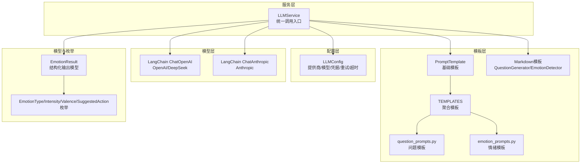
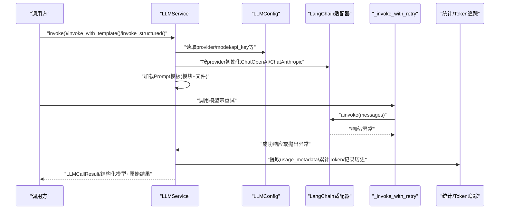
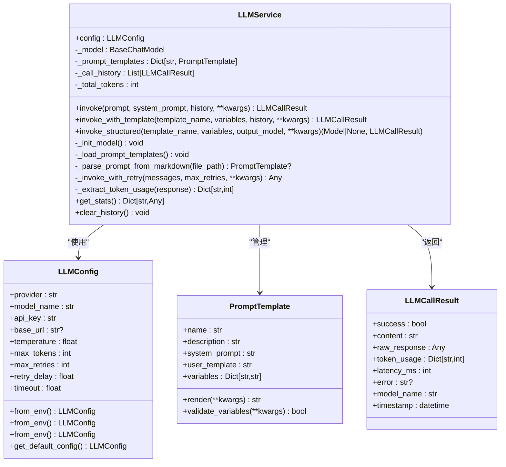
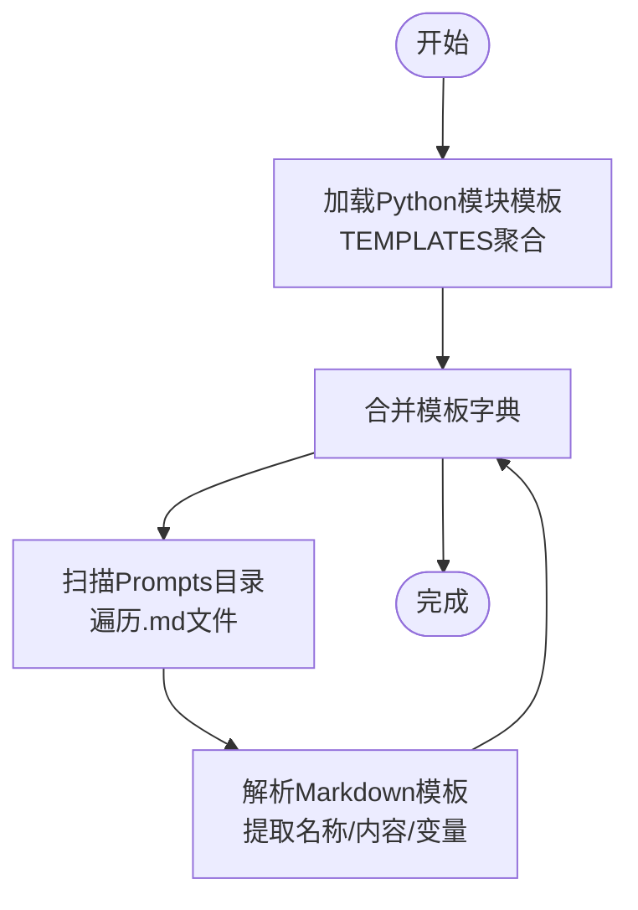
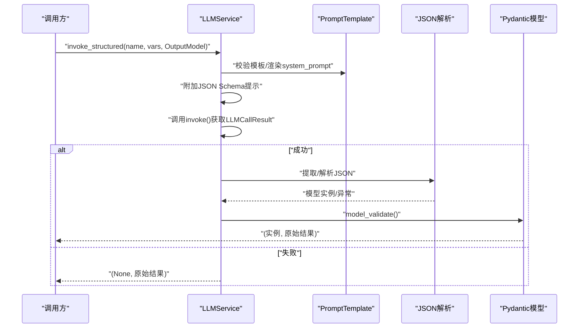
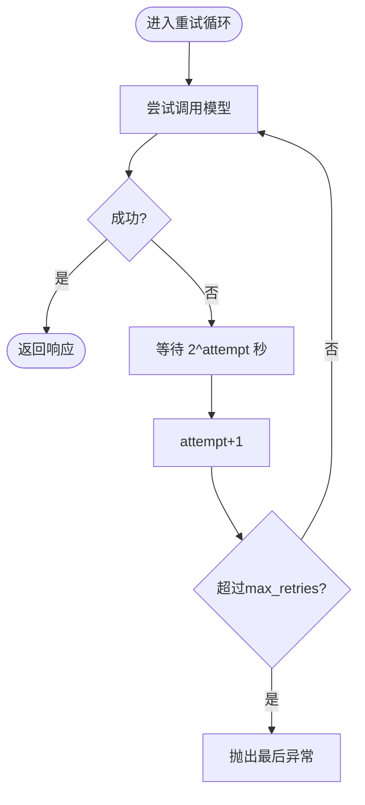
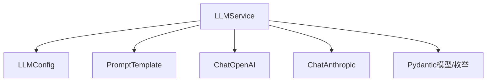

# LLM服务核心

<cite>
**本文引用的文件**
- [src/services/llm_service.py](file://src/services/llm_service.py)
- [src/config/llm_config.py](file://src/config/llm_config.py)
- [src/prompts/base.py](file://src/prompts/base.py)
- [src/prompts/__init__.py](file://src/prompts/__init__.py)
- [src/prompts/question_prompts.py](file://src/prompts/question_prompts.py)
- [src/prompts/emotion_prompts.py](file://src/prompts/emotion_prompts.py)
- [src/prompts/QuestionGenerator-Prompt.md](file://src/prompts/QuestionGenerator-Prompt.md)
- [src/prompts/EmotionDetector-Prompt.md](file://src/prompts/EmotionDetector-Prompt.md)
- [src/models/emotion_result.py](file://src/models/emotion_result.py)
- [src/enums/emotion_type.py](file://src/enums/emotion_type.py)
- [src/enums/strategy_type.py](file://src/enums/strategy_type.py)
- [tests/test_llm_service.py](file://tests/test_llm_service.py)
- [verify_llm_service.py](file://verify_llm_service.py)
- [README.md](file://README.md)
</cite>

## 目录
1. [简介](#简介)
2. [项目结构](#项目结构)
3. [核心组件](#核心组件)
4. [架构总览](#架构总览)
5. [详细组件分析](#详细组件分析)
6. [依赖分析](#依赖分析)
7. [性能考量](#性能考量)
8. [故障排查指南](#故障排查指南)
9. [结论](#结论)
10. [附录](#附录)

## 简介
本文件面向LLM服务核心，系统性阐述LLMService类的设计架构与实现原理，覆盖统一的大模型调用接口、多提供商支持机制（OpenAI、DeepSeek、Anthropic）、模型初始化流程；详解三种调用模式：基础调用invoke()、模板调用invoke_with_template()、结构化输出invoke_structured()；说明错误处理与重试机制（指数退避策略与异常传播）；解释Prompt模板管理系统（从Python模块与Markdown文件加载模板）；并提供LLM调用统计、Token使用量跟踪与性能监控的实现细节与最佳实践。

## 项目结构
本项目围绕“服务-配置-模板-模型-枚举”分层组织，LLM服务位于服务层，通过配置层注入模型提供商与参数，通过模板层统一管理Prompt，通过模型层对接不同大模型SDK，通过枚举与模型层保证结构化输出的强类型约束。

图表来源
- [src/services/llm_service.py:32-481](file://src/services/llm_service.py#L32-L481)
- [src/config/llm_config.py:10-120](file://src/config/llm_config.py#L10-L120)
- [src/prompts/base.py:6-33](file://src/prompts/base.py#L6-L33)
- [src/prompts/__init__.py:1-12](file://src/prompts/__init__.py#L1-L12)
- [src/prompts/question_prompts.py:1-86](file://src/prompts/question_prompts.py#L1-L86)
- [src/prompts/emotion_prompts.py:1-38](file://src/prompts/emotion_prompts.py#L1-L38)
- [src/prompts/QuestionGenerator-Prompt.md:1-352](file://src/prompts/QuestionGenerator-Prompt.md#L1-L352)
- [src/prompts/EmotionDetector-Prompt.md:1-259](file://src/prompts/EmotionDetector-Prompt.md#L1-L259)
- [src/models/emotion_result.py:6-57](file://src/models/emotion_result.py#L6-L57)
- [src/enums/emotion_type.py:4-50](file://src/enums/emotion_type.py#L4-L50)

章节来源
- [README.md:92-200](file://README.md#L92-L200)
- [src/services/llm_service.py:32-89](file://src/services/llm_service.py#L32-L89)

## 核心组件
- LLMService：统一的LLM调用入口，封装LangChain调用逻辑，提供模板管理、错误处理与重试、调用统计与Token追踪。
- LLMConfig：集中管理模型提供商、模型名称、API密钥、基础URL、温度、最大Token、重试次数与延迟、超时等配置。
- PromptTemplate：模板基类，支持变量渲染与完整性校验。
- TEMPLATES：聚合Python模块中的Prompt模板，并与Markdown文件模板合并加载。
- EmotionResult与相关枚举：结构化输出模型与类型约束，保障invoke_structured()的强类型一致性。

章节来源
- [src/services/llm_service.py:20-89](file://src/services/llm_service.py#L20-L89)
- [src/config/llm_config.py:10-120](file://src/config/llm_config.py#L10-L120)
- [src/prompts/base.py:6-33](file://src/prompts/base.py#L6-L33)
- [src/prompts/__init__.py:1-12](file://src/prompts/__init__.py#L1-L12)
- [src/models/emotion_result.py:6-57](file://src/models/emotion_result.py#L6-L57)
- [src/enums/emotion_type.py:4-50](file://src/enums/emotion_type.py#L4-L50)

## 架构总览
LLMService在初始化时读取LLMConfig，按提供商选择对应的LangChain适配器（OpenAI/DeepSeek或Anthropic），随后加载Prompt模板（Python模块与Markdown文件）。调用时支持基础调用、模板调用与结构化输出，内置指数退避重试与Token用量统计，最终通过LLMCallResult统一返回结果与指标。

图表来源
- [src/services/llm_service.py:71-124](file://src/services/llm_service.py#L71-L124)
- [src/services/llm_service.py:225-438](file://src/services/llm_service.py#L225-L438)
- [src/services/llm_service.py:439-461](file://src/services/llm_service.py#L439-L461)

## 详细组件分析

### LLMService类设计与实现
- 统一入口职责
  - 统一管理所有大模型调用
  - 封装LangChain调用逻辑
  - 提供Prompt模板管理
  - 统一错误处理与重试
  - 记录调用日志与统计
- 模型初始化
  - OpenAI/DeepSeek：通过ChatOpenAI适配，兼容OpenAI API格式
  - DeepSeek：通过ChatOpenAI适配，设置额外参数
  - Anthropic：按需动态导入ChatAnthropic
  - 不支持的提供商将抛出异常
- Prompt模板管理
  - Python模块模板：从src/prompts/__init__.py聚合
  - Markdown文件模板：遍历Prompts目录，解析模板名称、内容与变量
  - 合并加载，模板名冲突时后者覆盖前者
- 调用模式
  - 基础调用invoke()：支持system_prompt与历史消息拼接，统一记录结果与统计
  - 模板调用invoke_with_template()：按模板名渲染变量后复用invoke()
  - 结构化输出invoke_structured()：在模板基础上附加JSON Schema提示，解析并校验输出
- 错误处理与重试
  - _invoke_with_retry()：指数退避（2^attempt秒），最多max_retries次重试
  - 异常传播：最后一次异常抛出，便于上层捕获
- 统计与监控
  - 提取usage_metadata中的prompt/completion/total_tokens
  - 累计调用历史与总Token数
  - 提供get_stats()计算成功率、平均耗时与总Token

图表来源
- [src/services/llm_service.py:20-481](file://src/services/llm_service.py#L20-L481)
- [src/config/llm_config.py:10-120](file://src/config/llm_config.py#L10-L120)
- [src/prompts/base.py:6-33](file://src/prompts/base.py#L6-L33)

章节来源
- [src/services/llm_service.py:32-481](file://src/services/llm_service.py#L32-L481)
- [src/config/llm_config.py:10-120](file://src/config/llm_config.py#L10-L120)
- [src/prompts/base.py:6-33](file://src/prompts/base.py#L6-L33)

### Prompt模板管理系统
- Python模块模板
  - 通过src/prompts/__init__.py聚合多个模块导出的TEMPLATES字典
  - 每个模板由PromptTemplate实例构成，包含name/description/system_prompt/user_template/variables
- Markdown文件模板
  - 遍历Prompts目录，匹配.md文件
  - 解析模板名称、系统提示内容与变量表格，构造PromptTemplate
  - 支持从文件内容中提取变量说明，形成变量字典
- 模板使用
  - invoke_with_template()按模板名渲染变量后调用invoke()
  - invoke_structured()在模板基础上追加JSON Schema提示，解析并校验输出

图表来源
- [src/prompts/__init__.py:1-12](file://src/prompts/__init__.py#L1-L12)
- [src/prompts/question_prompts.py:1-86](file://src/prompts/question_prompts.py#L1-L86)
- [src/prompts/emotion_prompts.py:1-38](file://src/prompts/emotion_prompts.py#L1-L38)
- [src/services/llm_service.py:126-217](file://src/services/llm_service.py#L126-L217)

章节来源
- [src/prompts/__init__.py:1-12](file://src/prompts/__init__.py#L1-L12)
- [src/prompts/question_prompts.py:1-86](file://src/prompts/question_prompts.py#L1-L86)
- [src/prompts/emotion_prompts.py:1-38](file://src/prompts/emotion_prompts.py#L1-L38)
- [src/prompts/QuestionGenerator-Prompt.md:1-352](file://src/prompts/QuestionGenerator-Prompt.md#L1-L352)
- [src/prompts/EmotionDetector-Prompt.md:1-259](file://src/prompts/EmotionDetector-Prompt.md#L1-L259)
- [src/services/llm_service.py:126-217](file://src/services/llm_service.py#L126-L217)

### 调用模式详解
- 基础调用invoke()
  - 支持system_prompt与历史消息拼接
  - 统一记录content/raw_response/token_usage/latency_ms
  - 发生异常时返回失败结果并记录error
- 模板调用invoke_with_template()
  - 校验模板存在性
  - 渲染模板变量后复用invoke()
- 结构化输出invoke_structured()
  - 校验模板存在性
  - 渲染system_prompt后附加JSON Schema提示
  - 解析并校验输出，返回Pydantic模型实例与原始结果

图表来源
- [src/services/llm_service.py:293-398](file://src/services/llm_service.py#L293-L398)

章节来源
- [src/services/llm_service.py:225-398](file://src/services/llm_service.py#L225-L398)

### 错误处理与重试机制
- 指数退避策略
  - 等待时间：2^attempt秒，最多max_retries次
  - 每次失败记录warning日志，包含attempt/最大重试/等待秒数
- 异常传播
  - 所有重试均失败时，抛出最后一次异常
- 调用失败兜底
  - invoke()捕获异常并返回失败的LLMCallResult，包含error信息

图表来源
- [src/services/llm_service.py:400-438](file://src/services/llm_service.py#L400-L438)

章节来源
- [src/services/llm_service.py:400-438](file://src/services/llm_service.py#L400-L438)

### Token使用量跟踪与性能监控
- Token提取
  - 从响应的usage_metadata中提取input_tokens/output_tokens/total_tokens
- 统计指标
  - total_calls：调用历史长度
  - total_tokens：累计总Token
  - success_rate：成功调用占比
  - avg_latency_ms：平均耗时
- 历史清理
  - clear_history()清空历史并重置总Token

章节来源
- [src/services/llm_service.py:439-461](file://src/services/llm_service.py#L439-L461)

## 依赖分析
- LLMService依赖
  - LLMConfig：提供模型提供商、模型名称、API密钥、基础URL、温度、最大Token、重试与超时等配置
  - PromptTemplate：提供模板渲染与变量校验能力
  - LangChain适配器：ChatOpenAI（OpenAI/DeepSeek）、ChatAnthropic（Anthropic）
  - Pydantic模型：用于结构化输出的强类型约束
- 模块耦合
  - LLMService与LLMConfig弱耦合，通过配置对象注入
  - 模板系统通过聚合与文件解析解耦具体业务
  - 结构化输出通过Pydantic模型与枚举实现强约束

图表来源
- [src/services/llm_service.py:71-124](file://src/services/llm_service.py#L71-L124)
- [src/config/llm_config.py:10-120](file://src/config/llm_config.py#L10-L120)
- [src/prompts/base.py:6-33](file://src/prompts/base.py#L6-L33)
- [src/models/emotion_result.py:6-57](file://src/models/emotion_result.py#L6-L57)
- [src/enums/emotion_type.py:4-50](file://src/enums/emotion_type.py#L4-L50)

章节来源
- [src/services/llm_service.py:71-124](file://src/services/llm_service.py#L71-L124)
- [src/config/llm_config.py:10-120](file://src/config/llm_config.py#L10-L120)
- [src/prompts/base.py:6-33](file://src/prompts/base.py#L6-L33)
- [src/models/emotion_result.py:6-57](file://src/models/emotion_result.py#L6-L57)
- [src/enums/emotion_type.py:4-50](file://src/enums/emotion_type.py#L4-L50)

## 性能考量
- 指数退避重试：降低瞬时峰值压力，提高稳定性
- Token统计：便于成本控制与资源规划
- 异步调用：使用LangChain异步接口ainvoke，提升并发吞吐
- 按需加载：Anthropic适配器仅在需要时动态导入，减少启动开销
- 模板缓存：模板加载后缓存在内存字典中，避免重复IO

## 故障排查指南
- 常见问题
  - 模板不存在：invoke_with_template()会抛出ValueError，检查模板名与加载逻辑
  - 结构化输出解析失败：invoke_structured()返回None并标记原始结果失败，检查输出格式与JSON Schema
  - API调用失败：invoke()返回失败结果并记录error，检查网络、凭据与URL
  - 重试耗尽：_invoke_with_retry()抛出异常，查看日志中的attempt与等待时间
- 调试建议
  - 使用测试用例验证invoke/invoke_with_template/invoke_structured
  - 通过get_stats()观察成功率与平均耗时
  - 清理历史记录以隔离干扰

章节来源
- [tests/test_llm_service.py:1-187](file://tests/test_llm_service.py#L1-L187)
- [src/services/llm_service.py:285-291](file://src/services/llm_service.py#L285-L291)
- [src/services/llm_service.py:400-438](file://src/services/llm_service.py#L400-L438)

## 结论
LLMService通过统一的接口抽象、灵活的多提供商适配、完善的模板管理与结构化输出能力，以及稳健的错误处理与统计监控，为上层Agent与服务提供了可靠的大模型调用支撑。结合指数退避重试与Token统计，能够在复杂业务场景中平衡稳定性与可观测性。

## 附录

### 使用示例与最佳实践
- 基础调用
  - 适合一次性直连LLM的场景，注意传入system_prompt与历史消息
- 模板调用
  - 优先使用模板，确保Prompt一致性与可维护性
  - 变量渲染前进行validate_variables校验
- 结构化输出
  - 明确输出模型的JSON Schema，确保LLM遵循格式
  - 对解析失败进行降级处理（如返回默认值或提示）
- 配置与提供商
  - 优先使用DeepSeek专属配置（DEEPSEEK_URL/DEEPSEEK_APIKEY），否则回退到通用配置
  - DeepSeek配置优先级高于OpenAI通用配置
- 性能与成本
  - 合理设置temperature与max_tokens
  - 监控total_tokens与avg_latency_ms，优化Prompt与调用策略

章节来源
- [src/services/llm_service.py:49-68](file://src/services/llm_service.py#L49-L68)
- [src/config/llm_config.py:42-120](file://src/config/llm_config.py#L42-L120)
- [src/prompts/QuestionGenerator-Prompt.md:205-241](file://src/prompts/QuestionGenerator-Prompt.md#L205-L241)
- [src/prompts/EmotionDetector-Prompt.md:96-125](file://src/prompts/EmotionDetector-Prompt.md#L96-L125)