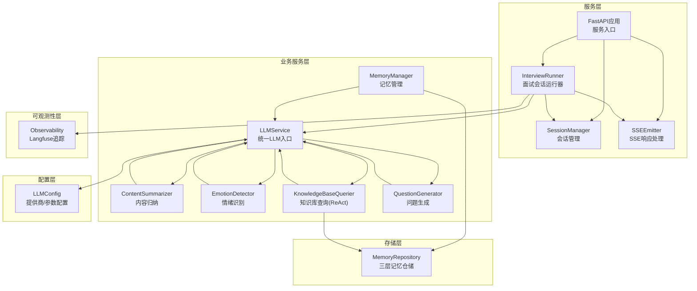
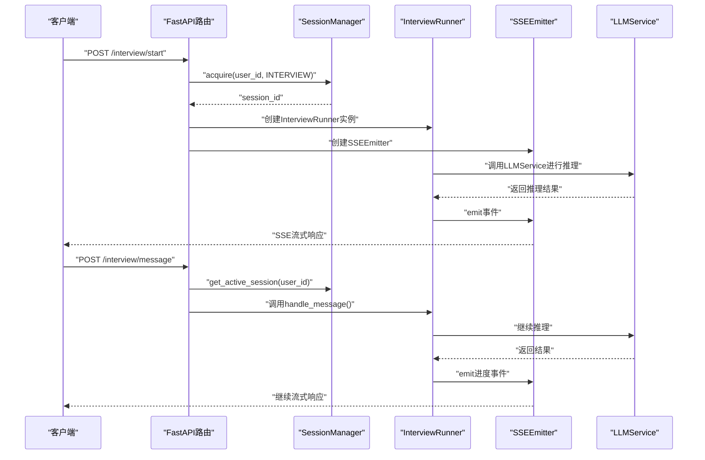
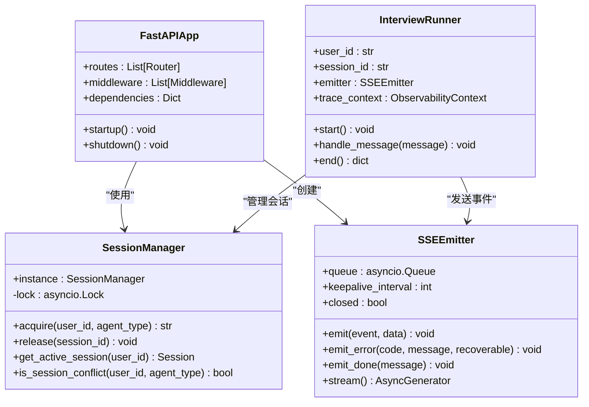
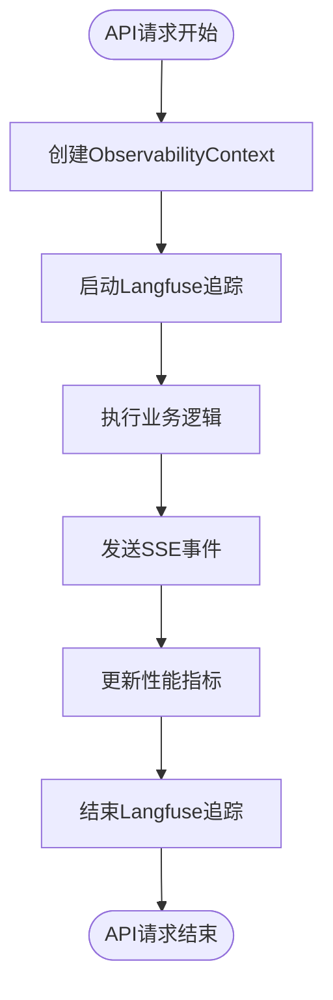

# 服务层架构

<cite>
**本文引用的文件**
- [llm_service.py](file://src/services/llm_service.py)
- [llm_config.py](file://src/config/llm_config.py)
- [content_summarizer.py](file://src/services/content_summarizer.py)
- [emotion_detector.py](file://src/services/emotion_detector.py)
- [knowledge_base_querier.py](file://src/services/knowledge_base_querier.py)
- [memory_manager.py](file://src/services/memory_manager.py)
- [question_generator.py](file://src/services/question_generator.py)
- [base.py](file://src/prompts/base.py)
- [memory_repository.py](file://src/storage/memory_repository.py)
- [app.py](file://src/service/app.py)
- [session_manager.py](file://src/service/session_manager.py)
- [sse_response.py](file://src/service/sse_response.py)
- [interview_runner.py](file://src/service/agent_runners/interview_runner.py)
- [interview.py](file://src/service/routes/interview.py)
- [observability.py](file://src/services/observability.py)
- [test_llm_service.py](file://tests/test_llm_service.py)
- [test_memory_manager.py](file://tests/test_memory_manager.py)
- [test_sse_response.py](file://tests/test_service/test_sse_response.py)
- [README.md](file://README.md)
</cite>

## 更新摘要
**所做更改**
- 新增完整的FastAPI服务层架构，包括API路由、会话管理和SSE响应处理
- 新增InterviewRunner面试会话运行器，支持交互式会话管理
- 新增Observability可观测性系统，集成Langfuse追踪和请求范围追踪
- 更新服务架构图，反映新的API层和运行器层结构
- 新增SSE事件格式化和流式传输机制
- 新增会话状态管理和并发控制机制

## 目录
1. [简介](#简介)
2. [项目结构](#项目结构)
3. [核心组件](#核心组件)
4. [架构总览](#架构总览)
5. [详细组件分析](#详细组件分析)
6. [依赖关系分析](#依赖关系分析)
7. [性能考量](#性能考量)
8. [故障排查指南](#故障排查指南)
9. [结论](#结论)
10. [附录](#附录)

## 简介
本技术文档聚焦"服务层架构"，围绕统一的LLM服务抽象（LLMService）展开，系统阐释其多提供商支持、请求路由与响应处理机制；详解服务配置管理（LLM参数、连接池与重试）、核心服务组件（内容归纳、情绪识别、知识查询、记忆管理）的实现原理；梳理服务间依赖与调用链路（含错误传播、异常处理与降级策略）；并提供扩展与定制指南（新增服务、接口设计、集成测试方法），以及监控、性能优化与故障排除的实践建议。

**更新** 新增完整的FastAPI服务层架构，包括InterviewRunner、SSE响应处理、会话管理等核心服务组件，以及Observability可观测性系统，集成Langfuse追踪提供请求范围追踪和详细性能指标。

## 项目结构
服务层位于 src/service 目录，包含FastAPI应用入口、会话管理、SSE响应处理和各类运行器。核心服务位于 src/services 目录，围绕 LLMService 统一入口，向下对接各业务服务（内容归纳、情绪识别、知识查询、记忆管理、问题生成），向上为控制器与Agent层提供一致的LLM调用能力。配置层位于 src/config，负责LLM提供商与参数的集中管理。存储层位于 src/storage，提供三层记忆（短期、长期、画像）的统一仓储与缓存。



**图表来源**
- [app.py](file://src/service/app.py)
- [session_manager.py](file://src/service/session_manager.py)
- [sse_response.py](file://src/service/sse_response.py)
- [interview_runner.py](file://src/service/agent_runners/interview_runner.py)
- [llm_service.py](file://src/services/llm_service.py)

**章节来源**
- [README.md](file://README.md)

## 核心组件
- FastAPI应用：提供RESTful API接口，支持JSON请求和SSE流式响应
- SessionManager：统一管理会话状态，支持并发控制和会话生命周期管理
- SSEEmitter：标准化SSE事件发射器，支持心跳保活和错误事件处理
- InterviewRunner：面试会话运行器，封装InterviewSessionAgent的SSE流式执行
- Observability：Langfuse集成的可观测性系统，提供请求范围追踪和性能指标
- LLMService：统一LLM调用入口，封装LangChain模型初始化、Prompt模板加载、结构化输出解析、重试与统计
- LLMConfig：集中管理提供商、模型、API Key、基础URL、温度、最大Token、重试与超时等配置
- ContentSummarizer：异步内容归纳，提取事件、人物、主题，指导记忆更新
- EmotionDetector：情绪识别与策略建议，支持降级策略
- KnowledgeBaseQuerier：ReAct模式的知识库查询，结合工具链与最终答案解析
- MemoryManager：三层记忆的组织与存储，协调LLM整理与仓储持久化
- QuestionGenerator：问题生成与情绪响应，支持阶段切换与降级
- MemoryRepository：短期/长期/画像三层记忆的统一仓储与LRU缓存

**章节来源**
- [app.py](file://src/service/app.py)
- [session_manager.py](file://src/service/session_manager.py)
- [sse_response.py](file://src/service/sse_response.py)
- [interview_runner.py](file://src/service/agent_runners/interview_runner.py)
- [observability.py](file://src/services/observability.py)
- [llm_service.py](file://src/services/llm_service.py)

## 架构总览
服务层以FastAPI应用为核心，向下提供会话管理、SSE响应处理和运行器层，向上对接LLMService统一入口，形成完整的API服务架构。配置层通过LLMConfig集中管理多提供商参数；存储层通过MemoryRepository提供三层记忆的统一访问与缓存。Observability系统贯穿整个服务层，提供请求范围追踪和性能监控。



**图表来源**
- [interview.py](file://src/service/routes/interview.py)
- [session_manager.py](file://src/service/session_manager.py)
- [interview_runner.py](file://src/service/agent_runners/interview_runner.py)
- [sse_response.py](file://src/service/sse_response.py)

## 详细组件分析

### FastAPI服务层架构
- API路由：提供RESTful接口，支持JSON请求和SSE流式响应
- 会话管理：统一管理会话状态，支持并发控制和会话生命周期管理
- SSE响应：标准化事件格式，支持心跳保活和错误处理
- 运行器模式：InterviewRunner封装Agent执行逻辑，支持交互式会话



**图表来源**
- [app.py](file://src/service/app.py)
- [session_manager.py](file://src/service/session_manager.py)
- [sse_response.py](file://src/service/sse_response.py)
- [interview_runner.py](file://src/service/agent_runners/interview_runner.py)

**章节来源**
- [app.py](file://src/service/app.py)
- [session_manager.py](file://src/service/session_manager.py)
- [sse_response.py](file://src/service/sse_response.py)
- [interview_runner.py](file://src/service/agent_runners/interview_runner.py)

### 会话管理机制
- 并发控制：使用asyncio.Lock确保会话状态修改的原子性
- 会话生命周期：acquire/release模式管理会话分配和回收
- 冲突检测：防止同一用户同时运行多个Agent实例
- 状态维护：跟踪活跃会话和会话状态变化

**章节来源**
- [session_manager.py](file://src/service/session_manager.py)

### SSE响应处理机制
- 事件格式：标准化的SSE事件格式，支持多种事件类型
- 心跳保活：定期发送keepalive事件维持连接
- 错误处理：统一的错误事件格式，支持可恢复和不可恢复错误
- 数据序列化：自动注入timestamp，支持中文内容和复杂数据结构

**章节来源**
- [sse_response.py](file://src/service/sse_response.py)
- [test_sse_response.py](file://tests/test_service/test_sse_response.py)

### InterviewRunner运行器
- 交互式会话：InterviewRunner封装InterviewSessionAgent的执行逻辑
- 事件驱动：通过SSEEmitter发送实时事件和进度信息
- 上下文追踪：集成ObservabilityContext提供请求范围追踪
- 生命周期管理：自动管理会话状态和资源清理

**章节来源**
- [interview_runner.py](file://src/service/agent_runners/interview_runner.py)

### Observability可观测性系统
- Langfuse集成：无缝集成Langfuse追踪系统
- 请求范围追踪：提供跨组件的请求范围追踪
- 性能指标：收集详细的性能指标和使用统计
- 上下文管理：通过ContextVar管理请求上下文



**图表来源**
- [observability.py](file://src/services/observability.py)

**章节来源**
- [observability.py](file://src/services/observability.py)

### LLMService统一接口设计
- 多提供商支持：通过provider字段选择OpenAI/DeepSeek/Anthropic，兼容OpenAI风格API与特定提供商参数（如DeepSeek的thinking开关）
- 请求路由与消息构造：支持system_prompt、历史消息、当前用户输入的组合；统一消息类型（Human/System/AI）
- 响应处理：提取usage_metadata（prompt/completion/total tokens），记录延迟与统计；提供结构化输出解析（JSON提取与Pydantic校验）
- Prompt模板管理：从Python模块与Markdown文件动态加载模板，支持变量说明与渲染校验
- 重试与降级：指数退避重试，失败时返回错误结果；调用统计便于监控与告警

**章节来源**
- [llm_service.py](file://src/services/llm_service.py)
- [llm_config.py](file://src/config/llm_config.py)
- [base.py](file://src/prompts/base.py)

### 服务配置管理
- 环境变量优先：优先使用DeepSeek专属配置（DEEPSEEK_URL/DEEPSEEK_APIKEY），其次DeepSeek专属配置（DEEPSEEK_URL/DEEPSEEK_APIKEY），最后回退到通用配置
- 默认配置：优先尝试DeepSeek，失败回退DeepSeek
- 重试与超时：max_retries、retry_delay、timeout统一管理，便于在不同提供商间保持一致的调用体验

**章节来源**
- [llm_config.py](file://src/config/llm_config.py)

### 内容归纳服务（ContentSummarizer）
- 职责：异步归纳对话内容，提取事件、人物、主题，构建记忆更新计划，并可直接应用到MemoryManager
- 调用链：LLMService.invoke_structured（content_extraction模板）→ 构造SummaryContent → 可选应用到MemoryManager
- 降级：当结构化输出失败时返回None，不影响主流程

**章节来源**
- [content_summarizer.py](file://src/services/content_summarizer.py)

### 情绪识别服务（EmotionDetector）
- 职责：识别用户输入的情绪状态，提供响应策略建议；若LLM失败，使用默认中性策略降级
- 调用链：LLMService.invoke_structured（emotion_detection模板）→ EmotionResult → 策略映射
- 策略：根据情绪类型与强度映射到暂停/安慰/继续等动作与语调

**章节来源**
- [emotion_detector.py](file://src/services/emotion_detector.py)

### 知识库查询服务（KnowledgeBaseQuerier）
- 职责：ReAct模式的智能查询，通过工具链（list_files/read_file/follow_links/mark_suspected_file/get_exploration_report/has_visited）动态探索知识库
- Agent构建：基于LLMService提供的模型与Prompt模板（knowledge_base_react）构建Agent图
- 最终答案解析：支持标准JSON与自然语言降级解析，生成MemoryQueryResult
- 路径安全：工具路径解析与访问记录，限制在目标路径范围内

**章节来源**
- [knowledge_base_querier.py](file://src/services/knowledge_base_querier.py)

### 记忆管理服务（MemoryManager）
- 职责：三层记忆的统一管理，协调LLM整理与仓储持久化；提供短期/长期/画像记忆的读写接口
- 核心流程：organize_and_save → LLMService.invoke_structured(memory_organization) → 并行保存事件/人物 → 更新画像与时间线
- 并发优化：使用asyncio.gather并行保存，降低I/O等待
- 兼容接口：提供update_long_term与apply_summary等兼容方法，平滑迁移

**章节来源**
- [memory_manager.py](file://src/services/memory_manager.py)

### 问题生成服务（QuestionGenerator）
- 职责：根据当前状态生成下一个问题，优先处理情绪响应，其次待追问问题，再次阶段切换，最后基于上下文生成
- 调用链：LLMService.invoke_with_template（question_generation/emotion_response）→ 降级策略（预设响应/默认问题）
- 阶段切换：依据覆盖率阈值与阶段顺序判断是否切换

**章节来源**
- [question_generator.py](file://src/services/question_generator.py)

### Prompt模板与加载机制
- PromptTemplate：统一的模板结构（name/description/system_prompt/user_template/variables），支持渲染与变量校验
- LLMService模板加载：从Python模块与Markdown文件动态加载，支持变量表格解析与模板注册

**章节来源**
- [base.py](file://src/prompts/base.py)
- [llm_service.py](file://src/services/llm_service.py)

## 依赖关系分析
- 低耦合高内聚：各服务通过LLMService统一入口调用，减少对具体提供商的直接依赖
- 明确边界：FastAPI应用层、会话管理层、SSE处理层、运行器层、业务服务层各司其职
- 可替换性：LLMService可替换提供商与模型，配置层集中管理，便于灰度与A/B测试
- 观测性：Observability系统贯穿所有层，提供统一的追踪和监控能力

```mermaid
graph TB
subgraph "API层"
API["FastAPI应用"] --> ROUTES["路由层"]
ROUTES --> INTROUTER["Interview路由"]
END
subgraph "运行器层"
INTROUTER --> IR["InterviewRunner"]
IR --> SM["SessionManager"]
IR --> SSE["SSEEmitter"]
IR --> OBS["Observability"]
END
subgraph "业务服务层"
IR --> LLM["LLMService"]
LLM --> CS["ContentSummarizer"]
LLM --> ED["EmotionDetector"]
LLM --> KBQ["KnowledgeBaseQuerier"]
LLM --> QG["QuestionGenerator"]
MM["MemoryManager"] --> MR["MemoryRepository"]
KBQ --> MR
CS --> MM
ED --> LLM
QG --> LLM
LLM --> CFG["LLMConfig"]
END
```

**图表来源**
- [app.py](file://src/service/app.py)
- [interview.py](file://src/service/routes/interview.py)
- [interview_runner.py](file://src/service/agent_runners/interview_runner.py)
- [session_manager.py](file://src/service/session_manager.py)
- [sse_response.py](file://src/service/sse_response.py)
- [observability.py](file://src/services/observability.py)

**章节来源**
- [app.py](file://src/service/app.py)
- [session_manager.py](file://src/service/session_manager.py)
- [sse_response.py](file://src/service/sse_response.py)
- [interview_runner.py](file://src/service/agent_runners/interview_runner.py)
- [llm_service.py](file://src/services/llm_service.py)

## 性能考量
- 并发与批量：MemoryManager在保存事件/人物时使用asyncio.gather并行执行，显著降低I/O等待
- 缓存：MemoryRepository内置LRM缓存，减少重复读取；短期记忆容量可控，避免内存膨胀
- 重试与退避：LLMService指数退避重试，降低瞬时抖动对用户体验的影响
- Token与延迟统计：LLMService记录usage与延迟，便于监控与成本控制
- I/O优化：KnowledgeBaseQuerier优先一次性列出全量目录，减少多次往返；优先完整阅读文档，提高相关性
- SSE优化：SSEEmitter使用asyncio.Queue实现高效的事件队列，支持心跳保活减少连接中断
- 会话管理：SessionManager使用asyncio.Lock确保并发安全，避免竞态条件

**章节来源**
- [memory_manager.py](file://src/services/memory_manager.py)
- [memory_repository.py](file://src/storage/memory_repository.py)
- [llm_service.py](file://src/services/llm_service.py)
- [sse_response.py](file://src/service/sse_response.py)
- [session_manager.py](file://src/service/session_manager.py)

## 故障排查指南
- LLM调用失败：检查provider/model_name/api_key/base_url配置；查看LLMService错误日志与LLMCallResult.error；启用重试与降级策略
- Prompt模板缺失：确认模板名称与变量；检查Markdown模板解析与变量表格；验证PromptTemplate.validate_variables
- 结构化输出解析失败：确认LLM输出符合JSON格式；检查代码块包裹；查看Parse error详情
- 知识库查询无结果：检查目标路径合法性；确认工具描述与路径限制；查看探索报告与疑似文件列表
- 记忆保存异常：检查事件/人物ID唯一性；确认Markdown文件创建权限；查看并行保存异常堆栈
- SSE连接问题：检查客户端断连检测；验证心跳保活机制；确认事件格式正确性
- 会话冲突：检查SessionManager并发控制；确认会话生命周期管理；查看冲突错误码
- 观测性追踪：检查Langfuse配置；验证追踪上下文传递；确认性能指标收集

**章节来源**
- [test_llm_service.py](file://tests/test_llm_service.py)
- [test_memory_manager.py](file://tests/test_memory_manager.py)
- [test_sse_response.py](file://tests/test_service/test_sse_response.py)
- [knowledge_base_querier.py](file://src/services/knowledge_base_querier.py)
- [memory_manager.py](file://src/services/memory_manager.py)

## 结论
服务层以FastAPI应用为核心，实现了完整的API服务架构，包括会话管理、SSE响应处理、运行器模式和可观测性系统。通过LLMService统一入口，实现了多提供商统一接入、模板化调用、结构化输出与完善的错误处理与降级策略。新增的InterviewRunner支持交互式会话管理，SSEEmitter提供标准化的流式响应机制，Observability系统集成Langfuse追踪提供详细的性能指标。通过MemoryRepository提供三层记忆的统一仓储与缓存，配合各业务服务的职责划分，形成了高内聚、低耦合的服务架构。配置层集中管理参数，便于在不同提供商间灵活切换与灰度发布。建议在生产环境中结合监控指标（成功率、延迟、Token消耗、追踪性能）持续优化重试与缓存策略，并完善集成测试覆盖关键调用链路。

## 附录

### 开发与扩展指南
- 新增服务步骤
  1) 在 src/service/routes/ 下创建API路由文件，定义RESTful接口
  2) 在 src/service/agent_runners/ 下创建运行器类，封装业务逻辑
  3) 在 src/service/ 下创建SSEEmitter实例，处理流式响应
  4) 在 src/service/session_manager.py 中管理会话状态
  5) 在 src/services/ 下创建业务服务，依赖LLMService或MemoryManager
  6) 在服务中使用LLMService.invoke/invoke_with_template/invoke_structured
  7) 编写单元测试，使用pytest与mock验证LLM调用与错误降级
  8) 在 __init__.py 中导出新服务，确保对外接口稳定
- SSE事件扩展
  1) 在 src/service/sse_response.py 中定义新的事件类型
  2) 在运行器中使用emitter.emit发送自定义事件
  3) 在前端监听相应事件类型
- Observability集成
  1) 在运行器中创建ObservabilityContext实例
  2) 使用observe_step包装业务逻辑
  3) 添加自定义指标和元数据
- Prompt扩展
  1) 在 src/prompts/ 或 Prompts/ 目录创建Markdown模板，定义变量表格
  2) 在LLMService中加载模板或在服务中显式注册
- 集成测试方法
  - 使用unittest.mock.patch模拟LLMService模型，断言调用参数与返回值
  - 使用AsyncMock验证异步调用链路与并发行为
  - 验证错误传播与降级策略，确保服务健壮性
  - 测试SSE事件格式和流式传输
  - 测试会话管理和并发控制

**章节来源**
- [README.md](file://README.md)
- [test_llm_service.py](file://tests/test_llm_service.py)
- [test_memory_manager.py](file://tests/test_memory_manager.py)
- [test_sse_response.py](file://tests/test_service/test_sse_response.py)