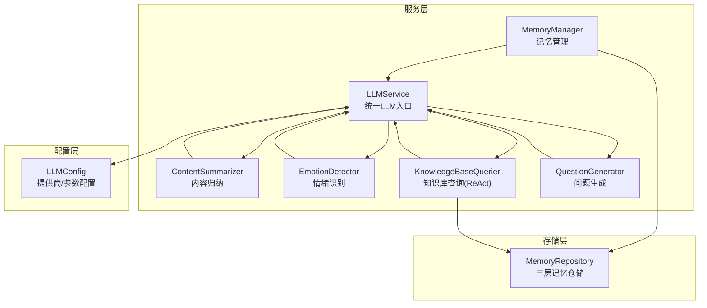
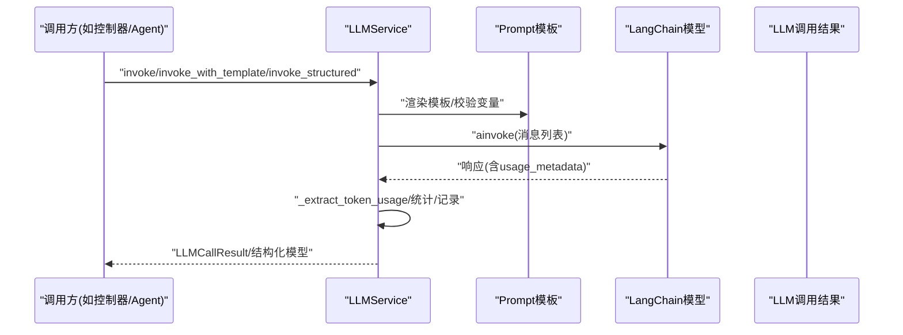
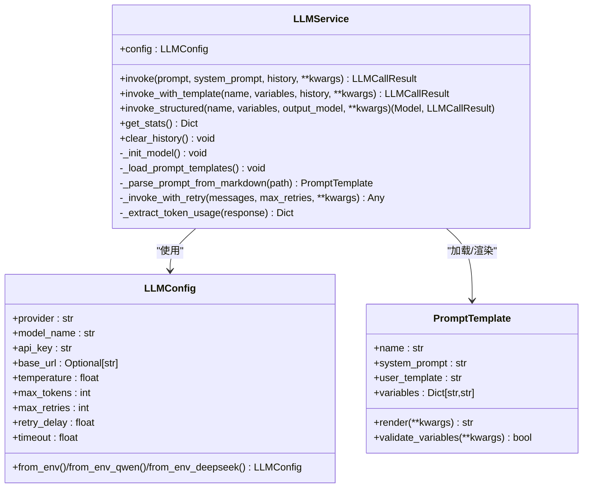
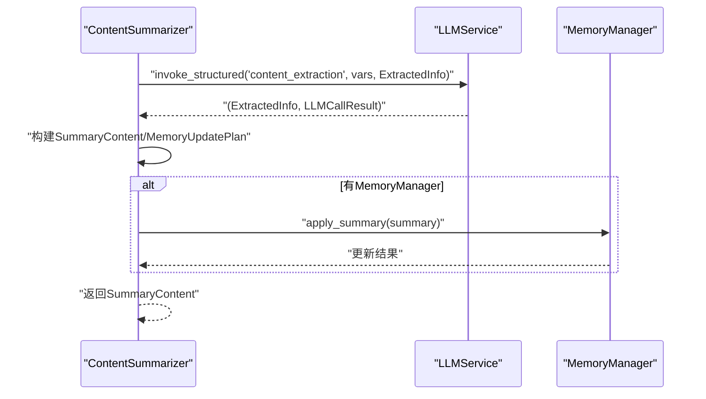
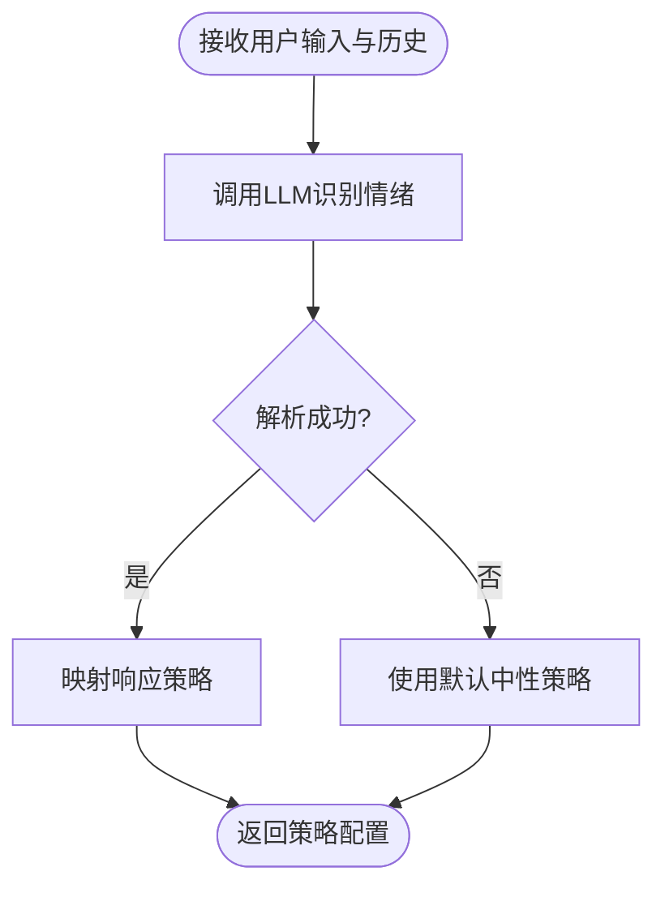
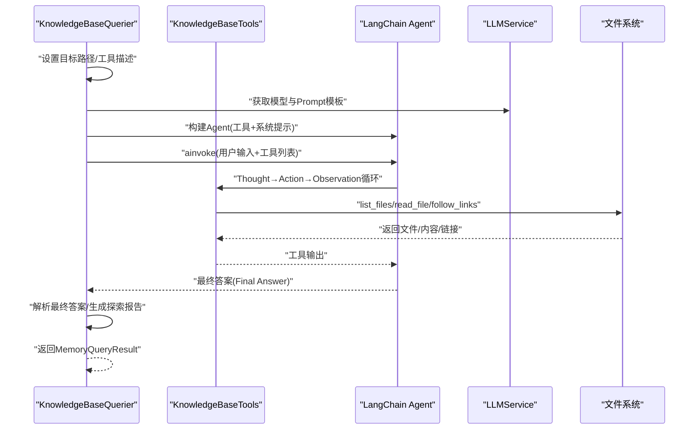
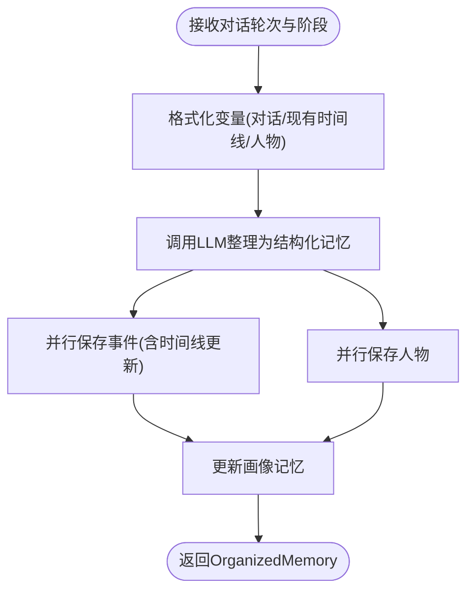
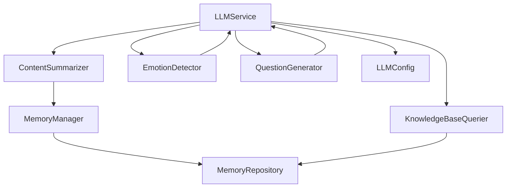

# 服务层架构

<cite>
**本文引用的文件**
- [llm_service.py](file://src/services/llm_service.py)
- [llm_config.py](file://src/config/llm_config.py)
- [content_summarizer.py](file://src/services/content_summarizer.py)
- [emotion_detector.py](file://src/services/emotion_detector.py)
- [knowledge_base_querier.py](file://src/services/knowledge_base_querier.py)
- [memory_manager.py](file://src/services/memory_manager.py)
- [question_generator.py](file://src/services/question_generator.py)
- [base.py](file://src/prompts/base.py)
- [memory_repository.py](file://src/storage/memory_repository.py)
- [test_llm_service.py](file://tests/test_llm_service.py)
- [test_memory_manager.py](file://tests/test_memory_manager.py)
- [README.md](file://README.md)
</cite>

## 目录
1. [简介](#简介)
2. [项目结构](#项目结构)
3. [核心组件](#核心组件)
4. [架构总览](#架构总览)
5. [详细组件分析](#详细组件分析)
6. [依赖关系分析](#依赖关系分析)
7. [性能考量](#性能考量)
8. [故障排查指南](#故障排查指南)
9. [结论](#结论)
10. [附录](#附录)

## 简介
本技术文档聚焦“服务层架构”，围绕统一的LLM服务抽象（LLMService）展开，系统阐释其多提供商支持、请求路由与响应处理机制；详解服务配置管理（LLM参数、连接池与重试）、核心服务组件（内容归纳、情绪识别、知识查询、记忆管理）的实现原理；梳理服务间依赖与调用链路（含错误传播、异常处理与降级策略）；并提供扩展与定制指南（新增服务、接口设计、集成测试方法），以及监控、性能优化与故障排除的实践建议。

## 项目结构
服务层位于 src/services 目录，围绕 LLMService 统一入口，向下对接各业务服务（内容归纳、情绪识别、知识查询、记忆管理、问题生成），向上为控制器与Agent层提供一致的LLM调用能力。配置层位于 src/config，负责LLM提供商与参数的集中管理。存储层位于 src/storage，提供三层记忆（短期、长期、画像）的统一仓储与缓存。

图表来源
- [llm_service.py:32-89](file://src/services/llm_service.py#L32-L89)
- [content_summarizer.py:17-42](file://src/services/content_summarizer.py#L17-L42)
- [emotion_detector.py:12-38](file://src/services/emotion_detector.py#L12-L38)
- [knowledge_base_querier.py:202-236](file://src/services/knowledge_base_querier.py#L202-L236)
- [memory_manager.py:27-61](file://src/services/memory_manager.py#L27-L61)
- [question_generator.py:12-37](file://src/services/question_generator.py#L12-L37)
- [llm_config.py:10-41](file://src/config/llm_config.py#L10-L41)
- [memory_repository.py:40-88](file://src/storage/memory_repository.py#L40-L88)

章节来源
- [README.md:92-200](file://README.md#L92-L200)

## 核心组件
- LLMService：统一LLM调用入口，封装LangChain模型初始化、Prompt模板加载、结构化输出解析、重试与统计。
- LLMConfig：集中管理提供商、模型、API Key、基础URL、温度、最大Token、重试与超时等配置。
- ContentSummarizer：异步内容归纳，提取事件、人物、主题，指导记忆更新。
- EmotionDetector：情绪识别与策略建议，支持降级策略。
- KnowledgeBaseQuerier：ReAct模式的知识库查询，结合工具链与最终答案解析。
- MemoryManager：三层记忆的组织与存储，协调LLM整理与仓储持久化。
- QuestionGenerator：问题生成与情绪响应，支持阶段切换与降级。
- MemoryRepository：短期/长期/画像三层记忆的统一仓储与LRU缓存。

章节来源
- [llm_service.py:32-89](file://src/services/llm_service.py#L32-L89)
- [llm_config.py:10-41](file://src/config/llm_config.py#L10-L41)
- [content_summarizer.py:17-42](file://src/services/content_summarizer.py#L17-L42)
- [emotion_detector.py:12-38](file://src/services/emotion_detector.py#L12-L38)
- [knowledge_base_querier.py:202-236](file://src/services/knowledge_base_querier.py#L202-L236)
- [memory_manager.py:27-61](file://src/services/memory_manager.py#L27-L61)
- [question_generator.py:12-37](file://src/services/question_generator.py#L12-L37)
- [memory_repository.py:40-88](file://src/storage/memory_repository.py#L40-L88)

## 架构总览
服务层以LLMService为核心，向上提供统一的结构化输出、模板调用与错误处理能力；向下对接各业务服务，形成清晰的职责边界与调用链路。配置层通过LLMConfig集中管理多提供商参数；存储层通过MemoryRepository提供三层记忆的统一访问与缓存。

图表来源
- [llm_service.py:225-292](file://src/services/llm_service.py#L225-L292)
- [llm_service.py:293-325](file://src/services/llm_service.py#L293-L325)
- [llm_service.py:327-399](file://src/services/llm_service.py#L327-L399)
- [llm_service.py:400-438](file://src/services/llm_service.py#L400-L438)

## 详细组件分析

### LLMService 统一接口设计
- 多提供商支持：通过provider字段选择OpenAI/Qwen/DeepSeek/Anthropic，兼容OpenAI风格API与特定提供商参数（如DeepSeek的thinking开关）。
- 请求路由与消息构造：支持system_prompt、历史消息、当前用户输入的组合；统一消息类型（Human/System/AI）。
- 响应处理：提取usage_metadata（prompt/completion/total tokens），记录延迟与统计；提供结构化输出解析（JSON提取与Pydantic校验）。
- Prompt模板管理：从Python模块与Markdown文件动态加载模板，支持变量说明与渲染校验。
- 重试与降级：指数退避重试，失败时返回错误结果；调用统计便于监控与告警。

图表来源
- [llm_service.py:32-89](file://src/services/llm_service.py#L32-L89)
- [llm_service.py:218-224](file://src/services/llm_service.py#L218-L224)
- [llm_service.py:225-292](file://src/services/llm_service.py#L225-L292)
- [llm_service.py:293-325](file://src/services/llm_service.py#L293-L325)
- [llm_service.py:327-399](file://src/services/llm_service.py#L327-L399)
- [llm_service.py:400-438](file://src/services/llm_service.py#L400-L438)
- [llm_config.py:10-41](file://src/config/llm_config.py#L10-L41)
- [base.py:6-33](file://src/prompts/base.py#L6-L33)

章节来源
- [llm_service.py:32-89](file://src/services/llm_service.py#L32-L89)
- [llm_config.py:10-41](file://src/config/llm_config.py#L10-L41)
- [base.py:6-33](file://src/prompts/base.py#L6-L33)

### 服务配置管理
- 环境变量优先：优先使用Qwen专属配置（QWEN_URL/QWEN_APIKEY），其次DeepSeek专属配置（DEEPSEEK_URL/DEEPSEEK_APIKEY），最后回退到通用配置。
- 默认配置：优先尝试DeepSeek，失败回退Qwen。
- 重试与超时：max_retries、retry_delay、timeout统一管理，便于在不同提供商间保持一致的调用体验。

章节来源
- [llm_config.py:42-120](file://src/config/llm_config.py#L42-L120)

### 内容归纳服务（ContentSummarizer）
- 职责：异步归纳对话内容，提取事件、人物、主题，构建记忆更新计划，并可直接应用到MemoryManager。
- 调用链：LLMService.invoke_structured（content_extraction模板）→ 构造SummaryContent → 可选应用到MemoryManager。
- 降级：当结构化输出失败时返回None，不影响主流程。

图表来源
- [content_summarizer.py:43-93](file://src/services/content_summarizer.py#L43-L93)
- [content_summarizer.py:94-109](file://src/services/content_summarizer.py#L94-L109)
- [content_summarizer.py:111-143](file://src/services/content_summarizer.py#L111-L143)

章节来源
- [content_summarizer.py:17-42](file://src/services/content_summarizer.py#L17-L42)
- [content_summarizer.py:43-93](file://src/services/content_summarizer.py#L43-L93)
- [content_summarizer.py:94-109](file://src/services/content_summarizer.py#L94-L109)
- [content_summarizer.py:111-143](file://src/services/content_summarizer.py#L111-L143)

### 情绪识别服务（EmotionDetector）
- 职责：识别用户输入的情绪状态，提供响应策略建议；若LLM失败，使用默认中性策略降级。
- 调用链：LLMService.invoke_structured（emotion_detection模板）→ EmotionResult → 策略映射。
- 策略：根据情绪类型与强度映射到暂停/安慰/继续等动作与语调。

图表来源
- [emotion_detector.py:39-74](file://src/services/emotion_detector.py#L39-L74)
- [emotion_detector.py:85-131](file://src/services/emotion_detector.py#L85-L131)

章节来源
- [emotion_detector.py:12-38](file://src/services/emotion_detector.py#L12-L38)
- [emotion_detector.py:39-74](file://src/services/emotion_detector.py#L39-L74)
- [emotion_detector.py:85-131](file://src/services/emotion_detector.py#L85-L131)

### 知识库查询服务（KnowledgeBaseQuerier）
- 职责：ReAct模式的智能查询，通过工具链（list_files/read_file/follow_links/mark_suspected_file/get_exploration_report/has_visited）动态探索知识库。
- Agent构建：基于LLMService提供的模型与Prompt模板（knowledge_base_react）构建Agent图。
- 最终答案解析：支持标准JSON与自然语言降级解析，生成MemoryQueryResult。
- 路径安全：工具路径解析与访问记录，限制在目标路径范围内。

图表来源
- [knowledge_base_querier.py:202-236](file://src/services/knowledge_base_querier.py#L202-L236)
- [knowledge_base_querier.py:257-373](file://src/services/knowledge_base_querier.py#L257-L373)
- [knowledge_base_querier.py:435-512](file://src/services/knowledge_base_querier.py#L435-L512)

章节来源
- [knowledge_base_querier.py:17-21](file://src/services/knowledge_base_querier.py#L17-L21)
- [knowledge_base_querier.py:202-236](file://src/services/knowledge_base_querier.py#L202-L236)
- [knowledge_base_querier.py:257-373](file://src/services/knowledge_base_querier.py#L257-L373)
- [knowledge_base_querier.py:435-512](file://src/services/knowledge_base_querier.py#L435-L512)

### 记忆管理服务（MemoryManager）
- 职责：三层记忆的统一管理，协调LLM整理与仓储持久化；提供短期/长期/画像记忆的读写接口。
- 核心流程：organize_and_save → LLMService.invoke_structured(memory_organization) → 并行保存事件/人物 → 更新画像与时间线。
- 并发优化：使用asyncio.gather并行保存，降低I/O等待。
- 兼容接口：提供update_long_term与apply_summary等兼容方法，平滑迁移。

图表来源
- [memory_manager.py:111-157](file://src/services/memory_manager.py#L111-L157)
- [memory_manager.py:158-194](file://src/services/memory_manager.py#L158-L194)
- [memory_manager.py:287-323](file://src/services/memory_manager.py#L287-L323)

章节来源
- [memory_manager.py:27-61](file://src/services/memory_manager.py#L27-L61)
- [memory_manager.py:111-157](file://src/services/memory_manager.py#L111-L157)
- [memory_manager.py:158-194](file://src/services/memory_manager.py#L158-L194)
- [memory_manager.py:287-323](file://src/services/memory_manager.py#L287-L323)
- [memory_manager.py:349-420](file://src/services/memory_manager.py#L349-L420)
- [memory_manager.py:435-467](file://src/services/memory_manager.py#L435-L467)

### 问题生成服务（QuestionGenerator）
- 职责：根据当前状态生成下一个问题，优先处理情绪响应，其次待追问问题，再次阶段切换，最后基于上下文生成。
- 调用链：LLMService.invoke_with_template（question_generation/emotion_response）→ 降级策略（预设响应/默认问题）。
- 阶段切换：依据覆盖率阈值与阶段顺序判断是否切换。

章节来源
- [question_generator.py:12-37](file://src/services/question_generator.py#L12-L37)
- [question_generator.py:38-74](file://src/services/question_generator.py#L38-L74)
- [question_generator.py:109-140](file://src/services/question_generator.py#L109-L140)
- [question_generator.py:152-195](file://src/services/question_generator.py#L152-L195)
- [question_generator.py:196-253](file://src/services/question_generator.py#L196-L253)

### Prompt模板与加载机制
- PromptTemplate：统一的模板结构（name/description/system_prompt/user_template/variables），支持渲染与变量校验。
- LLMService模板加载：从Python模块与Markdown文件动态加载，支持变量表格解析与模板注册。

章节来源
- [base.py:6-33](file://src/prompts/base.py#L6-L33)
- [llm_service.py:126-162](file://src/services/llm_service.py#L126-L162)
- [llm_service.py:163-217](file://src/services/llm_service.py#L163-L217)

## 依赖关系分析
- 低耦合高内聚：各服务通过LLMService统一入口调用，减少对具体提供商的直接依赖。
- 明确边界：ContentSummarizer/MemoryManager/KnowledgeBaseQuerier/QuestionGenerator/EmotionDetector各司其职，通过LLMService与存储层交互。
- 可替换性：LLMService可替换提供商与模型，配置层集中管理，便于灰度与A/B测试。

图表来源
- [llm_service.py:32-89](file://src/services/llm_service.py#L32-L89)
- [content_summarizer.py:17-42](file://src/services/content_summarizer.py#L17-L42)
- [emotion_detector.py:12-38](file://src/services/emotion_detector.py#L12-L38)
- [knowledge_base_querier.py:202-236](file://src/services/knowledge_base_querier.py#L202-L236)
- [memory_manager.py:27-61](file://src/services/memory_manager.py#L27-L61)
- [question_generator.py:12-37](file://src/services/question_generator.py#L12-L37)
- [llm_config.py:10-41](file://src/config/llm_config.py#L10-L41)
- [memory_repository.py:40-88](file://src/storage/memory_repository.py#L40-L88)

章节来源
- [llm_service.py:32-89](file://src/services/llm_service.py#L32-L89)
- [memory_repository.py:40-88](file://src/storage/memory_repository.py#L40-L88)

## 性能考量
- 并发与批量：MemoryManager在保存事件/人物时使用asyncio.gather并行执行，显著降低I/O等待。
- 缓存：MemoryRepository内置LRU缓存，减少重复读取；短期记忆容量可控，避免内存膨胀。
- 重试与退避：LLMService指数退避重试，降低瞬时抖动对用户体验的影响。
- Token与延迟统计：LLMService记录usage与延迟，便于监控与成本控制。
- I/O优化：KnowledgeBaseQuerier优先一次性列出全量目录，减少多次往返；优先完整阅读文档，提高相关性。

章节来源
- [memory_manager.py:170-187](file://src/services/memory_manager.py#L170-L187)
- [memory_repository.py:16-38](file://src/storage/memory_repository.py#L16-L38)
- [llm_service.py:400-438](file://src/services/llm_service.py#L400-L438)
- [llm_service.py:449-457](file://src/services/llm_service.py#L449-L457)

## 故障排查指南
- LLM调用失败：检查provider/model_name/api_key/base_url配置；查看LLMService错误日志与LLMCallResult.error；启用重试与降级策略。
- Prompt模板缺失：确认模板名称与变量；检查Markdown模板解析与变量表格；验证PromptTemplate.validate_variables。
- 结构化输出解析失败：确认LLM输出符合JSON格式；检查代码块包裹；查看Parse error详情。
- 知识库查询无结果：检查目标路径合法性；确认工具描述与路径限制；查看探索报告与疑似文件列表。
- 记忆保存异常：检查事件/人物ID唯一性；确认Markdown文件创建权限；查看并行保存异常堆栈。

章节来源
- [test_llm_service.py:104-140](file://tests/test_llm_service.py#L104-L140)
- [test_llm_service.py:180-187](file://tests/test_llm_service.py#L180-L187)
- [knowledge_base_querier.py:280-294](file://src/services/knowledge_base_querier.py#L280-L294)
- [knowledge_base_querier.py:335-358](file://src/services/knowledge_base_querier.py#L335-L358)
- [memory_manager.py:158-194](file://src/services/memory_manager.py#L158-L194)

## 结论
服务层以LLMService为核心，实现了多提供商统一接入、模板化调用、结构化输出与完善的错误处理与降级策略。通过MemoryRepository提供三层记忆的统一仓储与缓存，配合各业务服务的职责划分，形成了高内聚、低耦合的服务架构。配置层集中管理参数，便于在不同提供商间灵活切换与灰度发布。建议在生产环境中结合监控指标（成功率、延迟、Token消耗）持续优化重试与缓存策略，并完善集成测试覆盖关键调用链路。

## 附录

### 开发与扩展指南
- 新增服务步骤
  1) 在 src/services/ 下创建服务文件，依赖LLMService或MemoryManager。
  2) 在服务中使用LLMService.invoke/invoke_with_template/invoke_structured。
  3) 编写单元测试，使用pytest与mock验证LLM调用与错误降级。
  4) 在 __init__.py 中导出新服务，确保对外接口稳定。
- Prompt扩展
  1) 在 src/prompts/ 或 Prompts/ 目录创建Markdown模板，定义变量表格。
  2) 在LLMService中加载模板或在服务中显式注册。
- 集成测试方法
  - 使用unittest.mock.patch模拟LLMService模型，断言调用参数与返回值。
  - 使用AsyncMock验证异步调用链路与并发行为。
  - 验证错误传播与降级策略，确保服务健壮性。

章节来源
- [README.md:396-434](file://README.md#L396-L434)
- [test_llm_service.py:8-23](file://tests/test_llm_service.py#L8-L23)
- [test_memory_manager.py:18-31](file://tests/test_memory_manager.py#L18-L31)