# 服务组件实现

<cite>
**本文档引用的文件**
- [content_summarizer.py](file://src/services/content_summarizer.py)
- [emotion_detector.py](file://src/services/emotion_detector.py)
- [knowledge_base_querier.py](file://src/services/knowledge_base_querier.py)
- [memory_manager.py](file://src/services/memory_manager.py)
- [question_generator.py](file://src/services/question_generator.py)
- [llm_service.py](file://src/services/llm_service.py)
- [memory_repository.py](file://src/storage/memory_repository.py)
- [knowledge_query_tool.py](file://src/tools/knowledge_query_tool.py)
- [EmotionDetector-Prompt.md](file://src/prompts/EmotionDetector-Prompt.md)
- [MemoryOrganizer-Prompt.md](file://Prompts/MemoryOrganizer-Prompt.md)
- [QuestionGenerator-Prompt.md](file://Prompts/QuestionGenerator-Prompt.md)
- [summary_content.py](file://src/models/summary_content.py)
- [memory_query_result.py](file://src/models/memory_query_result.py)
- [emotion_type.py](file://src/enums/emotion_type.py)
</cite>

## 目录
1. [简介](#简介)
2. [项目结构](#项目结构)
3. [核心组件](#核心组件)
4. [架构概览](#架构概览)
5. [详细组件分析](#详细组件分析)
6. [依赖分析](#依赖分析)
7. [性能考虑](#性能考虑)
8. [故障排除指南](#故障排除指南)
9. [结论](#结论)

## 简介

本文档深入分析了自传写作系统的五大核心服务组件，包括内容归纳服务、情绪识别服务、知识库查询服务、记忆管理服务和问题生成服务。这些服务协同工作，为用户提供智能化的自传写作体验。

系统采用三层记忆架构：短期记忆（内存缓存）、长期记忆（文件系统存储）和画像记忆（结构化存储）。通过LLMService统一管理大模型调用，结合结构化提示模板，实现了高效、可靠的智能对话系统。

## 项目结构

系统采用模块化设计，主要包含以下核心模块：

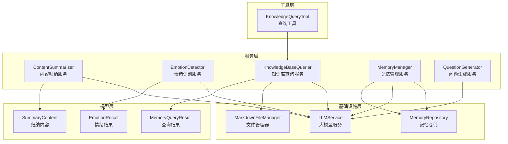

**图表来源**
- [content_summarizer.py:17-177](file://src/services/content_summarizer.py#L17-L177)
- [emotion_detector.py:12-131](file://src/services/emotion_detector.py#L12-L131)
- [knowledge_base_querier.py:202-540](file://src/services/knowledge_base_querier.py#L202-L540)
- [memory_manager.py:27-470](file://src/services/memory_manager.py#L27-L470)
- [question_generator.py:12-253](file://src/services/question_generator.py#L12-L253)

## 核心组件

### 内容归纳服务 (ContentSummarizer)

内容归纳服务负责将对话内容转换为结构化信息，提取关键事件、人物和主题，并指导记忆库更新。

**核心功能**：
- 异步内容归纳，不阻塞主流程
- 结构化信息提取（事件、人物、主题）
- 记忆更新计划生成
- 会话结束时的完整归纳

**数据流**：
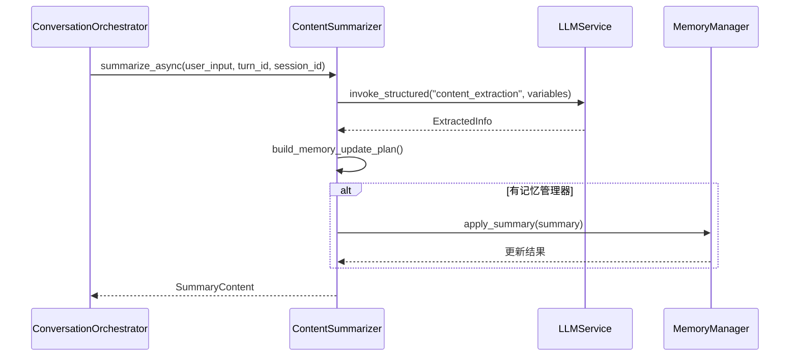

**图表来源**
- [content_summarizer.py:43-92](file://src/services/content_summarizer.py#L43-L92)
- [llm_service.py:327-399](file://src/services/llm_service.py#L327-L399)

### 情绪识别服务 (EmotionDetector)

情绪识别服务实时分析用户输入，识别情绪状态并提供响应策略建议。

**核心功能**：
- 多轮对话历史分析
- 情绪类型、强度、效价识别
- 特殊处理需求判断
- 响应策略映射

**算法流程**：
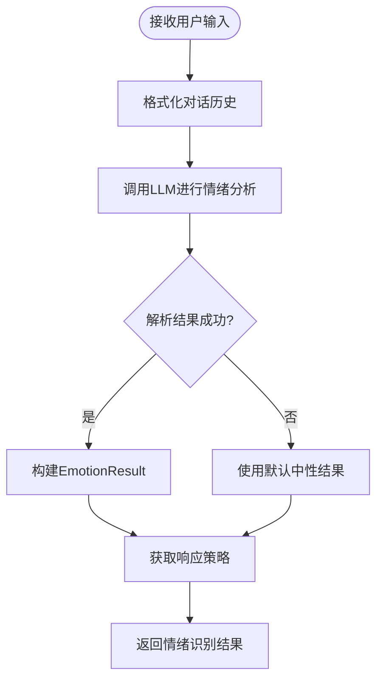

**图表来源**
- [emotion_detector.py:39-73](file://src/services/emotion_detector.py#L39-L73)
- [emotion_type.py:4-50](file://src/enums/emotion_type.py#L4-L50)

### 知识库查询服务 (KnowledgeBaseQuerier)

知识库查询服务实现ReAct模式，通过思维链推理动态查询知识库。

**ReAct模式实现**：
1. **Thought**: 理解用户意图，决定下一步行动
2. **Action**: 调用工具（list_files/read_file/search_content/follow_links）
3. **Observation**: 获取工具返回结果
4. **Final Answer**: 输出最终相关记忆

**工具集**：
- `list_files`: 列出目录结构
- `read_file`: 读取文件内容
- `search_content`: 关键词搜索
- `follow_links`: 追踪Wiki链接
- `mark_suspected_file`: 标记相关文件
- `get_exploration_report`: 路径探索报告

**序列流程**：
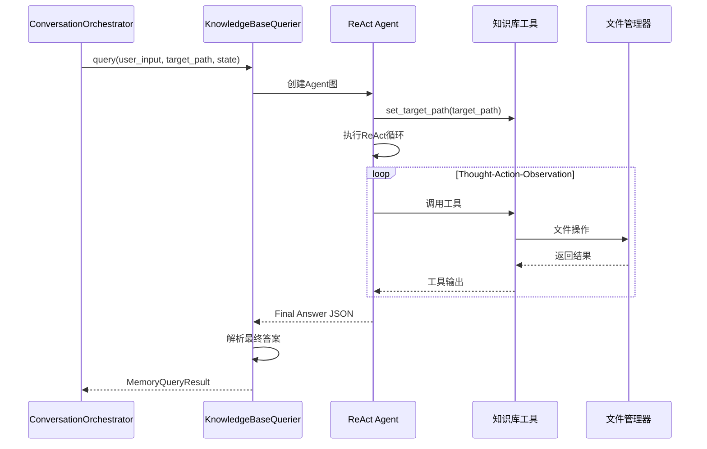

**图表来源**
- [knowledge_base_querier.py:257-373](file://src/services/knowledge_base_querier.py#L257-L373)

### 记忆管理服务 (MemoryManager)

记忆管理服务提供三层记忆的统一管理，包括短期记忆、长期记忆和画像记忆。

**三层架构**：

1. **短期记忆**（内存缓存）
   - 最近对话历史
   - 临时状态信息
   - LRU缓存机制

2. **长期记忆**（文件系统）
   - 事件存储（按人生阶段分类）
   - 人物存储（按关系分类）
   - 时间线维护

3. **画像记忆**（结构化存储）
   - 主人公信息
   - 关系网络
   - 性格特征

**核心流程**：
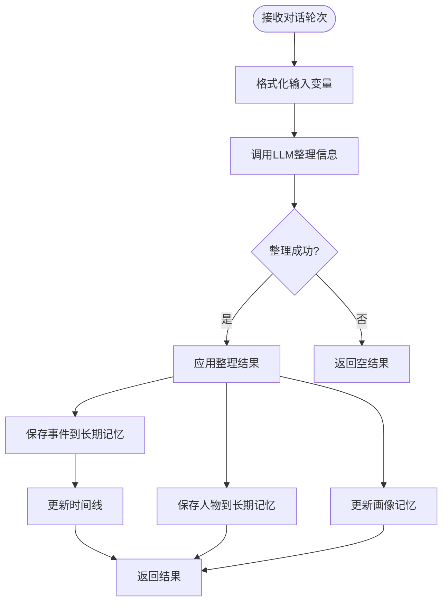

**图表来源**
- [memory_manager.py:111-156](file://src/services/memory_manager.py#L111-L156)
- [memory_repository.py:176-226](file://src/storage/memory_repository.py#L176-L226)

### 问题生成服务 (QuestionGenerator)

问题生成服务根据当前状态生成下一个对话问题，具备智能问答算法。

**优先级决策链**：
1. 情绪响应优先（特殊处理需求）
2. 待追问问题（Pending Questions）
3. 阶段切换（覆盖率阈值）
4. 基于上下文生成（MemoryQueryResult）

**智能算法**：
- 上下文理解：分析记忆查询结果
- 问题优化：基于情绪状态调整语气
- 对话历史管理：维护会话连贯性

**决策流程**：
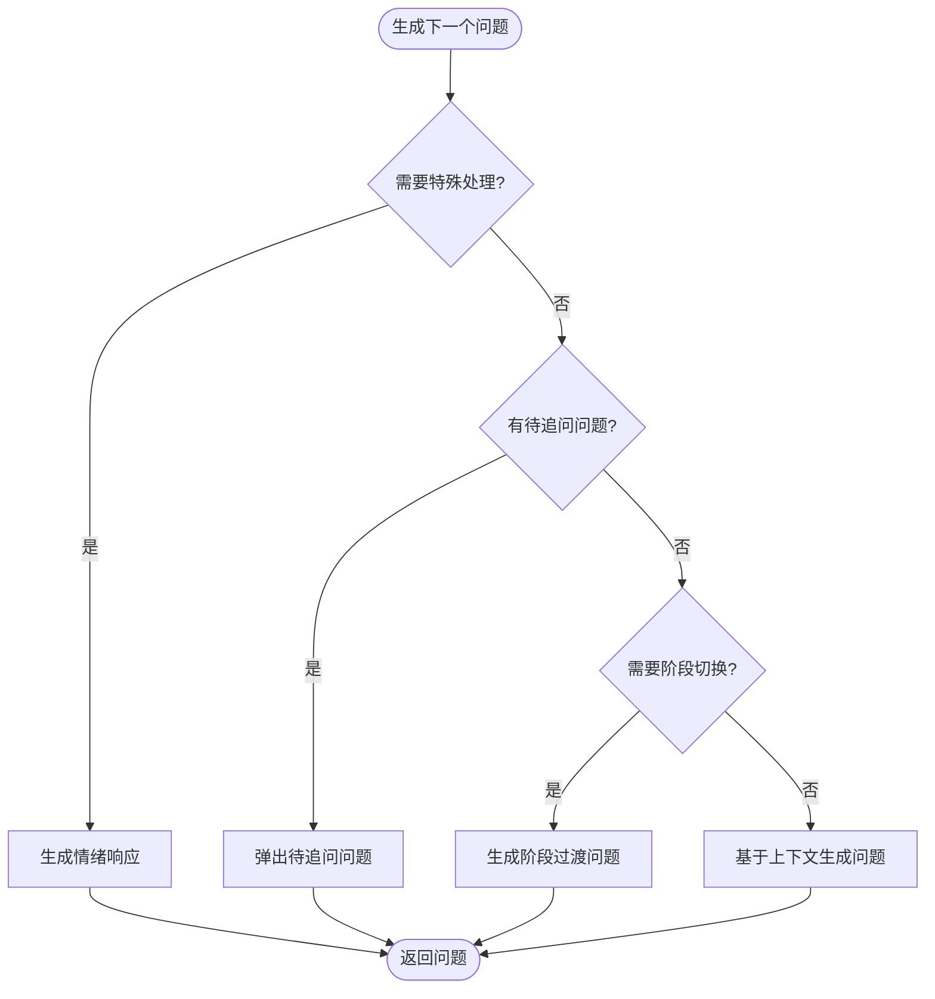

**图表来源**
- [question_generator.py:38-74](file://src/services/question_generator.py#L38-L74)

## 架构概览

系统采用分层架构设计，各组件职责明确，通过统一的LLMService进行大模型交互。

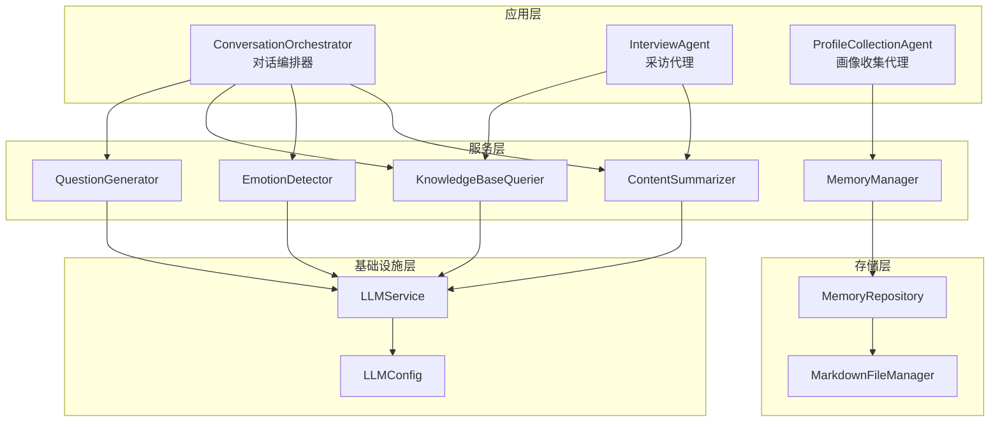

**图表来源**
- [llm_service.py:32-89](file://src/services/llm_service.py#L32-L89)
- [memory_repository.py:40-87](file://src/storage/memory_repository.py#L40-L87)

## 详细组件分析

### 内容归纳服务详细分析

**实现原理**：
内容归纳服务通过结构化提示模板从用户输入中提取关键信息。它使用LLMService的结构化输出能力，确保提取结果的一致性和可靠性。

**关键算法**：
1. **信息提取算法**：基于模板的结构化抽取
2. **记忆更新计划**：根据提取信息生成更新策略
3. **主题构建**：从事件显著性中提取主题

**数据结构**：
- `ExtractedInfo`: 提取的信息汇总
- `MemoryUpdatePlan`: 记忆更新计划
- `SummaryContent`: 归纳内容结果

**接口设计**：
```python
async def summarize_async(
    self,
    user_input: str,
    turn_id: int,
    session_id: str
) -> Optional[SummaryContent]
```

**使用示例**：
```python
# 基本使用
summary = await content_summarizer.summarize_async(
    user_input="我小时候住在小院子里...",
    turn_id=1,
    session_id="session_001"
)

# 准备交接
final_summary = await content_summarizer.prepare_handoff(session_state)
```

**章节来源**
- [content_summarizer.py:17-177](file://src/services/content_summarizer.py#L17-L177)
- [summary_content.py:22-67](file://src/models/summary_content.py#L22-L67)

### 情绪识别服务详细分析

**工作机制**：
情绪识别服务通过多轮对话历史分析用户情绪状态，提供精确的情绪分类和强度评估。

**情感分类体系**：
- **正向情绪**: joy, pride, nostalgia, gratitude, hope
- **中性情绪**: neutral, curious, contemplative  
- **负向情绪**: sadness, regret, anger, fear, guilt
- **特殊状态**: confusion, fatigue, reluctance

**强度评估**：
- `LOW`: 低强度
- `MEDIUM`: 中等强度  
- `HIGH`: 高强度

**安抚策略**：
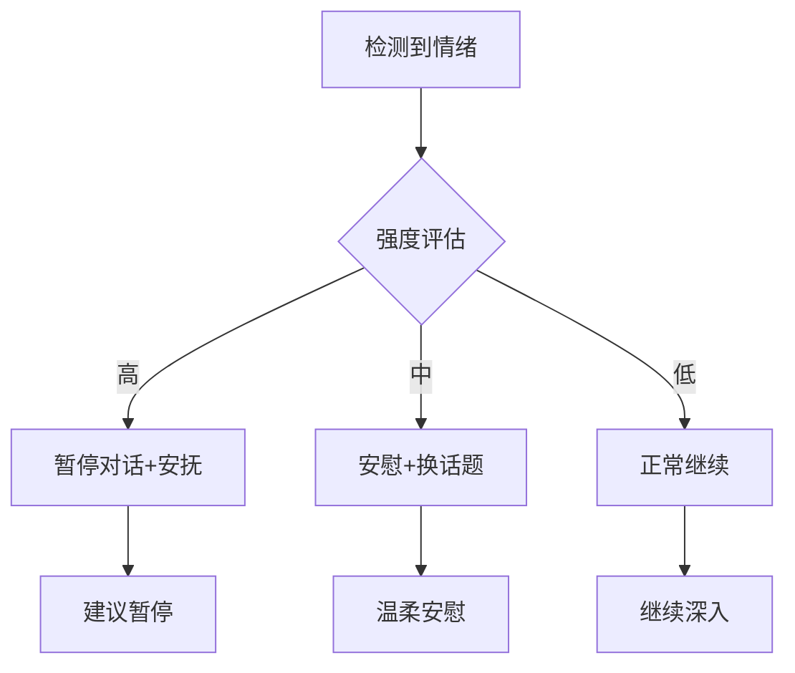

**接口设计**：
```python
async def detect(
    self,
    user_input: str,
    conversation_history: List[ConversationTurn]
) -> EmotionResult
```

**使用示例**：
```python
# 情绪检测
emotion_result = await emotion_detector.detect(
    user_input="我很难过...",
    conversation_history=recent_history
)

# 获取响应策略
strategy = emotion_detector.get_response_strategy(emotion_result)
```

**章节来源**
- [emotion_detector.py:12-131](file://src/services/emotion_detector.py#L12-L131)
- [emotion_type.py:4-50](file://src/enums/emotion_type.py#L4-L50)

### 知识库查询服务详细分析

**ReAct模式实现**：
知识库查询服务实现了完整的思维链推理模式，通过工具调用和结果验证确保查询准确性。

**工具调用流程**：
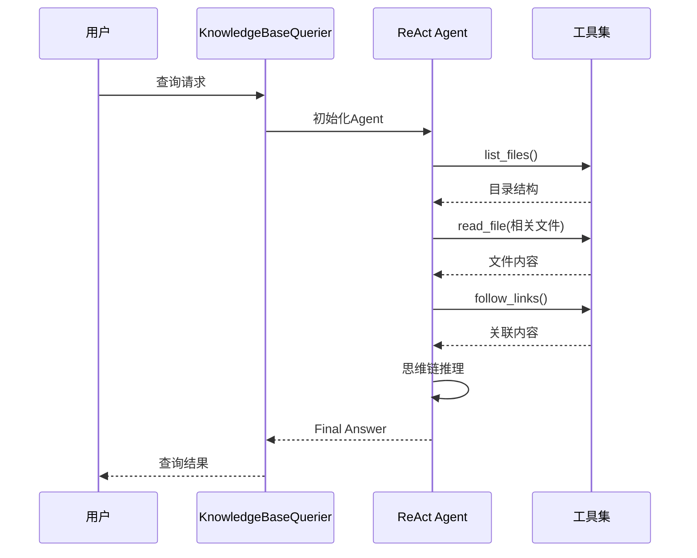

**结果验证机制**：
1. **JSON格式验证**：标准Final Answer JSON解析
2. **自然语言降级**：无法解析时的自然语言处理
3. **探索报告生成**：无直接结果时的完整报告

**接口设计**：
```python
async def query(
    self,
    user_input: str,
    target_path: str,
    state: SessionState
) -> MemoryQueryResult
```

**使用示例**：
```python
# 基本查询
result = await knowledge_base_querier.query(
    user_input="父亲的故事",
    target_path="./knowledge_base/user001",
    state=session_state
)

# 工具查询
tool_result = await knowledge_query_tool.query(
    user_id="user001",
    query="童年回忆",
    max_iterations=3
)
```

**章节来源**
- [knowledge_base_querier.py:202-540](file://src/services/knowledge_base_querier.py#L202-L540)
- [knowledge_query_tool.py:11-81](file://src/tools/knowledge_query_tool.py#L11-L81)

### 记忆管理服务详细分析

**三层架构实现**：

**短期记忆管理**：
- 基于LRU缓存的内存存储
- 最近对话历史管理
- 容量限制和自动清理

**长期记忆管理**：
- 事件、人物、时间线的文件化存储
- 按人生阶段分类的目录结构
- 自动索引和缓存机制

**画像记忆管理**：
- 主人公信息的结构化存储
- 关系网络的动态更新
- 性格特征的增量学习

**核心算法**：
1. **记忆整理算法**：基于对话内容的结构化提取
2. **存储优化算法**：并行保存和索引更新
3. **查询优化算法**：LRU缓存和索引加速

**接口设计**：
```python
async def organize_and_save(
    self,
    turns: List[ConversationTurn],
    current_phase: PhaseType
) -> OrganizedMemory
```

**使用示例**：
```python
# 整理并保存记忆
organized_memory = await memory_manager.organize_and_save(
    turns=conversation_turns,
    current_phase=current_phase
)

# 查询事件
events = await memory_manager.query_events(
    keyword="父亲",
    time_range=("1950", "1970")
)
```

**章节来源**
- [memory_manager.py:27-470](file://src/services/memory_manager.py#L27-L470)
- [memory_repository.py:40-359](file://src/storage/memory_repository.py#L40-L359)

### 问题生成服务详细分析

**智能问答算法**：
问题生成服务实现了复杂的优先级决策算法，确保对话的自然流畅和信息收集的有效性。

**算法核心**：
1. **情绪感知算法**：根据情绪状态调整问题类型
2. **上下文理解算法**：分析记忆查询结果生成相关问题
3. **阶段推进算法**：基于覆盖率阈值的自然过渡

**问题类型**：
- `OPEN`: 开放性问题
- `FOLLOW_UP`: 追问问题  
- `EMOTION_RESPONSE`: 情绪响应
- `PHASE_TRANSITION`: 阶段过渡

**决策逻辑**：
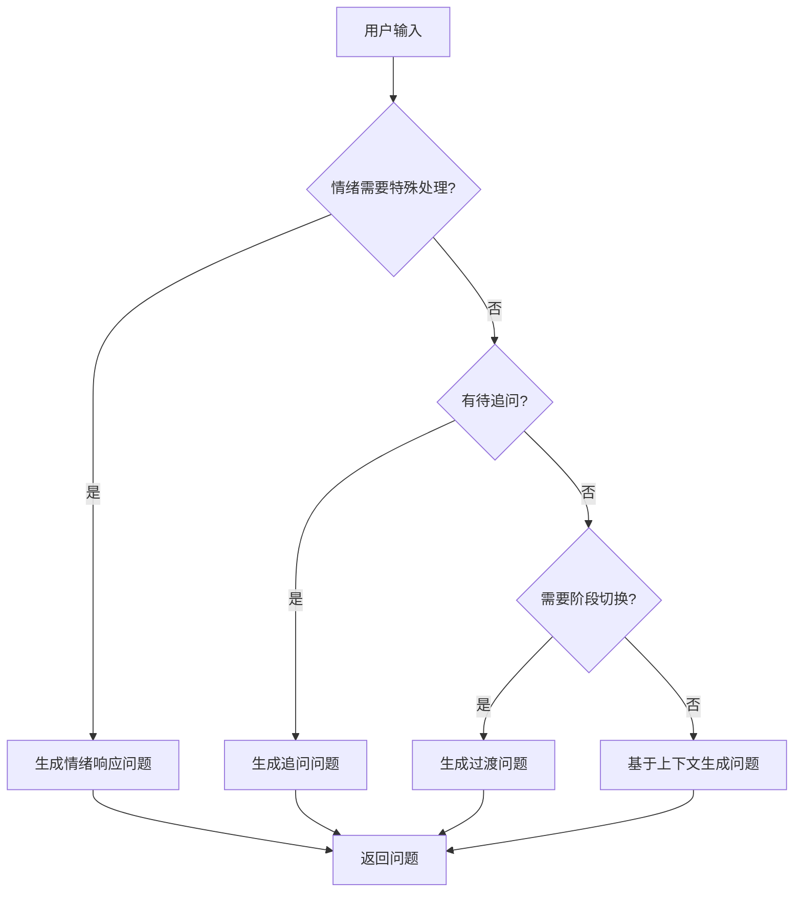

**接口设计**：
```python
async def generate(
    self,
    user_input: str,
    emotion: EmotionResult,
    memory: MemoryQueryResult,
    state: SessionState,
    conversation_history: Optional[List[Dict]] = None
) -> str
```

**使用示例**：
```python
# 生成下一个问题
next_question = await question_generator.generate(
    user_input=user_response,
    emotion=emotion_result,
    memory=query_result,
    state=session_state,
    conversation_history=history
)

# InterviewAgent专用接口
interview_question = await question_generator.generate_next(
    user_input=user_response,
    memory_context=memory_context,
    conversation_history=history
)
```

**章节来源**
- [question_generator.py:12-253](file://src/services/question_generator.py#L12-L253)

## 依赖分析

系统采用松耦合设计，各组件通过抽象接口进行交互。

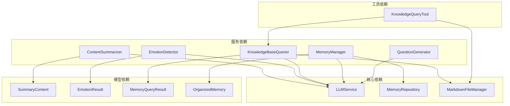

**图表来源**
- [llm_service.py:71-89](file://src/services/llm_service.py#L71-L89)
- [memory_repository.py:54-87](file://src/storage/memory_repository.py#L54-L87)

**章节来源**
- [llm_service.py:1-481](file://src/services/llm_service.py#L1-L481)
- [memory_repository.py:1-359](file://src/storage/memory_repository.py#L1-L359)

## 性能考虑

### 异步处理优化
- 所有服务均采用异步实现，避免阻塞主流程
- 并行保存机制提升大规模数据处理效率
- LRU缓存减少重复文件读取

### 内存管理
- 短期记忆容量限制，自动清理过期数据
- 缓存容量控制，平衡内存使用和性能
- 文件句柄管理，避免资源泄漏

### 大模型调用优化
- 指数退避重试机制
- 调用统计和监控
- Token使用量跟踪

## 故障排除指南

### 常见问题及解决方案

**LLM调用失败**：
- 检查API密钥和网络连接
- 查看重试日志和错误信息
- 验证提示模板格式

**文件读写异常**：
- 确认文件路径权限
- 检查磁盘空间
- 验证文件编码格式

**内存不足**：
- 清理短期记忆缓存
- 调整缓存容量配置
- 监控内存使用趋势

**章节来源**
- [llm_service.py:400-438](file://src/services/llm_service.py#L400-L438)
- [memory_repository.py:159-161](file://src/storage/memory_repository.py#L159-L161)

## 结论

本系统通过精心设计的五大服务组件，实现了智能化的自传写作辅助系统。各组件职责明确，协作高效，为用户提供自然流畅的对话体验。

**核心优势**：
1. **模块化设计**：组件职责清晰，易于维护和扩展
2. **三层记忆架构**：全面覆盖短期、长期和画像记忆
3. **智能推理能力**：ReAct模式实现精准的知识库查询
4. **情绪感知系统**：实时分析用户情绪状态
5. **结构化输出**：确保信息提取的准确性和一致性

系统具备良好的可扩展性，可根据需求增加新的服务组件或优化现有功能，为自传写作领域提供持续的技术支持。