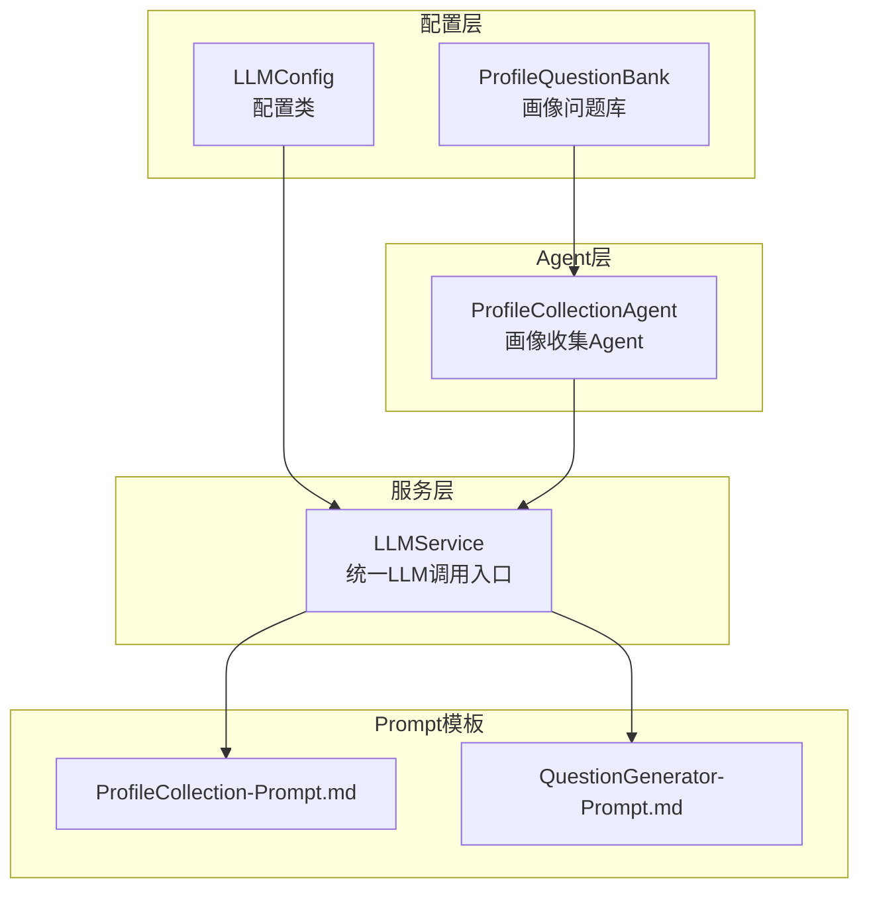
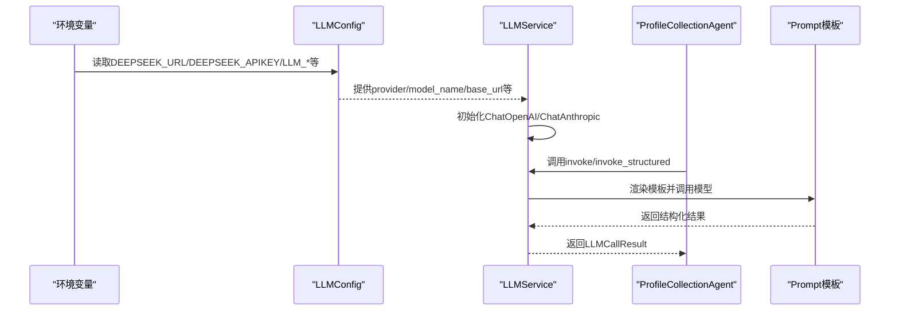
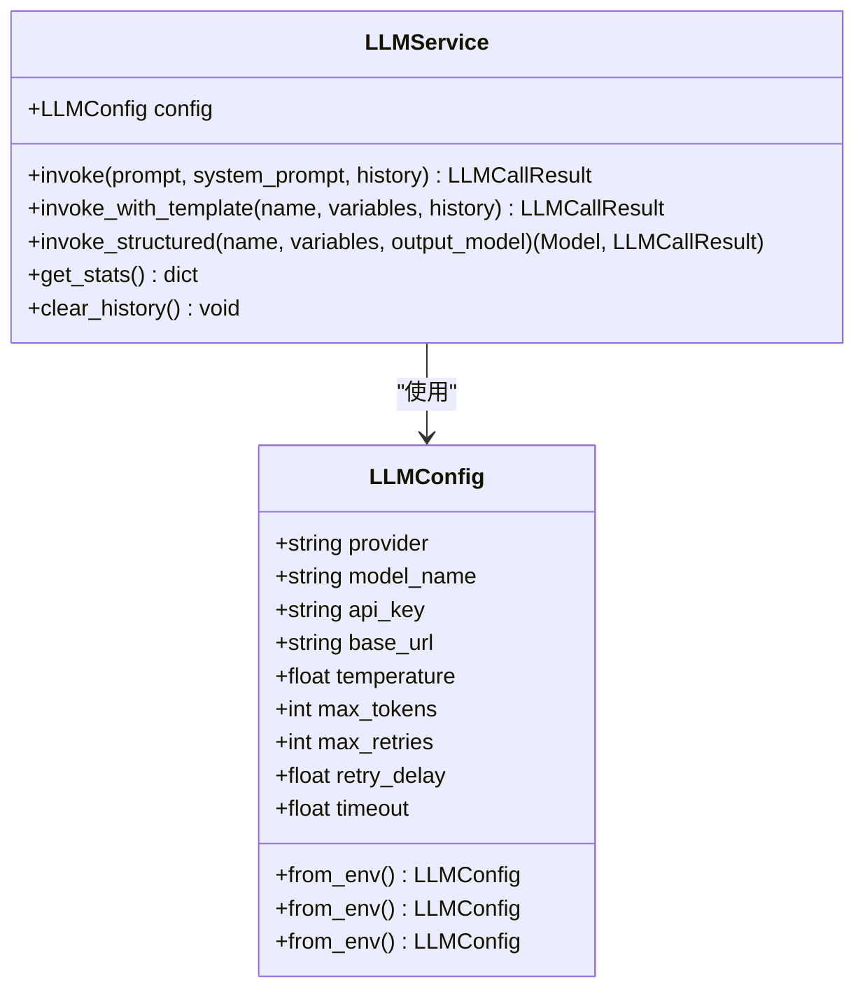
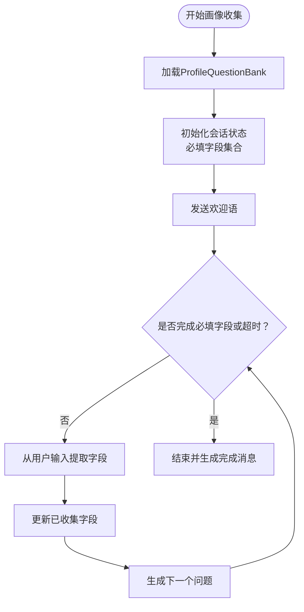
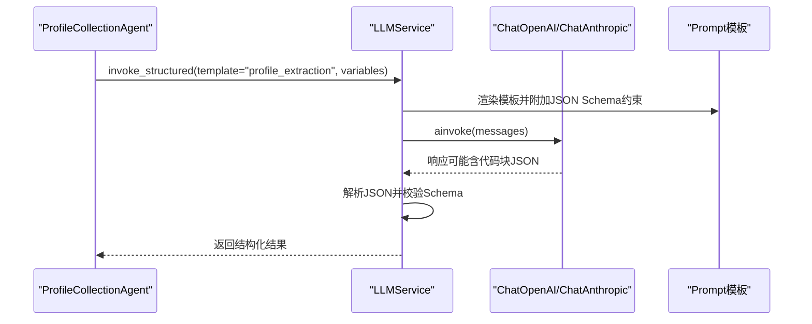
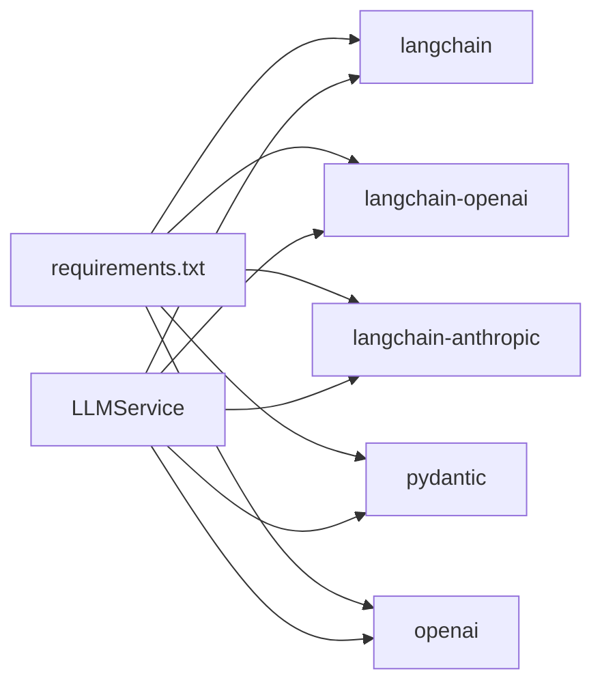

# 服务配置管理

<cite>
**本文引用的文件**
- [src/config/llm_config.py](file://src/config/llm_config.py)
- [src/config/profile_questions.py](file://src/config/profile_questions.py)
- [src/config/__init__.py](file://src/config/__init__.py)
- [src/services/llm_service.py](file://src/services/llm_service.py)
- [src/agents/profile_collection_agent.py](file://src/agents/profile_collection_agent.py)
- [Prompts/ProfileCollection-Prompt.md](file://Prompts/ProfileCollection-Prompt.md)
- [Prompts/QuestionGenerator-Prompt.md](file://Prompts/QuestionGenerator-Prompt.md)
- [README.md](file://README.md)
- [requirements.txt](file://requirements.txt)
- [tests/test_llm_service.py](file://tests/test_llm_service.py)
</cite>

## 目录
1. [简介](#简介)
2. [项目结构](#项目结构)
3. [核心组件](#核心组件)
4. [架构总览](#架构总览)
5. [详细组件分析](#详细组件分析)
6. [依赖分析](#依赖分析)
7. [性能考量](#性能考量)
8. [故障排查指南](#故障排查指南)
9. [结论](#结论)
10. [附录](#附录)

## 简介
本文件面向“服务配置管理”，聚焦于 LLMConfig 配置类的设计与实现，涵盖多提供商配置支持（OpenAI、Anthropic、DeepSeek）、模型参数设置（provider、model_name、temperature、max_tokens、api_key、base_url 等）、连接池与重试机制、配置加载（默认配置、环境变量覆盖、运行时更新）、ProfileQuestions 用户画像问题库的设计原则与配置方法，以及配置最佳实践（安全、性能、故障排除）。文档同时给出配置示例与常见场景解决方案，帮助开发者快速、安全、稳定地部署与维护系统。

## 项目结构
围绕配置管理的关键目录与文件如下：
- 配置模块：src/config/llm_config.py、src/config/profile_questions.py、src/config/__init__.py
- 服务层：src/services/llm_service.py（统一LLM调用入口，封装LangChain调用、模板管理、错误处理与重试）
- Agent 层：src/agents/profile_collection_agent.py（使用LLMService进行画像收集）
- Prompt 模板：Prompts/ProfileCollection-Prompt.md、Prompts/QuestionGenerator-Prompt.md（与配置联动）
- 依赖声明：requirements.txt
- 测试：tests/test_llm_service.py（验证LLMService行为）

图表来源
- [src/config/llm_config.py:10-120](file://src/config/llm_config.py#L10-L120)
- [src/config/profile_questions.py:3-94](file://src/config/profile_questions.py#L3-L94)
- [src/services/llm_service.py:32-481](file://src/services/llm_service.py#L32-L481)
- [src/agents/profile_collection_agent.py:14-275](file://src/agents/profile_collection_agent.py#L14-L275)
- [Prompts/ProfileCollection-Prompt.md:1-405](file://Prompts/ProfileCollection-Prompt.md#L1-L405)
- [Prompts/QuestionGenerator-Prompt.md:1-352](file://Prompts/QuestionGenerator-Prompt.md#L1-L352)

章节来源
- [src/config/llm_config.py:10-120](file://src/config/llm_config.py#L10-L120)
- [src/config/profile_questions.py:3-94](file://src/config/profile_questions.py#L3-L94)
- [src/services/llm_service.py:32-481](file://src/services/llm_service.py#L32-L481)
- [src/agents/profile_collection_agent.py:14-275](file://src/agents/profile_collection_agent.py#L14-L275)
- [Prompts/ProfileCollection-Prompt.md:1-405](file://Prompts/ProfileCollection-Prompt.md#L1-L405)
- [Prompts/QuestionGenerator-Prompt.md:1-352](file://Prompts/QuestionGenerator-Prompt.md#L1-L352)

## 核心组件
- LLMConfig：基于 Pydantic 的配置模型，支持多提供商、环境变量覆盖、默认值与约束校验；提供 from_env/from_env 等工厂方法，以及 get_default_config 的回退策略。
- LLMService：统一LLM调用入口，负责模型初始化（OpenAI/Anthropic/DeepSeek兼容）、Prompt模板加载与渲染、结构化输出解析、重试与统计。
- ProfileQuestionBank：用户画像问题库，定义基础信息与详细信息问题集合、条件触发与开放性问题标记、过渡话术等。
- ProfileCollectionAgent：使用LLMService进行画像收集，结合ProfileCollection-Prompt.md模板与ProfileQuestionBank问题库，逐步完成必填字段收集。

章节来源
- [src/config/llm_config.py:10-120](file://src/config/llm_config.py#L10-L120)
- [src/services/llm_service.py:32-481](file://src/services/llm_service.py#L32-L481)
- [src/config/profile_questions.py:3-94](file://src/config/profile_questions.py#L3-L94)
- [src/agents/profile_collection_agent.py:14-275](file://src/agents/profile_collection_agent.py#L14-L275)

## 架构总览
LLMConfig 作为配置源，被 LLMService 读取并初始化对应提供商的模型；ProfileCollectionAgent 通过 LLMService 调用结构化 Prompt，从用户输入中提取画像字段，并根据 ProfileQuestionBank 的问题集合生成下一步问题。

图表来源
- [src/config/llm_config.py:42-120](file://src/config/llm_config.py#L42-L120)
- [src/services/llm_service.py:90-125](file://src/services/llm_service.py#L90-L125)
- [src/agents/profile_collection_agent.py:168-254](file://src/agents/profile_collection_agent.py#L168-L254)
- [Prompts/ProfileCollection-Prompt.md:100-210](file://Prompts/ProfileCollection-Prompt.md#L100-L210)

## 详细组件分析

### LLMConfig 配置类设计与实现
- 多提供商支持
  - provider 支持 openai、anthropic、deepseek、deepseek；其中 deepseek 与 openai 兼容，deepseek 通过额外参数禁用思考模式。
  - 提供 from_env/from_env 工厂方法，优先读取 DEEPSEEK_URL/DEEPSEEK_APIKEY 或 DEEPSEEK_URL/DEEPSEEK_APIKEY，否则抛出异常。
  - get_default_config 优先尝试 DeepSeek 配置，失败则回退到 DeepSeek。
- 参数与约束
  - provider、model_name、temperature、max_tokens、api_key、base_url 等字段均带有默认值与范围约束（如 temperature ∈ [0.0, 2.0]）。
  - 新增 max_retries、retry_delay、timeout 等重试与超时配置，便于 LLMService 统一使用。
- 环境变量覆盖
  - 通过 python-dotenv 加载 .env；优先使用 DeepSeek 专属键，其次回退到通用键（LLM_*）。
- 运行时配置更新
  - LLMService 接受 LLMConfig 实例，可在运行时注入不同配置；全局单例 get_llm_service/init_llm_service 支持替换默认配置。

图表来源
- [src/config/llm_config.py:10-120](file://src/config/llm_config.py#L10-L120)
- [src/services/llm_service.py:32-481](file://src/services/llm_service.py#L32-L481)

章节来源
- [src/config/llm_config.py:10-120](file://src/config/llm_config.py#L10-L120)
- [src/services/llm_service.py:71-125](file://src/services/llm_service.py#L71-L125)
- [src/config/__init__.py:1-3](file://src/config/__init__.py#L1-L3)

### 配置加载机制与优先级
- 默认配置：get_default_config 优先尝试 DeepSeek，失败回退 DeepSeek。
- 环境变量覆盖：from_env/from_env 优先读取专属键，若缺失则抛出异常，避免静默失败。
- 运行时更新：通过 LLMService 的构造函数注入 LLMConfig，或使用全局单例替换默认配置。

章节来源
- [src/config/llm_config.py:113-120](file://src/config/llm_config.py#L113-L120)
- [src/services/llm_service.py:468-481](file://src/services/llm_service.py#L468-L481)

### ProfileQuestions 配置与画像收集
- 设计原则
  - 渐进式收集：从基础信息开始，自然过渡到详细信息，避免一次性提问造成压力。
  - 亲切友好：使用温和语气，尊重隐私，避免敏感话题直接询问。
  - 灵活应变：从用户自然表达中提取信息，不必严格按顺序。
- 问题集合
  - BASIC_QUESTIONS：name、age、occupation、birth_place、retirement_year 等基础字段。
  - DETAIL_QUESTIONS：family_status、children_count、living_arrangement、health_status、story_expectation、important_person、favorite_memory 等详细字段。
  - 条件触发与选项：如 children 字段仅在特定家庭状态下触发；支持选项列表与开放性问题标记。
- 与 Agent 的集成
  - ProfileCollectionAgent 使用 ProfileCollection-Prompt.md 模板与 ProfileQuestionBank 问题库，逐步完成必填字段收集，并将对话历史与提取字段注入模板生成下一步问题。

图表来源
- [src/config/profile_questions.py:3-94](file://src/config/profile_questions.py#L3-L94)
- [src/agents/profile_collection_agent.py:14-275](file://src/agents/profile_collection_agent.py#L14-L275)
- [Prompts/ProfileCollection-Prompt.md:100-210](file://Prompts/ProfileCollection-Prompt.md#L100-L210)

章节来源
- [src/config/profile_questions.py:3-94](file://src/config/profile_questions.py#L3-L94)
- [src/agents/profile_collection_agent.py:14-275](file://src/agents/profile_collection_agent.py#L14-L275)
- [Prompts/ProfileCollection-Prompt.md:100-210](file://Prompts/ProfileCollection-Prompt.md#L100-L210)

### LLMService 统一调用与模板管理
- 模型初始化：根据 provider 选择 ChatOpenAI 或 ChatAnthropic；DeepSeek 与 OpenAI 兼容，DeepSeek 通过额外参数禁用思考模式。
- Prompt 模板：从 Python 模块与 Markdown 文件加载，支持变量提取与渲染；模板名称、变量说明与格式化规则在 Markdown 中定义。
- 结构化输出：通过模板渲染与 JSON Schema 约束，解析 LLM 返回的 JSON，支持代码块包裹的 JSON。
- 重试与统计：指数退避重试、Token 使用量统计、平均延迟计算、成功率统计。

图表来源
- [src/services/llm_service.py:327-399](file://src/services/llm_service.py#L327-L399)
- [Prompts/ProfileCollection-Prompt.md:100-210](file://Prompts/ProfileCollection-Prompt.md#L100-L210)

章节来源
- [src/services/llm_service.py:32-481](file://src/services/llm_service.py#L32-L481)
- [Prompts/ProfileCollection-Prompt.md:100-210](file://Prompts/ProfileCollection-Prompt.md#L100-L210)
- [Prompts/QuestionGenerator-Prompt.md:205-241](file://Prompts/QuestionGenerator-Prompt.md#L205-L241)

## 依赖分析
- LLMService 依赖 LLMConfig 提供模型参数；依赖 LangChain（ChatOpenAI/ChatAnthropic）与 Prompt 模板；依赖 Pydantic 进行结构化输出解析。
- ProfileCollectionAgent 依赖 LLMService 与 ProfileQuestionBank；依赖 Markdown 文件加载 ProfileCollection-Prompt.md。
- 依赖声明集中在 requirements.txt，包含 langchain、langchain-openai、langchain-anthropic、pydantic、openai 等。

图表来源
- [requirements.txt:1-24](file://requirements.txt#L1-L24)
- [src/services/llm_service.py:10-13](file://src/services/llm_service.py#L10-L13)

章节来源
- [requirements.txt:1-24](file://requirements.txt#L1-L24)
- [src/services/llm_service.py:10-13](file://src/services/llm_service.py#L10-L13)

## 性能考量
- 温度与Token上限：temperature 控制创造性，过高可能导致输出不稳定；max_tokens 控制上下文长度，避免超出模型上下文限制。
- 重试与超时：max_retries 与 retry_delay 降低瞬时失败率；timeout 防止阻塞；指数退避减少并发压力。
- 模板与解析：结构化输出解析需处理代码块包裹的 JSON，避免额外解析开销；模板加载尽量复用，减少磁盘 IO。
- 并发与连接：LLMService 未显式实现连接池，建议在应用层控制并发与生命周期，避免频繁初始化模型实例。

## 故障排查指南
- 环境变量未配置
  - 现象：from_env/from_env 抛出异常。
  - 处理：确保 DEEPSEEK_URL/DEEPSEEK_APIKEY 或 DEEPSEEK_URL/DEEPSEEK_APIKEY 配置完整；或使用通用 LLM_* 键。
- LLM 调用失败
  - 现象：invoke 返回失败且包含错误信息。
  - 处理：检查网络连通性、API Key 有效性、base_url 正确性；查看重试日志与延迟统计。
- 结构化输出解析失败
  - 现象：invoke_structured 返回 None 且 raw.error 包含 Parse error。
  - 处理：确认模板输出格式符合 JSON Schema；必要时在模板中强调只输出 JSON。
- 模板加载失败
  - 现象：_load_prompt_templates 警告或错误。
  - 处理：检查 Prompts 目录存在性与文件格式；确认模板名称与变量提取正则匹配。

章节来源
- [src/config/llm_config.py:42-120](file://src/config/llm_config.py#L42-L120)
- [src/services/llm_service.py:285-291](file://src/services/llm_service.py#L285-L291)
- [tests/test_llm_service.py:104-120](file://tests/test_llm_service.py#L104-L120)

## 结论
本配置体系以 LLMConfig 为核心，通过环境变量与工厂方法实现灵活的多提供商支持；LLMService 提供统一调用入口与模板管理，配合 ProfileCollectionAgent 与 ProfileQuestionBank 实现渐进式用户画像收集。建议在生产环境中严格管理 API Key、合理设置温度与 Token 上限、启用重试与超时、完善日志与监控，并通过测试覆盖关键路径，确保稳定性与可维护性。

## 附录

### 配置项说明与作用
- provider：模型提供商（openai/anthropic/deepseek）
- model_name：模型名称（如 deepseek-plus、deepseek-v4-flash 等）
- api_key：提供商 API 密钥
- base_url：提供商 API 基础 URL（可选）
- temperature：采样温度（0.0~2.0）
- max_tokens：最大 Token 数
- max_retries：最大重试次数
- retry_delay：重试延迟（秒）
- timeout：请求超时（秒）

章节来源
- [src/config/llm_config.py:28-40](file://src/config/llm_config.py#L28-L40)

### 配置加载与运行时更新
- 默认配置：get_default_config 优先 DeepSeek，失败回退 DeepSeek。
- 环境变量：from_env/from_env 优先专属键，其次通用键。
- 运行时更新：LLMService 构造函数注入 LLMConfig；全局单例替换默认配置。

章节来源
- [src/config/llm_config.py:113-120](file://src/config/llm_config.py#L113-L120)
- [src/services/llm_service.py:468-481](file://src/services/llm_service.py#L468-L481)

### ProfileQuestions 设计原则与配置方法
- 渐进式收集、亲切友好、灵活应变。
- 问题集合：BASIC_QUESTIONS 与 DETAIL_QUESTIONS；支持条件触发、选项列表与开放性问题标记。
- 与 Agent 集成：ProfileCollectionAgent 使用模板与问题库，逐步完成必填字段收集。

章节来源
- [src/config/profile_questions.py:3-94](file://src/config/profile_questions.py#L3-L94)
- [src/agents/profile_collection_agent.py:14-275](file://src/agents/profile_collection_agent.py#L14-L275)
- [Prompts/ProfileCollection-Prompt.md:100-210](file://Prompts/ProfileCollection-Prompt.md#L100-L210)

### 配置示例与常见场景
- 使用DeepSeek（推荐）
  - DEEPSEEK_URL、DEEPSEEK_APIKEY 配置完整，LLMService 将自动初始化 DeepSeek 模型。
- 使用 DeepSeek
  - DEEPSEEK_URL、DEEPSEEK_APIKEY 配置完整，LLMService 将初始化 DeepSeek 模型并禁用思考模式。
- 使用 OpenAI
  - 通过通用 LLM_* 键配置 provider=openai、model_name、api_key、base_url。
- 画像收集场景
  - ProfileCollectionAgent 会根据 ProfileQuestionBank 与 ProfileCollection-Prompt.md 生成问题并提取字段，直至完成必填字段收集。

章节来源
- [README.md:364-382](file://README.md#L364-L382)
- [src/config/llm_config.py:42-120](file://src/config/llm_config.py#L42-L120)
- [src/agents/profile_collection_agent.py:14-275](file://src/agents/profile_collection_agent.py#L14-L275)
- [Prompts/ProfileCollection-Prompt.md:100-210](file://Prompts/ProfileCollection-Prompt.md#L100-L210)
