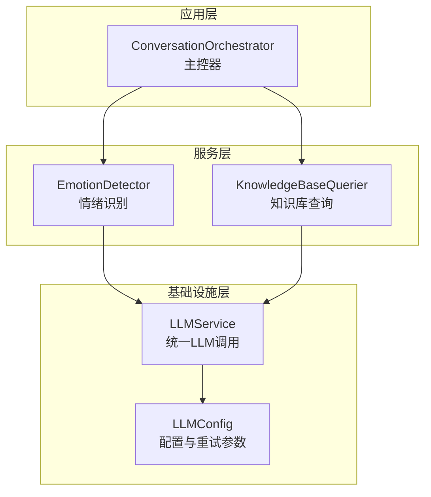
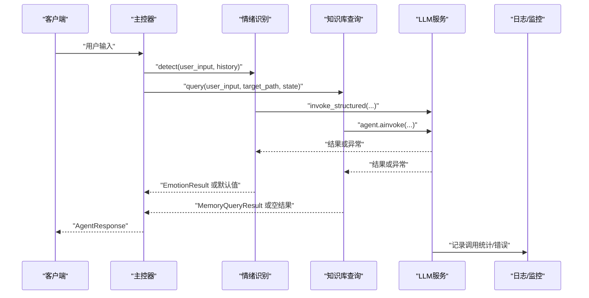
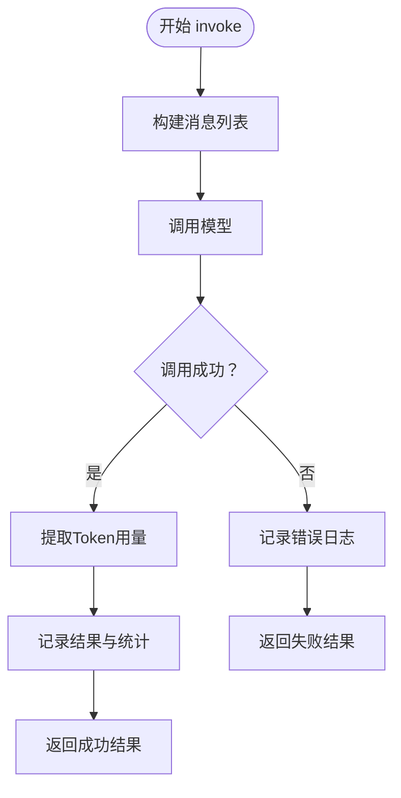
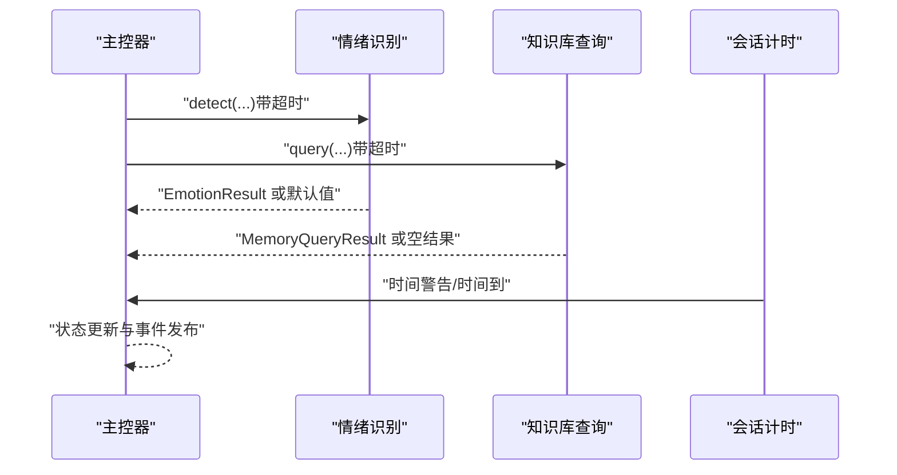
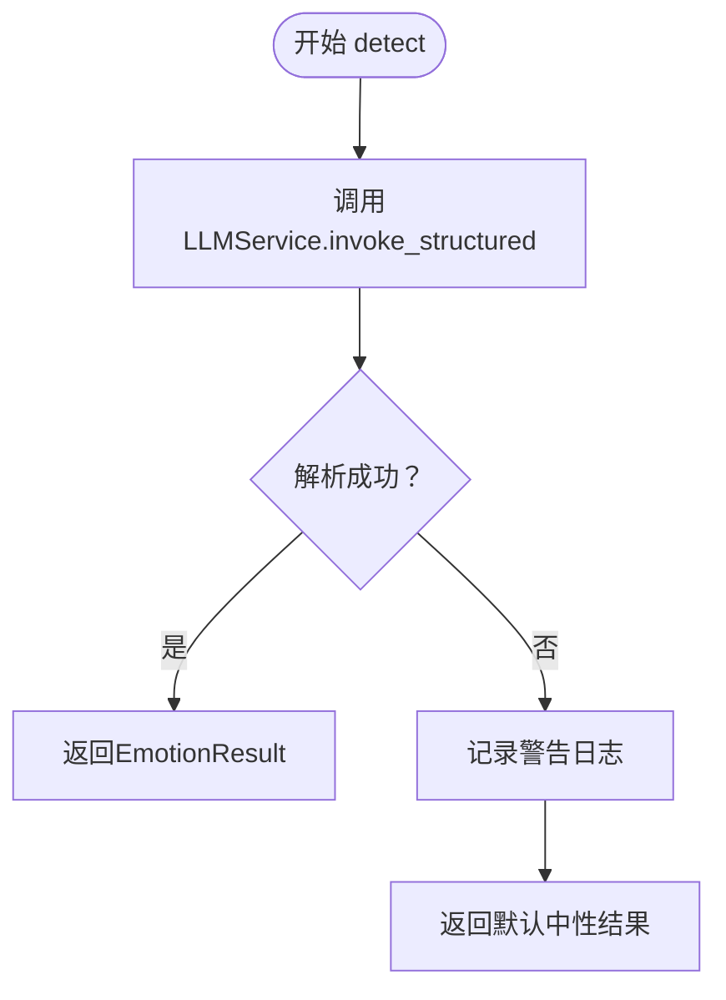
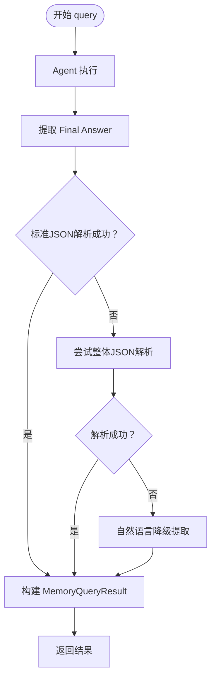
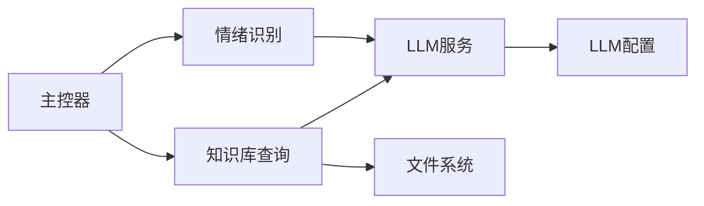

# 错误处理和监控

<cite>
**本文档引用的文件**
- [src/services/llm_service.py](file://src/services/llm_service.py)
- [src/config/llm_config.py](file://src/config/llm_config.py)
- [src/core/conversation_orchestrator.py](file://src/core/conversation_orchestrator.py)
- [src/services/emotion_detector.py](file://src/services/emotion_detector.py)
- [src/services/knowledge_base_querier.py](file://src/services/knowledge_base_querier.py)
- [src/prompts/base.py](file://src/prompts/base.py)
- [tests/test_llm_service.py](file://tests/test_llm_service.py)
- [langgraph-agent-dev/references/production-checklist.md](file://langgraph-agent-dev/references/production-checklist.md)
</cite>

## 目录
1. [简介](#简介)
2. [项目结构](#项目结构)
3. [核心组件](#核心组件)
4. [架构总览](#架构总览)
5. [详细组件分析](#详细组件分析)
6. [依赖分析](#依赖分析)
7. [性能考虑](#性能考虑)
8. [故障排除指南](#故障排除指南)
9. [结论](#结论)
10. [附录](#附录)

## 简介
本文件面向服务端与集成开发者，系统化阐述本项目的错误处理与监控体系，重点覆盖：
- 错误处理机制设计：异常分类、错误传播与降级策略
- LLM调用错误处理流程：网络异常、API限制、模型错误与解析失败
- 监控与日志：调用统计、性能指标与错误追踪
- 重试机制：最大重试次数、等待时间与指数退避
- 诊断与排障：常见错误类型、解决步骤与预防措施
- 监控仪表板设计思路与关键指标定义

## 项目结构
围绕错误处理与监控的关键模块如下：
- LLM服务层：统一LLM调用、模板管理、重试与统计
- 主控器：协调各子服务，超时保护与状态管理
- 业务服务：情绪识别、知识库查询等，具备降级与容错
- 配置层：LLM配置与重试/超时参数
- 测试与参考：单元测试与生产检查清单（可观测性与告警）

图表来源
- [src/core/conversation_orchestrator.py:138-401](file://src/core/conversation_orchestrator.py#L138-L401)
- [src/services/emotion_detector.py:12-73](file://src/services/emotion_detector.py#L12-L73)
- [src/services/knowledge_base_querier.py:202-373](file://src/services/knowledge_base_querier.py#L202-L373)
- [src/services/llm_service.py:32-89](file://src/services/llm_service.py#L32-L89)
- [src/config/llm_config.py:10-41](file://src/config/llm_config.py#L10-L41)

章节来源
- [src/services/llm_service.py:32-89](file://src/services/llm_service.py#L32-L89)
- [src/config/llm_config.py:10-41](file://src/config/llm_config.py#L10-L41)
- [src/core/conversation_orchestrator.py:138-401](file://src/core/conversation_orchestrator.py#L138-L401)
- [src/services/emotion_detector.py:12-73](file://src/services/emotion_detector.py#L12-L73)
- [src/services/knowledge_base_querier.py:202-373](file://src/services/knowledge_base_querier.py#L202-L373)

## 核心组件
- LLMService：封装LangChain调用、模板加载、结构化输出解析、统计与重试
- ConversationOrchestrator：主控器，负责并行任务与超时保护，触发降级与交接
- EmotionDetector：情绪识别服务，结构化输出失败时使用默认值降级
- KnowledgeBaseQuerier：ReAct模式查询，解析失败时进行自然语言降级
- LLMConfig：集中配置重试次数、重试延迟与超时

章节来源
- [src/services/llm_service.py:20-481](file://src/services/llm_service.py#L20-L481)
- [src/core/conversation_orchestrator.py:138-401](file://src/core/conversation_orchestrator.py#L138-L401)
- [src/services/emotion_detector.py:12-73](file://src/services/emotion_detector.py#L12-L73)
- [src/services/knowledge_base_querier.py:202-373](file://src/services/knowledge_base_querier.py#L202-L373)
- [src/config/llm_config.py:10-41](file://src/config/llm_config.py#L10-L41)

## 架构总览
下图展示错误处理与监控在系统中的位置与交互：

图表来源
- [src/core/conversation_orchestrator.py:236-343](file://src/core/conversation_orchestrator.py#L236-L343)
- [src/services/emotion_detector.py:39-73](file://src/services/emotion_detector.py#L39-L73)
- [src/services/knowledge_base_querier.py:257-372](file://src/services/knowledge_base_querier.py#L257-L372)
- [src/services/llm_service.py:225-291](file://src/services/llm_service.py#L225-L291)

## 详细组件分析

### LLMService：统一错误处理与重试
- 设计要点
  - 统一封装LangChain调用，支持基础调用、模板调用与结构化输出
  - 统一错误捕获与降级：异常转为失败结果并记录错误
  - 结构化输出解析失败时，将失败标记写回结果并返回
  - 统一统计：总调用次数、总Token消耗、成功率、平均耗时
  - 重试机制：指数退避，最大重试次数可配置
- 关键流程
  - 基础调用：构建消息列表，调用模型，提取Token用量，记录结果与统计
  - 结构化输出：先调用LLM，再解析JSON；解析失败时降级并标注错误
  - 重试：循环尝试，指数等待，抛出最后一次异常
- 监控与日志
  - 成功/失败均记录日志，便于审计与追踪
  - 统计接口提供调用次数、成功率、平均耗时、Token总量

图表来源
- [src/services/llm_service.py:225-291](file://src/services/llm_service.py#L225-L291)

章节来源
- [src/services/llm_service.py:20-481](file://src/services/llm_service.py#L20-L481)

### ConversationOrchestrator：超时保护与状态管理
- 设计要点
  - 并行启动关键任务（情绪识别、知识库查询），设置超时保护
  - 超时降级：情绪识别与知识库查询分别返回默认值或空结果
  - 会话计时：时间警告与“时间到”处理，触发结束引导与交接
  - 事件发布：会话开始、轮次完成、时间警告、会话终止等事件
- 错误传播
  - 子服务异常不影响主流程，通过降级与默认值保证可用性
  - 会话终止时触发交接包准备

图表来源
- [src/core/conversation_orchestrator.py:236-343](file://src/core/conversation_orchestrator.py#L236-L343)
- [src/core/conversation_orchestrator.py:570-592](file://src/core/conversation_orchestrator.py#L570-L592)

章节来源
- [src/core/conversation_orchestrator.py:138-401](file://src/core/conversation_orchestrator.py#L138-L401)

### EmotionDetector：结构化输出降级
- 设计要点
  - 使用模板与结构化输出，期望返回标准化模型
  - 解析失败时记录警告并返回默认中性情绪结果
- 降级策略
  - 返回预设的中性情绪结果，避免影响后续流程

图表来源
- [src/services/emotion_detector.py:39-73](file://src/services/emotion_detector.py#L39-L73)

章节来源
- [src/services/emotion_detector.py:12-73](file://src/services/emotion_detector.py#L12-L73)

### KnowledgeBaseQuerier：ReAct解析降级
- 设计要点
  - ReAct Agent在受限路径内探索，最终输出“最终答案”
  - 解析失败时进行自然语言降级：提取来源文件、构造标准结构
  - 未找到直接结果时返回探索报告作为备选
- 降级策略
  - 优先标准JSON解析；失败则尝试整体JSON解析；再失败则自然语言提取并构造最小有效结构

图表来源
- [src/services/knowledge_base_querier.py:435-511](file://src/services/knowledge_base_querier.py#L435-L511)

章节来源
- [src/services/knowledge_base_querier.py:202-540](file://src/services/knowledge_base_querier.py#L202-L540)

### Prompt模板与配置：错误处理前置保障
- Prompt模板：提供变量校验与渲染能力，减少因模板变量缺失导致的调用失败
- LLM配置：集中管理重试次数、重试延迟与超时，便于统一治理

章节来源
- [src/prompts/base.py:6-33](file://src/prompts/base.py#L6-L33)
- [src/config/llm_config.py:10-41](file://src/config/llm_config.py#L10-L41)

## 依赖分析
- 组件耦合
  - 主控器依赖多个服务，服务间通过LLMService解耦
  - LLMService依赖配置与模板，内部聚合统计与重试
- 外部依赖
  - LangChain模型与Agent框架
  - 文件系统（知识库查询）
- 潜在风险
  - 知识库路径越界与工具调用失败的风险，已在工具层进行路径校验与异常捕获

图表来源
- [src/core/conversation_orchestrator.py:173-185](file://src/core/conversation_orchestrator.py#L173-L185)
- [src/services/emotion_detector.py:30-37](file://src/services/emotion_detector.py#L30-L37)
- [src/services/knowledge_base_querier.py:220-234](file://src/services/knowledge_base_querier.py#L220-L234)
- [src/services/llm_service.py:71-89](file://src/services/llm_service.py#L71-L89)

章节来源
- [src/core/conversation_orchestrator.py:138-401](file://src/core/conversation_orchestrator.py#L138-L401)
- [src/services/emotion_detector.py:12-73](file://src/services/emotion_detector.py#L12-L73)
- [src/services/knowledge_base_querier.py:202-373](file://src/services/knowledge_base_querier.py#L202-L373)
- [src/services/llm_service.py:32-89](file://src/services/llm_service.py#L32-L89)

## 性能考虑
- 并行与超时：主控器对关键任务设置超时，避免阻塞
- 指数退避：LLM调用采用指数退避重试，降低抖动
- 统计指标：提供成功率、平均耗时、Token总量，便于容量与成本评估
- 建议
  - 为关键路径增加更细粒度的指标回调（如LangSmith回调）
  - 对高并发场景增加限流与熔断策略

[本节为通用指导，无需具体文件分析]

## 故障排除指南

### 常见错误类型与定位
- LLM调用失败
  - 现象：调用返回失败结果，错误信息包含异常详情
  - 定位：查看日志中的错误记录；确认模板变量是否完整；检查网络连通性
- 结构化输出解析失败
  - 现象：结构化调用返回None，原始结果标记为失败
  - 定位：检查LLM输出是否符合JSON格式；确认模板是否要求特定格式
- 知识库查询解析失败
  - 现象：最终答案非标准JSON，触发自然语言降级
  - 定位：检查Agent输出格式；确认受限路径内文件是否存在
- 超时与降级
  - 现象：情绪识别或知识库查询返回默认值
  - 定位：调整超时阈值；优化查询策略；检查外部依赖性能

章节来源
- [src/services/llm_service.py:285-291](file://src/services/llm_service.py#L285-L291)
- [src/services/llm_service.py:394-398](file://src/services/llm_service.py#L394-L398)
- [src/services/knowledge_base_querier.py:435-511](file://src/services/knowledge_base_querier.py#L435-L511)
- [src/core/conversation_orchestrator.py:287-301](file://src/core/conversation_orchestrator.py#L287-L301)

### 解决步骤
- LLM调用失败
  - 检查API密钥与基础URL配置
  - 启用重试并观察指数退避效果
  - 查看统计接口确认成功率与耗时趋势
- 结构化输出解析失败
  - 确认模板输出格式要求
  - 对LLM输出进行清洗（去除多余文本，保留JSON）
- 知识库查询失败
  - 确认目标路径存在且可访问
  - 使用探索报告辅助定位相关文件
- 超时问题
  - 适当提高超时阈值
  - 优化查询策略，减少不必要的工具调用

章节来源
- [src/services/llm_service.py:400-437](file://src/services/llm_service.py#L400-L437)
- [src/services/llm_service.py:327-398](file://src/services/llm_service.py#L327-L398)
- [src/services/knowledge_base_querier.py:280-372](file://src/services/knowledge_base_querier.py#L280-L372)
- [src/core/conversation_orchestrator.py:287-301](file://src/core/conversation_orchestrator.py#L287-L301)

### 预防措施
- 配置层面：统一配置重试与超时参数，避免分散配置
- 模板层面：提供变量校验与渲染，减少调用前错误
- 监控层面：启用日志与统计，建立告警阈值

章节来源
- [src/config/llm_config.py:10-41](file://src/config/llm_config.py#L10-L41)
- [src/prompts/base.py:24-33](file://src/prompts/base.py#L24-L33)
- [langgraph-agent-dev/references/production-checklist.md:486-524](file://langgraph-agent-dev/references/production-checklist.md#L486-L524)

## 结论
本项目通过“统一LLM服务 + 主控器超时保护 + 服务级降级”的组合，实现了稳健的错误处理与可观测性。LLMService提供统一的重试与统计，主控器在关键路径引入超时保护与事件驱动的状态管理，业务服务在结构化输出与解析失败时采用明确的降级策略。配合生产检查清单中的监控与告警建议，可进一步完善线上治理。

[本节为总结，无需具体文件分析]

## 附录

### 重试机制设计
- 最大重试次数：由配置提供，可在服务层覆盖
- 等待时间：指数退避（2^attempt 秒）
- 触发条件：异常发生即重试，直至达到最大次数或最终失败

章节来源
- [src/services/llm_service.py:400-437](file://src/services/llm_service.py#L400-L437)
- [src/config/llm_config.py:35-40](file://src/config/llm_config.py#L35-L40)

### 监控与日志
- 日志记录：调用成功/失败、错误详情、重试过程
- 统计接口：总调用次数、总Token、成功率、平均耗时
- 生产检查清单：提供LangSmith追踪、自定义指标回调与Prometheus告警配置示例

章节来源
- [src/services/llm_service.py:449-456](file://src/services/llm_service.py#L449-L456)
- [langgraph-agent-dev/references/production-checklist.md:29-137](file://langgraph-agent-dev/references/production-checklist.md#L29-L137)
- [langgraph-agent-dev/references/production-checklist.md:486-524](file://langgraph-agent-dev/references/production-checklist.md#L486-L524)

### 仪表板设计思路与关键指标
- 指标建议
  - LLM调用成功率、P95响应时间、Token使用量、错误率
  - 工具调用失败率、会话时长分布、情绪识别与知识库查询命中率
- 可视化建议
  - 实时趋势图、分位数曲线、错误类型分布、Top N错误堆栈
- 告警阈值
  - 参考生产检查清单中的阈值设定，结合业务SLA调整

章节来源
- [langgraph-agent-dev/references/production-checklist.md:486-524](file://langgraph-agent-dev/references/production-checklist.md#L486-L524)

### 测试验证点
- 成功调用、重试机制、模板调用、结构化输出与解析失败、统计与清空历史、模板加载、调用失败
- 覆盖主要错误路径与降级分支

章节来源
- [tests/test_llm_service.py:24-187](file://tests/test_llm_service.py#L24-L187)