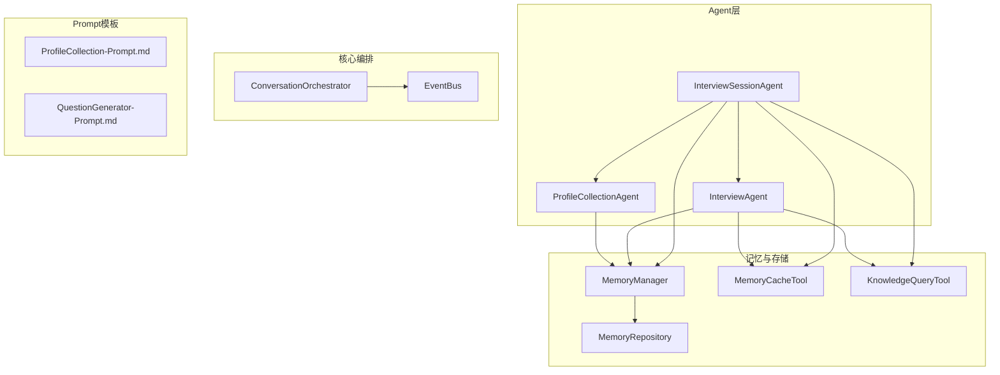
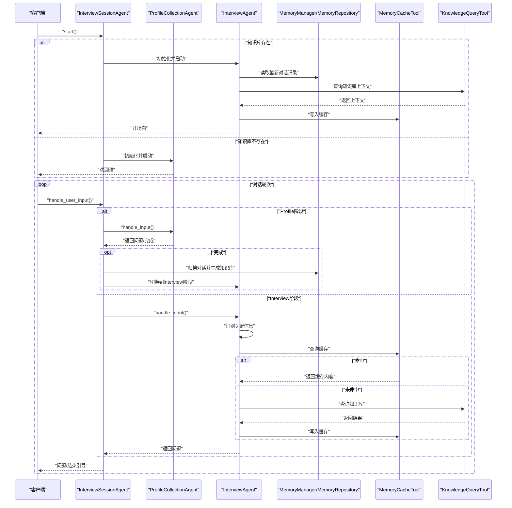
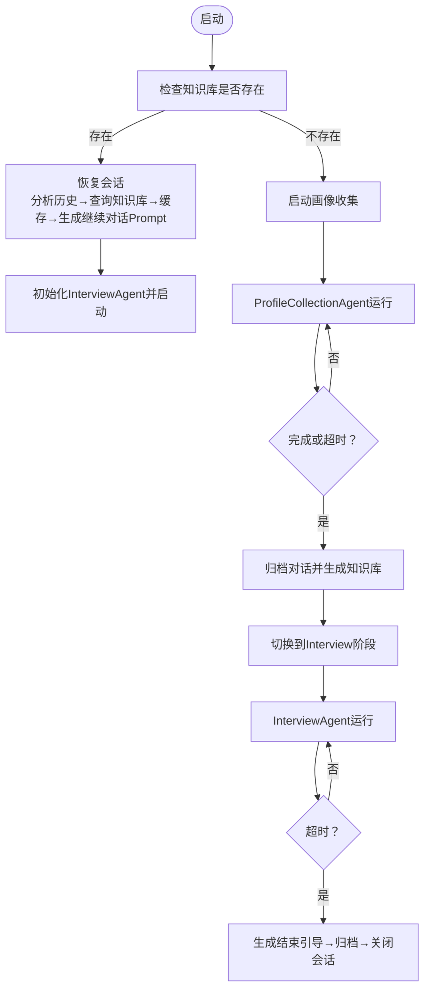
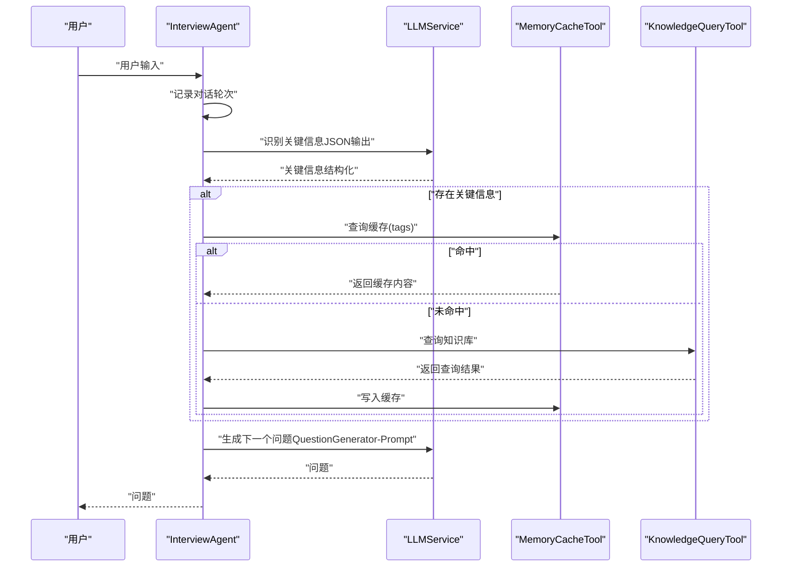
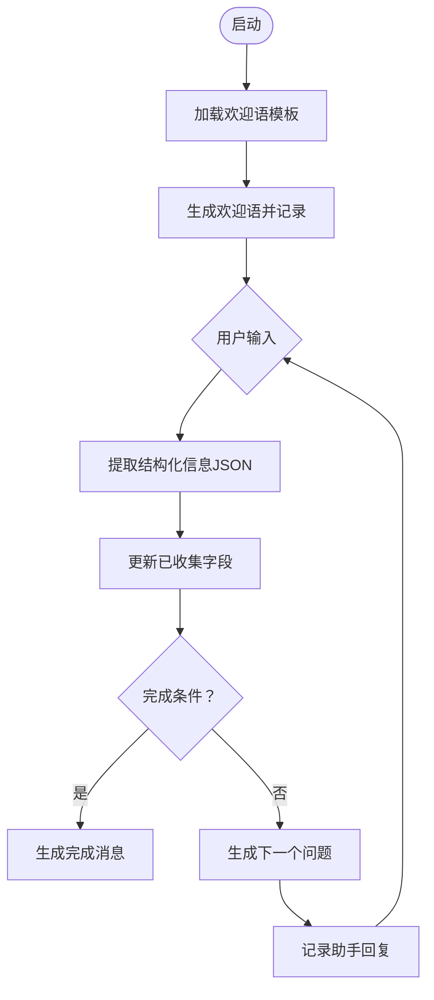
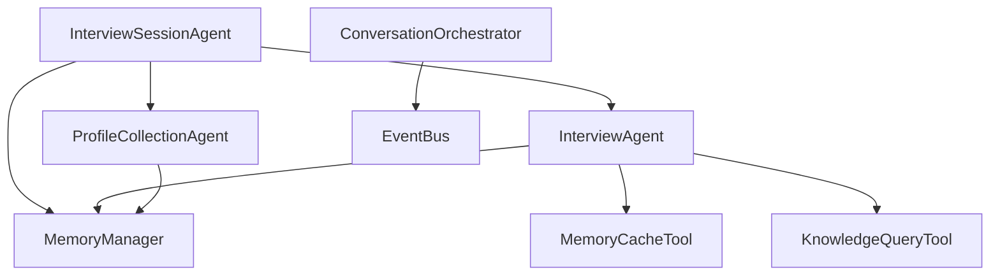

# Agent协调机制

<cite>
**本文引用的文件**
- [src/agents/interview_agent.py](file://src/agents/interview_agent.py)
- [src/agents/profile_collection_agent.py](file://src/agents/profile_collection_agent.py)
- [src/agents/interview_session_agent.py](file://src/agents/interview_session_agent.py)
- [src/core/conversation_orchestrator.py](file://src/core/conversation_orchestrator.py)
- [src/core/event_bus.py](file://src/core/event_bus.py)
- [src/models/session_state.py](file://src/models/session_state.py)
- [src/enums/state_type.py](file://src/enums/state_type.py)
- [src/enums/phase_type.py](file://src/enums/phase_type.py)
- [src/tools/memory_cache_tool.py](file://src/tools/memory_cache_tool.py)
- [src/tools/knowledge_query_tool.py](file://src/tools/knowledge_query_tool.py)
- [src/storage/memory_repository.py](file://src/storage/memory_repository.py)
- [src/services/memory_manager.py](file://src/services/memory_manager.py)
- [Prompts/ProfileCollection-Prompt.md](file://Prompts/ProfileCollection-Prompt.md)
- [Prompts/QuestionGenerator-Prompt.md](file://Prompts/QuestionGenerator-Prompt.md)
- [tests/test_interview_session_agent.py](file://tests/test_interview_session_agent.py)
</cite>

## 目录
1. [简介](#简介)
2. [项目结构](#项目结构)
3. [核心组件](#核心组件)
4. [架构总览](#架构总览)
5. [详细组件分析](#详细组件分析)
6. [依赖分析](#依赖分析)
7. [性能考量](#性能考量)
8. [故障排查指南](#故障排查指南)
9. [结论](#结论)
10. [附录](#附录)

## 简介
本文件面向多Agent协作架构，聚焦InterviewAgent（主体采访）、ProfileCollectionAgent（画像收集）、InterviewSessionAgent（会话管理）三大Agent的职责分工、协作模式、通信协议与数据交换机制、生命周期管理、状态管理与转换、配置与参数调优、监控与调试方法。文档基于仓库源码与Prompt模板进行系统化梳理，旨在帮助开发者与产品人员快速理解并高效运维该系统。

## 项目结构
- Agent层：InterviewAgent、ProfileCollectionAgent、InterviewSessionAgent
- 核心编排：ConversationOrchestrator（独立模块，亦可作为参考）
- 事件总线：EventBus（解耦组件间通信）
- 记忆与存储：MemoryManager、MemoryRepository、MemoryCacheTool、KnowledgeQueryTool
- Prompt模板：ProfileCollection-Prompt.md、QuestionGenerator-Prompt.md
- 测试：tests/test_interview_session_agent.py

图表来源
- [src/agents/interview_session_agent.py:112-482](file://src/agents/interview_session_agent.py#L112-L482)
- [src/agents/interview_agent.py:80-346](file://src/agents/interview_agent.py#L80-L346)
- [src/agents/profile_collection_agent.py:98-275](file://src/agents/profile_collection_agent.py#L98-L275)
- [src/core/conversation_orchestrator.py:138-658](file://src/core/conversation_orchestrator.py#L138-L658)
- [src/core/event_bus.py:40-182](file://src/core/event_bus.py#L40-L182)
- [src/services/memory_manager.py:27-470](file://src/services/memory_manager.py#L27-L470)
- [src/storage/memory_repository.py:40-359](file://src/storage/memory_repository.py#L40-L359)
- [src/tools/memory_cache_tool.py:8-89](file://src/tools/memory_cache_tool.py#L8-L89)
- [src/tools/knowledge_query_tool.py:11-81](file://src/tools/knowledge_query_tool.py#L11-L81)
- [Prompts/ProfileCollection-Prompt.md:1-405](file://Prompts/ProfileCollection-Prompt.md#L1-L405)
- [Prompts/QuestionGenerator-Prompt.md:1-352](file://Prompts/QuestionGenerator-Prompt.md#L1-L352)

章节来源
- [src/agents/interview_session_agent.py:33-52](file://src/agents/interview_session_agent.py#L33-L52)
- [src/agents/interview_agent.py:16-35](file://src/agents/interview_agent.py#L16-L35)
- [src/agents/profile_collection_agent.py:14-32](file://src/agents/profile_collection_agent.py#L14-L32)

## 核心组件
- InterviewSessionAgent：会话生命周期与阶段调度，负责判断老用户/新用户、初始化ProfileCollectionAgent、启动InterviewAgent、时间控制、归档与结束流程。
- InterviewAgent：主体采访Agent，负责开场白、问题生成、关键信息识别、知识库查询与缓存、对话轮次记录、结束引导。
- ProfileCollectionAgent：用户画像收集Agent，负责渐进式收集基础信息、提取结构化字段、生成自然问题、完成条件判断。
- ConversationOrchestrator：独立的对话主控器（可作为参考），提供统一的会话状态、计时、事件发布、情绪检测、知识查询、问题生成、交接流程等能力。
- EventBus：事件总线，支持同步/异步订阅与发布，用于解耦组件通信。
- MemoryManager/MemoryRepository：记忆管理与存储，提供短期/长期/画像记忆的读写、结构化整理、索引与查询。
- MemoryCacheTool/KnowledgeQueryTool：缓存与知识库查询工具，封装查询与缓存逻辑。
- Prompt模板：ProfileCollection-Prompt.md、QuestionGenerator-Prompt.md，定义Agent行为与输出格式。

章节来源
- [src/agents/interview_session_agent.py:33-130](file://src/agents/interview_session_agent.py#L33-L130)
- [src/agents/interview_agent.py:16-114](file://src/agents/interview_agent.py#L16-L114)
- [src/agents/profile_collection_agent.py:14-98](file://src/agents/profile_collection_agent.py#L14-L98)
- [src/core/conversation_orchestrator.py:138-234](file://src/core/conversation_orchestrator.py#L138-L234)
- [src/core/event_bus.py:40-182](file://src/core/event_bus.py#L40-L182)
- [src/services/memory_manager.py:27-157](file://src/services/memory_manager.py#L27-L157)
- [src/storage/memory_repository.py:40-120](file://src/storage/memory_repository.py#L40-L120)
- [src/tools/memory_cache_tool.py:8-89](file://src/tools/memory_cache_tool.py#L8-L89)
- [src/tools/knowledge_query_tool.py:11-81](file://src/tools/knowledge_query_tool.py#L11-L81)
- [Prompts/ProfileCollection-Prompt.md:1-405](file://Prompts/ProfileCollection-Prompt.md#L1-L405)
- [Prompts/QuestionGenerator-Prompt.md:1-352](file://Prompts/QuestionGenerator-Prompt.md#L1-L352)

## 架构总览
InterviewSessionAgent作为会话主控，根据用户知识库存在性决定流程分支：新用户走ProfileCollectionAgent，老用户走InterviewAgent；两者均依赖MemoryManager/MemoryRepository进行记忆读写，使用MemoryCacheTool进行短期缓存，使用KnowledgeQueryTool进行知识库查询；InterviewAgent内部使用QuestionGenerator-Prompt.md生成问题，ProfileCollectionAgent使用ProfileCollection-Prompt.md进行信息抽取与问题生成；EventBus用于事件发布与监听（ConversationOrchestrator中体现）。

图表来源
- [src/agents/interview_session_agent.py:112-482](file://src/agents/interview_session_agent.py#L112-L482)
- [src/agents/interview_agent.py:115-184](file://src/agents/interview_agent.py#L115-L184)
- [src/agents/profile_collection_agent.py:130-166](file://src/agents/profile_collection_agent.py#L130-L166)
- [src/tools/memory_cache_tool.py:34-84](file://src/tools/memory_cache_tool.py#L34-L84)
- [src/tools/knowledge_query_tool.py:33-66](file://src/tools/knowledge_query_tool.py#L33-L66)
- [src/services/memory_manager.py:95-105](file://src/services/memory_manager.py#L95-L105)

章节来源
- [src/agents/interview_session_agent.py:112-270](file://src/agents/interview_session_agent.py#L112-L270)
- [src/agents/interview_agent.py:115-184](file://src/agents/interview_agent.py#L115-L184)
- [src/agents/profile_collection_agent.py:130-166](file://src/agents/profile_collection_agent.py#L130-L166)

## 详细组件分析

### InterviewSessionAgent（会话管理）
- 职责
  - 会话生命周期管理：启动、阶段切换、时间控制、归档、结束。
  - 流程调度：新用户→画像收集；老用户→恢复会话→采访。
  - 知识库检查与恢复：检查用户知识库结构完整性，加载历史并生成继续对话的Prompt。
  - 子Agent协调：创建并委派ProfileCollectionAgent与InterviewAgent。
- 关键流程
  - 启动：检查知识库存在性，决定分支。
  - 恢复会话：分析历史、查询知识库、缓存、生成继续对话Prompt，初始化InterviewAgent。
  - 画像收集：创建ProfileCollectionAgent，持续运行直至完成或超时。
  - 采访阶段：时间控制（15分钟总时长，含初始化5分钟），前5分钟归档，超时进入结束流程。
  - 结束：生成结束引导，归档对话，关闭会话。
- 时间控制
  - 总时长：15分钟；初始化独立限制：5分钟；采访阶段（新用户）：10分钟；（老用户）：15分钟。
  - 警告阈值：80%时发出时间警告。
- 数据交换
  - 会话状态：SessionState（会话ID、阶段、策略、覆盖率、对话历史、待追问问题等）。
  - 历史记录：通过MemoryRepository读取最新对话记录。
  - 缓存：MemoryCacheTool短期缓存，避免重复查询。
  - 知识库：KnowledgeQueryTool封装查询，返回格式化结果。

图表来源
- [src/agents/interview_session_agent.py:112-482](file://src/agents/interview_session_agent.py#L112-L482)
- [src/models/session_state.py:24-139](file://src/models/session_state.py#L24-L139)

章节来源
- [src/agents/interview_session_agent.py:33-130](file://src/agents/interview_session_agent.py#L33-L130)
- [src/agents/interview_session_agent.py:178-270](file://src/agents/interview_session_agent.py#L178-L270)
- [src/agents/interview_session_agent.py:271-392](file://src/agents/interview_session_agent.py#L271-L392)
- [src/models/session_state.py:24-139](file://src/models/session_state.py#L24-L139)

### InterviewAgent（主体采访）
- 职责
  - 开场白生成、问题生成、关键信息识别、知识库查询与缓存、对话轮次记录、结束引导。
- 核心流程
  - start：若无resume_prompt，使用标准开场模板生成开场白。
  - handle_input：记录用户回答→识别关键信息→缓存命中/查询知识库→更新缓存→生成下一个问题→时间检查。
  - generate_ending：加载结束引导Prompt，注入会话时长、轮次、历史、收集事件，生成结束引导内容。
- 关键机制
  - 关键信息识别：调用LLM识别事件/人物/时间点/地点，返回结构化数据。
  - 知识库查询：通过KnowledgeQueryTool查询，避免重复查询（使用current_round_queries集合）。
  - 缓存：MemoryCacheTool按关键词标签缓存，命中则直接使用。
  - 时间控制：80%时长加入时间提示，超时标记is_completed。
- Prompt使用
  - QuestionGenerator-Prompt.md用于生成问题。
  - SessionEndGuide-Prompt.md用于结束引导。

图表来源
- [src/agents/interview_agent.py:115-184](file://src/agents/interview_agent.py#L115-L184)
- [src/agents/interview_agent.py:186-243](file://src/agents/interview_agent.py#L186-L243)
- [src/agents/interview_agent.py:244-272](file://src/agents/interview_agent.py#L244-L272)
- [src/tools/memory_cache_tool.py:34-84](file://src/tools/memory_cache_tool.py#L34-L84)
- [src/tools/knowledge_query_tool.py:33-66](file://src/tools/knowledge_query_tool.py#L33-L66)
- [Prompts/QuestionGenerator-Prompt.md:1-352](file://Prompts/QuestionGenerator-Prompt.md#L1-L352)

章节来源
- [src/agents/interview_agent.py:16-114](file://src/agents/interview_agent.py#L16-L114)
- [src/agents/interview_agent.py:115-184](file://src/agents/interview_agent.py#L115-L184)
- [src/agents/interview_agent.py:186-272](file://src/agents/interview_agent.py#L186-L272)

### ProfileCollectionAgent（画像收集）
- 职责
  - 渐进式收集用户基础信息（14个字段），自然对话，从用户回答中提取结构化信息，生成下一个问题。
- 核心流程
  - start：加载profile_welcome模板，注入变量，生成欢迎语并记录。
  - handle_input：记录用户输入→提取信息→检查完成条件→生成下一个问题→记录助手回复。
  - 完成条件：必填字段齐全或对话超时（默认5分钟）。
- Prompt使用
  - ProfileCollection-Prompt.md包含欢迎语、信息提取、问题生成三个模板片段。
- 数据结构
  - collected_info：已收集字段字典。
  - conversation_history：对话历史。
  - required_fields：必填字段清单。

图表来源
- [src/agents/profile_collection_agent.py:98-166](file://src/agents/profile_collection_agent.py#L98-L166)
- [src/agents/profile_collection_agent.py:168-213](file://src/agents/profile_collection_agent.py#L168-L213)
- [src/agents/profile_collection_agent.py:228-254](file://src/agents/profile_collection_agent.py#L228-L254)
- [Prompts/ProfileCollection-Prompt.md:44-331](file://Prompts/ProfileCollection-Prompt.md#L44-L331)

章节来源
- [src/agents/profile_collection_agent.py:14-98](file://src/agents/profile_collection_agent.py#L14-L98)
- [src/agents/profile_collection_agent.py:130-166](file://src/agents/profile_collection_agent.py#L130-L166)
- [src/agents/profile_collection_agent.py:214-254](file://src/agents/profile_collection_agent.py#L214-L254)

### ConversationOrchestrator（对话主控器，参考）
- 职责
  - 统一对话状态、计时、事件发布、情绪检测、知识查询、问题生成、交接流程。
- 关键机制
  - OrchestratorConfig：会话时长、时间警告阈值、画像收集开关等配置。
  - SessionTiming：会话计时器，支持剩余时间计算、警告与时间到标记。
  - ProfileData：用户画像数据结构，支持状态机（INIT_PROFILE→COLLECT_BASIC→COLLECT_DETAIL→READY）。
  - 并行异步任务：情绪检测、知识查询、内容归纳，带超时保护。
  - 事件总线：发布TURN_COMPLETED、SESSION_TIME_WARNING、SESSION_TERMINATED等事件。
- 与Agent的关系
  - InterviewSessionAgent更贴近当前实现，ConversationOrchestrator提供了更完整的编排思路与事件机制，可作为扩展参考。

章节来源
- [src/core/conversation_orchestrator.py:29-94](file://src/core/conversation_orchestrator.py#L29-L94)
- [src/core/conversation_orchestrator.py:138-234](file://src/core/conversation_orchestrator.py#L138-L234)
- [src/core/conversation_orchestrator.py:236-344](file://src/core/conversation_orchestrator.py#L236-L344)
- [src/core/conversation_orchestrator.py:391-401](file://src/core/conversation_orchestrator.py#L391-L401)
- [src/core/conversation_orchestrator.py:570-592](file://src/core/conversation_orchestrator.py#L570-L592)
- [src/core/event_bus.py:40-182](file://src/core/event_bus.py#L40-L182)

## 依赖分析
- 组件耦合
  - InterviewSessionAgent依赖ProfileCollectionAgent与InterviewAgent，形成父子Agent关系；同时依赖MemoryManager、MemoryCacheTool、KnowledgeQueryTool。
  - InterviewAgent依赖MemoryManager、MemoryCacheTool、KnowledgeQueryTool、LLMService、QuestionGenerator。
  - ProfileCollectionAgent依赖MemoryManager、LLMService、ProfileCollection-Prompt.md。
  - ConversationOrchestrator与EventBus解耦，通过事件发布实现松耦合。
- 外部依赖
  - LLMService：统一的LLM调用入口，支持结构化输出与模板。
  - 文件系统：MarkdownFileManager用于知识库文件读写。
  - 缓存：MemoryCacheTool（内存）用于短期缓存。
- 潜在循环依赖
  - 当前文件组织未见循环导入；InterviewSessionAgent与两个子Agent单向依赖，MemoryManager与MemoryRepository单向依赖。

图表来源
- [src/agents/interview_session_agent.py:90-105](file://src/agents/interview_session_agent.py#L90-L105)
- [src/agents/interview_agent.py:58-78](file://src/agents/interview_agent.py#L58-L78)
- [src/agents/profile_collection_agent.py:42-48](file://src/agents/profile_collection_agent.py#L42-L48)
- [src/core/conversation_orchestrator.py:173-187](file://src/core/conversation_orchestrator.py#L173-L187)
- [src/core/event_bus.py:40-58](file://src/core/event_bus.py#L40-L58)

章节来源
- [src/agents/interview_session_agent.py:90-105](file://src/agents/interview_session_agent.py#L90-L105)
- [src/agents/interview_agent.py:58-78](file://src/agents/interview_agent.py#L58-L78)
- [src/agents/profile_collection_agent.py:42-48](file://src/agents/profile_collection_agent.py#L42-L48)
- [src/core/conversation_orchestrator.py:173-187](file://src/core/conversation_orchestrator.py#L173-L187)

## 性能考量
- 异步与并发
  - InterviewSessionAgent在采访阶段对前5分钟进行归档，避免长时间占用内存；InterviewAgent在识别关键信息后并行查询缓存与知识库，减少等待。
- 缓存策略
  - MemoryCacheTool按关键词标签缓存，命中率高时可显著降低知识库查询成本；InterviewSessionAgent使用current_round_queries避免重复查询。
- I/O与存储
  - MemoryRepository采用LRU缓存与索引，控制内存占用；文件系统读写通过MarkdownFileManager抽象，便于替换实现。
- 超时与降级
  - ConversationOrchestrator对情绪检测与知识查询设置超时，超时后使用默认值或空结果，保证流程稳定性。
- 参数建议
  - 会话时长：15分钟（InterviewSessionAgent），初始化5分钟（ProfileCollectionAgent）。
  - 时间警告阈值：80%（InterviewAgent）。
  - 缓存容量：MemoryRepository默认100，可根据会话规模调整。
  - 查询迭代次数：KnowledgeQueryTool默认5次，避免过度查询。

章节来源
- [src/agents/interview_session_agent.py:346-358](file://src/agents/interview_session_agent.py#L346-L358)
- [src/agents/interview_agent.py:134-162](file://src/agents/interview_agent.py#L134-L162)
- [src/storage/memory_repository.py:16-38](file://src/storage/memory_repository.py#L16-L38)
- [src/core/conversation_orchestrator.py:286-302](file://src/core/conversation_orchestrator.py#L286-L302)

## 故障排查指南
- 知识库检查失败
  - 现象：_check_knowledge_base返回False。
  - 排查：确认知识库目录结构是否完整（events、people、timeline、themes等目录及子目录），是否存在除index.md外的其他Markdown文件。
  - 参考测试：tests/test_interview_session_agent.py验证不同场景。
- 缓存未命中导致查询频繁
  - 现象：知识库查询耗时增加。
  - 排查：检查MemoryCacheTool的tags是否覆盖关键信息；确认InterviewAgent的_key_info是否正确提取。
- 会话超时或时间警告
  - 现象：InterviewAgent在80%时长提示，超时后标记完成。
  - 排查：检查_start_time与_duration_minutes设置；确认_handle_interview_input的时间检查逻辑。
- 事件总线未触发
  - 现象：外部无法监听会话事件。
  - 排查：确认EventBus订阅与发布；ConversationOrchestrator中事件发布逻辑。
- 归档失败
  - 现象：前5分钟或结束时未生成归档。
  - 排查：检查MemoryManager的归档接口调用与文件权限；确认KnowledgeQueryTool的目标路径包含user_id。

章节来源
- [tests/test_interview_session_agent.py:15-77](file://tests/test_interview_session_agent.py#L15-L77)
- [src/agents/interview_session_agent.py:131-177](file://src/agents/interview_session_agent.py#L131-L177)
- [src/agents/interview_agent.py:274-282](file://src/agents/interview_agent.py#L274-L282)
- [src/core/event_bus.py:108-171](file://src/core/event_bus.py#L108-L171)
- [src/tools/knowledge_query_tool.py:56-66](file://src/tools/knowledge_query_tool.py#L56-L66)

## 结论
该多Agent协作架构以InterviewSessionAgent为核心，通过ProfileCollectionAgent与InterviewAgent分别承担“画像收集”和“主体采访”的职责，配合MemoryManager/MemoryRepository、MemoryCacheTool、KnowledgeQueryTool实现高效的记忆与知识管理；InterviewAgent内部使用结构化Prompt生成问题，具备关键信息识别与缓存查询能力；InterviewSessionAgent负责会话生命周期与阶段切换，提供时间控制与归档机制。整体设计强调模块化、解耦与可扩展性，适合在生产环境中稳定运行与持续演进。

## 附录
- 状态枚举
  - StateType：INIT/WARMUP/COLLECT/DEEPEN/REDIRECT/PAUSE/HANDOFF
  - PhaseType：CHILDHOOD/YOUTH/YOUNG_ADULT/MIDDLE_AGE/ELDERLY
- 会话状态模型
  - SessionState：包含会话ID、阶段、策略、覆盖率、对话历史、待追问问题等字段，支持摘要与最近历史查询。

章节来源
- [src/enums/state_type.py:4-12](file://src/enums/state_type.py#L4-L12)
- [src/enums/phase_type.py:4-10](file://src/enums/phase_type.py#L4-L10)
- [src/models/session_state.py:24-139](file://src/models/session_state.py#L24-L139)