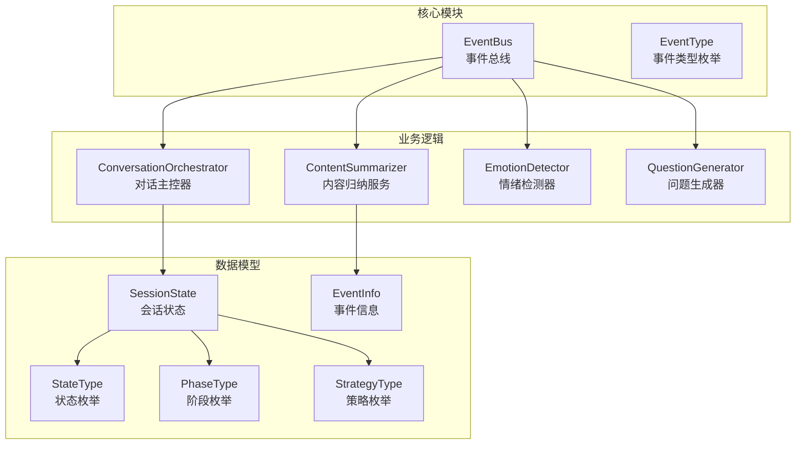
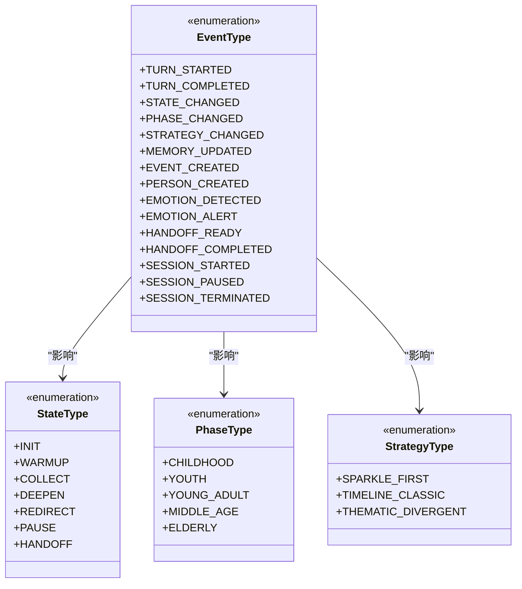
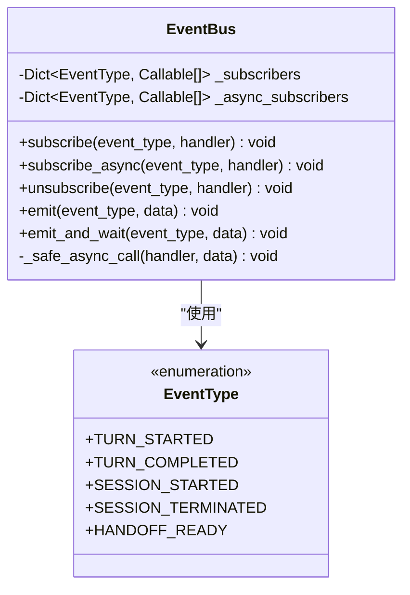
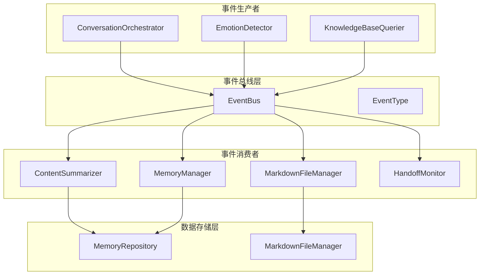
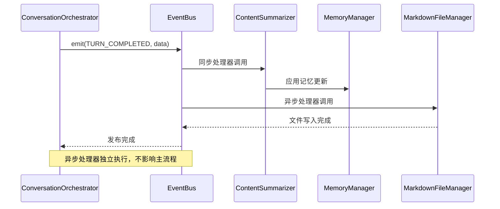
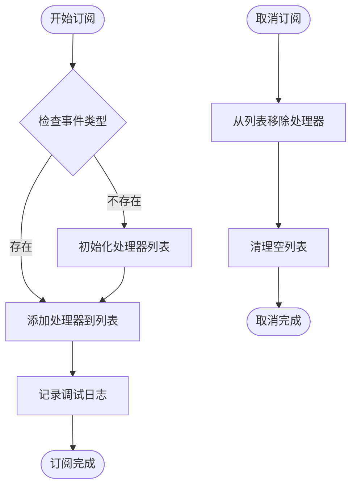
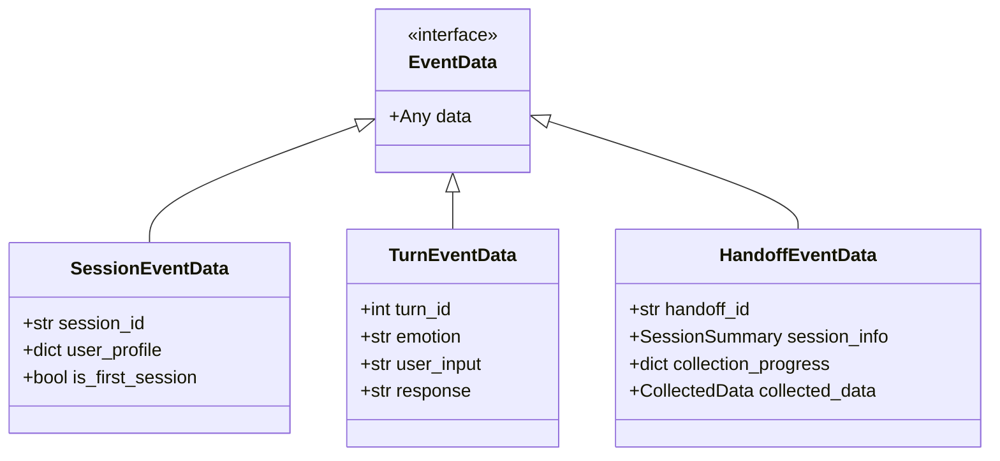
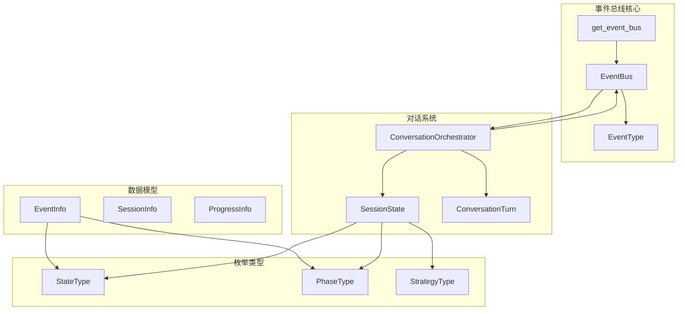

# 事件总线系统

<cite>
**本文档引用的文件**
- [event_bus.py](file://src/core/event_bus.py)
- [conversation_orchestrator.py](file://src/core/conversation_orchestrator.py)
- [event_info.py](file://src/models/event_info.py)
- [session_state.py](file://src/models/session_state.py)
- [state_type.py](file://src/enums/state_type.py)
- [phase_type.py](file://src/enums/phase_type.py)
- [strategy_type.py](file://src/enums/strategy_type.py)
- [test_event_bus.py](file://tests/test_session_state.py)
</cite>

## 目录
1. [简介](#简介)
2. [项目结构](#项目结构)
3. [核心组件](#核心组件)
4. [架构概览](#架构概览)
5. [详细组件分析](#详细组件分析)
6. [依赖关系分析](#依赖关系分析)
7. [性能考虑](#性能考虑)
8. [故障排除指南](#故障排除指南)
9. [结论](#结论)
10. [附录](#附录)

## 简介

事件总线系统是本项目的核心基础设施，采用事件驱动架构设计，实现了组件间的解耦通信和异步处理。该系统通过发布/订阅模式，为对话主控器、内容归纳服务、情绪检测器等组件提供了统一的消息传递机制。

事件总线系统的主要特点包括：
- **事件驱动架构**：基于事件的异步通信模式
- **发布/订阅模式**：支持组件间松耦合通信
- **多线程安全**：支持同步和异步处理器
- **可扩展性**：支持动态订阅和取消订阅
- **错误处理**：完善的异常捕获和日志记录

## 项目结构

事件总线系统主要分布在以下目录和文件中：



**图表来源**
- [event_bus.py:1-182](file://src/core/event_bus.py#L1-L182)
- [conversation_orchestrator.py:1-658](file://src/core/conversation_orchestrator.py#L1-L658)

**章节来源**
- [event_bus.py:1-182](file://src/core/event_bus.py#L1-L182)
- [conversation_orchestrator.py:1-658](file://src/core/conversation_orchestrator.py#L1-L658)

## 核心组件

### 事件类型枚举

事件总线系统定义了完整的事件类型体系，涵盖对话、状态、记忆、情绪、交接和会话等各个方面的事件：



**图表来源**
- [event_bus.py:10-37](file://src/core/event_bus.py#L10-L37)
- [state_type.py:4-12](file://src/enums/state_type.py#L4-L12)
- [phase_type.py:4-10](file://src/enums/phase_type.py#L4-L10)
- [strategy_type.py:4-8](file://src/enums/strategy_type.py#L4-L8)

### 事件总线核心类

EventBus类提供了完整的事件发布/订阅功能：



**图表来源**
- [event_bus.py:40-182](file://src/core/event_bus.py#L40-L182)

**章节来源**
- [event_bus.py:10-37](file://src/core/event_bus.py#L10-L37)
- [event_bus.py:40-182](file://src/core/event_bus.py#L40-L182)

## 架构概览

事件总线系统采用分层架构设计，实现了清晰的职责分离：



**图表来源**
- [conversation_orchestrator.py:17-187](file://src/core/conversation_orchestrator.py#L17-L187)
- [event_bus.py:40-182](file://src/core/event_bus.py#L40-L182)

## 详细组件分析

### 事件发布流程

事件发布采用异步非阻塞模式，确保主流程的流畅性：



**图表来源**
- [conversation_orchestrator.py:580-592](file://src/core/conversation_orchestrator.py#L580-L592)
- [event_bus.py:108-141](file://src/core/event_bus.py#L108-L141)

### 事件订阅管理

事件订阅采用动态管理机制，支持运行时的订阅和取消：



**图表来源**
- [event_bus.py:59-106](file://src/core/event_bus.py#L59-L106)

### 事件数据结构

事件数据采用灵活的数据结构，支持不同类型事件的参数传递：



**图表来源**
- [conversation_orchestrator.py:498-501](file://src/core/conversation_orchestrator.py#L498-L501)
- [conversation_orchestrator.py:581-584](file://src/core/conversation_orchestrator.py#L581-L584)
- [conversation_orchestrator.py:636](file://src/core/conversation_orchestrator.py#L636)

**章节来源**
- [conversation_orchestrator.py:498-501](file://src/core/conversation_orchestrator.py#L498-L501)
- [conversation_orchestrator.py:581-584](file://src/core/conversation_orchestrator.py#L581-L584)
- [conversation_orchestrator.py:636](file://src/core/conversation_orchestrator.py#L636)

## 依赖关系分析

事件总线系统与其他组件的依赖关系如下：



**图表来源**
- [event_bus.py:173-182](file://src/core/event_bus.py#L173-L182)
- [conversation_orchestrator.py:17-24](file://src/core/conversation_orchestrator.py#L17-L24)

**章节来源**
- [event_bus.py:173-182](file://src/core/event_bus.py#L173-L182)
- [conversation_orchestrator.py:17-24](file://src/core/conversation_orchestrator.py#L17-L24)

## 性能考虑

### 异步处理优化

事件总线系统采用异步处理机制，避免阻塞主流程：

1. **异步处理器队列**：使用`asyncio.create_task()`创建独立的异步任务
2. **并发控制**：异步处理器独立执行，互不干扰
3. **资源管理**：使用`asyncio.gather()`等待多个异步任务完成

### 内存管理

1. **处理器列表管理**：动态维护处理器列表，及时清理无效处理器
2. **事件数据传递**：采用轻量级数据结构，避免不必要的内存复制
3. **日志级别控制**：使用调试级别的日志记录，减少生产环境开销

### 错误处理策略

1. **异常隔离**：每个处理器的异常不会影响其他处理器
2. **日志记录**：详细的错误日志便于问题诊断
3. **优雅降级**：处理器异常时系统继续正常运行

## 故障排除指南

### 常见问题及解决方案

#### 1. 事件未被接收

**症状**：订阅的事件处理器没有被调用

**排查步骤**：
1. 检查事件类型是否正确
2. 确认处理器函数签名匹配
3. 验证事件发布时机

**解决方案**：
```python
# 确保处理器签名正确
def my_handler(event_data):
    # 处理逻辑
    pass

# 正确订阅
event_bus.subscribe(EventType.TURN_COMPLETED, my_handler)
```

#### 2. 异步处理器异常

**症状**：异步处理器抛出异常但不影响主流程

**排查步骤**：
1. 查看异步处理器的异常日志
2. 检查异步处理器的返回值
3. 验证异步任务的执行状态

**解决方案**：
```python
async def safe_async_handler(event_data):
    try:
        # 异步处理逻辑
        await some_async_operation()
    except Exception as e:
        logger.error(f"Async handler error: {e}")
        # 记录错误但不抛出异常
```

#### 3. 内存泄漏问题

**症状**：长时间运行后内存使用持续增长

**排查步骤**：
1. 检查处理器是否正确取消订阅
2. 确认事件数据结构的生命周期
3. 验证异步任务的清理

**解决方案**：
```python
# 正确取消订阅
def cleanup():
    event_bus.unsubscribe(EventType.TURN_COMPLETED, my_handler)
    # 清理其他资源
```

**章节来源**
- [event_bus.py:125-140](file://src/core/event_bus.py#L125-L140)
- [event_bus.py:165-170](file://src/core/event_bus.py#L165-L170)

## 结论

事件总线系统通过精心设计的架构和实现，为整个对话引导系统提供了强大的事件驱动能力。系统的主要优势包括：

1. **解耦性强**：组件间通过事件进行通信，降低耦合度
2. **扩展性好**：支持动态订阅和取消订阅，易于扩展新功能
3. **性能优异**：异步处理机制确保系统响应性
4. **可靠性高**：完善的错误处理和日志记录机制

未来可以考虑的改进方向：
- 增加事件优先级机制
- 实现事件重试和补偿机制
- 添加事件过滤和路由功能
- 优化大规模事件处理的性能

## 附录

### 事件类型详解

| 事件类别 | 事件类型 | 触发时机 | 数据结构 | 用途 |
|---------|----------|----------|----------|------|
| 对话事件 | TURN_STARTED | 对话轮次开始 | `{turn_id, user_input}` | 记录对话开始 |
| 对话事件 | TURN_COMPLETED | 对话轮次完成 | `{turn_id, emotion}` | 处理对话结果 |
| 会话事件 | SESSION_STARTED | 会话初始化 | `{session_id, user_profile}` | 初始化会话状态 |
| 会话事件 | SESSION_TERMINATED | 会话结束 | `{session_id}` | 清理会话资源 |
| 交接事件 | HANDOFF_READY | 准备交接 | `HandoffPackage` | 触发交接流程 |

### 最佳实践

1. **处理器设计原则**：
   - 处理器应保持幂等性
   - 处理器应快速返回，避免阻塞
   - 处理器应具备错误处理能力

2. **事件设计原则**：
   - 事件名称应具有明确含义
   - 事件数据应结构化且最小化
   - 事件类型应分类清晰

3. **性能优化建议**：
   - 合理使用异步处理器
   - 避免在处理器中进行耗时操作
   - 及时清理不再使用的处理器