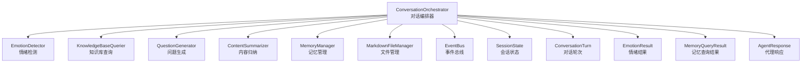
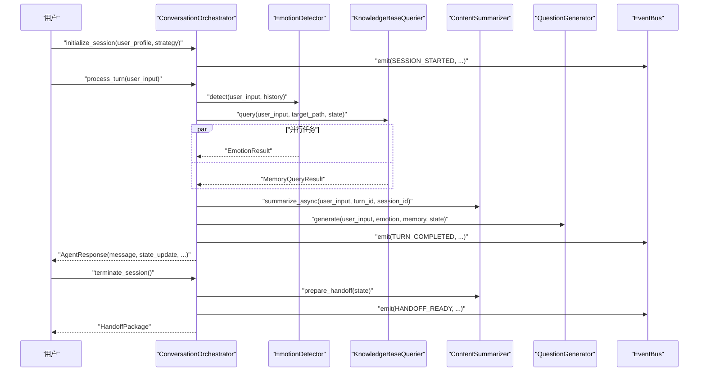
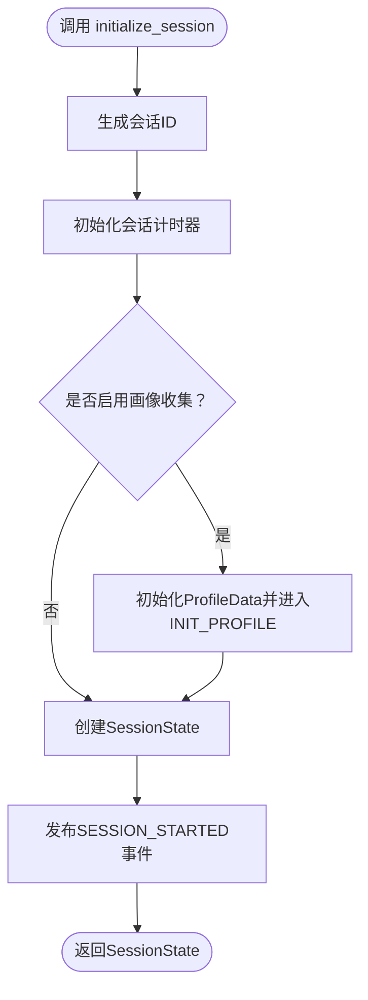
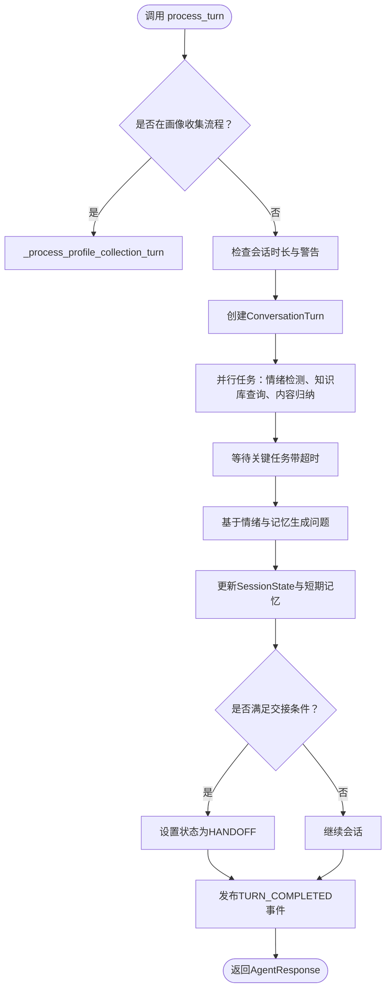
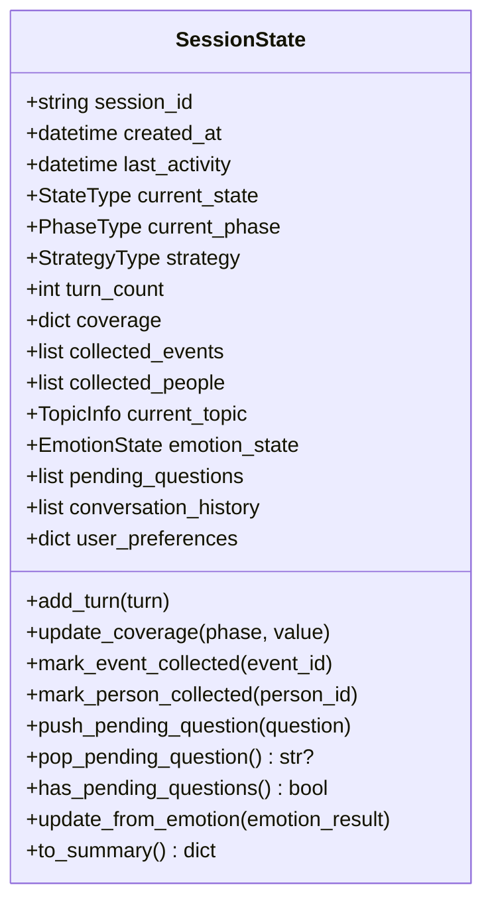
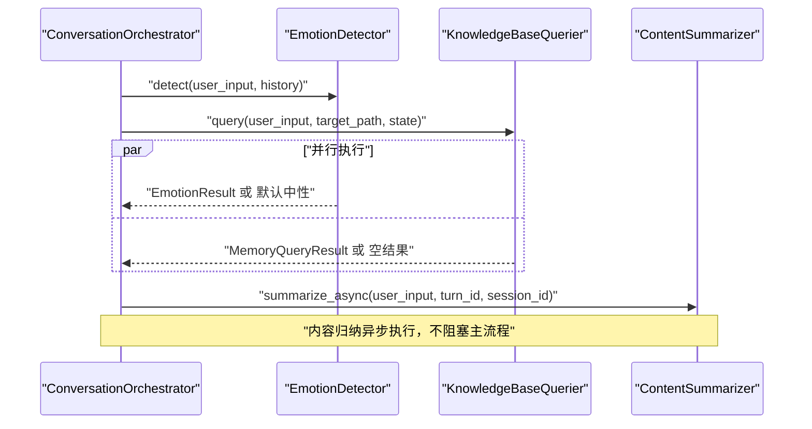
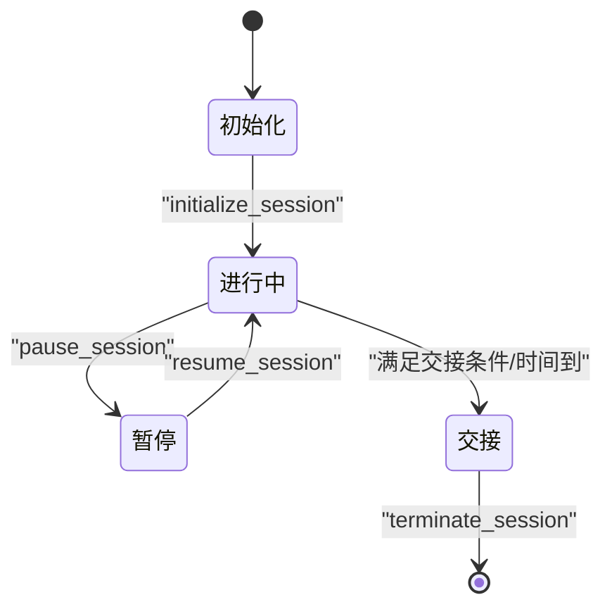
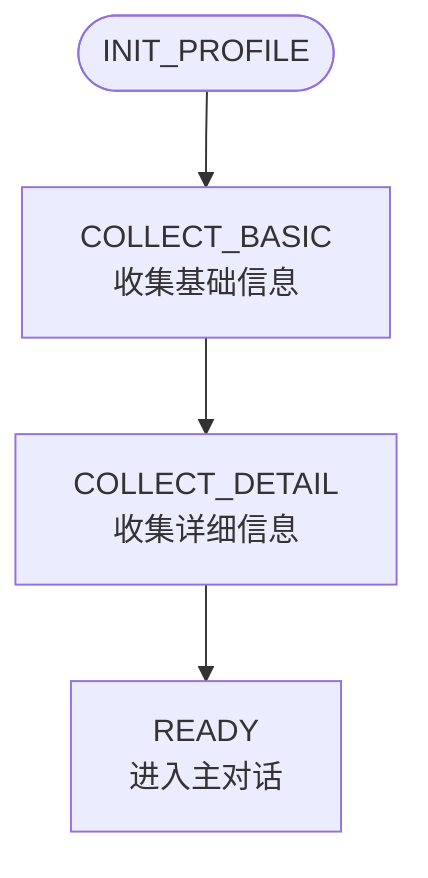
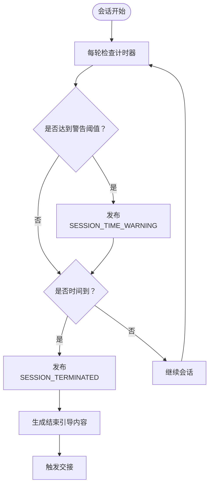
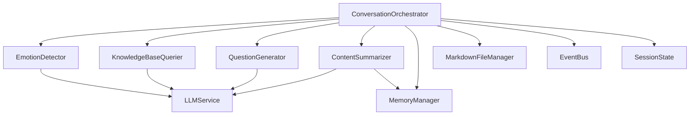

# 对话编排器核心

<cite>
**本文引用的文件**
- [conversation_orchestrator.py](file://src/core/conversation_orchestrator.py)
- [session_state.py](file://src/models/session_state.py)
- [state_type.py](file://src/enums/state_type.py)
- [phase_type.py](file://src/enums/phase_type.py)
- [emotion_type.py](file://src/enums/emotion_type.py)
- [emotion_detector.py](file://src/services/emotion_detector.py)
- [knowledge_base_querier.py](file://src/services/knowledge_base_querier.py)
- [content_summarizer.py](file://src/services/content_summarizer.py)
- [question_generator.py](file://src/services/question_generator.py)
- [profile_questions.py](file://src/config/profile_questions.py)
- [conversation_turn.py](file://src/models/conversation_turn.py)
- [emotion_result.py](file://src/models/emotion_result.py)
- [memory_query_result.py](file://src/models/memory_query_result.py)
- [agent_response.py](file://src/models/agent_response.py)
- [event_bus.py](file://src/core/event_bus.py)
</cite>

## 目录
1. [引言](#引言)
2. [项目结构](#项目结构)
3. [核心组件](#核心组件)
4. [架构总览](#架构总览)
5. [详细组件分析](#详细组件分析)
6. [依赖分析](#依赖分析)
7. [性能考虑](#性能考虑)
8. [故障排查指南](#故障排查指南)
9. [结论](#结论)
10. [附录](#附录)

## 引言
本文件面向“对话编排器”（ConversationOrchestrator）的使用者与维护者，系统化阐述其作为系统核心控制器的设计理念与实现细节。重点覆盖会话初始化流程、对话轮次处理机制、状态管理策略；异步任务调度与并行处理（情绪检测、知识库查询、内容归纳等）；会话生命周期管理（初始化、进行中、暂停、终止等状态转换）；画像收集流程（基础信息与详细信息的收集策略）；完整的API接口说明（initialize_session、process_turn、terminate_session等）；以及会话计时器的实现与时间管理机制。

## 项目结构
对话编排器位于核心层，协调多个服务与模型模块，形成清晰的分层架构：
- 控制层：ConversationOrchestrator 负责编排与状态管理
- 服务层：情绪检测、知识库查询、问题生成、内容归纳、记忆管理
- 数据层：会话状态、对话轮次、情绪结果、记忆查询结果、代理响应等模型
- 事件总线：解耦组件间通信，支持同步与异步订阅

图表来源
- [conversation_orchestrator.py:138-420](file://src/core/conversation_orchestrator.py#L138-L420)
- [emotion_detector.py:12-74](file://src/services/emotion_detector.py#L12-L74)
- [knowledge_base_querier.py:202-373](file://src/services/knowledge_base_querier.py#L202-L373)
- [content_summarizer.py:17-93](file://src/services/content_summarizer.py#L17-L93)
- [question_generator.py:12-74](file://src/services/question_generator.py#L12-L74)
- [session_state.py:24-139](file://src/models/session_state.py#L24-L139)
- [conversation_turn.py:14-52](file://src/models/conversation_turn.py#L14-L52)
- [emotion_result.py:6-57](file://src/models/emotion_result.py#L6-L57)
- [memory_query_result.py:23-81](file://src/models/memory_query_result.py#L23-L81)
- [agent_response.py:5-22](file://src/models/agent_response.py#L5-L22)
- [event_bus.py:40-182](file://src/core/event_bus.py#L40-L182)

章节来源
- [conversation_orchestrator.py:138-420](file://src/core/conversation_orchestrator.py#L138-L420)

## 核心组件
- 对话编排器（ConversationOrchestrator）
  - 职责：协调所有子Agent异步工作、管理对话状态流转、处理用户输入并生成回复、触发内容归纳与交接
  - 关键方法：initialize_session、process_turn、terminate_session、pause_session、prepare_handoff
- 会话状态（SessionState）
  - 职责：记录当前会话的所有状态信息、追踪对话进度与覆盖率、管理采集的事件与人物
- 模型与枚举
  - 对话轮次（ConversationTurn）、情绪结果（EmotionResult）、记忆查询结果（MemoryQueryResult）、代理响应（AgentResponse）
  - 状态类型（StateType）、阶段类型（PhaseType）、情绪类型（EmotionType）
- 服务组件
  - 情绪检测（EmotionDetector）、知识库查询（KnowledgeBaseQuerier）、问题生成（QuestionGenerator）、内容归纳（ContentSummarizer）
- 事件总线（EventBus）
  - 职责：发布/订阅模式的事件分发，支持同步与异步处理

章节来源
- [conversation_orchestrator.py:138-420](file://src/core/conversation_orchestrator.py#L138-L420)
- [session_state.py:24-139](file://src/models/session_state.py#L24-L139)
- [state_type.py:4-12](file://src/enums/state_type.py#L4-L12)
- [phase_type.py:4-10](file://src/enums/phase_type.py#L4-L10)
- [emotion_type.py:4-50](file://src/enums/emotion_type.py#L4-L50)
- [conversation_turn.py:14-52](file://src/models/conversation_turn.py#L14-L52)
- [emotion_result.py:6-57](file://src/models/emotion_result.py#L6-L57)
- [memory_query_result.py:23-81](file://src/models/memory_query_result.py#L23-L81)
- [agent_response.py:5-22](file://src/models/agent_response.py#L5-L22)
- [event_bus.py:40-182](file://src/core/event_bus.py#L40-L182)

## 架构总览
对话编排器采用“主控器 + 服务层 + 模型层 + 事件总线”的分层架构。主控器负责：
- 会话生命周期管理（初始化、进行中、暂停、终止）
- 并行异步任务调度（情绪检测、知识库查询、内容归纳）
- 状态更新与事件发布
- 交接包准备与会话结束引导

图表来源
- [conversation_orchestrator.py:198-401](file://src/core/conversation_orchestrator.py#L198-L401)
- [emotion_detector.py:39-73](file://src/services/emotion_detector.py#L39-L73)
- [knowledge_base_querier.py:257-373](file://src/services/knowledge_base_querier.py#L257-L373)
- [content_summarizer.py:43-93](file://src/services/content_summarizer.py#L43-L93)
- [question_generator.py:38-74](file://src/services/question_generator.py#L38-L74)
- [event_bus.py:108-171](file://src/core/event_bus.py#L108-L171)

## 详细组件分析

### 会话初始化流程
- 生成会话ID并初始化会话计时器
- 检查是否启用画像收集（首次会话则进入画像收集流程）
- 创建SessionState并发布SESSION_STARTED事件
- 返回初始化后的会话状态

图表来源
- [conversation_orchestrator.py:198-234](file://src/core/conversation_orchestrator.py#L198-L234)

章节来源
- [conversation_orchestrator.py:198-234](file://src/core/conversation_orchestrator.py#L198-L234)

### 对话轮次处理机制
- 检查是否处于画像收集流程，若是则走画像收集分支
- 检查会话时长：发出时间警告、或触发时间到处理
- 创建ConversationTurn并并行启动关键异步任务：
  - 情绪检测（带超时保护）
  - 知识库查询（带超时保护）
  - 内容归纳（异步延迟执行，不阻塞主流程）
- 基于情绪结果与知识库结果生成问题
- 更新SessionState、短期记忆、待追问队列
- 检查交接条件并发布TURN_COMPLETED事件
- 返回AgentResponse

图表来源
- [conversation_orchestrator.py:236-344](file://src/core/conversation_orchestrator.py#L236-L344)

章节来源
- [conversation_orchestrator.py:236-344](file://src/core/conversation_orchestrator.py#L236-L344)

### 状态管理策略
- 状态类型（StateType）：INIT、WARMUP、COLLECT、DEEPEN、REDIRECT、PAUSE、HANDOFF
- 阶段类型（PhaseType）：CHILDHOOD、YOUTH、YOUNG_ADULT、MIDDLE_AGE、ELDERLY
- SessionState维护：
  - 当前状态、当前阶段、策略
  - 对话轮数、覆盖率、已采集事件/人物
  - 当前话题、情绪状态、待追问问题
  - 对话历史、用户偏好
  - 提供add_turn、update_coverage、mark_event_collected、mark_person_collected、push/pop待追问、update_from_emotion、to_summary等方法

图表来源
- [session_state.py:24-139](file://src/models/session_state.py#L24-L139)
- [state_type.py:4-12](file://src/enums/state_type.py#L4-L12)
- [phase_type.py:4-10](file://src/enums/phase_type.py#L4-L10)

章节来源
- [session_state.py:24-139](file://src/models/session_state.py#L24-L139)
- [state_type.py:4-12](file://src/enums/state_type.py#L4-L12)
- [phase_type.py:4-10](file://src/enums/phase_type.py#L4-L10)

### 异步任务调度与并行处理
- 并行任务
  - 情绪检测：超时保护（默认3秒），失败时回退为中性情绪
  - 知识库查询：超时保护（默认5秒），失败时返回空结果
  - 内容归纳：异步延迟执行，不阻塞主流程，完成后由MemoryManager应用更新
- 超时与降级
  - 超时捕获后使用默认值，保证主流程稳定
- 事件驱动
  - 每轮完成后发布TURN_COMPLETED事件，供外部订阅

图表来源
- [conversation_orchestrator.py:269-284](file://src/core/conversation_orchestrator.py#L269-L284)
- [emotion_detector.py:39-73](file://src/services/emotion_detector.py#L39-L73)
- [knowledge_base_querier.py:257-373](file://src/services/knowledge_base_querier.py#L257-L373)
- [content_summarizer.py:43-93](file://src/services/content_summarizer.py#L43-L93)

章节来源
- [conversation_orchestrator.py:269-344](file://src/core/conversation_orchestrator.py#L269-L344)

### 会话生命周期管理
- 初始化：生成会话ID、初始化计时器、创建SessionState、发布SESSION_STARTED
- 进行中：process_turn循环，状态在COLLECT/DEEPEN/REDIRECT等之间流转
- 暂停：pause_session将状态置为PAUSE并发布SESSION_PAUSED
- 终止：terminate_session调用prepare_handoff，发布SESSION_TERMINATED并返回HandoffPackage
- 时间到：会话计时器触发后，发布SESSION_TERMINATED并返回结束引导内容

图表来源
- [conversation_orchestrator.py:391-414](file://src/core/conversation_orchestrator.py#L391-L414)
- [event_bus.py:108-171](file://src/core/event_bus.py#L108-L171)

章节来源
- [conversation_orchestrator.py:391-414](file://src/core/conversation_orchestrator.py#L391-L414)
- [event_bus.py:108-171](file://src/core/event_bus.py#L108-L171)

### 画像收集流程
- 状态机：INIT_PROFILE → COLLECT_BASIC → COLLECT_DETAIL → READY
- 基础信息收集：姓名、年龄、职业、出生地等必填项
- 详细信息收集：家庭状况、子女数量、居住安排、健康状况等
- 问题库：ProfileQuestionBank提供问题模板、过渡话术、字段映射
- 完成后保存画像并退出画像收集流程，进入主对话

图表来源
- [conversation_orchestrator.py:421-551](file://src/core/conversation_orchestrator.py#L421-L551)
- [profile_questions.py:3-94](file://src/config/profile_questions.py#L3-L94)

章节来源
- [conversation_orchestrator.py:421-551](file://src/core/conversation_orchestrator.py#L421-L551)
- [profile_questions.py:3-94](file://src/config/profile_questions.py#L3-L94)

### 会话计时器与时间管理
- SessionTiming记录开始时间、时长、警告阈值、是否已发出警告/时间到
- 提供获取已流逝时间、剩余时间、是否应警告、是否时间到的方法
- 在process_turn中周期性检查并发布SESSION_TIME_WARNING与SESSION_TERMINATED事件
- 支持时间到时生成结束引导内容并触发交接

图表来源
- [conversation_orchestrator.py:570-615](file://src/core/conversation_orchestrator.py#L570-L615)
- [conversation_orchestrator.py:57-94](file://src/core/conversation_orchestrator.py#L57-L94)

章节来源
- [conversation_orchestrator.py:57-94](file://src/core/conversation_orchestrator.py#L57-L94)
- [conversation_orchestrator.py:570-615](file://src/core/conversation_orchestrator.py#L570-L615)

### API接口说明
- initialize_session(user_profile: dict, strategy: StrategyType) -> SessionState
  - 功能：初始化会话，生成会话ID，创建SessionState，发布SESSION_STARTED事件
  - 参数：user_profile（用户偏好字典）、strategy（采访策略）
  - 返回：SessionState
- process_turn(user_input: str) -> AgentResponse
  - 功能：处理一轮对话，执行并行异步任务，生成问题，更新状态，发布TURN_COMPLETED事件
  - 参数：user_input（用户输入）
  - 返回：AgentResponse（包含message、state_update、should_pause、pause_reason、handoff_triggered）
- terminate_session() -> HandoffPackage
  - 功能：准备交接包并终止会话，发布SESSION_TERMINATED事件
  - 返回：HandoffPackage
- pause_session() -> None
  - 功能：将会话状态置为PAUSE并发布SESSION_PAUSED事件
- prepare_handoff() -> HandoffPackage
  - 功能：在终止前准备交接包，包含会话摘要、收集进度、已收集数据等
  - 返回：HandoffPackage

章节来源
- [conversation_orchestrator.py:198-401](file://src/core/conversation_orchestrator.py#L198-L401)

### 关键服务与模型
- 情绪检测（EmotionDetector）
  - detect(user_input, conversation_history) -> EmotionResult
  - 提供响应策略建议，支持降级为默认中性情绪
- 知识库查询（KnowledgeBaseQuerier）
  - query(user_input, target_path, state) -> MemoryQueryResult
  - 使用ReAct模式动态查询，支持list_files、read_file、follow_links、mark_suspected_file、get_exploration_report、has_visited等工具
- 问题生成（QuestionGenerator）
  - generate(user_input, emotion, memory, state, conversation_history?) -> str
  - 优先级：情绪响应 > 待追问问题 > 阶段切换 > 上下文生成
- 内容归纳（ContentSummarizer）
  - summarize_async(user_input, turn_id, session_id) -> SummaryContent?
  - prepare_handoff(state) -> SummaryContent
  - 构建记忆更新计划并应用

章节来源
- [emotion_detector.py:39-73](file://src/services/emotion_detector.py#L39-L73)
- [knowledge_base_querier.py:257-373](file://src/services/knowledge_base_querier.py#L257-L373)
- [question_generator.py:38-74](file://src/services/question_generator.py#L38-L74)
- [content_summarizer.py:43-143](file://src/services/content_summarizer.py#L43-L143)

## 依赖分析
- 组件耦合
  - ConversationOrchestrator依赖LLMService、MarkdownFileManager、MemoryRepository、MemoryManager、EventBus
  - 各服务模块通过LLMService与外部模型交互，降低对具体模型实现的耦合
- 直接与间接依赖
  - 直接：EmotionDetector、KnowledgeBaseQuerier、QuestionGenerator、ContentSummarizer
  - 间接：SessionState、ConversationTurn、EmotionResult、MemoryQueryResult、AgentResponse
- 事件解耦
  - 通过EventBus发布/订阅，支持同步与异步处理器，便于扩展与监控

图表来源
- [conversation_orchestrator.py:163-187](file://src/core/conversation_orchestrator.py#L163-L187)
- [emotion_detector.py:30-37](file://src/services/emotion_detector.py#L30-L37)
- [knowledge_base_querier.py:220-235](file://src/services/knowledge_base_querier.py#L220-L235)
- [question_generator.py:29-36](file://src/services/question_generator.py#L29-L36)
- [content_summarizer.py:35-42](file://src/services/content_summarizer.py#L35-L42)

章节来源
- [conversation_orchestrator.py:163-187](file://src/core/conversation_orchestrator.py#L163-L187)

## 性能考虑
- 异步并行：情绪检测、知识库查询并行执行，减少端到端延迟
- 超时保护：关键任务设置超时，失败时快速降级，保证稳定性
- 延迟归纳：内容归纳异步执行，避免阻塞主流程
- 事件总线：异步订阅处理器，不影响主流程响应
- 计时器：定期检查会话时长，及时发出警告与终止信号

## 故障排查指南
- 情绪检测失败
  - 现象：返回默认中性情绪
  - 排查：检查LLMService配置与模板、网络连接
- 知识库查询失败
  - 现象：返回空结果
  - 排查：确认target_path存在且为目录、工具权限、文件系统访问
- 会话超时
  - 现象：发布SESSION_TIME_WARNING与SESSION_TERMINATED
  - 排查：调整session_duration_minutes与time_warning_threshold配置
- 交接条件未触发
  - 现象：会话持续进行
  - 排查：检查handoff_turn_threshold与coverage阈值

章节来源
- [conversation_orchestrator.py:286-301](file://src/core/conversation_orchestrator.py#L286-L301)
- [knowledge_base_querier.py:280-294](file://src/services/knowledge_base_querier.py#L280-L294)
- [emotion_result.py:29-46](file://src/models/emotion_result.py#L29-L46)

## 结论
对话编排器通过清晰的分层架构、完善的异步并行机制、严格的超时与降级策略、以及事件驱动的解耦设计，实现了高效稳定的会话管理与内容生成。其会话生命周期管理、画像收集流程、计时与时间管理机制，为上层应用提供了可靠的基础能力。

## 附录
- 会话状态枚举与阶段枚举
  - StateType：INIT、WARMUP、COLLECT、DEEPEN、REDIRECT、PAUSE、HANDOFF
  - PhaseType：CHILDHOOD、YOUTH、YOUNG_ADULT、MIDDLE_AGE、ELDERLY
- 情绪类型与强度
  - EmotionType：正向、中性、负向、特殊
  - EmotionIntensity：LOW、MEDIUM、HIGH
  - EmotionValence：POSITIVE、NEUTRAL、NEGATIVE
  - SuggestedAction：CONTINUE、PAUSE、COMFORT、REDIRECT

章节来源
- [state_type.py:4-12](file://src/enums/state_type.py#L4-L12)
- [phase_type.py:4-10](file://src/enums/phase_type.py#L4-L10)
- [emotion_type.py:4-50](file://src/enums/emotion_type.py#L4-L50)