# 核心架构设计

<cite>
**本文引用的文件**
- [conversation_orchestrator.py](file://src/core/conversation_orchestrator.py)
- [event_bus.py](file://src/core/event_bus.py)
- [interview_agent.py](file://src/agents/interview_agent.py)
- [profile_collection_agent.py](file://src/agents/profile_collection_agent.py)
- [interview_session_agent.py](file://src/agents/interview_session_agent.py)
- [session_state.py](file://src/models/session_state.py)
- [state_type.py](file://src/enums/state_type.py)
- [phase_type.py](file://src/enums/phase_type.py)
- [llm_service.py](file://src/services/llm_service.py)
- [llm_config.py](file://src/config/llm_config.py)
- [memory_cache_tool.py](file://src/tools/memory_cache_tool.py)
- [memory_repository.py](file://src/storage/memory_repository.py)
- [README.md](file://README.md)
- [老人自传 Agent 协作架构.md](file://老人自传 Agent 协作架构.md)
</cite>

## 目录
1. [引言](#引言)
2. [项目结构](#项目结构)
3. [核心组件](#核心组件)
4. [架构概览](#架构概览)
5. [详细组件分析](#详细组件分析)
6. [依赖分析](#依赖分析)
7. [性能考虑](#性能考虑)
8. [故障排查指南](#故障排查指南)
9. [结论](#结论)
10. [附录](#附录)

## 引言
本文件面向“老人自传 Agent 系统”的核心架构设计，围绕多 Agent 协作架构、事件驱动机制、对话编排器（ConversationOrchestrator）的作用与实现、各 Agent 的职责与交互关系、分层架构设计等方面进行系统化阐述。文档旨在帮助开发者快速理解系统整体设计思路与关键实现路径。

## 项目结构
系统采用模块化分层组织，主要分为以下层次：
- 表示层：用户交互入口（会话管理器、Agent 服务主体）
- 业务逻辑层：对话编排器、状态管理、问题生成、情绪识别、知识库查询
- 服务层：统一 LLM 服务、记忆管理、内容归纳、工具集（缓存、查询、归档）
- 数据访问层：Markdown 文件管理、记忆仓库（短期/长期/画像记忆）、缓存

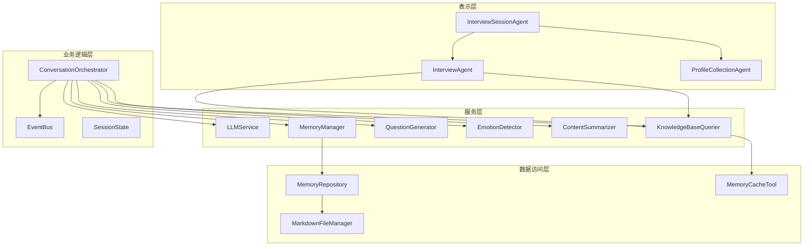

图表来源
- [interview_session_agent.py:33-111](file://src/agents/interview_session_agent.py#L33-L111)
- [conversation_orchestrator.py:163-197](file://src/core/conversation_orchestrator.py#L163-L197)
- [llm_service.py:32-89](file://src/services/llm_service.py#L32-L89)
- [memory_repository.py:40-88](file://src/storage/memory_repository.py#L40-L88)

章节来源
- [README.md:27-53](file://README.md#L27-L53)
- [老人自传 Agent 协作架构.md:9-101](file://老人自传 Agent 协作架构.md#L9-L101)

## 核心组件
- ConversationOrchestrator：对话主控器，负责会话初始化、状态流转、并行任务调度、事件发布、交接与终止。
- EventBus：事件总线，实现发布/订阅模式，解耦组件通信，支持同步与异步处理器。
- InterviewSessionAgent：会话生命周期管理器，负责新老用户识别、初始化流程、采访流程、结束引导与归档。
- InterviewAgent：主体采访 Agent，负责问题生成、知识库查询、缓存管理、时间控制与结束引导。
- ProfileCollectionAgent：用户画像采集 Agent，负责渐进式信息收集、结构化提取与初始化完成。
- SessionState：会话状态数据模型，贯穿会话生命周期，记录对话进度、覆盖率、采集内容与情绪状态。
- LLMService：统一的大模型调用入口，封装 LangChain 调用、Prompt 模板管理、结构化输出与重试机制。
- MemoryRepository：记忆仓储，统一管理短期/长期/画像记忆，提供事件、人物、时间线的存取与缓存。
- MemoryCacheTool：短期记忆缓存工具，支持关键词检索与追加更新。
- LLMConfig：大模型配置，支持多种提供商与环境变量加载。

章节来源
- [conversation_orchestrator.py:138-197](file://src/core/conversation_orchestrator.py#L138-L197)
- [event_bus.py:40-58](file://src/core/event_bus.py#L40-L58)
- [interview_session_agent.py:33-111](file://src/agents/interview_session_agent.py#L33-L111)
- [interview_agent.py:16-79](file://src/agents/interview_agent.py#L16-L79)
- [profile_collection_agent.py:14-63](file://src/agents/profile_collection_agent.py#L14-L63)
- [session_state.py:24-86](file://src/models/session_state.py#L24-L86)
- [llm_service.py:32-89](file://src/services/llm_service.py#L32-L89)
- [memory_repository.py:40-88](file://src/storage/memory_repository.py#L40-L88)
- [memory_cache_tool.py:8-27](file://src/tools/memory_cache_tool.py#L8-L27)
- [llm_config.py:10-41](file://src/config/llm_config.py#L10-L41)

## 架构概览
系统采用“多 Agent 协作 + 事件驱动 + 分层架构”的设计模式：
- 多 Agent 协作：InterviewSessionAgent 作为会话编排，内部协调 InterviewAgent 与 ProfileCollectionAgent；ConversationOrchestrator 作为问答引导层的主控器，协调多个服务组件。
- 事件驱动：EventBus 提供发布/订阅机制，组件通过事件解耦，支持异步处理与监控。
- 分层架构：表示层（Agent）、业务逻辑层（编排器/状态）、服务层（LLM/记忆/工具）、数据访问层（文件/仓库/缓存）。

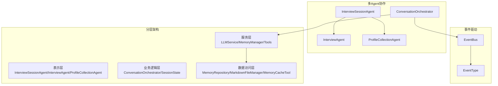

图表来源
- [interview_session_agent.py:33-111](file://src/agents/interview_session_agent.py#L33-L111)
- [conversation_orchestrator.py:163-197](file://src/core/conversation_orchestrator.py#L163-L197)
- [event_bus.py:10-38](file://src/core/event_bus.py#L10-L38)
- [llm_service.py:32-89](file://src/services/llm_service.py#L32-L89)
- [memory_repository.py:40-88](file://src/storage/memory_repository.py#L40-L88)

## 详细组件分析

### ConversationOrchestrator（对话编排器）
- 核心职责
  - 初始化会话与计时器，管理会话状态与画像数据。
  - 并行执行情绪识别、知识库查询与内容归纳，聚合结果生成问题。
  - 管理会话时长与时间警告，触发交接与终止。
  - 通过 EventBus 发布回合完成、会话开始、时间警告、交接就绪等事件。
- 关键实现
  - 并行任务：使用 asyncio.create_task 并设置超时保护，保障稳定性。
  - 画像收集：内置 ProfileCollectionState 状态机，支持基础与详细信息的渐进式收集。
  - 交接与终止：prepare_handoff/terminate_session 生成 HandoffPackage，包含会话摘要、覆盖率、收集数据与待追问问题。
- 与模型/服务的关系
  - 依赖 LLMService、EmotionDetector、KnowledgeBaseQuerier、QuestionGenerator、ContentSummarizer、MemoryManager、MarkdownFileManager、MemoryRepository。
  - 通过 SessionState 维护会话进度与覆盖率。

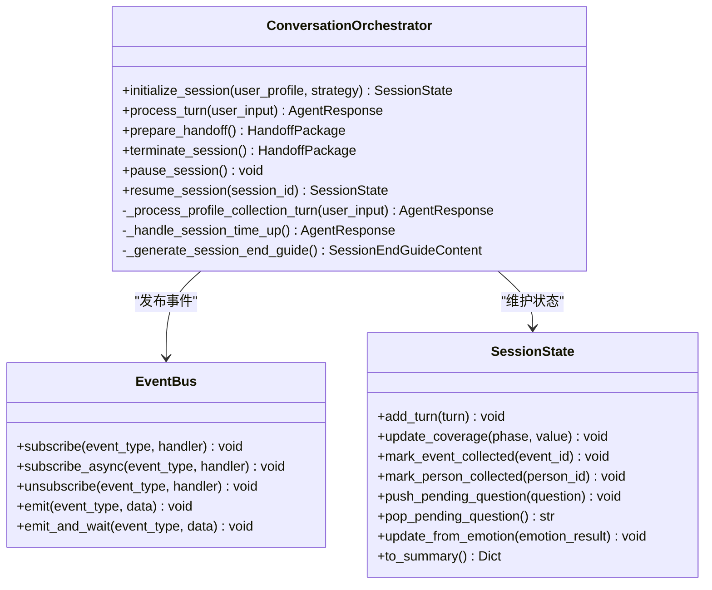

图表来源
- [conversation_orchestrator.py:138-401](file://src/core/conversation_orchestrator.py#L138-L401)
- [event_bus.py:40-171](file://src/core/event_bus.py#L40-L171)
- [session_state.py:24-139](file://src/models/session_state.py#L24-L139)

章节来源
- [conversation_orchestrator.py:138-401](file://src/core/conversation_orchestrator.py#L138-L401)
- [session_state.py:24-139](file://src/models/session_state.py#L24-L139)

### EventBus（事件总线）
- 设计目标：解耦组件通信，支持同步与异步处理器，提供 emit_and_wait 等高级能力。
- 事件类型：TURN_STARTED/TURN_COMPLETED、STATE_CHANGED/PHASE_CHANGED/STRATEGY_CHANGED、MEMORY_UPDATED/EVENT_CREATED/PERSON_CREATED、EMOTION_DETECTED/EMOTION_ALERT、HANDOFF_READY/HANDOFF_COMPLETED、SESSION_STARTED/SESSION_PAUSED/SESSION_TERMINATED。
- 使用模式：ConversationOrchestrator 等组件通过 emit 发布事件，外部监听器订阅处理。

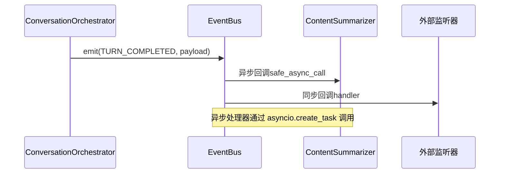

图表来源
- [event_bus.py:108-171](file://src/core/event_bus.py#L108-L171)
- [conversation_orchestrator.py:332-343](file://src/core/conversation_orchestrator.py#L332-L343)

章节来源
- [event_bus.py:10-171](file://src/core/event_bus.py#L10-L171)

### InterviewSessionAgent（会话管理）
- 职责：识别新老用户，启动初始化流程或恢复会话；在采访阶段管理时间与归档；结束阶段生成总结与归档。
- 关键流程：
  - 检查知识库结构完整性，存在则恢复会话并生成继续对话的 Prompt。
  - 不存在则启动 ProfileCollectionAgent，完成初始化后切换到 InterviewAgent。
  - 采访阶段：前5分钟归档一次，总时长15分钟（初始化5分钟 + 采访10分钟）。
  - 结束阶段：生成结束引导内容并归档对话记录。

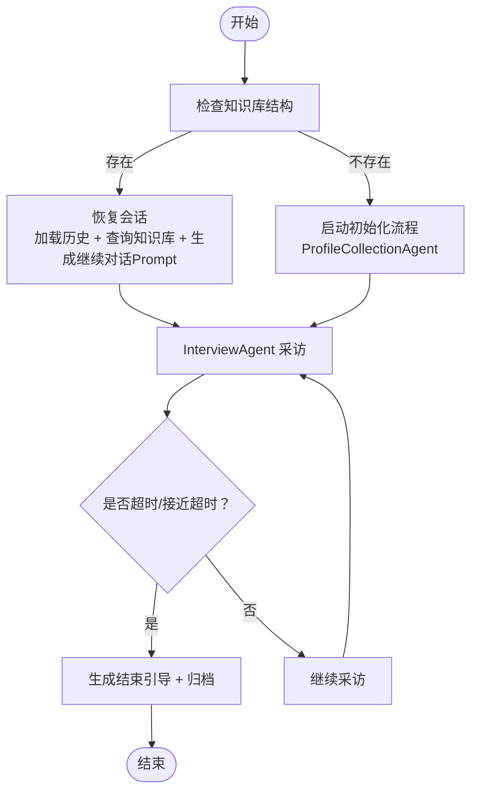

图表来源
- [interview_session_agent.py:112-177](file://src/agents/interview_session_agent.py#L112-L177)
- [interview_session_agent.py:178-242](file://src/agents/interview_session_agent.py#L178-L242)
- [interview_session_agent.py:243-340](file://src/agents/interview_session_agent.py#L243-L340)
- [interview_session_agent.py:341-392](file://src/agents/interview_session_agent.py#L341-L392)

章节来源
- [interview_session_agent.py:33-111](file://src/agents/interview_session_agent.py#L33-L111)
- [interview_session_agent.py:112-392](file://src/agents/interview_session_agent.py#L112-L392)

### InterviewAgent（主体采访）
- 职责：识别关键信息（事件/人物/时间点/地点），查询知识库并更新缓存，生成下一问题，管理时间控制与结束引导。
- 关键流程：
  - 识别关键信息 → 检查缓存 → 查询知识库 → 更新缓存 → 生成问题 → 记录对话 → 检查时间阈值。
  - 结束阶段：生成结束引导内容，保存会话总结并标记完成。

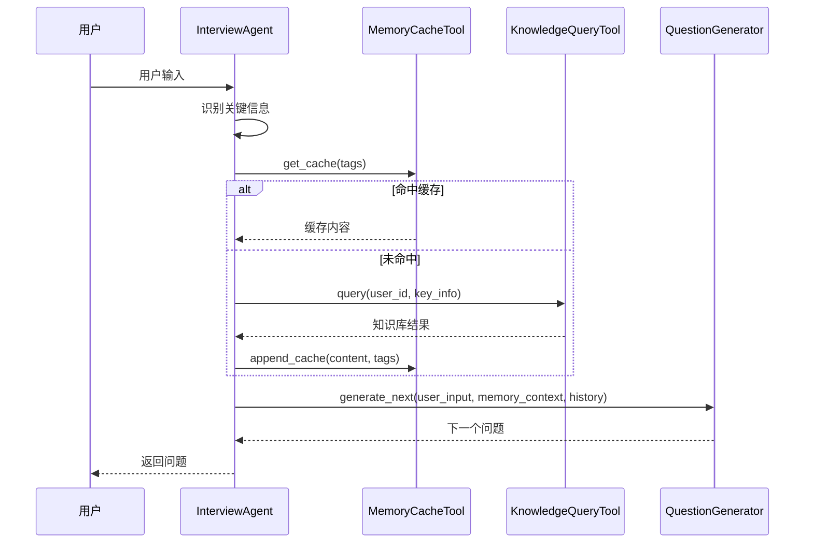

图表来源
- [interview_agent.py:115-184](file://src/agents/interview_agent.py#L115-L184)
- [interview_agent.py:186-243](file://src/agents/interview_agent.py#L186-L243)
- [memory_cache_tool.py:34-61](file://src/tools/memory_cache_tool.py#L34-L61)

章节来源
- [interview_agent.py:16-184](file://src/agents/interview_agent.py#L16-L184)
- [memory_cache_tool.py:8-89](file://src/tools/memory_cache_tool.py#L8-L89)

### ProfileCollectionAgent（画像采集）
- 职责：渐进式收集用户基础信息（14个字段），从用户回答中提取结构化信息，控制最大时长（5分钟）。
- 关键流程：欢迎语 → 提取信息 → 检查完成条件 → 生成下一个问题 → 记录对话 → 完成后返回。

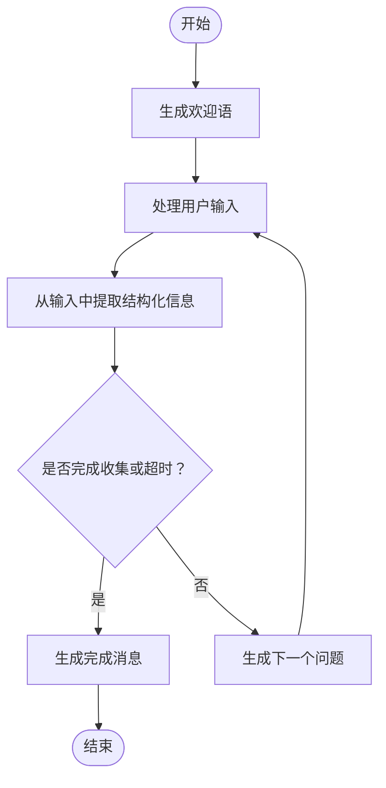

图表来源
- [profile_collection_agent.py:98-128](file://src/agents/profile_collection_agent.py#L98-L128)
- [profile_collection_agent.py:130-166](file://src/agents/profile_collection_agent.py#L130-L166)
- [profile_collection_agent.py:168-227](file://src/agents/profile_collection_agent.py#L168-L227)

章节来源
- [profile_collection_agent.py:14-166](file://src/agents/profile_collection_agent.py#L14-L166)

### SessionState（会话状态）
- 职责：记录会话的当前状态、阶段、策略、对话轮数、覆盖率、采集事件/人物、当前话题、情绪状态、待追问问题与对话历史。
- 方法：add_turn、update_coverage、mark_event_collected/mark_person_collected、push/pop 待追问问题、update_from_emotion、to_summary、get_recent_history。

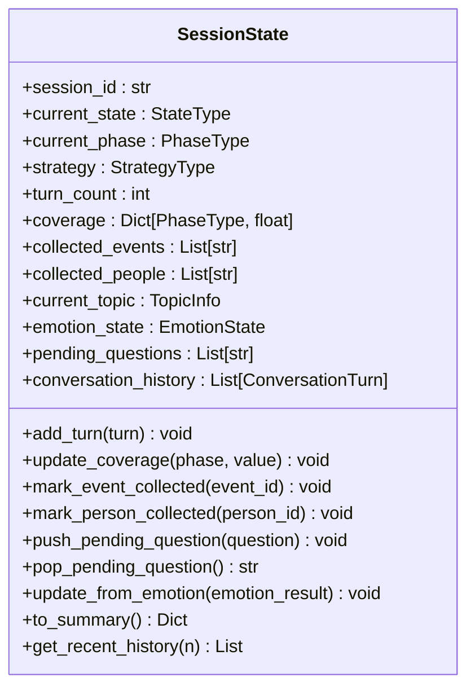

图表来源
- [session_state.py:24-139](file://src/models/session_state.py#L24-L139)
- [state_type.py:4-12](file://src/enums/state_type.py#L4-L12)
- [phase_type.py:4-10](file://src/enums/phase_type.py#L4-L10)

章节来源
- [session_state.py:24-139](file://src/models/session_state.py#L24-L139)

### LLMService（统一大模型服务）
- 职责：统一管理 LLM 调用、封装 LangChain、提供 Prompt 模板加载、结构化输出、重试与统计。
- 能力：invoke/invoke_with_template/invoke_structured、模板解析、令牌统计、重试机制。

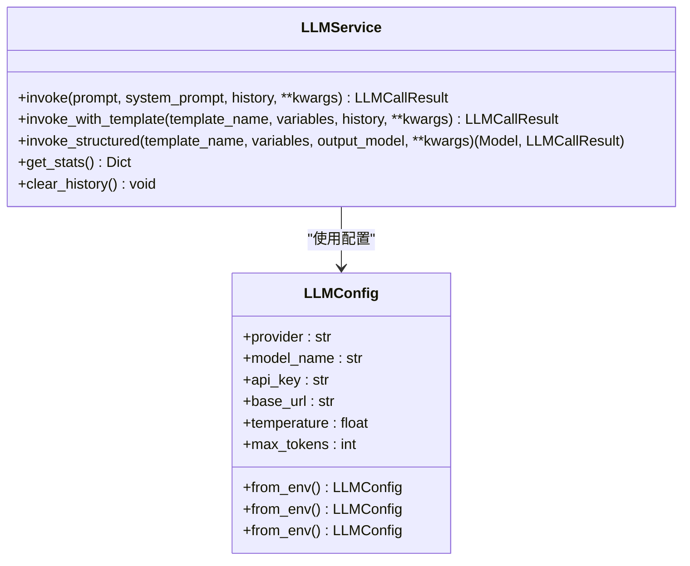

图表来源
- [llm_service.py:32-481](file://src/services/llm_service.py#L32-L481)
- [llm_config.py:10-120](file://src/config/llm_config.py#L10-L120)

章节来源
- [llm_service.py:32-481](file://src/services/llm_service.py#L32-L481)
- [llm_config.py:10-120](file://src/config/llm_config.py#L10-L120)

### MemoryRepository（记忆仓储）
- 职责：统一管理短期记忆（内存）、长期记忆（文件系统）、画像记忆（结构化），提供事件/人物/时间线的存取与缓存。
- 能力：短期记忆更新/获取/历史记录、LRU缓存、事件/人物保存与查询、时间线更新、历史对话记录读取。

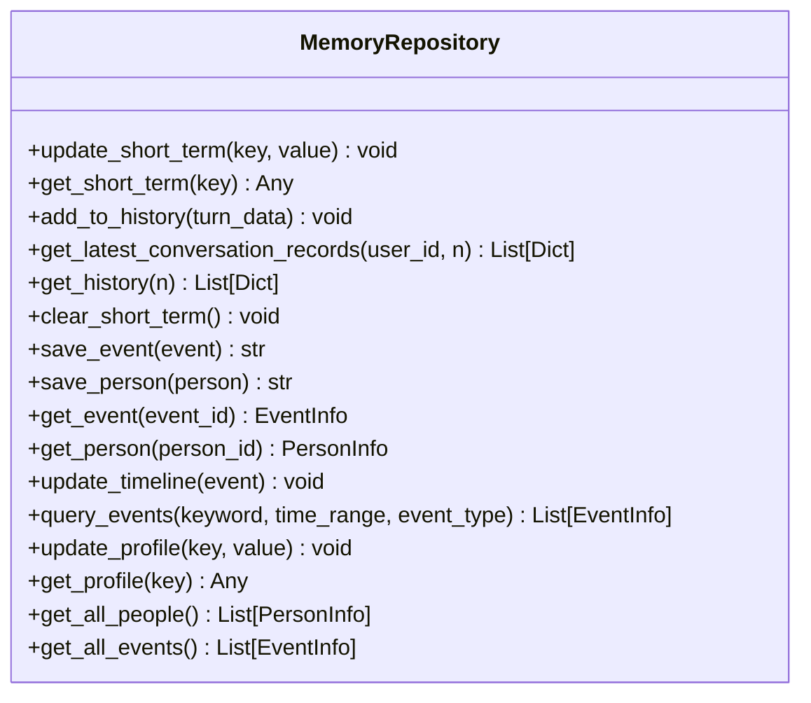

图表来源
- [memory_repository.py:40-359](file://src/storage/memory_repository.py#L40-L359)

章节来源
- [memory_repository.py:40-359](file://src/storage/memory_repository.py#L40-L359)

### MemoryCacheTool（缓存工具）
- 职责：会话级短期记忆缓存，支持关键词检索与追加更新。
- 能力：get_cache（按 tags 交集匹配）、append_cache（追加内容与标签）、clear_cache。

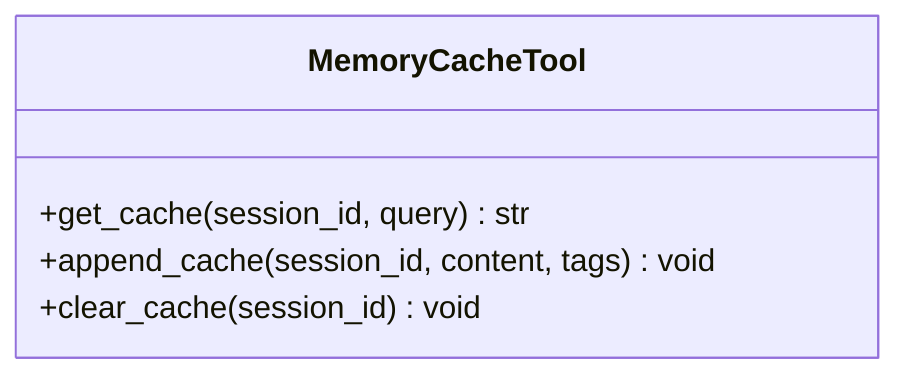

图表来源
- [memory_cache_tool.py:8-89](file://src/tools/memory_cache_tool.py#L8-L89)

章节来源
- [memory_cache_tool.py:8-89](file://src/tools/memory_cache_tool.py#L8-L89)

## 依赖分析
- 组件耦合与内聚
  - ConversationOrchestrator 与 EventBus 高内聚，通过事件解耦与其他组件通信。
  - InterviewSessionAgent 与 InterviewAgent/ProfileCollectionAgent 低耦合，通过会话状态与工具集协调。
  - LLMService 作为统一入口，被多个服务组件依赖，形成高扇出依赖。
- 外部依赖与集成点
  - LLM 提供商适配（OpenAI/DeepSeek/Anthropic），通过 LLMConfig 与 LLMService 解耦。
  - 知识库采用 Markdown 文件系统，MemoryRepository 作为统一抽象，便于替换存储后端。
- 潜在循环依赖
  - 当前文件结构未发现循环依赖；EventBus 与各组件通过接口解耦，避免循环引用。

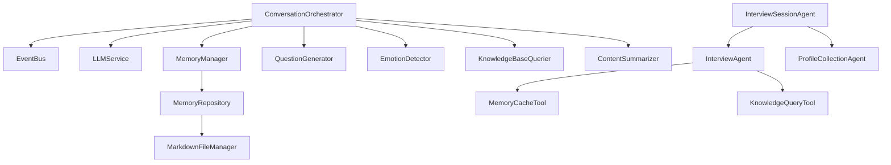

图表来源
- [conversation_orchestrator.py:163-197](file://src/core/conversation_orchestrator.py#L163-L197)
- [interview_session_agent.py:54-111](file://src/agents/interview_session_agent.py#L54-L111)
- [interview_agent.py:37-79](file://src/agents/interview_agent.py#L37-L79)
- [memory_repository.py:40-88](file://src/storage/memory_repository.py#L40-L88)

章节来源
- [conversation_orchestrator.py:163-197](file://src/core/conversation_orchestrator.py#L163-L197)
- [interview_session_agent.py:54-111](file://src/agents/interview_session_agent.py#L54-L111)
- [interview_agent.py:37-79](file://src/agents/interview_agent.py#L37-L79)
- [memory_repository.py:40-88](file://src/storage/memory_repository.py#L40-L88)

## 性能考虑
- 并行与超时：ConversationOrchestrator 对情绪识别、知识库查询与内容归纳采用并行任务与超时保护，避免阻塞。
- 缓存策略：MemoryCacheTool 支持关键词检索，减少重复知识库查询；MemoryRepository 使用 LRU 缓存加速事件/人物查询。
- 令牌与重试：LLMService 提供结构化输出与指数退避重试，降低失败率并统计令牌使用。
- I/O 优化：MemoryRepository 通过文件系统批量读取最新对话记录，避免全量扫描。

## 故障排查指南
- 事件总线异常
  - 现象：事件未被处理或异步处理器报错。
  - 排查：检查 EventBus 的订阅/取消订阅逻辑，确认异步处理器的异常捕获与日志记录。
- 会话超时与交接
  - 现象：会话在时间阈值触发后未正常结束或交接。
  - 排查：确认 SessionTiming 的计时逻辑、时间警告与时间到标志位，检查 _handle_session_time_up 与 prepare_handoff 的调用链。
- 知识库查询与缓存
  - 现象：知识库查询结果为空或缓存未命中。
  - 排查：检查 MemoryCacheTool 的 tags 匹配逻辑，确认 KnowledgeQueryTool 的查询参数与 MemoryRepository 的事件/人物索引。
- LLM 调用失败
  - 现象：大模型调用抛出异常或返回空结果。
  - 排查：查看 LLMService 的重试日志与结构化输出解析，确认 Prompt 模板加载与变量注入。

章节来源
- [event_bus.py:135-141](file://src/core/event_bus.py#L135-L141)
- [conversation_orchestrator.py:570-592](file://src/core/conversation_orchestrator.py#L570-L592)
- [memory_cache_tool.py:34-61](file://src/tools/memory_cache_tool.py#L34-L61)
- [llm_service.py:327-398](file://src/services/llm_service.py#L327-L398)

## 结论
本系统通过“多 Agent 协作 + 事件驱动 + 分层架构”实现了高效、可扩展的老人自传采集与整理流程。ConversationOrchestrator 作为问答引导层的核心，承担会话编排、状态控制与事件发布；InterviewSessionAgent 负责会话生命周期管理；InterviewAgent 与 ProfileCollectionAgent 分别处理采访与画像采集；LLMService、MemoryRepository、EventBus 等服务层组件提供统一能力与解耦通信。该设计既保证了模块内聚与职责清晰，又通过事件总线与工具集实现灵活扩展与稳定运行。

## 附录
- 相关文档与架构图
  - [README.md:27-53](file://README.md#L27-L53)
  - [老人自传 Agent 协作架构.md:9-101](file://老人自传 Agent 协作架构.md#L9-L101)